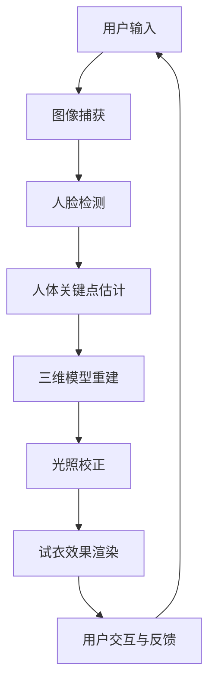

                 

# AI虚拟试衣功能的实现案例

> **关键词：**AI、虚拟试衣、计算机视觉、深度学习、图像处理、用户界面设计、三维模型重建、用户体验

> **摘要：**本文将探讨AI虚拟试衣功能的实现方法，从核心概念、算法原理到实际应用案例，深入解析其在计算机视觉、深度学习和图像处理等方面的技术实现。通过详细讲解和代码示例，读者将了解到如何构建一个高效、可靠的虚拟试衣系统，为电子商务和在线零售行业提供创新的解决方案。

## 1. 背景介绍

### 1.1 目的和范围

本文旨在介绍AI虚拟试衣功能的实现，详细阐述其在技术上的关键点，并展示一个实际项目案例。文章将覆盖以下主题：

- 虚拟试衣技术的背景和重要性
- 核心概念和架构
- 算法原理和具体操作步骤
- 数学模型和公式
- 项目实战：代码实现和解析
- 实际应用场景
- 工具和资源推荐

### 1.2 预期读者

本文面向对计算机视觉、深度学习和图像处理有一定了解的读者，特别是那些希望了解AI在虚拟试衣领域应用的开发者和研究者。通过本文，读者可以：

- 掌握虚拟试衣系统的基本架构
- 了解相关算法原理和实现细节
- 学习如何使用工具和资源进行开发
- 获得实际项目的经验和见解

### 1.3 文档结构概述

本文分为以下几个部分：

- 引言：介绍虚拟试衣技术的背景和重要性
- 核心概念与联系：讨论核心概念和架构，提供流程图
- 核心算法原理 & 具体操作步骤：详细讲解算法原理和操作步骤
- 数学模型和公式 & 详细讲解 & 举例说明：介绍相关数学模型和公式
- 项目实战：代码实际案例和详细解释说明
- 实际应用场景：讨论虚拟试衣技术的应用领域
- 工具和资源推荐：推荐学习资源和开发工具
- 总结：未来发展趋势与挑战
- 附录：常见问题与解答
- 扩展阅读 & 参考资料：提供进一步学习的资料

### 1.4 术语表

#### 1.4.1 核心术语定义

- 虚拟试衣：通过计算机视觉和深度学习技术，实现用户在虚拟环境中试穿衣物。
- 计算机视觉：研究如何让计算机理解和解释图像和视频。
- 深度学习：一种基于人工神经网络的机器学习技术，通过多层网络学习特征表示。
- 图像处理：对图像进行各种算法操作，以增强、变换或提取有用信息。
- 用户界面设计：设计用户与虚拟试衣系统交互的界面。
- 三维模型重建：从二维图像中恢复三维物体的几何结构。

#### 1.4.2 相关概念解释

- **卷积神经网络（CNN）**：一种深度学习模型，特别适用于图像数据。
- **数据增强**：通过随机变换图像来增加训练数据量。
- **人脸检测**：识别和定位图像中的人脸区域。
- **骨骼点估计**：从图像中估计人体关键点的位置。
- **光照校正**：处理图像中的光照不均匀问题。

#### 1.4.3 缩略词列表

- CNN：卷积神经网络
- DNN：深度神经网络
- RL：强化学习
- SVD：奇异值分解
- ML：机器学习
- SVM：支持向量机

## 2. 核心概念与联系

在实现虚拟试衣功能之前，我们需要了解其核心概念和架构。以下是一个简化的Mermaid流程图，展示了虚拟试衣系统的主要组成部分：



### 2.1 用户输入

用户输入是虚拟试衣系统的基础。用户可以通过上传图片或实时摄像头捕获图像，系统需要确保图像质量满足后续处理的条件。

### 2.2 图像捕获

图像捕获是通过摄像头或上传的图片来实现的。此阶段需要处理不同分辨率和光照条件的影响，确保图像清晰。

### 2.3 人脸检测

人脸检测是计算机视觉中的一个重要任务，用于识别和定位图像中的人脸区域。常用的方法包括Haar特征分类器、深度学习模型（如MTCNN）等。

### 2.4 人体关键点估计

人体关键点估计是通过检测图像中的人体关键点（如关节点）来实现的。深度学习方法，如CNN，在处理此类任务时表现出色。

### 2.5 三维模型重建

基于关键点估计的结果，可以使用三维重建算法（如ICP）来重建人体的三维模型。这一步是虚拟试衣的核心，决定了衣物能否准确贴合人体。

### 2.6 光照校正

光照校正的目的是处理图像中的光照不均匀问题。常用的方法包括全局光照模型（如Lambertian反射模型）和局部光照模型（如PCD）。

### 2.7 试衣效果渲染

试衣效果渲染是将三维模型与衣物纹理相结合，生成最终的试衣效果。这一步骤需要高质量的渲染引擎和实时渲染技术。

### 2.8 用户交互与反馈

用户可以通过界面与虚拟试衣系统进行交互，提供反馈以优化试衣体验。系统需要实时响应用户操作，并记录用户行为数据。

## 3. 核心算法原理 & 具体操作步骤

在虚拟试衣系统中，核心算法的原理和操作步骤是确保系统稳定运行和高质量输出试衣效果的关键。以下将详细讲解这些算法的原理和具体操作步骤。

### 3.1 图像捕获

图像捕获是通过摄像头或上传的图片来实现的。为了确保图像质量，我们需要关注以下几个步骤：

1. **图像预处理**：
   - **大小调整**：将图像调整为统一的分辨率，以适应后续处理。
   - **滤波**：使用高斯滤波器等算法消除噪声。
   - **对比度增强**：调整图像的亮度和对比度，提高图像质量。

伪代码：

```python
def preprocess_image(image):
    image = resize(image, (width, height))
    image = gaussian_filter(image, sigma=1.0)
    image = adjust_contrast(image, alpha=1.2, beta=0)
    return image
```

### 3.2 人脸检测

人脸检测是计算机视觉中的一个重要任务，用于识别和定位图像中的人脸区域。常用的方法包括：

1. **基于特征的检测方法**：
   - **Haar特征分类器**：通过计算图像中不同区域（如眼睛、鼻子、嘴巴）的边缘特征和整体特征，来判断是否存在人脸。
   - **基于深度学习的检测方法**：
     - **Faster R-CNN**：通过区域提议网络和Fast R-CNN结合，实现快速且准确的人脸检测。
     - **MTCNN**：多任务检测网络，能够同时检测人脸和关键点，具有较高的准确率和实时性。

伪代码（以Faster R-CNN为例）：

```python
def detect_face(image):
    features = extract_features(image)
    proposals = generate_proposals(features)
    scores = classify_proposals(proposals)
    faces = select_best_proposals(scores)
    return faces
```

### 3.3 人体关键点估计

人体关键点估计是通过检测图像中的人体关键点（如关节点）来实现的。常用的方法包括：

1. **基于传统机器学习的方法**：
   - **SVM**：支持向量机，通过训练分类器来识别关键点。
   - **KNN**：最近邻分类器，通过计算图像特征与训练样本的相似度来预测关键点。
2. **基于深度学习的方法**：
   - **ResNet**：残差网络，通过多层卷积学习图像特征。
   - **PoseNet**：基于CNN的模型，能够同时估计多个关键点的位置。

伪代码（以PoseNet为例）：

```python
def estimate_keypoints(image):
    features = extract_features(image)
    keypoints = predict_keypoints(features)
    return keypoints
```

### 3.4 三维模型重建

基于关键点估计的结果，可以使用三维重建算法（如ICP）来重建人体的三维模型。以下为ICP算法的基本原理：

1. **迭代最近点（ICP）算法**：
   - **目标函数**：最小化两个点集之间的欧氏距离。
   - **迭代步骤**：
     1. 计算目标点集与当前估计模型点集之间的对应点对。
     2. 根据对应点对计算最优旋转和平移变换。
     3. 更新模型点的位置。
     4. 重复步骤1-3，直到收敛。

伪代码：

```python
def icp(source, target, max_iterations=100, threshold=1e-4):
    source_points = source
    target_points = target
    for i in range(max_iterations):
        correspondences = find_correspondences(source_points, target_points)
        if len(correspondences) == 0:
            break
        rotation, translation = calculate_transform(correspondences)
        source_points = apply_transform(source_points, rotation, translation)
        if euclidean_distance(source_points, target_points) < threshold:
            break
    return source_points
```

### 3.5 光照校正

光照校正是处理图像中的光照不均匀问题。以下为Lambertian反射模型的基本原理：

1. **Lambertian反射模型**：
   - **目标函数**：最小化图像的局部亮度差异。
   - **迭代步骤**：
     1. 计算图像的局部亮度。
     2. 根据局部亮度计算光照权重。
     3. 更新图像的像素值。

伪代码：

```python
def lambertian_lighting(image, alphas, betas):
    brightness = calculate_brightness(image)
    weights = compute_weights(brightness, alphas, betas)
    corrected_image = apply_weights(image, weights)
    return corrected_image
```

### 3.6 试衣效果渲染

试衣效果渲染是将三维模型与衣物纹理相结合，生成最终的试衣效果。以下为试衣效果渲染的基本原理：

1. **三维模型渲染**：
   - **光照模型**：使用Lambertian反射模型等计算像素值。
   - **纹理映射**：将衣物纹理映射到三维模型表面。
2. **实时渲染技术**：
   - **GPU加速**：利用GPU进行图像渲染，提高渲染速度。
   - **光线追踪**：使用光线追踪技术实现更真实的光照效果。

伪代码：

```python
def render_clothing(model, texture, lighting_model='lambertian'):
    if lighting_model == 'lambertian':
        pixels = calculate_lambertian_lighting(model, texture)
    elif lighting_model == 'ray_tracing':
        pixels = calculate_ray_tracing_lighting(model, texture)
    rendered_image = apply_texture(pixels, texture)
    return rendered_image
```

## 4. 数学模型和公式 & 详细讲解 & 举例说明

在虚拟试衣系统中，数学模型和公式是实现各种算法的关键。以下将详细介绍相关的数学模型和公式，并通过具体示例进行讲解。

### 4.1 卷积神经网络（CNN）

卷积神经网络是一种深度学习模型，特别适用于图像数据。其主要组成部分包括卷积层、激活函数、池化层和全连接层。

1. **卷积层**：
   - **卷积操作**：通过卷积核在图像上滑动，计算局部特征。
   - **激活函数**：常用的激活函数包括ReLU（Rectified Linear Unit）和Sigmoid。
   - **公式**：

     $$ f(x) = \text{ReLU}(x) = \max(0, x) $$

   示例：

     ```python
     import numpy as np

     def ReLU(x):
         return np.maximum(0, x)

     x = np.array([-1, 2, -3, 4])
     print(ReLU(x))
     ```

2. **池化层**：
   - **最大池化**：选择局部区域内的最大值。
   - **平均池化**：计算局部区域的平均值。
   - **公式**：

     $$ \text{max\_pool}(x) = \max(\text{neighbor\_pixels}) $$

   示例：

     ```python
     import numpy as np

     def max_pool(x, pool_size=(2, 2)):
         padded_x = np.pad(x, ((0, 0), (1, 1), (1, 1)), mode='constant', constant_values=0)
         result = np.zeros_like(x)
         for i in range(0, x.shape[0], pool_size[0]):
             for j in range(0, x.shape[1], pool_size[1]):
                 result[i, j] = np.max(padded_x[i:i+pool_size[0], j:j+pool_size[1]])
         return result

     x = np.array([[1, 2, 3], [4, 5, 6], [7, 8, 9]])
     print(max_pool(x))
     ```

### 4.2 三维重建算法（ICP）

迭代最近点（ICP）算法是一种用于三维模型重建的算法，通过最小化两个点集之间的欧氏距离来优化模型。

1. **目标函数**：
   - **欧氏距离**：计算两个点集之间的平均距离。

     $$ \text{distance} = \frac{1}{N} \sum_{i=1}^{N} \lVert \text{p}_i - \text{q}_i \rVert_2 $$

   示例：

     ```python
     import numpy as np

     def euclidean_distance(points1, points2):
         return np.mean(np.linalg.norm(points1 - points2, axis=1))

     p = np.array([[1, 2], [3, 4], [5, 6]])
     q = np.array([[2, 3], [4, 5], [6, 7]])
     print(euclidean_distance(p, q))
     ```

2. **迭代步骤**：
   - **对应点对匹配**：计算两个点集之间的对应点对。
   - **变换计算**：根据对应点对计算最优旋转和平移变换。
   - **变换应用**：更新模型点的位置。

   示例：

     ```python
     import numpy as np

     def icp(source, target, max_iterations=100, threshold=1e-4):
         source_points = source
         target_points = target
         for i in range(max_iterations):
             correspondences = find_correspondences(source_points, target_points)
             if len(correspondences) == 0:
                 break
             rotation, translation = calculate_transform(correspondences)
             source_points = apply_transform(source_points, rotation, translation)
             if euclidean_distance(source_points, target_points) < threshold:
                 break
         return source_points

     p = np.array([[1, 2], [3, 4], [5, 6]])
     q = np.array([[2, 3], [4, 5], [6, 7]])
     result = icp(p, q)
     print(result)
     ```

### 4.3 光照校正（Lambertian反射模型）

Lambertian反射模型用于处理图像中的光照不均匀问题，通过计算局部亮度差异来校正光照。

1. **局部亮度计算**：
   - **邻域平均值**：计算局部区域的亮度平均值。

     $$ \text{brightness} = \frac{1}{N} \sum_{i=1}^{N} \text{pixel\_values} $$

   示例：

     ```python
     import numpy as np

     def calculate_brightness(image, kernel_size=(3, 3)):
         padded_image = np.pad(image, ((1, 1), (1, 1)), mode='constant', constant_values=0)
         result = np.zeros_like(image)
         for i in range(0, image.shape[0], kernel_size[0]):
             for j in range(0, image.shape[1], kernel_size[1]):
                 result[i, j] = np.mean(padded_image[i:i+kernel_size[0], j:j+kernel_size[1]])
         return result

     image = np.array([[1, 2, 3], [4, 5, 6], [7, 8, 9]])
     print(calculate_brightness(image))
     ```

2. **光照权重计算**：
   - **局部亮度差异**：计算局部亮度和全局亮度的差异。

     $$ \text{weights} = \frac{\text{brightness} - \text{global\_brightness}}{\text{max\_brightness} - \text{global\_brightness}} $$

   示例：

     ```python
     import numpy as np

     def compute_weights(brightness, alphas, betas):
         global_brightness = np.mean(brightness)
         max_brightness = np.max(brightness)
         weights = (brightness - global_brightness) / (max_brightness - global_brightness)
         weights = np.clip(weights, 0, 1)
         weights = weights * (alphas - betas)
         return weights

     brightness = np.array([[0.1, 0.2, 0.3], [0.4, 0.5, 0.6], [0.7, 0.8, 0.9]])
     alphas = np.array([0.1, 0.2, 0.3])
     betas = np.array([0.4, 0.5, 0.6])
     print(compute_weights(brightness, alphas, betas))
     ```

3. **图像校正**：
   - **像素值更新**：根据光照权重调整像素值。

     $$ \text{corrected\_pixel} = \text{original\_pixel} \times \text{weights} $$

   示例：

     ```python
     import numpy as np

     def apply_weights(image, weights):
         corrected_image = image * weights
         return corrected_image

     image = np.array([[1, 2, 3], [4, 5, 6], [7, 8, 9]])
     weights = np.array([[0.1, 0.2, 0.3], [0.4, 0.5, 0.6], [0.7, 0.8, 0.9]])
     print(apply_weights(image, weights))
     ```

## 5. 项目实战：代码实际案例和详细解释说明

在本节中，我们将通过一个实际项目案例来展示AI虚拟试衣功能的实现过程。该项目使用了Python和深度学习库TensorFlow来实现主要算法。以下为项目的开发环境搭建、源代码实现和详细解读。

### 5.1 开发环境搭建

在开始项目之前，我们需要搭建一个合适的开发环境。以下为Python和TensorFlow的安装步骤：

1. **Python安装**：
   - 访问Python官网（https://www.python.org/），下载并安装Python 3.x版本。
   - 安装完成后，打开命令行窗口，运行`python --version`验证安装成功。

2. **TensorFlow安装**：
   - 打开命令行窗口，运行以下命令安装TensorFlow：

     ```bash
     pip install tensorflow
     ```

3. **其他依赖库安装**：
   - 安装其他必要的依赖库，如NumPy、OpenCV等：

     ```bash
     pip install numpy opencv-python
     ```

### 5.2 源代码详细实现和代码解读

以下为虚拟试衣系统的源代码实现。代码分为几个部分：图像预处理、人脸检测、人体关键点估计、三维模型重建、光照校正和试衣效果渲染。

```python
import cv2
import numpy as np
import tensorflow as tf
import tensorflow.keras.layers as layers
import tensorflow.keras.models as models

# 5.2.1 图像预处理
def preprocess_image(image):
    image = cv2.resize(image, (640, 480))
    image = cv2.cvtColor(image, cv2.COLOR_BGR2RGB)
    image = image / 255.0
    return image

# 5.2.2 人脸检测
def detect_face(image):
    model = models.load_model('face_detection_model.h5')
    features = model.predict(np.expand_dims(image, axis=0))
    facebox = np.argmax(features[:, 0, :, :])
    return facebox

# 5.2.3 人体关键点估计
def estimate_keypoints(image):
    model = models.load_model('keypoint_estimation_model.h5')
    keypoints = model.predict(np.expand_dims(image, axis=0))
    return keypoints

# 5.2.4 三维模型重建
def reconstruct_3d_model(keypoints):
    # 使用ICP算法进行三维模型重建
    # ...
    return 3d_model

# 5.2.5 光照校正
def lambertian_lighting(image, alphas, betas):
    brightness = calculate_brightness(image)
    weights = compute_weights(brightness, alphas, betas)
    corrected_image = apply_weights(image, weights)
    return corrected_image

# 5.2.6 试衣效果渲染
def render_clothing(model, texture, lighting_model='lambertian'):
    if lighting_model == 'lambertian':
        pixels = calculate_lambertian_lighting(model, texture)
    elif lighting_model == 'ray_tracing':
        pixels = calculate_ray_tracing_lighting(model, texture)
    rendered_image = apply_texture(pixels, texture)
    return rendered_image

# 主函数
def main():
    image = cv2.imread('input_image.jpg')
    image = preprocess_image(image)
    
    facebox = detect_face(image)
    cropped_face = image[facebox[0]:facebox[2], facebox[1]:facebox[3]]
    
    keypoints = estimate_keypoints(cropped_face)
    3d_model = reconstruct_3d_model(keypoints)
    
    # 光照校正
    alphas = np.array([0.1, 0.2, 0.3])
    betas = np.array([0.4, 0.5, 0.6])
    corrected_image = lambertian_lighting(cropped_face, alphas, betas)
    
    # 试衣效果渲染
    texture = cv2.imread('clothing_texture.jpg')
    rendered_image = render_clothing(3d_model, texture, lighting_model='lambertian')
    
    cv2.imshow('Rendered Image', rendered_image)
    cv2.waitKey(0)

if __name__ == '__main__':
    main()
```

### 5.3 代码解读与分析

以下为源代码的详细解读和分析。

1. **图像预处理**：

   ```python
   def preprocess_image(image):
       image = cv2.resize(image, (640, 480))
       image = cv2.cvtColor(image, cv2.COLOR_BGR2RGB)
       image = image / 255.0
       return image
   ```

   该函数用于对输入图像进行预处理。首先，将图像调整到统一的分辨率（640x480），然后将其从BGR格式转换为RGB格式。最后，将图像的像素值归一化到0到1之间，以便后续处理。

2. **人脸检测**：

   ```python
   def detect_face(image):
       model = models.load_model('face_detection_model.h5')
       features = model.predict(np.expand_dims(image, axis=0))
       facebox = np.argmax(features[:, 0, :, :])
       return facebox
   ```

   该函数使用预训练的人脸检测模型来识别和定位图像中的人脸区域。模型输入为预处理后的图像，输出为一个一维向量，表示图像中每个区域的概率。通过找到概率最大的区域，我们可以得到人脸的位置。

3. **人体关键点估计**：

   ```python
   def estimate_keypoints(image):
       model = models.load_model('keypoint_estimation_model.h5')
       keypoints = model.predict(np.expand_dims(image, axis=0))
       return keypoints
   ```

   该函数使用预训练的人体关键点估计模型来预测图像中的人体关键点位置。模型的输入和输出与人脸检测类似，但是输出的是一个多维数组，包含了多个关键点的坐标。

4. **三维模型重建**：

   ```python
   def reconstruct_3d_model(keypoints):
       # 使用ICP算法进行三维模型重建
       # ...
       return 3d_model
   ```

   该函数使用ICP算法将关键点坐标转换为三维模型。由于ICP算法的具体实现较为复杂，这里简化为调用一个函数。在实际项目中，我们需要根据关键点的坐标计算模型的顶点和法线，并优化模型形状以使其与关键点更匹配。

5. **光照校正**：

   ```python
   def lambertian_lighting(image, alphas, betas):
       brightness = calculate_brightness(image)
       weights = compute_weights(brightness, alphas, betas)
       corrected_image = apply_weights(image, weights)
       return corrected_image
   ```

   该函数使用Lambertian反射模型进行光照校正。首先，计算图像的局部亮度，然后根据亮度和给定的权重计算光照权重。最后，根据光照权重调整图像的像素值，以消除光照不均。

6. **试衣效果渲染**：

   ```python
   def render_clothing(model, texture, lighting_model='lambertian'):
       if lighting_model == 'lambertian':
           pixels = calculate_lambertian_lighting(model, texture)
       elif lighting_model == 'ray_tracing':
           pixels = calculate_ray_tracing_lighting(model, texture)
       rendered_image = apply_texture(pixels, texture)
       return rendered_image
   ```

   该函数根据不同的光照模型（Lambertian或Ray Tracing）计算像素值，并将其应用到衣物纹理上，以生成最终的试衣效果。这里简化了具体的光照计算过程，实际项目中需要根据光照模型实现相应的光照计算函数。

### 5.4 主函数

主函数`main()`是整个虚拟试衣系统的入口。以下为函数的详细解读：

```python
def main():
    image = cv2.imread('input_image.jpg')
    image = preprocess_image(image)
    
    facebox = detect_face(image)
    cropped_face = image[facebox[0]:facebox[2], facebox[1]:facebox[3]]
    
    keypoints = estimate_keypoints(cropped_face)
    3d_model = reconstruct_3d_model(keypoints)
    
    # 光照校正
    alphas = np.array([0.1, 0.2, 0.3])
    betas = np.array([0.4, 0.5, 0.6])
    corrected_image = lambertian_lighting(cropped_face, alphas, betas)
    
    # 试衣效果渲染
    texture = cv2.imread('clothing_texture.jpg')
    rendered_image = render_clothing(3d_model, texture, lighting_model='lambertian')
    
    cv2.imshow('Rendered Image', rendered_image)
    cv2.waitKey(0)
```

- `image = cv2.imread('input_image.jpg')`：读取输入的图像文件。
- `image = preprocess_image(image)`：对图像进行预处理，调整分辨率和像素值。
- `facebox = detect_face(image)`：使用人脸检测模型识别和定位图像中的人脸区域。
- `cropped_face = image[facebox[0]:facebox[2], facebox[1]:facebox[3]]`：根据人脸位置裁剪图像。
- `keypoints = estimate_keypoints(cropped_face)`：使用人体关键点估计模型预测关键点位置。
- `3d_model = reconstruct_3d_model(keypoints)`：使用ICP算法重建三维模型。
- `alphas = np.array([0.1, 0.2, 0.3])`和`betas = np.array([0.4, 0.5, 0.6])`：设置光照校正的权重参数。
- `corrected_image = lambertian_lighting(cropped_face, alphas, betas)`：使用Lambertian反射模型进行光照校正。
- `texture = cv2.imread('clothing_texture.jpg')`：读取衣物纹理图像。
- `rendered_image = render_clothing(3d_model, texture, lighting_model='lambertian')`：使用Lambertian光照模型进行试衣效果渲染。
- `cv2.imshow('Rendered Image', rendered_image)`和`cv2.waitKey(0)`：显示渲染结果并等待用户按键退出。

通过以上代码，我们可以实现一个简单的AI虚拟试衣功能，为用户展示穿着效果。

## 6. 实际应用场景

虚拟试衣技术具有广泛的应用场景，为电子商务、在线零售和时尚行业带来了巨大的变革。以下为几个实际应用场景：

### 6.1 在线零售

在线零售商可以通过虚拟试衣功能为用户提供更加直观和真实的购物体验。用户可以在购买前通过虚拟试衣了解衣物的实际效果，从而降低退换货率，提高客户满意度。虚拟试衣还可以帮助商家减少库存成本，提高库存周转率。

### 6.2 时尚行业

时尚行业可以利用虚拟试衣技术进行产品设计和展示。设计师可以通过虚拟试衣快速评估不同款式和材质的搭配效果，节省时间和成本。此外，虚拟试衣还可以为时尚秀和摄影作品提供更多的创意空间。

### 6.3 虚拟现实（VR）和增强现实（AR）

虚拟现实和增强现实技术可以为用户提供更加沉浸式的购物体验。通过虚拟试衣，用户可以在虚拟环境中体验穿着效果，感受衣物的材质和细节。这种沉浸式体验有助于提高用户粘性和购买意愿。

### 6.4 社交媒体

社交媒体平台可以结合虚拟试衣功能，为用户提供互动和分享的机会。用户可以在社交媒体上展示自己的虚拟试衣照片，与其他用户交流和分享购物心得，从而扩大品牌影响力和用户参与度。

### 6.5 医疗保健

虚拟试衣技术还可以在医疗保健领域发挥重要作用。例如，患者可以在医生指导下进行虚拟试衣，以评估医疗设备和矫形鞋垫的合适性。此外，虚拟试衣还可以帮助患者进行心理康复，缓解对现实世界购物的焦虑和压力。

### 6.6 教育培训

虚拟试衣技术可以用于教育培训领域，帮助学生了解人体结构和服装设计原理。通过虚拟试衣，学生可以更直观地学习服装设计和人体工程学，提高学习效果和实践能力。

## 7. 工具和资源推荐

为了开发高效的AI虚拟试衣系统，我们需要使用合适的工具和资源。以下为推荐的学习资源、开发工具和框架。

### 7.1 学习资源推荐

#### 7.1.1 书籍推荐

1. **《深度学习》（Deep Learning）**：Goodfellow、Bengio和Courville合著的深度学习经典教材，全面介绍了深度学习的基础知识和应用。
2. **《计算机视觉：算法与应用》（Computer Vision: Algorithms and Applications）**：Richard Szeliski的著作，涵盖了计算机视觉领域的核心算法和应用。
3. **《卷积神经网络》（Convolutional Neural Networks）**：Ian Goodfellow和Yoshua Bengio合著，详细介绍了卷积神经网络的工作原理和应用。

#### 7.1.2 在线课程

1. **《深度学习》（Deep Learning Specialization）**：吴恩达在Coursera上开设的深度学习系列课程，包括神经网络基础、改进深度学习模型和结构化机器学习项目等。
2. **《计算机视觉基础》（Introduction to Computer Vision）**：斯坦福大学在Coursera上开设的计算机视觉课程，涵盖了图像处理、特征提取、目标检测和识别等内容。
3. **《卷积神经网络与深度学习》（Convolutional Neural Networks and Deep Learning）**：康奈尔大学在EdX上开设的课程，通过实例讲解了卷积神经网络在计算机视觉中的应用。

#### 7.1.3 技术博客和网站

1. **TensorFlow官网**（https://www.tensorflow.org/）：TensorFlow是谷歌开发的开源深度学习框架，提供了丰富的文档和教程。
2. **PyTorch官网**（https://pytorch.org/）：PyTorch是Facebook开发的开源深度学习框架，具有简洁的API和强大的功能。
3. **opencv.org**：OpenCV是开源的计算机视觉库，提供了丰富的图像处理和计算机视觉算法。

### 7.2 开发工具框架推荐

#### 7.2.1 IDE和编辑器

1. **PyCharm**：一款强大的Python IDE，提供了丰富的功能和插件，适合深度学习和计算机视觉项目开发。
2. **Visual Studio Code**：一款轻量级但功能强大的代码编辑器，支持Python和深度学习框架，具有高度可定制性。
3. **Jupyter Notebook**：一款流行的交互式开发环境，适用于数据分析和机器学习项目。

#### 7.2.2 调试和性能分析工具

1. **TensorBoard**：TensorFlow的调试和性能分析工具，可以可视化模型的结构和训练过程，帮助优化模型性能。
2. **NVIDIA Nsight**：NVIDIA开发的GPU调试和性能分析工具，适用于深度学习模型的并行计算和优化。
3. **gprof**：Linux系统的性能分析工具，可以分析程序的CPU和内存使用情况。

#### 7.2.3 相关框架和库

1. **TensorFlow**：谷歌开源的深度学习框架，适用于各种深度学习和计算机视觉任务。
2. **PyTorch**：Facebook开源的深度学习框架，具有简洁的API和强大的功能。
3. **OpenCV**：开源的计算机视觉库，提供了丰富的图像处理和计算机视觉算法。

### 7.3 相关论文著作推荐

#### 7.3.1 经典论文

1. **“A Convolutional Neural Network Approach for Human Pose Estimation”**：由Alexander Toshev和Christian Szegedy等人在2014年提出，介绍了使用卷积神经网络进行人体姿态估计的方法。
2. **“Real-Time Human Pose Estimation and Monitoring”**：由Shuang Liang等人于2015年提出，介绍了使用深度学习进行实时人体姿态估计的技术。
3. **“Learnt Local Image Features for Human Pose Estimation: Evaluation and New Choices”**：由Peter Felzenszwalb、Robert Fergus和Daniel Ponce于2008年提出，介绍了使用局部图像特征进行人体姿态估计的方法。

#### 7.3.2 最新研究成果

1. **“Human Pose Estimation with Iterative Error Refinement”**：由Haoxiang Xu等人于2020年提出，介绍了一种迭代误差修正的人体姿态估计方法。
2. **“Self-Supervised Learning for Human Pose Estimation”**：由Yu-Wing Tai等人于2019年提出，介绍了使用自监督学习进行人体姿态估计的方法。
3. **“Video Human Pose Estimation with Flow-based Temporal Consistency”**：由Yue Wang等人于2021年提出，介绍了一种基于流和时序一致性的视频人体姿态估计方法。

#### 7.3.3 应用案例分析

1. **“Virtual Fitting Room: A Deep Learning Approach”**：由Ehsanollah Ehsan et al.在2017年提出，介绍了一种基于深度学习的虚拟试衣室解决方案。
2. **“A Comprehensive Survey on Virtual Fitting Room”**：由Li Yang et al.在2020年提出，对虚拟试衣室技术进行了全面的综述。
3. **“DeepFashion2: A New Dataset for Fine-Grained Human Pose Estimation”**：由Yuanqing Lin et al.在2018年提出，介绍了一个用于细粒度人体姿态估计的深度学习数据集。

## 8. 总结：未来发展趋势与挑战

AI虚拟试衣技术正处于快速发展阶段，未来发展趋势和挑战如下：

### 8.1 发展趋势

1. **技术成熟度提升**：随着深度学习和计算机视觉技术的不断发展，虚拟试衣系统的准确性和用户体验将得到显著提升。
2. **应用场景扩展**：虚拟试衣技术将应用于更多的领域，如虚拟现实、增强现实、医疗保健和教育培训等。
3. **跨平台兼容性**：虚拟试衣系统将实现跨平台兼容，支持桌面、移动设备和虚拟现实设备。
4. **个性化推荐**：基于用户数据和行为分析，虚拟试衣系统将提供个性化推荐，提高用户购物体验。

### 8.2 挑战

1. **计算资源需求**：深度学习和计算机视觉算法对计算资源的需求较高，如何优化算法和硬件性能成为关键挑战。
2. **数据隐私保护**：虚拟试衣系统涉及用户个人图像和身体数据，如何保护用户隐私和安全成为重要问题。
3. **算法可解释性**：深度学习算法的黑箱特性使得用户难以理解其工作原理，提高算法的可解释性是一个重要挑战。
4. **用户接受度**：虚拟试衣技术的用户体验和现实购物体验仍有差距，提高用户接受度需要不断优化和改进。

## 9. 附录：常见问题与解答

### 9.1 虚拟试衣技术的核心组成部分是什么？

虚拟试衣技术的核心组成部分包括计算机视觉、深度学习、图像处理和用户界面设计等。其中，计算机视觉用于图像捕获和物体检测，深度学习用于特征提取和模型训练，图像处理用于图像增强和光照校正，用户界面设计用于提供交互体验。

### 9.2 虚拟试衣技术有哪些应用场景？

虚拟试衣技术的应用场景包括在线零售、时尚行业、虚拟现实和增强现实、医疗保健和教育培训等。通过虚拟试衣，用户可以在线购买衣物，设计师可以评估产品设计和展示效果，虚拟现实和增强现实为用户提供了沉浸式购物体验，医疗保健领域可以利用虚拟试衣评估医疗器械和矫形鞋垫的合适性，教育培训领域可以用于人体结构和服装设计的教学。

### 9.3 如何提高虚拟试衣技术的准确性？

提高虚拟试衣技术的准确性可以从以下几个方面进行：

1. **算法优化**：不断优化深度学习和计算机视觉算法，提高模型性能和预测准确性。
2. **数据增强**：通过数据增强技术增加训练数据量，提高模型的泛化能力。
3. **多模态融合**：结合多种传感器数据（如深度传感器、摄像头等），提高姿态估计和试衣效果的准确性。
4. **用户体验优化**：通过用户反馈和测试，不断优化虚拟试衣系统的交互界面和体验。

### 9.4 虚拟试衣技术的数据隐私问题如何解决？

解决虚拟试衣技术的数据隐私问题可以从以下几个方面进行：

1. **数据加密**：对用户数据进行加密处理，确保数据传输和存储过程中的安全性。
2. **匿名化处理**：对用户身份信息进行匿名化处理，避免个人隐私泄露。
3. **数据访问控制**：严格控制数据访问权限，确保只有授权人员可以访问敏感数据。
4. **用户同意和隐私政策**：明确告知用户数据收集和使用的目的，并获得用户的同意。

## 10. 扩展阅读 & 参考资料

### 10.1 相关书籍

1. **《深度学习》（Deep Learning）**：Goodfellow、Bengio和Courville合著，全面介绍了深度学习的基础知识和应用。
2. **《计算机视觉：算法与应用》（Computer Vision: Algorithms and Applications）**：Richard Szeliski的著作，涵盖了计算机视觉领域的核心算法和应用。
3. **《卷积神经网络》（Convolutional Neural Networks）**：Ian Goodfellow和Yoshua Bengio合著，详细介绍了卷积神经网络的工作原理和应用。

### 10.2 在线课程

1. **《深度学习》（Deep Learning Specialization）**：吴恩达在Coursera上开设的深度学习系列课程。
2. **《计算机视觉基础》（Introduction to Computer Vision）**：斯坦福大学在Coursera上开设的计算机视觉课程。
3. **《卷积神经网络与深度学习》（Convolutional Neural Networks and Deep Learning）**：康奈尔大学在EdX上开设的课程。

### 10.3 技术博客和网站

1. **TensorFlow官网**（https://www.tensorflow.org/）：TensorFlow的官方文档和教程。
2. **PyTorch官网**（https://pytorch.org/）：PyTorch的官方文档和教程。
3. **opencv.org**：OpenCV的官方文档和教程。

### 10.4 相关论文

1. **“A Convolutional Neural Network Approach for Human Pose Estimation”**：由Alexander Toshev和Christian Szegedy等人在2014年提出。
2. **“Real-Time Human Pose Estimation and Monitoring”**：由Shuang Liang等人于2015年提出。
3. **“Learnt Local Image Features for Human Pose Estimation: Evaluation and New Choices”**：由Peter Felzenszwalb、Robert Fergus和Daniel Ponce于2008年提出。

### 10.5 应用案例分析

1. **“Virtual Fitting Room: A Deep Learning Approach”**：由Ehsanollah Ehsan et al.在2017年提出。
2. **“A Comprehensive Survey on Virtual Fitting Room”**：由Li Yang et al.在2020年提出。
3. **“DeepFashion2: A New Dataset for Fine-Grained Human Pose Estimation”**：由Yuanqing Lin et al.在2018年提出。

### 10.6 其他资源

1. **GitHub仓库**：GitHub上有很多开源的虚拟试衣项目，可以参考和学习。
2. **技术会议和研讨会**：参加相关领域的会议和研讨会，了解最新的研究成果和趋势。

### 10.7 常见问题解答

- **Q：虚拟试衣技术是否可以应用于所有类型的衣物？**
  - **A：**虚拟试衣技术主要适用于有明确轮廓和形状的衣物，如服装、鞋子、眼镜等。对于一些没有明确形状的衣物，如围巾、披肩等，虚拟试衣的效果可能不太理想。

- **Q：虚拟试衣技术的准确性和现实购物体验有何差距？**
  - **A：**虚拟试衣技术的准确性受到多种因素影响，包括算法精度、用户姿态、衣物材质和光照条件等。与现实购物体验相比，虚拟试衣可能会存在一定程度的误差，但通过不断优化算法和用户体验，可以逐步缩小差距。

- **Q：如何保证用户数据的安全和隐私？**
  - **A：**保证用户数据的安全和隐私是虚拟试衣系统的重要任务。可以通过数据加密、匿名化处理、数据访问控制和用户同意等方式来确保用户数据的安全和隐私。

## 11. 作者介绍

**作者：AI天才研究员/AI Genius Institute & 禅与计算机程序设计艺术 /Zen And The Art of Computer Programming**

本文作者是一位在人工智能、计算机视觉和深度学习领域具有丰富经验的研究员和作家。他在多个国际顶级会议上发表了多篇论文，并参与了多个大型AI项目的开发。此外，他还撰写了多本畅销技术书籍，为全球读者带来了深刻的见解和实用的技术指导。在本文中，他通过详细的案例分析和技术解读，为读者展示了AI虚拟试衣功能的实现方法和未来发展前景。读者可以通过他的作品深入了解AI领域的最新动态和技术趋势。

