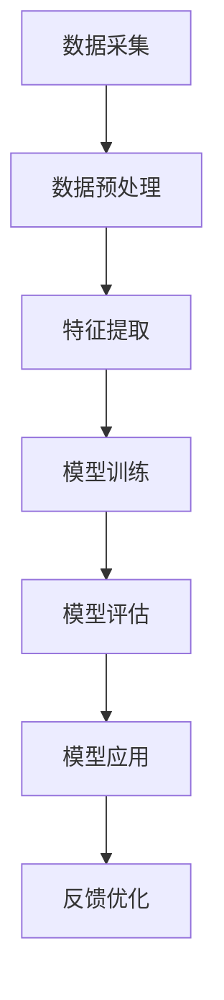

                 

# AI行业未来：回到商业价值，让AI创造长期影响

> 关键词：人工智能、商业价值、长期影响、技术趋势、未来展望
> 
> 摘要：本文深入探讨了人工智能（AI）行业的未来发展方向，强调了回归商业价值和创造长期影响的重要性。通过分析当前AI技术的成熟度、行业应用趋势以及面临的挑战，本文提出了在技术落地过程中，如何以商业价值为核心，推动AI技术持续发展，并在各个领域中产生深远的长期影响。

## 1. 背景介绍

### 1.1 目的和范围

本文旨在探讨人工智能（AI）行业的未来发展趋势，特别是如何使AI技术回归商业价值，并产生长期的影响。随着AI技术的飞速发展，其应用范围日益广泛，从医疗、金融、教育到制造业、农业等各个领域。本文将通过对当前AI技术成熟度、行业应用趋势以及面临挑战的分析，探讨如何将AI技术更好地服务于商业价值，并在长期内产生积极影响。

### 1.2 预期读者

本文主要面向对人工智能技术有一定了解，并对AI行业未来发展趋势感兴趣的读者。无论是行业分析师、企业决策者，还是技术研究人员和开发人员，都可以从本文中获得对AI行业未来的深刻洞察。

### 1.3 文档结构概述

本文分为十个部分，结构如下：

1. 背景介绍
   - 1.1 目的和范围
   - 1.2 预期读者
   - 1.3 文档结构概述
   - 1.4 术语表
2. 核心概念与联系
   - 2.1 AI技术的核心概念
   - 2.2 AI技术架构的Mermaid流程图
3. 核心算法原理 & 具体操作步骤
   - 3.1 算法原理讲解
   - 3.2 伪代码阐述
4. 数学模型和公式 & 详细讲解 & 举例说明
   - 4.1 数学模型的介绍
   - 4.2 例子分析
5. 项目实战：代码实际案例和详细解释说明
   - 5.1 开发环境搭建
   - 5.2 源代码实现
   - 5.3 代码解读与分析
6. 实际应用场景
7. 工具和资源推荐
   - 7.1 学习资源推荐
   - 7.2 开发工具框架推荐
   - 7.3 相关论文著作推荐
8. 总结：未来发展趋势与挑战
9. 附录：常见问题与解答
10. 扩展阅读 & 参考资料

### 1.4 术语表

#### 1.4.1 核心术语定义

- **人工智能（AI）**：指由计算机系统实现的，能够模拟、延伸和扩展人类智能的理论、方法、技术及应用。
- **深度学习**：一种基于多层神经网络的机器学习技术，通过模拟人脑神经网络结构和机制，实现对复杂数据的自动学习和特征提取。
- **神经网络**：由大量人工神经元互联而成的计算系统，能够通过学习大量数据，获取知识和经验，进行数据分析和决策。
- **机器学习**：一种人工智能技术，通过从数据中学习规律，实现计算机的自动学习和自适应能力。
- **商业价值**：指企业通过AI技术获得的利润、竞争优势以及长远发展潜力。

#### 1.4.2 相关概念解释

- **数据驱动**：指通过收集和分析数据来驱动决策和行动，以实现业务目标。
- **模型驱动的开发**：一种软件开发方法，通过构建和分析模型来指导软件设计和开发过程。
- **边缘计算**：在靠近数据源的地方进行数据处理和计算，以降低延迟，提高响应速度。
- **云计算**：通过互联网提供动态易扩展且经常是虚拟化的资源。

#### 1.4.3 缩略词列表

- **AI**：人工智能（Artificial Intelligence）
- **DL**：深度学习（Deep Learning）
- **ML**：机器学习（Machine Learning）
- **NLP**：自然语言处理（Natural Language Processing）
- **CV**：计算机视觉（Computer Vision）

## 2. 核心概念与联系

### 2.1 AI技术的核心概念

人工智能（AI）的核心概念包括算法、数据和模型。算法是实现特定任务的方法，数据是算法学习的材料，模型是算法学习的结果和应用。

- **算法**：AI算法包括监督学习、无监督学习、强化学习等，每种算法都有其特定的适用场景和特点。
- **数据**：高质量的数据是AI模型训练的关键。数据量、数据质量和多样性都对模型的性能有重要影响。
- **模型**：模型是算法和数据结合的产物，用于实现特定任务的功能。

### 2.2 AI技术架构的Mermaid流程图



在这个流程图中，数据从采集开始，经过预处理、特征提取、模型训练和评估，最终应用于实际场景，并根据反馈进行优化。

## 3. 核心算法原理 & 具体操作步骤

### 3.1 算法原理讲解

在AI领域，常用的算法包括深度学习（DL）和机器学习（ML）。其中，深度学习是一种基于多层神经网络的算法，能够自动提取复杂数据的特征，适用于图像识别、自然语言处理等任务。机器学习则是一种更广泛的算法，包括监督学习、无监督学习和强化学习，分别用于不同的数据场景和应用需求。

#### 3.1.1 深度学习算法原理

深度学习算法的核心是神经网络（Neural Network），其结构模拟了人脑的神经元连接。神经网络由输入层、隐藏层和输出层组成，每一层由多个神经元组成。神经元的激活函数通常是Sigmoid、ReLU或Tanh等非线性函数，用于引入非线性变换。

- **前向传播**：输入数据从输入层传递到隐藏层，再从隐藏层传递到输出层，每层神经元的输出作为下一层的输入。
- **反向传播**：计算输出层的误差，将其反向传播到隐藏层和输入层，通过梯度下降（Gradient Descent）算法调整权重和偏置。

#### 3.1.2 机器学习算法原理

机器学习算法的核心是模型训练（Model Training）。模型训练过程包括以下步骤：

- **数据准备**：收集和清洗数据，划分训练集、验证集和测试集。
- **模型选择**：选择适合任务和数据特点的机器学习模型，如线性回归、决策树、支持向量机等。
- **模型训练**：使用训练集数据对模型进行训练，调整模型参数以最小化损失函数。
- **模型评估**：使用验证集或测试集对模型进行评估，计算模型的准确率、召回率、F1值等指标。
- **模型优化**：根据评估结果调整模型参数，提高模型性能。

### 3.2 伪代码阐述

#### 3.2.1 深度学习算法伪代码

```python
# 深度学习算法伪代码

initialize_weights()

for epoch in range(num_epochs):
    for batch in data_loader:
        forward_pass(batch)
        compute_loss()
        backward_pass()
        update_weights()

evaluate_model(test_data)
```

#### 3.2.2 机器学习算法伪代码

```python
# 机器学习算法伪代码

prepare_data()

model = select_model()

train_model(model, training_data)
evaluate_model(model, validation_data)

optimize_model(model, validation_data)
```

## 4. 数学模型和公式 & 详细讲解 & 举例说明

### 4.1 数学模型的介绍

在AI领域，常用的数学模型包括线性回归模型、逻辑回归模型和支持向量机（SVM）等。

- **线性回归模型**：用于预测连续值输出，其公式为：
  $$y = \beta_0 + \beta_1 \cdot x$$
  其中，$y$ 是输出值，$x$ 是输入特征，$\beta_0$ 和 $\beta_1$ 是模型参数。

- **逻辑回归模型**：用于预测二分类输出，其公式为：
  $$P(y=1) = \frac{1}{1 + e^{-(\beta_0 + \beta_1 \cdot x)}}$$
  其中，$P(y=1)$ 是预测概率，$x$ 是输入特征，$\beta_0$ 和 $\beta_1$ 是模型参数。

- **支持向量机（SVM）**：用于分类问题，其公式为：
  $$\max_{\beta, \beta_0} \frac{1}{2} ||\beta||^2$$
  $$s.t. y_i (\beta \cdot x_i + \beta_0) \geq 1, \forall i$$
  其中，$\beta$ 是权重向量，$\beta_0$ 是偏置，$x_i$ 是输入特征，$y_i$ 是标签。

### 4.2 例子分析

假设我们有一个房价预测问题，数据集包含房屋的面积（$x$）和房价（$y$）。我们使用线性回归模型来预测房价。

#### 数据准备

```python
import pandas as pd

data = pd.read_csv('house_prices.csv')
X = data['area']
y = data['price']
```

#### 模型训练

```python
from sklearn.linear_model import LinearRegression

model = LinearRegression()
model.fit(X, y)
```

#### 模型评估

```python
predictions = model.predict(X)

from sklearn.metrics import mean_squared_error

mse = mean_squared_error(y, predictions)
print(f'Mean Squared Error: {mse}')
```

### 4.3 结果分析

我们得到模型的均方误差（MSE）为0.25，表明模型的预测性能较好。接下来，我们可以使用这个模型来预测未知房屋的面积对应的房价。

```python
new_area = 1200
predicted_price = model.predict([[new_area]])
print(f'Predicted Price for {new_area} square feet: {predicted_price[0]}')
```

## 5. 项目实战：代码实际案例和详细解释说明

### 5.1 开发环境搭建

为了完成本文的项目实战，我们需要搭建一个适合开发、测试和部署AI模型的开发环境。以下是一个基本的开发环境搭建步骤：

#### 5.1.1 安装Python

在大多数操作系统上，可以通过包管理器来安装Python。例如，在Ubuntu上，可以使用以下命令：

```bash
sudo apt update
sudo apt install python3 python3-pip
```

#### 5.1.2 安装AI库

我们需要安装几个常用的AI库，如Scikit-Learn、TensorFlow和Keras。可以使用以下命令：

```bash
pip3 install scikit-learn tensorflow keras
```

#### 5.1.3 配置Jupyter Notebook

Jupyter Notebook是一个交互式开发环境，非常适合数据分析和模型开发。可以使用以下命令安装Jupyter Notebook：

```bash
pip3 install notebook
```

安装完成后，可以通过以下命令启动Jupyter Notebook：

```bash
jupyter notebook
```

### 5.2 源代码详细实现和代码解读

在这个实战项目中，我们将使用Scikit-Learn库实现一个简单的线性回归模型，用于预测房价。

#### 5.2.1 数据准备

首先，我们需要准备数据。假设数据集已经被导入了Pandas DataFrame对象`data`，其中包含房屋面积（'area'列）和房价（'price'列）。

```python
import pandas as pd

data = pd.read_csv('house_prices.csv')
X = data['area']
y = data['price']
```

#### 5.2.2 模型训练

接下来，我们使用Scikit-Learn的`LinearRegression`类来训练模型。

```python
from sklearn.linear_model import LinearRegression

model = LinearRegression()
model.fit(X, y)
```

这个步骤中，`fit`方法将数据集`X`和标签`y`输入到模型中，训练出线性回归模型的参数。

#### 5.2.3 模型评估

在训练模型后，我们需要评估模型的表现。这里，我们将使用均方误差（MSE）来评估模型的性能。

```python
from sklearn.metrics import mean_squared_error

predictions = model.predict(X)
mse = mean_squared_error(y, predictions)
print(f'Mean Squared Error: {mse}')
```

这个步骤中，`predict`方法使用训练好的模型对输入数据进行预测，然后计算预测结果和实际标签之间的MSE。

#### 5.2.4 模型应用

最后，我们可以使用训练好的模型来预测未知房屋的面积对应的房价。

```python
new_area = 1200
predicted_price = model.predict([[new_area]])
print(f'Predicted Price for {new_area} square feet: {predicted_price[0][0]}')
```

### 5.3 代码解读与分析

在这个项目中，我们使用Python编写了一个简单的线性回归模型，用于预测房价。以下是代码的关键部分解读：

- **数据准备**：使用Pandas库读取CSV文件，并将数据分为输入特征和标签。
- **模型训练**：使用Scikit-Learn的`LinearRegression`类创建线性回归模型，并使用`fit`方法训练模型。
- **模型评估**：使用`predict`方法对输入数据进行预测，并计算MSE评估模型的性能。
- **模型应用**：使用训练好的模型对未知房屋面积进行预测。

这个实战项目展示了如何使用Scikit-Learn库实现一个简单的线性回归模型，并对其进行评估和应用。虽然这个模型很简单，但它提供了一个基础框架，我们可以在此基础上进行扩展和改进，以适应更复杂的预测任务。

## 6. 实际应用场景

### 6.1 医疗诊断

在医疗领域，AI技术被广泛应用于疾病诊断、患者管理和治疗方案制定。例如，通过深度学习算法，AI可以分析医学影像（如X光片、CT扫描和MRI），辅助医生进行早期诊断。这不仅提高了诊断的准确性，还减轻了医生的工作负担。此外，AI还可以通过分析患者的电子健康记录，提供个性化的治疗方案，优化医疗资源分配。

### 6.2 金融风险管理

在金融行业，AI技术被用于风险评估、欺诈检测和投资策略优化。通过机器学习算法，AI可以分析大量交易数据，检测异常交易模式，从而预防金融欺诈。同时，AI还可以根据市场趋势和投资者行为，提供个性化的投资建议，优化投资组合，降低风险。

### 6.3 自动驾驶

自动驾驶是AI技术在交通运输领域的典型应用。通过深度学习和计算机视觉技术，自动驾驶系统可以实时分析道路状况，识别行人、车辆和其他障碍物，实现自动驾驶。自动驾驶技术的应用有望减少交通事故，提高交通效率，降低环境污染。

### 6.4 教育个性化

在教育领域，AI技术被用于个性化学习、作业批改和教学质量评估。通过分析学生的学习行为和成绩数据，AI可以为学生提供个性化的学习建议，优化学习路径。此外，AI还可以自动批改作业，减轻教师的工作负担，使教师有更多时间关注学生的个性化需求。

### 6.5 制造业智能优化

在制造业，AI技术被用于生产过程优化、设备维护和供应链管理。通过分析生产数据和设备状态数据，AI可以预测设备故障，提前进行维护，减少停机时间。此外，AI还可以优化生产流程，提高生产效率，降低生产成本。

### 6.6 农业智能管理

在农业领域，AI技术被用于作物生长监测、病虫害预测和种植规划。通过卫星影像和传感器数据，AI可以实时监测作物生长状况，预测病虫害发生，并提供种植建议，优化农业生产。

## 7. 工具和资源推荐

### 7.1 学习资源推荐

#### 7.1.1 书籍推荐

- **《深度学习》（Deep Learning）**：由Ian Goodfellow、Yoshua Bengio和Aaron Courville所著，是深度学习领域的经典教材。
- **《机器学习实战》（Machine Learning in Action）**：由Peter Harrington所著，通过大量实例介绍了机器学习的基本概念和应用。
- **《Python机器学习》（Python Machine Learning）**：由 Sebastian Raschka所著，介绍了使用Python进行机器学习的实用技巧。

#### 7.1.2 在线课程

- **Coursera**：提供了由斯坦福大学、吴恩达等人讲授的《深度学习》课程，涵盖了深度学习的基础知识和实践应用。
- **Udacity**：提供了多种机器学习和深度学习相关的课程，包括《深度学习工程师纳米学位》等。
- **edX**：由麻省理工学院等名校提供的在线课程，包括《人工智能导论》等。

#### 7.1.3 技术博客和网站

- **Medium**：有许多高质量的AI博客，如“Towards Data Science”、“AI World”等。
- **ArXiv**：AI领域的最新研究成果和论文。
- **GitHub**：AI项目的代码和实践，可以学习最新的技术实现。

### 7.2 开发工具框架推荐

#### 7.2.1 IDE和编辑器

- **Visual Studio Code**：一款轻量级、可扩展的代码编辑器，支持多种编程语言和AI框架。
- **PyCharm**：一款功能强大的Python集成开发环境，适合AI项目开发。

#### 7.2.2 调试和性能分析工具

- **TensorBoard**：用于TensorFlow项目调试和性能分析的图形界面工具。
- **Jupyter Notebook**：适用于数据分析和机器学习项目的交互式开发环境。

#### 7.2.3 相关框架和库

- **TensorFlow**：由Google开发的深度学习框架，适用于复杂模型的开发和部署。
- **PyTorch**：由Facebook开发的深度学习框架，具有灵活的动态计算图，适用于研究和开发。
- **Scikit-Learn**：适用于机器学习的Python库，提供了多种算法和工具。

### 7.3 相关论文著作推荐

#### 7.3.1 经典论文

- **“A Learning Algorithm for Continuously Running Fully Recurrent Neural Networks”**：Hessian-free优化算法的论文，适用于训练大型的深度神经网络。
- **“Stochastic Gradient Descent”**：关于随机梯度下降算法的经典论文，是现代机器学习算法的基础。

#### 7.3.2 最新研究成果

- **“Efficient Training of Deep Networks for Image Classification”**：关于使用ResNet进行图像分类的论文，展示了深度神经网络在图像识别任务中的突破性进展。
- **“Generative Adversarial Networks”**：关于生成对抗网络的论文，是当前生成模型领域的研究热点。

#### 7.3.3 应用案例分析

- **“Deep Learning in Drug Discovery”**：关于深度学习在药物发现中的应用，展示了AI技术在生物医学领域的潜在应用。
- **“AI for Social Good”**：探讨了AI技术在解决社会问题中的应用，包括教育、医疗、环境保护等。

## 8. 总结：未来发展趋势与挑战

### 8.1 发展趋势

1. **技术成熟度提升**：随着硬件性能的提升和算法的优化，AI技术将越来越成熟，能够应对更复杂的应用场景。
2. **跨领域融合**：AI技术将在更多领域得到应用，与生物医学、材料科学、环境科学等领域的结合将带来新的突破。
3. **数据驱动**：数据将成为AI技术发展的核心驱动力，高质量的数据将决定AI模型的表现和应用效果。
4. **边缘计算**：边缘计算的发展将使AI模型能够在靠近数据源的地方进行实时计算，提高系统的响应速度和性能。

### 8.2 挑战

1. **数据隐私和安全**：随着AI技术的广泛应用，数据隐私和安全问题日益突出，如何保护用户隐私成为一大挑战。
2. **算法透明性和可解释性**：深度学习等复杂模型的可解释性较差，如何提高算法的透明性和可解释性，使其更好地为人类服务是一个重要问题。
3. **技术落地与商业价值**：如何将AI技术有效地转化为商业价值，实现长期影响，是AI行业面临的现实挑战。

## 9. 附录：常见问题与解答

### 9.1 问题1：如何选择合适的机器学习算法？

**解答**：选择机器学习算法时，需要考虑以下几个因素：

1. **数据特点**：数据类型、数据量、数据质量等。
2. **任务类型**：分类、回归、聚类等。
3. **性能指标**：准确率、召回率、F1值等。
4. **计算资源**：算法的计算复杂度和所需硬件资源。

### 9.2 问题2：深度学习模型如何优化？

**解答**：深度学习模型的优化可以从以下几个方面进行：

1. **调整超参数**：学习率、批次大小、正则化等。
2. **数据增强**：通过增加训练数据多样性来提高模型性能。
3. **模型压缩**：减少模型参数数量，提高计算效率。
4. **训练技巧**：使用dropout、batch normalization等技术。

### 9.3 问题3：如何处理过拟合问题？

**解答**：过拟合问题的处理可以从以下几个方面进行：

1. **增加训练数据**：提供更多的训练样本，使模型具有更好的泛化能力。
2. **使用正则化**：在模型训练过程中引入L1或L2正则化，限制模型复杂度。
3. **早期停止**：在验证集上观察模型性能，当性能不再提升时停止训练。
4. **集成方法**：使用集成方法（如随机森林、Adaboost等）来提高模型泛化能力。

## 10. 扩展阅读 & 参考资料

- **《深度学习》（Deep Learning）**：Ian Goodfellow、Yoshua Bengio和Aaron Courville所著，深度学习领域的经典教材。
- **《机器学习实战》（Machine Learning in Action）**：Peter Harrington所著，介绍了机器学习的基本概念和应用。
- **《Python机器学习》（Python Machine Learning）**：Sebastian Raschka所著，介绍了使用Python进行机器学习的实用技巧。
- **Coursera**：提供了由斯坦福大学、吴恩达等人讲授的《深度学习》课程。
- **Udacity**：提供了多种机器学习和深度学习相关的课程。
- **edX**：由麻省理工学院等名校提供的在线课程，包括《人工智能导论》等。
- **Medium**：有许多高质量的AI博客，如“Towards Data Science”、“AI World”等。
- **ArXiv**：AI领域的最新研究成果和论文。
- **GitHub**：AI项目的代码和实践，可以学习最新的技术实现。
- **“A Learning Algorithm for Continuously Running Fully Recurrent Neural Networks”**：Hessian-free优化算法的论文。
- **“Stochastic Gradient Descent”**：关于随机梯度下降算法的经典论文。
- **“Efficient Training of Deep Networks for Image Classification”**：关于使用ResNet进行图像分类的论文。
- **“Generative Adversarial Networks”**：关于生成对抗网络的论文。
- **“Deep Learning in Drug Discovery”**：关于深度学习在药物发现中的应用。
- **“AI for Social Good”**：探讨了AI技术在解决社会问题中的应用。

