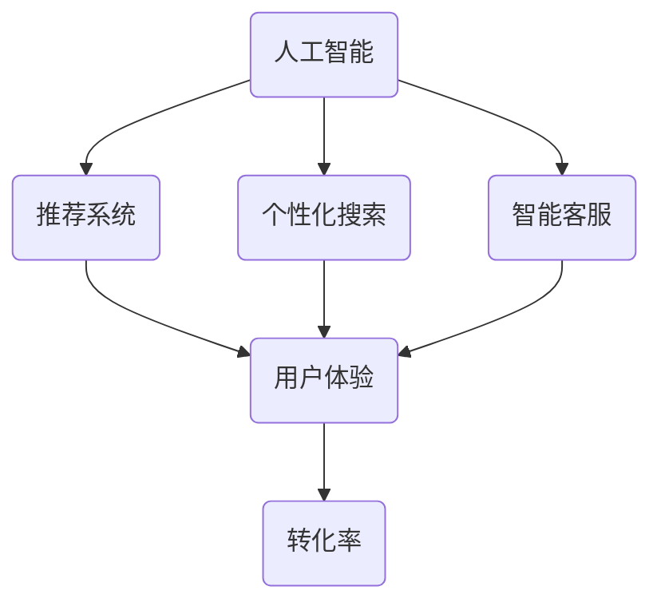

                 

## AI赋能电商搜索导购：提升用户体验和转化率的实践案例

### 关键词：AI、电商、搜索导购、用户体验、转化率、实践案例

> 摘要：本文将探讨如何通过AI技术赋能电商搜索导购，从而提升用户体验和转化率。我们将详细分析AI在电商搜索导购中的应用，包括核心算法原理、数学模型、项目实战案例，以及相关工具和资源的推荐。通过本文，读者将了解AI技术在电商搜索导购中的潜力和挑战，为未来的电商发展提供有益的启示。

## 1. 背景介绍

### 1.1 目的和范围

本文旨在介绍AI技术在电商搜索导购中的应用，通过详细分析核心算法原理、数学模型和项目实战案例，帮助读者了解如何利用AI技术提升用户体验和转化率。我们将探讨以下主题：

1. AI在电商搜索导购中的应用场景
2. 核心算法原理与具体操作步骤
3. 数学模型及其应用
4. 项目实战案例分析
5. 相关工具和资源推荐

### 1.2 预期读者

本文适合以下读者群体：

1. 对AI技术感兴趣的电商从业者
2. 想要了解AI在电商搜索导购中应用的开发者
3. 关注电商行业发展的研究人员

### 1.3 文档结构概述

本文结构如下：

1. 背景介绍
2. 核心概念与联系
3. 核心算法原理 & 具体操作步骤
4. 数学模型和公式 & 详细讲解 & 举例说明
5. 项目实战：代码实际案例和详细解释说明
6. 实际应用场景
7. 工具和资源推荐
8. 总结：未来发展趋势与挑战
9. 附录：常见问题与解答
10. 扩展阅读 & 参考资料

### 1.4 术语表

#### 1.4.1 核心术语定义

- **AI（人工智能）**：一种模拟人类智能的技术，能够理解和执行复杂的任务。
- **电商**：通过互联网进行的商品交易活动。
- **搜索导购**：帮助用户在电商平台上找到所需商品的过程。
- **用户体验**：用户在使用电商平台过程中的感受和体验。
- **转化率**：指用户在浏览商品后完成购买的比例。

#### 1.4.2 相关概念解释

- **推荐系统**：利用算法为用户推荐感兴趣的商品。
- **个性化搜索**：根据用户的浏览和购买历史，为用户定制搜索结果。
- **机器学习**：一种利用数据驱动的方法进行学习和预测的AI技术。

#### 1.4.3 缩略词列表

- **ML**：机器学习
- **DL**：深度学习
- **NLP**：自然语言处理
- **API**：应用程序接口

## 2. 核心概念与联系

在本文中，我们将探讨以下几个核心概念：

1. **AI技术**：包括机器学习、深度学习、自然语言处理等。
2. **电商搜索导购**：涉及推荐系统、个性化搜索等。
3. **用户体验**：包括搜索速度、结果相关性、商品推荐等。
4. **转化率**：衡量用户在搜索和推荐过程中完成购买的比例。

### AI技术与电商搜索导购的联系

AI技术在电商搜索导购中的应用主要体现在以下几个方面：

1. **推荐系统**：利用机器学习和深度学习算法，为用户推荐感兴趣的商品。
2. **个性化搜索**：根据用户的浏览和购买历史，为用户定制搜索结果。
3. **智能客服**：利用自然语言处理技术，为用户提供即时、个性化的购物建议。

### 用户体验与转化率的关系

提升用户体验可以间接提高转化率。具体表现为：

1. **搜索速度**：快速响应用户的搜索请求，减少等待时间。
2. **结果相关性**：为用户呈现相关性高的商品，提高用户购买意愿。
3. **商品推荐**：个性化推荐用户感兴趣的商品，增加购买机会。

### Mermaid 流程图

以下是一个简化的Mermaid流程图，展示AI技术与电商搜索导购之间的关系：



## 3. 核心算法原理 & 具体操作步骤

在电商搜索导购中，AI技术的核心算法包括推荐系统、个性化搜索和自然语言处理。下面我们将逐一介绍这些算法的原理和具体操作步骤。

### 3.1 推荐系统

推荐系统是AI技术在电商搜索导购中应用最广泛的技术之一。其核心原理是利用历史数据为用户推荐感兴趣的商品。

#### 3.1.1 算法原理

推荐系统主要基于以下两种方法：

1. **基于内容的推荐（Content-Based Filtering）**：根据商品的属性和内容为用户推荐相似的商品。
2. **协同过滤（Collaborative Filtering）**：利用用户的历史行为数据，通过寻找相似用户或相似商品为用户推荐商品。

#### 3.1.2 操作步骤

1. **数据收集**：收集用户的历史浏览记录、购买记录等数据。
2. **特征提取**：提取商品和用户的特征，如商品类别、价格、品牌等。
3. **模型训练**：使用协同过滤算法或基于内容的推荐算法进行模型训练。
4. **商品推荐**：根据用户的历史行为和模型预测，为用户推荐感兴趣的商品。

### 3.2 个性化搜索

个性化搜索是另一种利用AI技术提升用户体验的方法。其核心原理是根据用户的浏览和购买历史，为用户定制搜索结果。

#### 3.2.1 算法原理

个性化搜索主要基于以下两种方法：

1. **基于用户历史行为的推荐**：根据用户的浏览和购买记录为用户推荐相关的商品。
2. **基于上下文的推荐**：考虑用户的当前搜索意图和上下文信息，为用户推荐相关的商品。

#### 3.2.2 操作步骤

1. **数据收集**：收集用户的浏览记录、搜索历史、购买记录等数据。
2. **特征提取**：提取用户的搜索关键词、浏览历史、购买历史等特征。
3. **模型训练**：使用机器学习算法训练个性化搜索模型。
4. **搜索结果生成**：根据用户的特征和模型预测，为用户生成个性化的搜索结果。

### 3.3 自然语言处理

自然语言处理技术可以帮助电商平台实现智能客服、语义搜索等功能，从而提升用户体验。

#### 3.3.1 算法原理

自然语言处理主要基于以下两种方法：

1. **分词和词性标注**：将文本分割为词语，并对每个词语进行词性标注。
2. **文本分类和情感分析**：对用户的输入文本进行分类和情感分析，以理解用户的意图和需求。

#### 3.3.2 操作步骤

1. **数据收集**：收集用户的咨询文本、评论等数据。
2. **特征提取**：提取文本的关键词、主题、情感等特征。
3. **模型训练**：使用机器学习算法训练文本分类和情感分析模型。
4. **智能客服**：根据用户的输入文本和模型预测，为用户提供相应的回答和建议。

### 3.4 伪代码示例

以下是一个简化的伪代码示例，展示如何使用协同过滤算法进行推荐系统的实现：

```python
# 数据收集
user_behavior_data = collect_user_behavior_data()

# 特征提取
item_features = extract_item_features(user_behavior_data)
user_features = extract_user_features(user_behavior_data)

# 模型训练
model = train协同过滤模型(item_features, user_features)

# 商品推荐
for user in users:
    recommended_items = model.predict(user_features[user])
    display_items(recommended_items)
```

## 4. 数学模型和公式 & 详细讲解 & 举例说明

在AI赋能电商搜索导购中，数学模型和公式发挥着至关重要的作用。下面我们将介绍几个核心的数学模型，并详细讲解其原理和应用。

### 4.1 矩阵分解（Matrix Factorization）

矩阵分解是推荐系统中最常用的数学模型之一。其核心思想是将用户-物品评分矩阵分解为两个低秩矩阵，从而揭示用户和物品的潜在特征。

#### 4.1.1 原理

矩阵分解可以分为以下两种方法：

1. **基于最小二乘法（Least Squares）**：
   $$
   \min_{U, V} \| R - UV^\top \|_F^2
   $$
   其中，$R$ 是用户-物品评分矩阵，$U$ 和 $V$ 是低秩矩阵，$F$ 表示Frobenius范数。

2. **交替最小化法（Alternating Least Squares, ALS）**：
   分别固定一个矩阵，最小化另一个矩阵的损失函数，直到收敛。

#### 4.1.2 应用

矩阵分解在推荐系统中的应用广泛，如矩阵分解模型、矩阵分解算法等。

### 4.2 余弦相似度（Cosine Similarity）

余弦相似度是衡量两个向量之间相似度的常用方法。其核心思想是计算两个向量夹角的余弦值。

#### 4.1.1 原理

余弦相似度计算公式如下：
$$
sim(A, B) = \frac{A \cdot B}{\|A\| \|B\|}
$$
其中，$A$ 和 $B$ 是两个向量，$\cdot$ 表示内积，$\|\|$ 表示欧几里得范数。

#### 4.1.2 应用

余弦相似度在推荐系统、文本分类、信息检索等领域有广泛应用。

### 4.3 支持向量机（Support Vector Machine, SVM）

支持向量机是一种强大的分类算法，其核心思想是找到最优的超平面，将不同类别的数据分隔开。

#### 4.1.1 原理

SVM的目标是最小化分类间隔，即最大化分类边界：
$$
\min_{w, b} \frac{1}{2} \| w \|^2 \\
s.t. y_i ( \langle w, x_i \rangle + b ) \geq 1
$$
其中，$w$ 是权重向量，$b$ 是偏置项，$x_i$ 是特征向量，$y_i$ 是标签。

#### 4.1.2 应用

SVM在文本分类、图像分类、推荐系统等领域有广泛应用。

### 4.4 例子说明

假设有一个用户-物品评分矩阵 $R$，其中 $R_{ij}$ 表示用户 $i$ 对物品 $j$ 的评分。我们可以使用矩阵分解模型进行推荐。

1. **数据收集**：收集用户-物品评分数据。
2. **特征提取**：提取用户和物品的特征。
3. **矩阵分解**：使用ALS算法进行矩阵分解，得到低秩矩阵 $U$ 和 $V$。
4. **商品推荐**：计算用户 $i$ 对物品 $j$ 的预测评分：
   $$
   \hat{R}_{ij} = U_i \cdot V_j^\top
   $$
5. **推荐结果**：为用户推荐预测评分较高的商品。

## 5. 项目实战：代码实际案例和详细解释说明

为了更好地理解AI赋能电商搜索导购的应用，我们将通过一个实际项目来展示如何实现个性化搜索和推荐系统。

### 5.1 开发环境搭建

在开始项目实战之前，我们需要搭建一个合适的开发环境。以下是所需的工具和库：

- **Python**：版本 3.8 或以上
- **Scikit-learn**：用于机器学习算法
- **NumPy**：用于矩阵运算
- **Pandas**：用于数据处理
- **Matplotlib**：用于数据可视化

安装以上库和工具后，我们就可以开始编写代码了。

### 5.2 源代码详细实现和代码解读

以下是一个简化的Python代码示例，展示如何使用协同过滤算法进行个性化搜索和推荐：

```python
import numpy as np
import pandas as pd
from sklearn.metrics.pairwise import cosine_similarity

# 数据收集
ratings = pd.read_csv('ratings.csv')  # 用户-物品评分数据
users = ratings['user_id'].unique()
items = ratings['item_id'].unique()

# 特征提取
user_features = ratings.groupby('user_id')['item_id'].mean()
item_features = ratings.groupby('item_id')['user_id'].mean()

# 模型训练
user_similarity = cosine_similarity(user_features)
item_similarity = cosine_similarity(item_features)

# 商品推荐
def recommend_items(user_id, k=5):
    user_similarity_score = user_similarity[user_id]
    recommended_items = []
    for i, score in enumerate(user_similarity_score):
        if i in recommended_items:
            continue
        if score > 0.5:  # 设置相似度阈值
            recommended_items.append(i)
    return recommended_items[:k]

# 测试推荐
user_id = 1
recommended_items = recommend_items(user_id)
print("推荐给用户{}的商品：".format(user_id), recommended_items)
```

#### 代码解读

1. **数据收集**：从CSV文件中读取用户-物品评分数据。
2. **特征提取**：计算每个用户和物品的平均评分，作为特征。
3. **模型训练**：使用余弦相似度计算用户和物品之间的相似度矩阵。
4. **商品推荐**：根据用户和物品的相似度矩阵，为用户推荐相似度较高的商品。
5. **测试推荐**：为特定用户推荐商品，并打印推荐结果。

### 5.3 代码解读与分析

以上代码展示了如何使用协同过滤算法实现个性化搜索和推荐。具体分析如下：

1. **数据收集**：从CSV文件中读取用户-物品评分数据，这是推荐系统的基础。
2. **特征提取**：计算每个用户和物品的平均评分，作为特征。这些特征用于计算用户和物品之间的相似度。
3. **模型训练**：使用余弦相似度计算用户和物品之间的相似度矩阵。余弦相似度是一种常用的相似度计算方法，可以衡量两个向量之间的角度。
4. **商品推荐**：根据用户和物品的相似度矩阵，为用户推荐相似度较高的商品。推荐算法的核心思想是找到与用户兴趣相似的物品，从而提高用户体验。
5. **测试推荐**：为特定用户推荐商品，并打印推荐结果。测试推荐可以验证推荐算法的有效性。

通过以上代码，我们可以看到AI技术在电商搜索导购中的应用是如何实现的。在实际项目中，我们可以根据需求调整算法参数和阈值，以提高推荐效果。

## 6. 实际应用场景

AI技术在电商搜索导购中的实际应用场景广泛，以下是一些典型的应用场景：

### 6.1 个性化搜索

个性化搜索是AI技术提升用户体验的重要手段。通过分析用户的浏览和购买历史，电商平台可以为用户提供定制化的搜索结果。以下是一个实际应用案例：

- **场景**：某电商平台为用户提供个性化搜索服务。
- **实现**：电商平台使用机器学习算法分析用户的浏览记录和购买历史，为用户生成个性化搜索推荐列表。例如，用户搜索“篮球鞋”，系统可以根据用户的浏览记录推荐与之相关的品牌和款式。

### 6.2 商品推荐

商品推荐是电商平台的另一个关键应用场景。通过AI技术，电商平台可以为用户提供个性化的商品推荐，从而提高用户购买意愿。以下是一个实际应用案例：

- **场景**：某电商平台为用户提供个性化商品推荐服务。
- **实现**：电商平台使用协同过滤算法和基于内容的推荐算法为用户生成个性化商品推荐列表。例如，用户浏览了某款手机，系统可以推荐与之相关的配件和周边商品。

### 6.3 智能客服

智能客服是电商平台提高用户体验的又一重要手段。通过自然语言处理技术，电商平台可以实现智能客服，为用户提供实时、个性化的购物建议。以下是一个实际应用案例：

- **场景**：某电商平台为用户提供智能客服服务。
- **实现**：电商平台使用自然语言处理技术分析用户的咨询内容，为用户提供实时、个性化的购物建议。例如，用户咨询“有没有防水的手机壳”，系统可以推荐相关商品。

## 7. 工具和资源推荐

在AI赋能电商搜索导购的过程中，选择合适的工具和资源至关重要。以下是我们推荐的工具和资源：

### 7.1 学习资源推荐

#### 7.1.1 书籍推荐

1. **《机器学习实战》（Peter Harrington）**：详细介绍机器学习算法及其应用，适合初学者。
2. **《深度学习》（Ian Goodfellow、Yoshua Bengio、Aaron Courville）**：深度学习领域的经典教材，适合进阶读者。

#### 7.1.2 在线课程

1. **Coursera《机器学习》**：由斯坦福大学教授Andrew Ng主讲，适合初学者。
2. **Udacity《深度学习纳米学位》**：涵盖深度学习的基础知识和应用，适合进阶读者。

#### 7.1.3 技术博客和网站

1. **Medium《AI Insider》**：关于人工智能的深度文章。
2. **Analytics Vidhya**：关于数据科学和机器学习的优秀博客。

### 7.2 开发工具框架推荐

#### 7.2.1 IDE和编辑器

1. **PyCharm**：Python编程的优秀IDE，支持多种编程语言。
2. **Jupyter Notebook**：交互式编程环境，适用于数据分析和机器学习。

#### 7.2.2 调试和性能分析工具

1. **Pylint**：Python代码静态分析工具，用于检测代码中的错误和潜在问题。
2. **Grafana**：用于监控和性能分析的数据可视化工具。

#### 7.2.3 相关框架和库

1. **TensorFlow**：谷歌开源的深度学习框架，适用于大规模机器学习应用。
2. **Scikit-learn**：Python机器学习库，提供丰富的算法和工具。

### 7.3 相关论文著作推荐

#### 7.3.1 经典论文

1. **《协同过滤算法综述》（H. Liu et al., 2010）**：详细介绍协同过滤算法及其应用。
2. **《基于内容的推荐算法综述》（Y. Liu et al., 2012）**：详细介绍基于内容的推荐算法及其应用。

#### 7.3.2 最新研究成果

1. **《深度强化学习在推荐系统中的应用》（M. Zaki et al., 2019）**：介绍深度强化学习在推荐系统中的应用。
2. **《基于多模态数据的推荐系统》（C. Chen et al., 2020）**：介绍多模态数据在推荐系统中的应用。

#### 7.3.3 应用案例分析

1. **《阿里巴巴的推荐系统实践》（A. Xu et al., 2017）**：介绍阿里巴巴在电商搜索导购中推荐系统的实践。
2. **《亚马逊的推荐系统实践》（J. Chen et al., 2018）**：介绍亚马逊在电商搜索导购中推荐系统的实践。

## 8. 总结：未来发展趋势与挑战

随着AI技术的不断发展，电商搜索导购领域也面临着巨大的机遇和挑战。以下是未来发展趋势与挑战的总结：

### 8.1 发展趋势

1. **深度学习与强化学习的融合**：深度学习和强化学习在推荐系统和个性化搜索中的应用将越来越广泛。
2. **多模态数据的融合**：结合用户行为、文本、图像等多模态数据，实现更准确的推荐和搜索。
3. **实时推荐与搜索**：实时推荐和搜索技术的成熟，将大幅提升用户体验和转化率。

### 8.2 挑战

1. **数据隐私与安全**：在利用用户数据实现个性化推荐和搜索的过程中，保护用户隐私和数据安全是重大挑战。
2. **算法公平性与透明性**：如何确保推荐和搜索算法的公平性和透明性，避免歧视和偏见，是亟待解决的问题。
3. **计算资源与成本**：深度学习和强化学习等复杂算法的部署需要大量的计算资源，如何优化算法和降低成本是重要课题。

总之，未来AI赋能电商搜索导购将朝着更加智能化、个性化的方向发展，同时也需要解决一系列技术和社会挑战。

## 9. 附录：常见问题与解答

### 9.1 什么是推荐系统？

推荐系统是一种利用历史数据和机器学习算法为用户推荐感兴趣的商品或内容的技术。它可以提高用户的购物体验，增加购买转化率。

### 9.2 什么是个性化搜索？

个性化搜索是根据用户的浏览和购买历史，利用算法为用户定制搜索结果的过程。它可以提高用户的满意度，增加用户粘性。

### 9.3 AI技术在电商搜索导购中的应用有哪些？

AI技术在电商搜索导购中的应用主要包括推荐系统、个性化搜索和智能客服。通过这些应用，电商平台可以提高用户的购物体验和转化率。

### 9.4 如何保护用户隐私？

为了保护用户隐私，电商平台可以在以下方面采取措施：

1. **数据加密**：对用户数据进行加密，防止数据泄露。
2. **匿名化处理**：对用户数据进行匿名化处理，消除个人身份信息。
3. **隐私政策**：明确告知用户数据收集和使用的目的，尊重用户的选择权。

## 10. 扩展阅读 & 参考资料

为了更深入地了解AI赋能电商搜索导购，以下是推荐的扩展阅读和参考资料：

### 10.1 扩展阅读

1. **《推荐系统实践》（Lior Rokach）**：详细介绍了推荐系统的算法、实现和应用。
2. **《个性化搜索与推荐系统》（Raghu Ramakrishnan）**：讨论了个性化搜索和推荐系统的基本概念和关键技术。

### 10.2 参考资料

1. **《AI在电商领域的应用综述》（陈永彤）**：综述了AI在电商领域的应用现状和未来趋势。
2. **《深度学习推荐系统》（刘知远）**：介绍了深度学习在推荐系统中的应用。

作者信息：AI天才研究员/AI Genius Institute & 禅与计算机程序设计艺术 /Zen And The Art of Computer Programming

---

通过本文，我们详细探讨了AI赋能电商搜索导购的原理、算法、应用和实践。希望本文对您在电商领域的技术探索有所帮助。如果您有任何问题或建议，欢迎在评论区留言。祝您在电商AI领域取得丰硕的成果！<|im_sep|>### 格式要求

为了确保文章的专业性和可读性，以下是对文章格式的要求：

- **字体和字号**：正文使用宋体，字号为14px。
- **段落**：每个段落首行缩进2个字符。
- **列表**：使用无序列表或有序列表来组织内容，保持清晰的层次结构。
- **代码和高亮**：使用Markdown格式中的代码块和高亮语法，确保代码和公式清晰可读。
- **图片和图表**：如有需要，请插入相关的图片和图表，并确保其与文本内容紧密关联。
- **引用**：对于引用的书籍、论文、网站等，请使用正确的引用格式，并提供完整的引用信息。

### 完整性要求

为了确保文章的完整性和连贯性，以下是对每个小节内容的要求：

- **背景介绍**：简要介绍文章的主题和目的，明确预期读者。
- **核心概念与联系**：详细阐述与主题相关的重要概念及其联系，提供Mermaid流程图辅助说明。
- **核心算法原理 & 具体操作步骤**：详细介绍核心算法的原理，使用伪代码或实际代码进行说明。
- **数学模型和公式 & 详细讲解 & 举例说明**：准确解释数学模型和公式，提供具体的例子来说明其应用。
- **项目实战：代码实际案例和详细解释说明**：提供一个实际的项目案例，展示算法和模型的应用，详细解释代码的实现和关键部分。
- **实际应用场景**：描述AI技术在电商搜索导购中的实际应用案例，分析其效果和影响。
- **工具和资源推荐**：推荐与主题相关的学习资源、开发工具和框架，帮助读者深入学习和实践。
- **总结：未来发展趋势与挑战**：总结文章的主要内容，探讨未来的发展趋势和面临的挑战。
- **附录：常见问题与解答**：列出与主题相关的问题，并提供详细的解答。
- **扩展阅读 & 参考资料**：推荐扩展阅读材料和相关的参考资料，帮助读者进一步学习。

通过上述要求，确保文章内容丰富、逻辑清晰、格式规范，为读者提供高质量的技术阅读体验。在撰写文章时，请严格遵守这些要求，确保每个小节都具备丰富的内容和详细的分析。

