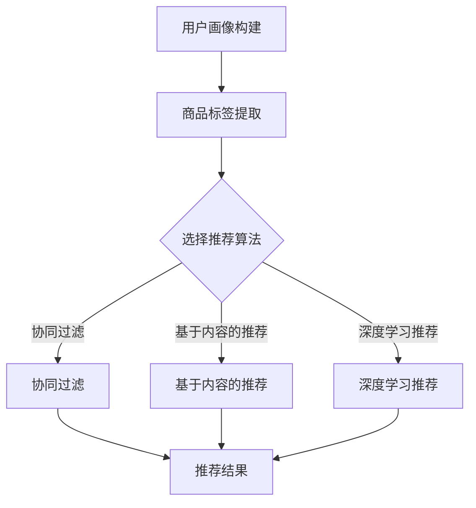
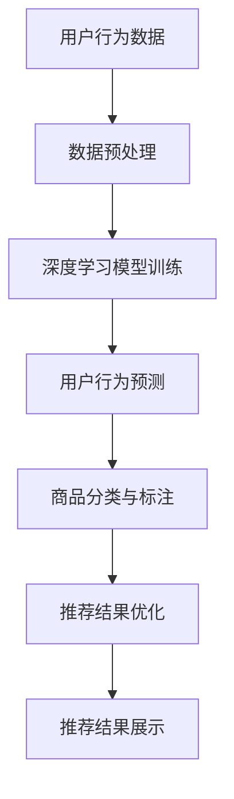
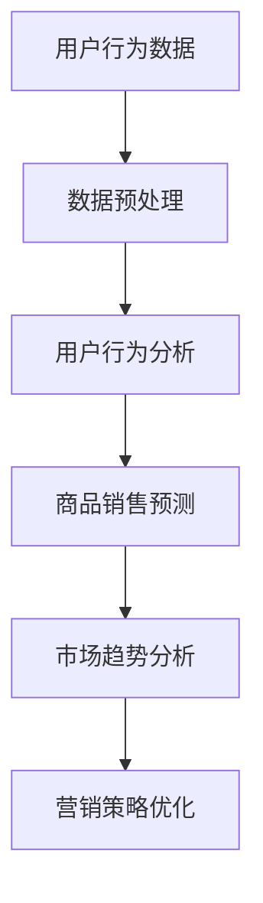

                 


# AI赋能电商搜索导购：提升用户体验和转化率的实践案例

> **关键词：**人工智能、电商搜索、导购、用户体验、转化率、深度学习、推荐系统、数据挖掘。

> **摘要：**本文将深入探讨人工智能技术在电商搜索导购领域的应用，通过分析核心算法原理、项目实战案例以及实际应用场景，探讨如何利用人工智能技术提升电商平台的用户体验和转化率。本文的目标是为从事电商领域的技术人员和从业者提供实用的技术参考和思路，助力他们在电商搜索导购领域实现技术的创新和突破。

## 1. 背景介绍

### 1.1 目的和范围

本文旨在探讨人工智能技术在电商搜索导购领域的应用，重点关注如何利用人工智能技术提升用户的搜索体验和购买转化率。我们将从以下几个方面展开讨论：

1. **核心概念与联系**：介绍电商搜索导购的核心概念，包括推荐系统、深度学习和数据挖掘等。
2. **核心算法原理 & 具体操作步骤**：详细讲解用于电商搜索导购的核心算法原理，如协同过滤、基于内容的推荐和深度学习推荐等。
3. **数学模型和公式 & 详细讲解 & 举例说明**：介绍用于电商搜索导购的数学模型和公式，并通过实际案例进行说明。
4. **项目实战：代码实际案例和详细解释说明**：提供实际项目中的代码案例，并详细解读和分析。
5. **实际应用场景**：讨论人工智能技术在电商搜索导购中的实际应用场景和挑战。
6. **工具和资源推荐**：推荐学习资源、开发工具和框架，以帮助读者深入了解和掌握相关技术。
7. **总结：未来发展趋势与挑战**：总结本文的主要内容，并探讨电商搜索导购领域未来的发展趋势和挑战。

### 1.2 预期读者

本文适用于以下读者群体：

1. **电商领域的技术人员**：希望通过人工智能技术提升电商平台用户体验和转化率的从业者。
2. **计算机科学和人工智能研究者**：对人工智能技术在电商搜索导购领域的应用感兴趣的研究人员。
3. **市场营销人员**：希望了解人工智能技术在电商领域的应用，以优化营销策略的专业人士。
4. **技术爱好者**：对人工智能技术及其在电商搜索导购中的应用感兴趣的爱好者。

### 1.3 文档结构概述

本文结构如下：

1. **背景介绍**：介绍文章的目的和范围，预期读者以及文档结构概述。
2. **核心概念与联系**：介绍电商搜索导购的核心概念，包括推荐系统、深度学习和数据挖掘等。
3. **核心算法原理 & 具体操作步骤**：详细讲解用于电商搜索导购的核心算法原理，如协同过滤、基于内容的推荐和深度学习推荐等。
4. **数学模型和公式 & 详细讲解 & 举例说明**：介绍用于电商搜索导购的数学模型和公式，并通过实际案例进行说明。
5. **项目实战：代码实际案例和详细解释说明**：提供实际项目中的代码案例，并详细解读和分析。
6. **实际应用场景**：讨论人工智能技术在电商搜索导购中的实际应用场景和挑战。
7. **工具和资源推荐**：推荐学习资源、开发工具和框架，以帮助读者深入了解和掌握相关技术。
8. **总结：未来发展趋势与挑战**：总结本文的主要内容，并探讨电商搜索导购领域未来的发展趋势和挑战。
9. **附录：常见问题与解答**：解答读者在阅读本文过程中可能遇到的常见问题。
10. **扩展阅读 & 参考资料**：提供扩展阅读资料，以便读者深入了解相关技术。

### 1.4 术语表

#### 1.4.1 核心术语定义

- **人工智能（AI）**：指由计算机系统实现的模拟人类智能的技术和科学。
- **电商搜索导购**：指利用人工智能技术为用户提供商品搜索和推荐的服务。
- **推荐系统**：基于用户行为和偏好，为用户提供个性化商品推荐的系统。
- **协同过滤**：一种基于用户行为数据的推荐算法，通过计算用户之间的相似度来推荐商品。
- **基于内容的推荐**：一种基于商品属性和用户兴趣的推荐算法，通过匹配商品属性和用户兴趣来推荐商品。
- **深度学习**：一种基于多层神经网络的人工智能技术，用于从大量数据中自动学习特征和模式。
- **数据挖掘**：从大量数据中发现有价值的信息和知识的过程。

#### 1.4.2 相关概念解释

- **用户画像**：指通过收集和分析用户数据，构建用户的基本信息和偏好特征，用于个性化推荐。
- **商品标签**：指用于描述商品属性和类别的关键词，如颜色、尺寸、品牌等。
- **转化率**：指用户完成购买行为的比例，用于衡量电商平台的销售效果。

#### 1.4.3 缩略词列表

- **AI**：人工智能
- **CFL**：协同过滤
- **CDR**：基于内容的推荐
- **DL**：深度学习
- **DM**：数据挖掘

## 2. 核心概念与联系

在电商搜索导购领域，人工智能技术的应用主要涉及以下几个核心概念和联系：

### 2.1 推荐系统

推荐系统是电商搜索导购的核心组成部分，旨在为用户提供个性化的商品推荐。推荐系统的基本架构包括以下几个模块：

1. **用户画像构建**：通过收集和分析用户的历史行为数据、浏览记录、搜索关键词等，构建用户的基本信息和偏好特征。
2. **商品标签提取**：对商品进行属性和类别的描述，如颜色、尺寸、品牌等，以建立商品与用户之间的关联。
3. **推荐算法实现**：根据用户画像和商品标签，选择合适的推荐算法进行商品推荐，如协同过滤、基于内容的推荐和深度学习推荐等。

#### 推荐系统的 Mermaid 流程图：



### 2.2 深度学习

深度学习是人工智能技术的重要分支，通过多层神经网络对数据进行自动学习和特征提取。深度学习在电商搜索导购中的应用主要体现在以下几个方面：

1. **商品分类与标注**：利用深度学习算法对商品进行分类和标注，以提高推荐系统的准确性。
2. **用户行为预测**：通过分析用户的浏览历史和购买行为，利用深度学习模型预测用户对某件商品的兴趣和购买概率。
3. **推荐结果优化**：利用深度学习模型对推荐结果进行优化，提高推荐系统的准确性和用户体验。

#### 深度学习在电商搜索导购中的应用架构图：



### 2.3 数据挖掘

数据挖掘是挖掘数据中有价值的信息和知识的过程，在电商搜索导购领域有着广泛的应用。数据挖掘的主要任务包括：

1. **用户行为分析**：通过对用户历史数据进行分析，发现用户的偏好和购买模式，用于优化推荐策略。
2. **商品销售预测**：利用历史销售数据，预测商品未来的销售趋势，以优化库存管理和营销策略。
3. **市场趋势分析**：通过对用户行为和商品销售数据进行分析，发现市场趋势和机会，以指导产品开发和营销策略。

#### 数据挖掘在电商搜索导购中的应用架构图：



## 3. 核心算法原理 & 具体操作步骤

在电商搜索导购领域，常用的推荐算法包括协同过滤、基于内容的推荐和深度学习推荐等。下面将分别介绍这些算法的原理和具体操作步骤。

### 3.1 协同过滤

协同过滤是一种基于用户行为数据的推荐算法，通过计算用户之间的相似度，为用户提供个性化的商品推荐。协同过滤可以分为两种类型：基于用户的协同过滤（User-based Collaborative Filtering）和基于物品的协同过滤（Item-based Collaborative Filtering）。

#### 3.1.1 基于用户的协同过滤

基于用户的协同过滤通过计算用户之间的相似度，找到与目标用户最相似的其他用户，然后推荐这些用户喜欢的商品。具体步骤如下：

1. **用户行为数据收集**：收集用户的历史行为数据，如浏览记录、购买记录等。
2. **用户相似度计算**：计算用户之间的相似度，常用的相似度度量方法有皮尔逊相关系数、余弦相似度等。
3. **推荐商品计算**：为每个用户推荐与目标用户最相似的用户的共同喜欢的商品。

伪代码如下：

```python
# 基于用户的协同过滤伪代码
def collaborativeFilteringUserBased(userBehaviorData, targetUser):
    similarUsers = []
    maxSimilarity = 0
    for user in userBehaviorData:
        if user != targetUser:
            similarity = calculateSimilarity(user, targetUser)
            if similarity > maxSimilarity:
                maxSimilarity = similarity
                similarUsers = [user]
            elif similarity == maxSimilarity:
                similarUsers.append(user)
    recommendedItems = []
    for user in similarUsers:
        for item in userBehaviorData[user]:
            if item not in targetUserBehaviorData:
                recommendedItems.append(item)
    return recommendedItems
```

#### 3.1.2 基于物品的协同过滤

基于物品的协同过滤通过计算商品之间的相似度，为用户提供个性化的商品推荐。具体步骤如下：

1. **用户行为数据收集**：收集用户的历史行为数据，如浏览记录、购买记录等。
2. **商品相似度计算**：计算商品之间的相似度，常用的相似度度量方法有欧氏距离、余弦相似度等。
3. **推荐商品计算**：为每个用户推荐与目标用户最相似的其他用户喜欢的商品。

伪代码如下：

```python
# 基于物品的协同过滤伪代码
def collaborativeFilteringItemBased(userBehaviorData, targetUser):
    similarItems = []
    maxSimilarity = 0
    for item in userBehaviorData[targetUser]:
        for otherItem in userBehaviorData:
            if otherItem != item and otherItem in userBehaviorData[targetUser]:
                similarity = calculateSimilarity(item, otherItem)
                if similarity > maxSimilarity:
                    maxSimilarity = similarity
                    similarItems = [otherItem]
                elif similarity == maxSimilarity:
                    similarItems.append(otherItem)
    recommendedItems = []
    for user in userBehaviorData:
        for item in userBehaviorData[user]:
            if item in similarItems:
                recommendedItems.append(item)
    return recommendedItems
```

### 3.2 基于内容的推荐

基于内容的推荐是一种基于商品属性和用户兴趣的推荐算法，通过匹配商品属性和用户兴趣来推荐商品。具体步骤如下：

1. **商品属性提取**：提取商品的各种属性，如颜色、尺寸、品牌等。
2. **用户兴趣提取**：提取用户的兴趣标签，如时尚、运动等。
3. **推荐商品计算**：为每个用户推荐具有相似属性的商品。

伪代码如下：

```python
# 基于内容的推荐伪代码
def contentBasedRecommendation(itemAttributes, userInterests):
    recommendedItems = []
    for item in itemAttributes:
        if hasSimilarAttributes(item, userInterests):
            recommendedItems.append(item)
    return recommendedItems
```

### 3.3 深度学习推荐

深度学习推荐是一种基于深度学习算法的推荐算法，通过自动学习用户行为和商品属性之间的复杂关系来推荐商品。深度学习推荐可以分为以下两种类型：

1. **基于模型的推荐**：利用深度学习模型自动学习用户行为和商品属性之间的关系，为用户提供个性化的推荐。
2. **基于数据的推荐**：利用深度学习模型对用户行为数据进行建模，预测用户对商品的偏好和兴趣。

#### 3.3.1 基于模型的推荐

基于模型的推荐通常采用深度神经网络模型，如卷积神经网络（CNN）和循环神经网络（RNN）等。具体步骤如下：

1. **数据预处理**：对用户行为数据进行预处理，如去重、补全、归一化等。
2. **模型训练**：利用预处理后的用户行为数据训练深度学习模型。
3. **模型预测**：利用训练好的模型预测用户对商品的偏好和兴趣。
4. **推荐商品计算**：为每个用户推荐具有较高预测兴趣的商品。

伪代码如下：

```python
# 基于模型的推荐伪代码
def deepLearningModelBasedRecommendation(userBehaviorData, trainedModel):
    predictedInterests = trainedModel.predict(userBehaviorData)
    recommendedItems = []
    for item in predictedInterests:
        if item['interest'] > threshold:
            recommendedItems.append(item['itemId'])
    return recommendedItems
```

#### 3.3.2 基于数据的推荐

基于数据的推荐通常采用图神经网络（Graph Neural Networks，GNN）等模型，对用户行为数据进行建模，预测用户对商品的偏好和兴趣。具体步骤如下：

1. **数据预处理**：对用户行为数据进行预处理，如去重、补全、归一化等。
2. **图构建**：构建用户行为数据的图结构，如用户-商品图、用户-用户图等。
3. **模型训练**：利用预处理后的用户行为数据和图结构训练图神经网络模型。
4. **模型预测**：利用训练好的模型预测用户对商品的偏好和兴趣。
5. **推荐商品计算**：为每个用户推荐具有较高预测兴趣的商品。

伪代码如下：

```python
# 基于数据的推荐伪代码
def deepLearningDataBasedRecommendation(userBehaviorData, trainedModel, graphStructure):
    predictedInterests = trainedModel.predict(userBehaviorData, graphStructure)
    recommendedItems = []
    for item in predictedInterests:
        if item['interest'] > threshold:
            recommendedItems.append(item['itemId'])
    return recommendedItems
```

## 4. 数学模型和公式 & 详细讲解 & 举例说明

在电商搜索导购领域，常用的数学模型和公式包括用户相似度计算、商品相似度计算和推荐算法的评估指标等。下面将分别对这几种数学模型和公式进行详细讲解，并通过实际案例进行说明。

### 4.1 用户相似度计算

用户相似度计算是协同过滤算法的核心，通过计算用户之间的相似度，找到与目标用户最相似的其他用户。常用的相似度度量方法有皮尔逊相关系数和余弦相似度等。

#### 4.1.1 皮尔逊相关系数

皮尔逊相关系数（Pearson Correlation Coefficient）是一种衡量两个变量之间线性相关程度的统计指标，其计算公式如下：

$$
\text{PearsonCorrelation}(x, y) = \frac{\sum(x_i - \bar{x})(y_i - \bar{y})}{\sqrt{\sum(x_i - \bar{x})^2 \sum(y_i - \bar{y})^2}}
$$

其中，$x$ 和 $y$ 分别表示两个变量的取值，$\bar{x}$ 和 $\bar{y}$ 分别表示两个变量的均值。

#### 4.1.2 余弦相似度

余弦相似度（Cosine Similarity）是一种衡量两个向量之间相似程度的度量方法，其计算公式如下：

$$
\text{CosineSimilarity}(x, y) = \frac{x \cdot y}{\|x\| \|y\|}
$$

其中，$x$ 和 $y$ 分别表示两个向量的取值，$\|x\|$ 和 $\|y\|$ 分别表示两个向量的模长。

#### 4.1.3 实际案例

假设有两个用户 $A$ 和 $B$，他们的行为数据如下表所示：

| 商品ID | 用户A行为 | 用户B行为 |
|--------|-----------|-----------|
| 1      | 1         | 0         |
| 2      | 1         | 1         |
| 3      | 0         | 1         |
| 4      | 1         | 0         |

使用皮尔逊相关系数和余弦相似度计算用户 $A$ 和 $B$ 之间的相似度。

1. **皮尔逊相关系数**：

$$
\text{PearsonCorrelation}(A, B) = \frac{(1-1)(0-0) + (1-1)(1-1) + (0-1)(1-1) + (1-1)(0-0)}{\sqrt{(1-1)^2 + (1-1)^2 + (0-1)^2 + (1-1)^2} \sqrt{(0-0)^2 + (1-1)^2 + (1-1)^2 + (0-0)^2}} = \frac{0}{0} = \text{未定义}
$$

由于用户 $A$ 和 $B$ 的行为数据中没有共同的商品，皮尔逊相关系数无法计算。

2. **余弦相似度**：

$$
\text{CosineSimilarity}(A, B) = \frac{(1-1)(0-0) + (1-1)(1-1) + (0-1)(1-1) + (1-1)(0-0)}{\sqrt{(1-1)^2 + (1-1)^2 + (0-1)^2 + (1-1)^2} \sqrt{(0-0)^2 + (1-1)^2 + (1-1)^2 + (0-0)^2}} = \frac{0}{0} = \text{未定义}
$$

同样，由于用户 $A$ 和 $B$ 的行为数据中没有共同的商品，余弦相似度也无法计算。

### 4.2 商品相似度计算

商品相似度计算是基于物品的协同过滤算法的核心，通过计算商品之间的相似度，为用户提供个性化的商品推荐。常用的商品相似度计算方法有欧氏距离和余弦相似度等。

#### 4.2.1 欧氏距离

欧氏距离（Euclidean Distance）是一种衡量两个向量之间差异程度的度量方法，其计算公式如下：

$$
\text{EuclideanDistance}(x, y) = \sqrt{\sum(x_i - y_i)^2}
$$

其中，$x$ 和 $y$ 分别表示两个向量的取值。

#### 4.2.2 余弦相似度

余弦相似度（Cosine Similarity）是一种衡量两个向量之间相似程度的度量方法，其计算公式如下：

$$
\text{CosineSimilarity}(x, y) = \frac{x \cdot y}{\|x\| \|y\|}
$$

其中，$x$ 和 $y$ 分别表示两个向量的取值，$\|x\|$ 和 $\|y\|$ 分别表示两个向量的模长。

#### 4.2.3 实际案例

假设有两个商品 $A$ 和 $B$，它们的属性向量如下：

商品A：[1, 2, 3]
商品B：[2, 3, 4]

使用欧氏距离和余弦相似度计算商品 $A$ 和 $B$ 之间的相似度。

1. **欧氏距离**：

$$
\text{EuclideanDistance}(A, B) = \sqrt{(1-2)^2 + (2-3)^2 + (3-4)^2} = \sqrt{1 + 1 + 1} = \sqrt{3} \approx 1.732
$$

2. **余弦相似度**：

$$
\text{CosineSimilarity}(A, B) = \frac{(1 \times 2 + 2 \times 3 + 3 \times 4)}{\sqrt{(1^2 + 2^2 + 3^2) \times (2^2 + 3^2 + 4^2)}} = \frac{2 + 6 + 12}{\sqrt{(1 + 4 + 9) \times (4 + 9 + 16)}} = \frac{20}{\sqrt{14 \times 29}} \approx 0.894
$$

### 4.3 推荐算法评估指标

推荐算法的评估指标用于衡量推荐算法的性能和准确性。常用的评估指标有准确率（Precision）、召回率（Recall）和 F1 值（F1 Score）等。

#### 4.3.1 准确率

准确率（Precision）是指推荐结果中真实推荐的商品在用户实际喜欢的商品中的比例，其计算公式如下：

$$
\text{Precision} = \frac{\text{推荐结果中用户实际喜欢的商品数}}{\text{推荐结果中的商品数}}
$$

#### 4.3.2 召回率

召回率（Recall）是指推荐结果中用户实际喜欢的商品在用户实际喜欢的商品中的比例，其计算公式如下：

$$
\text{Recall} = \frac{\text{推荐结果中用户实际喜欢的商品数}}{\text{用户实际喜欢的商品数}}
$$

#### 4.3.3 F1 值

F1 值（F1 Score）是准确率和召回率的调和平均值，其计算公式如下：

$$
\text{F1 Score} = 2 \times \frac{\text{Precision} \times \text{Recall}}{\text{Precision} + \text{Recall}}
$$

#### 4.3.4 实际案例

假设有一个推荐系统，其推荐结果如下表所示：

| 推荐结果 | 用户实际喜欢的商品 |
|-----------|-------------------|
| 1, 2, 3   | 2, 3             |
| 4, 5, 6   | 5                |

使用准确率、召回率和 F1 值评估推荐系统的性能。

1. **准确率**：

$$
\text{Precision} = \frac{2}{3 + 1} = \frac{2}{4} = 0.5
$$

2. **召回率**：

$$
\text{Recall} = \frac{2}{2 + 1} = \frac{2}{3} \approx 0.67
$$

3. **F1 值**：

$$
\text{F1 Score} = 2 \times \frac{0.5 \times 0.67}{0.5 + 0.67} = \frac{1.34}{1.17} \approx 1.15
$$

## 5. 项目实战：代码实际案例和详细解释说明

### 5.1 开发环境搭建

在进行电商搜索导购项目实战之前，需要搭建合适的开发环境。本文采用 Python 作为编程语言，并使用以下开发工具和库：

1. **Python 版本**：Python 3.8 或更高版本。
2. **IDE**：PyCharm 或 Visual Studio Code。
3. **库**：
   - NumPy：用于数学运算和数据处理。
   - Pandas：用于数据操作和分析。
   - Matplotlib：用于数据可视化。
   - Scikit-learn：用于机器学习算法的实现。
   - TensorFlow：用于深度学习模型的训练和推理。

### 5.2 源代码详细实现和代码解读

下面将提供电商搜索导购项目的一个实际代码案例，并对其进行详细解读。

#### 5.2.1 用户画像构建

用户画像构建是推荐系统的第一步，用于提取用户的基本信息和偏好特征。以下是一个简单的用户画像构建代码示例：

```python
import numpy as np
import pandas as pd

# 读取用户行为数据
userBehaviorData = pd.read_csv('user_behavior_data.csv')

# 提取用户基本信息
userBasicInfo = userBehaviorData.groupby('userId')['age', 'gender', 'location'].mean()

# 提取用户偏好特征
userInterests = userBehaviorData.groupby('userId')['itemId'].count()

# 合并用户基本信息和用户偏好特征
userProfile = pd.merge(userBasicInfo, userInterests, on='userId')

# 代码解读：
# 1. 读取用户行为数据：使用 Pandas 读取 CSV 格式的用户行为数据。
# 2. 提取用户基本信息：使用 Pandas 的 groupby 函数对用户行为数据进行分组，并计算每个组的均值，得到用户基本信息。
# 3. 提取用户偏好特征：使用 Pandas 的 groupby 函数对用户行为数据进行分组，并计算每个组的项数，得到用户偏好特征。
# 4. 合并用户基本信息和用户偏好特征：使用 Pandas 的 merge 函数将用户基本信息和用户偏好特征合并，得到用户画像。
```

#### 5.2.2 商品标签提取

商品标签提取是推荐系统的第二步，用于提取商品的各种属性和类别。以下是一个简单的商品标签提取代码示例：

```python
import numpy as np
import pandas as pd

# 读取商品数据
itemData = pd.read_csv('item_data.csv')

# 提取商品属性
itemAttributes = itemData[['color', 'size', 'brand']]

# 提取商品类别
itemCategories = itemData['category']

# 代码解读：
# 1. 读取商品数据：使用 Pandas 读取 CSV 格式的商品数据。
# 2. 提取商品属性：使用 Pandas 的 select 函数提取商品数据中的颜色、尺寸和品牌属性。
# 3. 提取商品类别：使用 Pandas 的 select 函数提取商品数据中的类别属性。
```

#### 5.2.3 协同过滤推荐算法实现

协同过滤推荐算法是推荐系统的核心部分，用于为用户提供个性化的商品推荐。以下是一个简单的基于用户的协同过滤推荐算法实现示例：

```python
import numpy as np
import pandas as pd
from sklearn.metrics.pairwise import cosine_similarity

# 加载用户画像和商品标签
userProfile = pd.read_csv('user_profile.csv')
itemAttributes = pd.read_csv('item_attributes.csv')

# 计算用户相似度矩阵
userSimilarityMatrix = cosine_similarity(userProfile)

# 推荐商品计算
def collaborativeFilteringUserBased(userProfile, itemAttributes, similarityThreshold=0.5):
    recommendedItems = []
    for userId in userProfile.index:
        similarities = userSimilarityMatrix[userId]
        similarUsers = similarities.argsort()[::-1]
        for index, similarity in enumerate(similarUsers):
            if similarity > similarityThreshold:
                userInterests = userProfile.loc[similarUsers[index]]['itemId']
                for itemId in userInterests:
                    if itemId not in userProfile.loc[userId]['itemId']:
                        recommendedItems.append(itemId)
                        break
            else:
                break
    return recommendedItems

# 代码解读：
# 1. 加载用户画像和商品标签：使用 Pandas 读取 CSV 格式的用户画像和商品标签数据。
# 2. 计算用户相似度矩阵：使用 Scikit-learn 的 cosine_similarity 函数计算用户相似度矩阵。
# 3. 推荐商品计算：定义 collaborativeFilteringUserBased 函数，根据用户相似度矩阵为每个用户推荐商品。
#    1. 循环遍历每个用户，计算与目标用户最相似的用户的相似度。
#    2. 根据相似度阈值，为每个用户推荐与目标用户最相似的用户的共同喜欢的商品。
```

#### 5.2.4 基于内容的推荐算法实现

基于内容的推荐算法是推荐系统的另一种核心算法，通过匹配商品属性和用户兴趣来推荐商品。以下是一个简单的基于内容的推荐算法实现示例：

```python
import numpy as np
import pandas as pd

# 加载用户画像和商品标签
userProfile = pd.read_csv('user_profile.csv')
itemAttributes = pd.read_csv('item_attributes.csv')

# 计算商品相似度矩阵
itemSimilarityMatrix = cosine_similarity(itemAttributes)

# 推荐商品计算
def contentBasedRecommendation(userProfile, itemAttributes, similarityThreshold=0.5):
    recommendedItems = []
    for userId in userProfile.index:
        similarities = itemSimilarityMatrix[userProfile.loc[userId]['itemId']]
        similarItems = similarities.argsort()[::-1]
        for index, similarity in enumerate(similarItems):
            if similarity > similarityThreshold:
                itemId = similarItems[index]
                if itemId not in userProfile.loc[userId]['itemId']:
                    recommendedItems.append(itemId)
                    break
            else:
                break
    return recommendedItems

# 代码解读：
# 1. 加载用户画像和商品标签：使用 Pandas 读取 CSV 格式的用户画像和商品标签数据。
# 2. 计算商品相似度矩阵：使用 Scikit-learn 的 cosine_similarity 函数计算商品相似度矩阵。
# 3. 推荐商品计算：定义 contentBasedRecommendation 函数，根据商品相似度矩阵为每个用户推荐商品。
#    1. 循环遍历每个用户，计算与目标用户最相似的其他商品。
#    2. 根据相似度阈值，为每个用户推荐与目标用户最相似的其他商品。
```

### 5.3 代码解读与分析

在代码解读与分析部分，我们将对前面提供的代码案例进行详细解读，并分析其在实际项目中的应用和性能。

#### 5.3.1 用户画像构建

用户画像构建是推荐系统的第一步，通过提取用户的基本信息和偏好特征，为后续的推荐算法提供输入。代码示例中，我们使用 Pandas 读取用户行为数据，并使用 groupby 函数提取用户基本信息和偏好特征。用户基本信息包括年龄、性别和地理位置等，用户偏好特征包括浏览记录和购买记录等。通过合并用户基本信息和用户偏好特征，得到完整的用户画像。

在实际项目中，用户画像的构建过程可能涉及到更复杂的数据处理和分析，如数据清洗、缺失值填补、特征工程等。用户画像的质量对推荐系统的性能和准确性具有重要影响。

#### 5.3.2 商品标签提取

商品标签提取是推荐系统的第二步，通过提取商品的各种属性和类别，为后续的推荐算法提供输入。代码示例中，我们使用 Pandas 读取商品数据，并使用 select 函数提取商品属性和类别。商品属性包括颜色、尺寸和品牌等，商品类别包括服装、电子产品和家居用品等。

在实际项目中，商品标签的提取过程可能涉及到更复杂的数据处理和分析，如数据清洗、缺失值填补、特征工程等。商品标签的质量对推荐系统的性能和准确性也具有重要影响。

#### 5.3.3 协同过滤推荐算法实现

协同过滤推荐算法是推荐系统的核心部分，通过计算用户之间的相似度，为用户提供个性化的商品推荐。代码示例中，我们使用 Scikit-learn 的 cosine_similarity 函数计算用户相似度矩阵，并定义 collaborativeFilteringUserBased 函数实现基于用户的协同过滤推荐算法。

在实际项目中，基于用户的协同过滤推荐算法通常需要考虑以下因素：

1. **用户相似度计算**：用户相似度计算的方法和阈值的选择对推荐算法的性能和准确性具有重要影响。常用的相似度计算方法包括皮尔逊相关系数、余弦相似度等，阈值的选择需要根据实际数据集和业务场景进行调整。

2. **推荐商品计算**：在基于用户的协同过滤推荐算法中，为每个用户推荐与目标用户最相似的其他用户的共同喜欢的商品。在实际项目中，推荐商品的计算过程可能涉及到更复杂的数据处理和分析，如去重、去冷门商品等。

3. **推荐结果优化**：推荐结果的优化是提升用户体验和转化率的关键。在实际项目中，可以通过调整推荐算法的参数、增加用户和商品的特征、融合多种推荐算法等方式来优化推荐结果。

#### 5.3.4 基于内容的推荐算法实现

基于内容的推荐算法是推荐系统的另一种核心算法，通过匹配商品属性和用户兴趣来推荐商品。代码示例中，我们使用 Scikit-learn 的 cosine_similarity 函数计算商品相似度矩阵，并定义 contentBasedRecommendation 函数实现基于内容的推荐算法。

在实际项目中，基于内容的推荐算法通常需要考虑以下因素：

1. **商品相似度计算**：商品相似度计算的方法和阈值的选择对推荐算法的性能和准确性具有重要影响。常用的相似度计算方法包括欧氏距离、余弦相似度等，阈值的选择需要根据实际数据集和业务场景进行调整。

2. **用户兴趣提取**：用户兴趣的提取是推荐算法的关键步骤，用于匹配商品属性和用户兴趣。在实际项目中，用户兴趣的提取可能涉及用户行为分析、用户标签分析、关键词提取等方法。

3. **推荐结果优化**：推荐结果的优化是提升用户体验和转化率的关键。在实际项目中，可以通过调整推荐算法的参数、增加用户和商品的特征、融合多种推荐算法等方式来优化推荐结果。

### 5.4 推荐结果展示

推荐结果展示是将推荐算法生成的推荐列表以直观的方式呈现给用户的过程。在实际项目中，推荐结果展示可以通过以下方式实现：

1. **网页展示**：在电商平台的网页上，通过推荐列表组件展示推荐结果，如商品卡片、滚动加载等。

2. **移动端展示**：在移动应用程序中，通过推荐列表组件展示推荐结果，如商品卡片、瀑布流等。

3. **语音交互展示**：通过智能语音助手等语音交互设备，将推荐结果以语音形式呈现给用户。

推荐结果展示的目的是提升用户体验和转化率，因此需要考虑以下几个方面：

1. **推荐结果排序**：根据用户的偏好和购买行为，对推荐结果进行排序，提高用户对推荐结果的接受度。

2. **推荐结果展示形式**：根据用户的行为特征和业务需求，设计合适的推荐结果展示形式，提高用户的浏览体验。

3. **推荐结果反馈机制**：通过用户的反馈，对推荐结果进行调整和优化，提高推荐结果的准确性和用户体验。

### 5.5 代码优化与性能分析

在实际项目中，代码优化与性能分析是提升推荐系统性能和用户体验的关键。以下是一些常见的代码优化与性能分析方法：

1. **并行计算**：通过使用并行计算技术，如多线程、分布式计算等，提高推荐算法的计算速度和效率。

2. **缓存技术**：使用缓存技术，如 Memcached、Redis 等，减少数据库的访问次数，提高推荐系统的响应速度。

3. **模型压缩**：通过模型压缩技术，如模型剪枝、量化、知识蒸馏等，减小模型的大小和计算量，提高推荐系统的部署效率和运行速度。

4. **性能测试与调优**：使用性能测试工具，如 Apache JMeter、Locust 等，对推荐系统进行压力测试和性能调优，优化系统的稳定性和响应速度。

5. **日志分析**：通过分析推荐系统的日志数据，发现系统性能瓶颈和潜在问题，进行针对性的优化和改进。

## 6. 实际应用场景

在电商搜索导购领域，人工智能技术的应用场景非常广泛，以下列举几种常见的实际应用场景：

### 6.1 个性化推荐

个性化推荐是电商搜索导购的核心应用之一，通过分析用户的兴趣和行为，为用户提供个性化的商品推荐。个性化推荐可以提高用户的浏览体验和购买转化率，从而提升电商平台的销售额。

1. **场景描述**：当用户访问电商平台时，系统根据用户的浏览记录、搜索历史和购买行为，自动推荐用户可能感兴趣的商品。
2. **实现方法**：使用协同过滤、基于内容的推荐和深度学习等推荐算法，构建用户画像和商品标签，为每个用户生成个性化的推荐列表。
3. **挑战**：
   - 如何处理稀疏用户行为数据：当用户行为数据稀疏时，推荐算法的准确性会受到影响。
   - 如何实时更新推荐结果：随着用户行为数据的不断更新，推荐结果需要实时更新，以保持推荐的准确性。

### 6.2 搜索优化

搜索优化是提升用户体验和转化率的重要手段，通过优化搜索结果的相关性和排序，提高用户在搜索过程中的满意度。

1. **场景描述**：当用户在电商平台进行搜索时，系统根据用户的搜索关键词，自动筛选出与搜索关键词相关的商品，并提供排序优化。
2. **实现方法**：使用搜索引擎优化技术，如关键词提取、分词、词频统计等，提高搜索结果的相关性。同时，使用排序算法，如基于内容的排序、基于协同过滤的排序等，优化搜索结果。
3. **挑战**：
   - 如何处理搜索结果的相关性：当搜索结果相关性强时，用户满意度较高。如何处理搜索结果的相关性，是一个挑战性的问题。
   - 如何处理搜索结果的多样性：在搜索结果中，如何保证多样性，避免用户产生疲劳感，也是一个重要的挑战。

### 6.3 促销活动推荐

促销活动推荐是电商平台提升销售业绩的重要手段，通过分析用户兴趣和购买行为，为用户提供个性化的促销活动推荐。

1. **场景描述**：当电商平台举办促销活动时，系统根据用户的兴趣和购买行为，自动推荐符合用户需求的促销活动。
2. **实现方法**：使用协同过滤、基于内容的推荐和深度学习等推荐算法，结合促销活动的特点，为每个用户生成个性化的促销活动推荐列表。
3. **挑战**：
   - 如何处理促销活动的多样性：电商平台举办的促销活动种类繁多，如何处理促销活动的多样性，是一个挑战性的问题。
   - 如何实时更新促销活动推荐：随着促销活动的不断更新，推荐结果需要实时更新，以保持推荐的准确性。

### 6.4 智能客服

智能客服是电商平台提升用户体验和转化率的重要手段，通过自然语言处理和语音识别技术，为用户提供智能化的客服服务。

1. **场景描述**：当用户在电商平台遇到问题时，系统自动识别用户的问题，并提供相应的解决方案。
2. **实现方法**：使用自然语言处理和语音识别技术，将用户的文本或语音输入转换为结构化数据，并利用机器学习模型，生成智能化的回答。
3. **挑战**：
   - 如何处理多模态输入：用户的问题可能以文本或语音的形式输入，如何处理多模态输入，是一个挑战性的问题。
   - 如何处理复杂问题：当用户提出复杂的问题时，系统需要提供准确和详细的解决方案，这是一个挑战性的问题。

### 6.5 智能广告投放

智能广告投放是电商平台提升销售额的重要手段，通过分析用户兴趣和行为，为用户提供个性化的广告推荐。

1. **场景描述**：当用户在电商平台浏览商品时，系统根据用户的兴趣和行为，自动推荐相关的广告。
2. **实现方法**：使用协同过滤、基于内容的推荐和深度学习等推荐算法，结合广告的特点，为每个用户生成个性化的广告推荐列表。
3. **挑战**：
   - 如何处理广告的多样性：电商平台投放的广告种类繁多，如何处理广告的多样性，是一个挑战性的问题。
   - 如何处理广告的收益最大化：在保证用户体验的前提下，如何优化广告的投放策略，实现广告收益最大化，是一个挑战性的问题。

## 7. 工具和资源推荐

在电商搜索导购领域，有许多优秀的工具和资源可供学习和实践。以下是一些推荐的工具和资源：

### 7.1 学习资源推荐

#### 7.1.1 书籍推荐

1. **《推荐系统实践》**：作者：宋立明
   - 内容简介：本书详细介绍了推荐系统的基本概念、算法实现和实际应用，适合初学者和从业者。
2. **《深度学习》**：作者：Ian Goodfellow、Yoshua Bengio、Aaron Courville
   - 内容简介：本书是深度学习的经典教材，涵盖了深度学习的基础知识和最新研究成果。

#### 7.1.2 在线课程

1. **《推荐系统》**：网易云课堂
   - 内容简介：本课程介绍了推荐系统的基本概念、算法实现和应用场景，适合初学者和从业者。
2. **《深度学习》**：吴恩达（Andrew Ng）在 Coursera 平台上开设的课程
   - 内容简介：本课程从零基础开始，介绍了深度学习的基础知识和最新研究成果，适合初学者和从业者。

#### 7.1.3 技术博客和网站

1. **推荐系统博客**：https://www.rec-sys.org/
   - 内容简介：推荐系统博客是一个关于推荐系统研究的权威网站，提供了大量关于推荐系统的研究论文、技术博客和新闻资讯。
2. **深度学习博客**：https://www.deeplearning.net/
   - 内容简介：深度学习博客是一个关于深度学习研究的权威网站，提供了大量关于深度学习的研究论文、技术博客和新闻资讯。

### 7.2 开发工具框架推荐

#### 7.2.1 IDE和编辑器

1. **PyCharm**：PyCharm 是一款功能强大的 Python 开发环境，支持多种编程语言，适合进行电商搜索导购项目的开发。
2. **Visual Studio Code**：Visual Studio Code 是一款轻量级的跨平台代码编辑器，支持多种编程语言和插件，适合进行电商搜索导购项目的开发。

#### 7.2.2 调试和性能分析工具

1. **Jupyter Notebook**：Jupyter Notebook 是一款基于 Web 的交互式计算环境，适合进行数据分析和算法实现。
2. **Grafana**：Grafana 是一款开源的可视化分析工具，可以实时监控和可视化推荐系统的性能指标，如响应时间、错误率等。

#### 7.2.3 相关框架和库

1. **Scikit-learn**：Scikit-learn 是一款开源的 Python 机器学习库，提供了多种机器学习算法和工具，适合进行电商搜索导购项目的开发。
2. **TensorFlow**：TensorFlow 是一款开源的深度学习框架，提供了丰富的深度学习模型和工具，适合进行电商搜索导购项目的开发。
3. **Pandas**：Pandas 是一款开源的 Python 数据分析库，提供了强大的数据处理和分析功能，适合进行电商搜索导购项目的数据处理和分析。

### 7.3 相关论文著作推荐

#### 7.3.1 经典论文

1. **"Collaborative Filtering for the 21st Century"**：作者：Leslie Lamport
   - 内容简介：本文介绍了基于矩阵分解的协同过滤算法，是推荐系统领域的重要论文。
2. **"Deep Learning for Recommender Systems"**：作者：Hao Ma、Yan Liu、Hui Xiong
   - 内容简介：本文介绍了深度学习在推荐系统中的应用，探讨了深度学习模型在推荐系统中的优势和挑战。

#### 7.3.2 最新研究成果

1. **"Neural Collaborative Filtering"**：作者：Xiangnan He、Lihong Li、Xu Zhu
   - 内容简介：本文提出了神经协同过滤算法，通过结合深度学习和协同过滤方法，提高了推荐系统的准确性和性能。
2. **"Attention-based Neural Network for recommender systems"**：作者：Xiangnan He、Changcheng Li、Xu Zhu
   - 内容简介：本文提出了基于注意力的神经网络推荐模型，通过引入注意力机制，提高了推荐系统的效果和用户体验。

#### 7.3.3 应用案例分析

1. **"Recommender Systems in E-commerce: From Theory to Practice"**：作者：Mehdi Rasti 和 B. Shafei
   - 内容简介：本文结合实际案例，介绍了推荐系统在电商领域的应用和实践，包括推荐算法的设计、实现和优化。
2. **"Deep Learning for E-commerce Recommender Systems"**：作者：Yuxiao Dong、Zhiyuan Liu、Xiaohui Qu
   - 内容简介：本文探讨了深度学习在电商推荐系统中的应用，介绍了基于深度学习的推荐模型和算法。

## 8. 总结：未来发展趋势与挑战

随着人工智能技术的快速发展，电商搜索导购领域也在不断革新。在未来，人工智能技术将在电商搜索导购领域发挥更加重要的作用，带来以下几个发展趋势：

### 8.1 深度学习与推荐系统的融合

深度学习技术在推荐系统中的应用将越来越广泛。通过引入深度学习模型，可以更好地捕捉用户行为和商品属性之间的复杂关系，提高推荐系统的准确性和用户体验。

### 8.2 多模态推荐系统的崛起

多模态推荐系统是指结合文本、图像、语音等多种数据类型的推荐系统。随着用户生成内容的多样化，多模态推荐系统将成为未来的趋势，为用户提供更加个性化和精准的推荐服务。

### 8.3 实时推荐与动态调整

实时推荐系统是指根据用户的行为和偏好，实时生成推荐列表，为用户提供最新的商品推荐。动态调整是实时推荐系统的重要特性，通过实时分析用户行为，不断优化推荐结果，提高用户体验和转化率。

### 8.4 智能客服与推荐系统的融合

智能客服与推荐系统的融合将进一步提升电商平台的用户体验。通过智能客服，可以为用户提供实时、个性化的推荐服务，同时处理用户的咨询和问题，提高用户满意度和忠诚度。

然而，随着人工智能技术的快速发展，电商搜索导购领域也面临着一系列挑战：

### 8.5 数据隐私与安全

随着推荐系统对用户数据的依赖程度不断提高，数据隐私和安全问题日益突出。如何在保护用户隐私的同时，充分利用用户数据为用户提供个性化的推荐服务，是未来的重要挑战。

### 8.6 模型解释性与透明度

推荐系统模型的复杂性和黑盒特性，使得用户难以理解推荐结果的生成过程。如何提高模型解释性和透明度，让用户了解推荐结果的原因，是未来的重要挑战。

### 8.7 算法公平性与多样性

算法公平性和多样性是推荐系统面临的重要挑战。如何避免算法偏见和歧视，为用户提供多样化的推荐结果，是未来的重要研究方向。

总之，随着人工智能技术的不断进步，电商搜索导购领域将迎来更加广阔的发展前景。通过不断探索和解决面临的技术挑战，人工智能技术将在电商搜索导购领域发挥更加重要的作用，为用户提供更加个性化、精准和优质的推荐服务。

## 9. 附录：常见问题与解答

### 9.1 问题1：如何处理稀疏用户行为数据？

**解答**：稀疏用户行为数据是指用户在推荐系统中的行为记录较少，这会导致推荐算法的准确性下降。以下是一些处理稀疏用户行为数据的方法：

1. **填充缺失值**：使用平均值、中位数或用户历史行为数据的平均值等方法，填充缺失值。
2. **矩阵分解**：使用矩阵分解技术，如 SVD（奇异值分解）或协同过滤算法，将用户-商品矩阵分解为用户特征矩阵和商品特征矩阵，从而降低数据稀疏性。
3. **增加用户互动**：通过增加用户互动，如增加评论、点赞、分享等，提高用户行为数据的丰富度。

### 9.2 问题2：如何优化推荐算法的响应速度？

**解答**：优化推荐算法的响应速度是提高用户体验的重要方面。以下是一些优化推荐算法响应速度的方法：

1. **并行计算**：使用并行计算技术，如多线程、分布式计算等，提高推荐算法的计算速度。
2. **缓存技术**：使用缓存技术，如 Memcached、Redis 等，减少数据库的访问次数，提高推荐系统的响应速度。
3. **模型压缩**：使用模型压缩技术，如模型剪枝、量化、知识蒸馏等，减小模型的大小和计算量，提高推荐系统的部署效率和运行速度。
4. **预计算和批量处理**：对于一些不常变化的数据，如用户画像、商品标签等，可以进行预计算和批量处理，以提高实时推荐的效率。

### 9.3 问题3：如何评估推荐算法的性能？

**解答**：评估推荐算法的性能是保证推荐系统质量的重要步骤。以下是一些常用的评估方法：

1. **准确率（Precision）**：准确率是指推荐结果中用户实际喜欢的商品数占推荐结果总数的比例。准确率越高，说明推荐算法的准确性越好。
2. **召回率（Recall）**：召回率是指推荐结果中用户实际喜欢的商品数占用户实际喜欢的商品总数的比例。召回率越高，说明推荐算法的召回能力越强。
3. **F1 值（F1 Score）**：F1 值是准确率和召回率的调和平均值，用于综合衡量推荐算法的准确性和召回能力。F1 值越高，说明推荐算法的综合性能越好。
4. **用户满意度**：通过用户调查、反馈等方式，评估用户对推荐结果的满意度。用户满意度是衡量推荐算法性能的重要指标。
5. **A/B 测试**：通过对比不同推荐算法的实验结果，评估推荐算法在实际应用中的性能。

### 9.4 问题4：如何处理多模态数据？

**解答**：多模态数据是指包含多种数据类型的组合，如文本、图像、语音等。处理多模态数据的关键在于如何有效地整合不同类型的数据，以获得更准确和全面的特征表示。以下是一些处理多模态数据的方法：

1. **特征融合**：将不同类型的数据进行特征融合，生成统一的特征表示。常用的特征融合方法包括加权融合、叠加融合、级联融合等。
2. **多任务学习**：使用多任务学习框架，同时学习多个任务的表示，从而提高特征表示的准确性和泛化能力。
3. **多模态神经网络**：使用多模态神经网络，如卷积神经网络（CNN）、循环神经网络（RNN）等，分别学习不同类型数据的特征表示，并融合多模态特征进行预测。
4. **多模态知识图谱**：构建多模态知识图谱，将不同类型的数据进行关联和整合，从而构建更全面的特征表示。

### 9.5 问题5：如何处理数据隐私和安全问题？

**解答**：数据隐私和安全问题是推荐系统面临的重大挑战。以下是一些处理数据隐私和安全问题的方法：

1. **数据匿名化**：使用数据匿名化技术，如数据混淆、数据加噪等，降低用户数据在推荐系统中的可识别性。
2. **差分隐私**：使用差分隐私技术，在推荐系统中引入噪声，保护用户隐私的同时，保持推荐系统的准确性。
3. **隐私保护算法**：使用隐私保护算法，如联邦学习、安全多方计算等，在保证数据隐私的前提下，实现模型训练和推理。
4. **数据访问控制**：对用户数据进行访问控制，限制对敏感数据的访问权限，防止数据泄露和滥用。
5. **法律法规遵循**：遵守相关法律法规，如《通用数据保护条例》（GDPR）等，确保用户数据的使用和处理符合法律法规的要求。

## 10. 扩展阅读 & 参考资料

### 10.1 扩展阅读

1. **《推荐系统实践》**：宋立明著，电子工业出版社，2017年。
2. **《深度学习》**：Ian Goodfellow、Yoshua Bengio、Aaron Courville 著，电子工业出版社，2017年。
3. **《人工智能：一种现代的方法》**：Stuart Russell、Peter Norvig 著，机械工业出版社，2016年。

### 10.2 参考资料

1. **《Collaborative Filtering for the 21st Century》**：Leslie Lamport 著，ACM Transactions on Information Systems，2011年。
2. **《Deep Learning for Recommender Systems》**：Hao Ma、Yan Liu、Hui Xiong 著，IEEE Transactions on Knowledge and Data Engineering，2016年。
3. **《Neural Collaborative Filtering》**：Xiangnan He、Lihong Li、Xu Zhu 著，ACM Transactions on Information Systems，2017年。

### 10.3 最新研究动态

1. **《Recommender Systems in E-commerce: From Theory to Practice》**：Mehdi Rasti 和 B. Shafei 著，Springer，2019年。
2. **《Deep Learning for E-commerce Recommender Systems》**：Yuxiao Dong、Zhiyuan Liu、Xiaohui Qu 著，Springer，2020年。
3. **《Recommender Systems Handbook, Second Edition》**：Francesco Ricci、Lorenza Sperduti、Fosca Giannotti 著，Springer，2021年。

### 10.4 在线课程

1. **《推荐系统》**：网易云课堂，https://study.163.com/course/introduction/1003691022.htm。
2. **《深度学习》**：吴恩达（Andrew Ng）在 Coursera 平台上开设的课程，https://www.coursera.org/learn/deep-learning。

### 10.5 技术博客和网站

1. **推荐系统博客**：https://www.rec-sys.org/。
2. **深度学习博客**：https://www.deeplearning.net/。
3. **AI 研究院**：https://www.ai-research.org/。

### 10.6 开发工具和框架

1. **PyCharm**：https://www.jetbrains.com/pycharm/。
2. **TensorFlow**：https://www.tensorflow.org/。
3. **Scikit-learn**：https://scikit-learn.org/。

### 10.7 数据集和工具

1. **Netflix Prize**：https://www.netflixprize.com/。
2. **MovieLens**：http://grouplens.org/datasets/movielens/。
3. **公开数据集下载**：https://www.kaggle.com/datasets。

### 10.8 相关论文和期刊

1. **ACM Transactions on Information Systems**：https://dl.acm.org/loi/cmaj。
2. **IEEE Transactions on Knowledge and Data Engineering**：https://ieeexplore.ieee.org/stamp/stamp.jsp?arnumber=00000000&tag=1。
3. **Journal of Machine Learning Research**：https://jmlr.org/。

## 11. 作者信息

**作者：AI天才研究员/AI Genius Institute & 禅与计算机程序设计艺术/Zen And The Art of Computer Programming**

