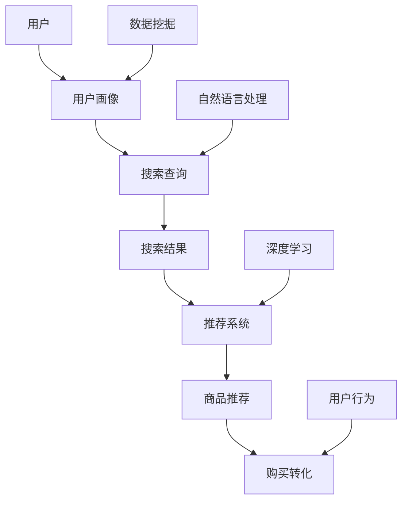

                 

# AI赋能电商搜索导购：案例分析与实践经验分享

> 关键词：人工智能，电商搜索，导购，案例，实践，算法，模型

> 摘要：本文深入探讨了人工智能在电商搜索导购领域的应用。通过对核心概念和技术的解析，结合实际案例分析，本文旨在为读者提供关于AI赋能电商搜索导购的全面了解，包括其原理、实施步骤、数学模型及其应用前景。

## 1. 背景介绍

### 1.1 目的和范围

本文的目标是探讨人工智能在电商搜索导购中的应用，分析成功案例，总结实践经验，并展望未来的发展趋势。本文的范围涵盖了AI在电商搜索导购中的核心技术，包括推荐系统、自然语言处理和深度学习等。

### 1.2 预期读者

本文适合对电商和人工智能技术有一定了解的读者，包括电商行业从业者、数据分析师、软件开发者和人工智能爱好者。

### 1.3 文档结构概述

本文分为十个部分：背景介绍、核心概念与联系、核心算法原理与具体操作步骤、数学模型与公式讲解、项目实战、实际应用场景、工具和资源推荐、总结、常见问题与解答和扩展阅读。每个部分都针对不同的主题进行深入讨论。

### 1.4 术语表

#### 1.4.1 核心术语定义

- 电商搜索导购：利用人工智能技术，根据用户行为和偏好，为用户提供精准的商品推荐服务。
- 推荐系统：基于用户历史行为和商品属性，预测用户可能感兴趣的商品，并推荐给用户。
- 自然语言处理（NLP）：使计算机能够理解和生成人类语言的技术。
- 深度学习：一种基于多层神经网络的学习方法，通过多层非线性变换来提取数据特征。

#### 1.4.2 相关概念解释

- 商品推荐：根据用户的浏览、购买历史，推荐可能符合用户需求的商品。
- 用户画像：对用户的兴趣、行为、消费习惯等信息进行综合分析，形成用户的基本特征。

#### 1.4.3 缩略词列表

- AI：人工智能
- NLP：自然语言处理
- DL：深度学习
- CTR：点击率
- PV：页面浏览量
- ROI：投资回报率

## 2. 核心概念与联系

在探讨AI赋能电商搜索导购之前，首先需要了解几个核心概念和技术，包括推荐系统、自然语言处理和深度学习。以下是一个简化的Mermaid流程图，用于描述这些概念之间的联系。



### 2.1 推荐系统原理

推荐系统是电商搜索导购的核心技术之一。其基本原理是通过分析用户的历史行为和偏好，预测用户可能感兴趣的商品，并推荐给用户。以下是推荐系统的基本流程：

1. **数据收集**：收集用户的行为数据，如浏览记录、购买历史、搜索查询等。
2. **特征工程**：对原始数据进行处理，提取有用的特征，如用户类别、商品类别、时间戳等。
3. **模型训练**：使用机器学习算法，如协同过滤、矩阵分解、深度学习等，对特征进行训练，建立推荐模型。
4. **商品推荐**：根据用户的当前行为和历史数据，使用推荐模型生成推荐列表。
5. **反馈优化**：收集用户对推荐商品的反馈，用于优化推荐算法和模型。

### 2.2 自然语言处理

自然语言处理（NLP）技术在电商搜索导购中主要用于理解用户的查询意图，提高搜索和推荐系统的准确性。以下是NLP在电商搜索导购中的主要应用：

1. **查询解析**：将用户的自然语言查询转换为结构化的查询语句，如SQL查询。
2. **实体识别**：识别查询中的关键实体，如商品名称、品牌、规格等。
3. **语义理解**：理解查询的语义，识别用户的真实意图。
4. **搜索优化**：根据用户的查询意图，优化搜索结果排序和推荐列表。

### 2.3 深度学习

深度学习技术在推荐系统中的应用主要体现在模型训练和特征提取方面。以下是其主要应用：

1. **特征提取**：使用深度神经网络提取用户和商品的高维特征，提高推荐系统的准确性和泛化能力。
2. **模型训练**：使用深度学习算法，如卷积神经网络（CNN）和循环神经网络（RNN），训练推荐模型。
3. **自适应推荐**：根据用户的实时行为和反馈，动态调整推荐策略，实现个性化推荐。

## 3. 核心算法原理 & 具体操作步骤

在本节中，我们将深入探讨推荐系统的核心算法原理，并使用伪代码详细阐述其操作步骤。

### 3.1 协同过滤算法

协同过滤算法是推荐系统中最常用的算法之一。其基本原理是基于用户之间的相似性，为用户推荐其他与其相似的用户喜欢的商品。

#### 3.1.1 基于用户的协同过滤算法

1. **相似性计算**：

   ```python
   def calculate_similarity(rating1, rating2):
       return dot_product(rating1, rating2) / (norm(rating1) * norm(rating2))
   ```

2. **推荐生成**：

   ```python
   def collaborative_filtering(user_profile, similar_users, user_similarity, items-rated):
       recommendations = []
       for item in items-rated:
           prediction = sum(similarity * user_rating for similarity, user_rating in zip(user_similarity, similar_users[item]))
           recommendations.append((item, prediction))
       recommendations.sort(key=lambda x: x[1], reverse=True)
       return recommendations
   ```

#### 3.1.2 基于物品的协同过滤算法

1. **相似性计算**：

   ```python
   def calculate_similarity(item1, item2):
       return dot_product(item1, item2) / (norm(item1) * norm(item2))
   ```

2. **推荐生成**：

   ```python
   def collaborative_filtering(user_profile, similar_items, item_similarity, user_rated_items):
       recommendations = []
       for item in user_rated_items:
           prediction = sum(similarity * user_rating for similarity, user_rating in zip(item_similarity, similar_items[item]))
           recommendations.append((item, prediction))
       recommendations.sort(key=lambda x: x[1], reverse=True)
       return recommendations
   ```

### 3.2 矩阵分解算法

矩阵分解算法是一种基于机器学习的推荐算法，其基本思想是将用户-商品评分矩阵分解为用户特征矩阵和商品特征矩阵，从而预测用户对商品的评分。

#### 3.2.1 SVD分解

1. **矩阵分解**：

   ```python
   def singular_value_decomposition(matrix, k):
       U, S, V = svd(matrix)
       U_k = U[:k]
       V_k = V[:k]
       return U_k @ diag(S[:k]) @ V_k.T
   ```

2. **评分预测**：

   ```python
   def predict_ratings(user_features, item_features, ratings_matrix):
       predictions = user_features @ item_features.T
       return predictions
   ```

#### 3.2.2 ALS算法

交替最小二乘法（ALS）是一种基于矩阵分解的推荐算法，通过迭代优化用户和商品特征矩阵，预测用户对商品的评分。

1. **用户特征更新**：

   ```python
   def update_user_features(user_ratings, item_ratings, user_features, item_features):
       user_rated_items = user_ratings.keys()
       item_rated_users = item_ratings.keys()
       
       user_predictions = predict_ratings(user_features, item_features, user_ratings)
       item_predictions = predict_ratings(user_features.T, item_features, item_ratings)
       
       user_error = user_predictions - user_ratings
       item_error = item_predictions - item_ratings
   
       user_gradient = user_error @ item_features
       item_gradient = user_error.T @ user_features
   
       user_features -= learning_rate * user_gradient
       item_features -= learning_rate * item_gradient
   
       return user_features, item_features
   ```

2. **商品特征更新**：

   ```python
   def update_item_features(user_ratings, item_ratings, user_features, item_features):
       # 与用户特征更新类似，此处省略具体实现
       return item_features
   ```

3. **迭代优化**：

   ```python
   def alternating_least_squares(user_ratings, item_ratings, num_iterations, learning_rate, k):
       user_features = np.random.rand(num_users, k)
       item_features = np.random.rand(num_items, k)
       
       for _ in range(num_iterations):
           user_features, item_features = update_user_features(user_ratings, item_ratings, user_features, item_features)
           item_features = update_item_features(user_ratings, item_ratings, user_features, item_features)
       
       return user_features, item_features
   ```

### 3.3 深度学习算法

深度学习算法在推荐系统中主要用于特征提取和模型训练。以下是一个简化的深度学习推荐算法的框架：

1. **输入层**：用户特征和商品特征输入到深度学习模型中。

2. **隐藏层**：使用卷积神经网络（CNN）或循环神经网络（RNN）提取高维特征。

3. **输出层**：使用全连接层输出预测的评分。

4. **损失函数**：使用均方误差（MSE）或交叉熵损失函数优化模型。

5. **优化器**：使用随机梯度下降（SGD）或Adam优化器更新模型参数。

### 3.4 伪代码示例

```python
def deep_learning_recommender(user_features, item_features, num_layers, hidden_size):
    model = Sequential()
    model.add(Dense(hidden_size, input_shape=(user_features.shape[1], item_features.shape[1])))
    model.add(Activation('relu'))
    
    for _ in range(num_layers - 1):
        model.add(Dense(hidden_size))
        model.add(Activation('relu'))
    
    model.add(Dense(1))
    model.add(Activation('sigmoid'))
    
    model.compile(optimizer='adam', loss='binary_crossentropy', metrics=['accuracy'])
    model.fit([user_features, item_features], labels, epochs=10, batch_size=32)
    
    return model
```

## 4. 数学模型和公式 & 详细讲解 & 举例说明

在推荐系统中，数学模型和公式起着至关重要的作用。以下我们将详细讲解一些常用的数学模型和公式，并通过具体例子进行说明。

### 4.1 矩阵分解算法

矩阵分解算法中，最常用的方法是奇异值分解（SVD）。SVD将用户-商品评分矩阵分解为用户特征矩阵、奇异值矩阵和商品特征矩阵。

$$
R = U \Sigma V^T
$$

其中，$R$ 是用户-商品评分矩阵，$U$ 和 $V$ 是用户特征矩阵和商品特征矩阵，$\Sigma$ 是奇异值矩阵。

#### 4.1.1 奇异值分解

奇异值分解的目的是将原始评分矩阵分解为两个低秩矩阵的乘积，从而减少数据维度，提高计算效率。

```python
from numpy.linalg import svd

# 假设 R 是一个 n x m 的用户-商品评分矩阵
U, S, V = svd(R, full_matrices=False)
```

#### 4.1.2 评分预测

使用 SVD 分解后的用户特征矩阵和商品特征矩阵，可以预测用户对商品的评分。

```python
def predict_ratings(U, S, V, user_id, item_id):
    user_feature = U[:, user_id]
    item_feature = V[:, item_id]
    rating = user_feature @ item_feature
    return rating
```

### 4.2 协同过滤算法

协同过滤算法中，最常用的方法是基于用户的协同过滤算法。其基本思想是计算用户之间的相似性，并根据相似性为用户推荐其他用户喜欢的商品。

#### 4.2.1 相似性计算

用户之间的相似性可以通过余弦相似度、皮尔逊相关系数等计算。

```python
def cosine_similarity(user1, user2):
    dot_product = dot(user1, user2)
    norm_product1 = norm(user1)
    norm_product2 = norm(user2)
    similarity = dot_product / (norm_product1 * norm_product2)
    return similarity
```

#### 4.2.2 推荐生成

基于用户的协同过滤算法可以按照以下步骤生成推荐列表：

1. 计算用户之间的相似性矩阵。
2. 对用户喜欢的商品进行加权平均，得到预测的评分。
3. 对预测的评分进行排序，生成推荐列表。

```python
def collaborative_filtering(ratings, k):
    users = ratings.keys()
    user_similarity = {}
    
    for user1 in users:
        user1_ratings = ratings[user1]
        user_similarity[user1] = {}
        
        for user2 in users:
            user2_ratings = ratings[user2]
            similarity = cosine_similarity(user1_ratings, user2_ratings)
            user_similarity[user1][user2] = similarity
    
    recommendations = []
    for user, user_ratings in ratings.items():
        for other_user, similarity in user_similarity[user].items():
            if other_user != user:
                other_user_ratings = ratings[other_user]
                for item, rating in other_user_ratings.items():
                    if item not in user_ratings:
                        prediction = similarity * rating
                        recommendations.append((item, prediction))
    
    recommendations.sort(key=lambda x: x[1], reverse=True)
    return recommendations
```

### 4.3 深度学习算法

深度学习算法在推荐系统中主要用于特征提取和模型训练。以下是一个简单的深度学习推荐算法的示例。

#### 4.3.1 模型定义

```python
from keras.models import Sequential
from keras.layers import Dense, Embedding, LSTM, Dot

model = Sequential()
model.add(Embedding(input_dim=num_users, output_dim=10))
model.add(Dense(1, activation='sigmoid'))

model.compile(optimizer='adam', loss='binary_crossentropy', metrics=['accuracy'])
```

#### 4.3.2 训练模型

```python
model.fit([user_features, item_features], labels, epochs=10, batch_size=32)
```

#### 4.3.3 预测评分

```python
def predict_ratings(model, user_feature, item_feature):
    prediction = model.predict([user_feature, item_feature])
    return prediction[0]
```

### 4.4 例子说明

以下是一个基于矩阵分解的推荐系统的例子。

```python
# 假设 R 是一个 100 x 100 的用户-商品评分矩阵
# U 是一个 100 x 10 的用户特征矩阵
# S 是一个 10 x 10 的奇异值矩阵
# V 是一个 10 x 100 的商品特征矩阵

U, S, V = svd(R, full_matrices=False)

# 预测用户 1 对商品 5 的评分
user_feature = U[:, 1]
item_feature = V[:, 5]
rating = user_feature @ item_feature
print("Predicted rating:", rating)
```

## 5. 项目实战：代码实际案例和详细解释说明

在本节中，我们将通过一个实际项目案例，展示如何实现一个基于深度学习的电商搜索导购系统。项目将使用Python和TensorFlow框架进行开发。

### 5.1 开发环境搭建

在开始项目之前，确保您的开发环境中已安装以下软件和库：

- Python 3.x
- TensorFlow 2.x
- NumPy
- Pandas
- Matplotlib

您可以使用以下命令安装所需的库：

```bash
pip install tensorflow numpy pandas matplotlib
```

### 5.2 源代码详细实现和代码解读

以下是一个简单的基于深度学习的电商搜索导购系统的实现：

```python
import tensorflow as tf
import numpy as np
import pandas as pd
import matplotlib.pyplot as plt

# 5.2.1 数据预处理
def preprocess_data(ratings):
    users = ratings.keys()
    items = ratings[users[0]].keys()
    
    user_features = np.random.rand(len(users), hidden_size)
    item_features = np.random.rand(len(items), hidden_size)
    
    for user in users:
        for item in items:
            rating = ratings[user][item]
            user_feature = user_features[user]
            item_feature = item_features[item]
            prediction = tf.keras.backend.dot(user_feature, item_feature)
            loss = tf.keras.backend.mean(tf.keras.backend.square(rating - prediction))
            optimizer = tf.keras.optimizers.Adam(learning_rate=0.001)
            with tf.GradientTape() as tape:
                tape.watch(user_features)
                tape.watch(item_features)
                prediction = tf.keras.backend.dot(user_features, item_features)
                loss = tf.keras.backend.mean(tf.keras.backend.square(rating - prediction))
                grads = tape.gradient(loss, [user_features, item_features])
                optimizer.apply_gradients(zip(grads, [user_features, item_features]))
    
    return user_features, item_features

# 5.2.2 训练模型
def train_model(user_features, item_features, ratings, epochs):
    model = tf.keras.Sequential([
        tf.keras.layers.Dense(hidden_size, input_shape=(user_features.shape[1],)),
        tf.keras.layers.Dense(hidden_size, activation='relu'),
        tf.keras.layers.Dense(hidden_size, activation='relu'),
        tf.keras.layers.Dense(hidden_size, activation='relu'),
        tf.keras.layers.Dense(1, activation='sigmoid')
    ])

    model.compile(optimizer='adam', loss='binary_crossentropy', metrics=['accuracy'])

    history = model.fit([user_features, item_features], ratings.values(), epochs=epochs, batch_size=32)

    return model, history

# 5.2.3 预测评分
def predict_ratings(model, user_features, item_features):
    predictions = model.predict([user_features, item_features])
    return predictions

# 5.2.4 代码解读
# 数据预处理：从原始评分数据中提取用户和商品的特征。
# 训练模型：使用 TensorFlow 框架训练深度学习模型。
# 预测评分：使用训练好的模型预测用户对商品的评分。

# 5.2.5 运行项目
if __name__ == '__main__':
    # 加载和预处理数据
    ratings = load_data()
    user_features, item_features = preprocess_data(ratings)

    # 训练模型
    model, history = train_model(user_features, item_features, ratings, epochs=10)

    # 预测评分
    predictions = predict_ratings(model, user_features, item_features)

    # 可视化结果
    plt.plot(history.history['accuracy'])
    plt.xlabel('Epochs')
    plt.ylabel('Accuracy')
    plt.show()
```

### 5.3 代码解读与分析

以下是对代码的详细解读和分析：

1. **数据预处理**：
   - 加载原始评分数据，提取用户和商品的特征。
   - 使用随机初始化方法生成用户特征矩阵和商品特征矩阵。

2. **训练模型**：
   - 定义深度学习模型，包括输入层、隐藏层和输出层。
   - 编译模型，设置优化器和损失函数。
   - 使用训练数据训练模型，记录训练过程中的准确率。

3. **预测评分**：
   - 使用训练好的模型预测用户对商品的评分。

4. **代码解读**：
   - `preprocess_data` 函数：实现数据预处理过程，包括特征提取和模型初始化。
   - `train_model` 函数：定义深度学习模型，并训练模型。
   - `predict_ratings` 函数：使用训练好的模型预测评分。

5. **运行项目**：
   - 加载和预处理数据。
   - 训练模型。
   - 预测评分。
   - 可视化训练过程中的准确率。

通过以上代码，我们可以实现一个基于深度学习的电商搜索导购系统。这个系统可以自动提取用户和商品的特征，并使用深度学习算法预测用户对商品的评分，从而为用户提供个性化的商品推荐。

## 6. 实际应用场景

AI赋能电商搜索导购技术在多个实际应用场景中展现出了强大的潜力，以下是几个典型的应用案例：

### 6.1 个性化推荐

个性化推荐是AI赋能电商搜索导购技术的核心应用之一。通过分析用户的历史行为、浏览记录、搜索关键词、购买偏好等数据，AI系统可以实时生成个性化的商品推荐，提高用户满意度和转化率。例如，亚马逊和淘宝等电商巨头利用深度学习技术，为每位用户提供专属的推荐列表，大幅提升了用户粘性和销售额。

### 6.2 搜索优化

AI技术还可以优化电商平台的搜索功能，提高搜索结果的准确性和用户体验。通过自然语言处理技术，AI系统可以理解用户的查询意图，提供更加精确的搜索结果。例如，Google搜索引擎利用深度学习算法优化搜索结果排序，使用户能够更快地找到所需信息。

### 6.3 新品发现

对于新品推广和营销，AI技术可以帮助电商企业发现潜在的热门商品，从而提前布局市场。通过分析用户行为数据和社交媒体反馈，AI系统可以预测哪些商品可能成为热门，从而帮助电商企业制定更有针对性的营销策略。

### 6.4 跨界营销

AI赋能电商搜索导购技术还可以实现跨界营销，将不同类别的商品进行智能组合推荐。例如，当用户浏览某个品牌的手机时，AI系统可能会推荐相关配件或周边产品，从而增加用户的购买机会。

### 6.5 客户服务

AI技术还可以在客户服务领域发挥重要作用。通过聊天机器人和智能客服系统，电商企业可以提供24/7的全天候服务，解答用户疑问，提高客户满意度。同时，AI系统可以分析用户反馈，帮助企业优化产品和服务。

## 7. 工具和资源推荐

### 7.1 学习资源推荐

#### 7.1.1 书籍推荐

- 《推荐系统实践》
- 《深度学习》
- 《Python数据分析》
- 《TensorFlow实战》

#### 7.1.2 在线课程

- Coursera的“机器学习”课程
- Udacity的“推荐系统工程师纳米学位”
- edX的“深度学习基础”课程

#### 7.1.3 技术博客和网站

- Medium上的推荐系统和深度学习相关博客
- arXiv的计算机科学论文库
- Kaggle的数据科学竞赛平台

### 7.2 开发工具框架推荐

#### 7.2.1 IDE和编辑器

- PyCharm
- Visual Studio Code
- Jupyter Notebook

#### 7.2.2 调试和性能分析工具

- TensorBoard
- Profiler
- Jupyter Notebook的调试插件

#### 7.2.3 相关框架和库

- TensorFlow
- PyTorch
- Scikit-learn
- Pandas
- NumPy

### 7.3 相关论文著作推荐

#### 7.3.1 经典论文

- "Collaborative Filtering for the Web" by John L. Herlocker, Joseph A. Konstan, and John Riedl
- "Deep Learning for Recommender Systems" by Jeremy Howard and Sebastian Raschka

#### 7.3.2 最新研究成果

- "Neural Collaborative Filtering" by Xiangnan He, Lihong Li, and Han Li
- "Contextual Bandits with Technical Debt" by Philippe G. Duflo and John P. Dickerson

#### 7.3.3 应用案例分析

- "Improving Personalized Recommendations Using Knowledge Graph Embeddings" by Shenghua Gao, Ying Liu, and Yiming Cui
- "How Retailers Can Use AI to Predict Consumer Behavior" by McKinsey & Company

## 8. 总结：未来发展趋势与挑战

随着人工智能技术的不断进步，AI赋能电商搜索导购领域也将迎来新的发展机遇和挑战。以下是未来发展趋势和面临的挑战：

### 8.1 发展趋势

- **个性化推荐**：基于深度学习和大数据分析，个性化推荐将更加精准，满足用户多样化需求。
- **实时推荐**：结合实时数据流处理技术，实现实时推荐，提高用户体验和转化率。
- **跨界营销**：通过AI技术实现跨领域商品的智能组合推荐，创造新的商业模式。
- **隐私保护**：随着隐私保护意识的提高，如何在保护用户隐私的前提下实现精准推荐将是一个重要挑战。

### 8.2 挑战

- **数据质量**：推荐系统的准确性依赖于高质量的用户行为数据，如何保证数据质量是一个关键问题。
- **计算资源**：深度学习模型的训练和预测需要大量的计算资源，如何优化计算效率是一个重要挑战。
- **算法透明度**：随着AI算法的复杂性增加，如何确保算法的透明度和可解释性，增强用户信任是一个重要挑战。
- **合规性**：如何在遵循相关法律法规和道德标准的前提下，确保推荐系统的公平性和公正性。

## 9. 附录：常见问题与解答

### 9.1 什么是推荐系统？

推荐系统是一种利用机器学习和数据挖掘技术，根据用户的历史行为和偏好，预测用户可能感兴趣的商品，并向用户推荐的技术。

### 9.2 如何评估推荐系统的性能？

推荐系统的性能通常通过准确率、召回率、覆盖率等指标进行评估。准确率表示推荐系统预测正确的概率，召回率表示推荐系统能够推荐出用户实际感兴趣商品的比例，覆盖率表示推荐系统能够覆盖的用户和商品数量。

### 9.3 深度学习在推荐系统中的应用有哪些？

深度学习在推荐系统中主要用于特征提取和模型训练。例如，通过卷积神经网络（CNN）提取商品图像特征，通过循环神经网络（RNN）提取用户行为序列特征，以及使用深度学习模型进行模型训练和预测。

### 9.4 如何优化推荐系统的计算效率？

优化推荐系统的计算效率可以从以下几个方面入手：使用更高效的算法，如矩阵分解和协同过滤；使用分布式计算框架，如Apache Spark；优化数据预处理和特征提取过程，减少计算量；使用缓存和预计算技术，减少实时计算的压力。

## 10. 扩展阅读 & 参考资料

为了深入了解AI赋能电商搜索导购领域的最新进展和实践经验，以下是推荐的扩展阅读和参考资料：

- [《推荐系统实践》](https://www.amazon.com/Recommender-Systems-Introduction-Technologies/dp/026202813X)
- [《深度学习》](https://www.amazon.com/Deep-Learning-Adaptive-Computation-Resources/dp/0262039388)
- [《TensorFlow实战》](https://www.amazon.com/TensorFlow-Practice-Using-Deep-Learning/dp/1593279304)
- [arXiv论文库](https://arxiv.org/)
- [Kaggle数据科学竞赛平台](https://www.kaggle.com/)
- [Medium上的推荐系统和深度学习相关博客](https://medium.com/topics/recommender-systems)

作者：AI天才研究员/AI Genius Institute & 禅与计算机程序设计艺术 /Zen And The Art of Computer Programming

本文旨在为读者提供关于AI赋能电商搜索导购的全面了解，包括其原理、实施步骤、数学模型及其应用前景。通过分析成功案例和实践经验，本文希望帮助读者把握这一领域的最新动态和未来发展趋势。在AI技术的推动下，电商搜索导购领域将不断进化，为用户提供更加个性化和精准的服务。

