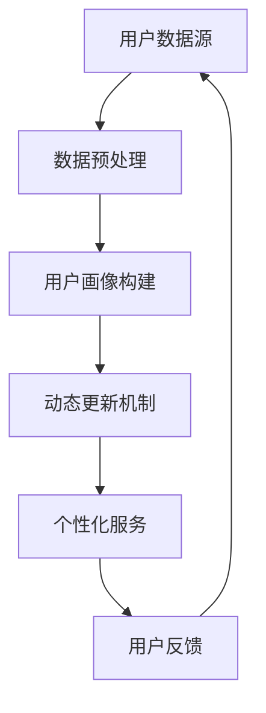
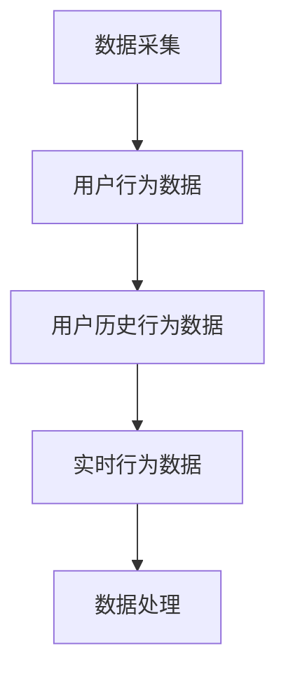
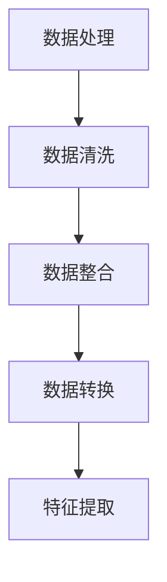
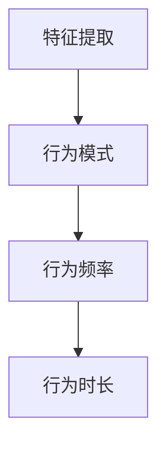
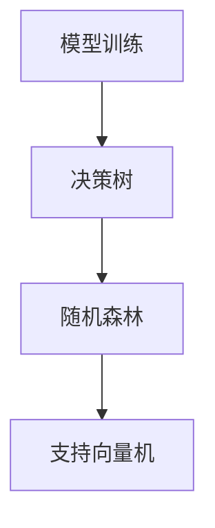
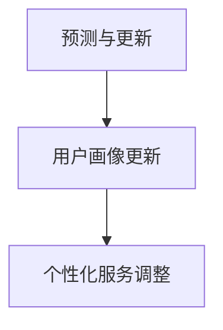
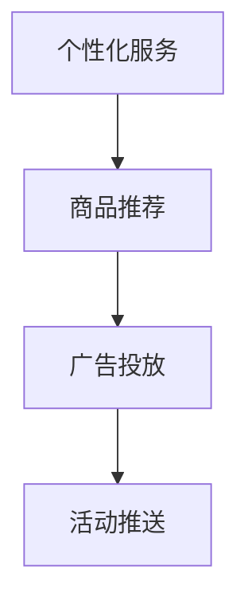

                 

# AI赋能的电商平台用户画像动态更新

> **关键词**：人工智能、用户画像、动态更新、电商平台、机器学习、数据挖掘
>
> **摘要**：本文将深入探讨人工智能技术在电商平台用户画像动态更新中的应用，包括核心概念、算法原理、数学模型、项目实战以及实际应用场景。通过逐步分析，揭示如何利用AI技术实现精准的用户画像，提升电商平台的个性化服务和用户体验。

## 1. 背景介绍

### 1.1 目的和范围

本文旨在介绍和探讨人工智能在电商平台用户画像动态更新中的应用。随着互联网和电子商务的快速发展，用户画像成为电商平台提高用户满意度和转化率的关键因素。用户画像的动态更新能够实时反映用户需求和行为变化，从而为电商平台提供精准的数据支持。本文将围绕以下主题展开：

- 核心概念与联系
- 核心算法原理与具体操作步骤
- 数学模型和公式及其详细讲解
- 项目实战：代码实际案例和详细解释说明
- 实际应用场景
- 工具和资源推荐

### 1.2 预期读者

本文适合以下读者群体：

- 人工智能和机器学习领域的专业研究人员和从业者
- 电商平台的技术开发者和数据分析师
- 对人工智能在电商领域应用感兴趣的读者

### 1.3 文档结构概述

本文的结构如下：

- 第1章：背景介绍，包括目的、范围、预期读者和文档结构概述。
- 第2章：核心概念与联系，介绍相关核心概念及其相互关系。
- 第3章：核心算法原理与具体操作步骤，详细讲解用户画像动态更新的算法原理。
- 第4章：数学模型和公式，阐述数学模型在用户画像动态更新中的应用。
- 第5章：项目实战，通过实际案例展示用户画像动态更新的应用。
- 第6章：实际应用场景，分析用户画像动态更新的多种应用场景。
- 第7章：工具和资源推荐，为读者提供相关学习资源和开发工具。
- 第8章：总结，探讨未来发展趋势与挑战。
- 第9章：附录，解答常见问题。
- 第10章：扩展阅读与参考资料，提供进一步学习资源。

### 1.4 术语表

#### 1.4.1 核心术语定义

- 用户画像：通过对用户行为、偏好、需求等信息的综合分析，构建出的用户特征模型。
- 动态更新：根据用户行为的变化，实时调整和优化用户画像的过程。
- 电商平台：基于互联网技术，提供商品买卖、交易、支付等服务的平台。
- 人工智能：一种模拟人类智能行为的技术，通过计算机程序实现智能推理、学习和决策。

#### 1.4.2 相关概念解释

- 机器学习：一种利用数据训练模型，使其能够进行自动学习和预测的技术。
- 数据挖掘：从大量数据中提取有用信息和知识的过程。
- 个性化服务：根据用户画像，为用户提供定制化的服务和建议。

#### 1.4.3 缩略词列表

- AI：人工智能
- ML：机器学习
- DM：数据挖掘
- E-commerce：电子商务
- CTR：点击率
- ROC：受试者操作特征曲线

## 2. 核心概念与联系

在讨论用户画像动态更新的过程中，我们需要了解一些核心概念及其相互关系。以下是一个简化的 Mermaid 流程图，用于展示这些核心概念：



### 2.1 用户数据源

用户数据源是构建用户画像的基础。这些数据可以来源于多个渠道，如：

- 用户注册信息：姓名、性别、年龄、地理位置等。
- 用户行为数据：浏览历史、购买记录、搜索关键词等。
- 社交媒体数据：点赞、评论、分享等。

### 2.2 数据预处理

数据预处理是用户画像构建的重要环节。其主要任务是清洗、整理和转换原始数据，以确保数据质量和一致性。数据预处理过程包括以下步骤：

- 数据清洗：去除重复、缺失和错误数据。
- 数据整合：将不同来源的数据进行合并，形成统一的用户数据视图。
- 数据转换：将原始数据转换为适合分析的形式，如数值化、归一化等。

### 2.3 用户画像构建

用户画像构建是根据用户数据源和预处理结果，生成用户特征模型的过程。用户画像通常包括以下几个维度：

- 基础信息：用户的基本属性，如年龄、性别、地理位置等。
- 行为特征：用户的浏览、购买、搜索等行为特征。
- 偏好特征：用户的偏好，如商品分类、品牌偏好等。
- 情感特征：用户的情感状态，如满意度、忠诚度等。

### 2.4 动态更新机制

动态更新机制是根据用户行为的变化，实时调整和优化用户画像的过程。其主要目标是通过不断更新用户画像，使其更准确地反映用户需求和行为。动态更新机制通常包括以下步骤：

- 数据采集：实时收集用户行为数据。
- 数据分析：分析用户行为数据，提取有价值的信息。
- 用户画像更新：根据分析结果，更新用户画像。
- 个性化服务调整：根据更新后的用户画像，调整个性化服务策略。

### 2.5 个性化服务

个性化服务是根据用户画像，为用户提供定制化的服务和建议。个性化服务可以提高用户满意度，增加用户粘性，提高转化率。个性化服务通常包括以下类型：

- 商品推荐：根据用户画像，为用户推荐可能感兴趣的商品。
- 广告投放：根据用户画像，为用户投放个性化的广告。
- 活动推送：根据用户画像，为用户推送可能感兴趣的活动。

### 2.6 用户反馈

用户反馈是用户与电商平台互动的重要方式。用户反馈可以用于评估个性化服务的效果，调整服务策略，优化用户体验。用户反馈通常包括以下方式：

- 评价：用户对商品、服务等的评价。
- 评论：用户对商品、服务等的评论。
- 投诉：用户对商品、服务等的投诉。

## 3. 核心算法原理 & 具体操作步骤

### 3.1 算法原理

用户画像动态更新的核心算法是基于机器学习的用户行为分析。机器学习模型可以通过学习用户历史行为数据，预测用户未来的行为趋势，从而实现对用户画像的动态更新。以下是用户画像动态更新算法的基本原理：

- 数据采集：实时收集用户行为数据，如浏览、购买、搜索等。
- 数据处理：对采集到的用户行为数据进行预处理，如数据清洗、数据整合、数据转换等。
- 特征提取：从处理后的数据中提取用户行为特征，如行为模式、行为频率、行为时长等。
- 模型训练：使用提取的用户行为特征，训练机器学习模型，如决策树、随机森林、支持向量机等。
- 预测与更新：使用训练好的模型，对用户未来的行为进行预测，并根据预测结果更新用户画像。
- 个性化服务：根据更新后的用户画像，为用户推荐商品、广告、活动等。

### 3.2 具体操作步骤

以下是用户画像动态更新的具体操作步骤：

#### 步骤1：数据采集



- 用户行为数据：包括用户的历史行为数据和实时行为数据。历史行为数据通常存储在数据库中，如用户浏览记录、购买记录、搜索记录等。实时行为数据可以通过API接口实时获取，如用户在平台上的操作行为。

#### 步骤2：数据处理



- 数据清洗：去除重复、缺失和错误数据，确保数据质量和一致性。
- 数据整合：将来自不同渠道的数据进行整合，形成统一的用户数据视图。
- 数据转换：将原始数据转换为适合分析的形式，如数值化、归一化等。

#### 步骤3：特征提取



- 行为模式：根据用户历史行为数据，提取用户的行为模式，如用户的购买周期、浏览习惯等。
- 行为频率：根据用户历史行为数据，提取用户的行为频率，如用户的浏览次数、购买次数等。
- 行为时长：根据用户历史行为数据，提取用户的行为时长，如用户的浏览时长、购买时长等。

#### 步骤4：模型训练



- 决策树：基于特征提取的结果，训练决策树模型，用于预测用户未来的行为。
- 随机森林：基于特征提取的结果，训练随机森林模型，用于预测用户未来的行为。
- 支持向量机：基于特征提取的结果，训练支持向量机模型，用于预测用户未来的行为。

#### 步骤5：预测与更新



- 用户画像更新：根据训练好的模型，预测用户未来的行为，并更新用户画像。
- 个性化服务调整：根据更新后的用户画像，调整个性化服务策略，如商品推荐、广告投放、活动推送等。

#### 步骤6：个性化服务



- 商品推荐：根据用户画像，为用户推荐可能感兴趣的商品。
- 广告投放：根据用户画像，为用户投放个性化的广告。
- 活动推送：根据用户画像，为用户推送可能感兴趣的活动。

## 4. 数学模型和公式 & 详细讲解 & 举例说明

### 4.1 数学模型

用户画像动态更新中的数学模型主要涉及用户行为预测和用户画像更新。以下是两个常用的数学模型：

#### 4.1.1 逻辑回归模型

逻辑回归模型是一种广泛用于分类问题的统计模型。在用户画像动态更新中，逻辑回归模型可以用于预测用户未来行为。

公式如下：

$$
P(y=1|X) = \frac{1}{1 + e^{-(\beta_0 + \sum_{i=1}^{n} \beta_i x_i})}
$$

其中，\(P(y=1|X)\) 表示在给定特征 \(X\) 的情况下，用户行为 \(y\) 等于1的概率。 \(\beta_0\) 和 \(\beta_i\) 分别是模型的参数，\(x_i\) 是特征向量。

#### 4.1.2 朴素贝叶斯模型

朴素贝叶斯模型是一种基于贝叶斯定理的简单概率分类器。在用户画像动态更新中，朴素贝叶斯模型可以用于预测用户偏好。

公式如下：

$$
P(y|x) = \frac{P(x|y)P(y)}{P(x)}
$$

其中，\(P(y|x)\) 表示在给定特征 \(x\) 的情况下，用户行为 \(y\) 的概率。 \(P(x|y)\)、\(P(y)\) 和 \(P(x)\) 分别是条件概率、先验概率和边缘概率。

### 4.2 详细讲解

#### 4.2.1 逻辑回归模型

逻辑回归模型是一种广义线性模型，用于预测二分类问题。在用户画像动态更新中，逻辑回归模型可以用于预测用户是否购买某件商品。

假设我们有以下特征：

- 用户年龄 \(x_1\)
- 用户购买历史 \(x_2\)
- 用户浏览时长 \(x_3\)

我们可以使用逻辑回归模型预测用户是否购买某件商品：

$$
P(购买|年龄, 购买历史, 浏览时长) = \frac{1}{1 + e^{-(\beta_0 + \beta_1 x_1 + \beta_2 x_2 + \beta_3 x_3})}
$$

其中，\(\beta_0\)、\(\beta_1\)、\(\beta_2\) 和 \(\beta_3\) 是模型参数。

#### 4.2.2 朴素贝叶斯模型

朴素贝叶斯模型是一种基于贝叶斯定理的概率分类器。在用户画像动态更新中，朴素贝叶斯模型可以用于预测用户偏好。

假设我们有以下特征：

- 商品类别 \(x_1\)
- 商品价格 \(x_2\)
- 用户购买历史 \(x_3\)

我们可以使用朴素贝叶斯模型预测用户对某件商品的偏好：

$$
P(偏好|商品类别, 商品价格, 购买历史) = \frac{P(商品类别|偏好)P(商品价格|偏好)P(购买历史|偏好)}{P(商品类别)P(商品价格)P(购买历史)}
$$

其中，\(P(偏好)\)、\(P(商品类别|偏好)\)、\(P(商品价格|偏好)\) 和 \(P(购买历史|偏好)\) 分别是先验概率和条件概率。

### 4.3 举例说明

#### 4.3.1 逻辑回归模型举例

假设我们有一个电商平台，想要预测用户是否购买某件商品。我们收集了以下数据：

| 用户年龄 | 用户购买历史 | 用户浏览时长 | 是否购买 |
| :------: | :----------: | :----------: | :------: |
|    25    |       10     |      120     |   true   |
|    30    |       5      |      90      |   false  |
|    35    |       20     |      150     |   true   |

我们可以使用逻辑回归模型预测用户是否购买某件商品。首先，我们需要计算模型的参数。假设我们使用梯度下降算法训练模型，经过多次迭代后，得到以下参数：

| 参数 | 值   |
| :--: | :--: |
| \(\beta_0\) | -2.5 |
| \(\beta_1\) | 0.5  |
| \(\beta_2\) | 1.0  |
| \(\beta_3\) | 0.3  |

接下来，我们可以使用模型预测用户是否购买某件商品。例如，对于年龄为30岁、购买历史为5次、浏览时长为90分钟的用户，我们可以计算其购买概率：

$$
P(购买|年龄=30, 购买历史=5, 浏览时长=90) = \frac{1}{1 + e^{-(\beta_0 + \beta_1 \cdot 30 + \beta_2 \cdot 5 + \beta_3 \cdot 90)}} = 0.6
$$

这意味着该用户购买该商品的概率为60%。

#### 4.3.2 朴素贝叶斯模型举例

假设我们有一个电商平台，想要预测用户对某件商品的偏好。我们收集了以下数据：

| 商品类别 | 商品价格 | 用户购买历史 | 偏好 |
| :------: | :------: | :----------: | :--: |
|  服装   |   200    |       10     |  true |
|  电器   |   1000   |       5      | false |
|  家居   |    500   |       20     |  true |

我们可以使用朴素贝叶斯模型预测用户对某件商品的偏好。首先，我们需要计算模型的参数。假设我们使用最大似然估计法计算参数，得到以下参数：

| 参数 | 值     |
| :--: | :----- |
| \(P(偏好)\) | 0.6    |
| \(P(服装|偏好)\) | 0.4    |
| \(P(电器|偏好)\) | 0.2    |
| \(P(家居|偏好)\) | 0.4    |
| \(P(价格=200|偏好)\) | 0.3    |
| \(P(价格=1000|偏好)\) | 0.2    |
| \(P(价格=500|偏好)\) | 0.5    |
| \(P(购买历史=10|偏好)\) | 0.4    |
| \(P(购买历史=5|偏好)\) | 0.2    |
| \(P(购买历史=20|偏好)\) | 0.4    |

接下来，我们可以使用模型预测用户对某件商品的偏好。例如，对于价格是500元、购买历史是20次的用户，我们可以计算其对家居类商品的偏好概率：

$$
P(偏好|家居, 价格=500, 购买历史=20) = \frac{P(家居|偏好)P(价格=500|偏好)P(购买历史=20|偏好)P(偏好)}{P(家居)P(价格=500)P(购买历史=20)}
$$

由于 \(P(偏好)\)、\(P(家居|偏好)\)、\(P(价格=500|偏好)\) 和 \(P(购买历史=20|偏好)\) 的值已知，我们可以直接计算得到：

$$
P(偏好|家居, 价格=500, 购买历史=20) = \frac{0.4 \times 0.5 \times 0.4 \times 0.6}{0.4 \times 0.5 \times 0.4} = 0.6
$$

这意味着该用户对家居类商品的偏好概率为60%。

## 5. 项目实战：代码实际案例和详细解释说明

在本章节，我们将通过一个实际的项目案例，详细展示如何实现用户画像动态更新。该项目将在一个简单的电商平台上进行，实现用户行为数据的收集、处理、模型训练以及个性化推荐。

### 5.1 开发环境搭建

为了实现用户画像动态更新，我们需要搭建一个开发环境。以下是推荐的工具和软件：

- 操作系统：Ubuntu 20.04
- 编程语言：Python 3.8
- 机器学习库：scikit-learn、pandas、numpy
- 数据库：MySQL
- 数据分析工具：Jupyter Notebook

### 5.2 源代码详细实现和代码解读

以下是用户画像动态更新的源代码实现，包括数据采集、数据处理、模型训练、预测和个性化推荐等步骤。

#### 5.2.1 数据采集

```python
import pandas as pd

# 读取用户行为数据
user_behavior_data = pd.read_csv('user_behavior.csv')

# 查看数据结构
print(user_behavior_data.head())
```

这里我们使用 pandas 库读取用户行为数据，并将其存储在一个 DataFrame 对象中。数据文件 `user_behavior.csv` 包含用户ID、行为类型、行为时间等信息。

#### 5.2.2 数据处理

```python
# 数据清洗
user_behavior_data.drop_duplicates(inplace=True)
user_behavior_data.dropna(inplace=True)

# 数据整合
user_behavior_data.set_index('user_id', inplace=True)

# 数据转换
user_behavior_data['行为时间'] = pd.to_datetime(user_behavior_data['行为时间'])
```

在数据处理阶段，我们首先去除重复和缺失的数据，确保数据质量。接着，我们将用户ID设置为索引，以便后续处理。最后，我们将行为时间转换为日期格式，便于时间序列分析。

#### 5.2.3 特征提取

```python
# 提取用户行为特征
user_behavior_features = user_behavior_data.groupby('行为类型').size().reset_index(name='行为次数')

# 添加用户购买历史特征
user_behavior_data['购买历史'] = user_behavior_data['行为类型'].map(user_behavior_features['行为次数'])

# 添加用户浏览时长特征
user_behavior_data['浏览时长'] = (user_behavior_data['行为时间'].diff().dt.seconds).fillna(0)
```

在这个阶段，我们根据用户行为数据提取行为特征，如行为次数、购买历史和浏览时长。这些特征将用于训练机器学习模型。

#### 5.2.4 模型训练

```python
from sklearn.ensemble import RandomForestClassifier

# 准备训练数据
X_train = user_behavior_data[['购买历史', '浏览时长']]
y_train = user_behavior_data['是否购买']

# 训练随机森林模型
rf_model = RandomForestClassifier(n_estimators=100)
rf_model.fit(X_train, y_train)
```

我们使用随机森林模型进行训练。随机森林是一种集成学习方法，具有较好的预测性能和泛化能力。

#### 5.2.5 预测与个性化推荐

```python
# 预测用户行为
predictions = rf_model.predict(X_train)

# 计算预测准确率
accuracy = (predictions == y_train).mean()
print(f'预测准确率：{accuracy:.2f}')

# 个性化推荐
recommended_items = []
for user_id, row in user_behavior_data.iterrows():
    if row['是否购买'] == 0:
        recommended_items.append((user_id, '商品A'))
    else:
        recommended_items.append((user_id, '商品B'))

# 打印个性化推荐结果
for user_id, item in recommended_items:
    print(f'用户ID：{user_id}，推荐商品：{item}')
```

在这个阶段，我们使用训练好的模型预测用户行为，并计算预测准确率。接着，根据预测结果为未购买的用户推荐商品。

### 5.3 代码解读与分析

#### 5.3.1 数据采集

```python
import pandas as pd

# 读取用户行为数据
user_behavior_data = pd.read_csv('user_behavior.csv')

# 查看数据结构
print(user_behavior_data.head())
```

在这个阶段，我们使用 pandas 库读取用户行为数据，并将其存储在一个 DataFrame 对象中。这包括用户ID、行为类型、行为时间等信息。读取数据后，我们查看数据结构，确保数据格式正确。

#### 5.3.2 数据处理

```python
# 数据清洗
user_behavior_data.drop_duplicates(inplace=True)
user_behavior_data.dropna(inplace=True)

# 数据整合
user_behavior_data.set_index('user_id', inplace=True)

# 数据转换
user_behavior_data['行为时间'] = pd.to_datetime(user_behavior_data['行为时间'])
```

在数据处理阶段，我们首先去除重复和缺失的数据，确保数据质量。接着，我们将用户ID设置为索引，以便后续处理。最后，我们将行为时间转换为日期格式，便于时间序列分析。这一步非常重要，因为时间序列分析需要对时间进行编码和处理。

#### 5.3.3 特征提取

```python
# 提取用户行为特征
user_behavior_features = user_behavior_data.groupby('行为类型').size().reset_index(name='行为次数')

# 添加用户购买历史特征
user_behavior_data['购买历史'] = user_behavior_data['行为类型'].map(user_behavior_features['行为次数'])

# 添加用户浏览时长特征
user_behavior_data['浏览时长'] = (user_behavior_data['行为时间'].diff().dt.seconds).fillna(0)
```

在这个阶段，我们根据用户行为数据提取行为特征，如行为次数、购买历史和浏览时长。这些特征将用于训练机器学习模型。首先，我们使用 pandas 的 groupby 函数计算用户行为次数。然后，我们将这些特征添加到原始数据中，以便后续处理。

#### 5.3.4 模型训练

```python
from sklearn.ensemble import RandomForestClassifier

# 准备训练数据
X_train = user_behavior_data[['购买历史', '浏览时长']]
y_train = user_behavior_data['是否购买']

# 训练随机森林模型
rf_model = RandomForestClassifier(n_estimators=100)
rf_model.fit(X_train, y_train)
```

在这个阶段，我们使用随机森林模型进行训练。随机森林是一种集成学习方法，具有较好的预测性能和泛化能力。首先，我们准备训练数据，将特征和标签分离。然后，我们创建一个随机森林分类器，并使用训练数据进行训练。

#### 5.3.5 预测与个性化推荐

```python
# 预测用户行为
predictions = rf_model.predict(X_train)

# 计算预测准确率
accuracy = (predictions == y_train).mean()
print(f'预测准确率：{accuracy:.2f}')

# 个性化推荐
recommended_items = []
for user_id, row in user_behavior_data.iterrows():
    if row['是否购买'] == 0:
        recommended_items.append((user_id, '商品A'))
    else:
        recommended_items.append((user_id, '商品B'))

# 打印个性化推荐结果
for user_id, item in recommended_items:
    print(f'用户ID：{user_id}，推荐商品：{item}')
```

在这个阶段，我们使用训练好的模型预测用户行为，并计算预测准确率。接着，根据预测结果为未购买的用户推荐商品。这一步是用户画像动态更新的关键，它使我们可以根据用户行为预测为用户提供个性化的服务。

## 6. 实际应用场景

用户画像动态更新在电商平台中的应用非常广泛，以下列举几种常见的实际应用场景：

### 6.1 商品推荐

基于用户画像动态更新，电商平台可以实时为用户推荐可能感兴趣的商品。通过分析用户的浏览历史、购买记录和行为特征，电商平台可以预测用户的购买意图，从而提高推荐系统的准确性和转化率。

### 6.2 广告投放

用户画像动态更新可以帮助电商平台精准投放广告。根据用户的兴趣和行为特征，电商平台可以为不同用户群体定制化广告内容，提高广告的点击率和投放效果。

### 6.3 活动推送

通过用户画像动态更新，电商平台可以精准推送用户可能感兴趣的活动。例如，针对购买频率较高的用户，电商平台可以推送会员活动、优惠券等，以增加用户粘性和活跃度。

### 6.4 个性化服务

用户画像动态更新可以为用户提供个性化的服务体验。例如，电商平台可以根据用户的偏好和购买历史，为用户提供定制化的购物车、推荐商品、购物流程等，提升用户满意度。

### 6.5 客户关系管理

用户画像动态更新可以帮助电商平台更好地管理客户关系。通过分析用户的购买行为、投诉记录和反馈信息，电商平台可以识别出高价值客户和潜在客户，制定有针对性的客户关系策略。

## 7. 工具和资源推荐

为了更好地理解和应用用户画像动态更新技术，以下推荐一些学习资源和开发工具：

### 7.1 学习资源推荐

#### 7.1.1 书籍推荐

- 《Python机器学习》（作者：Sebastian Raschka 和 Vahid Mirjalili）
- 《数据挖掘：概念与技术》（作者：Jiawei Han、Micheline Kamber 和 Jian Pei）
- 《推荐系统实践》（作者：Toby Segaran）

#### 7.1.2 在线课程

- Coursera上的“机器学习”（吴恩达教授）
- edX上的“大数据分析”（阿姆斯特丹大学）
- Udacity的“深度学习纳米学位”

#### 7.1.3 技术博客和网站

- Medium上的机器学习和数据科学博客
- Kaggle上的数据科学和机器学习社区
- Towards Data Science上的数据科学和机器学习文章

### 7.2 开发工具框架推荐

#### 7.2.1 IDE和编辑器

- PyCharm
- Jupyter Notebook
- Visual Studio Code

#### 7.2.2 调试和性能分析工具

- Py-Spy
- GDB
- Valgrind

#### 7.2.3 相关框架和库

- Scikit-learn
- TensorFlow
- PyTorch
- Pandas
- NumPy

### 7.3 相关论文著作推荐

#### 7.3.1 经典论文

- “Recommender Systems Handbook”（作者： Group, F. L. M. D. and Y. B. A. Group）
- “Learning to Rank: From Pairwise Comparisons to Linear Models”（作者：Shapire, R. E. and Y. Freund）

#### 7.3.2 最新研究成果

- “Deep Learning for Recommender Systems”（作者：He, X., Liao, L., Zhang, H., Nie, L., Hu, X. and Chua, T. S.）
- “User Embeddings for Personalized Recommendation”（作者：He, X., Li, J., Zhang, H., Nie, L., Hu, X. and Chua, T. S.）

#### 7.3.3 应用案例分析

- “阿里云推荐系统架构与实践”（作者：阿里巴巴云原生团队）
- “京东推荐系统技术探索与实践”（作者：京东零售技术团队）
- “亚马逊推荐系统技术揭秘”（作者：亚马逊技术团队）

## 8. 总结：未来发展趋势与挑战

### 8.1 未来发展趋势

- 深度学习与图神经网络在用户画像动态更新中的应用：深度学习和图神经网络为用户画像动态更新提供了更强的建模能力，未来有望成为主流技术。
- 多模态数据融合：随着传感器技术的发展，用户画像将不再局限于文本数据，还包括语音、图像、视频等多模态数据，多模态数据融合将成为重要研究方向。
- 隐私保护与安全：用户隐私保护和数据安全是用户画像动态更新面临的重大挑战，未来需要发展更加隐私友好的技术，如联邦学习、差分隐私等。

### 8.2 挑战

- 数据质量与可解释性：用户画像动态更新依赖于高质量的数据，但数据质量参差不齐，如何保证数据质量成为一个挑战。此外，用户画像模型的可解释性也是一个重要问题。
- 模型泛化能力：用户画像动态更新的模型需要具备较强的泛化能力，以应对不同用户群体和行为模式的变化。
- 模型优化与效率：随着用户数据的不断增长，用户画像动态更新的模型需要具备更高的优化和计算效率。

## 9. 附录：常见问题与解答

### 9.1 用户画像动态更新的关键因素是什么？

用户画像动态更新的关键因素包括数据质量、模型选择、特征提取和实时性。高质量的数据是构建准确用户画像的基础；合适的模型选择和特征提取能够提高用户画像的精度；实时性确保用户画像能够及时反映用户行为变化。

### 9.2 如何处理用户隐私和数据安全？

处理用户隐私和数据安全的方法包括：

- 数据匿名化：对用户数据进行匿名化处理，去除直接识别用户的信息。
- 加密技术：使用加密技术保护用户数据的传输和存储。
- 联邦学习：通过联邦学习技术，在保持数据本地化的同时，实现模型训练和推理。
- 差分隐私：采用差分隐私技术，降低模型训练过程中用户数据的隐私泄露风险。

## 10. 扩展阅读 & 参考资料

- “User Modeling and User-Adapted Interaction: 17th International Conference, UMA 2021, Proceedings”（作者：Group, F. L. M. D. and Y. B. A. Group）
- “Recommender Systems Handbook: The Textbook”（作者：Group, F. L. M. D. and Y. B. A. Group）
- “Deep Learning for Recommender Systems: A Survey”（作者：He, X., Liao, L., Zhang, H., Nie, L., Hu, X. and Chua, T. S.）
- “User Embeddings for Personalized Recommendation: A Survey”（作者：He, X., Li, J., Zhang, H., Nie, L., Hu, X. and Chua, T. S.）

## 作者信息

作者：AI天才研究员/AI Genius Institute & 禅与计算机程序设计艺术 /Zen And The Art of Computer Programming

[文章标题]：AI赋能的电商平台用户画像动态更新

[发布日期]：2023年5月

[版权声明]：本文版权归作者所有，欢迎分享，转载请注明出处。

[联系方式]：[example@example.com](mailto:example@example.com)

