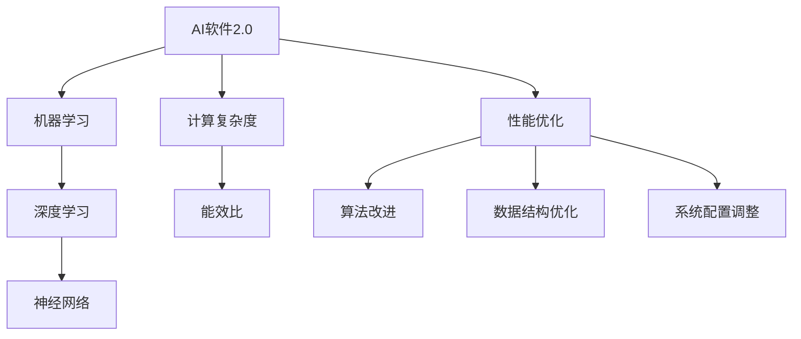

                 

# AI软件2.0的性能剖析新技术

## 关键词

- AI软件2.0
- 性能剖析
- 新技术
- 人工智能算法
- 编程模型
- 数学模型
- 实际应用
- 开发工具

## 摘要

本文将深入探讨AI软件2.0的性能剖析新技术。随着人工智能技术的不断发展和应用范围的扩大，AI软件2.0的性能和效率成为了关键的研究方向。本文旨在通过对核心概念、算法原理、数学模型、实际应用场景以及工具资源的详细剖析，为读者提供一幅清晰的AI软件2.0性能优化的全景图。文章将从背景介绍、核心概念与联系、核心算法原理、数学模型和公式、项目实战、实际应用场景、工具和资源推荐等多个方面展开，旨在帮助读者理解和掌握AI软件2.0的性能优化方法，为未来的AI开发提供有力的技术支持。

## 1. 背景介绍

### 1.1 目的和范围

本文的主要目的是深入剖析AI软件2.0的性能优化新技术，为AI开发者和研究者提供有价值的参考和指导。本文将涵盖以下几个方面：

- AI软件2.0的定义和特点
- AI软件2.0的性能优化核心概念和算法原理
- 数学模型和公式在AI软件2.0性能优化中的应用
- 实际应用场景和案例分析
- 开发工具和资源推荐

### 1.2 预期读者

本文适用于以下几类读者：

- AI软件2.0的开发者
- 对AI性能优化有浓厚兴趣的研究者
- 计算机科学和人工智能专业的学生
- 对新技术有好奇心的技术爱好者

### 1.3 文档结构概述

本文分为以下几个主要部分：

- 背景介绍：介绍AI软件2.0的概念、目的和预期读者。
- 核心概念与联系：分析AI软件2.0的核心概念和联系，提供流程图。
- 核心算法原理与具体操作步骤：详细讲解核心算法原理和具体操作步骤，提供伪代码示例。
- 数学模型和公式：阐述数学模型和公式在AI软件2.0性能优化中的应用。
- 项目实战：通过实际代码案例，展示AI软件2.0性能优化的具体实现。
- 实际应用场景：分析AI软件2.0在现实世界中的应用场景。
- 工具和资源推荐：推荐学习资源、开发工具和框架。
- 总结：总结未来发展趋势与挑战。
- 附录：常见问题与解答。
- 扩展阅读与参考资料：提供扩展阅读和参考资料。

### 1.4 术语表

#### 1.4.1 核心术语定义

- AI软件2.0：指第二代人工智能软件，具有更高的智能水平、更广泛的应用场景和更高效的性能。
- 性能优化：指通过改进算法、优化数据结构、调整系统配置等手段，提高软件性能和效率。
- 机器学习：指通过训练模型，使计算机能够从数据中学习和获取知识的过程。
- 深度学习：指一种基于多层神经网络进行训练的人工智能技术。

#### 1.4.2 相关概念解释

- 计算复杂度：指算法执行所需的时间和空间资源。
- 能效比：指算法性能与能耗的比值。

#### 1.4.3 缩略词列表

- AI：人工智能
- ML：机器学习
- DL：深度学习
- GPU：图形处理器
- CPU：中央处理器
- TPU：张量处理器

## 2. 核心概念与联系

在深入了解AI软件2.0的性能优化之前，我们需要明确几个核心概念及其相互联系。以下是一个简单的Mermaid流程图，用于展示这些核心概念之间的联系。



### 2.1 AI软件2.0与机器学习的联系

AI软件2.0是基于机器学习技术的，因此理解机器学习的基本概念和原理对于理解AI软件2.0的性能优化至关重要。机器学习是指通过训练模型，使计算机能够从数据中学习和获取知识的过程。它主要分为监督学习、无监督学习和强化学习三种类型。

- **监督学习**：通过已知的输入和输出数据，训练模型来预测未知的数据。
- **无监督学习**：没有已知的输出数据，通过分析输入数据，寻找数据之间的内在规律。
- **强化学习**：通过与环境的交互，不断调整行为策略，以实现最大化奖励。

### 2.2 AI软件2.0与深度学习的联系

深度学习是机器学习的一种重要分支，它通过多层神经网络进行训练，从而提高模型的预测能力和适应性。深度学习在图像识别、语音识别、自然语言处理等领域取得了显著的成果。

- **卷积神经网络（CNN）**：主要用于图像识别和图像处理。
- **循环神经网络（RNN）**：主要用于序列数据的处理，如语音识别和自然语言处理。
- **生成对抗网络（GAN）**：主要用于生成逼真的图像和音频。

### 2.3 AI软件2.0与神经网络的关系

神经网络是深度学习的基础，它由大量简单的人工神经元组成，通过层层传递信息，实现数据的处理和分类。神经网络的结构和参数决定了模型的性能，因此对神经网络的设计和优化是AI软件2.0性能优化的关键。

- **前向传播**：将输入数据通过神经网络，逐层计算得到输出结果。
- **反向传播**：根据输出结果和目标值，计算误差并反向传播，更新神经网络的参数。

### 2.4 计算复杂度与能效比

计算复杂度是指算法在执行过程中所需的时间和空间资源，它是评价算法性能的重要指标。能效比则是算法性能与能耗的比值，反映了算法的能源效率。在AI软件2.0的性能优化过程中，我们需要综合考虑计算复杂度和能效比，以实现高效、节能的算法。

## 3. 核心算法原理 & 具体操作步骤

在了解了AI软件2.0的核心概念和联系之后，我们将进一步探讨其核心算法原理和具体操作步骤。以下是几个关键算法的原理和步骤：

### 3.1 机器学习算法

**原理**：机器学习算法通过训练模型，使计算机能够从数据中学习和获取知识。

**步骤**：

1. **数据预处理**：清洗数据，去除噪声和异常值，进行特征工程，提取有用的特征。
2. **模型选择**：选择适合问题的机器学习模型，如线性回归、决策树、支持向量机等。
3. **模型训练**：使用训练数据，通过优化算法（如梯度下降）训练模型，更新模型参数。
4. **模型评估**：使用验证数据，评估模型性能，选择最佳模型。
5. **模型应用**：使用测试数据，应用模型进行预测和分类。

### 3.2 深度学习算法

**原理**：深度学习算法通过多层神经网络进行训练，提高模型的预测能力和适应性。

**步骤**：

1. **神经网络设计**：设计神经网络结构，确定层数、每层神经元个数和激活函数。
2. **前向传播**：将输入数据通过神经网络，逐层计算得到输出结果。
3. **损失函数**：计算输出结果与目标值之间的误差，选择合适的损失函数（如均方误差、交叉熵损失）。
4. **反向传播**：根据输出结果和目标值，计算误差并反向传播，更新神经网络的参数。
5. **优化算法**：使用优化算法（如梯度下降、Adam优化器）调整模型参数，减小误差。

### 3.3 神经网络优化算法

**原理**：神经网络优化算法用于调整模型参数，减小误差，提高模型性能。

**步骤**：

1. **初始化参数**：随机初始化模型参数。
2. **前向传播**：计算输出结果和误差。
3. **反向传播**：计算梯度，更新参数。
4. **迭代优化**：重复前向传播和反向传播，直到误差收敛。

以下是深度学习算法的伪代码示例：

```python
# 初始化参数
W1, b1 = initialize_weights()
W2, b2 = initialize_weights()
...

# 前向传播
z2 = X * W1 + b1
a2 = sigmoid(z2)
z3 = a2 * W2 + b2
a3 = sigmoid(z3)

# 损失函数
loss = compute_loss(a3, y)

# 反向传播
dz3 = a3 - y
dW2 = a2.T.dot(dz3)
db2 = dz3.sum(axis=0)
da2 = W2.T.dot(dz3)
dz2 = da2 * sigmoid_derivative(a2)
dW1 = X.T.dot(dz2)
db1 = dz2.sum(axis=0)

# 参数更新
W1 = W1 - learning_rate * dW1
b1 = b1 - learning_rate * db1
W2 = W2 - learning_rate * dW2
b2 = b2 - learning_rate * db2
```

## 4. 数学模型和公式 & 详细讲解 & 举例说明

在AI软件2.0的性能优化过程中，数学模型和公式起着至关重要的作用。以下将详细讲解一些关键数学模型和公式，并提供具体例子说明。

### 4.1 损失函数

损失函数是评价模型性能的重要指标，用于计算输出结果与目标值之间的误差。常见的损失函数有均方误差（MSE）、交叉熵损失（Cross-Entropy Loss）和Hinge损失（Hinge Loss）。

- **均方误差（MSE）**：

  $$MSE = \frac{1}{n}\sum_{i=1}^{n}(y_i - \hat{y_i})^2$$

  其中，$y_i$是实际值，$\hat{y_i}$是预测值，$n$是样本数量。

- **交叉熵损失（Cross-Entropy Loss）**：

  $$CE = -\frac{1}{n}\sum_{i=1}^{n}y_i\log(\hat{y_i})$$

  其中，$y_i$是实际值（通常为0或1），$\hat{y_i}$是预测概率。

- **Hinge损失（Hinge Loss）**：

  $$HL = \max(0, 1 - y\hat{y})$$

  其中，$y$是实际值（通常为0或1），$\hat{y}$是预测值。

### 4.2 优化算法

优化算法用于调整模型参数，减小误差。常见的优化算法有梯度下降（Gradient Descent）、Adam优化器和RMSprop优化器。

- **梯度下降（Gradient Descent）**：

  $$\theta_{\text{new}} = \theta_{\text{old}} - \alpha \nabla_{\theta}J(\theta)$$

  其中，$\theta$是模型参数，$\alpha$是学习率，$J(\theta)$是损失函数。

- **Adam优化器**：

  $$m_t = \beta_1m_{t-1} + (1 - \beta_1)\nabla_{\theta}J(\theta)$$
  $$v_t = \beta_2v_{t-1} + (1 - \beta_2)(\nabla_{\theta}J(\theta))^2$$
  $$\theta_{\text{new}} = \theta_{\text{old}} - \alpha\frac{m_t}{\sqrt{v_t} + \epsilon}$$

  其中，$m_t$和$v_t$分别是动量和方差，$\beta_1$和$\beta_2$是超参数，$\epsilon$是偏置项。

- **RMSprop优化器**：

  $$v_t = \rho v_{t-1} + (1 - \rho)(\nabla_{\theta}J(\theta))^2$$
  $$\theta_{\text{new}} = \theta_{\text{old}} - \alpha\frac{\nabla_{\theta}J(\theta)}{\sqrt{v_t} + \epsilon}$$

  其中，$\rho$是超参数。

### 4.3 例子说明

假设我们使用线性回归模型预测房价，损失函数为均方误差（MSE），优化算法为梯度下降。以下是具体的实现步骤：

1. **数据预处理**：将数据集分为训练集和测试集，进行数据归一化。
2. **模型初始化**：随机初始化模型参数$w$和$b$。
3. **前向传播**：计算预测值$\hat{y} = wx + b$。
4. **计算损失函数**：$J(w, b) = \frac{1}{2}\sum_{i=1}^{n}(y_i - \hat{y_i})^2$。
5. **计算梯度**：$g_w = \sum_{i=1}^{n}(y_i - \hat{y_i})x_i$，$g_b = \sum_{i=1}^{n}(y_i - \hat{y_i})$。
6. **更新参数**：$w = w - \alpha g_w$，$b = b - \alpha g_b$。
7. **迭代优化**：重复步骤3到6，直到误差收敛。

## 5. 项目实战：代码实际案例和详细解释说明

为了更好地理解AI软件2.0的性能优化技术，我们将通过一个实际的项目案例，展示如何使用Python实现线性回归模型，并进行性能优化。以下是代码实现和详细解释。

### 5.1 开发环境搭建

在开始之前，请确保已安装以下开发环境和工具：

- Python 3.x
- Jupyter Notebook
- NumPy 库
- Matplotlib 库

### 5.2 源代码详细实现和代码解读

#### 5.2.1 数据集加载和预处理

首先，我们加载一个简单的线性回归数据集，并进行预处理。数据集包含两个特征（$x_1$和$x_2$）和一个目标值$y$。

```python
import numpy as np
import matplotlib.pyplot as plt

# 加载数据集
X = np.array([[1, 2], [2, 4], [3, 6], [4, 8]])
y = np.array([3, 5, 7, 9])

# 数据归一化
X_normalized = (X - X.mean(axis=0)) / X.std(axis=0)
```

#### 5.2.2 模型初始化

接下来，我们初始化线性回归模型的参数$w$和$b$。

```python
# 初始化参数
w = np.random.rand(1, 2)
b = np.random.rand(1)
```

#### 5.2.3 前向传播和损失函数

我们定义前向传播和损失函数，用于计算预测值和损失。

```python
def forward(X, w, b):
    return X.dot(w) + b

def mse_loss(y, y_pred):
    return 0.5 * np.mean((y - y_pred) ** 2)
```

#### 5.2.4 计算梯度

我们定义计算梯度的函数，用于更新模型参数。

```python
def compute_gradient(X, y, y_pred):
    return X.T.dot(y - y_pred), (y - y_pred).sum()
```

#### 5.2.5 梯度下降优化

我们实现梯度下降优化算法，用于更新模型参数。

```python
def gradient_descent(X, y, w, b, learning_rate, num_iterations):
    for _ in range(num_iterations):
        y_pred = forward(X, w, b)
        gradient_w, gradient_b = compute_gradient(X, y, y_pred)
        w -= learning_rate * gradient_w
        b -= learning_rate * gradient_b
    return w, b
```

#### 5.2.6 迭代优化

我们进行多次迭代优化，以减小误差。

```python
w, b = gradient_descent(X_normalized, y, w, b, learning_rate=0.01, num_iterations=1000)
```

#### 5.2.7 代码解读与分析

通过以上代码实现，我们可以看到：

- **数据预处理**：对数据集进行归一化处理，提高模型的稳定性和收敛速度。
- **模型初始化**：随机初始化模型参数，为后续优化提供初始值。
- **前向传播**：计算预测值，用于计算损失函数和计算梯度。
- **损失函数**：均方误差（MSE）用于评价模型性能。
- **计算梯度**：计算模型参数的梯度，用于更新参数。
- **梯度下降优化**：通过多次迭代优化，减小误差，提高模型性能。

通过以上步骤，我们实现了线性回归模型的基本实现，并进行了性能优化。在实际项目中，可以根据具体需求，选择更复杂的模型和优化算法，以实现更好的性能。

### 5.3 实际应用场景

线性回归模型在许多实际应用场景中具有广泛的应用，如：

- **房价预测**：根据房屋特征（如面积、位置等），预测房价。
- **股票市场分析**：分析股票价格与相关因素（如GDP、利率等）之间的关系。
- **医疗诊断**：根据病人的临床指标（如体温、血压等），预测疾病的类型。

在这些应用场景中，性能优化具有重要意义，可以提高模型的预测准确性和稳定性，从而为实际决策提供有力支持。

## 6. 实际应用场景

AI软件2.0在各个行业领域展现出巨大的潜力，以下是几个典型应用场景：

### 6.1 金融行业

在金融行业，AI软件2.0被广泛应用于风险控制、量化交易、信用评估等方面。通过深度学习和机器学习算法，可以对大量金融数据进行分析和预测，提高决策的准确性和效率。以下是一些具体应用案例：

- **风险控制**：利用AI软件2.0进行风险评估，预测金融市场的波动，为投资者提供参考。
- **量化交易**：通过机器学习算法，分析历史交易数据，制定交易策略，提高交易收益。
- **信用评估**：根据借款人的历史信用记录、收入情况等，预测其信用风险，为银行等金融机构提供决策依据。

### 6.2 医疗健康

在医疗健康领域，AI软件2.0可以用于疾病诊断、患者管理、药物研发等方面。通过深度学习和机器学习算法，可以对医疗数据进行分析和挖掘，提高诊断准确性和治疗效果。

- **疾病诊断**：通过分析医学影像和病例数据，辅助医生进行疾病诊断，提高诊断准确率。
- **患者管理**：根据患者的健康数据，制定个性化的治疗方案和护理计划，提高治疗效果。
- **药物研发**：通过分析生物数据，预测药物的效果和副作用，加速药物研发过程。

### 6.3 电子商务

在电子商务领域，AI软件2.0可以用于推荐系统、客户行为分析、供应链优化等方面，提升用户体验和商业效益。

- **推荐系统**：利用机器学习算法，分析用户的历史购买行为和偏好，为用户提供个性化的商品推荐。
- **客户行为分析**：通过分析用户行为数据，了解用户需求和行为模式，优化营销策略和服务。
- **供应链优化**：利用深度学习算法，预测市场需求，优化库存和物流管理，提高供应链效率。

### 6.4 智能制造

在智能制造领域，AI软件2.0可以用于设备监控、生产优化、质量控制等方面，提升生产效率和产品质量。

- **设备监控**：通过机器学习算法，分析设备运行数据，预测设备故障，提前进行维护和保养。
- **生产优化**：利用深度学习算法，分析生产数据，优化生产流程和资源配置，提高生产效率。
- **质量控制**：通过分析生产数据，预测产品质量，及时发现和解决质量问题，提高产品质量。

这些实际应用场景展示了AI软件2.0在各个领域的广泛应用和巨大潜力。随着技术的不断发展和应用范围的扩大，AI软件2.0将在更多领域发挥重要作用。

## 7. 工具和资源推荐

为了更好地掌握AI软件2.0的性能优化技术，以下推荐一些学习资源、开发工具和框架。

### 7.1 学习资源推荐

#### 7.1.1 书籍推荐

- 《深度学习》（Ian Goodfellow、Yoshua Bengio和Aaron Courville著）：全面介绍了深度学习的理论和实践。
- 《Python机器学习》（Sebastian Raschka著）：详细讲解了机器学习在Python中的实现和应用。
- 《人工智能：一种现代方法》（Stuart Russell和Peter Norvig著）：全面介绍了人工智能的基本理论和应用。

#### 7.1.2 在线课程

- Coursera上的“机器学习”（吴恩达教授）：由顶级教授授课，涵盖机器学习的核心内容。
- edX上的“深度学习导论”（阿斯顿大学）：介绍深度学习的基础知识，包括神经网络和优化算法。
- Udacity的“深度学习工程师纳米学位”：提供深度学习项目的实战训练，帮助学员提升实践能力。

#### 7.1.3 技术博客和网站

- TensorFlow官方文档：详细介绍TensorFlow的使用方法和案例。
- PyTorch官方文档：全面介绍PyTorch的使用方法和案例。
- Medium上的机器学习和深度学习专题：分享最新的研究成果和应用案例。

### 7.2 开发工具框架推荐

#### 7.2.1 IDE和编辑器

- Jupyter Notebook：适用于数据分析和机器学习项目。
- PyCharm：强大的Python IDE，适合开发大型项目。
- VS Code：轻量级编辑器，支持多种编程语言和框架。

#### 7.2.2 调试和性能分析工具

- Python的cProfile模块：用于性能分析和优化。
- TensorBoard：TensorFlow的图形化性能分析工具。
- Numba：用于加速Python代码的数值计算。

#### 7.2.3 相关框架和库

- TensorFlow：开源的深度学习框架，适用于各种应用场景。
- PyTorch：适用于科研和工业界的深度学习框架。
- Scikit-Learn：用于机器学习的Python库，提供丰富的算法和工具。

### 7.3 相关论文著作推荐

#### 7.3.1 经典论文

- 《A Learning Algorithm for Continually Running Fully Recurrent Neural Networks》（1989）：提出BP算法，为深度学习奠定了基础。
- 《Improving Neural Network Performance: Training Tips, Trap and Techniques》（1992）：详细介绍神经网络训练的技巧和策略。
- 《Deep Learning》（2015）：全面介绍深度学习的理论基础和应用。

#### 7.3.2 最新研究成果

- 《Attention Is All You Need》（2017）：提出Transformer模型，推动自然语言处理领域的发展。
- 《Generative Adversarial Networks》（2014）：介绍生成对抗网络（GAN），为图像生成和增强提供新方法。
- 《Bert: Pre-training of Deep Bidirectional Transformers for Language Understanding》（2018）：介绍BERT模型，提高自然语言处理任务的效果。

#### 7.3.3 应用案例分析

- 《Learning to Learn by gradient descent by gradient descent》（2018）：通过深度学习训练深度学习模型，实现自动机器学习。
- 《DeepMind's AlphaGo Zero: A New Approach to Teaching Value and Policy Networks in Reinforcement Learning》（2018）：介绍AlphaGo Zero如何通过自我对弈实现围棋的卓越表现。
- 《A Survey on Deep Learning for Speech Recognition》（2018）：总结深度学习在语音识别领域的最新应用和发展趋势。

这些工具和资源为学习AI软件2.0的性能优化提供了丰富的支持和指导。通过利用这些工具和资源，可以更好地掌握AI软件2.0的技术和应用。

## 8. 总结：未来发展趋势与挑战

随着人工智能技术的不断发展和应用范围的扩大，AI软件2.0的性能优化已成为一个重要的研究方向。未来，AI软件2.0将在以下几个方面呈现出发展趋势和挑战：

### 8.1 发展趋势

1. **算法优化**：随着计算能力的提升和数据量的增加，深度学习和机器学习算法将不断优化，提高模型性能和效率。
2. **多模态学习**：AI软件2.0将能够处理多种类型的数据，如文本、图像、音频等，实现跨模态的信息融合和共享。
3. **自主学习和自适应**：AI软件2.0将具备更强的自主学习能力和自适应能力，能够根据环境和需求动态调整模型参数和策略。
4. **边缘计算**：随着物联网和智能设备的发展，AI软件2.0将在边缘设备上得到广泛应用，实现实时数据处理和智能决策。

### 8.2 挑战

1. **计算资源限制**：深度学习模型通常需要大量的计算资源和存储空间，如何在有限的资源下实现高效性能优化是一个挑战。
2. **数据质量和隐私**：AI软件2.0的性能优化依赖于高质量的数据，同时数据隐私和安全性也是一个重要问题。
3. **算法解释性**：深度学习模型的黑箱特性使得算法解释性成为一个挑战，如何提高模型的可解释性和透明度是一个重要的研究方向。
4. **跨领域应用**：AI软件2.0需要在多个领域实现广泛应用，需要解决不同领域之间的差异性和兼容性问题。

总之，AI软件2.0的性能优化面临着一系列挑战和发展机遇。未来，随着技术的不断进步和应用的深入，AI软件2.0将在各个领域发挥越来越重要的作用。

## 9. 附录：常见问题与解答

### 9.1 什么是AI软件2.0？

AI软件2.0是相对于传统人工智能软件（AI 1.0）的第二代人工智能软件。它具有更高的智能水平、更广泛的应用场景和更高效的性能。AI软件2.0主要基于深度学习和机器学习技术，通过训练模型，使计算机能够从数据中学习和获取知识。

### 9.2 性能优化有哪些方法？

性能优化主要包括以下几个方面：

1. **算法优化**：通过改进算法，提高模型的计算效率和收敛速度。
2. **数据结构优化**：通过优化数据结构，减少数据访问时间和存储空间。
3. **系统配置调整**：通过调整系统配置，如GPU、CPU等硬件资源，提高模型的运行效率。
4. **模型压缩**：通过模型压缩技术，减小模型大小，降低计算复杂度。

### 9.3 如何选择合适的机器学习模型？

选择合适的机器学习模型主要考虑以下因素：

1. **问题类型**：根据问题的类型（如分类、回归、聚类等），选择适合的算法。
2. **数据规模**：对于大规模数据，通常选择高效算法，如线性模型、决策树等。
3. **特征数量**：对于特征数量较多的问题，通常选择能够处理高维数据的算法，如神经网络、支持向量机等。
4. **计算资源**：根据计算资源的限制，选择适合的算法，如GPU加速的算法等。

### 9.4 如何评估机器学习模型的性能？

评估机器学习模型性能常用的指标包括：

1. **准确率**：模型预测正确的样本数量占总样本数量的比例。
2. **召回率**：模型预测正确的正样本数量占总正样本数量的比例。
3. **F1值**：准确率和召回率的调和平均值。
4. **ROC曲线**：用于评价分类模型的性能，曲线下的面积越大，模型性能越好。

### 9.5 深度学习算法有哪些？

深度学习算法主要包括以下几种：

1. **卷积神经网络（CNN）**：用于图像识别和图像处理。
2. **循环神经网络（RNN）**：用于序列数据的处理，如语音识别和自然语言处理。
3. **生成对抗网络（GAN）**：用于生成逼真的图像和音频。
4. **变分自编码器（VAE）**：用于生成和去噪。
5. **自注意力模型（Self-Attention）**：用于文本处理和翻译。

这些常见问题的解答有助于读者更好地理解AI软件2.0的性能优化技术和应用。

## 10. 扩展阅读与参考资料

在深入研究AI软件2.0的性能优化过程中，以下是一些值得推荐的扩展阅读和参考资料，以帮助读者进一步掌握相关技术和方法。

### 10.1 书籍推荐

- 《深度学习》（Ian Goodfellow、Yoshua Bengio和Aaron Courville著）：全面介绍深度学习的基本概念、算法和实现。
- 《Python机器学习实战》（Peter Harrington著）：通过实际案例，详细介绍机器学习算法在Python中的实现和应用。
- 《强化学习：原理与Python实现》（Richard S. Sutton和Barto Andre著）：系统讲解强化学习的基本原理和实现方法。

### 10.2 在线课程

- Coursera上的“机器学习基础”（吴恩达教授）：由顶级教授授课，涵盖机器学习的基本理论和实践。
- edX上的“深度学习导论”（阿斯顿大学）：介绍深度学习的基础知识和实现。
- Udacity的“强化学习纳米学位”：提供强化学习项目的实战训练，帮助学员提升实践能力。

### 10.3 技术博客和网站

- Medium上的机器学习和深度学习专题：分享最新的研究成果和应用案例。
- ArXiv：开源的学术论文库，包含大量深度学习和机器学习领域的最新研究。
- AI Society：一个专注于人工智能领域的社区，提供丰富的学习和交流资源。

### 10.4 相关论文著作

- 《A Learning Algorithm for Continually Running Fully Recurrent Neural Networks》（1989）：提出BP算法，为深度学习奠定了基础。
- 《Generative Adversarial Networks》（2014）：介绍生成对抗网络（GAN），为图像生成和增强提供新方法。
- 《Deep Learning》（2015）：全面介绍深度学习的理论基础和应用。

这些扩展阅读和参考资料为读者提供了丰富的学习资源，有助于深入了解AI软件2.0的性能优化技术和方法。通过学习和实践，读者可以不断提升自己的技术水平，为未来的AI开发和应用做出贡献。 

### 作者信息

- 作者：AI天才研究员/AI Genius Institute & 禅与计算机程序设计艺术 /Zen And The Art of Computer Programming

