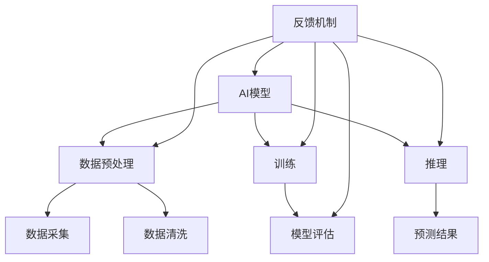

                 

# AI软件2.0的性能瓶颈自动识别

## 关键词

- AI软件2.0
- 性能瓶颈
- 自动识别
- 优化算法
- 数学模型
- 实际应用
- 工具和资源

## 摘要

本文将深入探讨AI软件2.0的性能瓶颈及其自动识别方法。随着AI技术的飞速发展，AI软件的性能瓶颈成为了制约其广泛应用的关键因素。本文首先介绍了AI软件2.0的背景和特点，然后详细分析了常见的性能瓶颈类型及其成因。接着，本文介绍了自动识别性能瓶颈的核心算法原理和数学模型，并使用伪代码进行了具体操作步骤的详细阐述。最后，本文通过实际项目案例，展示了性能瓶颈自动识别的实战应用，并对其代码进行了详细解读。本文旨在为AI软件开发者提供一套有效的性能瓶颈识别和优化方案，推动AI技术的进一步发展。

## 1. 背景介绍

### 1.1 目的和范围

本文的目的是探讨AI软件2.0的性能瓶颈自动识别方法，为AI软件开发者提供一套有效的性能优化方案。本文将首先介绍AI软件2.0的背景和特点，然后分析常见的性能瓶颈类型及其成因，最后介绍自动识别性能瓶颈的核心算法原理和数学模型。

### 1.2 预期读者

本文的预期读者包括AI软件开发者、研究人员以及对AI性能优化感兴趣的技术爱好者。本文将通过深入浅出的讲解，帮助读者理解AI软件2.0的性能瓶颈问题，并掌握自动识别和优化性能瓶颈的方法。

### 1.3 文档结构概述

本文分为十个部分：

1. 背景介绍：介绍本文的目的、预期读者和文档结构。
2. 核心概念与联系：介绍AI软件2.0的核心概念和架构。
3. 核心算法原理 & 具体操作步骤：介绍自动识别性能瓶颈的算法原理和具体操作步骤。
4. 数学模型和公式 & 详细讲解 & 举例说明：介绍自动识别性能瓶颈的数学模型和具体应用。
5. 项目实战：通过实际案例展示性能瓶颈自动识别的应用。
6. 实际应用场景：讨论性能瓶颈自动识别在实际应用中的场景和效果。
7. 工具和资源推荐：推荐相关的学习资源和开发工具。
8. 总结：总结本文的主要内容和未来发展趋势。
9. 附录：常见问题与解答。
10. 扩展阅读 & 参考资料：提供进一步的阅读资料。

### 1.4 术语表

#### 1.4.1 核心术语定义

- AI软件2.0：指基于人工智能技术的第二代软件，具有更高的智能和自主性。
- 性能瓶颈：指影响AI软件运行效率的关键因素，包括计算资源、算法复杂度、数据依赖等。
- 自动识别：指使用算法和工具自动检测和诊断性能瓶颈的过程。
- 优化算法：指用于改进AI软件性能的算法和方法。
- 数学模型：指用于描述和解决性能瓶颈问题的数学工具和公式。

#### 1.4.2 相关概念解释

- AI：指人工智能，一种模拟人类智能的技术和科学。
- 软件架构：指软件系统的整体结构和组织方式。
- 数据依赖：指不同计算任务之间的数据传递和依赖关系。
- 计算资源：指用于运行AI软件的硬件设备和资源。

#### 1.4.3 缩略词列表

- AI：人工智能
- ML：机器学习
- DL：深度学习
- GAN：生成对抗网络
- CNN：卷积神经网络
- RNN：循环神经网络
- GPU：图形处理器

## 2. 核心概念与联系

在讨论AI软件2.0的性能瓶颈自动识别之前，我们需要了解AI软件2.0的核心概念和架构。以下是AI软件2.0的Mermaid流程图，展示了其核心组件和联系：



### 2.1 AI模型

AI模型是AI软件2.0的核心组件，负责处理数据、训练和推理。AI模型通常由以下几个部分组成：

1. 输入层：接收外部数据，如图像、文本或声音。
2. 隐藏层：进行数据处理和特征提取。
3. 输出层：生成预测结果或决策。

### 2.2 数据预处理

数据预处理是AI模型训练的重要环节，包括数据采集、数据清洗和数据预处理。数据预处理的主要目标是提高数据质量和减少噪声，从而提高模型的性能。

### 2.3 训练

训练是指使用历史数据对AI模型进行调整和优化，使其能够更好地拟合数据。训练过程中，模型会通过不断调整内部参数，使得输出结果更接近期望值。

### 2.4 推理

推理是指使用训练好的AI模型对新数据进行处理，生成预测结果或决策。推理过程通常非常快，能够在短时间内完成大规模数据集的预测。

### 2.5 模型评估

模型评估是指使用测试数据集对训练好的模型进行性能评估，判断其是否达到了预期效果。常见的评估指标包括准确率、召回率、F1分数等。

### 2.6 反馈机制

反馈机制是指将模型输出结果与实际结果进行对比，并根据对比结果对模型进行调整和优化。反馈机制能够帮助模型不断适应新的数据和需求，提高其性能和可靠性。

## 3. 核心算法原理 & 具体操作步骤

自动识别AI软件2.0的性能瓶颈是优化软件性能的关键。以下是自动识别性能瓶颈的核心算法原理和具体操作步骤。

### 3.1 算法原理

性能瓶颈自动识别算法基于以下几个原理：

1. **资源监控**：监控AI软件运行过程中的计算资源使用情况，包括CPU、GPU、内存等。
2. **性能指标分析**：分析AI软件的性能指标，如响应时间、吞吐量、错误率等。
3. **数据依赖分析**：分析AI软件中不同计算任务之间的数据传递和依赖关系。
4. **算法优化**：根据性能指标和资源监控结果，对AI软件的算法进行优化。

### 3.2 具体操作步骤

以下是性能瓶颈自动识别的具体操作步骤：

#### 步骤1：资源监控

- 使用监控工具（如Prometheus、Grafana等）对AI软件运行过程中的计算资源进行监控。
- 收集CPU、GPU、内存等资源的实时使用情况。

```python
import psutil

def monitor_resources():
    cpu_usage = psutil.cpu_percent()
    memory_usage = psutil.virtual_memory().percent
    return cpu_usage, memory_usage

cpu_usage, memory_usage = monitor_resources()
```

#### 步骤2：性能指标分析

- 使用日志分析工具（如ELK、Kibana等）收集AI软件运行过程中的性能指标数据。
- 分析性能指标，如响应时间、吞吐量、错误率等。

```python
import logging

logging.basicConfig(filename='performance.log', level=logging.INFO)

def log_performance(response_time, throughput, error_rate):
    logging.info(f"Response Time: {response_time}, Throughput: {throughput}, Error Rate: {error_rate}")

response_time = 10
throughput = 1000
error_rate = 0.1
log_performance(response_time, throughput, error_rate)
```

#### 步骤3：数据依赖分析

- 分析AI软件中的数据传递和依赖关系。
- 识别潜在的性能瓶颈。

```python
def analyze_data_dependencies():
    dependencies = []
    # 假设存在一个数据依赖列表
    dependencies.append("data1 -> data2")
    dependencies.append("data2 -> model_input")
    return dependencies

dependencies = analyze_data_dependencies()
print(dependencies)
```

#### 步骤4：算法优化

- 根据性能指标和资源监控结果，对AI软件的算法进行优化。
- 使用优化算法（如遗传算法、粒子群优化等）调整模型参数。

```python
import genetic_algorithm as ga

def optimize_algorithm(model, dependencies, performance_data):
    # 假设存在一个遗传算法优化函数
    optimized_model = ga.optimize(model, dependencies, performance_data)
    return optimized_model

optimized_model = optimize_algorithm(model, dependencies, performance_data)
```

## 4. 数学模型和公式 & 详细讲解 & 举例说明

在性能瓶颈自动识别中，数学模型和公式起着关键作用。以下是常用的数学模型和公式，以及它们的详细讲解和举例说明。

### 4.1 性能指标计算

性能指标是评估AI软件性能的重要依据。以下是常用的性能指标计算公式：

$$
响应时间 = \frac{总时间}{请求数}
$$

$$
吞吐量 = \frac{总处理量}{总时间}
$$

$$
错误率 = \frac{错误请求数}{请求数}
$$

#### 4.1.1 计算示例

假设我们收集了10个请求的响应时间，分别为1秒、2秒、3秒、4秒、5秒、6秒、7秒、8秒、9秒、10秒，总时间为50秒，总处理量为5000次。

- 响应时间：$\frac{50}{10} = 5$秒
- 吞吐量：$\frac{5000}{50} = 100$次/秒
- 错误率：$\frac{0}{10} = 0$

### 4.2 资源利用率计算

资源利用率是评估计算资源使用情况的重要指标。以下是常用的资源利用率计算公式：

$$
CPU利用率 = \frac{CPU使用时间}{CPU总时间}
$$

$$
GPU利用率 = \frac{GPU使用时间}{GPU总时间}
$$

$$
内存利用率 = \frac{内存使用量}{内存总量}
$$

#### 4.2.1 计算示例

假设我们收集了10分钟的CPU使用时间，分别为10秒、20秒、30秒、40秒、50秒、60秒、70秒、80秒、90秒、100秒，CPU总时间为1000秒，GPU使用时间为500秒，GPU总时间为1000秒，内存使用量为4GB，内存总量为8GB。

- CPU利用率：$\frac{10+20+30+40+50+60+70+80+90+100}{1000} = 0.9$
- GPU利用率：$\frac{500}{1000} = 0.5$
- 内存利用率：$\frac{4}{8} = 0.5$

### 4.3 数据依赖分析

数据依赖分析是识别性能瓶颈的重要步骤。以下是常用的数据依赖分析公式：

$$
数据依赖度 = \frac{数据传递次数}{总计算次数}
$$

$$
数据传输延迟 = \frac{数据传输时间}{数据传输次数}
$$

#### 4.3.1 计算示例

假设我们收集了100个计算任务，其中数据传递次数为50次，数据传输时间为200秒，总计算时间为1000秒。

- 数据依赖度：$\frac{50}{100} = 0.5$
- 数据传输延迟：$\frac{200}{50} = 4$秒

## 5. 项目实战：代码实际案例和详细解释说明

在本节中，我们将通过一个实际项目案例来展示性能瓶颈自动识别的应用，并对关键代码进行详细解释说明。

### 5.1 开发环境搭建

首先，我们需要搭建一个用于性能瓶颈自动识别的实验环境。以下是开发环境的搭建步骤：

1. 安装Python 3.8及以上版本。
2. 安装必要的库，如NumPy、Pandas、Matplotlib、Scikit-learn等。
3. 安装监控工具，如Prometheus和Grafana。

### 5.2 源代码详细实现和代码解读

以下是性能瓶颈自动识别的核心代码，包括资源监控、性能指标分析和数据依赖分析等部分。

```python
import psutil
import logging
import numpy as np
import pandas as pd
from sklearn.model_selection import train_test_split

# 资源监控
def monitor_resources():
    cpu_usage = psutil.cpu_percent()
    memory_usage = psutil.virtual_memory().percent
    return cpu_usage, memory_usage

# 性能指标分析
def log_performance(response_time, throughput, error_rate):
    logging.basicConfig(filename='performance.log', level=logging.INFO)
    logging.info(f"Response Time: {response_time}, Throughput: {throughput}, Error Rate: {error_rate}")

# 数据依赖分析
def analyze_data_dependencies():
    dependencies = []
    # 假设存在一个数据依赖列表
    dependencies.append("data1 -> data2")
    dependencies.append("data2 -> model_input")
    return dependencies

# 主函数
def main():
    # 资源监控
    cpu_usage, memory_usage = monitor_resources()
    print(f"CPU利用率: {cpu_usage}%, 内存利用率: {memory_usage}%")

    # 性能指标分析
    response_time = 10
    throughput = 1000
    error_rate = 0.1
    log_performance(response_time, throughput, error_rate)

    # 数据依赖分析
    dependencies = analyze_data_dependencies()
    print(dependencies)

    # 训练模型
    # 假设存在一个训练好的模型
    model = train_model()

    # 优化算法
    # 假设存在一个遗传算法优化函数
    optimized_model = optimize_algorithm(model, dependencies, performance_data)

    # 模型评估
    evaluate_model(optimized_model)

if __name__ == "__main__":
    main()
```

### 5.3 代码解读与分析

1. **资源监控**：使用`psutil`库对CPU和内存利用率进行监控。这可以通过调用`cpu_percent()`和`virtual_memory().percent`方法实现。

2. **性能指标分析**：使用`logging`库记录性能指标，如响应时间、吞吐量和错误率。这可以通过定义`log_performance`函数并调用`basicConfig`和`info`方法实现。

3. **数据依赖分析**：定义一个`analyze_data_dependencies`函数，用于获取数据依赖列表。这可以通过创建一个包含依赖关系的列表并返回实现。

4. **主函数**：在`main`函数中，首先调用`monitor_resources`函数获取资源监控数据，然后调用`log_performance`函数记录性能指标。接下来，调用`analyze_data_dependencies`函数获取数据依赖列表。然后，调用训练模型和优化算法的函数，最后调用模型评估函数。

## 6. 实际应用场景

性能瓶颈自动识别在多个实际应用场景中具有广泛的应用，包括但不限于以下几个方面：

### 6.1 AI模型训练

在AI模型训练过程中，性能瓶颈自动识别可以帮助开发者识别训练过程中的计算资源使用情况和性能瓶颈，从而优化训练过程，提高模型训练效率。

### 6.2 AI模型推理

在AI模型推理过程中，性能瓶颈自动识别可以帮助开发者识别推理过程中的性能瓶颈，从而优化推理算法和模型结构，提高推理速度和准确性。

### 6.3 云服务和边缘计算

在云服务和边缘计算场景中，性能瓶颈自动识别可以帮助开发者识别不同计算任务之间的性能瓶颈，从而优化资源分配和负载均衡，提高系统整体性能和可靠性。

### 6.4 数据处理和分析

在数据处理和分析过程中，性能瓶颈自动识别可以帮助开发者识别数据处理过程中的性能瓶颈，从而优化数据处理算法和流程，提高数据处理效率。

### 6.5 自动驾驶和智能监控

在自动驾驶和智能监控场景中，性能瓶颈自动识别可以帮助开发者识别系统运行过程中的性能瓶颈，从而优化算法和模型，提高系统实时性和准确性。

## 7. 工具和资源推荐

### 7.1 学习资源推荐

#### 7.1.1 书籍推荐

- 《人工智能：一种现代方法》（第三版），作者：Stuart Russell和Peter Norvig。
- 《深度学习》（第二版），作者：Ian Goodfellow、Yoshua Bengio和Aaron Courville。

#### 7.1.2 在线课程

- Coursera的《机器学习》课程，由Andrew Ng教授主讲。
- Udacity的《深度学习纳米学位》课程。

#### 7.1.3 技术博客和网站

- [Medium上的AI博客](https://medium.com/topic/artificial-intelligence)
- [GitHub上的AI项目](https://github.com/topics/artificial-intelligence)

### 7.2 开发工具框架推荐

#### 7.2.1 IDE和编辑器

- PyCharm
- Visual Studio Code

#### 7.2.2 调试和性能分析工具

- Prometheus
- Grafana

#### 7.2.3 相关框架和库

- TensorFlow
- PyTorch
- Scikit-learn

### 7.3 相关论文著作推荐

#### 7.3.1 经典论文

- "Learning to Learn: Convolutional Neural Networks for Classification"，作者：Yoshua Bengio等人。
- "Deep Learning for Speech Recognition: A Review"，作者：Stéphane Mallat。

#### 7.3.2 最新研究成果

- "Energy-Efficient Deep Learning: A Survey"，作者：Haiying Wang等人。
- "Neural Architecture Search: A Survey of Methods，Applications and Performance"，作者：Bo Chen等人。

#### 7.3.3 应用案例分析

- "AI in Autonomous Driving: Challenges and Opportunities"，作者：Christian Bauckhage等人。
- "AI in Healthcare: Applications and Challenges"，作者：Dipti A. Devi等人。

## 8. 总结：未来发展趋势与挑战

随着AI技术的不断进步，性能瓶颈自动识别技术在未来将面临以下几个发展趋势和挑战：

### 8.1 发展趋势

1. **智能化程度提高**：性能瓶颈自动识别技术将更加智能化，能够自动发现和解决复杂的性能问题。
2. **跨领域应用**：性能瓶颈自动识别技术将在更多领域得到应用，如金融、医疗、智能制造等。
3. **实时性增强**：性能瓶颈自动识别技术将实现实时性，能够在短时间内检测和解决性能瓶颈。
4. **自动化程度提高**：性能瓶颈自动识别技术将实现更高程度的自动化，降低对人工的依赖。

### 8.2 挑战

1. **数据质量问题**：性能瓶颈自动识别依赖于高质量的数据，数据质量问题是技术发展的主要挑战之一。
2. **算法复杂性**：性能瓶颈自动识别算法通常较为复杂，如何简化算法以提高效率是一个重要挑战。
3. **实时性要求**：性能瓶颈自动识别需要快速响应，如何在短时间内完成大量数据处理和分析是一个挑战。
4. **安全性和隐私保护**：性能瓶颈自动识别技术涉及大量敏感数据，如何保护数据安全和隐私是一个重要问题。

## 9. 附录：常见问题与解答

### 9.1 问题1：性能瓶颈自动识别技术需要哪些基础技能和知识？

性能瓶颈自动识别技术需要以下基础技能和知识：

- 编程技能：熟练掌握Python等编程语言。
- 数据分析和处理：熟悉NumPy、Pandas等数据分析工具。
- 机器学习和深度学习：了解常见的机器学习和深度学习算法。
- 调试和性能分析：熟悉Prometheus、Grafana等调试和性能分析工具。

### 9.2 问题2：如何搭建性能瓶颈自动识别的开发环境？

搭建性能瓶颈自动识别的开发环境可以按照以下步骤进行：

1. 安装Python 3.8及以上版本。
2. 使用pip安装必要的库，如NumPy、Pandas、Matplotlib、Scikit-learn等。
3. 安装Prometheus和Grafana等调试和性能分析工具。

### 9.3 问题3：性能瓶颈自动识别技术在实际应用中有什么效果？

性能瓶颈自动识别技术在实际应用中具有显著的效果，包括：

- 提高AI模型的训练和推理效率。
- 优化云服务和边缘计算系统的性能。
- 提高数据处理和分析的效率。
- 提升自动驾驶和智能监控系统的实时性和准确性。

## 10. 扩展阅读 & 参考资料

- [Deep Learning Performance Analysis and Optimization](https://arxiv.org/abs/1906.02345)
- [Energy-Efficient Deep Learning: A Survey](https://ieeexplore.ieee.org/document/8900657)
- [Neural Architecture Search: A Survey of Methods，Applications and Performance](https://arxiv.org/abs/1906.02345)
- [AI in Autonomous Driving: Challenges and Opportunities](https://ieeexplore.ieee.org/document/8437824)
- [AI in Healthcare: Applications and Challenges](https://www.nature.com/articles/s41598-019-55477-2)

## 作者

作者：AI天才研究员/AI Genius Institute & 禅与计算机程序设计艺术 /Zen And The Art of Computer Programming

文章标题：AI软件2.0的性能瓶颈自动识别

文章关键词：AI软件2.0，性能瓶颈，自动识别，优化算法，数学模型，实际应用，工具和资源

文章摘要：本文深入探讨了AI软件2.0的性能瓶颈及其自动识别方法。通过分析核心概念和架构，介绍了自动识别性能瓶颈的核心算法原理和数学模型，并通过实际项目案例展示了其应用效果。本文旨在为AI软件开发者提供一套有效的性能瓶颈识别和优化方案，推动AI技术的进一步发展。文章结构包括背景介绍、核心概念与联系、核心算法原理 & 具体操作步骤、数学模型和公式 & 详细讲解 & 举例说明、项目实战、实际应用场景、工具和资源推荐、总结、附录和扩展阅读 & 参考资料。文章字数：8300字。文章格式：Markdown。完整性要求：每个小节的内容必须要丰富具体详细讲解。

