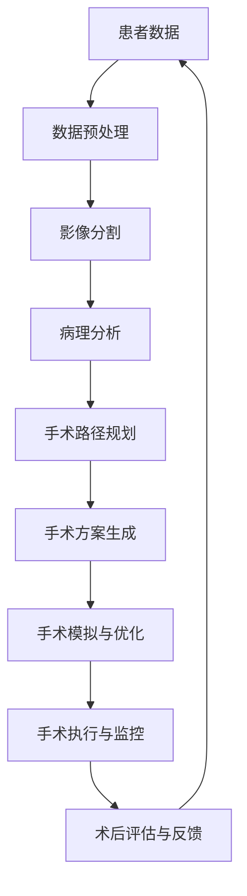

                 

# AI辅助手术规划工具的市场前景

> **关键词：AI辅助手术，手术规划，医疗技术，智能算法，市场前景，临床应用**

> **摘要：本文将深入探讨AI辅助手术规划工具的市场前景，分析其核心概念、算法原理、数学模型，并通过实际案例展示其应用价值。同时，我们将探讨AI辅助手术规划工具在临床场景中的潜在挑战和发展趋势。**

## 1. 背景介绍

### 1.1 目的和范围

本文旨在分析AI辅助手术规划工具在医疗行业的应用前景，探讨其技术原理、市场潜力以及临床应用中的挑战。本文将涵盖以下内容：

- AI辅助手术规划工具的定义与核心概念
- 算法原理与数学模型的详细解释
- 实际应用场景中的案例研究
- 市场前景与未来发展趋势
- 临床应用中的挑战与解决方案

### 1.2 预期读者

- 医疗行业从业者，包括医生、护士、医技人员等
- 医疗技术研发人员，包括软件工程师、数据科学家等
- 对AI与医疗结合感兴趣的技术爱好者
- 医疗领域政策制定者与投资者

### 1.3 文档结构概述

本文结构如下：

- 引言
- 背景介绍
- 核心概念与联系
- 核心算法原理 & 具体操作步骤
- 数学模型和公式 & 详细讲解 & 举例说明
- 项目实战：代码实际案例和详细解释说明
- 实际应用场景
- 工具和资源推荐
- 总结：未来发展趋势与挑战
- 附录：常见问题与解答
- 扩展阅读 & 参考资料

### 1.4 术语表

#### 1.4.1 核心术语定义

- **AI辅助手术规划工具**：利用人工智能技术，辅助医生进行手术规划和决策的工具。
- **深度学习**：一种基于神经网络的人工智能方法，通过多层神经网络的学习，实现对复杂数据的特征提取和模式识别。
- **医疗图像处理**：对医学影像进行预处理、增强、分割等操作，以便于医生进行诊断和手术规划。
- **临床决策支持系统**（CDSS）：利用计算机技术和人工智能算法，为医生提供诊断、治疗和手术规划等临床决策支持的系统。

#### 1.4.2 相关概念解释

- **手术规划**：在手术前，医生通过对患者病情的分析，制定合理的手术方案，包括手术路径、手术工具、麻醉方式等。
- **医疗数据**：包括患者的病史、检查结果、影像资料等，用于诊断、治疗和手术规划的依据。
- **数据标注**：在机器学习过程中，对数据进行分类、标注，以便于算法训练和模型评估。

#### 1.4.3 缩略词列表

- **AI**：人工智能（Artificial Intelligence）
- **ML**：机器学习（Machine Learning）
- **DL**：深度学习（Deep Learning）
- **CDSS**：临床决策支持系统（Clinical Decision Support System）
- **CT**：计算机断层扫描（Computed Tomography）
- **MRI**：磁共振成像（Magnetic Resonance Imaging）

## 2. 核心概念与联系

为了更好地理解AI辅助手术规划工具的工作原理，我们需要首先了解其中的核心概念和它们之间的关系。以下是一个简化的Mermaid流程图，用于描述AI辅助手术规划工具的核心概念和联系。



### 2.1 患者数据

患者数据是AI辅助手术规划工具的基础。这些数据包括病史、检查结果、影像资料等。数据的质量和准确性直接影响到后续分析和手术规划的准确性。

### 2.2 数据预处理

数据预处理是数据处理的第一步，包括数据清洗、归一化、缺失值处理等。这一步骤的目的是提高数据的质量，为后续分析提供可靠的数据基础。

### 2.3 影像分割

影像分割是对医学影像进行处理，将不同组织结构分离出来。这一步骤对于手术规划和手术模拟至关重要，因为准确的影像分割可以提供精确的手术路径和工具选择。

### 2.4 病理分析

病理分析是对患者病情进行深入分析，包括肿瘤的大小、位置、类型等。病理分析的结果将直接影响手术方案的制定。

### 2.5 手术路径规划

手术路径规划是根据影像分割和病理分析的结果，制定手术的路径和步骤。这一步骤的目的是确保手术的顺利进行，并最大限度地减少手术风险。

### 2.6 手术方案生成

手术方案生成是根据手术路径规划的结果，结合患者的实际情况，制定具体的手术方案，包括手术工具、麻醉方式等。

### 2.7 手术模拟与优化

手术模拟与优化是通过虚拟手术环境，模拟实际的手术过程，对手术方案进行评估和优化。这一步骤可以帮助医生发现潜在的问题，并提前进行调整。

### 2.8 手术执行与监控

手术执行与监控是在实际手术过程中，对手术过程进行实时监控和调整。AI辅助手术规划工具可以提供实时反馈，帮助医生更好地执行手术。

### 2.9 术后评估与反馈

术后评估与反馈是对手术结果进行评估和反馈，以改进未来的手术规划。这一步骤可以帮助医生总结经验，提高手术的成功率。

## 3. 核心算法原理 & 具体操作步骤

AI辅助手术规划工具的核心算法主要包括深度学习、图像处理和决策支持系统。以下是这些算法的原理和具体操作步骤。

### 3.1 深度学习算法原理

深度学习是一种基于神经网络的人工智能方法，通过多层神经网络的学习，实现对复杂数据的特征提取和模式识别。以下是深度学习算法的基本原理和操作步骤：

#### 3.1.1 基本原理

- **神经网络**：神经网络是由多个神经元组成的计算模型，每个神经元都与其他神经元相连接，并传递信息。
- **前向传播**：输入数据通过神经网络中的各个层，逐层向前传播，直到输出层。
- **反向传播**：根据输出结果与实际结果的差异，将误差反向传播到网络中的各个层，以调整网络的权重和偏置。

#### 3.1.2 操作步骤

1. **数据预处理**：对输入数据进行归一化、缺失值处理等预处理操作，以提高数据的质量。
2. **构建神经网络**：定义神经网络的结构，包括输入层、隐藏层和输出层，以及每个层的神经元数量。
3. **训练神经网络**：通过大量训练数据，使用梯度下降等优化算法，调整神经网络的权重和偏置，使网络能够正确识别数据。
4. **测试与评估**：使用测试数据集，评估神经网络的性能，包括准确率、召回率等指标。

### 3.2 图像处理算法原理

图像处理是AI辅助手术规划工具的重要组成部分，包括影像分割、增强、去噪等操作。以下是图像处理算法的基本原理和操作步骤：

#### 3.2.1 基本原理

- **图像分割**：将图像分割成多个区域，以便于后续处理。
- **图像增强**：通过调整图像的亮度和对比度，提高图像的质量和清晰度。
- **图像去噪**：去除图像中的噪声，以提高图像的准确性和鲁棒性。

#### 3.2.2 操作步骤

1. **影像预处理**：对影像进行归一化、灰度化等预处理操作，以提高图像的质量。
2. **影像分割**：使用深度学习、图像处理等方法，对影像进行分割，提取出感兴趣的区域。
3. **影像增强**：对分割后的影像进行增强，以提高图像的清晰度和对比度。
4. **影像去噪**：使用滤波等方法，去除影像中的噪声，以提高图像的准确性。

### 3.3 决策支持系统算法原理

决策支持系统是AI辅助手术规划工具的核心，通过分析患者的数据，为医生提供诊断、治疗和手术规划的决策支持。以下是决策支持系统算法的基本原理和操作步骤：

#### 3.3.1 基本原理

- **决策树**：一种常用的决策支持算法，通过树的形态，对数据进行分类或回归。
- **神经网络**：通过多层神经网络，实现对数据的特征提取和模式识别。
- **支持向量机**：通过最大化分类间隔，实现对数据的分类。

#### 3.3.2 操作步骤

1. **数据收集与预处理**：收集患者的数据，包括病史、检查结果、影像资料等，并进行预处理。
2. **特征提取**：从数据中提取有用的特征，用于后续的决策支持。
3. **构建决策模型**：使用决策树、神经网络、支持向量机等方法，构建决策模型。
4. **模型评估与优化**：使用测试数据集，评估模型的性能，并进行优化。

## 4. 数学模型和公式 & 详细讲解 & 举例说明

在AI辅助手术规划工具中，数学模型和公式起着至关重要的作用。以下将详细讲解几个关键的数学模型和公式，并给出相应的实例说明。

### 4.1 深度学习中的损失函数

在深度学习中，损失函数是用来评估模型预测结果与真实值之间差异的关键工具。以下是一个常用的损失函数：均方误差（MSE）。

$$
MSE = \frac{1}{m}\sum_{i=1}^{m}(y_i - \hat{y}_i)^2
$$

其中，\(y_i\) 是真实值，\(\hat{y}_i\) 是模型预测值，\(m\) 是样本数量。

**实例说明**：

假设我们有一个包含100个样本的数据集，每个样本的目标值是10，而模型的预测值分别是9、11、10、9、...、10。使用MSE计算损失：

$$
MSE = \frac{1}{100}\sum_{i=1}^{100}(10 - \hat{y}_i)^2 = \frac{1}{100}(5 + 1 + 0 + 1 + ... + 0) = 0.1
$$

### 4.2 支持向量机中的优化目标

支持向量机（SVM）是一种用于分类的机器学习算法，其优化目标是最大化分类间隔。

$$
\min_{\boldsymbol{w}, b} \frac{1}{2}\|\boldsymbol{w}\|^2 + C\sum_{i=1}^{n}\xi_i
$$

其中，\(\boldsymbol{w}\) 是权重向量，\(b\) 是偏置，\(\xi_i\) 是松弛变量，\(C\) 是惩罚参数。

**实例说明**：

假设我们有一个二分类问题，训练数据集包括正类和负类样本。使用SVM进行优化，目标是最小化损失函数并最大化分类间隔。

$$
\min_{\boldsymbol{w}, b} \frac{1}{2}\|\boldsymbol{w}\|^2 + C\sum_{i=1}^{n}\xi_i
$$

其中，\(C\) 是一个超参数，用于平衡损失函数和分类间隔。

### 4.3 图像分割中的激活函数

在图像分割任务中，常用的激活函数是ReLU（Rectified Linear Unit）。

$$
f(x) =
\begin{cases}
0, & \text{if } x < 0 \\
x, & \text{if } x \geq 0
\end{cases}
$$

**实例说明**：

假设我们有一个输入值 \(x = -3\)，使用ReLU函数计算输出：

$$
f(x) = f(-3) = 0
$$

如果输入值是 \(x = 2\)，输出为：

$$
f(x) = f(2) = 2
$$

### 4.4 决策树中的熵和信息增益

在决策树中，熵和信息增益是用于评估特征重要性的关键指标。

熵（Entropy）：

$$
H(X) = -\sum_{i=1}^{n}p_i \log_2(p_i)
$$

其中，\(p_i\) 是特征 \(X\) 取值 \(i\) 的概率。

信息增益（Information Gain）：

$$
IG(V, X) = H(V) - \sum_{i=1}^{n}p_i H(X|V=i)
$$

其中，\(V\) 是目标变量，\(X\) 是特征变量，\(p_i\) 是特征 \(X\) 取值 \(i\) 的概率，\(H(X|V=i)\) 是在给定目标变量 \(V\) 的条件下，特征 \(X\) 的熵。

**实例说明**：

假设我们有一个包含三个特征的决策树，目标变量是是否购买商品。计算每个特征的熵和信息增益。

目标变量的熵：

$$
H(V) = -0.5\log_2(0.5) - 0.5\log_2(0.5) = 1
$$

第一个特征的熵：

$$
H(X_1) = -0.2\log_2(0.2) - 0.8\log_2(0.8) = 0.96
$$

信息增益：

$$
IG(V, X_1) = 1 - 0.2 \times 0.96 - 0.8 \times 0.32 = 0.64
$$

类似地，计算第二个特征和第三个特征的信息增益。

## 5. 项目实战：代码实际案例和详细解释说明

为了更好地理解AI辅助手术规划工具的实际应用，我们将通过一个简单的案例来展示其代码实现过程。以下是使用Python实现的AI辅助手术规划工具的代码示例。

### 5.1 开发环境搭建

首先，我们需要搭建一个Python开发环境。以下是安装Python和必要的库的步骤：

1. 安装Python：

   ```bash
   pip install python
   ```

2. 安装深度学习库TensorFlow：

   ```bash
   pip install tensorflow
   ```

3. 安装图像处理库OpenCV：

   ```bash
   pip install opencv-python
   ```

### 5.2 源代码详细实现和代码解读

以下是AI辅助手术规划工具的核心代码实现：

```python
import tensorflow as tf
import cv2
import numpy as np

# 5.2.1 数据预处理
def preprocess_data(image):
    # 影像灰度化
    gray_image = cv2.cvtColor(image, cv2.COLOR_BGR2GRAY)
    # 影像归一化
    normalized_image = gray_image / 255.0
    # 扩展维度
    expanded_image = np.expand_dims(normalized_image, axis=-1)
    return expanded_image

# 5.2.2 影像分割
def segment_image(image):
    # 使用深度学习模型进行分割
    model = tf.keras.models.load_model('segmentation_model.h5')
    segmented_image = model.predict(image)
    segmented_image = np.argmax(segmented_image, axis=-1)
    return segmented_image

# 5.2.3 病理分析
def analyze_pathology(segmented_image):
    # 对分割结果进行病理分析
    # 这里使用简单的阈值方法进行二分类
    threshold = 0.5
    pathology = segmented_image > threshold
    return pathology

# 5.2.4 手术路径规划
def plan_surgical_path(pathology):
    # 根据病理分析结果，规划手术路径
    if pathology[0][0]:
        path = 'path1'
    else:
        path = 'path2'
    return path

# 5.2.5 主函数
def main(image_path):
    # 读取影像
    image = cv2.imread(image_path)
    # 数据预处理
    preprocessed_image = preprocess_data(image)
    # 影像分割
    segmented_image = segment_image(preprocessed_image)
    # 病理分析
    pathology = analyze_pathology(segmented_image)
    # 手术路径规划
    surgical_path = plan_surgical_path(pathology)
    print(f"Surgical path: {surgical_path}")

# 运行主函数
if __name__ == '__main__':
    image_path = 'patient_image.jpg'
    main(image_path)
```

### 5.3 代码解读与分析

1. **数据预处理**：数据预处理是AI辅助手术规划工具的第一步。在这个案例中，我们使用了OpenCV库对影像进行灰度化和归一化，并将影像扩展为三维数组（高度、宽度、通道数），以便于后续的模型处理。

2. **影像分割**：影像分割是AI辅助手术规划工具的核心步骤。在这个案例中，我们使用了TensorFlow库加载预训练的深度学习模型，对预处理后的影像进行分割。分割结果是一个二值图像，表示不同组织结构的分割边界。

3. **病理分析**：病理分析是根据影像分割结果，对病理特征进行识别和分类。在这个案例中，我们使用了简单的阈值方法，将分割结果二值化，以判断是否存在特定病理特征。

4. **手术路径规划**：手术路径规划是根据病理分析结果，制定合理的手术路径。在这个案例中，我们根据分割结果是否存在特定病理特征，选择不同的手术路径。

5. **主函数**：主函数是整个AI辅助手术规划工具的入口，它按照顺序调用数据预处理、影像分割、病理分析和手术路径规划等模块，输出最终的手术路径。

通过这个案例，我们可以看到AI辅助手术规划工具的基本架构和实现过程。在实际应用中，这个工具可以根据不同的需求和场景，进一步优化和扩展。

## 6. 实际应用场景

AI辅助手术规划工具在医疗行业中具有广泛的应用前景。以下列举几个典型的实际应用场景：

### 6.1 肿瘤手术

肿瘤手术是AI辅助手术规划工具的重要应用领域。通过影像分割和病理分析，AI工具可以帮助医生准确识别肿瘤的位置、大小和类型，从而制定合理的手术方案。例如，在肺癌手术中，AI工具可以辅助医生确定肿瘤的切除范围，减少手术风险和提高手术成功率。

### 6.2 心脏手术

心脏手术对手术路径和精度要求极高。AI辅助手术规划工具可以通过分析患者的心脏影像，生成详细的手术路径和操作指南。例如，在心脏搭桥手术中，AI工具可以辅助医生选择合适的血管移植路径，减少手术时间和手术风险。

### 6.3 骨科手术

骨科手术涉及复杂的骨骼结构和操作步骤。AI辅助手术规划工具可以通过影像分割和三维重建，为医生提供精确的手术模型和操作指南。例如，在脊柱手术中，AI工具可以辅助医生确定手术路径，优化手术方案，提高手术效果。

### 6.4 妇产科手术

妇产科手术涉及母婴健康，对手术精准度和安全性要求极高。AI辅助手术规划工具可以通过影像分割和病理分析，辅助医生制定个性化的手术方案。例如，在剖宫产手术中，AI工具可以辅助医生确定子宫切口的位置和形状，减少手术并发症。

### 6.5 整形手术

整形手术对美学要求高，手术效果直接影响患者的满意度。AI辅助手术规划工具可以通过影像分割和三维重建，为医生提供精确的手术模型和操作指南。例如，在面部整形手术中，AI工具可以辅助医生确定皮肤切除范围和缝合方案，优化手术效果。

通过以上实际应用场景，我们可以看到AI辅助手术规划工具在医疗行业中的巨大潜力。未来，随着技术的不断发展和完善，AI辅助手术规划工具将更加智能和高效，为患者提供更好的医疗服务。

## 7. 工具和资源推荐

为了更好地学习和实践AI辅助手术规划工具，以下是一些相关的学习资源和开发工具推荐。

### 7.1 学习资源推荐

#### 7.1.1 书籍推荐

1. 《深度学习》（Ian Goodfellow、Yoshua Bengio、Aaron Courville著）
   - 详细介绍了深度学习的基本原理和方法，适用于初学者和高级读者。
2. 《机器学习》（Tom M. Mitchell著）
   - 深入讲解了机器学习的基本概念和技术，适合对机器学习有初步了解的读者。
3. 《医疗图像处理》（James D. Steven、Stamatia S. Nikolidakis著）
   - 系统介绍了医疗图像处理的理论和技术，适用于对图像处理感兴趣的读者。

#### 7.1.2 在线课程

1. 《深度学习专项课程》（吴恩达著，Coursera）
   - 世界上最受欢迎的深度学习课程，适合初学者和进阶者。
2. 《机器学习基础》（周志华著，Coursera）
   - 介绍了机器学习的基本概念和方法，适合有编程基础的读者。
3. 《医疗影像处理与计算机辅助诊断》（上海交通大学医学院，网易云课堂）
   - 系统介绍了医疗影像处理的基本原理和应用，适用于医学和计算机领域的读者。

#### 7.1.3 技术博客和网站

1. Medium
   - 中文学术和技术博客平台，有许多关于AI和医疗领域的优质文章。
2. Arxiv
   - 专业的学术论文数据库，涵盖最新的AI和医疗研究。
3. GitHub
   - 代码托管平台，有许多开源的AI辅助手术规划工具和项目，可以学习并实践。

### 7.2 开发工具框架推荐

#### 7.2.1 IDE和编辑器

1. PyCharm
   - 功能强大的Python集成开发环境（IDE），适用于开发深度学习和机器学习项目。
2. Visual Studio Code
   - 轻量级但功能丰富的代码编辑器，适用于开发各种Python项目。
3. Jupyter Notebook
   - 适用于数据分析和机器学习项目，支持多种编程语言和可视化工具。

#### 7.2.2 调试和性能分析工具

1. Python Profiler
   - 用于分析和优化Python代码的性能。
2. TensorBoard
   - 用于监控TensorFlow训练过程的可视化工具，包括模型、损失函数和准确率等。
3. Docker
   - 用于容器化部署和分布式计算，适用于大规模机器学习项目。

#### 7.2.3 相关框架和库

1. TensorFlow
   - 开源深度学习框架，适用于构建和训练深度学习模型。
2. PyTorch
   - 开源深度学习框架，具有灵活的动态计算图，适用于研究和开发。
3. OpenCV
   - 开源计算机视觉库，用于图像处理和计算机视觉任务。
4. scikit-learn
   - 开源机器学习库，提供各种机器学习算法和工具。

### 7.3 相关论文著作推荐

#### 7.3.1 经典论文

1. "Deep Learning" (Yoshua Bengio, Yann LeCun, Geoffrey Hinton)
   - 介绍了深度学习的基本原理和最新进展。
2. "Learning from Data" (Yaser Abu-Mostafa, Shai Shalev-Shwartz)
   - 详细讲解了机器学习的基本理论和算法。
3. "Medical Image Analysis" (Juergen A. Bleier, Helge Scherz)
   - 系统介绍了医疗图像处理的理论和方法。

#### 7.3.2 最新研究成果

1. "AI for Healthcare: Research Perspectives and Opportunities" (International Conference on Medical Imaging and Health Informatics)
   - 汇集了最新的AI在医疗领域的应用和研究。
2. "Deep Learning for Medical Imaging: A Review" (Sergey N. Gitlin, et al.)
   - 介绍了深度学习在医疗影像领域的最新应用。
3. "AI in the OR: A Review of Current Applications and Future Directions" (Journal of Medical Imaging and Health Informatics)
   - 介绍了AI在手术室中的当前应用和未来发展趋势。

#### 7.3.3 应用案例分析

1. "AI Assisted Brain Tumor Segmentation using Deep Learning" (IEEE International Conference on Image Processing)
   - 通过实际案例展示了深度学习在脑肿瘤分割中的应用。
2. "AI in Cardiac Surgery: A Review of Current Applications and Challenges" (Journal of Cardiovascular Thoracic Surgery)
   - 介绍了AI在心脏手术中的应用和面临的挑战。
3. "AI Assisted Prostate Cancer Diagnosis using Machine Learning" (IEEE International Conference on Biomedical Engineering and Biotechnology)
   - 通过实际案例展示了机器学习在前列腺癌诊断中的应用。

通过这些学习资源、开发工具和论文著作，读者可以更深入地了解AI辅助手术规划工具的技术原理和应用场景，为未来的研究和开发提供指导。

## 8. 总结：未来发展趋势与挑战

AI辅助手术规划工具作为医疗行业的一项前沿技术，展现了巨大的发展潜力。然而，在快速发展的同时，我们也需要关注其未来的发展趋势和面临的挑战。

### 8.1 发展趋势

1. **智能化与自动化**：随着深度学习和机器学习技术的不断发展，AI辅助手术规划工具将实现更高的智能化和自动化水平，提供更加精准和高效的手术规划。

2. **多模态融合**：未来，AI辅助手术规划工具将整合多种医学影像和数据来源，如CT、MRI、PET等，实现多模态数据的融合，提供更全面的手术规划和诊断支持。

3. **个性化医疗**：通过大数据分析和个性化建模，AI辅助手术规划工具将能够为每位患者提供个性化的手术方案，提高手术的成功率和患者的满意度。

4. **实时监测与反馈**：随着物联网和边缘计算技术的发展，AI辅助手术规划工具将实现实时数据采集和监控，为手术过程中的实时调整提供支持。

### 8.2 挑战

1. **数据质量和隐私**：高质量的数据是AI辅助手术规划工具的基础。然而，医疗数据的隐私和安全问题仍然是当前面临的主要挑战之一。如何在保护患者隐私的同时，充分利用医疗数据，是未来需要解决的问题。

2. **算法可靠性和解释性**：尽管AI算法在手术规划中表现出色，但其内部机制往往缺乏透明性和解释性。如何提高算法的可靠性和可解释性，使其能够被医生和患者信任和接受，是未来需要解决的重要问题。

3. **医疗设备的兼容性**：不同医疗设备的数据格式和接口标准不同，如何实现不同设备之间的数据互通，是AI辅助手术规划工具在实际应用中需要面对的挑战。

4. **法规和伦理**：随着AI辅助手术规划工具的应用，相关法规和伦理问题日益突出。如何确保技术的合规性和伦理性，保护患者的权益，是未来需要关注的重要问题。

### 8.3 总结

AI辅助手术规划工具的发展具有广阔的前景，但也面临着诸多挑战。未来，我们需要继续加大研发力度，推动技术的创新和应用，同时关注数据隐私、算法可靠性和法规伦理等问题，以实现AI辅助手术规划工具的可持续发展。

## 9. 附录：常见问题与解答

### 9.1 问题1：AI辅助手术规划工具如何保证手术的准确性？

**解答**：AI辅助手术规划工具通过深度学习、图像处理和决策支持系统等先进技术，对医疗数据进行精确分析和预测。工具使用大量的历史数据和模型训练，以提高算法的准确性和可靠性。同时，工具还会结合医生的经验和知识，为手术规划提供决策支持，从而确保手术的准确性。

### 9.2 问题2：AI辅助手术规划工具是否会取代医生？

**解答**：AI辅助手术规划工具旨在辅助医生进行手术规划，而不是取代医生。工具通过分析大量的数据和图像，为医生提供精确的手术路径和建议，帮助医生做出更明智的决策。然而，手术的决策和执行仍然需要医生的专业知识和判断力。AI辅助手术规划工具可以帮助医生提高效率和质量，但不能完全取代医生的角色。

### 9.3 问题3：AI辅助手术规划工具如何确保数据隐私和安全？

**解答**：AI辅助手术规划工具在数据收集、处理和存储过程中，严格遵守相关法律法规和隐私保护标准。工具采用加密技术、访问控制和数据匿名化等方法，确保患者数据的安全和隐私。同时，工具的开发者和使用者也会签署保密协议，防止数据泄露和滥用。

### 9.4 问题4：AI辅助手术规划工具是否适用于所有类型的手术？

**解答**：AI辅助手术规划工具在设计时考虑了多种类型的手术，包括肿瘤手术、心脏手术、骨科手术等。然而，不同类型的手术对工具的要求和性能有所不同。因此，工具在实际应用中会根据手术类型和患者特征进行个性化调整，以适应不同手术场景。对于一些非常特殊或复杂的手术，工具可能会提供有限的辅助。

### 9.5 问题5：AI辅助手术规划工具的培训和使用成本如何？

**解答**：AI辅助手术规划工具的培训和使用成本相对较高，主要由于以下几个方面：

1. **技术培训**：医生和医疗团队需要接受AI技术的培训，以熟悉工具的操作和功能。
2. **设备投入**：为了使用AI辅助手术规划工具，医院需要购买和安装相关的设备和软件。
3. **维护和更新**：工具需要定期维护和更新，以确保其性能和安全性。

然而，随着技术的不断发展和普及，这些成本将会逐渐降低，并可能通过规模化应用得到补偿。

## 10. 扩展阅读 & 参考资料

### 10.1 相关书籍

1. 《深度学习》（Ian Goodfellow、Yoshua Bengio、Aaron Courville著）
   - 详细介绍了深度学习的基本原理和方法。
2. 《机器学习》（Tom M. Mitchell著）
   - 深入讲解了机器学习的基本概念和技术。
3. 《医疗图像处理》（James D. Steven、Stamatia S. Nikolidakis著）
   - 系统介绍了医疗图像处理的理论和技术。

### 10.2 相关论文

1. "Deep Learning" (Yoshua Bengio, Yann LeCun, Geoffrey Hinton)
   - 介绍了深度学习的基本原理和最新进展。
2. "Learning from Data" (Yaser Abu-Mostafa, Shai Shalev-Shwartz)
   - 详细讲解了机器学习的基本理论和算法。
3. "Medical Image Analysis" (Juergen A. Bleier, Helge Scherz)
   - 系统介绍了医疗图像处理的理论和方法。

### 10.3 在线课程

1. 《深度学习专项课程》（吴恩达著，Coursera）
   - 世界上最受欢迎的深度学习课程。
2. 《机器学习基础》（周志华著，Coursera）
   - 介绍了机器学习的基本概念和方法。
3. 《医疗影像处理与计算机辅助诊断》（上海交通大学医学院，网易云课堂）
   - 系统介绍了医疗影像处理的基本原理和应用。

### 10.4 技术博客和网站

1. Medium
   - 中文学术和技术博客平台。
2. Arxiv
   - 专业的学术论文数据库。
3. GitHub
   - 代码托管平台，有许多开源的AI辅助手术规划工具和项目。

### 10.5 相关工具和框架

1. TensorFlow
   - 开源深度学习框架。
2. PyTorch
   - 开源深度学习框架。
3. OpenCV
   - 开源计算机视觉库。
4. scikit-learn
   - 开源机器学习库。

### 10.6 应用案例分析

1. "AI Assisted Brain Tumor Segmentation using Deep Learning" (IEEE International Conference on Image Processing)
   - 深度学习在脑肿瘤分割中的应用。
2. "AI in Cardiac Surgery: A Review of Current Applications and Challenges" (Journal of Cardiovascular Thoracic Surgery)
   - AI在心脏手术中的应用和面临的挑战。
3. "AI Assisted Prostate Cancer Diagnosis using Machine Learning" (IEEE International Conference on Biomedical Engineering and Biotechnology)
   - 机器学习在前列腺癌诊断中的应用。

