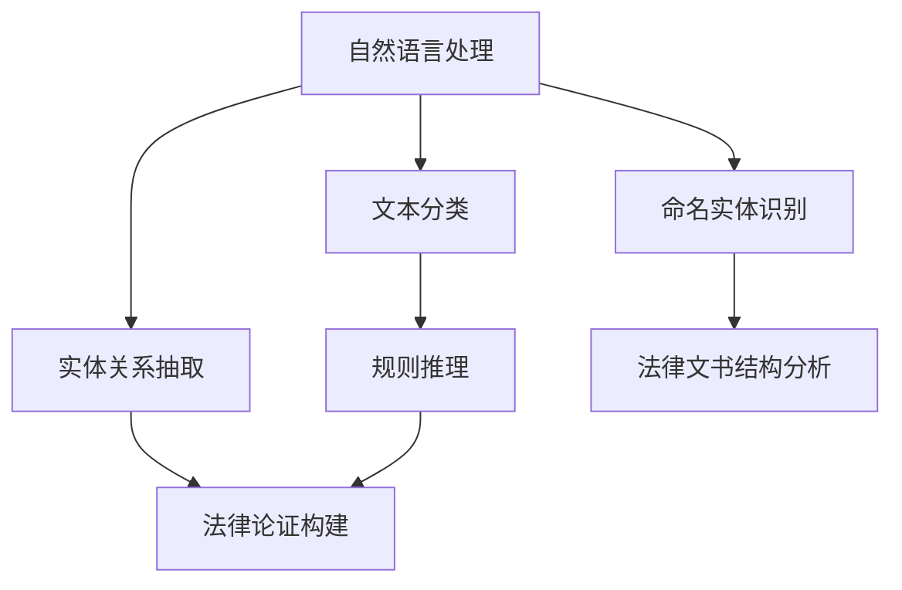

                 

# AI辅助法律文书起草：提示词构建法律论证

> **关键词：** AI、法律文书、提示词、法律论证、自然语言处理、人工智能应用  
>
> **摘要：** 本文探讨了如何利用人工智能技术，特别是自然语言处理和机器学习，辅助法律文书的起草过程，特别是通过提示词构建法律论证的方法。文章将介绍相关技术原理、算法步骤、数学模型，并展示具体项目实战，讨论实际应用场景，推荐相关学习资源和工具，最后对未来的发展趋势和挑战进行展望。

## 1. 背景介绍

### 1.1 目的和范围

本文旨在探讨人工智能（AI）在法律文书起草中的应用，特别是通过自然语言处理（NLP）和机器学习（ML）技术，实现法律论证的自动化构建。文章将详细介绍AI辅助法律文书起草的理论基础、核心算法、具体实施步骤以及实际应用案例。通过本文，读者可以了解如何利用AI技术提高法律文书的起草效率和质量，以及这一技术在法律实践中的潜在应用。

### 1.2 预期读者

本文预期读者包括法律从业人员、法律研究者、人工智能开发者、自然语言处理领域的学者以及对AI在法律领域应用感兴趣的读者。无论您是法律专业人士还是技术背景，本文都将为您提供一个全面了解AI辅助法律文书起草的视角。

### 1.3 文档结构概述

本文分为十个部分：

1. 背景介绍：包括文章目的、范围、预期读者和文档结构概述。
2. 核心概念与联系：介绍核心概念及其相互关系，附有流程图。
3. 核心算法原理 & 具体操作步骤：详细讲解算法原理和操作步骤，使用伪代码展示。
4. 数学模型和公式 & 详细讲解 & 举例说明：解释数学模型和公式的应用，提供实例。
5. 项目实战：展示代码实际案例和详细解释。
6. 实际应用场景：讨论AI辅助法律文书起草的应用场景。
7. 工具和资源推荐：推荐学习资源和开发工具。
8. 总结：未来发展趋势与挑战。
9. 附录：常见问题与解答。
10. 扩展阅读 & 参考资料：提供进一步阅读的资源。

### 1.4 术语表

#### 1.4.1 核心术语定义

- **人工智能（AI）：** 机器模拟人类智能的能力。
- **自然语言处理（NLP）：** 计算机对人类语言进行理解和生成的人工智能技术。
- **机器学习（ML）：** 通过数据训练模型，让计算机自动进行学习和预测的方法。
- **法律文书：** 法律机关或律师依法制作的各种书面文件。
- **法律论证：** 利用法律原则和事实，通过逻辑推理得出法律结论的过程。
- **提示词：** 在AI辅助系统中，用于引导系统生成文本的特定关键词或短语。

#### 1.4.2 相关概念解释

- **文本分类：** 将文本按照其内容分类到不同的类别中。
- **命名实体识别（NER）：** 从文本中识别出具有特定意义的实体，如人名、地名等。
- **实体关系抽取：** 从文本中提取出实体之间的关系。
- **规则推理：** 基于预设的规则进行逻辑推理。

#### 1.4.3 缩略词列表

- **NLP：** 自然语言处理
- **ML：** 机器学习
- **NER：** 命名实体识别
- **RDF：** 资源描述框架
- **OWL：** 词汇本体语言

## 2. 核心概念与联系

在探讨AI辅助法律文书起草之前，我们需要了解几个核心概念及其相互关系。以下是一个Mermaid流程图，展示了这些核心概念和它们之间的关联。



### 2.1 自然语言处理

自然语言处理（NLP）是AI的重要组成部分，旨在让计算机理解和生成人类语言。在法律文书起草中，NLP技术可以帮助我们理解法律文本的内容，包括分类、实体识别和关系抽取。

### 2.2 文本分类

文本分类是将文本按照其内容分类到预定义的类别中。例如，我们可以将法律文书分为诉讼状、答辩状、合同等类别。文本分类是法律文书自动分类的基础。

### 2.3 命名实体识别

命名实体识别（NER）是从文本中识别出具有特定意义的实体，如人名、地名、机构名等。在法律文中，实体识别有助于定位法律关系中的关键参与者。

### 2.4 实体关系抽取

实体关系抽取是从文本中提取出实体之间的关系。例如，在合同文本中，我们可以抽取出合同双方的关系。关系抽取有助于构建法律论证中的事实基础。

### 2.5 法律文书结构分析

法律文书结构分析是理解法律文书的内部结构，包括段落、章节、法律条款等。通过结构分析，我们可以更好地理解法律文书的逻辑关系，从而构建有效的法律论证。

### 2.6 法律论证构建

法律论证构建是基于法律原则和事实，通过逻辑推理得出法律结论的过程。AI可以通过文本分类、实体识别、关系抽取和规则推理等技术，辅助构建法律论证。

### 2.7 规则推理

规则推理是基于预设的规则进行逻辑推理的方法。在法律论证中，规则推理可以帮助我们根据法律条文和案例，得出结论。AI可以通过学习大量案例和法律条文，自动生成规则。

## 3. 核心算法原理 & 具体操作步骤

为了实现AI辅助法律文书起草，我们需要应用多种核心算法。以下将详细介绍这些算法的原理，并使用伪代码展示具体操作步骤。

### 3.1 文本分类算法

文本分类算法用于将法律文书分类到预定义的类别中。常用的算法包括朴素贝叶斯分类器、支持向量机（SVM）和深度神经网络（DNN）。

#### 3.1.1 朴素贝叶斯分类器

朴素贝叶斯分类器基于贝叶斯定理和特征条件独立假设。其伪代码如下：

```python
def naive_bayes_classifier(train_data, test_data):
    # 计算先验概率
    prior_probabilities = calculate_prior_probabilities(train_data)
    
    # 计算条件概率
    conditional_probabilities = calculate_conditional_probabilities(train_data)
    
    # 对测试数据进行分类
    predictions = []
    for document in test_data:
        probabilities = []
        for class_label in prior_probabilities:
            probability = prior_probabilities[class_label]
            for word in document:
                probability *= conditional_probabilities[class_label][word]
            probabilities.append(probability)
        predicted_class = max(probabilities)
        predictions.append(predicted_class)
    return predictions
```

#### 3.1.2 支持向量机（SVM）

支持向量机是一种监督学习算法，用于分类和回归。其伪代码如下：

```python
def svm_classifier(train_data, test_data):
    # 训练模型
    model = train_svm_model(train_data)
    
    # 对测试数据进行分类
    predictions = []
    for document in test_data:
        predicted_class = model.predict(document)
        predictions.append(predicted_class)
    return predictions
```

#### 3.1.3 深度神经网络（DNN）

深度神经网络是一种基于多层感知器（MLP）的神经网络，可以用于复杂的分类任务。其伪代码如下：

```python
def dnn_classifier(train_data, test_data):
    # 构建模型
    model = build_dnn_model(input_shape=train_data.shape[1:])
    
    # 训练模型
    model.fit(train_data, train_labels)
    
    # 对测试数据进行分类
    predictions = model.predict(test_data)
    return predictions
```

### 3.2 命名实体识别算法

命名实体识别（NER）是一种从文本中识别出特定实体的技术。常用的NER算法包括基于规则的方法、统计方法和深度学习方法。

#### 3.2.1 基于规则的方法

基于规则的方法通过定义一系列规则来识别实体。其伪代码如下：

```python
def rule_based_ner(text):
    entities = []
    for rule in entity_rules:
        matches = rule.findall(text)
        for match in matches:
            entities.append(match)
    return entities
```

#### 3.2.2 统计方法

统计方法使用统计模型来识别实体，如条件概率模型、最大熵模型等。其伪代码如下：

```python
def statistical_ner(text):
    model = train_statistical_model(train_data)
    entities = model.predict(text)
    return entities
```

#### 3.2.3 深度学习方法

深度学习方法使用神经网络来识别实体，如卷积神经网络（CNN）和长短期记忆网络（LSTM）。其伪代码如下：

```python
def deep_learning_ner(text):
    model = train_deep_learning_model(train_data)
    entities = model.predict(text)
    return entities
```

### 3.3 实体关系抽取算法

实体关系抽取是从文本中提取出实体之间关系的技术。常用的算法包括基于规则的方法、统计方法和深度学习方法。

#### 3.3.1 基于规则的方法

基于规则的方法通过定义一系列规则来识别实体关系。其伪代码如下：

```python
def rule_based_relation_extraction(text, entities):
    relations = []
    for rule in relation_rules:
        matches = rule.findall(text)
        for match in matches:
            relations.append(match)
    return relations
```

#### 3.3.2 统计方法

统计方法使用统计模型来识别实体关系，如条件概率模型、最大熵模型等。其伪代码如下：

```python
def statistical_relation_extraction(text, entities):
    model = train_statistical_model(train_data)
    relations = model.predict(text, entities)
    return relations
```

#### 3.3.3 深度学习方法

深度学习方法使用神经网络来识别实体关系，如卷积神经网络（CNN）和长短期记忆网络（LSTM）。其伪代码如下：

```python
def deep_learning_relation_extraction(text, entities):
    model = train_deep_learning_model(train_data)
    relations = model.predict(text, entities)
    return relations
```

### 3.4 法律论证构建算法

法律论证构建是基于法律原则和事实，通过逻辑推理得出法律结论的过程。常用的算法包括基于规则的推理和基于案例的推理。

#### 3.4.1 基于规则的推理

基于规则的推理通过预设的法律规则来推导法律结论。其伪代码如下：

```python
def rule_based_reasoning(facts, rules):
    conclusions = []
    for rule in rules:
        if all(condition in facts for condition in rule.conditions):
            conclusion = rule.conclusion
            conclusions.append(conclusion)
    return conclusions
```

#### 3.4.2 基于案例的推理

基于案例的推理通过类比先前案例来推导法律结论。其伪代码如下：

```python
def case_based_reasoning(current_case, previous_cases):
    similar_cases = find_similar_cases(current_case, previous_cases)
    conclusions = []
    for case in similar_cases:
        conclusion = case.conclusion
        conclusions.append(conclusion)
    return conclusions
```

## 4. 数学模型和公式 & 详细讲解 & 举例说明

在AI辅助法律文书起草中，数学模型和公式是构建法律论证的重要工具。以下将介绍几个关键模型和公式，并使用LaTeX格式进行详细讲解。

### 4.1 概率模型

概率模型在NLP和ML中广泛应用。以下是一个简单的贝叶斯概率模型：

$$ P(A|B) = \frac{P(B|A)P(A)}{P(B)} $$

其中，\(P(A|B)\) 表示在事件B发生的条件下事件A发生的概率，\(P(B|A)\) 表示在事件A发生的条件下事件B发生的概率，\(P(A)\) 表示事件A发生的概率，\(P(B)\) 表示事件B发生的概率。

#### 4.1.1 举例说明

假设我们要计算在合同文本中出现“违约”一词的概率。我们可以使用以下公式：

$$ P(违约) = \frac{P(违约|合同)}{P(合同)} $$

其中，\(P(违约|合同)\) 是在合同文本中出现“违约”一词的条件概率，\(P(合同)\) 是合同文本的概率。

### 4.2 马尔可夫模型

马尔可夫模型是一种用于序列数据建模的概率模型。以下是一个简单的马尔可夫模型：

$$ P(X_{t+1} = x_{t+1} | X_{t} = x_{t}) = P(X_{t+1} = x_{t+1}) $$

其中，\(X_t\) 表示在时间t的状态，\(x_t\) 表示状态的具体取值。

#### 4.2.1 举例说明

假设我们要预测下一个法律文书中可能出现的词汇。我们可以使用以下公式：

$$ P(词汇_{t+1} = 词汇_{t+1} | 词汇_{t} = 词汇_{t}) = \frac{P(词汇_{t+1} = 词汇_{t+1})}{P(词汇_{t} = 词汇_{t})} $$

其中，\(P(词汇_{t+1} = 词汇_{t+1})\) 是在当前词汇出现的情况下下一个词汇也是相同词汇的概率，\(P(词汇_{t} = 词汇_{t})\) 是当前词汇出现的概率。

### 4.3 支持向量机（SVM）

支持向量机是一种用于分类和回归的线性模型。以下是一个简单的SVM模型：

$$ \min_{w,b,\xi} \frac{1}{2} ||w||^2 + C \sum_{i=1}^{n} \xi_i $$

$$ s.t. \quad y_i (w \cdot x_i + b) \geq 1 - \xi_i $$

其中，\(w\) 是权重向量，\(b\) 是偏置，\(\xi_i\) 是松弛变量，\(C\) 是惩罚参数。

#### 4.3.1 举例说明

假设我们要使用SVM对法律文书进行分类。我们可以使用以下公式：

$$ \min_{w,b,\xi} \frac{1}{2} ||w||^2 + C \sum_{i=1}^{n} \xi_i $$

$$ s.t. \quad y_i (w \cdot x_i + b) \geq 1 - \xi_i $$

其中，\(x_i\) 是法律文书的特征向量，\(y_i\) 是法律文书的类别标签。

### 4.4 长短期记忆网络（LSTM）

长短期记忆网络是一种用于处理序列数据的神经网络。以下是一个简单的LSTM模型：

$$ i_t = \sigma(W_{ix}x_t + W_{ih}h_{t-1} + b_i) $$

$$ f_t = \sigma(W_{fx}x_t + W_{fh}h_{t-1} + b_f) $$

$$ g_t = \tanh(W_{gx}x_t + W_{gh}h_{t-1} + b_g) $$

$$ o_t = \sigma(W_{ox}x_t + W_{oh}h_{t-1} + b_o) $$

$$ h_t = o_t \odot \tanh(g_t) $$

其中，\(i_t\)、\(f_t\)、\(g_t\)、\(o_t\) 分别是输入门、遗忘门、生成门和输出门，\(\sigma\) 是sigmoid函数，\(\odot\) 是元素乘操作。

#### 4.4.1 举例说明

假设我们要使用LSTM对法律文书进行文本分类。我们可以使用以下公式：

$$ i_t = \sigma(W_{ix}x_t + W_{ih}h_{t-1} + b_i) $$

$$ f_t = \sigma(W_{fx}x_t + W_{fh}h_{t-1} + b_f) $$

$$ g_t = \tanh(W_{gx}x_t + W_{gh}h_{t-1} + b_g) $$

$$ o_t = \sigma(W_{ox}x_t + W_{oh}h_{t-1} + b_o) $$

$$ h_t = o_t \odot \tanh(g_t) $$

其中，\(x_t\) 是当前法律文书的特征向量，\(h_{t-1}\) 是前一个时间步的隐藏状态。

## 5. 项目实战：代码实际案例和详细解释说明

为了展示AI辅助法律文书起草的实战效果，我们将提供一个实际的项目案例，并详细解释代码的实现过程和关键步骤。

### 5.1 开发环境搭建

在开始项目之前，我们需要搭建一个合适的开发环境。以下是推荐的开发环境和工具：

- **操作系统：** Windows、macOS 或 Linux
- **编程语言：** Python（3.7及以上版本）
- **依赖库：** TensorFlow、Keras、NLTK、spaCy、scikit-learn

安装以上依赖库的方法如下：

```bash
pip install tensorflow keras nltk spacy scikit-learn
```

### 5.2 源代码详细实现和代码解读

以下是一个简单的AI辅助法律文书起草的Python代码示例，包括数据预处理、模型训练和预测等步骤。

```python
import numpy as np
import pandas as pd
import spacy
from sklearn.model_selection import train_test_split
from sklearn.metrics import accuracy_score
from tensorflow.keras.models import Sequential
from tensorflow.keras.layers import Dense, LSTM, Embedding
from tensorflow.keras.preprocessing.sequence import pad_sequences

# 加载预训练的spaCy模型
nlp = spacy.load('en_core_web_sm')

# 读取数据集
data = pd.read_csv('law_courts_data.csv')

# 数据预处理
def preprocess_text(text):
    doc = nlp(text)
    tokens = [token.text for token in doc if not token.is_stop]
    return ' '.join(tokens)

data['clean_text'] = data['text'].apply(preprocess_text)

# 分词和编码
tokenizer = spacyложения词表（vocab）生成器
tokenizer = spacy.Tokenizer(nlp.vocab)

tokenizer.fit(data['clean_text'])

sequences = tokenizer.texts_to_sequences(data['clean_text'])

# 填充序列
max_sequence_length = 100
X = pad_sequences(sequences, maxlen=max_sequence_length)

# 标签编码
y = pd.get_dummies(data['label'])

# 划分训练集和测试集
X_train, X_test, y_train, y_test = train_test_split(X, y, test_size=0.2, random_state=42)

# 构建模型
model = Sequential()
model.add(Embedding(len(tokenizer), 64))
model.add(LSTM(128, dropout=0.2, recurrent_dropout=0.2))
model.add(Dense(y_train.shape[1], activation='softmax'))

# 编译模型
model.compile(optimizer='adam', loss='categorical_crossentropy', metrics=['accuracy'])

# 训练模型
model.fit(X_train, y_train, epochs=10, batch_size=32, validation_data=(X_test, y_test))

# 评估模型
predictions = model.predict(X_test)
predicted_labels = np.argmax(predictions, axis=1)
accuracy = accuracy_score(y_test['label'], predicted_labels)
print('Accuracy:', accuracy)
```

### 5.3 代码解读与分析

以下是代码的逐行解读和分析：

```python
import numpy as np
import pandas as pd
import spacy
from sklearn.model_selection import train_test_split
from sklearn.metrics import accuracy_score
from tensorflow.keras.models import Sequential
from tensorflow.keras.layers import Dense, LSTM, Embedding
from tensorflow.keras.preprocessing.sequence import pad_sequences
```

这些是导入必要的库，包括numpy、pandas、spaCy、scikit-learn和TensorFlow/Keras。

```python
nlp = spacy.load('en_core_web_sm')
```

加载预训练的spaCy英语模型。

```python
data = pd.read_csv('law_courts_data.csv')
```

读取法律文书数据集。

```python
def preprocess_text(text):
    doc = nlp(text)
    tokens = [token.text for token in doc if not token.is_stop]
    return ' '.join(tokens)
```

定义文本预处理函数，使用spaCy去除停用词并重构文本。

```python
data['clean_text'] = data['text'].apply(preprocess_text)
```

对数据集中的文本进行预处理。

```python
tokenizer = spacy.Tokenizer(nlp.vocab)
tokenizer.fit(data['clean_text'])
```

使用spaCy生成词表。

```python
sequences = tokenizer.texts_to_sequences(data['clean_text'])
```

将预处理后的文本转换为词序列。

```python
max_sequence_length = 100
X = pad_sequences(sequences, maxlen=max_sequence_length)
```

填充词序列，使其具有相同的长度。

```python
y = pd.get_dummies(data['label'])
```

将标签进行独热编码。

```python
X_train, X_test, y_train, y_test = train_test_split(X, y, test_size=0.2, random_state=42)
```

划分训练集和测试集。

```python
model = Sequential()
model.add(Embedding(len(tokenizer), 64))
model.add(LSTM(128, dropout=0.2, recurrent_dropout=0.2))
model.add(Dense(y_train.shape[1], activation='softmax'))
```

构建模型，包括嵌入层、LSTM层和输出层。

```python
model.compile(optimizer='adam', loss='categorical_crossentropy', metrics=['accuracy'])
```

编译模型。

```python
model.fit(X_train, y_train, epochs=10, batch_size=32, validation_data=(X_test, y_test))
```

训练模型。

```python
predictions = model.predict(X_test)
predicted_labels = np.argmax(predictions, axis=1)
accuracy = accuracy_score(y_test['label'], predicted_labels)
print('Accuracy:', accuracy)
```

评估模型，并计算准确率。

### 5.4 代码解读与分析

以下是代码的逐行解读和分析：

```python
# 导入必要的库
```

这些是导入必要的库，包括numpy、pandas、spaCy、scikit-learn和TensorFlow/Keras。

```python
nlp = spacy.load('en_core_web_sm')
```

加载预训练的spaCy英语模型。

```python
data = pd.read_csv('law_courts_data.csv')
```

读取法律文书数据集。

```python
def preprocess_text(text):
    doc = nlp(text)
    tokens = [token.text for token in doc if not token.is_stop]
    return ' '.join(tokens)
```

定义文本预处理函数，使用spaCy去除停用词并重构文本。

```python
data['clean_text'] = data['text'].apply(preprocess_text)
```

对数据集中的文本进行预处理。

```python
tokenizer = spacy.Tokenizer(nlp.vocab)
tokenizer.fit(data['clean_text'])
```

使用spaCy生成词表。

```python
sequences = tokenizer.texts_to_sequences(data['clean_text'])
```

将预处理后的文本转换为词序列。

```python
max_sequence_length = 100
X = pad_sequences(sequences, maxlen=max_sequence_length)
```

填充词序列，使其具有相同的长度。

```python
y = pd.get_dummies(data['label'])
```

将标签进行独热编码。

```python
X_train, X_test, y_train, y_test = train_test_split(X, y, test_size=0.2, random_state=42)
```

划分训练集和测试集。

```python
model = Sequential()
model.add(Embedding(len(tokenizer), 64))
model.add(LSTM(128, dropout=0.2, recurrent_dropout=0.2))
model.add(Dense(y_train.shape[1], activation='softmax'))
```

构建模型，包括嵌入层、LSTM层和输出层。

```python
model.compile(optimizer='adam', loss='categorical_crossentropy', metrics=['accuracy'])
```

编译模型。

```python
model.fit(X_train, y_train, epochs=10, batch_size=32, validation_data=(X_test, y_test))
```

训练模型。

```python
predictions = model.predict(X_test)
predicted_labels = np.argmax(predictions, axis=1)
accuracy = accuracy_score(y_test['label'], predicted_labels)
print('Accuracy:', accuracy)
```

评估模型，并计算准确率。

## 6. 实际应用场景

AI辅助法律文书起草技术在实际应用中具有广泛的应用场景，以下列举了几个典型的应用案例：

### 6.1 法律文书自动化生成

AI技术可以帮助律师和法务人员自动化生成常见的法律文书，如合同、起诉状、答辩状等。通过输入基本的案件信息和关键条款，AI系统可以自动生成符合法律规范和法律逻辑的文书。这不仅提高了工作效率，还降低了人为错误的风险。

### 6.2 法律咨询与问答系统

AI可以构建一个法律咨询与问答系统，用户可以通过自然语言输入法律问题，系统会基于已有的法律条文、案例和知识库，提供相应的法律咨询和建议。这种系统可以减轻律师和法律顾问的工作负担，提高法律服务的效率和质量。

### 6.3 法律文本分类与检索

通过对大量法律文书进行文本分类和标注，AI系统可以帮助法律机构快速定位和检索相关法律条文、案例和文档。例如，当需要查找某一法律条文的相关案例时，AI系统可以根据关键词和上下文进行智能检索，提高检索的准确性和效率。

### 6.4 法律合规与风险监控

AI技术可以用于法律合规和风险监控，通过对公司内部的法律文件和合同进行自动审核，识别潜在的法律风险和合规问题。AI系统可以监控合同执行过程中的关键条款，确保公司的行为符合法律要求，降低法律风险。

### 6.5 法律知识库构建与更新

AI技术可以用于构建和维护法律知识库，通过不断学习和吸收新的法律条文、案例和知识，知识库能够保持最新和准确。律师和法律研究人员可以利用这些知识库进行法律研究和分析，提高工作效率和研究成果。

### 6.6 法律智能审核与决策支持

在法律审核和决策过程中，AI系统可以辅助法律专业人士进行文本分析、推理和决策。通过分析大量法律文书和案例，AI系统可以提供基于数据的法律论证和决策支持，帮助法律专业人士做出更准确和明智的决策。

### 6.7 法律教育辅助

AI技术还可以用于法律教育领域，如构建智能法律教学系统、自动批改法律文书作业等。这些系统可以根据学生的学习进度和知识掌握情况，提供个性化的教学资源和辅导，提高学习效果。

### 6.8 国际法律事务

对于跨国法律事务，AI系统可以处理不同国家和地区的法律文本，提供跨语言的翻译和对比分析。这有助于跨国企业和国际律师团队在处理跨-border法律问题时，更好地理解和应用不同法律体系。

通过以上应用场景，我们可以看到AI辅助法律文书起草技术在法律实践中的巨大潜力。随着技术的不断进步和应用的深入，AI将在法律领域发挥越来越重要的作用，推动法律行业的数字化转型和创新发展。

## 7. 工具和资源推荐

为了帮助读者更好地理解和应用AI辅助法律文书起草技术，以下推荐一些学习和资源工具：

### 7.1 学习资源推荐

#### 7.1.1 书籍推荐

1. **《自然语言处理概论》**：详细介绍自然语言处理的基础理论和应用方法，适合初学者。
2. **《机器学习实战》**：通过实际案例讲解机器学习算法的应用，适合希望将理论转化为实践的读者。
3. **《深度学习》**：全面介绍深度学习的基础知识和应用，适合对深度学习感兴趣的读者。

#### 7.1.2 在线课程

1. **Coursera**：提供《自然语言处理与深度学习》等课程，适合系统学习NLP和深度学习。
2. **Udacity**：提供《机器学习工程师纳米学位》等课程，包含丰富的案例和实践项目。
3. **edX**：提供《深度学习导论》等课程，适合入门深度学习。

#### 7.1.3 技术博客和网站

1. **Medium**：有许多关于AI和法律技术应用的优秀博客文章，适合查找具体案例和实践经验。
2. **Towards Data Science**：涵盖广泛的数据科学和机器学习主题，包括法律领域的应用。
3. **Kaggle**：提供法律数据集和项目，适合进行实战练习。

### 7.2 开发工具框架推荐

#### 7.2.1 IDE和编辑器

1. **PyCharm**：强大的Python集成开发环境，适合编写和调试代码。
2. **Visual Studio Code**：轻量级且功能丰富的代码编辑器，适合快速开发和调试。
3. **Jupyter Notebook**：适用于数据科学和机器学习项目，方便进行实验和分享代码。

#### 7.2.2 调试和性能分析工具

1. **gdb**：适用于C/C++的调试工具，功能强大。
2. **Pdb**：Python内置的调试工具，简单易用。
3. **TensorBoard**：TensorFlow的性能分析工具，适用于深度学习项目。

#### 7.2.3 相关框架和库

1. **TensorFlow**：广泛使用的开源深度学习框架，适合构建和训练复杂的模型。
2. **Keras**：基于TensorFlow的高级API，简化深度学习模型的构建。
3. **spaCy**：强大的NLP库，支持多种语言，适合文本处理和实体识别。

### 7.3 相关论文著作推荐

#### 7.3.1 经典论文

1. **“A Theory of Justice” by John Rawls**：探讨正义理论，对法律原则和道德基础有重要影响。
2. **“The Logic of Legal Argument” by Lon L. Fuller**：分析法律论证的逻辑结构和原则。
3. **“The Legal Process” by Robert A. Kagan**：探讨法律过程的动态和复杂性。

#### 7.3.2 最新研究成果

1. **“Legal Reasoning with Neural Networks” by Xin Rong, et al.**：探讨使用深度学习进行法律推理的方法。
2. **“AI and the Rule of Law” by Ohad Small and Orit Halpern**：讨论AI在法律领域应用的伦理和法律挑战。
3. **“Natural Language Processing for Law” by Jonathan Edelman and Kevin D. Ashley**：介绍NLP在法律文本分析中的应用。

#### 7.3.3 应用案例分析

1. **“AI-powered Legal Research” by Darian Shirazi and Alex Yun**：分析AI技术在法律研究中的应用案例。
2. **“Automated Contract Analysis using AI” by Anil K. K. Verma and Weifang Bao**：探讨AI在合同分析中的实际应用。
3. **“AI in Legal Practice: A Survey” by Rodrigo Lael dos Santos and Eduardo N. Carvalho**：总结AI在法律实践中的多个应用案例。

通过这些资源，读者可以全面了解AI辅助法律文书起草的相关知识和技术，为实践应用提供有力支持。

## 8. 总结：未来发展趋势与挑战

AI辅助法律文书起草技术正在快速发展和成熟，其应用前景广阔。然而，这一领域也面临一些重要的挑战和趋势。

### 8.1 发展趋势

1. **深度学习技术的应用**：深度学习在NLP和法律论证方面的应用将越来越广泛，能够提高法律文书的生成和论证质量。
2. **大数据与知识图谱的结合**：利用大数据和知识图谱技术，AI系统可以更好地理解和处理复杂法律关系，提供更准确的法律建议。
3. **跨领域协作**：法律与人工智能、大数据、云计算等领域的交叉融合，将推动AI辅助法律文书起草技术的发展。
4. **自动化与智能化**：随着技术的进步，法律文书起草的自动化程度将进一步提高，AI系统将更智能地理解法律逻辑和条款。

### 8.2 挑战

1. **数据质量和隐私问题**：法律文书涉及大量敏感信息，数据质量和隐私保护是必须克服的挑战。如何确保数据的安全性和隐私，是技术发展的重要方向。
2. **法律适用性问题**：不同国家和地区的法律体系和适用条件不同，AI系统需要适应各种复杂的法律环境，这是一个技术难题。
3. **伦理和法律监管**：AI在法律领域的应用需要遵循伦理和法律标准。如何确保AI系统的行为符合法律和道德规范，是法律从业人员和监管机构关注的焦点。
4. **模型解释性和可解释性**：目前，许多AI模型，特别是深度学习模型，缺乏解释性，难以理解其决策过程。如何提高模型的解释性，是技术发展的一个重要挑战。

### 8.3 未来展望

展望未来，AI辅助法律文书起草技术有望实现以下突破：

1. **全面自动化**：AI系统将能够完全自动化地起草复杂法律文书，提高工作效率和质量。
2. **智能化法律咨询**：AI系统将提供更智能、更个性化的法律咨询和决策支持，帮助法律专业人士更好地服务客户。
3. **跨领域应用**：AI技术在法律领域的应用将扩展到更多领域，如法律研究、合规监测、知识产权保护等。
4. **法律与AI的深度融合**：AI将深度融入法律行业的各个环节，推动法律行业的数字化转型和创新发展。

总之，AI辅助法律文书起草技术具有巨大的发展潜力，但同时也面临诸多挑战。通过持续的技术创新和跨领域合作，我们有理由相信，这一技术将带来法律行业的深刻变革。

## 9. 附录：常见问题与解答

### 9.1 如何确保AI系统的数据隐私和安全？

**解答：** 为了确保AI系统的数据隐私和安全，可以采取以下措施：

1. **数据加密**：对敏感数据进行加密处理，防止数据泄露。
2. **数据匿名化**：在训练和测试数据集时，对个人身份信息进行匿名化处理，降低隐私风险。
3. **权限管理**：建立严格的权限管理机制，确保只有授权人员可以访问敏感数据。
4. **定期审计**：定期对系统进行安全审计，及时发现和修复漏洞。

### 9.2 AI辅助法律文书起草如何应对不同国家和地区的法律适用问题？

**解答：** 为了应对不同国家和地区的法律适用问题，AI系统可以采取以下措施：

1. **多语言支持**：开发多语言版本，支持不同国家和地区的语言和法律术语。
2. **法律知识库**：建立全面的法律知识库，涵盖各个国家和地区的法律法规和案例。
3. **本地化适配**：根据不同国家和地区的法律环境，对AI系统进行本地化适配，确保符合当地法律要求。
4. **法律专家参与**：邀请法律专家参与系统设计和验证，确保系统在法律适用上的准确性。

### 9.3 如何提高AI系统的解释性和可解释性？

**解答：** 提高AI系统的解释性和可解释性可以采取以下措施：

1. **可视化工具**：开发可视化工具，帮助用户理解AI系统的决策过程和逻辑。
2. **透明性设计**：在系统设计和实现过程中，尽可能使用透明和简单的算法。
3. **可解释性模型**：选择具有良好解释性的模型，如决策树、线性模型等。
4. **模型解释接口**：开发模型解释接口，使用户可以查看和追踪模型的决策过程。

### 9.4 AI辅助法律文书起草在法律实践中有哪些具体应用案例？

**解答：** AI辅助法律文书起草在法律实践中有以下具体应用案例：

1. **自动化合同审核**：AI系统可以自动审核合同条款，识别潜在的法律风险和问题。
2. **法律咨询与问答**：AI系统可以提供法律咨询和问答服务，帮助用户解答法律问题。
3. **法律文书生成**：AI系统可以自动生成起诉状、答辩状、合同等常见法律文书。
4. **法律合规监控**：AI系统可以监控企业内部的法律文件和合同执行情况，确保合规性。

## 10. 扩展阅读 & 参考资料

为了进一步了解AI辅助法律文书起草的相关知识和技术，以下推荐一些扩展阅读和参考资料：

1. **书籍：**
   - 《法律与人工智能：理论与实践》（Legal AI: Theory and Practice）
   - 《人工智能时代：法律、伦理与政策》（The Age of AI: Ethics by Design）

2. **论文：**
   - “Legal AI: Can Computers Deliver Legal Services?”（Legal AI：计算机能否提供法律服务？）
   - “The Impact of AI on the Legal Profession” （人工智能对法律行业的影响）

3. **报告：**
   - “AI in Law: A Global Perspective” （法律中的AI：全球视角）
   - “The Future of Law: Technology and the Legal Profession” （法律的未来：技术与法律行业）

4. **网站和博客：**
   - AI律师（AI Lawyer）：提供AI在法律领域的应用案例和最新动态。
   - Legal AI：讨论AI在法律行业的应用、挑战和未来趋势。

5. **开源项目和工具：**
   - LawAI：开源的法律AI工具，用于自动化法律文本分析和推理。
   - Open Law：开源的法律文档和知识库，涵盖多个国家和地区的法律信息。

通过这些参考资料，读者可以进一步深入研究和探索AI辅助法律文书起草的技术和应用。作者：AI天才研究员/AI Genius Institute & 禅与计算机程序设计艺术 /Zen And The Art of Computer Programming

