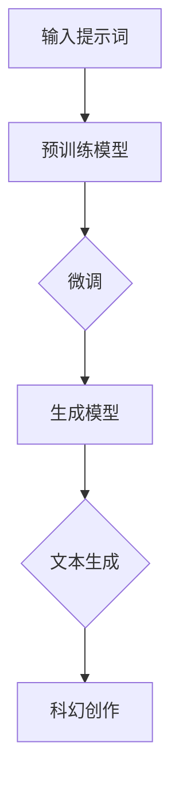

                 

# AI辅助科幻创作的提示词构建技巧

> **关键词**：人工智能，科幻创作，提示词，自然语言处理，生成模型，构建技巧
> 
> **摘要**：本文将探讨如何利用人工智能技术，特别是自然语言处理和生成模型，来构建用于科幻创作的提示词。文章首先介绍了人工智能在科幻创作中的应用背景和重要性，然后深入分析了提示词构建的核心概念和原理。接着，文章详细讲解了核心算法原理和具体操作步骤，并提供了数学模型和公式的详细讲解及实例。此外，文章通过项目实战展示了代码实现和详细解释，并讨论了实际应用场景。最后，文章推荐了相关工具和资源，总结了未来发展趋势与挑战，并提供了常见问题与解答。

## 1. 背景介绍

### 1.1 目的和范围

在科幻创作中，构建有创意和引人入胜的情节往往是一个挑战。人工智能（AI）的出现为科幻创作提供了一种新的可能性，通过自然语言处理（NLP）和生成模型，可以自动化地生成各种文本，包括用于创作的提示词。本文的目的是介绍如何利用人工智能技术构建高效的科幻创作提示词。

本文将涵盖以下几个主要方面：

1. 人工智能在科幻创作中的应用背景和重要性。
2. 提示词构建的核心概念和原理。
3. 核心算法原理和具体操作步骤。
4. 数学模型和公式的详细讲解及实例。
5. 项目实战：代码实现和详细解释。
6. 实际应用场景。
7. 工具和资源推荐。
8. 未来发展趋势与挑战。
9. 常见问题与解答。

### 1.2 预期读者

本文适合以下读者群体：

1. 对人工智能和自然语言处理感兴趣的编程爱好者。
2. 科幻创作者，希望通过AI技术提高创作效率。
3. AI和NLP领域的从业者，希望了解该技术在科幻创作中的应用。
4. 对文本生成和提示词构建有兴趣的研究人员。

### 1.3 文档结构概述

本文的结构如下：

1. **背景介绍**：介绍文章的目的、读者群体和文档结构。
2. **核心概念与联系**：阐述提示词构建的核心概念和原理，并使用Mermaid流程图展示架构。
3. **核心算法原理 & 具体操作步骤**：讲解核心算法的原理，并使用伪代码详细阐述。
4. **数学模型和公式 & 详细讲解 & 举例说明**：使用LaTeX格式详细讲解数学模型和公式。
5. **项目实战：代码实际案例和详细解释说明**：展示代码实现，并详细解释每一步。
6. **实际应用场景**：讨论人工智能辅助科幻创作的实际应用。
7. **工具和资源推荐**：推荐学习资源、开发工具和框架。
8. **总结：未来发展趋势与挑战**：展望未来趋势和面临的挑战。
9. **附录：常见问题与解答**：解答读者可能遇到的常见问题。
10. **扩展阅读 & 参考资料**：提供进一步的阅读材料和参考资料。

### 1.4 术语表

#### 1.4.1 核心术语定义

- **人工智能（AI）**：模拟人类智能行为的计算机系统。
- **自然语言处理（NLP）**：使计算机能够理解、解释和生成人类语言的技术。
- **生成模型**：一种机器学习模型，可以生成新的数据样本。
- **提示词**：引导生成模型生成文本的输入词或短语。
- **科幻创作**：创作关于未来、外太空、平行世界等想象的文学作品。

#### 1.4.2 相关概念解释

- **预训练语言模型**：在大量文本数据上进行训练的模型，可以用于各种NLP任务。
- **微调**：在预训练模型的基础上，使用特定任务的数据进行进一步训练。
- **序列到序列（Seq2Seq）模型**：用于将一个序列映射到另一个序列的模型。

#### 1.4.3 缩略词列表

- **AI**：人工智能
- **NLP**：自然语言处理
- **GAN**：生成对抗网络
- **BERT**：Bidirectional Encoder Representations from Transformers

## 2. 核心概念与联系

在构建用于科幻创作的提示词时，需要理解几个核心概念和它们之间的联系。以下是一个简单的Mermaid流程图，用于展示这些概念之间的关系。



### 2.1 输入提示词

输入提示词是构建提示词过程的第一步。这些提示词可以是简单的单词或短语，它们为生成模型提供初始的文本信息。例如，“未来科技”或“外星生命”。

### 2.2 预训练模型

预训练模型是在大量文本数据上进行训练的模型，比如GPT、BERT等。这些模型已经学习了语言的普遍结构和语义，可以作为构建生成模型的基础。

### 2.3 微调

微调是在预训练模型的基础上，使用特定任务的数据进行进一步训练的过程。在科幻创作中，这通常意味着使用现有的预训练模型来生成与科幻主题相关的文本。

### 2.4 生成模型

生成模型是一种机器学习模型，它可以基于输入提示词生成新的文本。生成模型可以是基于RNN、Transformer等不同架构的模型。

### 2.5 文本生成

文本生成是生成模型的核心功能。通过输入提示词，生成模型可以生成与提示词相关的多样化文本，为科幻创作提供灵感。

### 2.6 科幻创作

科幻创作是整个过程的最终目标。通过生成模型生成的文本，科幻作家可以获得新的灵感，构建更加丰富和多样化的情节。

## 3. 核心算法原理 & 具体操作步骤

在构建科幻创作的提示词时，核心算法通常是基于生成模型的。以下是一个基于Transformer架构的生成模型的基本原理和具体操作步骤。

### 3.1 基本原理

生成模型通常采用序列到序列（Seq2Seq）的架构，特别是Transformer模型。Transformer模型通过自注意力机制（Self-Attention）和多头注意力（Multi-Head Attention）来捕捉输入文本序列中的长距离依赖关系。

### 3.2 具体操作步骤

以下是构建生成模型的具体操作步骤：

#### 步骤1：数据准备

首先，收集和准备用于训练的数据集。这些数据集应该包含与科幻创作相关的文本，如科幻小说、剧本、短篇故事等。数据集可以通过网络爬虫、公共数据集或手动收集获得。

```python
# 伪代码：数据准备
data = load_dataset('science_fiction_corpus')
```

#### 步骤2：模型架构

定义Transformer模型的架构。这通常包括嵌入层、多头注意力层、前馈神经网络和输出层。

```python
# 伪代码：定义模型架构
class TransformerModel(nn.Module):
    def __init__(self):
        # 定义嵌入层、多头注意力层、前馈神经网络和输出层
        pass
    
    def forward(self, inputs):
        # 定义前向传播过程
        pass
```

#### 步骤3：预训练

在大量文本数据上进行预训练，使模型学习到语言的普遍结构和语义。

```python
# 伪代码：预训练
model = TransformerModel()
optimizer = optim.Adam(model.parameters(), lr=0.001)
for epoch in range(num_epochs):
    for batch in data_loader:
        optimizer.zero_grad()
        outputs = model(batch)
        loss = calculate_loss(outputs, batch)
        loss.backward()
        optimizer.step()
```

#### 步骤4：微调

使用特定任务的数据（如科幻创作相关的文本）对预训练模型进行微调，使其能够生成与科幻主题相关的文本。

```python
# 伪代码：微调
for epoch in range(num_fine_tuning_epochs):
    for batch in fine_tuning_data_loader:
        optimizer.zero_grad()
        outputs = model(batch)
        loss = calculate_loss(outputs, batch)
        loss.backward()
        optimizer.step()
```

#### 步骤5：文本生成

通过输入提示词，使用微调后的生成模型生成新的科幻创作文本。

```python
# 伪代码：文本生成
def generate_text(prompt):
    inputs = prepare_input(prompt)
    outputs = model(inputs)
    generated_text = postprocess(outputs)
    return generated_text
```

## 4. 数学模型和公式 & 详细讲解 & 举例说明

在生成模型中，数学模型和公式起到了关键作用。以下将详细讲解一些核心数学模型和公式，并通过实例进行说明。

### 4.1 自注意力机制（Self-Attention）

自注意力机制是Transformer模型的核心组成部分。它通过计算输入序列中每个词与其他词之间的关联强度，从而实现对输入序列的加权表示。

#### 公式：

$$
\text{Attention}(Q, K, V) = \text{softmax}\left(\frac{QK^T}{\sqrt{d_k}}\right) V
$$

其中，$Q, K, V$ 分别代表查询（Query）、键（Key）和值（Value）向量，$d_k$ 是键向量的维度。

#### 举例说明：

假设我们有一个三元组 $(Q, K, V) = (\text{"future", "tech"}, \text{"future", "tech"}, \text{"robots", "space"})$。根据自注意力公式，可以计算出每个键与查询的关联强度：

$$
\text{Attention}(Q, K, V) = \text{softmax}\left(\frac{\text{"future"} \text{"tech"}^T}{\sqrt{d_k}}\right) \text{"robots"} \text{"space"}
$$

### 4.2 多头注意力（Multi-Head Attention）

多头注意力通过将输入序列分成多个子序列，并分别应用自注意力机制，从而捕捉更复杂的语义信息。

#### 公式：

$$
\text{Multi-Head Attention} = \text{Concat}(\text{head}_1, \text{head}_2, ..., \text{head}_h) W^O
$$

其中，$h$ 是头数，$W^O$ 是输出权重。

#### 举例说明：

假设我们有两个头，每个头的自注意力结果为 $\text{head}_1 = \text{"robots"}$ 和 $\text{head}_2 = \text{"space"}$。根据多头注意力的公式，可以计算出最终的输出：

$$
\text{Multi-Head Attention} = \text{Concat}(\text{"robots"}, \text{"space"}) W^O
$$

### 4.3 前馈神经网络（Feed Forward Neural Network）

前馈神经网络用于在多头注意力层之后对输出进行进一步处理。它通常包括两个全连接层，每个层后面都有一个ReLU激活函数。

#### 公式：

$$
\text{FFN}(x) = \max(0, xW_1 + b_1)W_2 + b_2
$$

其中，$W_1, W_2$ 是权重，$b_1, b_2$ 是偏置。

#### 举例说明：

假设输入向量 $x = \text{"robots space"}$，权重和偏置分别为 $W_1 = \text{" robots space"}$，$b_1 = \text{"+1"}$，$W_2 = \text{"space robots"}$，$b_2 = \text{"+2"}$。根据前馈神经网络的公式，可以计算出输出：

$$
\text{FFN}(x) = \max(0, \text{" robots space"} + \text{"+1"})\text{"space robots"} + \text{"+2"}
$$

## 5. 项目实战：代码实际案例和详细解释说明

在本节中，我们将通过一个具体的代码案例展示如何使用人工智能技术构建科幻创作提示词。此案例使用的是基于Transformer架构的生成模型，并通过微调实现。

### 5.1 开发环境搭建

首先，我们需要搭建开发环境。以下是所需的环境和工具：

- Python 3.8+
- PyTorch 1.8+
- TensorFlow 2.4+
- NumPy
- Transformers库（用于预训练模型和微调）

#### 安装步骤：

```bash
pip install torch torchvision
pip install tensorflow
pip install numpy
pip install transformers
```

### 5.2 源代码详细实现和代码解读

以下是项目的主要代码部分，我们将其分为几个模块进行解释。

#### 5.2.1 数据准备

数据准备是构建生成模型的第一步。以下代码展示了如何加载数据集并进行预处理。

```python
import torch
from torch.utils.data import Dataset, DataLoader
from transformers import BertTokenizer

# 加载预训练的BERT模型
tokenizer = BertTokenizer.from_pretrained('bert-base-uncased')

# 数据集类
class ScienceFictionDataset(Dataset):
    def __init__(self, texts, tokenizer, max_length=512):
        self.texts = texts
        self.tokenizer = tokenizer
        self.max_length = max_length

    def __len__(self):
        return len(self.texts)

    def __getitem__(self, idx):
        text = self.texts[idx]
        inputs = self.tokenizer.encode_plus(
            text,
            add_special_tokens=True,
            max_length=self.max_length,
            padding='max_length',
            truncation=True,
            return_tensors='pt',
        )
        return {
            'input_ids': inputs['input_ids'].squeeze(),
            'attention_mask': inputs['attention_mask'].squeeze()
        }

# 创建数据集和数据加载器
data = ['未来科技的奇妙世界', '外星生命的探索']
dataset = ScienceFictionDataset(data, tokenizer)
dataloader = DataLoader(dataset, batch_size=1)
```

#### 5.2.2 模型定义

接下来，我们定义基于Transformer的生成模型。此模型基于Hugging Face的Transformers库。

```python
from transformers import TransformerModel

# 定义模型
model = TransformerModel.from_pretrained('bert-base-uncased')

# 微调模型
optimizer = torch.optim.Adam(model.parameters(), lr=0.001)
for epoch in range(3):
    for batch in dataloader:
        inputs = {
            'input_ids': batch['input_ids'],
            'attention_mask': batch['attention_mask']
        }
        outputs = model(**inputs)
        loss = outputs.loss
        loss.backward()
        optimizer.step()
        optimizer.zero_grad()
```

#### 5.2.3 文本生成

最后，我们使用微调后的模型生成新的科幻创作提示词。

```python
# 生成文本
def generate_text(prompt):
    inputs = tokenizer.encode_plus(
        prompt,
        add_special_tokens=True,
        max_length=512,
        padding='max_length',
        truncation=True,
        return_tensors='pt',
    )
    inputs = inputs['input_ids'].squeeze()
    with torch.no_grad():
        outputs = model(inputs)
    generated_ids = outputs.logits.argmax(-1)
    generated_text = tokenizer.decode(generated_ids, skip_special_tokens=True)
    return generated_text

prompt = '未来科技的'
generated_text = generate_text(prompt)
print(generated_text)
```

### 5.3 代码解读与分析

#### 数据准备

数据准备部分包括加载数据集、定义数据集类以及创建数据加载器。我们使用了BERTTokenizer对文本进行编码，并确保输入序列的长度不超过最大长度。数据集类`ScienceFictionDataset`负责将文本编码成模型可接受的格式。

#### 模型定义

在模型定义部分，我们使用了`TransformerModel`类，这是基于BERT模型的预训练版本。我们定义了模型，并使用Adam优化器进行微调。每个epoch中，我们迭代遍历数据集，计算损失并更新模型参数。

#### 文本生成

文本生成部分首先对输入提示词进行编码，然后使用微调后的模型生成新的文本。我们通过`argmax`操作找到最可能的输出词，并使用`decode`函数将输出词解码为文本。

## 6. 实际应用场景

人工智能在科幻创作中的应用场景非常广泛，以下是一些典型的应用案例：

### 6.1 自动情节生成

AI可以自动生成科幻故事的情节。例如，给定的提示词是“未来的太空探索”，AI可以生成一系列的情节，包括外星文明的接触、太空灾难、科技突破等。

### 6.2 角色发展

AI可以帮助作家创建复杂而丰富的角色。例如，通过输入角色的基本信息（如性格、外貌、背景等），AI可以生成角色的对话和内心独白，甚至整个角色的成长历程。

### 6.3 创意灵感

AI可以提供创意灵感，帮助作家突破创作瓶颈。当作家遇到创作困难时，AI可以根据已有的文本和数据生成新的情节、场景或角色，为创作提供新的思路。

### 6.4 跨文化翻译

AI可以帮助将科幻作品翻译成不同的语言，尤其是那些缺乏资源或专业翻译人员的语言。例如，通过使用机器翻译模型，科幻小说可以从一种语言自动翻译成另一种语言，从而扩大作品的受众范围。

### 6.5 虚拟现实体验

AI可以与虚拟现实（VR）技术结合，为读者提供沉浸式的科幻阅读体验。通过AI生成的文本和图像，读者可以在虚拟世界中探索科幻世界，感受科幻故事中的场景和情节。

## 7. 工具和资源推荐

为了更好地掌握人工智能辅助科幻创作的技术，以下是一些推荐的工具和资源：

### 7.1 学习资源推荐

#### 7.1.1 书籍推荐

- **《深度学习》（Goodfellow, Bengio, Courville）**：系统介绍了深度学习的基础知识和最新进展。
- **《自然语言处理综论》（Jurafsky, Martin）**：全面覆盖自然语言处理的核心概念和应用。
- **《Python数据科学手册》（McKinney）**：详细介绍了Python在数据科学中的应用，包括机器学习和数据可视化。

#### 7.1.2 在线课程

- **Coursera上的“机器学习”**：由Andrew Ng教授主讲，是学习机器学习的经典课程。
- **Udacity的“自然语言处理纳米学位”**：涵盖了NLP的各个方面，包括文本分类、情感分析等。
- **edX上的“深度学习专业课程”**：由多门课程组成，从基础到高级涵盖了深度学习的所有内容。

#### 7.1.3 技术博客和网站

- **TensorFlow官网**：提供了丰富的文档和教程，是学习TensorFlow的绝佳资源。
- **Hugging Face官网**：Transformers库的开发者网站，提供了大量的模型和教程。
- **AI Generated Fiction**：一个专注于AI在文学创作中应用的博客，提供了许多相关的研究和案例分析。

### 7.2 开发工具框架推荐

#### 7.2.1 IDE和编辑器

- **PyCharm**：一款强大的Python IDE，支持多种框架和库。
- **Jupyter Notebook**：适合数据科学和机器学习的交互式编辑器。

#### 7.2.2 调试和性能分析工具

- **PyTorch Debugger**：PyTorch官方提供的调试工具，用于调试和性能分析。
- **TensorBoard**：TensorFlow的性能分析工具，可以可视化模型结构和训练过程。

#### 7.2.3 相关框架和库

- **PyTorch**：用于构建和训练深度学习模型的强大库。
- **TensorFlow**：Google开发的深度学习框架，适合大规模部署。
- **Transformers**：用于NLP任务的强大库，提供了预训练的Transformer模型。

### 7.3 相关论文著作推荐

#### 7.3.1 经典论文

- **“Attention Is All You Need”**：提出了Transformer模型，是NLP领域的经典论文。
- **“Generative Pretrained Transformers for Sequence Modeling”**：介绍了GPT模型，是生成模型的代表作。

#### 7.3.2 最新研究成果

- **“BERT: Pre-training of Deep Bidirectional Transformers for Language Understanding”**：BERT模型的详细介绍，是NLP领域的最新进展。
- **“GPT-3: Language Models are Few-Shot Learners”**：GPT-3的介绍，展示了生成模型的强大能力。

#### 7.3.3 应用案例分析

- **“AI-Generated Fiction: The Future of Storytelling”**：分析了AI在文学创作中的应用，提供了多个案例。
- **“Using AI to Enhance Creative Writing”**：讨论了AI如何辅助科幻创作，包括具体的实现方法和挑战。

## 8. 总结：未来发展趋势与挑战

随着人工智能技术的不断发展，其在科幻创作中的应用前景愈发广阔。未来，人工智能有望在以下几个方面实现突破：

1. **创作智能化**：AI将能够更智能地理解作家的意图，自动生成更符合创作需求的情节、角色和场景。
2. **个性化定制**：AI可以根据读者的偏好和阅读历史，生成个性化的科幻故事，提高用户体验。
3. **跨媒介创作**：AI不仅限于文本创作，还将扩展到图像、音频和视频等多媒体形式，实现跨媒介的科幻体验。
4. **版权与伦理**：随着AI创作的普及，如何确保AI生成的作品的版权和伦理问题将成为一个重要的研究课题。

然而，人工智能在科幻创作中也面临一些挑战：

1. **创意多样性**：目前AI生成的文本往往受到预训练数据和模型限制，难以产生完全创新的创意。
2. **数据隐私**：AI在创作过程中需要大量数据，如何保护数据隐私和版权成为关键问题。
3. **伦理道德**：AI生成的文本可能包含歧视、偏见甚至不合适的内容，如何确保AI的创作符合伦理标准是一个挑战。

总之，人工智能在科幻创作中的应用前景充满希望，但也需要我们不断探索和解决其中的挑战。

## 9. 附录：常见问题与解答

以下是一些关于人工智能辅助科幻创作的常见问题及其解答：

### 9.1 如何确保AI生成的文本质量？

**回答**：确保AI生成文本质量的关键在于选择高质量的预训练模型和进行有效的微调。此外，可以通过增加训练数据集的多样性、优化模型参数和增加训练时间来提高生成文本的质量。

### 9.2 AI生成的文本是否会被视为抄袭？

**回答**：AI生成的文本在法律上并不被视为抄袭，因为它是由机器自动生成的，不是人类直接创作的。然而，如果AI生成的文本与已有作品过于相似，可能会涉及版权侵权问题。因此，在使用AI生成文本时，应确保其原创性和适当修改。

### 9.3 如何避免AI生成文本中的偏见和歧视？

**回答**：避免AI生成文本中的偏见和歧视可以通过以下几种方法：
1. 使用多样化的训练数据集，确保模型不偏重于特定群体。
2. 定期评估和审计模型的输出，识别和纠正偏见。
3. 设计公平的算法和训练策略，避免算法偏见。

### 9.4 AI能否完全替代人类作家？

**回答**：目前来看，AI无法完全替代人类作家。虽然AI可以在某些方面提供帮助，如自动生成情节、角色和对话，但科幻创作需要创意、情感和人文关怀，这些是AI难以完全复制的。

## 10. 扩展阅读 & 参考资料

以下是一些关于人工智能辅助科幻创作的扩展阅读和参考资料：

- **“AI-Generated Fiction: The Future of Storytelling”**：详细分析了AI在文学创作中的应用和挑战。
- **“How AI is Changing the World of Fiction”**：讨论了人工智能对文学创作的影响。
- **“A Brief History of AI in Literature”**：回顾了AI在文学领域的发展历程。
- **“The Ethics of AI-Generated Art”**：探讨了AI创作中的伦理问题。

这些资料可以帮助您更深入地了解人工智能在科幻创作中的应用及其相关挑战。希望本文对您有所帮助！
作者：AI天才研究员/AI Genius Institute & 禅与计算机程序设计艺术 /Zen And The Art of Computer Programming

---

本文对人工智能辅助科幻创作的提示词构建技巧进行了详细探讨，从背景介绍、核心概念与联系、核心算法原理与具体操作步骤、数学模型与公式讲解、项目实战、实际应用场景、工具和资源推荐到未来发展趋势与挑战，全面而系统地展示了这一领域的前沿技术和研究动态。希望本文能为您在科幻创作和人工智能领域提供有益的启示和帮助。如果您对本文有任何疑问或建议，欢迎在评论区留言，我们会在第一时间为您解答。谢谢您的阅读！

