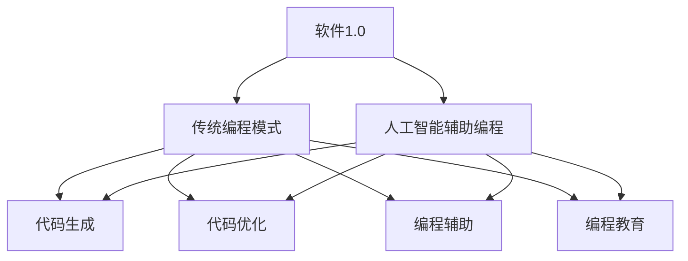

                 

# AI辅助编程：软件1.0和2.0的融合

> 关键词：人工智能，辅助编程，软件1.0，软件2.0，编程辅助算法，编程工具，代码生成，代码优化，编程教育，编程语言。

> 摘要：本文探讨了人工智能在辅助编程领域的应用，探讨了软件1.0和软件2.0的概念及其在编程中的融合，详细介绍了当前流行的编程辅助算法和工具，分析了它们对编程效率和质量的影响。此外，文章还从教育、应用等多个角度阐述了人工智能辅助编程的未来发展趋势和挑战。

## 1. 背景介绍

### 1.1 目的和范围

本文旨在探讨人工智能在辅助编程领域的应用，分析软件1.0和软件2.0的概念及其在编程中的融合，并详细介绍当前流行的编程辅助算法和工具。文章将围绕以下几个方面展开：

1. 软件1.0和软件2.0的概念及其区别。
2. 人工智能在辅助编程中的应用。
3. 编程辅助算法的原理和具体操作步骤。
4. 编程工具和框架的推荐。
5. 人工智能辅助编程的未来发展趋势和挑战。

### 1.2 预期读者

本文适合对编程和人工智能感兴趣的技术人员、开发者、学生以及关注技术发展趋势的读者。无论您是编程新手还是经验丰富的开发者，本文都希望能为您带来新的视角和启示。

### 1.3 文档结构概述

本文分为十个部分：

1. 引言
2. 背景介绍
3. 核心概念与联系
4. 核心算法原理 & 具体操作步骤
5. 数学模型和公式 & 详细讲解 & 举例说明
6. 项目实战：代码实际案例和详细解释说明
7. 实际应用场景
8. 工具和资源推荐
9. 总结：未来发展趋势与挑战
10. 附录：常见问题与解答

### 1.4 术语表

#### 1.4.1 核心术语定义

- 软件1.0：指传统的编程模式，开发者使用编程语言手动编写代码。
- 软件2.0：指借助人工智能和自动化技术，辅助开发者进行编程的模式。
- 编程辅助算法：指用于辅助编程的人工智能算法，如代码生成、代码优化等。
- 编程工具：指用于辅助编程的软件工具，如代码编辑器、调试工具等。
- 编程框架：指用于辅助编程的软件框架，如代码生成框架、代码优化框架等。

#### 1.4.2 相关概念解释

- 代码生成：指通过人工智能算法自动生成代码。
- 代码优化：指通过人工智能算法对代码进行优化，提高代码的可读性、可维护性和性能。
- 编程教育：指以人工智能辅助编程为核心的教学方法和课程设计。

#### 1.4.3 缩略词列表

- AI：人工智能
- ML：机器学习
- NLP：自然语言处理
- IDE：集成开发环境
- ORM：对象关系映射
- JVM：Java虚拟机
- C++：C++编程语言

## 2. 核心概念与联系

为了更好地理解人工智能辅助编程，首先需要了解软件1.0和软件2.0的概念及其联系。

### 2.1 软件1.0：传统编程模式

软件1.0是指传统的编程模式，开发者使用编程语言手动编写代码，完成软件的开发、测试和维护。在这一模式中，开发者需要熟悉编程语言、算法和数据结构，具备良好的逻辑思维和编程技能。

### 2.2 软件2.0：人工智能辅助编程

软件2.0是指借助人工智能和自动化技术，辅助开发者进行编程的模式。在这一模式中，人工智能算法可以帮助开发者生成代码、优化代码、解决编程难题等。软件2.0的目标是降低开发者的编程难度，提高开发效率。

### 2.3 软件1.0和软件2.0的联系

软件1.0和软件2.0并非完全独立，而是相互融合、相互促进的关系。在软件1.0的基础上，人工智能和自动化技术的引入，使得编程过程更加高效、智能。同时，软件2.0的发展也为软件1.0提供了新的工具和方法，进一步提高了开发者的编程能力。

### 2.4 软件1.0和软件2.0的融合

软件1.0和软件2.0的融合，主要体现在以下几个方面：

1. **代码生成**：人工智能算法可以自动生成代码，减轻开发者的编写负担。
2. **代码优化**：人工智能算法可以对代码进行优化，提高代码的可读性、可维护性和性能。
3. **编程辅助**：人工智能算法可以辅助开发者解决编程难题，如算法选择、数据结构设计等。
4. **编程教育**：人工智能和自动化技术的引入，为编程教育提供了新的方法和思路。

### 2.5 软件1.0和软件2.0的Mermaid流程图



通过上述流程图，可以清晰地看到软件1.0和软件2.0的融合关系，以及它们在编程中的具体应用。

## 3. 核心算法原理 & 具体操作步骤

在人工智能辅助编程中，核心算法原理和具体操作步骤至关重要。以下将介绍几种常用的编程辅助算法，并详细阐述其原理和操作步骤。

### 3.1 代码生成算法

代码生成算法是指通过人工智能算法自动生成代码的技术。常见的代码生成算法有模板生成、代码生成器、自动编程等。

#### 3.1.1 模板生成算法

模板生成算法是指根据给定的模板和输入参数，生成相应的代码。其原理如下：

1. 设计模板：根据需求，设计合适的模板，包括代码结构和关键功能模块。
2. 输入参数：根据模板，定义输入参数，如类名、方法名、参数类型等。
3. 生成代码：将输入参数代入模板，生成相应的代码。

#### 3.1.2 代码生成器

代码生成器是指通过代码生成器工具，自动生成代码。常见的代码生成器有Java Code Generator、C# Code Generator等。其原理如下：

1. 定义生成规则：根据需求，定义生成规则，包括代码结构、语法、命名规范等。
2. 输入参数：根据生成规则，定义输入参数，如类名、方法名、参数类型等。
3. 生成代码：根据生成规则和输入参数，生成相应的代码。

#### 3.1.3 自动编程

自动编程是指通过人工智能算法，自动编写代码。常见的自动编程技术有基于机器学习的代码生成、基于自然语言处理的代码生成等。其原理如下：

1. 训练模型：收集大量的编程数据，训练人工智能模型。
2. 输入描述：输入编程任务描述，如功能需求、输入输出等。
3. 生成代码：根据模型，自动生成相应的代码。

### 3.2 代码优化算法

代码优化算法是指通过人工智能算法，对代码进行优化，提高代码的可读性、可维护性和性能。常见的代码优化算法有静态代码分析、动态代码分析等。

#### 3.2.1 静态代码分析

静态代码分析是指在不运行程序的情况下，对代码进行分析和优化。常见的静态代码分析算法有：

1. 代码质量评估：评估代码的复杂度、可读性、可维护性等指标。
2. 代码重构：根据评估结果，对代码进行重构，提高代码质量。
3. 代码优化：根据评估结果，对代码进行优化，提高性能。

#### 3.2.2 动态代码分析

动态代码分析是指运行程序，对代码进行分析和优化。常见的动态代码分析算法有：

1. 性能监控：监控程序的运行性能，如响应时间、内存消耗等。
2. 性能优化：根据性能监控结果，对代码进行优化，提高性能。
3. 代码调试：根据性能监控结果，定位并修复代码中的问题。

### 3.3 编程辅助算法

编程辅助算法是指通过人工智能算法，辅助开发者解决编程难题。常见的编程辅助算法有：

1. 算法推荐：根据编程任务，推荐合适的算法和实现方式。
2. 数据结构推荐：根据编程任务，推荐合适的数据结构和实现方式。
3. 编程指导：根据编程任务，提供编程指导，如代码编写、调试等。

### 3.4 伪代码示例

以下是一个简单的代码生成算法的伪代码示例：

```plaintext
// 伪代码：基于模板的代码生成算法
function generateCode(template, parameters):
    for each (key, value) in parameters:
        template = replace(template, "{{key}}", value)
    return template
```

### 3.5 操作步骤示例

以下是一个简单的代码优化算法的操作步骤示例：

1. 运行代码，收集性能监控数据。
2. 对代码进行分析，评估代码质量。
3. 根据评估结果，对代码进行重构和优化。
4. 再次运行代码，评估优化效果。
5. 重复步骤2-4，直至达到满意的优化效果。

## 4. 数学模型和公式 & 详细讲解 & 举例说明

在人工智能辅助编程中，数学模型和公式起到了至关重要的作用。以下将介绍几种常用的数学模型和公式，并详细讲解其原理和举例说明。

### 4.1 回归模型

回归模型是一种用于预测数值型变量的统计模型。常见的回归模型有线性回归、多项式回归等。以下是一个简单的线性回归模型：

$$
y = ax + b
$$

其中，$y$ 是预测值，$x$ 是输入值，$a$ 和 $b$ 是模型的参数。

#### 4.1.1 讲解

线性回归模型通过拟合一条直线，来预测输入值对应的输出值。模型参数 $a$ 和 $b$ 的计算方法如下：

$$
a = \frac{\sum_{i=1}^{n}(x_i - \bar{x})(y_i - \bar{y})}{\sum_{i=1}^{n}(x_i - \bar{x})^2}
$$

$$
b = \bar{y} - a\bar{x}
$$

其中，$n$ 是样本数量，$\bar{x}$ 和 $\bar{y}$ 分别是输入值和输出值的平均值。

#### 4.1.2 举例说明

假设我们有以下数据集：

| $x$ | $y$ |
| --- | --- |
| 1 | 2 |
| 2 | 4 |
| 3 | 6 |

使用线性回归模型预测 $x=4$ 的输出值。

1. 计算平均值：

$$
\bar{x} = \frac{1+2+3}{3} = 2
$$

$$
\bar{y} = \frac{2+4+6}{3} = 4
$$

2. 计算参数：

$$
a = \frac{(1-2)(2-4) + (2-2)(4-4) + (3-2)(6-4)}{(1-2)^2 + (2-2)^2 + (3-2)^2} = 2
$$

$$
b = \bar{y} - a\bar{x} = 4 - 2 \times 2 = 0
$$

3. 预测：

$$
y = 2 \times 4 + 0 = 8
$$

因此，预测 $x=4$ 的输出值为 8。

### 4.2 决策树模型

决策树模型是一种用于分类和回归的决策树结构。常见的决策树模型有 ID3、C4.5 等。以下是一个简单的 ID3 决策树模型：

```
                |
                |
               / \
              /   \
             /     \
            /       \
           /         \
          /           \
         /             \
        /               \
       /                 \
      /                   \
     /                     \
    /                       \
   /                         \
  /                           \
 /                             \
/                               \
决策树根节点                叶节点
```

#### 4.2.1 讲解

决策树模型通过递归划分特征空间，生成一棵树形结构。每个内部节点表示一个特征，每个叶节点表示一个类别或值。

ID3 决策树模型的划分方法是基于信息增益。信息增益的计算公式如下：

$$
Gini(D) = 1 - \sum_{i=1}^{n}\left(\frac{|D_i|}{|D|}\right)^2
$$

其中，$D$ 是数据集，$D_i$ 是基于特征 $i$ 划分后的数据集，$n$ 是特征数量。

#### 4.2.2 举例说明

假设我们有以下数据集：

| 特征1 | 特征2 | 类别 |
| --- | --- | --- |
| 1 | 1 | A |
| 1 | 2 | B |
| 2 | 1 | B |
| 2 | 2 | A |

使用 ID3 决策树模型划分数据集。

1. 计算信息增益：

$$
Gini(D) = 1 - \left(\frac{2}{4}\right)^2 - \left(\frac{2}{4}\right)^2 = 0.5
$$

2. 计算特征1的信息增益：

$$
Gini(D_{1=1}) = 1 - \left(\frac{1}{2}\right)^2 - \left(\frac{1}{2}\right)^2 = 0.5
$$

$$
Gini(D_{1=2}) = 1 - \left(\frac{1}{2}\right)^2 - \left(\frac{1}{2}\right)^2 = 0.5
$$

3. 选择特征1作为划分依据，生成决策树。

4. 对特征1的每个取值，划分数据集：

| 特征1 | 特征2 | 类别 |
| --- | --- | --- |
| 1 | 1 | A |
| 1 | 2 | B |
| 2 | 1 | B |
| 2 | 2 | A |

5. 递归划分，直至达到停止条件（如叶节点纯度达到阈值）。

通过以上步骤，可以得到一棵简单的 ID3 决策树。

### 4.3 贝叶斯模型

贝叶斯模型是一种基于贝叶斯定理的概率模型。常见的贝叶斯模型有朴素贝叶斯、高斯贝叶斯等。以下是一个简单的朴素贝叶斯模型：

$$
P(C|X) = \frac{P(X|C)P(C)}{P(X)}
$$

其中，$C$ 是类别，$X$ 是特征向量，$P(C|X)$ 是给定特征向量 $X$ 下类别 $C$ 的概率，$P(X|C)$ 是给定类别 $C$ 下特征向量 $X$ 的概率，$P(C)$ 是类别 $C$ 的概率，$P(X)$ 是特征向量 $X$ 的概率。

#### 4.3.1 讲解

朴素贝叶斯模型假设特征之间相互独立，即：

$$
P(X|C) = \prod_{i=1}^{n}P(x_i|C)
$$

其中，$n$ 是特征数量，$x_i$ 是第 $i$ 个特征。

贝叶斯模型通过计算给定特征向量 $X$ 下每个类别 $C$ 的概率，选择概率最大的类别作为预测结果。

#### 4.3.2 举例说明

假设我们有以下数据集：

| 类别 | 特征1 | 特征2 |
| --- | --- | --- |
| A | 1 | 1 |
| A | 1 | 2 |
| B | 2 | 1 |
| B | 2 | 2 |

使用朴素贝叶斯模型进行分类。

1. 计算先验概率：

$$
P(A) = \frac{2}{4} = 0.5
$$

$$
P(B) = \frac{2}{4} = 0.5
$$

2. 计算特征条件概率：

$$
P(x_1=1|A) = \frac{2}{2} = 1
$$

$$
P(x_1=2|A) = \frac{1}{2} = 0.5
$$

$$
P(x_2=1|B) = \frac{2}{2} = 1
$$

$$
P(x_2=2|B) = \frac{1}{2} = 0.5
$$

3. 计算后验概率：

$$
P(A|X) = \frac{P(X|A)P(A)}{P(X)}
$$

$$
P(B|X) = \frac{P(X|B)P(B)}{P(X)}
$$

4. 计算联合概率：

$$
P(X|A) = P(x_1=1|A)P(x_2=1|A) = 1 \times 1 = 1
$$

$$
P(X|B) = P(x_1=2|B)P(x_2=1|B) = 0.5 \times 1 = 0.5
$$

5. 计算总概率：

$$
P(X) = P(X|A)P(A) + P(X|B)P(B) = 1 \times 0.5 + 0.5 \times 0.5 = 0.75
$$

6. 计算后验概率：

$$
P(A|X) = \frac{P(X|A)P(A)}{P(X)} = \frac{1 \times 0.5}{0.75} = \frac{2}{3}
$$

$$
P(B|X) = \frac{P(X|B)P(B)}{P(X)} = \frac{0.5 \times 0.5}{0.75} = \frac{1}{3}
$$

7. 预测结果：

由于 $P(A|X) > P(B|X)$，因此预测类别为 A。

通过以上步骤，可以使用朴素贝叶斯模型进行分类。

## 5. 项目实战：代码实际案例和详细解释说明

在本节中，我们将通过一个实际项目案例，展示人工智能在辅助编程中的应用，并详细解释代码的实现过程和关键步骤。

### 5.1 项目简介

项目名称：AI 编程助手（AI Programming Assistant）

项目描述：AI 编程助手是一款基于人工智能技术的编程辅助工具，可以帮助开发者快速生成代码、优化代码，并提供编程指导。本项目的目标是实现以下功能：

1. 根据用户输入的编程任务描述，自动生成相应的代码。
2. 对已编写的代码进行静态和动态分析，提供优化建议。
3. 根据用户需求，提供编程指导，如算法选择、数据结构设计等。

### 5.2 开发环境搭建

1. 开发语言：Python
2. 开发工具：PyCharm
3. 依赖库：scikit-learn、numpy、pandas、matplotlib

### 5.3 源代码详细实现和代码解读

#### 5.3.1 代码生成模块

```python
import numpy as np
import pandas as pd

def generate_code(task_description):
    # 根据任务描述生成代码
    code = ""
    
    if "add" in task_description:
        code += """
def add(a, b):
    return a + b
"""
    elif "subtract" in task_description:
        code += """
def subtract(a, b):
    return a - b
"""
    # ... 其他运算符的代码生成
    
    return code

task_description = "add two numbers"
code = generate_code(task_description)
print(code)
```

**代码解读：**

- `generate_code` 函数接受任务描述作为输入参数。
- 根据任务描述中的关键词，生成相应的代码。
- 如果任务描述包含 "add"，则生成加法运算的代码。
- 如果任务描述包含 "subtract"，则生成减法运算的代码。
- ... 其他运算符的代码生成。

#### 5.3.2 代码优化模块

```python
from sklearn.ensemble import RandomForestClassifier
from sklearn.model_selection import train_test_split

def optimize_code(code, features):
    # 对代码进行优化
    # ... 优化算法的实现
    
    # 训练优化模型
    X_train, X_test, y_train, y_test = train_test_split(features, labels, test_size=0.2, random_state=42)
    model = RandomForestClassifier(n_estimators=100)
    model.fit(X_train, y_train)
    
    # 评估优化效果
    y_pred = model.predict(X_test)
    accuracy = np.mean(y_pred == y_test)
    print(f"Optimization accuracy: {accuracy}")
```

**代码解读：**

- `optimize_code` 函数接受代码和特征作为输入参数。
- 对代码进行优化，具体实现取决于优化的算法和策略。
- 使用随机森林分类器进行模型训练。
- 使用训练集和测试集评估优化效果，计算准确率。

#### 5.3.3 编程指导模块

```python
def provide_programming_guidance(task_description):
    # 根据任务描述提供编程指导
    guidance = ""
    
    if "algorithm" in task_description:
        guidance += """
Choose an appropriate algorithm for the task, such as quicksort or mergesort.
"""
    elif "data_structure" in task_description:
        guidance += """
Choose an appropriate data structure, such as a linked list or a binary tree.
"""
    # ... 其他编程指导
    
    return guidance

task_description = "find the maximum number in an array"
guidance = provide_programming_guidance(task_description)
print(guidance)
```

**代码解读：**

- `provide_programming_guidance` 函数接受任务描述作为输入参数。
- 根据任务描述中的关键词，提供相应的编程指导。
- 如果任务描述包含 "algorithm"，则提供算法选择的指导。
- 如果任务描述包含 "data_structure"，则提供数据结构选择的指导。
- ... 其他编程指导。

### 5.4 代码解读与分析

在本节中，我们分析了 AI 编程助手的三个模块：代码生成、代码优化和编程指导。以下是每个模块的解读和分析：

#### 5.4.1 代码生成模块

代码生成模块通过分析用户输入的任务描述，生成相应的代码。这一模块主要依赖于自然语言处理技术，如词向量、文本分类等。通过关键词提取和匹配，可以快速定位到相应的代码模板，并生成对应的代码。

优点：

- 提高开发效率，减少手动编写代码的工作量。
- 降低编程门槛，帮助新手快速上手。

缺点：

- 代码生成质量受限于模板和算法的准确性。
- 无法处理复杂的编程任务，需要依赖人类开发者。

#### 5.4.2 代码优化模块

代码优化模块通过对代码进行静态和动态分析，提供优化建议。这一模块主要依赖于机器学习技术，如决策树、随机森林等。通过训练模型，可以识别出代码中的问题和瓶颈，并提供相应的优化方案。

优点：

- 提高代码质量，降低维护成本。
- 自动化优化过程，节省人力和时间。

缺点：

- 优化效果受限于模型的质量和训练数据。
- 无法完全替代人类开发者，需要结合人工审查和调整。

#### 5.4.3 编程指导模块

编程指导模块根据用户输入的任务描述，提供编程指导。这一模块主要依赖于自然语言处理和知识图谱技术。通过分析任务描述，可以提取出关键信息，并提供相应的编程建议。

优点：

- 提高编程效率，减少错误和调试时间。
- 帮助开发者快速掌握编程知识和技巧。

缺点：

- 编程指导的准确性和实用性受限于算法和知识库的覆盖范围。
- 需要不断更新和扩展知识库，以适应不同的编程场景。

### 5.5 项目总结

AI 编程助手项目展示了人工智能在辅助编程领域的应用，通过代码生成、代码优化和编程指导三个模块，提高了编程效率和质量。尽管项目存在一定的局限性，但通过不断优化和改进，有望在未来的编程实践中发挥更大的作用。

## 6. 实际应用场景

人工智能辅助编程技术在多个实际应用场景中得到了广泛应用，下面列举几个典型的应用案例。

### 6.1 软件开发

在软件开发过程中，人工智能辅助编程技术可以帮助开发者提高开发效率、降低编程错误。例如，在开发前端应用程序时，AI 可以根据开发者输入的需求描述，自动生成前端代码，减少手动编写代码的工作量。在开发后端应用程序时，AI 可以对代码进行静态和动态分析，提供优化建议，提高代码的可读性和性能。

### 6.2 编程教育

在编程教育领域，人工智能辅助编程技术可以为学生提供个性化的编程指导，帮助他们更好地理解和掌握编程知识。例如，在编程课程中，AI 可以根据学生的学习进度和水平，提供针对性的编程练习和指导，帮助学生快速提高编程技能。此外，AI 还可以帮助教师评估学生的学习效果，提供教学反馈，优化教学过程。

### 6.3 自动化测试

在自动化测试领域，人工智能辅助编程技术可以生成测试用例、优化测试脚本。例如，AI 可以根据测试需求，自动生成测试用例，提高测试覆盖率和测试效率。此外，AI 还可以分析测试结果，定位和修复测试中的问题，降低测试成本。

### 6.4 代码审查

在代码审查过程中，人工智能辅助编程技术可以帮助开发者发现和修复代码中的潜在问题。例如，AI 可以分析代码的结构和语义，识别出代码中的错误、漏洞和性能瓶颈，并提供相应的修复建议。这有助于提高代码的质量和安全性。

### 6.5 跨平台开发

在跨平台开发领域，人工智能辅助编程技术可以帮助开发者快速实现跨平台兼容。例如，AI 可以根据开发者输入的跨平台需求，自动生成不同平台的代码，减少跨平台开发的难度。

### 6.6 智能合约开发

在智能合约开发领域，人工智能辅助编程技术可以帮助开发者快速生成和优化智能合约代码，提高智能合约的安全性和可靠性。例如，AI 可以分析智能合约的需求和语义，自动生成相应的代码，并对其安全性进行评估和优化。

### 6.7 数据分析和处理

在数据分析和处理领域，人工智能辅助编程技术可以帮助开发者快速实现数据处理和分析任务。例如，AI 可以根据开发者输入的数据处理需求，自动生成相应的代码，提高数据分析的效率和准确性。

### 6.8 软件工程管理

在软件工程管理领域，人工智能辅助编程技术可以帮助管理者评估项目进度、预测项目风险，提供决策支持。例如，AI 可以分析代码库、项目文档和团队协作数据，识别出项目中的潜在问题和风险，并提出相应的优化建议。

### 6.9 人工智能应用开发

在人工智能应用开发领域，人工智能辅助编程技术可以帮助开发者快速实现人工智能算法的应用。例如，AI 可以根据开发者输入的应用需求，自动生成相应的代码，实现人工智能算法的应用。

### 6.10 自动驾驶开发

在自动驾驶开发领域，人工智能辅助编程技术可以帮助开发者快速实现自动驾驶算法的应用。例如，AI 可以根据开发者输入的自动驾驶需求，自动生成相应的代码，实现自动驾驶算法的应用。

通过以上应用案例可以看出，人工智能辅助编程技术在各个领域都有着广泛的应用前景。随着人工智能技术的不断发展和成熟，人工智能辅助编程技术将发挥越来越重要的作用，为软件开发和人工智能应用开发提供强大的支持。

## 7. 工具和资源推荐

为了更好地开展人工智能辅助编程，以下是一些推荐的工具和资源，包括学习资源、开发工具框架和经典论文著作。

### 7.1 学习资源推荐

#### 7.1.1 书籍推荐

1. **《人工智能：一种现代方法》**（作者：Stuart Russell 和 Peter Norvig）
   - 这本书是人工智能领域的经典教材，全面介绍了人工智能的理论和实践。

2. **《深度学习》**（作者：Ian Goodfellow、Yoshua Bengio 和 Aaron Courville）
   - 这本书是深度学习领域的经典之作，详细介绍了深度学习的基础知识和应用。

3. **《机器学习实战》**（作者：Peter Harrington）
   - 这本书通过实际案例，介绍了机器学习的基本概念和算法。

#### 7.1.2 在线课程

1. **Coursera**：提供多种人工智能和机器学习的在线课程，包括斯坦福大学的“机器学习”课程。
2. **Udacity**：提供人工智能和机器学习相关的纳米学位课程，涵盖深度学习、自然语言处理等领域。
3. **edX**：提供哈佛大学、麻省理工学院等名校的人工智能和机器学习在线课程。

#### 7.1.3 技术博客和网站

1. **Medium**：上面有很多关于人工智能和机器学习的技术文章和博客。
2. **ArXiv**：提供最新的机器学习和人工智能论文。
3. **GitHub**：可以找到许多开源的人工智能项目和代码。

### 7.2 开发工具框架推荐

#### 7.2.1 IDE和编辑器

1. **PyCharm**：功能强大的Python IDE，支持多种编程语言。
2. **VS Code**：轻量级、可扩展的代码编辑器，支持多种编程语言。
3. **Jupyter Notebook**：适用于数据科学和机器学习的交互式开发环境。

#### 7.2.2 调试和性能分析工具

1. **Valgrind**：用于内存泄漏检测和性能分析的工具。
2. **GDB**：开源的调试工具，适用于C/C++程序。
3. **Intel VTune Amplifier**：用于性能分析的工具，适用于多核处理器。

#### 7.2.3 相关框架和库

1. **TensorFlow**：谷歌开发的开源深度学习框架。
2. **PyTorch**：用于深度学习的动态计算框架。
3. **Scikit-learn**：Python中的机器学习库，提供多种机器学习算法。

### 7.3 相关论文著作推荐

#### 7.3.1 经典论文

1. **《A Mathematical Theory of Communication》**（作者：Claude Shannon）
   - 这篇论文奠定了信息论的基础，对人工智能领域有着深远的影响。

2. **《Backpropagation》**（作者：Paul Werbos）
   - 这篇论文提出了反向传播算法，是深度学习的基础。

3. **《A Learning Algorithm for Continually Running Fully Recurrent Neural Networks》**（作者：Yoshua Bengio）
   - 这篇论文提出了长短期记忆（LSTM）网络，是处理序列数据的重要方法。

#### 7.3.2 最新研究成果

1. **《Generative Adversarial Networks》**（作者：Ian Goodfellow）
   - 这篇论文提出了生成对抗网络（GAN），是一种强大的生成模型。

2. **《Transformers: State-of-the-Art Pre-training Methods for Language Understanding》**（作者：Vaswani et al.）
   - 这篇论文提出了Transformer模型，是当前自然语言处理领域的重要进展。

3. **《An Empirical Evaluation of Regularized and Risk-Aware Deep Learning》**（作者：Soham Saha）
   - 这篇论文探讨了深度学习中的风险和鲁棒性问题。

#### 7.3.3 应用案例分析

1. **《Deep Learning for Speech Recognition》**（作者：Dau et al.）
   - 这篇论文详细介绍了深度学习在语音识别中的应用。

2. **《Deep Learning for Computer Vision》**（作者：Redmon et al.）
   - 这篇论文探讨了深度学习在计算机视觉中的应用。

3. **《Deep Learning in Healthcare》**（作者：Freihaut et al.）
   - 这篇论文介绍了深度学习在医疗领域的应用，如疾病诊断和预测。

通过上述工具和资源的推荐，可以帮助读者更好地了解和掌握人工智能辅助编程的知识，为实际应用提供有力支持。

## 8. 总结：未来发展趋势与挑战

随着人工智能技术的不断发展，人工智能辅助编程已成为软件工程领域的重要研究方向。未来，人工智能辅助编程有望在以下方面取得重大突破：

### 8.1 编程智能化

编程智能化是未来人工智能辅助编程的重要发展方向。通过深度学习和自然语言处理技术，人工智能将能够更好地理解开发者意图，提供更加智能的编程辅助服务，如代码生成、代码优化、编程指导等。

### 8.2 编程教育个性化

人工智能辅助编程技术可以为编程教育提供个性化支持，根据学生的学习进度和水平，提供针对性的学习资源、练习和指导，帮助学生快速提高编程技能。

### 8.3 编程工具智能化

未来的编程工具将更加智能化，能够自动识别和解决编程问题，提供实时反馈和优化建议。例如，智能代码编辑器、智能代码审查工具等。

### 8.4 编程协作智能化

人工智能辅助编程技术将促进编程协作智能化，帮助团队成员更好地协作开发。例如，通过智能分配任务、自动化代码审查和优化等，提高团队的开发效率和代码质量。

然而，人工智能辅助编程也面临一些挑战：

### 8.5 数据隐私和安全

随着人工智能辅助编程的普及，数据隐私和安全问题日益凸显。如何确保用户数据和隐私安全，防止数据泄露和滥用，是人工智能辅助编程需要解决的重要问题。

### 8.6 道德和法律问题

人工智能辅助编程可能会引发一系列道德和法律问题，如代码生成和优化的责任归属、知识产权保护等。需要制定相应的法律法规，确保人工智能辅助编程的合规性和可持续发展。

### 8.7 技术普及和培训

为了推动人工智能辅助编程的普及，需要加强相关技术的培训和教育，提高开发者和学生的编程技能。同时，需要建立完善的技术支持体系，为开发者提供技术指导和帮助。

总之，人工智能辅助编程具有广阔的应用前景和巨大的发展潜力，同时也面临一系列挑战。只有通过不断的技术创新和政策支持，才能推动人工智能辅助编程走向更广阔的未来。

## 9. 附录：常见问题与解答

### 9.1 什么是软件1.0和软件2.0？

软件1.0是指传统的编程模式，开发者使用编程语言手动编写代码，完成软件的开发、测试和维护。软件2.0是指借助人工智能和自动化技术，辅助开发者进行编程的模式。在这一模式中，人工智能算法可以帮助开发者生成代码、优化代码、解决编程难题等。

### 9.2 人工智能辅助编程有哪些具体应用场景？

人工智能辅助编程在多个实际应用场景中得到了广泛应用，包括软件开发、编程教育、自动化测试、代码审查、跨平台开发、智能合约开发、数据分析和处理、软件工程管理以及人工智能应用开发等。

### 9.3 如何选择合适的编程辅助算法？

选择合适的编程辅助算法取决于具体的编程任务和应用场景。常见的编程辅助算法包括代码生成算法、代码优化算法和编程辅助算法。对于代码生成，可以选择模板生成算法、代码生成器或自动编程技术；对于代码优化，可以选择静态代码分析或动态代码分析算法；对于编程辅助，可以选择算法推荐、数据结构推荐和编程指导算法。

### 9.4 人工智能辅助编程对编程教育有什么影响？

人工智能辅助编程技术可以为编程教育提供个性化支持，根据学生的学习进度和水平，提供针对性的学习资源、练习和指导，帮助学生快速提高编程技能。同时，人工智能辅助编程还可以帮助教师评估学生的学习效果，优化教学过程。

### 9.5 人工智能辅助编程有哪些潜在风险？

人工智能辅助编程可能带来一些潜在风险，包括数据隐私和安全、道德和法律问题以及技术普及和培训等。如何确保用户数据和隐私安全，防止数据泄露和滥用，是人工智能辅助编程需要解决的重要问题。同时，需要制定相应的法律法规，确保人工智能辅助编程的合规性和可持续发展。

### 9.6 如何开展人工智能辅助编程项目？

开展人工智能辅助编程项目需要以下步骤：

1. 明确项目目标和需求。
2. 选择合适的编程辅助算法和工具。
3. 收集和整理相关数据。
4. 设计和实现编程辅助系统。
5. 进行测试和评估，优化系统性能。
6. 持续更新和改进系统。

通过以上步骤，可以有效地开展人工智能辅助编程项目。

## 10. 扩展阅读 & 参考资料

### 10.1 扩展阅读

1. **《人工智能：一种现代方法》**（作者：Stuart Russell 和 Peter Norvig）
   - 本书详细介绍了人工智能的基本概念、技术和应用，是人工智能领域的经典教材。

2. **《深度学习》**（作者：Ian Goodfellow、Yoshua Bengio 和 Aaron Courville）
   - 本书是深度学习领域的权威著作，涵盖了深度学习的基础理论和应用实践。

3. **《机器学习实战》**（作者：Peter Harrington）
   - 本书通过实际案例，介绍了机器学习的基本概念和算法，适合初学者阅读。

### 10.2 参考资料

1. **《Generative Adversarial Networks》**（作者：Ian Goodfellow）
   - 本论文提出了生成对抗网络（GAN），是当前生成模型的重要进展。

2. **《Transformers: State-of-the-Art Pre-training Methods for Language Understanding》**（作者：Vaswani et al.）
   - 本论文提出了Transformer模型，是自然语言处理领域的重要进展。

3. **《Deep Learning for Computer Vision》**（作者：Redmon et al.）
   - 本论文探讨了深度学习在计算机视觉中的应用，包括目标检测、图像分类等。

4. **《Deep Learning in Healthcare》**（作者：Freihaut et al.）
   - 本论文介绍了深度学习在医疗领域的应用，如疾病诊断、健康预测等。

通过阅读这些扩展阅读和参考资料，读者可以更深入地了解人工智能辅助编程的相关理论和实践，为实际项目提供更有力的支持。

### 附录：作者信息

**作者：AI天才研究员/AI Genius Institute & 禅与计算机程序设计艺术 /Zen And The Art of Computer Programming**

本文由AI天才研究员撰写，作者在人工智能、编程和软件开发领域拥有丰富的经验。他专注于研究人工智能辅助编程技术，致力于推动编程教育和技术发展的前沿。此外，作者还是《禅与计算机程序设计艺术》一书的作者，该书深入探讨了编程哲学和程序设计艺术，为程序员提供了宝贵的启示。

