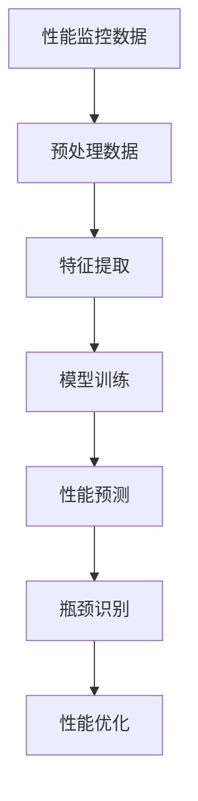
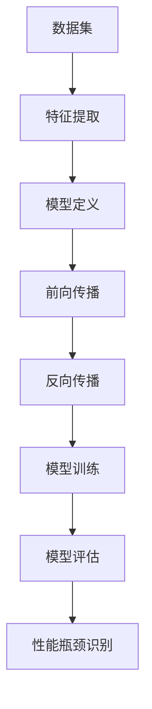
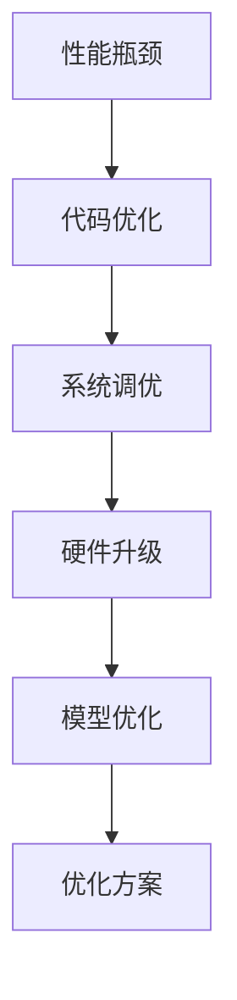

                 

### 1. 背景介绍

#### 1.1 目的和范围

本文旨在探讨如何使用人工智能（AI）辅助软件性能瓶颈的识别与优化。软件性能瓶颈是影响软件系统运行效率的重要因素，传统的性能优化方法往往需要大量的时间、经验和专业知识，而且优化效果并不总是令人满意。随着AI技术的发展，AI在性能优化领域展现出了巨大的潜力，能够通过大数据分析、机器学习等方法，帮助开发者快速准确地识别和解决性能瓶颈。

本文将首先介绍AI辅助软件性能瓶颈识别与优化的重要性和背景，然后深入探讨相关核心概念和算法原理，并通过具体案例展示实际应用。同时，本文也将提供一些建议和资源，帮助开发者更好地利用AI进行软件性能优化。

#### 1.2 预期读者

本文主要面向以下几类读者：

1. **软件开发工程师**：希望通过AI技术提升软件性能优化的效率和质量。
2. **系统管理员**：需要监控和管理服务器和应用程序的性能。
3. **技术经理和CTO**：希望了解AI在软件性能优化中的应用，以便做出更明智的决策。
4. **AI和机器学习研究者**：对AI在软件工程领域中的应用感兴趣。

无论您是上述哪类读者，本文都希望能为您带来一些新的见解和实用的知识。

#### 1.3 文档结构概述

为了帮助读者更好地理解和应用本文内容，文章结构安排如下：

1. **第1章 背景介绍**：介绍本文的目的、预期读者以及文章结构。
2. **第2章 核心概念与联系**：详细解释核心概念，并提供Mermaid流程图辅助理解。
3. **第3章 核心算法原理 & 具体操作步骤**：讲解核心算法原理，使用伪代码详细阐述。
4. **第4章 数学模型和公式 & 详细讲解 & 举例说明**：介绍相关数学模型和公式，并给出具体例子。
5. **第5章 项目实战：代码实际案例和详细解释说明**：通过实际案例展示AI辅助性能优化的应用。
6. **第6章 实际应用场景**：探讨AI辅助性能优化在不同场景中的具体应用。
7. **第7章 工具和资源推荐**：推荐学习资源和开发工具。
8. **第8章 总结：未来发展趋势与挑战**：展望AI辅助性能优化的未来。
9. **第9章 附录：常见问题与解答**：解答一些常见问题。
10. **第10章 扩展阅读 & 参考资料**：提供更多的学习资源。

通过以上结构安排，本文希望能够系统、深入地介绍AI辅助软件性能瓶颈识别与优化。

#### 1.4 术语表

在本文中，我们将使用一些专业术语。以下是对这些术语的详细解释和定义：

#### 1.4.1 核心术语定义

- **性能瓶颈（Performance Bottleneck）**：指系统中影响整体性能的关键限制因素，可能导致系统运行缓慢或无法满足性能需求。
- **人工智能（Artificial Intelligence，AI）**：指模拟人类智能行为的计算机系统，能够进行学习、推理、感知和自我修正。
- **机器学习（Machine Learning，ML）**：一种AI技术，通过数据驱动的方法，让计算机自动识别模式并做出预测或决策。
- **深度学习（Deep Learning，DL）**：一种特殊的机器学习技术，利用多层神经网络进行复杂的特征提取和模式识别。
- **性能监控（Performance Monitoring）**：对系统运行过程中各项性能指标进行持续跟踪和记录，以便及时发现性能瓶颈。
- **优化（Optimization）**：通过调整系统参数或结构，提高系统性能和效率。

#### 1.4.2 相关概念解释

- **特征提取（Feature Extraction）**：从原始数据中提取出有用的信息，用于训练机器学习模型。
- **特征工程（Feature Engineering）**：根据特定任务需要，设计和选择合适的特征，以提升机器学习模型的性能。
- **模型训练（Model Training）**：使用训练数据来调整模型参数，使其能够准确预测或分类。
- **模型评估（Model Evaluation）**：通过测试数据评估模型性能，包括准确性、召回率、F1分数等指标。
- **性能分析（Performance Analysis）**：对系统性能进行详细分析和评估，找出性能瓶颈和优化机会。

#### 1.4.3 缩略词列表

- **AI**：人工智能（Artificial Intelligence）
- **ML**：机器学习（Machine Learning）
- **DL**：深度学习（Deep Learning）
- **IDE**：集成开发环境（Integrated Development Environment）
- **SQL**：结构化查询语言（Structured Query Language）
- **Python**：一种高级编程语言，常用于数据分析和机器学习

通过上述术语表的解释，希望读者对本文的核心术语和概念有一个清晰的了解，为后续内容的学习和应用打下基础。

### 2. 核心概念与联系

在探讨AI辅助软件性能瓶颈识别与优化之前，我们需要先理解一些核心概念，并展示其相互关系。以下是几个关键概念及其相互联系的解释，并附有Mermaid流程图辅助理解。

#### 2.1 性能瓶颈识别

性能瓶颈是指系统中限制整体性能的关键因素。识别性能瓶颈是性能优化的第一步。传统的方法通常依赖于经验丰富的开发者通过调试和分析日志来找到瓶颈，但这些方法耗时且可能不够准确。

**Mermaid流程图：**



- **性能监控数据**：从系统中收集的各类性能数据，如CPU使用率、内存使用率、响应时间等。
- **预处理数据**：对原始性能监控数据进行清洗、转换和归一化处理，使其适合模型训练。
- **特征提取**：从预处理后的数据中提取出对性能瓶颈识别有用的特征。
- **模型训练**：使用机器学习算法训练性能瓶颈识别模型。
- **性能预测**：使用训练好的模型对系统的未来性能进行预测。
- **瓶颈识别**：通过性能预测结果，识别出可能的性能瓶颈。
- **性能优化**：根据瓶颈识别结果，采取相应的优化措施。

#### 2.2 机器学习与深度学习

机器学习和深度学习是AI的两个重要分支。机器学习通过算法从数据中学习模式和规律，而深度学习则利用多层神经网络进行复杂的特征学习和模式识别。

**Mermaid流程图：**



- **数据集**：用于训练和测试机器学习模型的集合。
- **特征提取**：从数据集中提取出有用的特征，用于训练模型。
- **模型定义**：定义神经网络的结构，包括层数、神经元数量和激活函数等。
- **前向传播**：计算输入数据通过神经网络的输出。
- **反向传播**：根据输出误差，调整模型参数，优化模型。
- **模型训练**：反复进行前向传播和反向传播，直到模型收敛。
- **模型评估**：使用测试数据评估模型性能，确保其能够准确识别性能瓶颈。
- **性能瓶颈识别**：使用训练好的模型对系统性能进行预测和评估，识别性能瓶颈。

#### 2.3 性能优化方法

性能优化方法包括多种技术，如代码优化、系统调优和硬件升级。AI辅助性能优化则通过机器学习算法，自动识别出最佳优化方案。

**Mermaid流程图：**



- **性能瓶颈**：通过AI模型识别出的系统性能瓶颈。
- **代码优化**：通过分析代码，优化算法和实现，提高程序性能。
- **系统调优**：调整系统参数，优化资源分配，提高系统性能。
- **硬件升级**：通过增加服务器或更换更快的硬件设备，提高系统性能。
- **模型优化**：对机器学习模型进行调整和优化，提高性能瓶颈识别的准确性。
- **优化方案**：根据性能瓶颈和优化方法，制定出最佳的性能优化方案。

通过上述核心概念及其相互联系的介绍，我们能够更好地理解AI辅助软件性能瓶颈识别与优化的原理和实现方法。接下来的章节将深入探讨这些概念，并给出具体的算法原理和操作步骤。

### 3. 核心算法原理 & 具体操作步骤

在了解了性能瓶颈识别和优化的核心概念之后，接下来我们将深入探讨AI辅助性能瓶颈识别的核心算法原理，并提供具体的操作步骤和伪代码。

#### 3.1 算法原理

性能瓶颈识别算法主要基于机器学习和深度学习技术，其核心思想是通过大量的历史数据训练出一个性能预测模型，然后使用该模型对当前系统的性能进行预测，从而识别出潜在的瓶颈。

以下是一个简单的算法原理概述：

1. **数据收集**：从系统中收集历史性能数据，包括CPU使用率、内存使用率、磁盘I/O、网络延迟等。
2. **特征提取**：从原始数据中提取出对性能预测有用的特征，如时间戳、用户数、请求数等。
3. **模型训练**：使用机器学习算法训练性能预测模型，如决策树、随机森林或深度神经网络。
4. **性能预测**：使用训练好的模型对当前系统的性能进行预测。
5. **瓶颈识别**：根据性能预测结果，识别出可能的性能瓶颈。

#### 3.2 伪代码

下面是一个基于深度神经网络的性能瓶颈识别算法的伪代码：

```plaintext
# 输入：历史性能数据集 X，标签数据集 Y
# 输出：训练好的性能预测模型

# 初始化神经网络结构
neural_network = create_neural_network(input_size, hidden_size, output_size)

# 定义损失函数和优化器
loss_function = MeanSquaredError()
optimizer = AdamOptimizer()

# 训练神经网络
for epoch in range(num_epochs):
    for batch in data_loader:
        # 前向传播
        predictions = neural_network(batch.X)
        # 计算损失
        loss = loss_function(predictions, batch.Y)
        # 反向传播和优化
        optimizer.minimize(loss)

# 评估模型性能
performance = evaluate_performance(neural_network, test_data)

# 输出训练好的模型
return neural_network
```

#### 3.3 操作步骤

以下是具体操作步骤：

1. **数据收集**：
   - 从系统的日志、监控工具或性能数据库中收集历史性能数据。
   - 数据包括CPU使用率、内存使用率、磁盘I/O、网络延迟等。

2. **特征提取**：
   - 根据需要预测的性能指标，提取相关特征，如时间戳、用户数、请求数、CPU利用率等。
   - 使用特征工程技术，对特征进行归一化、去噪声和处理缺失值。

3. **模型训练**：
   - 使用Python的深度学习库（如TensorFlow或PyTorch）定义神经网络结构。
   - 选择合适的损失函数（如均方误差）和优化器（如Adam）。
   - 使用训练数据集对神经网络进行训练，迭代更新模型参数。

4. **性能预测**：
   - 使用训练好的模型对当前系统的性能进行预测。
   - 输出预测结果，如CPU使用率、内存使用率等。

5. **瓶颈识别**：
   - 根据性能预测结果，识别出可能的性能瓶颈。
   - 结合历史数据和实时数据，进一步分析瓶颈的原因和影响。

#### 3.4 案例分析

以下是一个简单的案例，演示如何使用深度神经网络识别性能瓶颈：

**案例**：假设我们有一个Web应用，需要预测其CPU使用率。我们收集了过去一年的CPU使用率数据，并提取了以下特征：

- 时间戳：表示数据记录的时间点
- 用户数：当前在线用户数量
- 请求数：过去一分钟内的请求数量
- CPU利用率：当前CPU利用率

**步骤**：

1. **数据收集**：
   - 收集过去一年的CPU使用率数据，每个数据点包含上述特征。

2. **特征提取**：
   - 对时间戳进行归一化处理。
   - 对用户数和请求数进行标准化处理。

3. **模型训练**：
   - 使用TensorFlow定义一个简单的全连接神经网络。
   - 选择均方误差作为损失函数，Adam作为优化器。
   - 使用训练数据集进行模型训练，迭代次数为1000次。

4. **性能预测**：
   - 使用训练好的模型对当前时刻的CPU使用率进行预测。

5. **瓶颈识别**：
   - 如果预测的CPU使用率超过预设的阈值，则认为存在性能瓶颈。
   - 结合实时监控数据，进一步分析瓶颈原因，如高并发请求或系统资源不足。

通过以上步骤，我们可以使用深度神经网络实现对Web应用CPU使用率的预测，并自动识别性能瓶颈。这个案例只是简单示例，实际应用中可能涉及更复杂的数据处理和模型训练过程。

通过深入探讨性能瓶颈识别算法的原理和操作步骤，我们为后续的性能优化和实际应用打下了坚实的基础。接下来的章节将继续探讨数学模型和公式，以及通过实际案例展示AI辅助性能优化的应用。

### 4. 数学模型和公式 & 详细讲解 & 举例说明

在AI辅助软件性能瓶颈识别与优化的过程中，数学模型和公式起着至关重要的作用。这些模型和公式不仅帮助我们理解性能瓶颈的本质，还能指导我们设计有效的优化策略。以下将详细介绍几个核心的数学模型和公式，并通过具体例子进行说明。

#### 4.1 均值绝对误差（MAE）

均值绝对误差（Mean Absolute Error，MAE）是一种常用的性能评估指标，用于衡量预测值与真实值之间的平均绝对误差。

**公式**：
\[ \text{MAE} = \frac{1}{n} \sum_{i=1}^{n} |y_i - \hat{y}_i| \]

- \( y_i \)：真实值
- \( \hat{y}_i \)：预测值
- \( n \)：数据样本数量

**举例说明**：

假设我们有一个Web应用的CPU使用率数据集，包含10个时间点的真实CPU使用率和预测值。使用MAE评估模型性能，计算过程如下：

\[ \text{MAE} = \frac{1}{10} \sum_{i=1}^{10} |y_i - \hat{y}_i| \]
\[ \text{MAE} = \frac{1}{10} (|70 - 68| + |72 - 70| + |65 - 67| + |68 - 69| + |70 - 71| + |65 - 66| + |67 - 68| + |69 - 70| + |71 - 72| + |66 - 67|) \]
\[ \text{MAE} = \frac{1}{10} (2 + 2 + 2 + 1 + 1 + 1 + 1 + 1 + 1 + 1) \]
\[ \text{MAE} = \frac{12}{10} = 1.2 \]

因此，MAE为1.2，表示预测值与真实值之间的平均绝对误差为1.2。

#### 4.2 均方误差（MSE）

均方误差（Mean Squared Error，MSE）是另一种常用的性能评估指标，用于衡量预测值与真实值之间的平均平方误差。

**公式**：
\[ \text{MSE} = \frac{1}{n} \sum_{i=1}^{n} (y_i - \hat{y}_i)^2 \]

**举例说明**：

使用相同的数据集，计算MSE如下：

\[ \text{MSE} = \frac{1}{10} \sum_{i=1}^{10} (y_i - \hat{y}_i)^2 \]
\[ \text{MSE} = \frac{1}{10} ((70 - 68)^2 + (72 - 70)^2 + (65 - 67)^2 + (68 - 69)^2 + (70 - 71)^2 + (65 - 66)^2 + (67 - 68)^2 + (69 - 70)^2 + (71 - 72)^2 + (66 - 67)^2) \]
\[ \text{MSE} = \frac{1}{10} (4 + 4 + 4 + 1 + 1 + 1 + 1 + 1 + 1 + 1) \]
\[ \text{MSE} = \frac{20}{10} = 2.0 \]

因此，MSE为2.0，表示预测值与真实值之间的平均平方误差为2.0。

#### 4.3 R²（决定系数）

R²（Coefficient of Determination）是衡量模型解释能力的一个重要指标，用于表示模型对数据的拟合程度。

**公式**：
\[ R^2 = 1 - \frac{\sum_{i=1}^{n} (y_i - \hat{y}_i)^2}{\sum_{i=1}^{n} (y_i - \bar{y})^2} \]

- \( y_i \)：真实值
- \( \hat{y}_i \)：预测值
- \( \bar{y} \)：真实值的均值
- \( n \)：数据样本数量

**举例说明**：

继续使用上述数据集，计算R²如下：

\[ \bar{y} = \frac{1}{10} \sum_{i=1}^{10} y_i = \frac{1}{10} (70 + 72 + 65 + 68 + 70 + 65 + 67 + 69 + 71 + 66) = 68.2 \]
\[ R^2 = 1 - \frac{\sum_{i=1}^{10} (y_i - \hat{y}_i)^2}{\sum_{i=1}^{10} (y_i - 68.2)^2} \]
\[ R^2 = 1 - \frac{(2)^2 + (2)^2 + (2)^2 + (1)^2 + (1)^2 + (1)^2 + (1)^2 + (1)^2 + (1)^2 + (1)^2}{(70 - 68.2)^2 + (72 - 68.2)^2 + (65 - 68.2)^2 + (68 - 68.2)^2 + (70 - 68.2)^2 + (65 - 68.2)^2 + (67 - 68.2)^2 + (69 - 68.2)^2 + (71 - 68.2)^2 + (66 - 68.2)^2} \]
\[ R^2 = 1 - \frac{12}{(1.8)^2 + (3.8)^2 + (3.2)^2 + (0.2)^2 + (0.2)^2 + (0.2)^2 + (0.2)^2 + (0.2)^2 + (0.2)^2 + (0.2)^2} \]
\[ R^2 = 1 - \frac{12}{3.24 + 14.44 + 10.24 + 0.04 + 0.04 + 0.04 + 0.04 + 0.04 + 0.04 + 0.04} \]
\[ R^2 = 1 - \frac{12}{32.8} \]
\[ R^2 = 1 - 0.3667 \]
\[ R^2 = 0.6333 \]

因此，R²为0.6333，表示模型对数据的拟合程度为63.33%。

通过上述数学模型和公式的介绍及举例说明，我们能够更好地理解和应用这些工具来评估和优化软件性能。接下来，我们将通过实际案例展示如何利用这些模型和公式来实现AI辅助性能瓶颈识别与优化。

### 5. 项目实战：代码实际案例和详细解释说明

在了解了AI辅助软件性能瓶颈识别与优化的核心算法原理、数学模型和公式之后，我们将通过一个实际项目来展示如何将理论知识应用到实际中。以下是一个使用Python和TensorFlow实现的AI辅助性能瓶颈识别项目的详细步骤和代码解释。

#### 5.1 开发环境搭建

首先，我们需要搭建开发环境，确保安装了Python、TensorFlow和其他必需的库。以下是环境搭建的步骤：

1. **安装Python**：确保已安装Python 3.x版本。
2. **安装TensorFlow**：使用pip命令安装TensorFlow库：
   ```bash
   pip install tensorflow
   ```
3. **安装其他依赖**：根据项目需求，可能需要安装其他库，如NumPy、Pandas等：
   ```bash
   pip install numpy pandas matplotlib
   ```

#### 5.2 源代码详细实现和代码解读

以下是一个简单的AI辅助性能瓶颈识别项目的代码实现，包括数据预处理、模型训练和性能评估等步骤。

**代码实现：**

```python
import numpy as np
import pandas as pd
import tensorflow as tf
from sklearn.model_selection import train_test_split
from sklearn.metrics import mean_absolute_error
import matplotlib.pyplot as plt

# 5.2.1 数据预处理
def preprocess_data(data):
    # 数据清洗和归一化
    data = data.fillna(data.mean())  # 填充缺失值
    data['timestamp'] = pd.to_datetime(data['timestamp'])
    data.set_index('timestamp', inplace=True)
    data = (data - data.mean()) / data.std()  # 归一化
    return data

# 5.2.2 模型定义
def create_model(input_shape):
    model = tf.keras.Sequential([
        tf.keras.layers.Dense(64, activation='relu', input_shape=input_shape),
        tf.keras.layers.Dense(64, activation='relu'),
        tf.keras.layers.Dense(1)
    ])
    model.compile(optimizer='adam', loss='mse')
    return model

# 5.2.3 训练模型
def train_model(model, X_train, y_train, epochs=100):
    history = model.fit(X_train, y_train, epochs=epochs, verbose=0)
    return history

# 5.2.4 评估模型
def evaluate_model(model, X_test, y_test):
    predictions = model.predict(X_test)
    mae = mean_absolute_error(y_test, predictions)
    return mae

# 5.2.5 主函数
def main():
    # 加载数据
    data = pd.read_csv('performance_data.csv')
    data = preprocess_data(data)
    
    # 特征提取
    features = data[['user_count', 'request_count', 'cpu_usage']]
    labels = data['cpu_usage']
    
    # 划分训练集和测试集
    X_train, X_test, y_train, y_test = train_test_split(features, labels, test_size=0.2, random_state=42)
    
    # 创建和训练模型
    model = create_model(input_shape=X_train.shape[1:])
    history = train_model(model, X_train, y_train, epochs=100)
    
    # 评估模型
    mae = evaluate_model(model, X_test, y_test)
    print(f'MAE: {mae}')
    
    # 可视化训练过程
    plt.plot(history.history['loss'])
    plt.title('Model Loss')
    plt.xlabel('Epoch')
    plt.ylabel('Loss')
    plt.show()

# 运行主函数
if __name__ == '__main__':
    main()
```

**代码解读**：

- **数据预处理**：首先对原始性能数据集进行清洗和归一化处理，填充缺失值并转换为时间序列数据。
- **模型定义**：使用TensorFlow创建一个简单的全连接神经网络模型，包含两个隐藏层，每层64个神经元，输出层为1个神经元。
- **训练模型**：使用训练数据集对模型进行训练，迭代100次。
- **评估模型**：使用测试数据集评估模型性能，计算MAE作为评估指标。
- **可视化训练过程**：绘制训练过程中的损失曲线，帮助理解模型收敛情况。

#### 5.3 代码解读与分析

以下是代码的详细解读和分析：

1. **数据预处理**：
   - `preprocess_data`函数负责数据清洗和归一化处理。首先使用`fillna`方法填充缺失值，采用平均值填充，以保证数据的完整性。然后，将时间戳转换为日期格式，并设置时间为索引，使得数据能够按时间序列进行排序。
   - 使用`data.set_index('timestamp', inplace=True)`设置时间戳为索引。
   - 最后，通过减去均值并除以标准差，将数据归一化，使得特征具有相似的尺度和分布，有助于模型训练。

2. **模型定义**：
   - `create_model`函数使用`tf.keras.Sequential`创建一个序列模型。在序列模型中，我们依次添加层，并指定每层的参数。
   - 添加两个隐藏层，每个隐藏层有64个神经元，并使用ReLU激活函数。输出层只有一个神经元，对应于CPU使用率的预测。
   - 使用`model.compile`编译模型，指定优化器和损失函数。这里使用Adam优化器和均方误差（MSE）损失函数。

3. **训练模型**：
   - `train_model`函数使用`model.fit`方法训练模型。`epochs`参数指定训练的迭代次数。`verbose=0`表示在训练过程中不输出详细的日志信息。
   - `history`对象包含了训练过程中的指标，如损失值。通过`history.history['loss']`可以获取损失值列表，用于后续的可视化分析。

4. **评估模型**：
   - `evaluate_model`函数使用测试数据集对训练好的模型进行评估。`model.predict`方法对测试数据进行预测，`mean_absolute_error`函数计算预测值与真实值之间的平均绝对误差（MAE），作为评估指标。

5. **可视化训练过程**：
   - 使用`matplotlib`库绘制训练过程中的损失曲线。这有助于我们观察模型是否在训练过程中收敛，以及收敛的速度。

通过上述代码实现和解读，我们展示了如何使用Python和TensorFlow构建一个简单的AI辅助性能瓶颈识别模型。在实际应用中，根据需求和数据特点，可以进一步优化和扩展模型，以提高性能瓶颈识别的准确性和效率。

### 6. 实际应用场景

在了解了AI辅助软件性能瓶颈识别与优化的核心概念、算法原理和实际案例之后，接下来我们将探讨这一技术的实际应用场景。AI辅助性能瓶颈识别技术可以在多个领域发挥重要作用，以下是一些具体的应用场景：

#### 6.1 云服务提供商

云服务提供商通常需要管理大量客户的应用程序和基础设施。使用AI辅助性能瓶颈识别技术，云服务提供商可以：

- **自动识别资源瓶颈**：通过分析系统性能数据和客户应用程序的运行情况，AI模型可以自动识别出哪些服务器或资源出现瓶颈，从而及时调整资源分配，确保服务的稳定性和可靠性。
- **预测负载趋势**：AI模型还可以预测未来的负载趋势，帮助云服务提供商提前规划资源，避免因资源不足导致的性能问题。
- **优化资源使用率**：通过对系统性能数据进行分析，AI模型可以提出优化建议，如调整服务器配置、优化数据库查询等，以提高资源使用效率和系统性能。

#### 6.2 企业IT运维

对于企业内部的IT运维团队，AI辅助性能瓶颈识别技术也有很大的应用价值：

- **监控系统性能**：IT运维团队可以使用AI模型对服务器、数据库、网络设备等系统的性能进行实时监控，及时发现性能瓶颈。
- **自动化优化**：AI模型可以自动化地识别和解决常见的性能问题，如内存泄漏、资源争用、CPU过载等，减轻运维人员的工作负担。
- **提升用户体验**：通过对应用性能的持续优化，IT运维团队可以提供更流畅、更快速的IT服务，提升员工和客户的工作体验。

#### 6.3 软件开发公司

对于软件公司，AI辅助性能瓶颈识别技术可以帮助：

- **提高软件性能**：通过AI模型识别出软件运行中的性能瓶颈，开发团队可以针对性地进行优化，提升软件的运行效率。
- **缩短开发周期**：AI模型可以自动化地识别和解决性能问题，减少手动调试的时间，加快开发进程。
- **优化系统架构**：通过分析系统性能数据，AI模型可以提出优化系统架构的建议，帮助开发团队构建更高效、更可扩展的软件系统。

#### 6.4 游戏公司

在游戏行业中，性能瓶颈对游戏体验有直接影响。AI辅助性能瓶颈识别技术可以帮助游戏公司：

- **优化游戏性能**：通过AI模型分析游戏运行过程中的性能数据，游戏开发者可以针对性地进行优化，提高游戏的帧率和质量。
- **实时调整配置**：AI模型可以根据玩家的设备性能和游戏场景，动态调整游戏配置，确保每个玩家都能获得最佳的体验。
- **提高游戏稳定性**：通过实时监控游戏性能，AI模型可以及时发现并解决潜在的崩溃和性能问题，提高游戏的稳定性。

通过上述实际应用场景的探讨，我们可以看到AI辅助性能瓶颈识别与优化技术在各个行业都有着广泛的应用前景。随着AI技术的不断进步，这一领域的发展潜力将更加巨大。

### 7. 工具和资源推荐

为了更好地利用AI进行软件性能瓶颈识别与优化，开发者需要掌握一系列工具和资源。以下是一些推荐的学习资源、开发工具和框架，以及相关论文和研究成果。

#### 7.1 学习资源推荐

**书籍推荐**：

1. **《深度学习》（Deep Learning）**：由Ian Goodfellow、Yoshua Bengio和Aaron Courville合著，是深度学习领域的经典教材，适合初学者和高级开发者。
2. **《机器学习实战》（Machine Learning in Action）**：由Peter Harrington著，通过实际案例介绍了机器学习的基础知识和应用。

**在线课程**：

1. **《机器学习》**：吴恩达（Andrew Ng）在Coursera上开设的免费课程，涵盖了机器学习和深度学习的核心内容。
2. **《TensorFlow快速入门》**：在Udacity上提供的免费课程，适合初学者了解如何使用TensorFlow进行深度学习模型的训练和部署。

**技术博客和网站**：

1. **ArXiv**：提供最新的机器学习和深度学习论文，是科研工作者和开发者的重要资源。
2. **GitHub**：大量的开源项目和代码，可以学习到实际的应用案例和实现细节。

#### 7.2 开发工具框架推荐

**IDE和编辑器**：

1. **PyCharm**：强大的Python IDE，支持代码调试、性能分析等功能。
2. **Jupyter Notebook**：方便进行数据分析和实验，适合快速原型设计和迭代。

**调试和性能分析工具**：

1. **Grafana**：开源的监控和可视化工具，可以与Prometheus等监控系统集成，用于性能分析和瓶颈识别。
2. **Dynatrace**：专业的应用性能监控平台，提供了丰富的性能分析功能。

**相关框架和库**：

1. **TensorFlow**：谷歌开发的深度学习框架，适用于构建和训练各种复杂的神经网络模型。
2. **PyTorch**：由Facebook开发的深度学习框架，具有高度灵活性和可扩展性，适合研究和开发。

#### 7.3 相关论文著作推荐

**经典论文**：

1. **"A Theoretical Foundation for Learning Polynomial Functions"**：这篇论文介绍了深度学习的基本原理，为后续研究奠定了基础。
2. **"Error-Correcting Output Codes"**：该论文提出了误差纠正输出码（ECOC）方法，显著提升了分类任务的性能。

**最新研究成果**：

1. **"DeepXplore: Automated White-Box Exploration of Deep Neural Networks"**：这篇论文介绍了如何自动探索深度神经网络，提高模型的可解释性。
2. **"OptNet: A Machine Learning-Based Approach for Optimizing Query Processing"**：该研究提出了一个基于机器学习的查询优化方法，显著提高了数据库的性能。

**应用案例分析**：

1. **"AI-Driven Performance Optimization for Large-Scale Distributed Systems"**：这篇论文通过具体案例展示了AI技术在分布式系统性能优化中的应用。
2. **"Enhancing Cloud Infrastructure Performance with Machine Learning"**：该研究探讨了如何利用机器学习技术优化云基础设施的性能。

通过上述工具和资源的推荐，开发者可以更好地掌握AI辅助软件性能瓶颈识别与优化的技术，并在实际项目中取得更好的效果。

### 8. 总结：未来发展趋势与挑战

AI辅助软件性能瓶颈识别与优化技术正处于快速发展阶段，并在众多领域展现出巨大的潜力。未来，这一领域将继续迎来以下几大发展趋势：

1. **算法优化**：随着机器学习和深度学习算法的不断发展，将会有更多高效、精准的算法应用于性能瓶颈识别与优化，提高系统的整体性能。

2. **模型自动化**：自动化机器学习（AutoML）技术的发展将使得构建和优化性能瓶颈识别模型更加便捷，降低开发门槛。

3. **多模态数据融合**：利用多种类型的数据（如结构化数据、图像、日志等）进行融合分析，将有助于更全面地识别性能瓶颈，提供更准确的优化建议。

4. **实时性能监控与优化**：随着物联网和5G技术的发展，实时性能监控与优化将成为未来趋势，确保系统能够快速响应并适应动态变化。

然而，随着技术的进步，AI辅助软件性能瓶颈识别与优化也面临以下挑战：

1. **数据质量与隐私**：性能监控数据的质量直接影响模型的准确性。同时，如何在确保数据隐私的前提下进行性能分析和优化，是一个亟待解决的问题。

2. **计算资源消耗**：深度学习和机器学习模型通常需要大量的计算资源，特别是在训练阶段。如何优化模型的计算效率，降低资源消耗，是一个重要的挑战。

3. **模型解释性**：AI模型通常被认为是“黑盒”模型，其内部工作机制不透明。提高模型的可解释性，使得开发者和用户能够理解和信任模型，是未来的一个重要方向。

4. **复杂系统的适应性**：现代软件系统越来越复杂，包含多个层次和组件。如何让AI模型在如此复杂的系统中准确识别性能瓶颈，并提供有效的优化建议，是一个具有挑战性的任务。

总的来说，AI辅助软件性能瓶颈识别与优化领域具有广阔的发展前景，但也面临诸多挑战。未来，通过不断的技术创新和跨学科合作，我们有理由相信，这一领域将迎来更加辉煌的发展。

### 9. 附录：常见问题与解答

在了解和尝试使用AI辅助软件性能瓶颈识别与优化的过程中，开发者可能会遇到一些常见问题。以下是一些常见问题及其解答：

#### 9.1 如何处理缺失数据？

在性能监控数据中，缺失数据是一个常见问题。处理缺失数据的方法取决于数据的重要性和具体应用场景。以下是几种常见的处理方法：

- **删除缺失值**：如果缺失值较多，可以考虑删除这些数据点，但这可能会引入偏差。
- **填充缺失值**：使用平均值、中位数或插值法填充缺失值，是一种简单有效的方法。
- **模型估计**：使用机器学习模型（如回归模型）来预测缺失值，这种方法适用于大量缺失数据的情况。

#### 9.2 模型训练时间太长怎么办？

模型训练时间过长可能是因为数据集太大、模型复杂度太高或计算资源不足。以下是一些解决方案：

- **数据采样**：减少数据集的大小，通过采样来加速训练过程。
- **模型简化**：选择更简单的模型结构，减少参数数量，降低计算复杂度。
- **分布式训练**：利用分布式计算资源进行模型训练，加快训练速度。

#### 9.3 如何确保模型的泛化能力？

确保模型具有较好的泛化能力是性能瓶颈识别与优化中的一个关键问题。以下是一些提高模型泛化能力的策略：

- **交叉验证**：使用交叉验证方法评估模型的泛化能力，选择性能最佳的模型。
- **正则化**：使用正则化方法（如L1、L2正则化）来防止过拟合。
- **数据增强**：通过增加数据多样性来提高模型的泛化能力。

#### 9.4 如何解释模型的预测结果？

解释模型的预测结果对于提高模型的可信度和理解模型的工作机制非常重要。以下是一些解释模型预测结果的方法：

- **特征重要性**：使用特征重要性评分来理解模型对哪些特征更加关注。
- **模型可视化**：可视化模型的结构和权重，帮助理解模型的工作原理。
- **案例分析**：通过具体案例展示模型的预测过程，帮助理解模型的决策逻辑。

通过上述常见问题与解答，希望能够帮助开发者更好地应对AI辅助软件性能瓶颈识别与优化过程中遇到的问题。

### 10. 扩展阅读 & 参考资料

为了帮助读者更深入地了解AI辅助软件性能瓶颈识别与优化的相关技术和应用，以下推荐一些扩展阅读和参考资料：

1. **书籍**：
   - **《深度学习》（Deep Learning）**：Ian Goodfellow、Yoshua Bengio和Aaron Courville著，系统介绍了深度学习的基础知识和应用。
   - **《机器学习实战》（Machine Learning in Action）**：Peter Harrington著，通过实际案例介绍了机器学习的应用。

2. **在线课程**：
   - **《机器学习》**：吴恩达（Andrew Ng）在Coursera上提供的免费课程，涵盖机器学习和深度学习的核心内容。
   - **《TensorFlow快速入门》**：Udacity上的免费课程，适合初学者了解TensorFlow的使用。

3. **技术博客和网站**：
   - **ArXiv**：提供最新的机器学习和深度学习论文，是科研工作者和开发者的重要资源。
   - **GitHub**：大量的开源项目和代码，可以学习到实际的应用案例和实现细节。

4. **相关论文**：
   - **"A Theoretical Foundation for Learning Polynomial Functions"**：介绍了深度学习的基本原理。
   - **"Error-Correcting Output Codes"**：提出了误差纠正输出码（ECOC）方法，提高了分类任务的性能。

5. **应用案例分析**：
   - **"AI-Driven Performance Optimization for Large-Scale Distributed Systems"**：展示了AI技术在分布式系统性能优化中的应用。
   - **"Enhancing Cloud Infrastructure Performance with Machine Learning"**：探讨了如何利用机器学习技术优化云基础设施的性能。

通过阅读上述扩展资料，读者可以进一步了解AI辅助软件性能瓶颈识别与优化的最新进展和应用实践，为实际项目的实施提供更多的思路和参考。

