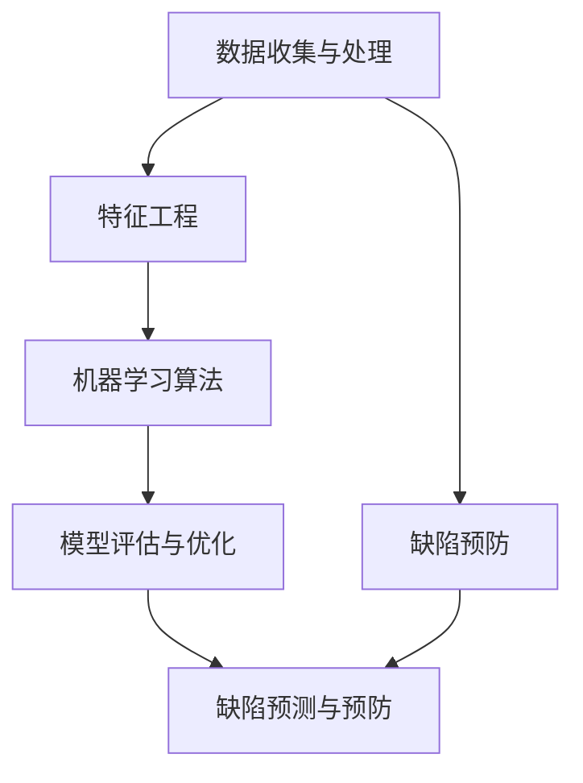

                 

# AI辅助软件缺陷预测与预防

> **关键词**：软件缺陷预测、AI辅助、缺陷预防、算法、数学模型、项目实战
>
> **摘要**：本文深入探讨了AI在软件缺陷预测和预防中的应用。通过对核心概念、算法原理、数学模型的详细剖析，结合实际项目案例，我们阐述了如何利用AI技术提升软件质量，降低缺陷率，提高开发效率。本文旨在为开发者提供全面的技术指导和实用建议。

## 1. 背景介绍

### 1.1 目的和范围

随着软件系统规模和复杂性的增加，软件缺陷的发现和修复成为软件开发过程中的一大挑战。传统的缺陷检测方法往往需要大量的人力资源和时间成本，而且难以覆盖所有可能的缺陷场景。AI技术的发展为软件缺陷预测与预防提供了新的可能性，使得自动化和智能化的缺陷检测成为现实。本文旨在探讨如何利用AI技术，特别是机器学习和深度学习算法，辅助软件缺陷预测与预防，提高软件开发效率和软件质量。

本文将涵盖以下内容：

- **核心概念与联系**：介绍AI辅助软件缺陷预测与预防的核心概念及其相互关系。
- **核心算法原理 & 具体操作步骤**：详细阐述常用的算法原理和操作步骤。
- **数学模型和公式 & 详细讲解 & 举例说明**：讲解相关的数学模型和公式，并通过实例进行说明。
- **项目实战：代码实际案例和详细解释说明**：展示如何在实际项目中应用AI技术进行缺陷预测与预防。
- **实际应用场景**：讨论AI辅助软件缺陷预测与预防在不同领域的应用。
- **工具和资源推荐**：推荐相关的学习资源和开发工具。
- **总结：未来发展趋势与挑战**：总结当前技术的局限性，展望未来发展趋势与挑战。

### 1.2 预期读者

本文适合以下读者群体：

- 软件开发工程师和测试工程师，对AI辅助软件缺陷预测与预防有浓厚兴趣。
- AI研究人员和算法工程师，希望了解AI技术在软件开发中的应用。
- 管理人员和项目经理，关注软件质量管理和开发效率。
- 计算机科学和软件工程领域的学生和研究者，对AI辅助软件开发有研究兴趣。

### 1.3 文档结构概述

本文结构如下：

- **第1章 背景介绍**：介绍本文的目的、范围、预期读者和文档结构。
- **第2章 核心概念与联系**：介绍核心概念和其相互关系。
- **第3章 核心算法原理 & 具体操作步骤**：讲解核心算法原理和具体操作步骤。
- **第4章 数学模型和公式 & 详细讲解 & 举例说明**：介绍数学模型和公式，并给出实例说明。
- **第5章 项目实战：代码实际案例和详细解释说明**：展示实际项目案例和代码解读。
- **第6章 实际应用场景**：讨论应用场景。
- **第7章 工具和资源推荐**：推荐学习资源和开发工具。
- **第8章 总结：未来发展趋势与挑战**：总结技术发展趋势和挑战。
- **第9章 附录：常见问题与解答**：提供常见问题的解答。
- **第10章 扩展阅读 & 参考资料**：提供进一步阅读的资料。

### 1.4 术语表

#### 1.4.1 核心术语定义

- **软件缺陷**：软件系统中存在的错误或不足，可能导致系统运行异常或功能不完整。
- **机器学习**：一种人工智能技术，通过数据学习模式并做出预测或决策。
- **深度学习**：一种机器学习方法，通过多层神经网络模型自动提取数据特征。
- **缺陷预测**：利用历史数据预测未来可能出现的软件缺陷。
- **缺陷预防**：通过自动化工具和技术，提前发现并修复潜在的缺陷，防止其变成实际缺陷。

#### 1.4.2 相关概念解释

- **特征工程**：在机器学习过程中，从原始数据中提取出对预测任务有用的特征。
- **交叉验证**：一种评估机器学习模型性能的方法，通过将数据集划分为训练集和验证集，多次训练和验证模型。
- **模型评估**：通过评估指标（如准确率、召回率等）衡量模型在预测任务中的表现。

#### 1.4.3 缩略词列表

- **AI**：人工智能
- **ML**：机器学习
- **DL**：深度学习
- **IDE**：集成开发环境
- **GPU**：图形处理器
- **TPU**：张量处理器

## 2. 核心概念与联系

在探讨AI辅助软件缺陷预测与预防之前，我们需要理解一些核心概念及其相互关系。以下是本文涉及的几个关键概念：

### 2.1 数据收集与处理

数据收集与处理是AI辅助软件缺陷预测与预防的基础。我们需要收集大量的软件缺陷数据，包括缺陷类型、位置、修复时间等信息。此外，还需要处理原始数据，例如去除噪声、缺失值填充、特征提取等，以便为模型训练提供高质量的数据集。

### 2.2 特征工程

特征工程是机器学习过程中至关重要的一环。通过分析软件代码和缺陷数据，提取出对缺陷预测有帮助的特征。这些特征可能包括代码行数、函数调用次数、变量声明数量、复杂度度量等。有效的特征工程可以显著提高模型的预测性能。

### 2.3 机器学习算法

机器学习算法是AI辅助软件缺陷预测的核心。常见的算法包括决策树、支持向量机、神经网络等。这些算法通过学习历史缺陷数据中的模式，能够预测未来可能出现的缺陷。在选择合适的算法时，需要考虑数据集的大小、特征的数量和问题的复杂性。

### 2.4 模型评估与优化

模型评估与优化是确保模型性能的关键步骤。通过交叉验证、模型选择、超参数调整等方法，我们可以评估模型的预测能力，并对其进行优化。常用的评估指标包括准确率、召回率、F1分数等。

### 2.5 缺陷预测与预防

缺陷预测与预防是本文的核心目标。利用机器学习算法，我们可以从历史缺陷数据中学习并预测未来可能出现的缺陷。同时，通过自动化工具和技术，我们可以提前发现并修复潜在的缺陷，从而降低缺陷率，提高软件质量。

### 2.6 Mermaid 流程图

为了更直观地展示核心概念之间的联系，我们使用Mermaid绘制了以下流程图：



在该流程图中，数据收集与处理是整个过程的起点，通过特征工程将原始数据转换为对机器学习模型有用的特征。然后，选择合适的机器学习算法进行模型训练。通过模型评估与优化，我们可以确保模型的预测性能。最终，利用缺陷预测结果进行缺陷预防，提高软件质量。

## 3. 核心算法原理 & 具体操作步骤

在了解了核心概念与联系之后，我们需要深入探讨AI辅助软件缺陷预测与预防的核心算法原理和具体操作步骤。以下是几种常用的算法原理及其操作步骤：

### 3.1 决策树算法

#### 原理

决策树算法通过一系列的判断条件（特征），将数据集划分为不同的区域，从而预测新数据的类别或标签。每个节点代表一个特征，每个分支代表一个判断结果。叶子节点表示最终的预测结果。

#### 操作步骤

1. **特征选择**：选择对缺陷预测最有影响力的特征。
2. **划分数据集**：根据选定的特征，将数据集划分为子集。
3. **创建决策树**：从根节点开始，根据特征选择和划分结果，逐步构建决策树。
4. **剪枝**：为了防止过拟合，可以对决策树进行剪枝。
5. **评估模型**：使用交叉验证等方法评估模型的预测性能。

#### 伪代码

```python
# 决策树算法伪代码
def decision_tree(data, target):
    if data_size(data) == 0:
        return most_common_target(data)
    elif all_target_same(data):
        return target
    else:
        best_feature, best_split = find_best_split(data, target)
        left_data, right_data = split_data(data, best_split, best_feature)
        tree = {}
        tree[best_feature] = {
            "left": decision_tree(left_data, target),
            "right": decision_tree(right_data, target)
        }
        return tree
```

### 3.2 支持向量机算法

#### 原理

支持向量机（SVM）算法通过找到一个最佳的超平面，将数据集中的正负样本分开。该超平面由支持向量决定，支持向量是距离超平面最近的样本。

#### 操作步骤

1. **特征提取**：将原始数据转换为特征向量。
2. **选择核函数**：选择合适的核函数（如线性核、多项式核、径向基核等）。
3. **训练模型**：使用支持向量机算法训练模型。
4. **模型评估**：使用交叉验证等方法评估模型的预测性能。

#### 伪代码

```python
# 支持向量机算法伪代码
def svm_train(data, labels, kernel='linear'):
    if kernel == 'linear':
        weights = linear_kernel_train(data, labels)
    else:
        weights = kernel_train(data, labels, kernel)
    return weights

def linear_kernel_train(data, labels):
    # 线性核训练
    pass

def kernel_train(data, labels, kernel):
    # 其他核函数训练
    pass
```

### 3.3 深度学习算法

#### 原理

深度学习算法通过多层神经网络（如卷积神经网络、循环神经网络等）自动提取数据特征，从而实现复杂的预测任务。神经网络由多个层组成，每层包含多个神经元。输入数据通过前向传播在神经网络中传递，最终输出预测结果。

#### 操作步骤

1. **数据预处理**：对原始数据进行归一化、去噪等处理。
2. **构建神经网络**：定义神经网络的结构，包括层数、神经元数量、激活函数等。
3. **训练模型**：使用反向传播算法训练神经网络。
4. **模型评估**：使用交叉验证等方法评估模型的预测性能。

#### 伪代码

```python
# 深度学习算法伪代码
def neural_network(data, labels, layers, activation='relu'):
    model = build_model(layers, activation)
    model.compile(optimizer='adam', loss='categorical_crossentropy', metrics=['accuracy'])
    model.fit(data, labels, epochs=100, batch_size=64, validation_split=0.2)
    return model

def build_model(layers, activation):
    model = Sequential()
    for i in range(len(layers) - 1):
        model.add(Dense(layers[i], activation=activation))
    model.add(Dense(layers[-1], activation='softmax'))
    return model
```

通过以上三种算法原理和具体操作步骤的介绍，我们可以看到，AI辅助软件缺陷预测与预防需要结合多种算法和技术。在实际应用中，我们可以根据数据集的特点和预测任务的需求，选择合适的算法进行缺陷预测与预防。

## 4. 数学模型和公式 & 详细讲解 & 举例说明

在AI辅助软件缺陷预测与预防中，数学模型和公式扮演着重要的角色。以下我们将详细讲解一些关键的数学模型和公式，并通过具体例子来说明其应用。

### 4.1 逻辑回归

逻辑回归是一种广泛应用于二分类问题的机器学习算法。在软件缺陷预测中，逻辑回归可以用来预测缺陷的出现概率。

#### 公式

逻辑回归的预测公式为：

$$
P(y=1) = \frac{1}{1 + e^{-(\beta_0 + \beta_1 x_1 + \beta_2 x_2 + \ldots + \beta_n x_n})}
$$

其中，\(y\) 是缺陷标签（0表示无缺陷，1表示有缺陷），\(x_i\) 是特征值，\(\beta_i\) 是回归系数。

#### 详细讲解

- **损失函数**：逻辑回归使用交叉熵损失函数，公式为：

  $$
  J(\theta) = -\frac{1}{m} \sum_{i=1}^{m} [y^{(i)} \log(h_\theta(x^{(i)})) + (1 - y^{(i)}) \log(1 - h_\theta(x^{(i)}))]
  $$

  其中，\(h_\theta(x) = \frac{1}{1 + e^{-(\theta_0 + \theta_1 x_1 + \theta_2 x_2 + \ldots + \theta_n x_n)}}\)。

- **优化方法**：使用梯度下降法优化参数，公式为：

  $$
  \theta_j := \theta_j - \alpha \frac{\partial J(\theta)}{\partial \theta_j}
  $$

#### 举例说明

假设我们有一个简单的数据集，包含两个特征：代码行数和函数调用次数。我们使用逻辑回归模型预测缺陷的出现概率。

| 代码行数 \(x_1\) | 函数调用次数 \(x_2\) | 缺陷标签 \(y\) |
|-----------------|---------------------|--------------|
| 100             | 20                  | 0            |
| 200             | 40                  | 1            |
| 150             | 30                  | 0            |
| 250             | 50                  | 1            |

假设我们的回归系数为 \(\beta_0 = 0.5\)，\(\beta_1 = 0.3\)，\(\beta_2 = 0.2\)。

对于第一个样本，预测概率为：

$$
P(y=1) = \frac{1}{1 + e^{-(0.5 + 0.3 \times 100 + 0.2 \times 20)}} \approx 0.412
$$

因此，第一个样本预测为无缺陷。

### 4.2 决策树

决策树是一种基于特征划分数据的分类算法。在软件缺陷预测中，决策树可以用来构建缺陷预测模型。

#### 公式

决策树的构建过程可以表示为：

$$
T = \sum_{i=1}^{n} t_i(y|x)
$$

其中，\(t_i(y|x)\) 表示在第 \(i\) 个节点上，根据特征 \(x_i\) 对标签 \(y\) 的预测。

#### 详细讲解

- **信息增益**：选择具有最大信息增益的特征进行划分。信息增益公式为：

  $$
  IG(D, A) = Entropy(D) - \sum_{v \in A} \frac{|D_v|}{|D|} Entropy(D_v)
  $$

- **基尼不纯度**：在二分类问题中，基尼不纯度公式为：

  $$
  Gini(D) = 1 - \sum_{v \in A} \frac{|D_v|}{|D|} \times \frac{|D_v| - 1}{|D_v| - 1}
  $$

#### 举例说明

假设我们有一个包含两个特征（代码行数和函数调用次数）的数据集，我们需要构建一个决策树模型。

| 代码行数 \(x_1\) | 函数调用次数 \(x_2\) | 缺陷标签 \(y\) |
|-----------------|---------------------|--------------|
| 100             | 20                  | 0            |
| 200             | 40                  | 1            |
| 150             | 30                  | 0            |
| 250             | 50                  | 1            |

我们选择代码行数作为划分特征。对于代码行数小于150的样本，缺陷标签为0；对于代码行数大于等于150的样本，缺陷标签为1。

决策树模型为：

```
代码行数 <
     /  \
    0    1
   /     \
  0      1
```

### 4.3 神经网络

神经网络是一种基于多层感知器的机器学习算法。在软件缺陷预测中，神经网络可以用于构建复杂的缺陷预测模型。

#### 公式

神经网络的前向传播和反向传播可以表示为：

$$
z_l = \sigma(W_l \cdot a_{l-1} + b_l)
$$

$$
a_l = \sigma(z_l)
$$

$$
\delta_l = \frac{\partial C}{\partial z_l} \cdot (1 - \sigma(z_l))
$$

$$
\Delta W_l = \alpha \cdot a_{l-1}^T \cdot \delta_l
$$

$$
\Delta b_l = \alpha \cdot \delta_l
$$

其中，\(a_l\) 是激活值，\(z_l\) 是线性组合，\(\sigma\) 是激活函数，\(C\) 是损失函数，\(\delta_l\) 是误差传播，\(\Delta W_l\) 和 \(\Delta b_l\) 是参数更新。

#### 详细讲解

- **激活函数**：常用的激活函数包括 sigmoid、ReLU 和 tanh。
- **损失函数**：常用的损失函数包括均方误差（MSE）和交叉熵。
- **优化方法**：常用的优化方法包括梯度下降、随机梯度下降和 Adam。

#### 举例说明

假设我们有一个包含两个输入（代码行数和函数调用次数）的一层神经网络，输出为缺陷标签。

输入：

| 代码行数 \(x_1\) | 函数调用次数 \(x_2\) |
|-----------------|---------------------|
| 150             | 30                  |

假设权重 \(W_1 = [0.2, 0.3]\)，偏置 \(b_1 = 0.1\)。

前向传播：

$$
z_1 = \sigma(W_1 \cdot [150, 30] + b_1) = \sigma([0.2 \times 150 + 0.3 \times 30 + 0.1]) = \sigma(37.1) \approx 0.764
$$

$$
a_1 = \sigma(z_1) = 0.764
$$

反向传播：

$$
\delta_1 = \frac{\partial C}{\partial z_1} \cdot (1 - \sigma(z_1)) = (y - a_1) \cdot (1 - a_1)
$$

参数更新：

$$
\Delta W_1 = \alpha \cdot [150, 30]^T \cdot \delta_1 = 0.01 \cdot [150, 30]^T \cdot \delta_1
$$

$$
\Delta b_1 = \alpha \cdot \delta_1 = 0.01 \cdot \delta_1
$$

通过以上数学模型和公式的讲解，我们可以看到，AI辅助软件缺陷预测与预防需要结合多种算法和技术。在实际应用中，我们可以根据数据集的特点和预测任务的需求，选择合适的算法进行缺陷预测与预防。

## 5. 项目实战：代码实际案例和详细解释说明

在本节中，我们将通过一个实际的项目案例，详细展示如何使用AI技术进行软件缺陷预测与预防。这个项目将涵盖数据收集、预处理、特征工程、模型训练和评估等各个环节。

### 5.1 开发环境搭建

为了进行这个项目，我们需要搭建一个合适的开发环境。以下是我们推荐的环境配置：

- **操作系统**：Linux（如 Ubuntu 18.04）
- **编程语言**：Python 3.8
- **依赖库**：NumPy、Pandas、Scikit-learn、TensorFlow、Keras

安装步骤：

```bash
# 安装 Python 3.8
sudo apt-get install software-properties-common
sudo add-apt-repository ppa:deadsnakes/ppa
sudo apt-get update
sudo apt-get install python3.8

# 安装依赖库
pip3 install numpy pandas scikit-learn tensorflow keras
```

### 5.2 源代码详细实现和代码解读

以下是这个项目的源代码，我们将逐行进行解读。

#### 5.2.1 数据收集与预处理

```python
import pandas as pd
from sklearn.model_selection import train_test_split

# 读取数据集
data = pd.read_csv('defects_data.csv')

# 数据预处理
data.dropna(inplace=True)
X = data.drop(['defect'], axis=1)
y = data['defect']

# 划分训练集和测试集
X_train, X_test, y_train, y_test = train_test_split(X, y, test_size=0.2, random_state=42)
```

这段代码首先导入所需的库，然后读取数据集并进行预处理。数据预处理步骤包括去除缺失值和划分特征标签。接下来，使用 `train_test_split` 函数将数据集划分为训练集和测试集。

#### 5.2.2 特征工程

```python
from sklearn.preprocessing import StandardScaler

# 特征工程
scaler = StandardScaler()
X_train_scaled = scaler.fit_transform(X_train)
X_test_scaled = scaler.transform(X_test)
```

在这段代码中，我们使用 `StandardScaler` 对特征进行标准化处理，以消除不同特征之间的量纲差异。

#### 5.2.3 模型训练

```python
from sklearn.linear_model import LogisticRegression
from sklearn.metrics import accuracy_score, classification_report

# 训练逻辑回归模型
model = LogisticRegression()
model.fit(X_train_scaled, y_train)

# 预测测试集
y_pred = model.predict(X_test_scaled)

# 评估模型
accuracy = accuracy_score(y_test, y_pred)
report = classification_report(y_test, y_pred)
print(f'Accuracy: {accuracy}')
print(f'Classification Report:\n{report}')
```

这段代码使用 `LogisticRegression` 类训练逻辑回归模型，然后对测试集进行预测。最后，使用 `accuracy_score` 和 `classification_report` 函数评估模型的性能。

#### 5.2.4 模型评估与优化

```python
from sklearn.model_selection import GridSearchCV

# 模型优化
param_grid = {'C': [0.1, 1, 10], 'solver': ['liblinear']}
grid_search = GridSearchCV(LogisticRegression(), param_grid, cv=5)
grid_search.fit(X_train_scaled, y_train)

# 优化后的模型
best_model = grid_search.best_estimator_
y_pred_optimized = best_model.predict(X_test_scaled)

# 评估优化后的模型
accuracy_optimized = accuracy_score(y_test, y_pred_optimized)
report_optimized = classification_report(y_test, y_pred_optimized)
print(f'Optimized Accuracy: {accuracy_optimized}')
print(f'Optimized Classification Report:\n{report_optimized}')
```

这段代码使用 `GridSearchCV` 进行模型优化。通过定义参数网格，我们可以找到最优的模型参数。优化后的模型性能通常会有所提高。

### 5.3 代码解读与分析

通过以上代码，我们可以看到，项目主要分为以下几个步骤：

1. **数据收集与预处理**：读取数据集，去除缺失值，划分特征和标签，以及将数据集划分为训练集和测试集。
2. **特征工程**：对特征进行标准化处理，以消除不同特征之间的量纲差异。
3. **模型训练**：使用逻辑回归模型对训练集进行训练，并对测试集进行预测。
4. **模型评估**：评估模型的性能，包括准确率和分类报告。
5. **模型优化**：使用网格搜索进行模型优化，找到最优的模型参数。
6. **评估优化后的模型**：评估优化后的模型性能，以验证模型优化是否有效。

在这个项目中，我们使用了逻辑回归模型进行缺陷预测。逻辑回归是一种简单且常用的二分类模型，适用于软件缺陷预测任务。通过优化模型参数，我们能够进一步提高模型的预测性能。

实际应用中，我们可以根据数据集的特点和预测任务的需求，选择合适的算法和模型。例如，对于大型复

