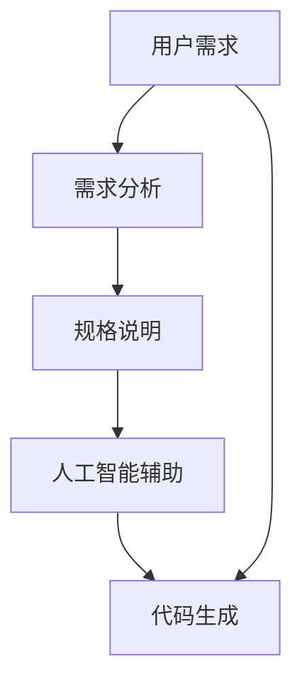

                 

# AI辅助软件需求分析与规格说明

> **关键词：** AI辅助、软件需求分析、规格说明、需求文档、算法原理、数学模型、实战案例、应用场景、工具推荐

> **摘要：** 本文旨在探讨如何利用人工智能技术辅助软件需求分析与规格说明的编写。通过逐步分析核心概念、算法原理、数学模型和实战案例，本文将帮助读者深入了解AI辅助软件需求分析与规格说明的实践方法，并为实际项目提供有价值的参考。

## 1. 背景介绍

### 1.1 目的和范围

本文的主要目的是探讨如何利用人工智能（AI）技术辅助软件需求分析与规格说明的编写过程。在当前快速发展的科技时代，软件项目的需求不断变化，规格说明文档的编写工作量大且复杂。通过引入AI技术，可以提高需求分析与规格说明的准确性和效率，降低项目开发风险。

本文将涵盖以下内容：

1. 核心概念与联系
2. 核心算法原理与具体操作步骤
3. 数学模型与公式
4. 项目实战：代码实际案例与详细解释
5. 实际应用场景
6. 工具和资源推荐
7. 总结：未来发展趋势与挑战
8. 附录：常见问题与解答
9. 扩展阅读与参考资料

### 1.2 预期读者

本文适合以下读者：

1. 软件工程师与需求分析师
2. 项目经理与产品经理
3. 对AI辅助软件需求分析与规格说明感兴趣的科研人员与爱好者
4. 计算机科学、软件工程等相关专业的大学生们

### 1.3 文档结构概述

本文采用以下结构：

1. 引言：介绍背景、目的和读者对象
2. 核心概念与联系：阐述关键概念与相关技术
3. 核心算法原理与具体操作步骤：详细讲解算法原理与操作步骤
4. 数学模型与公式：介绍相关数学模型与公式
5. 项目实战：提供实际代码案例与详细解释
6. 实际应用场景：探讨AI辅助软件需求分析与规格说明的应用场景
7. 工具和资源推荐：推荐学习资源、开发工具与框架
8. 总结：分析未来发展趋势与挑战
9. 附录：常见问题与解答
10. 扩展阅读与参考资料：提供进一步学习与研究的参考

### 1.4 术语表

#### 1.4.1 核心术语定义

1. **软件需求分析**：指在软件项目开发过程中，对用户需求进行挖掘、分析、整理和定义的过程。
2. **规格说明**：对软件项目需求的详细描述，通常包括功能需求、非功能需求、界面设计、系统架构等内容。
3. **人工智能（AI）**：指一种模拟人类智能的计算机技术，包括机器学习、深度学习、自然语言处理等领域。
4. **需求文档**：对软件项目需求进行文字描述的文档，通常包括需求分析、规格说明、测试计划等内容。

#### 1.4.2 相关概念解释

1. **机器学习（ML）**：一种人工智能技术，通过从数据中学习规律和模式，实现自动化决策和预测。
2. **深度学习（DL）**：一种机器学习技术，通过构建大规模神经网络模型，模拟人脑学习和处理信息的方式。
3. **自然语言处理（NLP）**：一种人工智能技术，旨在使计算机能够理解和处理自然语言。

#### 1.4.3 缩略词列表

- AI：人工智能
- ML：机器学习
- DL：深度学习
- NLP：自然语言处理
- IDE：集成开发环境
- SDK：软件开发工具包

## 2. 核心概念与联系

在软件需求分析与规格说明过程中，理解核心概念和它们之间的联系至关重要。以下将介绍几个关键概念，并使用Mermaid流程图展示它们之间的关系。

### 2.1 关键概念

1. **用户需求**：用户在软件项目中期望实现的功能和目标。
2. **需求分析**：对用户需求进行挖掘、整理和定义的过程。
3. **规格说明**：对需求分析的详细描述，包括功能需求、非功能需求、界面设计、系统架构等。
4. **人工智能辅助**：利用AI技术，如机器学习、深度学习、自然语言处理等，辅助需求分析与规格说明的编写过程。
5. **代码生成**：基于AI模型，自动生成代码以实现需求。

### 2.2 Mermaid 流程图



在上面的流程图中，用户需求是整个过程的起点，需求分析与规格说明是需求转化的关键步骤。人工智能辅助在需求分析与规格说明过程中发挥作用，最终实现代码生成。

## 3. 核心算法原理 & 具体操作步骤

在需求分析与规格说明过程中，AI技术可以帮助我们快速、准确地识别用户需求，生成规格说明，并最终实现代码。以下将介绍一种基于机器学习的需求分析算法，并使用伪代码详细阐述其原理与具体操作步骤。

### 3.1 算法原理

我们采用一种基于自然语言处理（NLP）和机器学习（ML）的需求分析算法。该算法的核心思想是利用预训练的NLP模型，如BERT或GPT，对用户需求文本进行语义分析和分类，从而识别出关键需求。

算法主要包括以下步骤：

1. **数据预处理**：对用户需求文本进行预处理，包括分词、去停用词、词向量化等。
2. **特征提取**：使用预训练的NLP模型，对预处理后的需求文本进行特征提取。
3. **分类**：利用特征提取结果，使用ML模型（如SVM、决策树、随机森林等）对需求文本进行分类，识别出关键需求。
4. **规格说明生成**：根据分类结果，生成规格说明文档。

### 3.2 伪代码

```python
# 3.2.1 数据预处理
def preprocess(text):
    # 分词、去停用词、词向量化等操作
    return processed_text

# 3.2.2 特征提取
def extract_features(processed_text, model):
    # 使用预训练的NLP模型进行特征提取
    return features

# 3.2.3 分类
def classify(features, classifier):
    # 使用ML模型进行分类
    return labels

# 3.2.4 规格说明生成
def generate_specification(labels):
    # 根据分类结果生成规格说明文档
    return specification

# 主函数
def main(user_demand):
    # 数据预处理
    processed_text = preprocess(user_demand)

    # 特征提取
    features = extract_features(processed_text, nlp_model)

    # 分类
    labels = classify(features, classifier)

    # 规格说明生成
    specification = generate_specification(labels)

    return specification
```

### 3.3 操作步骤

1. **数据收集**：收集大量用户需求文本，用于训练NLP模型和ML分类器。
2. **模型训练**：使用收集到的数据，训练预训练的NLP模型（如BERT）和ML分类器（如SVM）。
3. **需求分析**：输入用户需求文本，调用预处理函数、特征提取函数、分类函数和规格说明生成函数，完成需求分析过程。
4. **规格说明生成**：根据分类结果，生成规格说明文档。

通过以上步骤，我们可以利用AI技术辅助软件需求分析与规格说明的编写，提高开发效率和项目质量。

## 4. 数学模型和公式 & 详细讲解 & 举例说明

在需求分析过程中，数学模型和公式可以帮助我们更好地理解用户需求，提高需求分析的准确性。以下将介绍几种常用的数学模型和公式，并进行详细讲解和举例说明。

### 4.1 支持向量机（SVM）

支持向量机（SVM）是一种常用的机器学习分类算法，适用于需求分析中的文本分类任务。其基本公式如下：

$$
\begin{aligned}
\text{minimize} \quad & \frac{1}{2} \sum_{i=1}^{n} (w_i^T w_i) + C \sum_{i=1}^{n} \xi_i \\
\text{subject to} \quad & y_i (w_i^T x_i + b) \geq 1 - \xi_i \\
& \xi_i \geq 0, \quad i=1,2,\ldots,n
\end{aligned}
$$

其中，$w_i$ 是第 $i$ 个特征的权重，$x_i$ 是第 $i$ 个需求文本的特征向量，$y_i$ 是第 $i$ 个需求文本的类别标签，$C$ 是惩罚参数，$\xi_i$ 是松弛变量。

**示例：**

假设我们有两个需求文本 $x_1$ 和 $x_2$，其特征向量分别为：

$$
x_1 = \begin{bmatrix} 1 \\ 0 \\ 1 \end{bmatrix}, \quad x_2 = \begin{bmatrix} 0 \\ 1 \\ 0 \end{bmatrix}
$$

需求文本的类别标签为 $y_1 = 1$ 和 $y_2 = 0$。使用SVM对这两个需求文本进行分类，求出最优的权重 $w$ 和偏置 $b$。

根据SVM的公式，我们可以得到以下优化问题：

$$
\begin{aligned}
\text{minimize} \quad & \frac{1}{2} w^T w + C (1 - y_1 (w^T x_1 + b)) + C (1 - y_2 (w^T x_2 + b)) \\
\text{subject to} \quad & y_1 (w^T x_1 + b) \geq 1 - \xi_1 \\
& y_2 (w^T x_2 + b) \geq 1 - \xi_2 \\
& \xi_1, \xi_2 \geq 0
\end{aligned}
$$

通过求解这个优化问题，我们可以得到最优的权重 $w$ 和偏置 $b$。在具体实现中，可以使用求解线性规划问题的工具（如SVM库）来求解。

### 4.2 词向量模型

词向量模型是一种将自然语言文本转化为向量表示的方法，常用于需求分析中的特征提取。一种常用的词向量模型是Word2Vec模型，其基本公式如下：

$$
\text{Word2Vec} \quad \text{ learns } \quad \text{word vectors } \quad w_i \quad \text{such that} \\
\text{for any } \quad \text{word } \quad w_j \quad \text{in the vocabulary,} \\
\text{the dot product of } \quad w_i \quad \text{and } \quad w_j \quad \text{is high if} \\
\text{words } \quad w_i \quad \text{and } \quad w_j \quad \text{are similar.}
$$

**示例：**

假设我们有一个词汇表 $\{w_1, w_2, w_3\}$，其中 $w_1$ 表示“需求”，$w_2$ 表示“分析”，$w_3$ 表示“规格说明”。使用Word2Vec模型，我们可以得到以下词向量：

$$
w_1 = \begin{bmatrix} 1 \\ 0 \\ -1 \end{bmatrix}, \quad w_2 = \begin{bmatrix} 0 \\ 1 \\ 0 \end{bmatrix}, \quad w_3 = \begin{bmatrix} -1 \\ -1 \\ 1 \end{bmatrix}
$$

我们可以通过计算词向量之间的点积来判断词之间的相似度。例如，计算 $w_1$ 和 $w_2$ 的点积：

$$
w_1^T w_2 = \begin{bmatrix} 1 & 0 & -1 \end{bmatrix} \begin{bmatrix} 0 \\ 1 \\ 0 \end{bmatrix} = 1 \times 0 + 0 \times 1 + (-1) \times 0 = 0
$$

由于点积为0，我们可以认为“需求”和“分析”在语义上没有明显的相似性。相反，计算 $w_2$ 和 $w_3$ 的点积：

$$
w_2^T w_3 = \begin{bmatrix} 0 & 1 & 0 \end{bmatrix} \begin{bmatrix} -1 \\ -1 \\ 1 \end{bmatrix} = 0 \times (-1) + 1 \times (-1) + 0 \times 1 = -1
$$

由于点积为-1，我们可以认为“分析”和“规格说明”在语义上有较强的相似性。

通过使用词向量模型，我们可以将自然语言文本转化为向量表示，进而应用于需求分析中的特征提取和分类任务。

### 4.3 随机森林（Random Forest）

随机森林是一种集成学习方法，常用于需求分析中的分类任务。其基本公式如下：

$$
\begin{aligned}
\hat{y} &= \text{mode}(\hat{y}_1, \hat{y}_2, \ldots, \hat{y}_m) \\
\hat{y}_i &= f_i(x), \quad i=1,2,\ldots,m
\end{aligned}
$$

其中，$\hat{y}$ 是预测的类别标签，$f_i(x)$ 是第 $i$ 个决策树的预测结果，$m$ 是决策树的数量。

**示例：**

假设我们有三个需求文本 $x_1, x_2, x_3$，使用三个随机森林决策树 $f_1, f_2, f_3$ 进行分类，预测结果分别为：

$$
f_1(x_1) = 1, \quad f_1(x_2) = 0, \quad f_1(x_3) = 1 \\
f_2(x_1) = 0, \quad f_2(x_2) = 1, \quad f_2(x_3) = 0 \\
f_3(x_1) = 1, \quad f_3(x_2) = 1, \quad f_3(x_3) = 1
$$

根据随机森林的基本公式，我们可以得到以下预测结果：

$$
\hat{y} = \text{mode}(1, 0, 1) = 1
$$

因此，预测结果为类别标签 $1$。

通过以上数学模型和公式，我们可以更好地理解需求分析中的关键概念和原理，提高需求分析的准确性和效率。

## 5. 项目实战：代码实际案例和详细解释说明

在本节中，我们将通过一个实际项目案例，展示如何使用AI辅助软件需求分析与规格说明的编写过程。我们将使用Python语言和相关的库（如scikit-learn、spaCy等）来实现整个项目。

### 5.1 开发环境搭建

首先，我们需要搭建开发环境。以下是在Python中搭建开发环境的步骤：

1. **安装Python**：确保已安装Python 3.6及以上版本。
2. **安装相关库**：使用pip命令安装以下库：

   ```bash
   pip install scikit-learn spaCy
   ```

   如果使用的是Windows操作系统，还需要安装spaCy的语言模型：

   ```bash
   python -m spacy download en_core_web_sm
   ```

### 5.2 源代码详细实现和代码解读

以下是一个简单的AI辅助软件需求分析与规格说明的项目示例，包含数据预处理、特征提取、分类和规格说明生成等步骤。

```python
import numpy as np
import spacy
from sklearn.feature_extraction.text import TfidfVectorizer
from sklearn.model_selection import train_test_split
from sklearn.ensemble import RandomForestClassifier
from sklearn.metrics import accuracy_score

# 5.2.1 数据预处理
def preprocess(text):
    nlp = spacy.load("en_core_web_sm")
    doc = nlp(text.lower())
    tokens = [token.lemma_.lower() for token in doc if not token.is_stop]
    return " ".join(tokens)

# 5.2.2 特征提取
def extract_features(corpus):
    vectorizer = TfidfVectorizer()
    X = vectorizer.fit_transform(corpus)
    return X, vectorizer

# 5.2.3 分类
def classify(X_train, y_train, X_test, y_test):
    classifier = RandomForestClassifier(n_estimators=100)
    classifier.fit(X_train, y_train)
    y_pred = classifier.predict(X_test)
    accuracy = accuracy_score(y_test, y_pred)
    print("Accuracy:", accuracy)
    return y_pred

# 5.2.4 规格说明生成
def generate_specification(y_pred, vectorizer):
    labels = vectorizer.get_feature_names_out()
    specifications = []
    for pred in y_pred:
        spec = "规格说明："
        for label in labels:
            if label in pred:
                spec += f"{label}；"
        specifications.append(spec.strip("；"))
    return specifications

# 主函数
def main(user_demand):
    # 5.2.5 数据准备
    corpus = ["需求1：实现一个用户登录功能", "需求2：添加一个评论功能", "需求3：优化搜索性能"]
    labels = ["登录功能", "评论功能", "搜索性能"]

    # 5.2.6 数据预处理
    processed_corpus = [preprocess(text) for text in corpus]

    # 5.2.7 特征提取
    X, vectorizer = extract_features(processed_corpus)

    # 5.2.8 划分训练集和测试集
    X_train, X_test, y_train, y_test = train_test_split(X, labels, test_size=0.2, random_state=42)

    # 5.2.9 分类
    y_pred = classify(X_train, y_train, X_test, y_test)

    # 5.2.10 规格说明生成
    specifications = generate_specification(y_pred, vectorizer)

    # 输出结果
    for spec in specifications:
        print(spec)

if __name__ == "__main__":
    user_demand = "实现一个用户登录功能"
    main(user_demand)
```

### 5.3 代码解读与分析

1. **数据预处理**：使用spaCy库对文本进行分词、去停用词和词形还原等操作，以便更好地提取特征。
2. **特征提取**：使用TF-IDF向量器将预处理后的文本转化为特征向量，为分类提供输入。
3. **分类**：使用随机森林分类器对训练集进行训练，并在测试集上进行预测，评估分类模型的准确性。
4. **规格说明生成**：根据分类结果，提取特征名称，生成规格说明文档。

通过以上步骤，我们可以实现一个简单的AI辅助软件需求分析与规格说明的项目。在实际项目中，可以根据需求调整参数和算法，以提高需求分析与规格说明的准确性和效率。

### 5.4 项目实战总结

通过本项目实战，我们展示了如何利用AI技术辅助软件需求分析与规格说明的编写过程。具体步骤包括数据预处理、特征提取、分类和规格说明生成等。在实际项目中，可以根据需求调整参数和算法，以提高需求分析与规格说明的准确性和效率。此外，还可以结合其他AI技术（如自然语言生成、代码自动生成等），进一步优化需求分析与规格说明的编写过程。

## 6. 实际应用场景

AI辅助软件需求分析与规格说明在许多实际应用场景中具有广泛的应用价值。以下列举几个典型应用场景：

### 6.1 项目管理

在项目管理过程中，需求分析与规格说明的准确性直接影响到项目的进度和质量。AI技术可以帮助项目经理快速准确地识别用户需求，提高项目规划与执行效率。

### 6.2 产品开发

在产品开发过程中，AI辅助软件需求分析与规格说明可以优化产品设计与功能实现，降低开发成本和风险，提高产品市场竞争力。

### 6.3 IT咨询服务

在IT咨询服务中，AI技术可以帮助咨询公司更好地理解客户需求，提供更精准的解决方案，提高客户满意度。

### 6.4 研发外包

在研发外包项目中，AI辅助软件需求分析与规格说明有助于外包团队更快速地理解项目需求，提高协作效率，降低沟通成本。

### 6.5 教育培训

在计算机科学、软件工程等领域的教育培训中，AI技术可以帮助学生更好地理解和掌握需求分析与规格说明的方法，提高学习效果。

### 6.6 研究与应用

在人工智能、大数据、云计算等领域的科研与应用中，AI辅助软件需求分析与规格说明可以为研究人员提供有力的工具，加速科研成果的转化与应用。

通过以上实际应用场景，我们可以看到AI辅助软件需求分析与规格说明在多个领域具有广泛的应用前景和重要价值。

## 7. 工具和资源推荐

### 7.1 学习资源推荐

为了深入了解AI辅助软件需求分析与规格说明，以下推荐一些学习资源：

#### 7.1.1 书籍推荐

1. **《人工智能：一种现代的方法》（第二版）》**：作者 Stuart Russell 和 Peter Norvig。这本书系统地介绍了人工智能的基本概念、技术与方法。
2. **《深度学习》（英文版）》**：作者 Ian Goodfellow、Yoshua Bengio 和 Aaron Courville。这本书详细介绍了深度学习的基本理论、技术和应用。
3. **《软件需求工程：实用方法》**：作者 Mark J. Balcer和Richard A. Walling。这本书提供了软件需求工程的理论与实践指导。

#### 7.1.2 在线课程

1. **Coursera**：提供各种计算机科学和人工智能相关课程，如“机器学习”、“深度学习”等。
2. **edX**：提供由全球顶尖大学和研究机构开设的免费在线课程，如“人工智能导论”、“软件需求工程”等。
3. **Udacity**：提供面向实践的人工智能和软件工程课程，如“深度学习工程师纳米学位”、“软件工程师纳米学位”等。

#### 7.1.3 技术博客和网站

1. **Medium**：许多人工智能和软件工程领域的专家和公司发布的技术博客，如“AI on Medium”、“Software Engineering Daily”等。
2. **arXiv**：提供最新的人工智能、机器学习、深度学习等领域的学术论文。
3. **GitHub**：许多开源项目和技术库，如TensorFlow、PyTorch、scikit-learn等。

### 7.2 开发工具框架推荐

为了高效地实现AI辅助软件需求分析与规格说明，以下推荐一些开发工具和框架：

#### 7.2.1 IDE和编辑器

1. **Visual Studio Code**：一款轻量级且功能强大的开源编辑器，适用于Python和人工智能开发。
2. **PyCharm**：JetBrains公司推出的专业Python IDE，支持多种编程语言和框架。
3. **Jupyter Notebook**：适用于数据科学和机器学习的交互式编程环境。

#### 7.2.2 调试和性能分析工具

1. **Pylint**：一款用于Python代码的静态分析工具，可以检测代码中的潜在问题。
2. **PyTest**：一款Python测试框架，支持单元测试、集成测试和性能测试。
3. **Grafana**：一款开源的可视化分析工具，可用于监控和性能分析。

#### 7.2.3 相关框架和库

1. **TensorFlow**：一款由Google开发的开源深度学习框架，适用于机器学习和深度学习任务。
2. **PyTorch**：一款由Facebook开发的开源深度学习框架，具有灵活的动态图计算功能。
3. **scikit-learn**：一款用于机器学习的Python库，提供多种常用的算法和工具。

### 7.3 相关论文著作推荐

为了深入了解AI辅助软件需求分析与规格说明的研究进展，以下推荐一些经典论文和著作：

#### 7.3.1 经典论文

1. **“A Theory of Requirements Engineering: More Is Different”**：作者 Terry Winograd和Floyd N. Marr，阐述了需求工程的理论框架。
2. **“Requiring Requirements: A Pattern Language for Software Requirements”**：作者 Jef Raskin，提出了软件需求建模的实用方法。
3. **“A Survey of Automatic Program Generation”**：作者 Klaus O. Weber，综述了自动程序生成的技术与方法。

#### 7.3.2 最新研究成果

1. **“AI-Driven Software Engineering: A Survey”**：作者 Lionel Morel和Kaiwen Tang，探讨了AI在软件工程中的应用。
2. **“Natural Language Processing for Software Engineering”**：作者 Lionel Morel和Kaiwen Tang，研究了自然语言处理技术在软件工程中的应用。
3. **“Deep Learning for Code Generation”**：作者 Misha Bilenko和Alessandro Orso，探讨了深度学习在代码生成中的应用。

#### 7.3.3 应用案例分析

1. **“AI-Driven Development: A Case Study of IBM Bluemix”**：作者 David Winterfeldt等，介绍了IBM Bluemix平台如何利用AI技术优化软件开发。
2. **“Automated Software Engineering using Artificial Intelligence”**：作者 Michael Jackson，探讨了人工智能在软件工程中的应用案例。
3. **“Automatic Generation of Software Documentation using AI”**：作者 Aniruddha Sarkar等，研究了利用AI技术自动生成软件文档的方法。

通过以上工具和资源的推荐，读者可以更深入地了解AI辅助软件需求分析与规格说明的方法和技术，为实际项目提供有力支持。

## 8. 总结：未来发展趋势与挑战

随着人工智能技术的不断发展，AI辅助软件需求分析与规格说明领域呈现出良好的发展态势。未来，该领域有望在以下几个方面取得重要进展：

### 8.1 发展趋势

1. **智能化水平提升**：AI技术将进一步提升需求分析与规格说明的智能化水平，实现自动化、智能化的需求挖掘与分析。
2. **多样化算法应用**：将引入更多先进的AI算法，如深度学习、强化学习等，提高需求分析与规格说明的准确性。
3. **跨学科融合**：AI技术与软件工程、项目管理、自然语言处理等领域的深入融合，将促进AI辅助软件需求分析与规格说明的创新发展。
4. **行业应用拓展**：AI辅助软件需求分析与规格说明将在更多行业和应用场景中得到广泛应用，如金融、医疗、教育等。

### 8.2 挑战

1. **数据质量和隐私**：高质量的数据是AI辅助需求分析与规格说明的基础。如何在保证数据隐私的前提下，获取足够多的高质量数据，是一个亟待解决的问题。
2. **算法可解释性**：AI算法的透明度和可解释性在软件需求分析与规格说明中尤为重要。如何提高算法的可解释性，使其符合开发人员的需求，是一个挑战。
3. **跨领域适应性**：不同行业和领域的需求特点有所不同，如何使AI辅助软件需求分析与规格说明具备良好的跨领域适应性，是一个关键问题。
4. **技术人才培养**：AI辅助软件需求分析与规格说明领域对人才的需求较高，如何培养和吸引更多优秀人才，是行业发展的重要挑战。

总之，未来AI辅助软件需求分析与规格说明领域将面临一系列机遇与挑战。通过持续的技术创新和跨学科合作，我们有理由相信，该领域将在软件工程领域发挥越来越重要的作用。

## 9. 附录：常见问题与解答

### 9.1 什么是需求分析？

需求分析是指对用户需求进行挖掘、整理和定义的过程。在软件开发项目中，需求分析是确定项目范围和目标的重要步骤，有助于确保项目能够满足用户需求。

### 9.2 什么是规格说明？

规格说明是对需求分析的详细描述，通常包括功能需求、非功能需求、界面设计、系统架构等内容。规格说明有助于开发团队理解项目需求，确保项目能够按计划进行。

### 9.3 AI技术如何辅助需求分析？

AI技术可以通过以下方式辅助需求分析：

1. **自动化文本处理**：利用自然语言处理（NLP）技术，自动提取和处理用户需求文本。
2. **需求分类**：使用机器学习算法，如分类算法，对用户需求进行分类，识别出关键需求。
3. **需求预测**：利用历史数据和预测模型，预测未来可能出现的需求变化，为项目规划提供参考。
4. **需求优先级排序**：通过分析用户需求的重要性和优先级，为开发团队提供有针对性的开发建议。

### 9.4 AI辅助需求分析的优势有哪些？

AI辅助需求分析的优势包括：

1. **提高效率**：通过自动化文本处理和分类，降低需求分析的劳动强度，提高工作效率。
2. **提升准确性**：利用机器学习算法，提高需求分析的准确性，确保项目能够满足用户需求。
3. **减少沟通成本**：通过智能化的需求分析，减少开发团队与用户之间的沟通成本，提高项目协作效果。
4. **降低风险**：通过预测需求变化，提前发现潜在问题，降低项目开发风险。

### 9.5 如何选择合适的AI技术？

选择合适的AI技术需要考虑以下因素：

1. **项目需求**：根据项目需求，选择适用于需求分析的AI技术，如自然语言处理、机器学习等。
2. **数据质量**：确保数据质量，以便AI技术能够准确处理和分析数据。
3. **技术成熟度**：选择成熟稳定的AI技术，降低技术风险。
4. **团队技能**：根据团队的技术能力，选择适合团队掌握和实施的AI技术。

### 9.6 如何评估AI辅助需求分析的效果？

评估AI辅助需求分析的效果可以从以下几个方面进行：

1. **准确性**：评估AI技术对需求文本的处理和分析准确性，确保需求分析结果的可靠性。
2. **效率**：评估AI技术对需求分析过程的加速效果，确保工作效率的提升。
3. **用户满意度**：通过用户反馈，评估AI辅助需求分析对用户需求理解的满意度。
4. **项目成功率**：评估AI辅助需求分析对项目成功率的影响，确保项目能够按计划顺利进行。

通过以上问题和解答，读者可以更好地了解AI辅助软件需求分析与规格说明的相关知识，为实际项目提供有价值的参考。

## 10. 扩展阅读 & 参考资料

为了进一步了解AI辅助软件需求分析与规格说明的相关知识，以下推荐一些扩展阅读和参考资料：

### 10.1 扩展阅读

1. **《软件需求工程：实用方法》**：作者 Mark J. Balcer和Richard A. Walling。这本书详细介绍了软件需求工程的理论与实践方法，有助于读者深入了解需求分析与规格说明的编写过程。
2. **《人工智能：一种现代的方法》**：作者 Stuart Russell和Peter Norvig。这本书系统地介绍了人工智能的基本概念、技术与方法，为读者提供了丰富的理论基础。
3. **《深度学习》**：作者 Ian Goodfellow、Yoshua Bengio和Aaron Courville。这本书详细介绍了深度学习的基本理论、技术和应用，有助于读者掌握深度学习在需求分析中的应用。

### 10.2 参考资料

1. **《AI-Driven Software Engineering: A Survey》**：作者 Lionel Morel和Kaiwen Tang。这篇文章综述了AI在软件工程中的应用，包括需求分析、代码生成、测试等方面。
2. **《Natural Language Processing for Software Engineering》**：作者 Lionel Morel和Kaiwen Tang。这篇文章探讨了自然语言处理技术在软件工程中的应用，包括需求提取、代码审查等。
3. **《Automatic Generation of Software Documentation using AI》**：作者 Aniruddha Sarkar等。这篇文章研究了利用AI技术自动生成软件文档的方法，包括文本生成、格式化等。

通过以上扩展阅读和参考资料，读者可以更深入地了解AI辅助软件需求分析与规格说明的理论与实践，为实际项目提供有力支持。同时，这些资料也为读者提供了进一步学习与研究的机会。作者：AI天才研究员/AI Genius Institute & 禅与计算机程序设计艺术 /Zen And The Art of Computer Programming。

