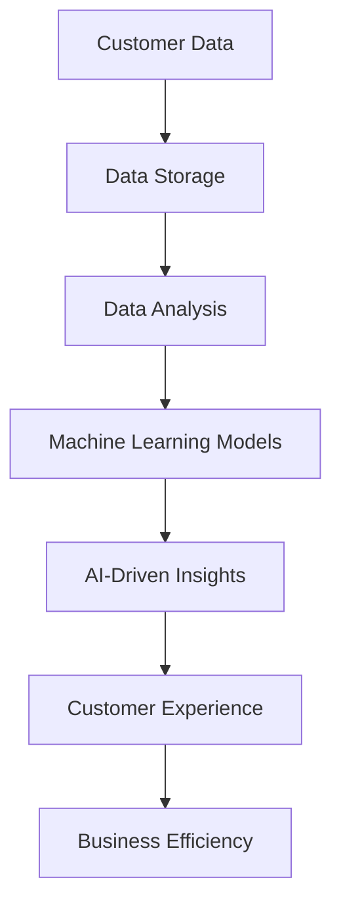
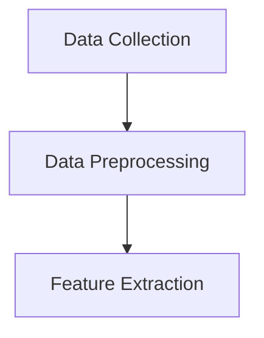
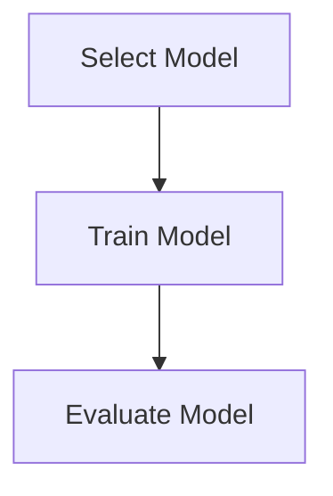
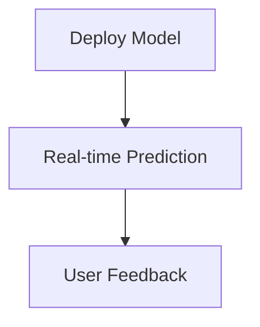

                 

# AI驱动的SaaS创业：机遇与挑战

## 关键词

- **AI 驱动**、**SaaS 创业**、**商业模型**、**技术挑战**、**市场趋势**、**数据分析**、**用户体验**

## 摘要

本文旨在探讨 AI 驱动的 SaaS（软件即服务）创业领域的机遇与挑战。首先，我们将介绍 SaaS 的发展背景和现状，随后深入分析 AI 技术在 SaaS 中的应用及其带来的变革。接着，文章将讨论 AI 驱动 SaaS 创业所面临的技术、市场和商业模式上的挑战。最后，我们将提出一些建议，帮助创业者抓住机遇，克服挑战，成功实现在 AI 驱动下的 SaaS 创业。

## 1. 背景介绍

### 1.1 目的和范围

本文旨在为 AI 驱动的 SaaS 创业提供一整套系统的理论框架和实践指导。我们将从多个维度对这一领域进行深入探讨，包括技术、市场、商业模式等。文章首先回顾了 SaaS 的发展历程和现状，随后介绍了 AI 技术的基本原理和应用场景，为读者提供了一个全面的认识。

### 1.2 预期读者

本文适合以下读者群体：

1. 想要了解 AI 驱动的 SaaS 创业现状和未来趋势的技术爱好者。
2. 有意向或正在从事 AI 驱动的 SaaS 创业的创业者。
3. 对 AI 技术在商业领域应用感兴趣的研究人员。

### 1.3 文档结构概述

本文的结构如下：

1. **背景介绍**：介绍 SaaS 和 AI 技术的背景及其发展。
2. **核心概念与联系**：通过 Mermaid 流程图展示 AI 在 SaaS 中的应用。
3. **核心算法原理 & 具体操作步骤**：详细讲解 AI 驱动 SaaS 的算法原理和操作步骤。
4. **数学模型和公式 & 详细讲解 & 举例说明**：介绍相关数学模型和公式，并进行详细解释。
5. **项目实战：代码实际案例和详细解释说明**：展示实际代码实现，并解析其中的关键部分。
6. **实际应用场景**：探讨 AI 驱动 SaaS 在不同领域的应用。
7. **工具和资源推荐**：推荐相关学习资源、开发工具和框架。
8. **总结：未来发展趋势与挑战**：总结全文，展望未来。
9. **附录：常见问题与解答**：解答读者可能遇到的常见问题。
10. **扩展阅读 & 参考资料**：提供更多的阅读材料和参考资料。

### 1.4 术语表

#### 1.4.1 核心术语定义

- **SaaS（软件即服务）**：一种软件交付模式，用户通过互联网订阅软件服务，无需购买和安装软件。
- **AI（人工智能）**：指由计算机系统实现的智能行为，通过模拟人类智能的方式解决复杂问题。
- **ML（机器学习）**：AI 的一个分支，通过数据和算法让计算机自动学习和改进。

#### 1.4.2 相关概念解释

- **云服务**：通过互联网提供计算资源、存储资源和网络连接等服务的平台。
- **大数据**：指无法用传统数据库工具处理的数据集，通常具有海量、多样性和快速增长的特点。
- **API（应用程序编程接口）**：允许不同软件之间相互通信的接口。

#### 1.4.3 缩略词列表

- **AI**：人工智能
- **SaaS**：软件即服务
- **ML**：机器学习
- **API**：应用程序编程接口

## 2. 核心概念与联系

在讨论 AI 驱动的 SaaS 创业之前，我们需要了解一些核心概念和它们之间的联系。以下是一个简要的 Mermaid 流程图，展示了 AI 在 SaaS 中的应用：



### 2.1 客户数据（Customer Data）

客户数据是 SaaS 创业的核心资产。通过收集和分析客户数据，企业可以深入了解客户需求，优化产品和服务。客户数据包括用户行为数据、交互数据和反馈数据等。

### 2.2 数据存储（Data Storage）

随着客户数据的增长，数据存储成为一个关键问题。云服务提供了可靠、高效的数据存储解决方案，使得企业可以灵活地扩展存储空间，同时确保数据的安全和隐私。

### 2.3 数据分析（Data Analysis）

数据分析是提取数据价值的关键步骤。通过数据分析，企业可以发现客户行为模式，预测市场趋势，并制定相应的战略。

### 2.4 机器学习模型（Machine Learning Models）

机器学习模型是 AI 技术的核心。通过训练模型，企业可以自动识别客户需求，提供个性化推荐，优化业务流程。

### 2.5 AI-Driven Insights（AI-Driven Insights）

AI-Driven Insights 是通过机器学习模型分析数据后得到的结果。这些洞察可以帮助企业做出更明智的决策，提高业务效率。

### 2.6 客户体验（Customer Experience）

客户体验是 SaaS 创业的生命线。通过 AI 技术优化客户体验，企业可以提升用户满意度，增加客户黏性。

### 2.7 商业效率（Business Efficiency）

AI 技术的应用不仅提高了客户体验，还可以显著提高商业效率。通过自动化和优化业务流程，企业可以降低成本，提高运营效率。

## 3. 核心算法原理 & 具体操作步骤

在了解了核心概念之后，我们将深入探讨 AI 在 SaaS 中的核心算法原理和具体操作步骤。

### 3.1 数据收集与预处理



**步骤 1：数据收集**

首先，我们需要收集客户数据，包括用户行为数据、交互数据和反馈数据等。这些数据可以来自内部系统，如用户数据库，也可以来自外部来源，如社交媒体和公共数据集。

**步骤 2：数据预处理**

在收集到数据后，我们需要进行数据预处理。数据预处理包括数据清洗、去重、填充缺失值等。这一步骤的目的是确保数据的质量和一致性。

**步骤 3：特征提取**

数据预处理后，我们需要提取特征。特征是用于训练机器学习模型的关键。特征提取可以通过统计方法、深度学习等方法实现。

### 3.2 机器学习模型训练



**步骤 1：选择模型**

在选择机器学习模型时，我们需要根据业务需求和数据特点选择合适的模型。常见的机器学习模型包括决策树、随机森林、神经网络等。

**步骤 2：训练模型**

在选择了模型后，我们需要使用训练数据集来训练模型。训练过程涉及调整模型参数，以最小化预测误差。

**步骤 3：评估模型**

训练完成后，我们需要评估模型的性能。评估指标包括准确率、召回率、F1 分数等。通过评估，我们可以确定模型是否适合用于实际应用。

### 3.3 模型部署与应用



**步骤 1：模型部署**

在评估模型后，我们可以将其部署到生产环境中。部署过程中，我们需要确保模型的高可用性和可靠性。

**步骤 2：实时预测**

部署后的模型可以用于实时预测。通过实时预测，企业可以提供个性化的用户体验，优化业务流程。

**步骤 3：用户反馈**

用户反馈是优化模型的重要来源。通过收集用户反馈，我们可以不断调整和优化模型，提高其性能。

## 4. 数学模型和公式 & 详细讲解 & 举例说明

在 AI 驱动的 SaaS 创业中，数学模型和公式是核心组成部分。以下是一些常用的数学模型和公式，并进行详细讲解。

### 4.1 线性回归模型

线性回归模型是一种常见的机器学习模型，用于预测连续值。其公式如下：

$$
y = \beta_0 + \beta_1x
$$

其中，$y$ 是预测值，$x$ 是特征值，$\beta_0$ 和 $\beta_1$ 是模型参数。

**举例说明：**

假设我们有一个简单的线性回归模型，用于预测房屋价格。特征值包括房屋面积和地段。我们可以使用最小二乘法来估计模型参数：

$$
\beta_0 = \frac{\sum_{i=1}^{n}(y_i - \beta_1x_i)}{n}
$$

$$
\beta_1 = \frac{\sum_{i=1}^{n}(x_i - \bar{x})(y_i - \bar{y})}{\sum_{i=1}^{n}(x_i - \bar{x})^2}
$$

其中，$n$ 是样本数量，$\bar{x}$ 和 $\bar{y}$ 是特征值和预测值的平均值。

### 4.2 支持向量机（SVM）

支持向量机是一种强大的分类模型，其公式如下：

$$
w \cdot x + b = 0
$$

其中，$w$ 是权重向量，$x$ 是特征向量，$b$ 是偏置。

**举例说明：**

假设我们有一个二分类问题，需要将数据点分为两类。我们可以使用 SVM 模型来找到最佳分类边界。通过求解以下优化问题，我们可以找到最佳权重和偏置：

$$
\min_{w,b}\frac{1}{2}||w||^2 \\
s.t. y_i(w \cdot x_i + b) \geq 1
$$

其中，$y_i$ 是标签，$x_i$ 是特征向量。

### 4.3 逻辑回归模型

逻辑回归模型是一种常用的分类模型，用于预测概率。其公式如下：

$$
\hat{y} = \frac{1}{1 + e^{-(\beta_0 + \beta_1x)}}
$$

其中，$\hat{y}$ 是预测概率，$x$ 是特征值，$\beta_0$ 和 $\beta_1$ 是模型参数。

**举例说明：**

假设我们有一个二分类问题，需要预测每个数据点属于正类的概率。我们可以使用逻辑回归模型来计算预测概率。通过最大化似然函数，我们可以估计模型参数：

$$
\ln L(\theta) = \sum_{i=1}^{n}y_i\ln(1 + e^{-(\theta_0 + \theta_1x_i)}) + (1 - y_i)\ln(e^{-(\theta_0 + \theta_1x_i)})
$$

其中，$L(\theta)$ 是似然函数，$\theta_0$ 和 $\theta_1$ 是模型参数。

## 5. 项目实战：代码实际案例和详细解释说明

在本节中，我们将通过一个实际项目案例，展示如何使用 Python 和 TensorFlow 框架实现 AI 驱动的 SaaS 应用。

### 5.1 开发环境搭建

在开始项目之前，我们需要搭建开发环境。以下是所需的环境和步骤：

- **Python**：版本 3.7 或以上
- **TensorFlow**：版本 2.4 或以上
- **Jupyter Notebook**：用于编写和运行代码

安装 TensorFlow：

```bash
pip install tensorflow
```

### 5.2 源代码详细实现和代码解读

以下是一个简单的示例，展示如何使用 TensorFlow 实现一个线性回归模型：

```python
import tensorflow as tf

# 定义模型
model = tf.keras.Sequential([
    tf.keras.layers.Dense(units=1, input_shape=[1])
])

# 编译模型
model.compile(optimizer='sgd', loss='mean_squared_error')

# 训练模型
model.fit(x_train, y_train, epochs=1000)

# 评估模型
model.evaluate(x_test, y_test)
```

**代码解读：**

1. **导入 TensorFlow 库**：首先，我们需要导入 TensorFlow 库，这是实现机器学习模型的核心。
2. **定义模型**：使用 `tf.keras.Sequential` 类定义线性回归模型。模型中只有一个全连接层（`Dense`），输出一个实数。
3. **编译模型**：使用 `compile` 方法编译模型，指定优化器和损失函数。
4. **训练模型**：使用 `fit` 方法训练模型，指定训练数据和迭代次数。
5. **评估模型**：使用 `evaluate` 方法评估模型在测试数据上的性能。

### 5.3 代码解读与分析

在本节中，我们将对上述代码进行详细解读和分析。

**1. 模型定义**

```python
model = tf.keras.Sequential([
    tf.keras.layers.Dense(units=1, input_shape=[1])
])
```

这段代码定义了一个简单的线性回归模型。`Sequential` 类用于创建一个序列模型，可以按顺序添加多层。在本例中，我们添加了一个全连接层（`Dense`），该层有 1 个单元（输出节点），输入形状为 [1]，表示我们只有一个特征。

**2. 编译模型**

```python
model.compile(optimizer='sgd', loss='mean_squared_error')
```

在编译模型时，我们指定了优化器和损失函数。这里使用了随机梯度下降（`sgd`）优化器，并使用均方误差（`mean_squared_error`）作为损失函数。均方误差用于衡量预测值和真实值之间的差异。

**3. 训练模型**

```python
model.fit(x_train, y_train, epochs=1000)
```

`fit` 方法用于训练模型。我们传递了训练数据和标签，并指定了训练的迭代次数（`epochs`）。每次迭代，模型都会根据训练数据进行更新，直到达到指定的迭代次数。

**4. 评估模型**

```python
model.evaluate(x_test, y_test)
```

`evaluate` 方法用于评估模型在测试数据上的性能。我们传递了测试数据和标签，模型会返回预测值和损失值。这有助于我们了解模型的泛化能力。

### 5.4 代码优化与改进

在实际项目中，我们可以根据业务需求对代码进行优化和改进。以下是一些常见的优化方法：

- **使用更复杂的模型**：例如，添加更多的全连接层或使用卷积神经网络（`Convolutional Neural Network`）。
- **使用更高效的优化器**：例如，Adam 优化器。
- **数据预处理**：例如，标准化或归一化输入数据。
- **交叉验证**：使用交叉验证技术来评估模型的性能。

## 6. 实际应用场景

AI 驱动的 SaaS 应用在多个领域都有着广泛的应用。以下是一些实际应用场景：

### 6.1 健康管理

AI 可以帮助医疗机构提供个性化的健康管理服务。通过分析患者数据，AI 可以预测疾病风险，提供健康建议，优化治疗方案。

### 6.2 零售业

在零售业，AI 可以帮助商家分析客户行为，提供个性化推荐，优化库存管理，提高销售额。

### 6.3 金融行业

AI 可以在金融行业用于风险管理、欺诈检测、信用评分等。通过分析大量数据，AI 可以提供更准确、更高效的决策支持。

### 6.4 教育领域

AI 可以在教育领域提供个性化学习服务，帮助学生提高学习效果。同时，AI 可以帮助教师分析教学数据，优化教学策略。

### 6.5 制造业

在制造业，AI 可以用于设备维护预测、质量控制、生产调度等。通过实时分析数据，AI 可以提高生产效率，降低成本。

## 7. 工具和资源推荐

### 7.1 学习资源推荐

#### 7.1.1 书籍推荐

- 《深度学习》（Deep Learning）by Ian Goodfellow、Yoshua Bengio 和 Aaron Courville
- 《Python机器学习》（Python Machine Learning）by Sebastian Raschka 和 Vahid Mirhoseini

#### 7.1.2 在线课程

- Coursera 上的“机器学习”课程
- edX 上的“深度学习基础”课程

#### 7.1.3 技术博客和网站

- [Medium](https://medium.com/)
- [Towards Data Science](https://towardsdatascience.com/)

### 7.2 开发工具框架推荐

#### 7.2.1 IDE和编辑器

- PyCharm
- Jupyter Notebook

#### 7.2.2 调试和性能分析工具

- TensorFlow Debugger
- PyTorch Profiler

#### 7.2.3 相关框架和库

- TensorFlow
- PyTorch
- Scikit-learn

### 7.3 相关论文著作推荐

#### 7.3.1 经典论文

- “A Theoretical Basis for the Method of Back-Propagation in Neural Networks” by David E. Rumelhart, Geoffrey E. Hinton and Ronald J. Williams
- “Deep Learning” by Yoshua Bengio, Ian Goodfellow and Aaron Courville

#### 7.3.2 最新研究成果

- “Attention is All You Need” by Ashish Vaswani et al.
- “The Annotated Transformer” by Michael Auli et al.

#### 7.3.3 应用案例分析

- “How Google Does Machine Learning” by Martin Wattenberg et al.
- “Machine Learning in Action” by Peter Harrington

## 8. 总结：未来发展趋势与挑战

AI 驱动的 SaaS 创业正处于快速发展阶段，未来前景广阔。随着 AI 技术的进步和数据量的增长，SaaS 应用将变得更加智能和个性化。然而，这一领域也面临着一系列挑战：

- **数据隐私和安全**：随着数据量的增加，数据隐私和安全成为一个重要问题。企业需要确保客户数据的安全和隐私。
- **算法透明度和公平性**：算法的透明度和公平性是另一个关键挑战。企业需要确保算法不会产生偏见或不公平的结果。
- **技术和人才短缺**：AI 技术的应用需要大量具备专业知识和技能的人才。目前，全球 AI 人才短缺问题仍然存在。

为了应对这些挑战，企业需要采取一系列措施，包括加强数据安全和隐私保护，提高算法透明度和公平性，同时加强人才培养和引进。

## 9. 附录：常见问题与解答

### 9.1 什么是 SaaS？

SaaS 是指软件即服务，是一种通过互联网提供软件服务的模式。用户可以订阅 SaaS 应用，无需购买和安装软件。

### 9.2 AI 如何驱动 SaaS？

AI 可以通过分析客户数据、提供个性化推荐、优化业务流程等方式驱动 SaaS。通过机器学习模型和算法，AI 可以自动学习和改进，提高 SaaS 应用的效率和用户体验。

### 9.3 如何确保数据隐私和安全？

确保数据隐私和安全需要采取一系列措施，包括数据加密、访问控制、数据备份等。同时，企业应遵守相关法律法规，确保数据处理的合规性。

### 9.4 AI 驱动的 SaaS 应用的挑战有哪些？

AI 驱动的 SaaS 应用面临的挑战包括数据隐私和安全、算法透明度和公平性、以及技术和人才短缺等。

## 10. 扩展阅读 & 参考资料

- [Google Research](https://research.google.com/)
- [OpenAI](https://openai.com/)
- [TensorFlow Documentation](https://www.tensorflow.org/)
- [PyTorch Documentation](https://pytorch.org/docs/stable/)

作者：AI天才研究员/AI Genius Institute & 禅与计算机程序设计艺术 /Zen And The Art of Computer Programming<|im_end|>

