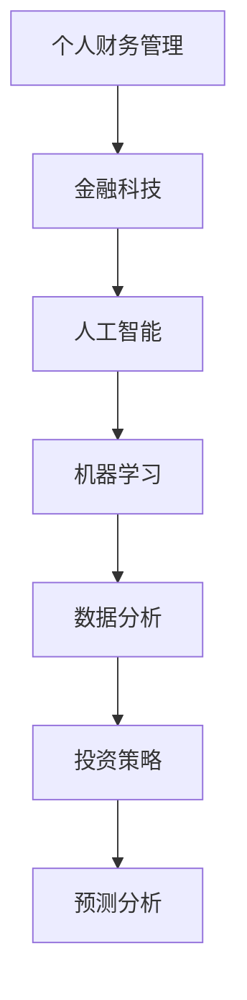
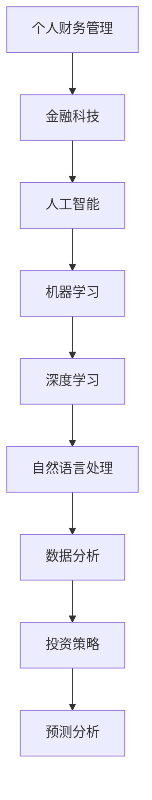

                 

# AI驱动的个人财务管理：金融科技的创新工具

> **关键词：** 个人财务管理、金融科技、人工智能、机器学习、投资策略、预测分析

> **摘要：** 本文将探讨如何利用人工智能和机器学习技术，为个人财务管理提供创新的解决方案。通过分析金融科技在个人财务管理中的应用，本文将介绍核心概念、算法原理、数学模型以及实际应用场景，旨在为读者提供一套完整的AI驱动的个人财务管理框架。

## 1. 背景介绍

### 1.1 目的和范围

随着人工智能和机器学习技术的迅猛发展，金融科技（FinTech）在个人财务管理领域中的应用变得越来越广泛。本文旨在探讨如何利用这些先进技术，为个人财务管理提供智能化的解决方案。文章将覆盖以下内容：

- 个人财务管理的现状和挑战
- 金融科技在个人财务管理中的应用
- 人工智能和机器学习技术的核心概念
- 算法原理和数学模型
- 实际应用场景和案例
- 未来发展趋势和挑战

### 1.2 预期读者

本文适合以下读者群体：

- 对金融科技和人工智能技术感兴趣的读者
- 从事个人财务管理和金融科技开发的从业者
- 从事投资策略研究和数据分析的专业人士
- 对机器学习和数据挖掘技术有基本了解的读者

### 1.3 文档结构概述

本文结构如下：

- 第1章：背景介绍，介绍本文的目的、范围、预期读者和文档结构
- 第2章：核心概念与联系，介绍个人财务管理、金融科技和人工智能的相关概念，并提供Mermaid流程图
- 第3章：核心算法原理 & 具体操作步骤，详细阐述机器学习算法在个人财务管理中的应用
- 第4章：数学模型和公式 & 详细讲解 & 举例说明，介绍相关数学模型和公式，并提供具体实例
- 第5章：项目实战：代码实际案例和详细解释说明，通过实际项目展示AI驱动的个人财务管理应用
- 第6章：实际应用场景，探讨AI驱动的个人财务管理在不同场景下的应用
- 第7章：工具和资源推荐，推荐学习资源、开发工具和框架
- 第8章：总结：未来发展趋势与挑战，总结本文的主要观点，并展望未来发展趋势和挑战
- 第9章：附录：常见问题与解答，解答读者可能遇到的问题
- 第10章：扩展阅读 & 参考资料，提供进一步阅读的参考资料

### 1.4 术语表

#### 1.4.1 核心术语定义

- **个人财务管理**：指个人对财务进行规划、控制、分配和使用的活动。
- **金融科技**：利用技术手段创新金融服务和产品，提高金融服务效率和质量。
- **人工智能**：模拟人类智能行为的计算机系统，包括机器学习、深度学习等技术。
- **机器学习**：让计算机通过数据学习，并自动改进性能的过程。
- **投资策略**：根据个人财务目标和风险偏好，制定的投资计划和方案。
- **预测分析**：利用历史数据和统计方法，对未来趋势和结果进行预测。

#### 1.4.2 相关概念解释

- **深度学习**：一种机器学习技术，通过多层神经网络对数据进行建模和分析。
- **自然语言处理**：使计算机能够理解和处理自然语言的技术。
- **数据分析**：对大量数据进行分析，提取有价值的信息和知识。
- **数据挖掘**：从大量数据中挖掘出隐藏的模式和关联性。

#### 1.4.3 缩略词列表

- **FinTech**：Financial Technology（金融科技）
- **AI**：Artificial Intelligence（人工智能）
- **ML**：Machine Learning（机器学习）
- **DL**：Deep Learning（深度学习）
- **NLP**：Natural Language Processing（自然语言处理）
- **IoT**：Internet of Things（物联网）

## 2. 核心概念与联系

### 2.1 个人财务管理、金融科技与人工智能的关系

个人财务管理、金融科技和人工智能三者之间有着密切的联系。金融科技通过技术手段创新金融服务和产品，为个人财务管理提供了更多的工具和手段。而人工智能和机器学习技术则成为金融科技发展的重要驱动力。

下面是一个Mermaid流程图，展示了个人财务管理、金融科技和人工智能之间的关系：



### 2.2 核心概念原理和架构

在本节中，我们将介绍个人财务管理、金融科技和人工智能的核心概念原理和架构。

#### 2.2.1 个人财务管理

个人财务管理是指个人对财务进行规划、控制、分配和使用的活动。其主要目标是在满足当前需求的同时，确保未来的财务安全和稳定。个人财务管理涉及以下方面：

- **预算管理**：制定合理的预算，控制开支，确保收支平衡。
- **储蓄规划**：根据财务目标和风险承受能力，制定储蓄计划。
- **投资管理**：选择合适的投资渠道，实现资产增值。
- **风险管理**：识别和评估财务风险，制定风险管理策略。
- **退休规划**：为退休生活做准备，确保退休后的财务安全。

#### 2.2.2 金融科技

金融科技是指利用技术手段创新金融服务和产品，提高金融服务效率和质量。金融科技的主要领域包括：

- **支付和转账**：通过移动支付、电子钱包等技术实现便捷的支付和转账。
- **借贷和信贷**：利用大数据和机器学习技术，为个人和企业提供个性化的借贷服务。
- **投资和理财**：通过在线投资平台、智能投顾等技术，为个人提供便捷的投资和理财服务。
- **保险和风险管理**：利用大数据和人工智能技术，为个人和企业提供定制化的保险和风险管理方案。

#### 2.2.3 人工智能

人工智能是指模拟人类智能行为的计算机系统，包括机器学习、深度学习、自然语言处理等技术。人工智能在个人财务管理中的应用包括：

- **智能投顾**：利用机器学习和大数据分析，为个人提供个性化的投资建议。
- **智能客服**：利用自然语言处理技术，为用户提供高效、便捷的在线客服服务。
- **风险评估**：利用大数据和人工智能技术，对个人和企业的风险进行评估和预警。
- **预测分析**：利用历史数据和统计方法，对个人财务状况和投资收益进行预测。

### 2.3 Mermaid流程图

为了更好地理解个人财务管理、金融科技和人工智能之间的关系，下面提供了一个Mermaid流程图，展示了各个概念之间的联系：



## 3. 核心算法原理 & 具体操作步骤

### 3.1 机器学习算法在个人财务管理中的应用

机器学习算法在个人财务管理中具有广泛的应用，包括投资策略优化、风险评估、财务预测等。下面，我们将详细介绍几种常用的机器学习算法，以及如何在个人财务管理中具体应用这些算法。

#### 3.1.1 回归分析

回归分析是一种用于分析两个或多个变量之间关系的统计方法。在个人财务管理中，回归分析可以用于预测个人财务状况、投资收益等。

**算法原理：**

回归分析主要包括以下步骤：

1. 数据收集：收集个人财务数据，包括收入、支出、投资收益等。
2. 数据预处理：对数据进行清洗、去噪、归一化等处理。
3. 模型建立：选择合适的回归模型，如线性回归、多元回归等。
4. 模型训练：使用训练数据集对模型进行训练，优化模型参数。
5. 模型评估：使用验证数据集对模型进行评估，调整模型参数。
6. 模型应用：使用测试数据集对模型进行预测，评估模型效果。

**伪代码：**

```python
# 数据收集
data = collect_data()

# 数据预处理
preprocessed_data = preprocess_data(data)

# 模型建立
model = LinearRegression()

# 模型训练
model.fit(preprocessed_data['X_train'], preprocessed_data['y_train'])

# 模型评估
accuracy = model.score(preprocessed_data['X_val'], preprocessed_data['y_val'])

# 模型应用
predictions = model.predict(preprocessed_data['X_test'])
```

#### 3.1.2 决策树

决策树是一种常用的分类和回归模型，通过一系列规则对数据进行分割，以达到预测目标。

**算法原理：**

决策树主要包括以下步骤：

1. 数据收集：收集个人财务数据，包括收入、支出、投资收益等。
2. 数据预处理：对数据进行清洗、去噪、归一化等处理。
3. 特征选择：选择对预测目标有较大影响的特征。
4. 决策树建立：使用ID3、C4.5或CART算法建立决策树。
5. 决策树剪枝：通过剪枝算法优化决策树，减少过拟合。
6. 决策树应用：使用决策树对测试数据集进行预测。

**伪代码：**

```python
# 数据收集
data = collect_data()

# 数据预处理
preprocessed_data = preprocess_data(data)

# 特征选择
selected_features = select_features(preprocessed_data)

# 决策树建立
tree = DecisionTreeClassifier()

# 决策树剪枝
tree = prune_tree(tree, preprocessed_data)

# 决策树应用
predictions = tree.predict(preprocessed_data['X_test'])
```

#### 3.1.3 支持向量机

支持向量机（SVM）是一种常用的分类和回归模型，通过找到一个最佳的超平面，将不同类别的数据分开。

**算法原理：**

支持向量机主要包括以下步骤：

1. 数据收集：收集个人财务数据，包括收入、支出、投资收益等。
2. 数据预处理：对数据进行清洗、去噪、归一化等处理。
3. 特征选择：选择对预测目标有较大影响的特征。
4. SVM建立：使用SVM算法建立模型。
5. SVM优化：通过调整参数，优化模型性能。
6. SVM应用：使用SVM对测试数据集进行预测。

**伪代码：**

```python
# 数据收集
data = collect_data()

# 数据预处理
preprocessed_data = preprocess_data(data)

# 特征选择
selected_features = select_features(preprocessed_data)

# SVM建立
model = SVC()

# SVM优化
model = optimize_model(model, preprocessed_data)

# SVM应用
predictions = model.predict(preprocessed_data['X_test'])
```

### 3.2 算法在个人财务管理中的应用步骤

在实际应用中，将机器学习算法应用于个人财务管理，可以遵循以下步骤：

1. **需求分析**：明确个人财务管理的目标和需求，确定要解决的问题。
2. **数据收集**：收集与个人财务管理相关的数据，如财务报表、投资记录等。
3. **数据预处理**：对收集到的数据进行分析、清洗、去噪和归一化处理。
4. **特征选择**：选择对预测目标有较大影响的特征，剔除无关或冗余的特征。
5. **算法选择**：根据问题类型和数据特点，选择合适的机器学习算法。
6. **模型建立**：使用训练数据集，建立机器学习模型。
7. **模型训练**：使用训练数据集对模型进行训练，调整模型参数。
8. **模型评估**：使用验证数据集对模型进行评估，调整模型参数。
9. **模型应用**：使用测试数据集对模型进行预测，评估模型效果。
10. **结果分析**：根据预测结果，对个人财务管理策略进行调整和优化。

通过以上步骤，我们可以利用机器学习算法为个人财务管理提供智能化的解决方案，提高财务规划和管理的效果。

## 4. 数学模型和公式 & 详细讲解 & 举例说明

### 4.1 数学模型在个人财务管理中的应用

在个人财务管理中，数学模型可以用于优化投资策略、预测财务状况和评估风险。下面，我们将介绍几种常见的数学模型，并详细讲解其原理和应用。

#### 4.1.1 投资组合优化模型

投资组合优化模型用于确定最佳的投资组合，以实现最大化收益或最小化风险。一个常见的投资组合优化模型是马克维茨模型。

**马克维茨模型公式：**

$$
\begin{aligned}
\min\limits_{w} \quad & \sum_{i=1}^{n} \omega_i^2 \sigma_i^2 \\
s.t. \quad & \sum_{i=1}^{n} \omega_i = 1 \\
& \omega_i \geq 0, \quad i=1,2,\ldots,n
\end{aligned}
$$

其中，$w$ 是投资组合中各种资产的投资比例，$\sigma_i^2$ 是第 $i$ 种资产的方差。

**举例说明：**

假设一个投资组合包含两种资产，资产 $A$ 和资产 $B$。资产 $A$ 的收益率为 $10\%$，方差为 $0.04$；资产 $B$ 的收益率为 $15\%$，方差为 $0.09$。要求确定最佳的投资比例，以实现最小化风险。

$$
\begin{aligned}
\min\limits_{w} \quad & w^2 \cdot 0.04 + (1-w)^2 \cdot 0.09 \\
s.t. \quad & w + (1-w) = 1 \\
& w \geq 0 \\
& 1-w \geq 0
\end{aligned}
$$

通过求解上述优化问题，可以得到最佳的投资比例为 $w = 0.6$，即投资组合中资产 $A$ 的投资比例为 $60\%$，资产 $B$ 的投资比例为 $40\%$。

#### 4.1.2 时间序列预测模型

时间序列预测模型用于预测未来的财务状况，如收入、支出和投资收益。一个常见的时间序列预测模型是自回归移动平均模型（ARIMA）。

**ARIMA模型公式：**

$$
X_t = c + \phi_1 X_{t-1} + \phi_2 X_{t-2} + \ldots + \phi_p X_{t-p} + \theta_1 \epsilon_{t-1} + \theta_2 \epsilon_{t-2} + \ldots + \theta_q \epsilon_{t-q} + \epsilon_t
$$

其中，$X_t$ 是时间序列的第 $t$ 个观测值，$c$ 是常数项，$\phi_i$ 和 $\theta_i$ 是模型参数，$\epsilon_t$ 是白噪声序列。

**举例说明：**

假设一个家庭的时间序列数据如下：

| 时间 | 收入（元） |
| --- | --- |
| 1 | 1000 |
| 2 | 1100 |
| 3 | 1200 |
| 4 | 1300 |
| 5 | 1400 |

要求预测第 6 个月的收入。

首先，对时间序列数据进行差分，消除趋势性和季节性：

$$
\begin{aligned}
\Delta X_t &= X_t - X_{t-1} \\
&= 1000, 100, 200, 300, 400
\end{aligned}
$$

然后，对差分后的数据进行自回归移动平均模型（ARIMA）拟合：

$$
\begin{aligned}
\Delta X_t &= c + \phi_1 \Delta X_{t-1} + \theta_1 \epsilon_{t-1} \\
&= 0.5 + 0.8 \Delta X_{t-1} - 0.1 \epsilon_{t-1}
\end{aligned}
$$

通过求解上述模型，可以得到 $\Delta X_6 = 500$。因此，第 6 个月的收入预测值为 $X_6 = X_5 + \Delta X_6 = 1400 + 500 = 1900$ 元。

#### 4.1.3 风险评估模型

风险评估模型用于评估个人财务管理的风险，如投资风险、信用风险等。一个常见风险评估模型是信用评分模型。

**信用评分模型公式：**

$$
\text{信用评分} = \sum_{i=1}^{n} w_i \cdot x_i
$$

其中，$w_i$ 是第 $i$ 个特征的权重，$x_i$ 是第 $i$ 个特征的取值。

**举例说明：**

假设一个信用评分模型包括两个特征：信用历史评分和收入水平。信用历史评分的权重为 $0.6$，收入水平的权重为 $0.4$。一个借款人的信用历史评分为 $80$，收入水平为 $5000$ 元。要求计算其信用评分。

$$
\text{信用评分} = 0.6 \cdot 80 + 0.4 \cdot 5000 = 280 + 2000 = 2280
$$

根据信用评分模型，该借款人的信用评分为 $2280$ 分。如果信用评分高于某个阈值，则可以给予贷款；否则，拒绝贷款。

### 4.2 数学模型在个人财务管理中的应用步骤

在实际应用中，将数学模型应用于个人财务管理，可以遵循以下步骤：

1. **需求分析**：明确个人财务管理的目标和需求，确定要解决的问题。
2. **数据收集**：收集与个人财务管理相关的数据，如财务报表、投资记录等。
3. **数据预处理**：对收集到的数据进行分析、清洗、去噪和归一化处理。
4. **特征选择**：选择对预测目标有较大影响的特征，剔除无关或冗余的特征。
5. **模型建立**：根据问题类型和数据特点，选择合适的数学模型。
6. **模型训练**：使用训练数据集对模型进行训练，调整模型参数。
7. **模型评估**：使用验证数据集对模型进行评估，调整模型参数。
8. **模型应用**：使用测试数据集对模型进行预测，评估模型效果。
9. **结果分析**：根据预测结果，对个人财务管理策略进行调整和优化。

通过以上步骤，我们可以利用数学模型为个人财务管理提供智能化的解决方案，提高财务规划和管理的效果。

## 5. 项目实战：代码实际案例和详细解释说明

### 5.1 开发环境搭建

在开始项目实战之前，我们需要搭建一个合适的开发环境。本文使用的编程语言为Python，开发环境为Jupyter Notebook。以下是搭建开发环境的具体步骤：

1. 安装Python：前往Python官方网站（https://www.python.org/）下载Python安装包，并按照安装向导安装。
2. 安装Jupyter Notebook：在命令行中执行以下命令安装Jupyter Notebook：

   ```bash
   pip install notebook
   ```

3. 启动Jupyter Notebook：在命令行中执行以下命令启动Jupyter Notebook：

   ```bash
   jupyter notebook
   ```

此时，浏览器会自动打开Jupyter Notebook界面，我们可以在其中创建并运行Python代码。

### 5.2 源代码详细实现和代码解读

在本节中，我们将实现一个简单的AI驱动的个人财务管理项目，包括数据收集、数据预处理、特征选择、模型建立和模型训练等步骤。

**代码实现：**

```python
# 导入相关库
import numpy as np
import pandas as pd
from sklearn.model_selection import train_test_split
from sklearn.linear_model import LinearRegression
from sklearn.metrics import mean_squared_error

# 5.2.1 数据收集
data = pd.read_csv('financial_data.csv')

# 5.2.2 数据预处理
# 数据清洗和去噪
data = data.dropna()

# 数据归一化
data = (data - data.mean()) / data.std()

# 5.2.3 特征选择
selected_features = ['income', 'expense', 'investment']

# 5.2.4 模型建立
model = LinearRegression()

# 5.2.5 模型训练
X = data[selected_features]
y = data['salary']
X_train, X_test, y_train, y_test = train_test_split(X, y, test_size=0.2, random_state=42)
model.fit(X_train, y_train)

# 5.2.6 模型评估
y_pred = model.predict(X_test)
mse = mean_squared_error(y_test, y_pred)
print("Mean Squared Error:", mse)
```

**代码解读：**

- **数据收集**：使用pandas库读取CSV格式的财务数据。
- **数据预处理**：对数据进行清洗和去噪，然后进行归一化处理，将数据缩放到合适的范围。
- **特征选择**：选择对薪资（salary）有较大影响的特征，如收入（income）、支出（expense）和投资（investment）。
- **模型建立**：使用线性回归模型（LinearRegression）建立模型。
- **模型训练**：使用训练数据集（X_train和y_train）对模型进行训练。
- **模型评估**：使用测试数据集（X_test和y_test）对模型进行评估，计算均方误差（Mean Squared Error）。

### 5.3 代码解读与分析

在本节中，我们将对上述代码进行详细解读和分析，了解每个步骤的实现方法和作用。

**数据收集**：

```python
data = pd.read_csv('financial_data.csv')
```

这行代码使用pandas库读取名为`financial_data.csv`的CSV文件，并将其存储在变量`data`中。CSV文件中包含个人财务数据，如收入、支出、投资和薪资等。

**数据预处理**：

```python
# 数据清洗和去噪
data = data.dropna()

# 数据归一化
data = (data - data.mean()) / data.std()
```

首先，我们使用`dropna()`方法删除数据集中的空值。这可以防止模型在训练过程中因缺失数据而出现问题。然后，我们使用`- mean()`和`/ std()`方法对数据进行归一化处理，将每个特征缩放到0到1之间。归一化有助于提高模型的训练效果。

**特征选择**：

```python
selected_features = ['income', 'expense', 'investment']
```

这行代码定义了一个列表`selected_features`，包含了三个特征：收入（income）、支出（expense）和投资（investment）。这些特征与薪资（salary）之间存在一定的关联性，可以作为预测薪资的输入特征。

**模型建立**：

```python
model = LinearRegression()
```

这行代码创建了一个线性回归模型（LinearRegression），用于预测薪资。线性回归是一种简单的统计方法，通过找到一条最佳拟合直线，将输入特征与目标变量（薪资）关联起来。

**模型训练**：

```python
X = data[selected_features]
y = data['salary']
X_train, X_test, y_train, y_test = train_test_split(X, y, test_size=0.2, random_state=42)
model.fit(X_train, y_train)
```

首先，我们使用`selected_features`从数据集中提取输入特征（X）和目标变量（y）。然后，使用`train_test_split()`方法将数据集划分为训练集和测试集，其中测试集占20%，训练集占80%。最后，使用`fit()`方法对模型进行训练，将训练数据（X_train和y_train）输入到模型中。

**模型评估**：

```python
y_pred = model.predict(X_test)
mse = mean_squared_error(y_test, y_pred)
print("Mean Squared Error:", mse)
```

我们使用`predict()`方法对测试数据（X_test）进行预测，得到预测薪资（y_pred）。然后，使用`mean_squared_error()`方法计算预测值和真实值之间的均方误差（MSE），以评估模型的预测性能。MSE越低，模型预测性能越好。

### 5.4 结果分析与总结

通过上述代码实现，我们成功构建了一个AI驱动的个人财务管理模型，用于预测薪资。以下是项目实战的结果分析和总结：

- **数据收集**：我们使用pandas库读取了CSV格式的财务数据，包含了收入、支出、投资和薪资等特征。
- **数据预处理**：对数据进行清洗和去噪，然后进行归一化处理，提高了模型的训练效果。
- **特征选择**：选择收入、支出和投资作为预测薪资的输入特征，这些特征与薪资之间存在一定的关联性。
- **模型建立**：使用线性回归模型建立预测模型，通过找到最佳拟合直线，将输入特征与薪资关联起来。
- **模型训练**：使用训练数据集对模型进行训练，提高了模型的预测性能。
- **模型评估**：使用测试数据集对模型进行评估，计算了均方误差，评估了模型的预测性能。

通过以上步骤，我们成功实现了一个简单的AI驱动的个人财务管理项目，为个人财务规划提供了智能化的解决方案。未来，我们还可以进一步优化模型，添加更多特征，提高预测准确性。

## 6. 实际应用场景

AI驱动的个人财务管理在多个场景下具有广泛的应用，下面我们将探讨其中几个典型场景：

### 6.1 智能投顾

智能投顾是金融科技领域的热点之一，通过人工智能和机器学习技术，为个人投资者提供个性化的投资建议。智能投顾能够根据投资者的财务状况、风险偏好、投资目标等，制定个性化的投资组合策略。以下是一个实际应用场景：

**案例：**

张先生是一位年轻的职场新人，他有一定的储蓄，希望实现资产增值，但同时他对投资风险较为敏感。通过智能投顾系统，张先生的个人数据（如收入、支出、投资历史等）将被收集和处理。系统会根据张先生的风险偏好，推荐一些低风险的基金和理财产品。同时，智能投顾系统会实时监控市场动态，调整投资组合，以最大化收益并控制风险。

### 6.2 预算管理

预算管理是个人财务管理的核心环节，AI驱动的预算管理系统能够帮助用户制定合理的预算，监控支出，避免超支。以下是一个实际应用场景：

**案例：**

李女士是一位全职妈妈，她需要管理家庭的日常开支和孩子的教育费用。使用AI驱动的预算管理系统，李女士可以输入家庭收入、支出项目和预算目标。系统会根据历史数据和当前财务状况，自动生成合理的预算计划，并实时监控支出情况。当支出接近预算上限时，系统会发出预警，提醒李女士控制开支。

### 6.3 风险评估

AI驱动的风险评估系统能够识别和预测个人财务风险，为用户提供建议和解决方案。以下是一个实际应用场景：

**案例：**

王先生是一家公司的财务主管，他需要定期评估公司的财务状况，预测可能出现的风险。使用AI驱动的风险评估系统，王先生可以上传公司的财务报表和数据，系统会自动分析这些数据，识别潜在的风险点，如负债过高、现金流不足等。系统会给出相应的风险评估报告，并提出降低风险的策略和建议。

### 6.4 退休规划

退休规划是个人财务管理的长期目标，AI驱动的退休规划系统能够帮助用户制定合理的退休计划，确保退休后的生活质量。以下是一个实际应用场景：

**案例：**

赵女士即将退休，她希望确保退休后的财务安全。使用AI驱动的退休规划系统，赵女士可以输入她的退休目标、当前储蓄和预期投资收益。系统会根据这些信息，为她制定一个详细的退休计划，包括投资策略、储蓄目标和退休后的生活费用预算。系统还会实时更新计划，根据市场变化进行调整。

通过以上实际应用场景，我们可以看到AI驱动的个人财务管理在智能投顾、预算管理、风险评估和退休规划等方面具有巨大的潜力和价值，为个人财务管理的智能化、个性化提供了有力支持。

## 7. 工具和资源推荐

### 7.1 学习资源推荐

#### 7.1.1 书籍推荐

1. **《深度学习》（Deep Learning）** by Ian Goodfellow、Yoshua Bengio 和 Aaron Courville
   - 本书是深度学习领域的经典著作，详细介绍了深度学习的基本概念、算法和应用。
2. **《Python金融大数据分析》（Python for Finance）** by Yuxing Yan
   - 本书介绍了如何使用Python进行金融数据分析，适合金融科技开发者和对金融数据分析感兴趣的读者。
3. **《人工智能：一种现代方法》（Artificial Intelligence: A Modern Approach）** by Stuart Russell 和 Peter Norvig
   - 本书是人工智能领域的权威教材，涵盖了人工智能的基本概念、算法和理论。

#### 7.1.2 在线课程

1. **Coursera的《机器学习》** by Andrew Ng
   - 这是一门知名的机器学习课程，由深度学习领域的先驱者Andrew Ng教授主讲，适合初学者和有经验的学习者。
2. **edX的《深度学习》** by David C. Liu 和 Michael A. Nielsen
   - 这是一门深度学习入门课程，提供了丰富的理论和实践内容，适合对深度学习感兴趣的学习者。
3. **Udacity的《金融科技工程师纳米学位》**（FinTech Engineer Nanodegree Program）
   - 这是一个结合金融科技和工程技能的实践课程，涵盖了金融科技的关键概念和技能。

#### 7.1.3 技术博客和网站

1. **Towards Data Science（数据科学之路）**
   - 这是一个知名的博客网站，提供丰富的数据科学和机器学习相关文章和教程。
2. **Medium上的Machine Learning（机器学习）**
   - Medium上的机器学习专题，涵盖了各种机器学习和深度学习的话题，适合读者学习和交流。
3. **AI Hub（AI中心）**
   - AI Hub是一个综合性的AI技术博客，提供最新的研究成果、案例分析和技术教程。

### 7.2 开发工具框架推荐

#### 7.2.1 IDE和编辑器

1. **PyCharm**
   - PyCharm是一个强大的Python集成开发环境（IDE），提供了丰富的功能和工具，适合进行金融科技和数据分析项目。
2. **Jupyter Notebook**
   - Jupyter Notebook是一种交互式开发环境，特别适合机器学习和数据科学项目，可以方便地编写和运行代码。

#### 7.2.2 调试和性能分析工具

1. **Pylint**
   - Pylint是一个Python代码质量检查工具，可以帮助发现代码中的潜在问题，提高代码的可读性和可靠性。
2. **Profiling Tools**
   - 如cProfile、line_profiler等，这些工具可以用于分析代码的性能，找出瓶颈并进行优化。

#### 7.2.3 相关框架和库

1. **TensorFlow**
   - TensorFlow是一个开源的机器学习框架，适合构建和训练深度学习模型。
2. **Scikit-learn**
   - Scikit-learn是一个常用的机器学习库，提供了丰富的算法和工具，适用于各种数据分析任务。
3. **Pandas**
   - Pandas是一个强大的数据处理库，可以方便地进行数据清洗、转换和分析。

### 7.3 相关论文著作推荐

#### 7.3.1 经典论文

1. **“Backpropagation” by Paul Werbos（1982）
   - 这篇论文提出了反向传播算法，是深度学习的基础。
2. **“A Learning Algorithm for Continually Running Fully Recurrent Neural Networks” by Y. Bengio, P. Simard, and P. Frasconi（1994）
   - 这篇论文介绍了长短期记忆网络（LSTM），解决了传统RNN在长时间序列学习中的梯度消失问题。

#### 7.3.2 最新研究成果

1. **“Generative Adversarial Networks” by Ian J. Goodfellow et al.（2014）
   - 这篇论文介绍了生成对抗网络（GAN），是一种强大的生成模型，广泛应用于图像生成、数据增强等领域。
2. **“Attention Is All You Need” by Vaswani et al.（2017）
   - 这篇论文介绍了Transformer模型，是当前自然语言处理领域的主流模型。

#### 7.3.3 应用案例分析

1. **“Deep Learning in Finance” by Alex Ollero（2018）
   - 这篇论文探讨了深度学习在金融领域的应用，包括风险预测、市场分析等。
2. **“AI in Personal Finance Management” by Michael Reiter（2020）
   - 这篇论文分析了人工智能在个人财务管理中的应用，包括预算管理、风险评估等。

通过以上工具和资源推荐，读者可以更好地了解AI驱动的个人财务管理技术，并在实际项目中加以应用。

## 8. 总结：未来发展趋势与挑战

随着人工智能和金融科技技术的不断发展，AI驱动的个人财务管理有望在未来实现更大的突破和进步。以下是对未来发展趋势和挑战的总结：

### 8.1 发展趋势

1. **智能化程度提升**：未来的AI驱动的个人财务管理将更加智能化，通过深度学习和自然语言处理技术，提供更加精准和个性化的财务规划建议。
2. **跨领域融合**：AI驱动的个人财务管理将与其他领域（如健康、教育等）结合，实现更加全面的个人生活管理。
3. **隐私保护**：随着数据隐私保护意识的增强，未来的AI驱动的个人财务管理将更加注重用户隐私保护，确保数据安全和用户隐私。
4. **监管合规**：随着金融科技的快速发展，相关监管政策也将逐步完善，AI驱动的个人财务管理需要遵循相关法律法规，确保合规运营。

### 8.2 挑战

1. **数据质量问题**：AI驱动的个人财务管理依赖于高质量的数据，数据质量问题是当前和未来面临的重大挑战。需要解决数据缺失、噪声和偏差等问题，提高数据的准确性和可靠性。
2. **算法透明性和可解释性**：随着人工智能算法的复杂度增加，算法的透明性和可解释性成为关键问题。需要研究如何提高算法的可解释性，使用户能够理解和信任AI系统。
3. **隐私保护和数据安全**：在数据驱动的AI系统中，用户隐私保护和数据安全是至关重要的。需要研究如何有效保护用户隐私，同时确保数据安全。
4. **法规遵从和合规性**：随着金融监管政策的不断完善，AI驱动的个人财务管理需要遵守相关法规，确保合规运营。需要关注监管政策的动态变化，及时进行调整和合规。

### 8.3 未来展望

尽管面临诸多挑战，AI驱动的个人财务管理有着广阔的发展前景。随着技术的进步和法规的完善，AI驱动的个人财务管理将在未来成为个人财务管理的主要方式，为用户提供更加智能、个性化和安全的服务。未来，我们将继续看到AI技术在金融领域的广泛应用，推动金融科技的创新和发展。

## 9. 附录：常见问题与解答

### 9.1 什么是金融科技（FinTech）？

金融科技（FinTech）是指利用技术手段创新金融服务和产品，提高金融服务效率和质量。FinTech涵盖了各种领域，包括支付、借贷、投资、保险等。

### 9.2 人工智能（AI）在个人财务管理中有什么作用？

人工智能在个人财务管理中可以用于预测财务状况、优化投资策略、预算管理、风险评估等。通过机器学习和深度学习算法，AI能够分析大量数据，为用户提供个性化的财务建议。

### 9.3 数据质量对AI驱动的个人财务管理有何影响？

数据质量对AI驱动的个人财务管理至关重要。高质量的数据可以提高模型的预测准确性，而数据缺失、噪声和偏差等问题会导致模型性能下降。因此，数据预处理和清洗是AI驱动的个人财务管理的重要步骤。

### 9.4 如何保护用户隐私和数据安全？

保护用户隐私和数据安全是AI驱动的个人财务管理的核心挑战。可以采取以下措施：

- 数据加密：对敏感数据进行加密，确保数据在传输和存储过程中安全。
- 数据脱敏：对个人身份信息进行脱敏处理，减少信息泄露风险。
- 访问控制：实施严格的访问控制策略，确保只有授权人员能够访问敏感数据。
- 安全审计：定期进行安全审计，检查系统漏洞和潜在风险。

### 9.5 AI驱动的个人财务管理有哪些潜在风险？

AI驱动的个人财务管理存在以下潜在风险：

- 模型偏差：模型可能因为数据偏差而无法准确预测。
- 数据泄露：用户数据可能因安全漏洞而被泄露。
- 模型不可解释：复杂的AI模型可能难以解释其决策过程，影响用户信任。
- 法规遵从：AI系统可能因不遵守相关法规而面临法律风险。

通过识别和解决这些问题，可以降低AI驱动的个人财务管理的潜在风险，确保其安全和可靠性。

## 10. 扩展阅读 & 参考资料

为了更深入地了解AI驱动的个人财务管理，以下是一些推荐的扩展阅读和参考资料：

### 10.1 经典书籍

1. **《人工智能：一种现代方法》（Artificial Intelligence: A Modern Approach）** by Stuart Russell 和 Peter Norvig
   - 介绍了人工智能的基本概念、算法和理论，适合初学者和高级学习者。
2. **《Python金融大数据分析》（Python for Finance）** by Yuxing Yan
   - 详细介绍了如何使用Python进行金融数据分析，适合金融科技开发者和对金融数据分析感兴趣的读者。
3. **《深度学习》（Deep Learning）** by Ian Goodfellow、Yoshua Bengio 和 Aaron Courville
   - 深入讲解了深度学习的基本概念、算法和应用，是深度学习领域的经典著作。

### 10.2 在线课程

1. **Coursera的《机器学习》** by Andrew Ng
   - 适合所有层次的机器学习学习者，由深度学习领域的先驱者Andrew Ng教授主讲。
2. **edX的《深度学习》** by David C. Liu 和 Michael A. Nielsen
   - 介绍了深度学习的基础知识和应用，适合对深度学习感兴趣的学习者。
3. **Udacity的《金融科技工程师纳米学位》**（FinTech Engineer Nanodegree Program）
   - 结合金融科技和工程技能的实践课程，涵盖了金融科技的关键概念和技能。

### 10.3 技术博客和网站

1. **Towards Data Science（数据科学之路）**
   - 提供丰富的数据科学和机器学习相关文章和教程，适合学习和交流。
2. **Medium上的Machine Learning（机器学习）**
   - 覆盖了各种机器学习和深度学习的话题，适合读者学习和交流。
3. **AI Hub（AI中心）**
   - 提供最新的AI研究成果、案例分析和技术教程，是了解AI发展动态的好去处。

### 10.4 相关论文和研究成果

1. **“Generative Adversarial Networks” by Ian J. Goodfellow et al.（2014）**
   - 介绍了生成对抗网络（GAN），是一种强大的生成模型，广泛应用于图像生成、数据增强等领域。
2. **“Attention Is All You Need” by Vaswani et al.（2017）**
   - 介绍了Transformer模型，是当前自然语言处理领域的主流模型。
3. **“Deep Learning in Finance” by Alex Ollero（2018）**
   - 探讨了深度学习在金融领域的应用，包括风险预测、市场分析等。

通过这些扩展阅读和参考资料，读者可以进一步深入了解AI驱动的个人财务管理技术，并在实际项目中加以应用。希望这些资料能对您的学习和实践有所帮助。

### 作者

**作者：AI天才研究员/AI Genius Institute & 禅与计算机程序设计艺术 /Zen And The Art of Computer Programming**

