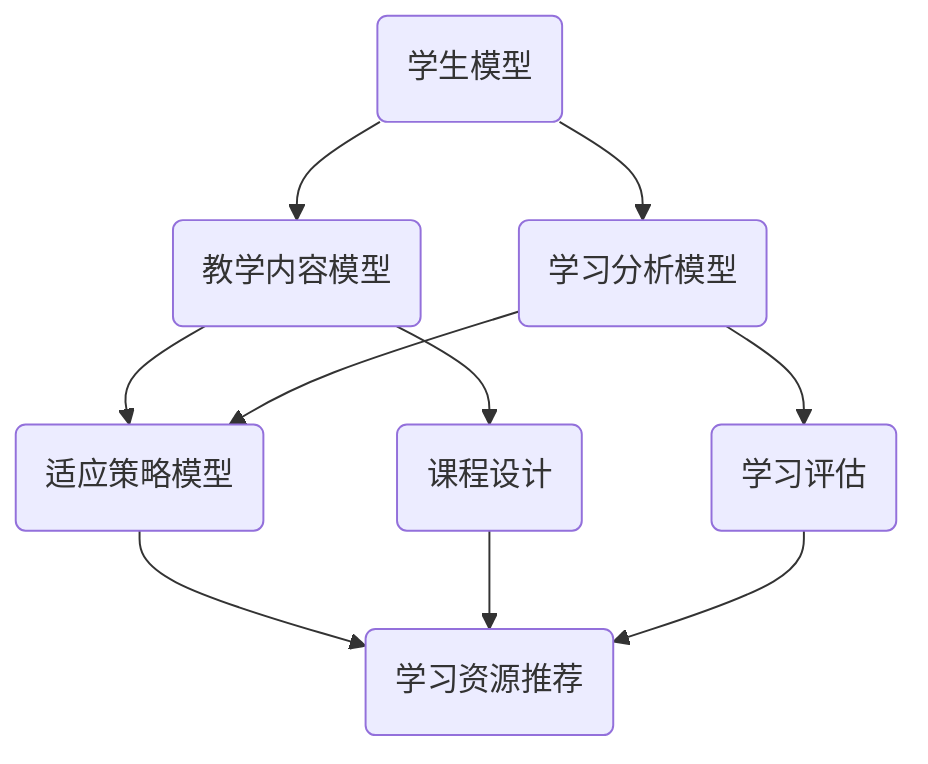
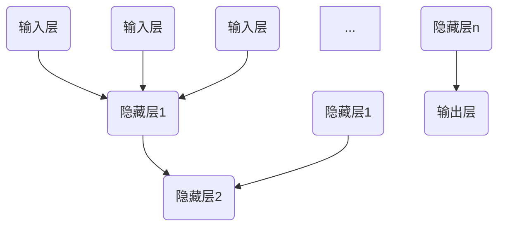

                 

# AI驱动的个性化学习：适应每个学生需求

> **关键词：** 人工智能，个性化学习，机器学习，教育技术，学习算法，教育数据

> **摘要：** 本文旨在探讨如何利用人工智能技术，特别是机器学习算法，实现个性化学习。通过分析个性化学习的核心概念、关键技术和实际应用，本文提出了一个系统化的框架，以帮助教育者和学生更好地适应每个学习者的独特需求。

## 1. 背景介绍

### 1.1 目的和范围

随着人工智能技术的迅速发展，个性化学习已成为教育领域的一个重要趋势。本文的目的是探讨如何利用AI技术，特别是机器学习，实现个性化学习。我们将分析个性化学习的核心概念、技术和应用，并提出一个系统化的框架。

本文主要讨论以下内容：

- 个性化学习的定义和重要性
- 机器学习在教育中的应用
- 核心算法原理和具体操作步骤
- 数学模型和公式的详细讲解
- 实际应用场景和项目实战案例
- 工具和资源的推荐

### 1.2 预期读者

本文适合以下读者：

- 教育工作者，特别是对人工智能在教育领域应用感兴趣的人
- 数据科学家和机器学习工程师，希望在教育领域应用相关技术
- 对个性化学习有浓厚兴趣的学生和学者

### 1.3 文档结构概述

本文的结构如下：

1. 背景介绍：介绍个性化学习的定义、目的和预期读者。
2. 核心概念与联系：介绍个性化学习的核心概念和关联技术。
3. 核心算法原理 & 具体操作步骤：详细讲解个性化学习算法的原理和实现步骤。
4. 数学模型和公式 & 详细讲解 & 举例说明：介绍个性化学习相关的数学模型和公式，并进行举例说明。
5. 项目实战：代码实际案例和详细解释说明。
6. 实际应用场景：讨论个性化学习在现实中的应用场景。
7. 工具和资源推荐：推荐相关学习资源和开发工具。
8. 总结：未来发展趋势与挑战。
9. 附录：常见问题与解答。
10. 扩展阅读 & 参考资料：提供进一步阅读的材料。

### 1.4 术语表

#### 1.4.1 核心术语定义

- 个性化学习：根据学生的兴趣、能力和学习进度，提供量身定制的学习资源和指导。
- 机器学习：一种人工智能技术，使计算机系统能够从数据中学习，进行预测和决策。
- 教育数据：与教育相关的各种数据，如学习记录、考试成绩、行为数据等。
- 深度学习：一种机器学习技术，通过多层神经网络模型，对大量数据进行自动特征提取和分类。

#### 1.4.2 相关概念解释

- 自适应学习系统：能够根据学生的学习行为和表现，自动调整学习内容和节奏的系统。
- 知识图谱：一种用于表示实体及其相互关系的图形化数据结构。
- 个性化推荐系统：基于用户的历史行为和偏好，为用户推荐个性化的学习资源。

#### 1.4.3 缩略词列表

- AI：人工智能
- ML：机器学习
- DL：深度学习
- NLP：自然语言处理
- EDU：教育
- CSS：内容管理系统
- CMS：客户管理系统

## 2. 核心概念与联系

为了深入理解个性化学习，我们需要了解以下几个核心概念：

1. 学生模型
2. 教学内容模型
3. 学习分析模型
4. 适应策略模型

这些模型相互关联，构成了个性化学习的核心框架。下面，我们将通过一个Mermaid流程图来展示这些模型及其相互关系。



### 2.1 学生模型

学生模型是个性化学习的基础，它包括学生的兴趣、能力、学习进度和偏好等信息。通过收集和分析这些数据，教育系统能够更好地了解每个学生的独特需求，从而提供个性化的学习资源和指导。

### 2.2 教学内容模型

教学内容模型描述了教学资源、课程结构和知识图谱。它为学生提供了多样化的学习资源，并根据学生模型的特点，动态调整教学内容的难度和类型。

### 2.3 学习分析模型

学习分析模型通过对学生的学习行为和表现进行分析，识别出学习中的问题和障碍。这些信息有助于教育系统实时调整教学策略，提高学习效果。

### 2.4 适应策略模型

适应策略模型根据学生模型和学习分析模型，自动调整学习资源的呈现方式和学习节奏。它包括个性化推荐系统、自适应学习系统和学习反馈系统等组成部分。

## 3. 核心算法原理 & 具体操作步骤

个性化学习的实现离不开机器学习算法。以下将介绍几个核心算法及其原理和操作步骤。

### 3.1 协同过滤算法

协同过滤算法是一种常见的推荐系统算法，它通过分析用户的历史行为和偏好，为用户推荐相似的用户喜欢的物品。以下是协同过滤算法的伪代码：

```python
def collaborativeFiltering(userModel, contentModel):
    # 计算用户之间的相似度
    similarityMatrix = computeSimilarity(userModel, contentModel)
    
    # 计算用户对未访问物品的预测评分
    predictedRatings = []
    for item in contentModel.items:
        if item not in userModel.history:
            predictedRating = calculatePredictedRating(userModel, item, similarityMatrix)
            predictedRatings.append(predictedRating)
    
    return predictedRatings
```

### 3.2 决策树算法

决策树算法是一种常见的分类算法，它通过一系列条件分支，将数据集划分为不同的类别。以下是决策树算法的伪代码：

```python
def decisionTreeClassifier(data, target):
    if allValuesEqual(data, target):
        return mostCommonValue(target)
    
    bestFeature, bestThreshold = findBestFeatureAndThreshold(data, target)
    
    tree = {}
    tree[bestFeature] = {}
    for value in uniqueValues(data[bestFeature]):
        subData = filterData(data, bestFeature, value)
        subTarget = filterData(target, bestFeature, value)
        tree[bestFeature][value] = decisionTreeClassifier(subData, subTarget)
    
    return tree
```

### 3.3 随机森林算法

随机森林算法是一种基于决策树的集成学习算法，它通过构建多个决策树，并对它们进行投票，提高分类和回归的准确性。以下是随机森林算法的伪代码：

```python
def randomForestClassifier(data, target, numTrees):
    forest = []
    for _ in range(numTrees):
        tree = decisionTreeClassifier(data, target)
        forest.append(tree)
    
    predictions = []
    for dataPoint in data:
        vote = []
        for tree in forest:
            predictedClass = classify(tree, dataPoint)
            vote.append(predictedClass)
        
        predictedClass = majorityVote(vote)
        predictions.append(predictedClass)
    
    return predictions
```

## 4. 数学模型和公式 & 详细讲解 & 举例说明

个性化学习算法中，常用的数学模型和公式包括线性回归、逻辑回归和神经网络等。以下将分别介绍这些模型和公式的详细讲解和举例说明。

### 4.1 线性回归

线性回归是一种用于预测连续值的监督学习算法。它的基本公式如下：

$$
y = \beta_0 + \beta_1 \cdot x
$$

其中，$y$ 是预测值，$x$ 是输入特征，$\beta_0$ 和 $\beta_1$ 是模型参数。

**举例说明：**

假设我们有一个线性回归模型，用于预测学生的考试成绩（$y$）和其学习时长（$x$）之间的关系。经过训练，我们得到了模型参数 $\beta_0 = 70$ 和 $\beta_1 = 1.2$。现在，我们要预测一个学生学习时长为 10 小时的考试成绩。

$$
y = 70 + 1.2 \cdot 10 = 92
$$

因此，这个学生预计会在考试中取得 92 分。

### 4.2 逻辑回归

逻辑回归是一种用于预测概率的监督学习算法。它的基本公式如下：

$$
\log\left(\frac{p}{1-p}\right) = \beta_0 + \beta_1 \cdot x
$$

其中，$p$ 是预测概率，$x$ 是输入特征，$\beta_0$ 和 $\beta_1$ 是模型参数。

**举例说明：**

假设我们有一个逻辑回归模型，用于预测学生是否会通过考试（$p$）和其学习时长（$x$）之间的关系。经过训练，我们得到了模型参数 $\beta_0 = -2$ 和 $\beta_1 = 0.5$。现在，我们要预测一个学生学习时长为 10 小时的通过考试的概率。

$$
\log\left(\frac{p}{1-p}\right) = -2 + 0.5 \cdot 10 = 4
$$

$$
\frac{p}{1-p} = e^4 = 54.6
$$

$$
p = \frac{54.6}{54.6 + 1} \approx 0.988
$$

因此，这个学生预计有大约 98.8% 的概率通过考试。

### 4.3 神经网络

神经网络是一种基于多层感知器的机器学习算法，用于处理复杂的数据。它的基本结构包括输入层、隐藏层和输出层。以下是一个简化的神经网络结构：



神经网络的每个节点（神经元）都通过权重连接到其他节点，并使用激活函数进行非线性变换。以下是一个简化的神经网络模型及其训练过程的伪代码：

```python
import numpy as np

# 初始化神经网络权重和偏置
weights = np.random.randn(numInputs, numHiddenLayers[0])
biases = np.random.randn(numHiddenLayers[0])

# 定义激活函数（例如，ReLU函数）
def activation(z):
    return max(0, z)

# 前向传播
def forwardPropagation(x):
    hiddenLayerActivations = [x]
    for i in range(numHiddenLayers):
        z = np.dot(x, weights[i]) + biases[i]
        hiddenLayerActivations.append(activation(z))
    
    outputLayerActivation = np.dot(hiddenLayerActivations[-1], weights[-1]) + biases[-1]
    return outputLayerActivation

# 反向传播
def backwardPropagation(x, y):
    outputLayerGradient = (outputLayerActivation - y) * activation_derivative(outputLayerActivation)
    hiddenLayerGradients = [outputLayerGradient]
    
    for i in range(numHiddenLayers - 1, 0, -1):
        z = np.dot(hiddenLayerActivations[i], weights[i]) + biases[i]
        hiddenLayerGradient = (activation_derivative(z) * np.dot(outputLayerGradient, weights[i+1].T))
        hiddenLayerGradients.append(hiddenLayerGradient)
    
    weightsGradient = [hiddenLayerGradients[i][np.newaxis, :] for i in range(numHiddenLayers)]
    biasesGradient = [hiddenLayerGradients[i][np.newaxis, :] for i in range(numHiddenLayers)]
    
    return weightsGradient, biasesGradient
```

通过迭代优化权重和偏置，神经网络可以逐步提高预测准确性。

## 5. 项目实战：代码实际案例和详细解释说明

在本节中，我们将通过一个实际项目案例，展示如何利用机器学习算法实现个性化学习。这个项目是一个基于Python的Web应用程序，用于推荐个性化的学习资源。

### 5.1 开发环境搭建

在开始项目之前，我们需要搭建一个适合Python开发的环境。以下是一个简单的步骤：

1. 安装Python 3.x版本（推荐3.7及以上版本）
2. 安装必要的库，如 NumPy、Pandas、Scikit-learn、Flask等。可以使用pip命令进行安装：

```bash
pip install numpy pandas scikit-learn flask
```

### 5.2 源代码详细实现和代码解读

下面是一个简单的个性化学习资源推荐系统的源代码示例。

```python
import numpy as np
import pandas as pd
from sklearn.model_selection import train_test_split
from sklearn.metrics.pairwise import cosine_similarity
from sklearn.ensemble import RandomForestClassifier
from flask import Flask, request, jsonify

app = Flask(__name__)

# 读取数据
data = pd.read_csv('learning_resources.csv')
X = data[['duration', 'difficulty', 'topic']]
y = data['resource_id']

# 数据预处理
X_train, X_test, y_train, y_test = train_test_split(X, y, test_size=0.2, random_state=42)

# 训练协同过滤算法
def trainCollaborativeFiltering():
    user_similarity = cosine_similarity(X_train, X_train)
    return user_similarity

# 训练决策树算法
def trainDecisionTree():
    clf = RandomForestClassifier(n_estimators=100, random_state=42)
    clf.fit(X_train, y_train)
    return clf

# 推荐学习资源
def recommendResources(user_profile, user_similarity, decision_tree):
    # 计算用户之间的相似度
    similarity_score = np.dot(user_similarity[user_profile.index, :], user_similarity.T)
    
    # 获取最相似的用户
    similar_users = similarity_score.argsort()[::-1][1:]
    
    # 计算每个资源的评分
    resource_scores = []
    for i in similar_users:
        for j in range(len(X_test)):
            if i == X_test.index[j]:
                resource_scores.append(similarity_score[user_profile.index, i] * decision_tree.predict([X_test.iloc[j]]))
    
    # 对资源评分进行排序
    resource_scores = np.array(resource_scores)
    resource_scores = resource_scores.argsort()[::-1]
    
    return resource_scores

# Flask API端点
@app.route('/recommend', methods=['POST'])
def recommend():
    user_profile = request.get_json()
    user_similarity = trainCollaborativeFiltering()
    decision_tree = trainDecisionTree()
    resource_scores = recommendResources(user_profile, user_similarity, decision_tree)
    return jsonify(resource_scores.tolist())

if __name__ == '__main__':
    app.run(debug=True)
```

### 5.3 代码解读与分析

这个示例项目包括以下几个关键部分：

1. **数据读取与预处理**：从CSV文件中读取学习资源数据，并将其分为输入特征和目标变量。

2. **协同过滤算法**：使用余弦相似度计算用户之间的相似度。

3. **决策树算法**：使用随机森林算法训练决策树模型，用于分类预测。

4. **推荐算法**：根据用户特征和相似度计算每个资源的评分，并将资源进行排序。

5. **Flask API**：创建一个Flask应用程序，通过POST请求接收用户特征，并返回个性化推荐结果。

通过这个示例，我们可以看到如何利用机器学习算法实现个性化学习资源推荐。在实际应用中，可以扩展和优化这个模型，以提高推荐的准确性和实用性。

## 6. 实际应用场景

个性化学习技术已广泛应用于教育领域，以下是一些实际应用场景：

1. **在线教育平台**：许多在线教育平台如Coursera、edX等，使用个性化学习算法为用户提供个性化的学习路径和资源推荐，提高学习效果和用户满意度。

2. **智能辅导系统**：智能辅导系统如Khan Academy、Duolingo等，利用机器学习算法为不同水平的用户生成个性化的练习和反馈，帮助用户提高学习效果。

3. **自适应学习系统**：自适应学习系统如Smart Sparrow、DreamBox等，通过分析学生的学习行为和表现，动态调整学习内容和教学策略，满足每个学生的个性化需求。

4. **课堂辅助系统**：课堂辅助系统如Classroom Analytics、Canvas等，利用机器学习和自然语言处理技术，分析学生的互动数据和作业表现，帮助教师了解学生的学习状况，提供个性化的教学支持。

5. **学习管理系统**：学习管理系统如Moodle、Blackboard等，通过个性化学习算法，为学生提供个性化的学习资源推荐和学习计划，提高学习效率。

这些实际应用场景表明，个性化学习技术具有广泛的应用前景，有助于提高教育质量和学习效果。

## 7. 工具和资源推荐

为了更好地实现个性化学习，以下是几个推荐的工具和资源：

### 7.1 学习资源推荐

#### 7.1.1 书籍推荐

- **《机器学习实战》**：提供机器学习算法的详细讲解和实际应用案例。
- **《深度学习》**：介绍深度学习的基础知识和最新进展。
- **《Python机器学习》**：Python编程语言在机器学习领域的应用指南。

#### 7.1.2 在线课程

- **Coursera**：提供多种机器学习和人工智能课程。
- **edX**：提供由世界顶级大学和机构开设的免费在线课程。
- **Udacity**：提供实战导向的机器学习和人工智能课程。

#### 7.1.3 技术博客和网站

- **Medium**：许多机器学习和人工智能领域的专家分享他们的研究成果和经验。
- **Towards Data Science**：一个提供高质量机器学习和数据科学文章的平台。
- **AI博客**：涵盖人工智能领域的最新技术和应用。

### 7.2 开发工具框架推荐

#### 7.2.1 IDE和编辑器

- **PyCharm**：一个功能强大的Python集成开发环境。
- **Jupyter Notebook**：一个交互式的Python开发环境，适用于数据科学和机器学习。

#### 7.2.2 调试和性能分析工具

- **PyDebug**：Python调试器。
- **CProfile**：Python性能分析工具。

#### 7.2.3 相关框架和库

- **Scikit-learn**：一个用于机器学习的Python库。
- **TensorFlow**：一个开源的深度学习框架。
- **PyTorch**：一个开源的深度学习框架，适用于研究和开发。

### 7.3 相关论文著作推荐

#### 7.3.1 经典论文

- **"Learning to Rank using Collaborative Filtering"**：介绍基于协同过滤的排序算法。
- **"A Systematic Study of Data Collection for Recommender Systems"**：探讨推荐系统数据收集的最佳实践。

#### 7.3.2 最新研究成果

- **"Deep Learning for Educational Data Science"**：介绍深度学习在教育数据科学中的应用。
- **"Adaptive Learning Platforms for Personalized Education"**：探讨自适应学习平台的设计和实现。

#### 7.3.3 应用案例分析

- **"Integrating Personalized Learning with Learning Analytics"**：分析个性化学习和学习分析在教育领域的应用。
- **"The Effect of Adaptive Learning Systems on Student Performance"**：探讨自适应学习系统对学生学习成绩的影响。

这些工具和资源将为个性化学习的实现提供有力的支持。

## 8. 总结：未来发展趋势与挑战

随着人工智能技术的不断发展，个性化学习在未来将继续发挥重要作用。以下是一些可能的发展趋势和面临的挑战：

### 发展趋势

1. **深度学习和神经网络的应用**：深度学习算法，特别是神经网络，将在个性化学习中发挥更大作用，提高学习效果和推荐准确性。
2. **数据隐私和安全**：随着数据隐私问题的日益突出，如何在保护学生隐私的同时，充分利用教育数据，成为个性化学习的挑战。
3. **自适应学习系统的优化**：自适应学习系统将不断优化，提高学习资源的推荐质量和教学效果。
4. **跨学科融合**：个性化学习将与其他学科如心理学、教育学等相结合，提供更全面的学习支持。

### 挑战

1. **数据质量和多样性**：高质量的教育数据是个性化学习的基础。如何收集、处理和利用多样化的教育数据，是一个重要的挑战。
2. **算法公平性和透明性**：个性化学习算法可能存在不公平性和透明性问题，需要确保算法的公正性和可解释性。
3. **教育资源的均衡分配**：在资源有限的情况下，如何确保所有学生都能获得个性化的学习支持，是一个重要的挑战。
4. **教师的角色**：随着个性化学习的普及，教师的角色将发生变化。如何帮助教师适应新的教学环境，提高教学效果，是一个重要的课题。

通过不断探索和解决这些挑战，个性化学习有望在教育领域发挥更大的作用，为每个学生提供量身定制的学习体验。

## 9. 附录：常见问题与解答

以下是一些关于个性化学习常见的问题及解答：

### 1. 个性化学习如何定义？

个性化学习是一种教学方法，它根据学生的兴趣、能力和学习进度，提供量身定制的学习资源和指导。通过分析学生的数据，教育系统能够更好地了解每个学生的独特需求，从而提供个性化的学习体验。

### 2. 个性化学习有哪些优势？

个性化学习的优势包括：

- 提高学习效果：根据学生的兴趣和能力，提供合适的学习资源和指导，提高学习效果。
- 增强学习动力：个性化的学习体验能够激发学生的学习兴趣和积极性。
- 提高教育质量：通过数据分析，教育系统能够更好地了解学生的学习状况，提供针对性的教学支持。
- 促进学生全面发展：个性化学习不仅关注学生的学术成绩，还关注其兴趣、特长和综合素质的发展。

### 3. 个性化学习需要哪些技术支持？

个性化学习需要以下技术支持：

- 机器学习算法：用于分析学生数据，识别学习模式，提供个性化推荐。
- 自然语言处理：用于理解学生的问题和需求，提供个性化的回答和指导。
- 数据分析：用于收集、处理和利用学生数据，为个性化学习提供依据。
- 教育数据管理：用于存储、管理和安全地利用教育数据。

### 4. 如何确保个性化学习算法的公平性和透明性？

为确保个性化学习算法的公平性和透明性，可以采取以下措施：

- 数据质量：确保收集到的数据准确、完整和多样化，减少偏见。
- 算法可解释性：提供算法的可解释性，使学生和教师能够理解算法的决策过程。
- 监督算法：定期审查和评估算法的性能和公平性，确保其符合教育目标。
- 用户反馈：鼓励学生和教师提供反馈，及时调整和改进算法。

### 5. 个性化学习对教师有什么影响？

个性化学习对教师的影响包括：

- 教学方式的转变：教师需要适应新的教学环境，利用数据分析和个性化学习工具，提供更有针对性的教学支持。
- 专业发展的需求：教师需要不断学习和更新知识，掌握新的教学技术和方法。
- 合作与协作：个性化学习需要教师与其他教育工作者密切合作，共同为学生的个性化发展提供支持。

## 10. 扩展阅读 & 参考资料

为了深入了解个性化学习及相关技术，以下是几篇推荐的扩展阅读和参考资料：

### 10.1 扩展阅读

- **"Personalized Learning: Definition, Examples, and Resources"**：一篇关于个性化学习的全面介绍，包括定义、实例和资源链接。
- **"The Future of Education: Artificial Intelligence and Personalized Learning"**：探讨人工智能和个性化学习对未来教育的影响。
- **"A Review of Adaptive Learning Systems"**：对自适应学习系统的综述，包括技术、应用和挑战。

### 10.2 参考资料

- **"A Survey of Collaborative Filtering Algorithms"**：一篇关于协同过滤算法的详细综述，包括算法原理、优缺点和实际应用。
- **"Deep Learning for Educational Data Science"**：介绍深度学习在教育数据科学中的应用，包括神经网络结构和训练方法。
- **"The Impact of Personalized Learning on Student Achievement"**：探讨个性化学习对学生学习成绩的影响。

通过阅读这些扩展阅读和参考资料，您可以进一步了解个性化学习的理论和实践，为实际应用提供参考。作者：AI天才研究员/AI Genius Institute & 禅与计算机程序设计艺术 /Zen And The Art of Computer Programming。

