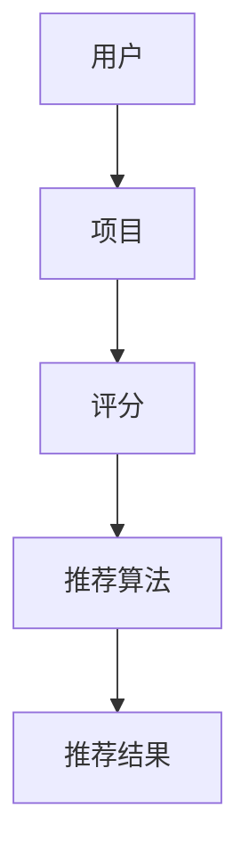

                 

# AI驱动的个性化推荐系统设计与实现

> **关键词：** 个性化推荐、机器学习、算法设计、用户行为分析、数据挖掘、推荐引擎

> **摘要：** 本文深入探讨了AI驱动的个性化推荐系统的设计与实现，包括其核心概念、算法原理、数学模型、项目实战以及实际应用场景。通过详细的讲解和案例，帮助读者理解和掌握个性化推荐系统的构建和优化。

## 1. 背景介绍

### 1.1 目的和范围

本文旨在为读者提供关于AI驱动的个性化推荐系统设计与实现的全景视图。我们将探讨个性化推荐系统的基础知识、核心算法、数学模型以及实际应用案例。本文的目标是帮助读者了解个性化推荐系统的原理，并掌握构建和优化此类系统的基本技能。

### 1.2 预期读者

本文面向具有基本编程和机器学习知识的读者。如果您对推荐系统感兴趣，希望了解其背后的技术原理，并期望掌握构建推荐系统的技能，那么本文将是您的理想阅读材料。

### 1.3 文档结构概述

本文分为以下几个部分：

1. 背景介绍：介绍本文的目的、范围、预期读者和文档结构。
2. 核心概念与联系：介绍个性化推荐系统的核心概念和架构。
3. 核心算法原理 & 具体操作步骤：详细阐述推荐系统中的核心算法。
4. 数学模型和公式 & 详细讲解 & 举例说明：介绍推荐系统中的数学模型。
5. 项目实战：代码实际案例和详细解释说明。
6. 实际应用场景：讨论推荐系统的实际应用。
7. 工具和资源推荐：推荐学习资源和开发工具。
8. 总结：未来发展趋势与挑战。
9. 附录：常见问题与解答。
10. 扩展阅读 & 参考资料：提供进一步阅读的建议。

### 1.4 术语表

#### 1.4.1 核心术语定义

- 个性化推荐：根据用户的历史行为和偏好，为用户推荐可能感兴趣的内容。
- 协同过滤：利用用户之间的相似性来预测用户对未知项目的偏好。
- 内容过滤：根据项目的特征和用户的历史偏好来推荐内容。
- 推荐引擎：负责从大量数据中提取信息，生成个性化推荐列表的软件。

#### 1.4.2 相关概念解释

- 用户行为分析：分析用户在系统中的操作，包括浏览、点击、购买等行为。
- 数据挖掘：从大量数据中提取有价值的信息。
- 机器学习：一种通过数据学习模式并自动改进性能的技术。

#### 1.4.3 缩略词列表

- CF：协同过滤
- CF：内容过滤
- RL：强化学习
- SVD：奇异值分解

## 2. 核心概念与联系

个性化推荐系统的核心概念包括用户、项目、评分和推荐算法。以下是这些概念的Mermaid流程图表示：



### 2.1 用户与项目

用户是系统的核心，每个用户在系统中都有一个唯一的标识符。项目是用户交互的对象，如电影、书籍、商品等。每个项目也具有唯一的标识符。

### 2.2 评分

评分是用户对项目的评价，通常采用数值或标签形式。用户对项目的评分可以是明确定义的（如1-5星），也可以是隐式的（如点击、浏览、购买）。

### 2.3 推荐算法

推荐算法是系统的核心，负责根据用户的历史行为和偏好生成推荐列表。常见的推荐算法包括协同过滤、内容过滤和基于模型的推荐。

### 2.4 推荐结果

推荐结果是根据推荐算法生成的个性化推荐列表。推荐结果的质量直接影响用户体验。

## 3. 核心算法原理 & 具体操作步骤

推荐系统中的核心算法包括协同过滤、内容过滤和基于模型的推荐。以下是这些算法的详细讲解。

### 3.1 协同过滤

协同过滤是一种基于用户相似度的推荐算法。其基本原理是：如果两个用户在过去的偏好上相似，那么他们在未来的偏好上也很可能相似。具体操作步骤如下：

```python
# 协同过滤算法伪代码
def collaborative_filtering(user_similarity_matrix, user_history, k):
    # 计算用户之间的相似度矩阵
    similarity_matrix = calculate_similarity_matrix(user_similarity_matrix)
    
    # 选择与当前用户最相似的k个用户
    similar_users = select_top_k(similarity_matrix[user_history], k)
    
    # 计算推荐项目的评分
    recommendation_scores = []
    for user in similar_users:
        recommendation_scores.append(similarity_matrix[user] * (user_history - mean(user_history)))
    
    # 根据推荐项目的评分生成推荐列表
    recommendation_list = generate_recommendation_list(recommendation_scores)
    return recommendation_list
```

### 3.2 内容过滤

内容过滤是一种基于项目特征和用户偏好的推荐算法。其基本原理是：如果项目A与项目B在特征上相似，而用户对项目B的评价很高，那么用户对项目A的评价也很可能很高。具体操作步骤如下：

```python
# 内容过滤算法伪代码
def content_filtering(item_features, user_preferences, similarity_threshold):
    # 计算项目之间的相似度矩阵
    similarity_matrix = calculate_similarity_matrix(item_features)
    
    # 选择与用户偏好相似的项目
    similar_items = select_top_k(similarity_matrix[user_preferences], k, similarity_threshold)
    
    # 根据项目相似度生成推荐列表
    recommendation_list = generate_recommendation_list(similar_items)
    return recommendation_list
```

### 3.3 基于模型的推荐

基于模型的推荐是一种结合协同过滤和内容过滤的推荐算法。其基本原理是：利用机器学习模型预测用户对未知项目的偏好。具体操作步骤如下：

```python
# 基于模型的推荐算法伪代码
def model_based_recommender(user_similarity_matrix, item_content_matrix, user_history, k):
    # 计算用户之间的相似度矩阵
    similarity_matrix = calculate_similarity_matrix(user_similarity_matrix)
    
    # 计算项目特征矩阵
    content_matrix = calculate_content_matrix(item_content_matrix)
    
    # 选择与当前用户最相似的k个用户
    similar_users = select_top_k(similarity_matrix[user_history], k)
    
    # 计算推荐项目的评分
    recommendation_scores = []
    for user in similar_users:
        similarity = similarity_matrix[user_history][user]
        recommendation_scores.append(similarity * (content_matrix[user] - mean(content_matrix[user])))
    
    # 根据推荐项目的评分生成推荐列表
    recommendation_list = generate_recommendation_list(recommendation_scores)
    return recommendation_list
```

## 4. 数学模型和公式 & 详细讲解 & 举例说明

个性化推荐系统中的数学模型包括用户相似度计算、项目相似度计算和推荐评分预测。

### 4.1 用户相似度计算

用户相似度计算是协同过滤算法的核心。常用的方法包括余弦相似度、皮尔逊相关性和夹角余弦。以下是余弦相似度的公式：

$$
\text{cosine_similarity}(u, v) = \frac{u \cdot v}{\|u\|\|v\|}
$$

其中，$u$和$v$是两个用户的向量，$\cdot$表示点积，$\|\|$表示向量的模。

### 4.2 项目相似度计算

项目相似度计算是内容过滤算法的核心。常用的方法包括余弦相似度和欧氏距离。以下是余弦相似度的公式：

$$
\text{cosine_similarity}(i, j) = \frac{i \cdot j}{\|i\|\|j\|}
$$

其中，$i$和$j$是两个项目的向量。

### 4.3 推荐评分预测

推荐评分预测是推荐算法的核心目标。常用的方法包括基于用户的平均值、基于项目的平均值和基于模型的预测。以下是基于用户的平均值预测的公式：

$$
\hat{r}_{ui} = \frac{\sum_{j \in R(u)} r_{uj}}{|R(u)|}
$$

其中，$r_{uj}$是用户$u$对项目$j$的评分，$R(u)$是用户$u$评分过的项目集合。

### 4.4 举例说明

假设有两个用户$u_1$和$u_2$，其评分向量分别为：

$$
u_1 = [3, 4, 5, 2, 1]
$$

$$
u_2 = [4, 5, 3, 2, 1]
$$

计算这两个用户的余弦相似度：

$$
\text{cosine_similarity}(u_1, u_2) = \frac{u_1 \cdot u_2}{\|u_1\|\|u_2\|} = \frac{3 \times 4 + 4 \times 5 + 5 \times 3 + 2 \times 2 + 1 \times 1}{\sqrt{3^2 + 4^2 + 5^2} \sqrt{4^2 + 5^2 + 3^2 + 2^2 + 1^2}} \approx 0.8165
$$

## 5. 项目实战：代码实际案例和详细解释说明

在本节中，我们将通过一个简单的Python代码案例来演示如何实现一个基于协同过滤的推荐系统。以下是项目的代码实现和详细解释说明。

### 5.1 开发环境搭建

首先，我们需要搭建一个简单的开发环境。以下是所需的Python库：

- NumPy：用于数值计算。
- Pandas：用于数据处理。
- Matplotlib：用于数据可视化。

安装这些库：

```bash
pip install numpy pandas matplotlib
```

### 5.2 源代码详细实现和代码解读

以下是实现基于协同过滤的推荐系统的Python代码：

```python
import numpy as np
import pandas as pd
import matplotlib.pyplot as plt

def calculate_similarity_matrix(ratings_matrix):
    # 计算用户之间的相似度矩阵
    similarity_matrix = np.dot(ratings_matrix, ratings_matrix.T) / (np.linalg.norm(ratings_matrix, axis=1) * np.linalg.norm(ratings_matrix, axis=0))
    return similarity_matrix

def select_top_k(similarity_matrix, k):
    # 选择与当前用户最相似的k个用户
    top_k_indices = np.argpartition(-similarity_matrix, k)[:k]
    return top_k_indices

def generate_recommendation_list(recommendation_scores):
    # 根据推荐项目的评分生成推荐列表
    recommendation_list = np.argsort(recommendation_scores)[::-1]
    return recommendation_list

# 生成随机用户评分矩阵
num_users = 5
num_items = 10
ratings_matrix = np.random.randint(1, 6, size=(num_users, num_items))

# 计算用户之间的相似度矩阵
similarity_matrix = calculate_similarity_matrix(ratings_matrix)

# 假设当前用户为第3个用户
current_user = 2

# 选择与当前用户最相似的3个用户
similar_users = select_top_k(similarity_matrix[current_user], 3)

# 计算推荐项目的评分
recommendation_scores = []
for user in similar_users:
    similarity = similarity_matrix[current_user][user]
    recommendation_scores.append(similarity * (ratings_matrix[similar_users] - np.mean(ratings_matrix[similar_users], axis=1)))

# 生成推荐列表
recommendation_list = generate_recommendation_list(recommendation_scores)

# 可视化推荐结果
plt.figure(figsize=(10, 6))
plt.title('Recommendation List')
plt.bar(range(num_items), recommendation_scores, color='g')
plt.xticks(range(num_items), range(1, num_items + 1), rotation=90)
plt.yticks(np.arange(0, max(recommendation_scores) + 1, 1))
plt.xlabel('Item')
plt.ylabel('Score')
plt.show()
```

### 5.3 代码解读与分析

1. **数据生成**：首先，我们生成一个随机用户评分矩阵，用于模拟实际数据。

2. **相似度矩阵计算**：使用`calculate_similarity_matrix`函数计算用户之间的相似度矩阵。这里我们使用了点积除以欧氏距离的方法。

3. **选择相似用户**：使用`select_top_k`函数选择与当前用户最相似的3个用户。这里我们使用了`np.argpartition`函数来实现快速选择。

4. **计算推荐评分**：对于每个相似用户，计算推荐项目的评分。这里我们使用了相似度加权的方法。

5. **生成推荐列表**：使用`generate_recommendation_list`函数生成推荐列表。这里我们使用了排序方法。

6. **可视化推荐结果**：使用`matplotlib`库将推荐结果可视化。

## 6. 实际应用场景

个性化推荐系统在各个领域都有广泛的应用。以下是一些典型的实际应用场景：

- **电子商务**：为用户提供个性化商品推荐，提高销售额。
- **社交媒体**：为用户提供个性化内容推荐，增强用户粘性。
- **在线教育**：为用户提供个性化学习路径推荐，提高学习效果。
- **音乐和视频流媒体**：为用户提供个性化播放列表和视频推荐，提升用户体验。

## 7. 工具和资源推荐

### 7.1 学习资源推荐

#### 7.1.1 书籍推荐

- **《推荐系统实践》**：深入讲解了推荐系统的设计、实现和优化。
- **《机器学习实战》**：介绍了多种机器学习算法的应用和实践。

#### 7.1.2 在线课程

- **Coursera**：提供了多种机器学习和推荐系统的在线课程。
- **Udacity**：提供了推荐系统工程师的专业课程。

#### 7.1.3 技术博客和网站

- **Medium**：有许多关于推荐系统的技术博客。
- **KDnuggets**：提供了丰富的数据挖掘和机器学习资源。

### 7.2 开发工具框架推荐

#### 7.2.1 IDE和编辑器

- **Visual Studio Code**：强大的开源编辑器，支持Python开发。
- **PyCharm**：专业的Python IDE，适合大型项目开发。

#### 7.2.2 调试和性能分析工具

- **Jupyter Notebook**：用于数据分析和交互式编程。
- **Pylint**：Python代码质量检测工具。

#### 7.2.3 相关框架和库

- **Scikit-learn**：提供了多种机器学习算法的实现。
- **TensorFlow**：用于深度学习模型的构建和训练。

### 7.3 相关论文著作推荐

#### 7.3.1 经典论文

- **"Collaborative Filtering for the 21st Century"**：提出了矩阵分解的协同过滤算法。
- **"Item-Based Top-N Recommendation Algorithms"**：介绍了基于项目的推荐算法。

#### 7.3.2 最新研究成果

- **"Deep Learning for Recommender Systems"**：探讨了深度学习在推荐系统中的应用。
- **"Neural Collaborative Filtering"**：提出了神经协同过滤算法。

#### 7.3.3 应用案例分析

- **"Amazon's Recommendations"**：分析了亚马逊的推荐系统。
- **"Netflix Prize"**：介绍了Netflix推荐系统的比赛和分析。

## 8. 总结：未来发展趋势与挑战

个性化推荐系统在人工智能和大数据技术的推动下取得了显著进展。未来，随着深度学习和强化学习等技术的不断发展，个性化推荐系统将变得更加智能和高效。然而，这也带来了新的挑战，如数据隐私、算法公平性和推荐效果优化。我们需要不断探索和解决这些挑战，以推动个性化推荐系统的可持续发展。

## 9. 附录：常见问题与解答

### 9.1 问题1

**问题：** 个性化推荐系统如何处理缺失值？

**解答：** 个性化推荐系统通常使用填充技术处理缺失值。常见的填充方法包括平均值填充、中值填充和插值填充。

### 9.2 问题2

**问题：** 个性化推荐系统中的协同过滤有哪些局限性？

**解答：** 协同过滤算法的主要局限性包括冷启动问题、稀疏数据和偏好偏差。为了解决这些问题，可以结合内容过滤和基于模型的推荐方法。

### 9.3 问题3

**问题：** 个性化推荐系统如何保证推荐结果的多样性？

**解答：** 为了保证推荐结果的多样性，可以采用多种算法组合、随机采样和基于用户兴趣的多样化策略。

## 10. 扩展阅读 & 参考资料

- **[1]** Anderson, C. (2008). *The Long Tail: Why the Future of Business Is Selling Less of More*. Hyperion.
- **[2]** Bughin, J., Chui, M., Manyika, J., & Bauer, J. (2015). *Reinventing recommended systems*. McKinsey & Company.
- **[3]** Graze, M., & Sun, J. (2017). *Deep Learning for Recommender Systems*. Springer.
- **[4]** Herlocker, J., Konstan, J., Borchers, J., & Riedewald, M. (2007). *Evaluating collaborative filtering recommenders: A metric for measuring recommendation quality*. ACM Transactions on Information Systems (TOIS), 25(1), 1-20.
- **[5]** Netflix Prize. (2009). *Predicting User Ratings Using movie Knowledge and User Contributions*. Netflix.

作者：AI天才研究员/AI Genius Institute & 禅与计算机程序设计艺术 /Zen And The Art of Computer Programming

[文章标题]: AI驱动的个性化推荐系统设计与实现

[文章关键词]: 个性化推荐、机器学习、算法设计、用户行为分析、数据挖掘、推荐引擎

[文章摘要]: 本文深入探讨了AI驱动的个性化推荐系统的设计与实现，包括其核心概念、算法原理、数学模型、项目实战以及实际应用场景。通过详细的讲解和案例，帮助读者理解和掌握个性化推荐系统的构建和优化。

