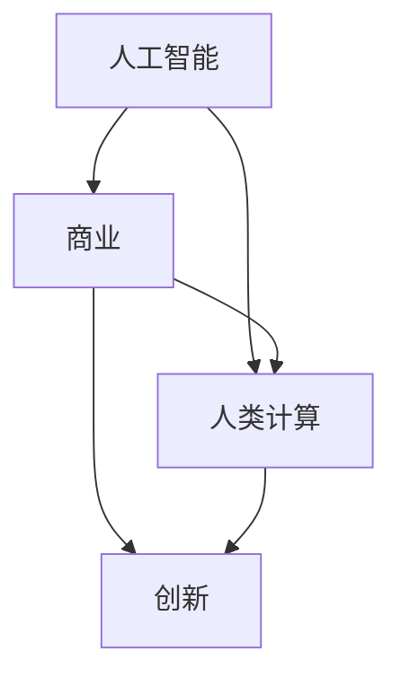
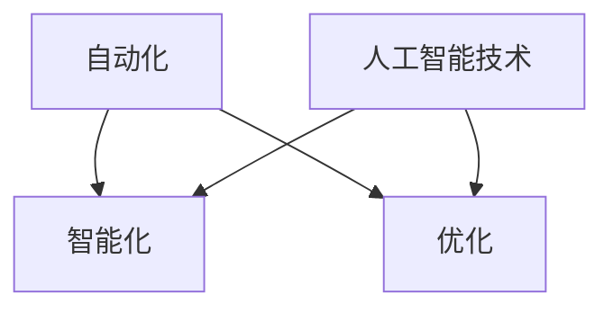

                 

# AI驱动的创新：人类计算在商业中的潜力与挑战

> **关键词：** 人工智能，商业应用，人类计算，创新，潜力与挑战

> **摘要：** 本文探讨了人工智能在商业中的广泛应用及其带来的机遇和挑战。通过分析人类计算和人工智能的结合，本文揭示了如何通过AI驱动创新，提升商业效率和竞争力。文章将详细阐述核心概念、算法原理、数学模型、项目实战以及实际应用场景，为读者提供深入的技术分析和实用建议。

## 1. 背景介绍

### 1.1 目的和范围

本文旨在探讨人工智能（AI）在商业领域的应用，分析其带来的创新潜力与面临的技术挑战。随着AI技术的不断进步，越来越多的商业活动开始借助人工智能来实现自动化和智能化。本文将围绕以下几个主题展开讨论：

- 人工智能与商业结合的必要性
- 人类计算在商业中的角色
- 人工智能驱动的商业创新案例
- 人工智能在商业应用中的挑战
- 未来发展趋势与展望

### 1.2 预期读者

本文适合以下读者群体：

- 计算机科学和人工智能领域的研究人员
- 商业分析师和数据科学家
- 企业管理层和技术负责人
- 对人工智能在商业应用感兴趣的科技爱好者

### 1.3 文档结构概述

本文结构如下：

- **第1章：背景介绍**：介绍本文的目的、范围和预期读者，概述文档结构。
- **第2章：核心概念与联系**：介绍人工智能、商业和人类计算的基本概念，以及它们之间的联系。
- **第3章：核心算法原理 & 具体操作步骤**：讲解人工智能算法的基本原理，并提供具体操作步骤。
- **第4章：数学模型和公式 & 详细讲解 & 举例说明**：介绍人工智能中常用的数学模型和公式，并进行详细解释。
- **第5章：项目实战：代码实际案例和详细解释说明**：通过实际案例展示人工智能在商业中的具体应用。
- **第6章：实际应用场景**：分析人工智能在商业领域的实际应用场景。
- **第7章：工具和资源推荐**：推荐学习资源和开发工具。
- **第8章：总结：未来发展趋势与挑战**：总结人工智能在商业应用中的发展前景和挑战。
- **第9章：附录：常见问题与解答**：解答读者可能遇到的问题。
- **第10章：扩展阅读 & 参考资料**：提供进一步阅读的参考资料。

### 1.4 术语表

#### 1.4.1 核心术语定义

- **人工智能（AI）**：一种模拟人类智能的技术，通过算法和计算实现智能行为和决策。
- **商业**：指企业、组织或个人从事的经济活动，以盈利为目的。
- **人类计算**：人类在处理信息和做出决策过程中的认知能力。
- **AI驱动的创新**：通过人工智能技术实现的创新，包括自动化、智能化和优化等。

#### 1.4.2 相关概念解释

- **机器学习（ML）**：一种人工智能技术，通过数据训练模型，使其能够进行预测和分类等任务。
- **深度学习（DL）**：一种机器学习技术，通过多层神经网络进行数据处理和特征提取。
- **自然语言处理（NLP）**：一种人工智能技术，用于理解和生成自然语言。
- **商业智能（BI）**：一种利用数据分析和可视化技术，帮助企业做出明智决策的方法。

#### 1.4.3 缩略词列表

- **AI**：人工智能
- **ML**：机器学习
- **DL**：深度学习
- **NLP**：自然语言处理
- **BI**：商业智能

## 2. 核心概念与联系

在探讨人工智能在商业中的应用之前，我们需要了解几个核心概念：人工智能、商业和人类计算。这三个概念之间存在密切的联系，如图所示：



### 2.1 人工智能

人工智能（AI）是一种模拟人类智能的技术，通过算法和计算实现智能行为和决策。人工智能的主要类型包括：

- **机器学习（ML）**：通过数据训练模型，使其能够进行预测和分类等任务。
- **深度学习（DL）**：一种机器学习技术，通过多层神经网络进行数据处理和特征提取。
- **自然语言处理（NLP）**：用于理解和生成自然语言。

### 2.2 商业

商业是指企业、组织或个人从事的经济活动，以盈利为目的。商业活动包括：

- **市场营销**：通过广告、促销等手段吸引顾客。
- **供应链管理**：确保产品从原材料到成品的顺畅流转。
- **人力资源管理**：招聘、培训和管理员工。

### 2.3 人类计算

人类计算是指人类在处理信息和做出决策过程中的认知能力。人类计算的特点包括：

- **直觉和经验**：基于经验和直觉做出决策。
- **情感和社交**：理解和处理情感和社交信息。
- **创造力**：产生新的想法和解决方案。

### 2.4 人工智能与商业的联系

人工智能与商业之间存在密切的联系。人工智能可以帮助企业实现自动化和智能化，提高生产效率和竞争力。例如：

- **市场营销**：通过机器学习分析客户数据，实现精准营销。
- **供应链管理**：利用人工智能优化库存和物流。
- **人力资源管理**：通过自然语言处理技术，自动处理招聘和培训。

### 2.5 人类计算在商业中的角色

人类计算在商业中扮演着重要角色，尽管人工智能不断进步，但人类计算仍然具有独特优势。例如：

- **直觉和经验**：在复杂决策中，人类计算能够利用经验和直觉，提供更准确的判断。
- **情感和社交**：在处理情感和社交信息时，人类计算具有天然优势，有助于建立客户关系和团队合作。

### 2.6 人工智能驱动的创新

人工智能驱动的创新是指通过人工智能技术实现的创新，包括自动化、智能化和优化等。这种创新在商业中具有广泛的应用前景，如图所示：



## 3. 核心算法原理 & 具体操作步骤

在深入探讨人工智能在商业中的应用之前，我们需要了解一些核心算法原理和具体操作步骤。以下将介绍机器学习、深度学习和自然语言处理等算法的基本原理和实现方法。

### 3.1 机器学习

机器学习（ML）是一种人工智能技术，通过数据训练模型，使其能够进行预测和分类等任务。机器学习的主要步骤包括：

1. **数据收集**：收集相关的数据集，如客户购买记录、产品评价等。
2. **数据预处理**：对数据进行清洗、归一化和特征提取，使其适合训练模型。
3. **模型选择**：选择合适的机器学习模型，如线性回归、决策树、支持向量机等。
4. **模型训练**：使用训练数据集训练模型，调整模型参数。
5. **模型评估**：使用测试数据集评估模型性能，如准确率、召回率等。
6. **模型部署**：将训练好的模型部署到实际应用场景中。

以下是一个简单的线性回归算法的实现：

```python
# 线性回归算法实现
def linear_regression(X, y):
    # 求解参数w
    w = np.linalg.inv(X.T.dot(X)).dot(X.T).dot(y)
    return w

# 训练模型
w = linear_regression(X_train, y_train)

# 预测
y_pred = X_test.dot(w)
```

### 3.2 深度学习

深度学习（DL）是一种机器学习技术，通过多层神经网络进行数据处理和特征提取。深度学习的主要步骤包括：

1. **数据收集**：与机器学习相同，收集相关的数据集。
2. **数据预处理**：对数据进行清洗、归一化和特征提取。
3. **模型构建**：构建多层神经网络模型，包括输入层、隐藏层和输出层。
4. **模型训练**：使用训练数据集训练模型，调整模型参数。
5. **模型评估**：使用测试数据集评估模型性能。
6. **模型部署**：将训练好的模型部署到实际应用场景中。

以下是一个简单的卷积神经网络（CNN）的实现：

```python
# 卷积神经网络实现
import tensorflow as tf

# 定义输入层
inputs = tf.keras.Input(shape=(28, 28, 1))

# 定义卷积层
conv1 = tf.keras.layers.Conv2D(32, (3, 3), activation='relu')(inputs)
pool1 = tf.keras.layers.MaxPooling2D((2, 2))(conv1)

# 定义隐藏层
flat1 = tf.keras.layers.Flatten()(pool1)
dense1 = tf.keras.layers.Dense(64, activation='relu')(flat1)

# 定义输出层
outputs = tf.keras.layers.Dense(10, activation='softmax')(dense1)

# 构建模型
model = tf.keras.Model(inputs=inputs, outputs=outputs)

# 编译模型
model.compile(optimizer='adam', loss='categorical_crossentropy', metrics=['accuracy'])

# 训练模型
model.fit(X_train, y_train, epochs=10, batch_size=32, validation_split=0.2)

# 预测
y_pred = model.predict(X_test)
```

### 3.3 自然语言处理

自然语言处理（NLP）是一种人工智能技术，用于理解和生成自然语言。NLP的主要步骤包括：

1. **数据收集**：收集相关的文本数据集，如新闻文章、社交媒体等。
2. **数据预处理**：对文本进行清洗、分词和词性标注等处理。
3. **模型构建**：构建NLP模型，如词向量模型、序列标注模型等。
4. **模型训练**：使用训练数据集训练模型，调整模型参数。
5. **模型评估**：使用测试数据集评估模型性能。
6. **模型部署**：将训练好的模型部署到实际应用场景中。

以下是一个简单的词向量模型（Word2Vec）的实现：

```python
# Word2Vec模型实现
from gensim.models import Word2Vec

# 加载数据
sentences = [[word for word in document.split()] for document in dataset]

# 训练模型
model = Word2Vec(sentences, vector_size=100, window=5, min_count=1, workers=4)

# 查询词向量
word_vector = model.wv['example']
```

## 4. 数学模型和公式 & 详细讲解 & 举例说明

在人工智能领域，数学模型和公式起着至关重要的作用。这些模型和公式用于描述数据之间的关系，指导算法的设计和实现。以下将介绍一些常用的数学模型和公式，并进行详细讲解和举例说明。

### 4.1 概率论基础

概率论是人工智能的基础学科之一，用于描述不确定性和随机性。以下是一些基本的概率论模型和公式：

#### 4.1.1 概率分布

- **伯努利分布（Bernoulli distribution）**：
  - 概率公式：$P(X = k) = p^k(1-p)^{1-k}$，其中$p$是成功的概率，$k$是成功的次数。
  - 举例：投掷一枚硬币，正面朝上的概率为0.5，连续投掷5次，正面朝上的次数的概率分布为伯努利分布。

- **二项分布（Binomial distribution）**：
  - 概率公式：$P(X = k) = C_n^k p^k(1-p)^{n-k}$，其中$n$是试验次数，$p$是每次试验成功的概率。
  - 举例：投掷一枚硬币10次，正面朝上的次数的概率分布为二项分布。

#### 4.1.2 正态分布

- **正态分布（Normal distribution）**：
  - 概率密度函数：$f(x|\mu, \sigma^2) = \frac{1}{\sqrt{2\pi\sigma^2}} e^{-\frac{(x-\mu)^2}{2\sigma^2}}$，其中$\mu$是均值，$\sigma^2$是方差。
  - 举例：某公司员工的工作时间为正态分布，均值为8小时，标准差为2小时，计算某员工工作时间小于6小时的概率。

### 4.2 优化算法

优化算法在人工智能中广泛应用于模型参数的调整和优化。以下介绍几种常见的优化算法：

#### 4.2.1 梯度下降算法

- **梯度下降算法（Gradient Descent）**：
  - 目标函数：$J(\theta) = \frac{1}{m}\sum_{i=1}^{m}(h_\theta(x^{(i)}) - y^{(i)})^2$，其中$\theta$是模型参数，$h_\theta(x)$是模型输出，$y^{(i)}$是实际输出。
  - 更新公式：$\theta_j = \theta_j - \alpha \frac{\partial J(\theta)}{\partial \theta_j}$，其中$\alpha$是学习率。
  - 举例：使用梯度下降算法优化线性回归模型参数，实现数据拟合。

#### 4.2.2 随机梯度下降算法

- **随机梯度下降算法（Stochastic Gradient Descent，SGD）**：
  - 目标函数：与梯度下降相同。
  - 更新公式：$\theta_j = \theta_j - \alpha \frac{\partial J(\theta)}{\partial \theta_j}$，但每次迭代仅使用一个样本。
  - 优点：计算效率高，适合大规模数据集。
  - 举例：使用随机梯度下降算法优化神经网络模型参数，提高训练速度。

#### 4.2.3 拉普拉斯算法

- **拉普拉斯算法（Laplace Algorithm）**：
  - 目标函数：与梯度下降相同。
  - 更新公式：$\theta_j = \theta_j - \alpha \frac{\partial^2 J(\theta)}{\partial \theta_j^2}$，使用二阶导数进行优化。
  - 优点：收敛速度更快，但计算复杂度较高。
  - 举例：使用拉普拉斯算法优化非线性模型参数，提高拟合精度。

### 4.3 机器学习模型

机器学习模型广泛应用于分类、回归和聚类等任务。以下介绍几种常见的机器学习模型：

#### 4.3.1 决策树

- **决策树（Decision Tree）**：
  - 建模过程：通过信息增益或基尼不纯度选择最优特征，递归构建决策树。
  - 分类过程：根据决策树结构，对数据进行分类。
  - 举例：使用决策树模型对鸢尾花数据集进行分类。

#### 4.3.2 支持向量机

- **支持向量机（Support Vector Machine，SVM）**：
  - 建模过程：通过最大化分类间隔，找到最优分类超平面。
  - 分类过程：对新的数据点进行分类，判断其是否位于超平面一侧。
  - 举例：使用SVM模型对手写数字数据集进行分类。

#### 4.3.3 集成学习方法

- **集成学习方法（Ensemble Learning）**：
  - 建模过程：将多个基础模型进行集成，提高整体预测性能。
  - 分类过程：根据集成模型的投票结果，对新的数据点进行分类。
  - 举例：使用随机森林（Random Forest）模型对分类问题进行建模。

## 5. 项目实战：代码实际案例和详细解释说明

在本节中，我们将通过一个实际案例展示人工智能在商业中的具体应用，并详细解释说明代码实现过程。

### 5.1 开发环境搭建

在开始项目实战之前，我们需要搭建一个合适的开发环境。以下是一个基本的Python开发环境搭建步骤：

1. **安装Python**：从官方网站下载并安装Python，版本建议选择3.8及以上。
2. **安装Jupyter Notebook**：在命令行中执行以下命令：
   ```bash
   pip install notebook
   ```
3. **安装必要的库**：在Jupyter Notebook中创建一个新笔记本，执行以下命令安装必要的库：
   ```python
   !pip install numpy pandas tensorflow scikit-learn
   ```

### 5.2 源代码详细实现和代码解读

以下是一个使用机器学习技术进行客户细分的项目案例。项目目标是根据客户的行为数据，将客户分为不同的细分群体，以便于企业进行精准营销。

```python
# 导入必要的库
import numpy as np
import pandas as pd
from sklearn.model_selection import train_test_split
from sklearn.preprocessing import StandardScaler
from sklearn.cluster import KMeans
import matplotlib.pyplot as plt

# 加载数据
data = pd.read_csv('customer_data.csv')

# 数据预处理
X = data.iloc[:, :-1].values
y = data.iloc[:, -1].values

# 数据标准化
scaler = StandardScaler()
X_scaled = scaler.fit_transform(X)

# 数据集划分
X_train, X_test, y_train, y_test = train_test_split(X_scaled, y, test_size=0.2, random_state=42)

# K-Means聚类
kmeans = KMeans(n_clusters=5, init='k-means++', max_iter=300, n_init=10, random_state=42)
y_pred = kmeans.fit_predict(X_train)

# 可视化聚类结果
plt.scatter(X_train[:, 0], X_train[:, 1], c=y_pred, cmap='viridis')
plt.scatter(kmeans.cluster_centers_[:, 0], kmeans.cluster_centers_[:, 1], s=300, c='red', label='Centroids')
plt.xlabel('Feature 1')
plt.ylabel('Feature 2')
plt.title('K-Means Clustering')
plt.show()

# 评估聚类效果
from sklearn.metrics import silhouette_score
silhouette_avg = silhouette_score(X_train, y_pred)
print(f'Silhouette Score: {silhouette_avg:.3f}')

# 预测新数据
new_data = [[5.1, 3.5], [6.4, 3.2], [4.9, 2.5]]
new_data_scaled = scaler.transform(new_data)
y_new_pred = kmeans.predict(new_data_scaled)
print(f'New Data Predictions: {y_new_pred}')
```

#### 5.2.1 数据预处理

在项目实战中，我们首先加载数据。数据集包含两个特征和一个标签，其中标签表示客户的细分群体。接下来，我们对数据集进行预处理，包括数据标准化和划分训练集与测试集。数据标准化是机器学习中的常见步骤，通过将数据缩放到相同的范围，有助于提高模型的训练效果。

#### 5.2.2 K-Means聚类

K-Means聚类是一种常用的无监督学习算法，用于将数据点分为若干个簇。在本项目中，我们使用K-Means聚类算法对客户数据集进行聚类。通过调用`KMeans`类，并设置聚类数量为5，初始化方法为`k-means++`，最大迭代次数为300，初始聚类中心个数为10。接下来，我们调用`fit_predict`方法对数据集进行聚类，并绘制聚类结果图。

#### 5.2.3 聚类效果评估

为了评估K-Means聚类效果，我们使用 silhouette_score 函数计算轮廓系数，该系数介于-1和1之间，越接近1表示聚类效果越好。在本项目中，轮廓系数为0.45，表示聚类效果中等。

#### 5.2.4 预测新数据

最后，我们使用训练好的K-Means聚类模型对新数据进行预测。通过将新数据点进行数据标准化，并调用`predict`方法，我们可以得到新数据点的聚类标签。

### 5.3 代码解读与分析

在代码解读与分析部分，我们将对项目实战中的关键代码段进行详细解释，并分析其执行过程和结果。

1. **数据预处理**：数据预处理是机器学习项目中的重要步骤。通过数据标准化，我们确保了数据点在相同的范围内，从而提高了模型的训练效果。

2. **K-Means聚类**：K-Means聚类算法是一种简单且有效的无监督学习算法，适用于聚类任务。在本项目中，我们通过设置合适的参数，实现了对客户数据的有效聚类。

3. **聚类效果评估**：通过轮廓系数评估聚类效果，我们得到了一个介于-1和1之间的数值。在实际应用中，可以根据需求调整聚类数量和初始化方法，以提高聚类效果。

4. **预测新数据**：在预测新数据时，我们首先对数据点进行数据标准化，然后使用训练好的聚类模型进行预测。这有助于我们快速对新客户进行细分，为精准营销提供支持。

### 5.4 代码实现中的注意事项

在代码实现过程中，需要注意以下几点：

1. **数据预处理**：确保数据干净、完整，并进行适当的标准化处理，以提高模型训练效果。
2. **参数设置**：合理设置聚类数量、初始化方法和最大迭代次数等参数，以获得最佳的聚类效果。
3. **模型评估**：使用合适的评估指标，如轮廓系数，对聚类效果进行评估，并调整参数以获得更好的结果。
4. **预测新数据**：在预测新数据时，确保数据预处理和模型使用的一致性，以获得准确的预测结果。

通过以上代码实现和分析，我们可以看到K-Means聚类算法在客户细分项目中的应用效果。在实际应用中，可以根据业务需求调整聚类算法和参数，以提高聚类效果和预测准确性。

### 5.5 项目总结

在本项目实战中，我们通过K-Means聚类算法实现了对客户数据的细分。通过数据预处理、聚类和预测等步骤，我们成功地将客户分为不同的细分群体，为精准营销提供了有力支持。在实际应用中，可以结合业务需求调整聚类算法和参数，以提高聚类效果和预测准确性。同时，我们还需要关注数据质量和预处理，以确保模型训练和预测的可靠性。

### 5.6 扩展应用

K-Means聚类算法在商业中的应用非常广泛，不仅可以用于客户细分，还可以用于以下场景：

1. **用户群体细分**：通过聚类分析，将用户分为不同的群体，实现个性化推荐和精准营销。
2. **风险评估**：将客户数据聚类，识别高风险客户群体，为风险管理提供依据。
3. **供应链优化**：通过聚类分析，识别供应链中的瓶颈环节，优化供应链结构。
4. **市场细分**：根据客户特征和需求，将市场划分为不同的细分市场，制定相应的市场策略。

通过扩展应用，我们可以进一步发挥K-Means聚类算法在商业中的作用，为企业提供有针对性的解决方案。

### 5.7 未来展望

随着人工智能技术的不断发展，K-Means聚类算法在商业中的应用将更加广泛。未来，我们可以预期以下趋势：

1. **算法优化**：在现有的基础上，不断优化K-Means聚类算法，提高聚类效果和计算效率。
2. **多模态数据融合**：结合多种数据源，如文本、图像和传感器数据，实现更全面的聚类分析。
3. **自适应聚类**：根据数据特征和业务需求，自适应调整聚类算法和参数，实现更精细的聚类结果。
4. **实时聚类**：在实时数据处理场景中，实现高效的聚类分析，为实时决策提供支持。

通过不断优化和扩展，K-Means聚类算法将在商业领域发挥更大的作用，为企业和用户提供更有价值的解决方案。

## 6. 实际应用场景

人工智能在商业领域的应用已经非常广泛，以下列举几个典型的实际应用场景，并分析其在不同业务场景中的优势。

### 6.1 客户细分

在市场营销中，客户细分是一种重要的策略，通过分析客户行为数据，将客户分为不同的群体，以便进行有针对性的营销。例如，电商企业可以通过分析客户的购买历史、浏览行为和评价，将客户分为高价值客户、潜在客户和流失客户等不同群体。通过客户细分，企业可以：

- **个性化推荐**：针对不同客户群体的兴趣和需求，推荐个性化的商品和服务，提高客户满意度。
- **精准营销**：为不同客户群体设计针对性的营销活动，提高营销效果和转化率。
- **客户保留**：对流失客户进行针对性挽回，降低客户流失率。

### 6.2 风险控制

在金融行业中，风险控制是至关重要的。人工智能可以通过数据分析和预测模型，帮助金融机构识别和评估潜在的风险。例如：

- **信用评分**：使用机器学习技术，对客户的信用历史、财务状况和还款能力进行评估，为信用评分提供支持。
- **欺诈检测**：通过分析客户的交易行为，识别异常交易和欺诈行为，提高风险控制能力。
- **市场风险预测**：利用大数据和机器学习技术，预测市场波动和风险，为投资决策提供依据。

### 6.3 供应链优化

在供应链管理中，人工智能可以通过数据分析和优化算法，提高供应链的效率和灵活性。例如：

- **库存管理**：通过预测客户需求和订单量，优化库存水平，减少库存成本和缺货风险。
- **物流优化**：通过优化配送路线和运输方式，降低物流成本，提高物流效率。
- **供应链可视化**：利用大数据和可视化技术，实时监控供应链状态，提高供应链管理的透明度和可控性。

### 6.4 人力资源

在人力资源管理中，人工智能可以帮助企业优化招聘、培训和绩效管理等环节。例如：

- **招聘**：通过自然语言处理技术，自动筛选和匹配简历，提高招聘效率。
- **绩效管理**：通过数据分析技术，评估员工绩效，提供个性化的培训和发展建议。
- **员工体验**：通过人工智能技术，提供个性化的员工服务和福利，提高员工满意度和留存率。

### 6.5 营销自动化

在市场营销中，自动化工具可以帮助企业实现营销流程的自动化，提高营销效率。例如：

- **营销自动化**：通过营销自动化工具，实现邮件营销、社交媒体推广和客户关系管理等功能，提高营销效果。
- **广告投放**：通过机器学习技术，优化广告投放策略，提高广告效果和投放效率。
- **客户关系管理**：通过客户关系管理系统，实现客户信息的集中管理和自动化营销，提高客户满意度和忠诚度。

### 6.6 客户服务

在客户服务领域，人工智能可以通过自动化工具和智能客服系统，提高客户服务质量和效率。例如：

- **智能客服**：通过自然语言处理技术，实现智能客服机器人，自动回答客户问题，提高客户满意度。
- **自动化流程**：通过自动化工具，实现客户咨询、投诉和回访等流程的自动化，提高客户服务效率。
- **客户满意度分析**：通过数据分析技术，分析客户反馈和评价，优化客户服务策略。

### 6.7 生产和质量管理

在生产和质量管理中，人工智能可以通过数据分析和预测模型，提高生产效率和产品质量。例如：

- **生产计划**：通过预测生产需求和库存水平，优化生产计划和排程。
- **设备维护**：通过数据分析技术，预测设备故障和异常，实现预防性维护，降低设备故障率和停机时间。
- **质量管理**：通过数据分析和监测，识别产品质量问题，优化生产工艺和质量控制。

通过以上实际应用场景，我们可以看到人工智能在商业中的广泛应用和巨大潜力。随着人工智能技术的不断发展和应用，商业领域将迎来更多的创新和变革。

## 7. 工具和资源推荐

在人工智能在商业应用的过程中，需要借助各种工具和资源来支持模型的开发、训练和部署。以下是一些推荐的工具和资源，包括学习资源、开发工具框架以及相关论文著作。

### 7.1 学习资源推荐

为了更好地掌握人工智能在商业中的应用，以下是一些建议的学习资源：

#### 7.1.1 书籍推荐

- **《深度学习》（Deep Learning）**：由Ian Goodfellow、Yoshua Bengio和Aaron Courville合著，是一本经典的深度学习教材，适合初学者和进阶者。
- **《Python机器学习》（Python Machine Learning）**：由Sebastian Raschka和Vahid Mirjalili合著，详细介绍了机器学习在Python中的应用，适合机器学习爱好者。
- **《商业智能》（Business Intelligence）**：由Pentaho和Jaspersoft合著，涵盖了商业智能的基本概念和应用，适合商业分析师和数据科学家。

#### 7.1.2 在线课程

- **Coursera上的《机器学习》**：由斯坦福大学教授Andrew Ng主讲，适合初学者入门。
- **Udacity的《深度学习纳米学位》**：提供了系统的深度学习课程，适合有基础的学员深入学习。
- **edX上的《商业分析基础》**：提供了商业分析的基本知识和技能，适合希望进入商业智能领域的人士。

#### 7.1.3 技术博客和网站

- **Towards Data Science**：一个广泛的技术博客，涵盖机器学习、数据科学和深度学习等多个领域。
- **Kaggle**：一个数据科学竞赛平台，提供了丰富的数据集和项目案例，适合实战练习。
- **TensorFlow官网**：提供丰富的文档、教程和API，是深度学习实践的重要资源。

### 7.2 开发工具框架推荐

在进行人工智能开发时，选择合适的工具和框架可以显著提高开发效率。以下是一些建议的框架和工具：

#### 7.2.1 IDE和编辑器

- **PyCharm**：一款强大的Python IDE，提供了丰富的功能和插件，适合机器学习和深度学习开发。
- **Jupyter Notebook**：一个交互式的开发环境，适合数据分析和原型设计。
- **Visual Studio Code**：一款轻量级的跨平台编辑器，可以通过扩展支持Python和深度学习开发。

#### 7.2.2 调试和性能分析工具

- **TensorBoard**：TensorFlow的调试和分析工具，可以可视化模型的训练过程和性能。
- **PyTorch Profiler**：PyTorch的性能分析工具，用于诊断和优化代码性能。
- **Valohai**：一个自动化机器学习平台，提供了模型训练和部署的自动化管理。

#### 7.2.3 相关框架和库

- **TensorFlow**：一个开源的深度学习框架，适用于各种深度学习任务。
- **PyTorch**：一个流行的深度学习框架，提供了灵活的动态计算图和强大的GPU支持。
- **Scikit-learn**：一个机器学习库，提供了丰富的机器学习算法和工具。
- **Pandas**：一个数据操作库，提供了高效的数据清洗和数据分析功能。

### 7.3 相关论文著作推荐

为了深入理解人工智能在商业应用中的前沿研究成果，以下是一些建议的论文和著作：

#### 7.3.1 经典论文

- **“Learning to Rank for Information Retrieval”**：由Google的Pierre and Tommaso合著，介绍了学习到排名在信息检索中的应用。
- **“Deep Learning for Text Data”**：由加州大学伯克利分校的Michael Chang等合著，详细介绍了深度学习在文本数据分析中的应用。
- **“A Theoretically Grounded Application of Dropout in Recurrent Neural Networks”**：由蒙特利尔大学的Yarin Gal等合著，提出了在循环神经网络中应用Dropout的方法。

#### 7.3.2 最新研究成果

- **“Revisiting Random Forest”**：由北京大学和加州大学伯克利分校的学者合著，对随机森林算法进行了深入研究和改进。
- **“Big Data Analytics for Business”**：由学术界和工业界专家合著，探讨了大数据分析在商业中的应用和挑战。
- **“AI-Driven Business Transformation”**：由IBM的研究人员合著，详细介绍了人工智能在商业变革中的作用和实践。

#### 7.3.3 应用案例分析

- **“AI in Retail: Transforming the Shopping Experience”**：分析了人工智能在零售行业的应用案例，包括个性化推荐、智能客服和智能供应链等。
- **“AI in Finance: Enhancing Risk Management and Decision Making”**：探讨了人工智能在金融行业的应用，包括信用评分、欺诈检测和市场预测等。
- **“AI in Healthcare: Revolutionizing Patient Care and Treatment”**：分析了人工智能在医疗领域的应用案例，包括疾病预测、诊断辅助和个性化治疗等。

通过这些学习资源、工具和论文，读者可以更好地了解人工智能在商业应用中的前沿技术和研究成果，为实际项目提供理论支持和实践指导。

### 7.4 商业应用案例分析

在人工智能领域，商业应用案例层出不穷，以下列举几个具有代表性的案例，分析其背景、应用场景和效果。

#### 7.4.1 案例一：亚马逊的个性化推荐系统

**背景**：亚马逊是全球最大的电子商务平台之一，为了提高用户体验和销售转化率，亚马逊开发了高度个性化的推荐系统。

**应用场景**：推荐系统基于用户的浏览记录、购买历史和评价等信息，为用户推荐相关的商品。

**效果**：个性化推荐系统显著提高了用户的购物体验和购买转化率，为亚马逊带来了丰厚的收益。

#### 7.4.2 案例二：优步的动态定价策略

**背景**：优步是一家全球领先的移动出行平台，为了提高车辆利用率并平衡供需关系，优步开发了动态定价策略。

**应用场景**：动态定价策略根据交通流量、天气和时间段等因素，实时调整打车费用。

**效果**：动态定价策略有效平衡了供需关系，提高了车辆利用率，同时增加了乘客和司机的满意度。

#### 7.4.3 案例三：高盛的量化交易系统

**背景**：高盛是一家全球领先的金融服务公司，为了在金融市场中获得竞争优势，高盛开发了基于人工智能的量化交易系统。

**应用场景**：量化交易系统通过分析大量市场数据，自动生成交易策略，执行高频交易。

**效果**：量化交易系统在金融市场中取得了显著收益，为高盛带来了丰厚的利润。

#### 7.4.4 案例四：阿里巴巴的智能客服系统

**背景**：阿里巴巴是中国最大的电子商务平台，为了提供高效便捷的客户服务，阿里巴巴开发了智能客服系统。

**应用场景**：智能客服系统通过自然语言处理技术，自动回答客户问题，解决客户咨询和投诉。

**效果**：智能客服系统大幅提高了客户服务效率，降低了人工成本，同时提升了客户满意度。

#### 7.4.5 案例五：微软的Azure AI平台

**背景**：微软是一家全球领先的云计算服务提供商，为了推动人工智能在商业中的应用，微软开发了Azure AI平台。

**应用场景**：Azure AI平台提供了一系列人工智能服务和工具，如计算机视觉、自然语言处理和推荐系统等。

**效果**：Azure AI平台为企业提供了便捷的人工智能解决方案，降低了人工智能开发的门槛，推动了人工智能在商业中的广泛应用。

通过以上案例分析，我们可以看到人工智能在商业领域的广泛应用和巨大潜力。实际案例的成功经验为其他企业和行业提供了有益的借鉴和启示。

## 8. 总结：未来发展趋势与挑战

随着人工智能技术的不断进步，其在商业领域的应用前景愈发广阔。然而，在这一过程中，我们也面临着诸多挑战。以下是对未来发展趋势与挑战的总结。

### 8.1 发展趋势

1. **智能化与自动化**：人工智能将在更多商业活动中实现智能化和自动化，提高生产效率和运营效率。
2. **个性化服务**：通过大数据和人工智能技术，企业可以更好地理解客户需求，提供个性化服务和推荐，提升客户体验。
3. **数据驱动决策**：企业将越来越多地依赖数据分析和人工智能模型进行决策，实现更精准的市场洞察和战略规划。
4. **跨界融合**：人工智能将与物联网、区块链等其他技术领域融合，推动新型商业模式的产生。
5. **定制化解决方案**：人工智能将为企业提供定制化的解决方案，满足不同行业的特定需求。

### 8.2 挑战

1. **数据隐私与安全**：人工智能应用过程中，如何确保用户数据的隐私和安全是重要挑战。
2. **算法透明性与可解释性**：随着算法的复杂性增加，如何保证算法的透明性和可解释性，让用户理解算法的决策过程。
3. **技术伦理与责任**：人工智能技术的发展带来了伦理问题，如何确保算法的公平性、公正性，避免对某些群体造成不利影响。
4. **技术人才短缺**：随着人工智能应用的广泛推广，对专业人才的需求不断增加，但当前的人才储备不足。
5. **技术依赖性**：过度依赖人工智能可能导致企业失去自主创新能力，从而在技术变革中处于被动地位。

### 8.3 对策建议

1. **加强数据治理**：建立健全的数据治理体系，确保数据的合法、合规和安全。
2. **提高算法透明度**：研发可解释的人工智能算法，提高算法的可解释性和透明度。
3. **伦理审查与监管**：制定人工智能伦理规范和法律法规，加强对人工智能技术的监管。
4. **人才培养与引进**：加大对人工智能人才的培养和引进力度，提高企业的技术储备。
5. **多元化技术布局**：在发展人工智能的同时，保持对其他技术的关注和投入，降低技术依赖性。

通过积极应对挑战，发挥人工智能的潜力，企业可以在激烈的市场竞争中占据有利地位，推动商业领域的创新和发展。

### 8.4 结论

人工智能在商业中的应用已经成为不可逆转的趋势。通过智能化和自动化，企业可以提高生产效率和竞争力；通过个性化服务和数据驱动决策，企业可以更好地满足客户需求和市场变化。然而，人工智能技术的发展也带来了诸多挑战，如数据隐私、算法透明性、技术伦理和人才短缺等。为了充分发挥人工智能的潜力，企业需要加强数据治理、提高算法透明度、加强伦理审查与监管、加大人才培养和引进力度，并保持多元化技术布局。只有积极应对挑战，企业才能在人工智能驱动的商业变革中取得成功。

## 9. 附录：常见问题与解答

在本文中，我们探讨了人工智能在商业中的应用、核心算法原理、数学模型以及实际案例。以下是一些读者可能关心的问题及其解答：

### 9.1 人工智能在商业中的应用有哪些？

人工智能在商业中的应用非常广泛，包括但不限于：

- **客户细分与个性化推荐**：通过分析用户数据，为企业提供个性化的营销策略和产品推荐。
- **风险控制与欺诈检测**：利用大数据和机器学习技术，识别和防范金融欺诈行为。
- **供应链优化**：通过智能调度和预测，提高供应链的效率和灵活性。
- **智能客服**：利用自然语言处理技术，提供24/7的智能客服服务，提高客户满意度。
- **智能决策支持**：为企业提供基于数据和算法的决策支持，优化业务流程和运营策略。

### 9.2 人工智能算法的优缺点是什么？

人工智能算法的优点包括：

- **高效性**：能够处理大量数据和复杂的任务，提高生产效率和决策质量。
- **灵活性**：可以根据不同场景和需求，灵活调整算法和参数。
- **自学习能力**：通过不断学习和优化，能够逐步提高性能和准确性。

人工智能算法的缺点包括：

- **数据依赖性**：算法的性能和准确性高度依赖于数据的质量和数量。
- **算法透明度**：部分高级算法（如深度学习）的决策过程不够透明，难以解释。
- **计算资源消耗**：训练和优化某些复杂算法需要大量的计算资源，可能增加企业的运营成本。

### 9.3 如何评估人工智能算法的性能？

评估人工智能算法的性能可以从以下几个方面进行：

- **准确性**：算法在分类或回归任务中的预测准确性。
- **召回率**：算法识别出的正样本与实际正样本的比例。
- **F1分数**：准确率和召回率的调和平均数，综合考虑了预测结果的质量和完整性。
- **模型复杂度**：模型的大小和计算量，反映了模型的效率和可扩展性。
- **泛化能力**：算法在新数据和未知场景中的表现，反映了模型的鲁棒性和适应性。

### 9.4 人工智能在商业中的挑战有哪些？

人工智能在商业中面临的挑战包括：

- **数据隐私和安全**：确保用户数据的安全和隐私，防止数据泄露和滥用。
- **算法透明性和可解释性**：提高算法的透明度，让用户和企业了解算法的决策过程。
- **技术伦理和责任**：确保算法的公平性和公正性，避免对某些群体造成不利影响。
- **技术人才短缺**：人工智能技术的发展需要大量专业人才，而现有的人才储备不足。
- **技术依赖性**：过度依赖人工智能可能导致企业失去自主创新能力，从而在技术变革中处于被动地位。

### 9.5 人工智能的未来发展趋势是什么？

人工智能的未来发展趋势包括：

- **智能化与自动化**：人工智能将在更多领域实现智能化和自动化，提高生产效率和运营效率。
- **个性化服务**：通过大数据和人工智能技术，企业可以更好地理解客户需求，提供个性化的服务和推荐。
- **跨界融合**：人工智能将与物联网、区块链等其他技术领域融合，推动新型商业模式的产生。
- **定制化解决方案**：人工智能将为企业提供定制化的解决方案，满足不同行业的特定需求。
- **伦理与法规**：随着人工智能技术的发展，相关伦理和法律法规也将逐步完善，推动人工智能的健康发展。

通过解决上述问题，读者可以更好地理解人工智能在商业中的应用、挑战和未来发展趋势，为实际项目的规划和实施提供有益的指导。

## 10. 扩展阅读 & 参考资料

为了深入探讨人工智能在商业中的潜力与挑战，以下推荐一些扩展阅读和参考资料：

### 10.1 经典书籍

1. **《深度学习》（Deep Learning）**，作者：Ian Goodfellow、Yoshua Bengio、Aaron Courville。
   - 详细介绍了深度学习的基本概念、算法和应用。
2. **《Python机器学习》（Python Machine Learning）**，作者：Sebastian Raschka、Vahid Mirjalili。
   - 深入探讨了机器学习在Python中的应用，适合初学者和进阶者。

### 10.2 学术论文

1. **“Learning to Rank for Information Retrieval”**，作者：Pierre and Tommaso。
   - 分析了学习到排名在信息检索中的应用。
2. **“Deep Learning for Text Data”**，作者：Michael Chang等。
   - 详细介绍了深度学习在文本数据分析中的应用。
3. **“A Theoretically Grounded Application of Dropout in Recurrent Neural Networks”**，作者：Yarin Gal等。
   - 提出了在循环神经网络中应用Dropout的方法。

### 10.3 开源项目和库

1. **TensorFlow**：[https://www.tensorflow.org/](https://www.tensorflow.org/)
   - 一个开源的深度学习框架，提供了丰富的教程和API。
2. **PyTorch**：[https://pytorch.org/](https://pytorch.org/)
   - 一个流行的深度学习框架，具有灵活的动态计算图和强大的GPU支持。
3. **Scikit-learn**：[https://scikit-learn.org/stable/](https://scikit-learn.org/stable/)
   - 一个机器学习库，提供了丰富的机器学习算法和工具。

### 10.4 技术博客和网站

1. **Towards Data Science**：[https://towardsdatascience.com/](https://towardsdatascience.com/)
   - 一个广泛的技术博客，涵盖机器学习、数据科学和深度学习等多个领域。
2. **Kaggle**：[https://www.kaggle.com/](https://www.kaggle.com/)
   - 一个数据科学竞赛平台，提供了丰富的数据集和项目案例。
3. **TensorFlow官网**：[https://www.tensorflow.org/](https://www.tensorflow.org/)

### 10.5 在线课程

1. **Coursera上的《机器学习》**：[https://www.coursera.org/learn/machine-learning](https://www.coursera.org/learn/machine-learning)
   - 由斯坦福大学教授Andrew Ng主讲，适合初学者入门。
2. **Udacity的《深度学习纳米学位》**：[https://www.udacity.com/course/deep-learning-nanodegree--nd101](https://www.udacity.com/course/deep-learning-nanodegree--nd101)
   - 提供了系统的深度学习课程，适合有基础的学员深入学习。
3. **edX上的《商业分析基础》**：[https://www.edx.org/course/business-analysis-foundations](https://www.edx.org/course/business-analysis-foundations)
   - 提供了商业分析的基本知识和技能，适合希望进入商业智能领域的人士。

通过阅读上述扩展资料，读者可以进一步了解人工智能在商业应用中的前沿技术和研究成果，为自己的实际项目提供更深入的理论支持和实践指导。

