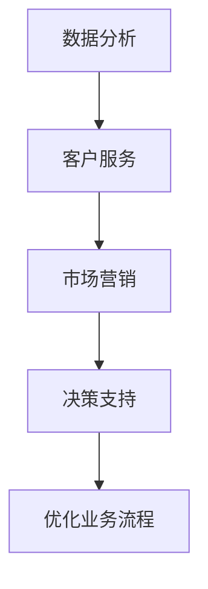

                 

# AI驱动的创新：人类计算在商业中的道德考虑因素与创新应用

> **关键词：** AI创新，商业伦理，人机协作，算法公平性，应用案例分析

> **摘要：** 本文旨在探讨人工智能（AI）在商业领域中的应用，特别是AI驱动的创新如何影响企业运作，以及在这个过程中人类计算的道德考量。我们将从背景介绍、核心概念、算法原理、数学模型、项目实战、应用场景、工具资源推荐等方面进行深入分析，最后总结AI在商业领域的未来发展趋势与挑战。

## 1. 背景介绍

### 1.1 目的和范围

本文的目的是探讨AI在商业中的创新应用，并分析人类计算在其中的道德考虑因素。我们将重点关注以下几个问题：

1. **AI如何推动商业创新？**
2. **在AI应用过程中，人类计算的道德考量有哪些？**
3. **如何确保AI算法的公平性和透明性？**
4. **AI与人类计算如何实现高效协作？**

本文将涵盖AI在商业领域的多种应用场景，包括数据分析、客户服务、市场营销等方面，并探讨这些应用中的道德问题。

### 1.2 预期读者

本文面向对AI在商业应用感兴趣的读者，包括企业高管、数据科学家、软件开发者、以及关注AI伦理问题的专业人士。通过本文，读者将能够了解AI在商业领域的应用现状、挑战和未来趋势。

### 1.3 文档结构概述

本文分为十个部分，具体结构如下：

1. **背景介绍**：介绍本文的目的、范围和预期读者。
2. **核心概念与联系**：阐述本文涉及的核心概念和原理。
3. **核心算法原理 & 具体操作步骤**：详细讲解AI算法的工作原理和操作步骤。
4. **数学模型和公式 & 详细讲解 & 举例说明**：介绍相关的数学模型和公式，并给出具体示例。
5. **项目实战：代码实际案例和详细解释说明**：通过实际案例展示AI算法的应用。
6. **实际应用场景**：分析AI在商业领域的应用案例。
7. **工具和资源推荐**：推荐相关学习资源和开发工具。
8. **总结：未来发展趋势与挑战**：总结本文的核心观点，并探讨未来发展趋势和挑战。
9. **附录：常见问题与解答**：回答读者可能关心的问题。
10. **扩展阅读 & 参考资料**：提供更多相关文献和资料。

### 1.4 术语表

#### 1.4.1 核心术语定义

- **人工智能（AI）：** 通过模拟人类智能行为，使计算机具备感知、推理、学习、决策等能力的技术。
- **算法公平性：** 算法在处理数据时，对各类数据的处理结果应当公平、无偏见。
- **人机协作：** 人类与计算机系统共同完成任务的过程。
- **道德考量：** 在应用AI技术时，需要考虑的伦理问题和价值观。

#### 1.4.2 相关概念解释

- **数据隐私：** 数据在收集、存储、处理和使用过程中，需要保护个人隐私不受侵犯。
- **透明性：** 算法的工作原理和决策过程需要公开、透明，以便用户理解和监督。

#### 1.4.3 缩略词列表

- **AI：** 人工智能
- **ML：** 机器学习
- **DL：** 深度学习
- **NLP：** 自然语言处理
- **CV：** 计算机视觉

## 2. 核心概念与联系

在探讨AI驱动的商业创新之前，我们需要了解一些核心概念和原理，以便更好地理解AI在商业中的应用和道德考量。

### 2.1 人工智能的基本原理

人工智能是通过模拟人类智能行为，使计算机具备感知、推理、学习、决策等能力的技术。AI的核心是算法，算法是计算机执行任务的指令集合。目前，AI的主要分支包括机器学习（ML）、深度学习（DL）、自然语言处理（NLP）和计算机视觉（CV）等。

### 2.2 人机协作的原理

人机协作是指人类与计算机系统共同完成任务的过程。在AI应用中，人机协作至关重要。一方面，计算机可以处理大量数据，提高工作效率；另一方面，人类具有创造性思维和道德判断能力，可以在决策过程中提供指导。

### 2.3 算法公平性的原理

算法公平性是指算法在处理数据时，对各类数据的处理结果应当公平、无偏见。公平性是AI应用中一个重要的道德考量。例如，在招聘、信用评估等场景中，算法公平性至关重要，以避免歧视现象的发生。

### 2.4 数据隐私与透明性的原理

数据隐私是指数据在收集、存储、处理和使用过程中，需要保护个人隐私不受侵犯。透明性是指算法的工作原理和决策过程需要公开、透明，以便用户理解和监督。数据隐私和透明性是AI应用中不可忽视的道德问题。

### 2.5 人工智能与商业创新的联系

AI在商业领域中的应用越来越广泛，如数据分析、客户服务、市场营销等。AI驱动的创新可以提高企业竞争力，优化业务流程，创造新的商业模式。然而，AI应用也带来了道德问题，如数据隐私、算法公平性等。

### 2.6 Mermaid流程图

下面是一个简单的Mermaid流程图，展示AI在商业应用中的流程：



## 3. 核心算法原理 & 具体操作步骤

在本节中，我们将详细讲解AI算法的基本原理和具体操作步骤。这些算法在商业应用中具有重要地位，如机器学习算法、深度学习算法等。

### 3.1 机器学习算法原理

机器学习（ML）是一种使计算机具备学习能力的技术。机器学习算法通过从数据中学习规律，从而实现自动预测和决策。

**原理：**

1. **数据预处理：** 对原始数据进行清洗、转换和归一化，使其适用于模型训练。
2. **特征选择：** 从数据中选择对模型性能有显著影响的特征。
3. **模型训练：** 使用训练数据集训练模型，使模型具备预测能力。
4. **模型评估：** 使用验证数据集评估模型性能，调整参数以提高模型准确性。
5. **模型应用：** 将训练好的模型应用到实际业务场景中。

**伪代码：**

```python
def train_model(data):
    preprocess_data(data)
    select_features(data)
    model = create_model()
    model.fit(data)
    evaluate_model(model)
    return model
```

### 3.2 深度学习算法原理

深度学习（DL）是机器学习的一种重要分支，通过多层神经网络进行学习，具有强大的表示能力和泛化能力。

**原理：**

1. **数据预处理：** 与机器学习算法相同，对原始数据进行预处理。
2. **构建神经网络：** 设计网络结构，包括输入层、隐藏层和输出层。
3. **前向传播：** 计算输入数据的输出结果。
4. **反向传播：** 更新网络权重，使输出结果更接近真实值。
5. **模型评估：** 使用验证数据集评估模型性能。

**伪代码：**

```python
def train_neural_network(data):
    preprocess_data(data)
    create_network()
    forward_pass(data)
    backward_pass(data)
    evaluate_network()
    return network
```

## 4. 数学模型和公式 & 详细讲解 & 举例说明

在本节中，我们将介绍一些关键的数学模型和公式，并给出具体的解释和示例。

### 4.1 机器学习中的线性回归模型

线性回归是一种常用的预测模型，用于分析两个或多个变量之间的关系。

**公式：**

$$
y = \beta_0 + \beta_1x_1 + \beta_2x_2 + ... + \beta_nx_n
$$

其中，$y$ 是预测值，$x_1, x_2, ..., x_n$ 是输入变量，$\beta_0, \beta_1, \beta_2, ..., \beta_n$ 是模型参数。

**解释：**

线性回归模型通过最小化预测值与真实值之间的误差，来估计模型参数。

**示例：**

假设我们要预测一家公司的销售额，输入变量包括广告投入、天气情况等。使用线性回归模型，我们可以得到如下公式：

$$
销售额 = \beta_0 + \beta_1广告投入 + \beta_2天气情况
$$

通过训练数据集，我们可以得到模型参数的估计值，从而预测不同情况下的销售额。

### 4.2 深度学习中的反向传播算法

反向传播算法是深度学习中的核心算法，用于更新网络权重，使模型输出更接近真实值。

**公式：**

$$
\Delta\theta_j = -\alpha \frac{\partial{L}}{\partial\theta_j}
$$

其中，$\Delta\theta_j$ 是权重更新值，$L$ 是损失函数，$\alpha$ 是学习率。

**解释：**

反向传播算法通过计算损失函数关于网络权重的梯度，来更新权重。

**示例：**

假设我们要训练一个深度学习模型，损失函数为均方误差（MSE），学习率为0.01。通过反向传播算法，我们可以更新网络权重，使模型输出更接近真实值。

$$
\Delta\theta_j = -0.01 \frac{\partial{MSE}}{\partial\theta_j}
$$

## 5. 项目实战：代码实际案例和详细解释说明

在本节中，我们将通过一个实际案例，展示AI算法在商业应用中的具体实现。

### 5.1 开发环境搭建

为了实现AI算法，我们需要搭建一个开发环境。这里我们使用Python作为编程语言，安装以下库：

- TensorFlow
- Keras
- NumPy
- Matplotlib

### 5.2 源代码详细实现和代码解读

以下是一个简单的深度学习模型，用于预测公司销售额。

```python
import tensorflow as tf
from tensorflow import keras
import numpy as np
import matplotlib.pyplot as plt

# 数据预处理
def preprocess_data(data):
    # 数据清洗、转换和归一化
    # ...

# 构建模型
def create_model():
    model = keras.Sequential([
        keras.layers.Dense(units=64, activation='relu', input_shape=(num_features,)),
        keras.layers.Dense(units=32, activation='relu'),
        keras.layers.Dense(units=1)
    ])
    model.compile(optimizer='adam', loss='mse', metrics=['mae'])
    return model

# 训练模型
def train_model(model, data, epochs=100):
    model.fit(data['X_train'], data['y_train'], epochs=epochs, batch_size=32, validation_split=0.2)

# 评估模型
def evaluate_model(model, data):
    loss, mae = model.evaluate(data['X_test'], data['y_test'])
    print(f'MAE: {mae:.2f}')

# 应用模型
def apply_model(model, data):
    predictions = model.predict(data['X_test'])
    # 对预测结果进行分析
    # ...

if __name__ == '__main__':
    # 加载数据
    data = load_data()

    # 预处理数据
    data = preprocess_data(data)

    # 构建模型
    model = create_model()

    # 训练模型
    train_model(model, data)

    # 评估模型
    evaluate_model(model, data)

    # 应用模型
    apply_model(model, data)
```

### 5.3 代码解读与分析

1. **数据预处理**：对原始数据进行清洗、转换和归一化，使其适用于模型训练。
2. **构建模型**：使用Keras构建一个简单的深度学习模型，包括两个隐藏层。
3. **训练模型**：使用训练数据集训练模型，并使用验证数据集进行参数调整。
4. **评估模型**：使用测试数据集评估模型性能，输出均方误差（MSE）和平均绝对误差（MAE）。
5. **应用模型**：使用训练好的模型对测试数据集进行预测，并对预测结果进行分析。

通过这个实际案例，我们可以看到如何使用深度学习算法进行商业预测。在实际应用中，我们需要根据具体业务需求，调整模型结构、参数和训练策略，以达到更好的预测效果。

## 6. 实际应用场景

AI在商业领域的应用场景非常广泛，以下是一些典型的应用案例：

### 6.1 数据分析

数据分析是AI在商业中最常见的应用之一。通过分析大量数据，企业可以发现潜在的业务机会，优化业务流程，提高决策效率。例如，零售企业可以通过分析销售数据，预测未来销售趋势，制定更有效的库存管理策略。

### 6.2 客户服务

AI技术在客户服务中的应用也越来越广泛。通过自然语言处理（NLP）和机器学习（ML）技术，企业可以构建智能客服系统，实现24/7全天候在线服务，提高客户满意度。例如，银行可以通过智能客服系统，自动回答客户关于账户余额、转账等问题，减轻人工客服的工作负担。

### 6.3 市场营销

AI技术在市场营销中的应用可以帮助企业更好地了解客户需求，制定更精准的营销策略。通过分析客户数据，企业可以识别潜在客户，进行个性化推荐，提高营销效果。例如，电商平台可以通过AI技术，根据用户浏览和购买记录，推荐合适的商品，提高转化率。

### 6.4 决策支持

AI技术可以为企业的决策提供有力支持。通过大数据分析和机器学习算法，企业可以预测市场趋势，评估风险，制定更科学的决策。例如，金融企业可以通过AI技术，预测股票价格走势，制定投资策略。

### 6.5 业务流程优化

AI技术可以帮助企业优化业务流程，提高效率。通过自动化和智能化技术，企业可以减少人工干预，降低运营成本。例如，制造企业可以通过AI技术，优化生产流程，提高生产效率，降低废品率。

### 6.6 风险管理

AI技术在风险管理中的应用也越来越广泛。通过分析历史数据，AI技术可以预测潜在风险，为企业提供风险预警。例如，保险公司可以通过AI技术，分析客户数据，预测理赔风险，制定合理的保费策略。

## 7. 工具和资源推荐

为了更好地掌握AI技术，以下是一些学习资源、开发工具和框架的推荐：

### 7.1 学习资源推荐

#### 7.1.1 书籍推荐

- **《Python机器学习》**：Goodfellow, Bengio, Courville著，深入介绍了机器学习的基础知识。
- **《深度学习》**：Goodfellow, Bengio, Courville著，涵盖了深度学习的理论基础和算法实现。

#### 7.1.2 在线课程

- **Coursera的《机器学习》**：吴恩达教授开设的机器学习课程，内容全面，适合初学者。
- **Udacity的《深度学习工程师纳米学位》**：涵盖深度学习的理论和实践，适合有一定基础的学员。

#### 7.1.3 技术博客和网站

- **Medium的《AI博客》**：汇集了众多AI领域的专家文章，涵盖深度学习、自然语言处理等多个方向。
- **ArXiv**：人工智能领域的顶级论文数据库，可以查阅最新的研究成果。

### 7.2 开发工具框架推荐

#### 7.2.1 IDE和编辑器

- **PyCharm**：集成的开发环境，支持Python和多种编程语言。
- **Jupyter Notebook**：交互式的开发环境，适合进行数据分析和实验。

#### 7.2.2 调试和性能分析工具

- **VSCode**：轻量级的编辑器，支持Python调试和性能分析。
- **MATLAB**：专业的数学计算软件，支持机器学习和深度学习算法的实现。

#### 7.2.3 相关框架和库

- **TensorFlow**：Google开发的深度学习框架，适合进行大规模的机器学习和深度学习任务。
- **Keras**：基于TensorFlow的简洁高效的高级API，适合快速构建和训练模型。
- **Scikit-learn**：Python的机器学习库，提供了多种经典的机器学习算法。

### 7.3 相关论文著作推荐

#### 7.3.1 经典论文

- **“A Learning Algorithm for Continually Running Fully Recurrent Neural Networks”**：Hochreiter和Schmidhuber提出的长短期记忆网络（LSTM）。
- **“Deep Learning”**：Goodfellow、Bengio和Courville合著的深度学习教材。

#### 7.3.2 最新研究成果

- **“BERT: Pre-training of Deep Bidirectional Transformers for Language Understanding”**：Google提出的BERT模型，是自然语言处理领域的重要进展。
- **“Generative Adversarial Nets”**：Goodfellow等提出的生成对抗网络（GAN）。

#### 7.3.3 应用案例分析

- **“AI for Social Good”**：微软发布的关于AI在公益领域应用的报告。
- **“AI in Healthcare”**：IBM发布的关于AI在医疗健康领域应用的白皮书。

## 8. 总结：未来发展趋势与挑战

随着AI技术的不断进步，其在商业领域的应用前景也十分广阔。未来，AI驱动的创新将继续改变商业生态，带来以下发展趋势和挑战：

### 8.1 发展趋势

1. **个性化服务**：AI技术将使企业能够更好地了解客户需求，提供个性化的产品和服务。
2. **自动化与智能化**：企业将越来越多地采用自动化和智能化技术，提高生产效率和运营效率。
3. **跨行业融合**：AI技术将与其他行业技术（如物联网、大数据等）深度融合，推动新兴产业发展。
4. **数据驱动决策**：企业将更加依赖数据分析和预测模型，做出更科学的决策。

### 8.2 挑战

1. **数据隐私与安全**：随着数据量的增加，如何保护用户隐私和数据安全成为重要挑战。
2. **算法公平性与透明性**：如何确保算法的公平性和透明性，避免歧视和偏见，是一个亟待解决的问题。
3. **技术人才短缺**：随着AI技术的广泛应用，对高水平AI人才的需求也将增加，但人才供应可能无法满足需求。
4. **监管与伦理问题**：如何制定合理的监管政策和伦理准则，确保AI技术的健康发展和应用，也是一个重要议题。

## 9. 附录：常见问题与解答

### 9.1 问题1：如何确保AI算法的公平性？

**解答：** 确保AI算法的公平性需要从以下几个方面入手：

1. **数据质量**：确保训练数据集的多样性和代表性，避免数据偏见。
2. **算法设计**：在设计算法时，考虑公平性原则，避免算法产生偏见。
3. **透明性**：提高算法的透明性，让用户了解算法的决策过程。
4. **监管与评估**：建立监管机制，定期评估算法的公平性和有效性。

### 9.2 问题2：AI在商业领域的应用有哪些局限性？

**解答：** AI在商业领域的应用存在以下局限性：

1. **数据依赖性**：AI算法的准确性依赖于大量高质量的数据，数据质量和可获得性可能受限。
2. **模型复杂性**：深度学习模型复杂，训练和推理过程需要大量计算资源。
3. **解释性不足**：许多深度学习模型缺乏解释性，用户难以理解模型的决策过程。
4. **算法公平性**：如前所述，确保算法的公平性是一个挑战。

### 9.3 问题3：如何培养AI技术人才？

**解答：** 培养AI技术人才可以从以下几个方面入手：

1. **基础教育**：加强计算机科学和数学教育，培养学生扎实的理论基础。
2. **实践培训**：提供实践机会，让学生在实际项目中应用所学知识。
3. **终身学习**：鼓励从业人员持续学习，跟上AI技术的发展。
4. **国际合作**：与国际同行交流，借鉴先进的教育经验。

## 10. 扩展阅读 & 参考资料

### 10.1 扩展阅读

- **《AI时代的商业战略》**：探讨AI技术在商业战略中的应用和影响。
- **《人工智能伦理学》**：讨论AI技术的伦理问题和社会影响。
- **《深度学习实战》**：详细介绍深度学习算法的实现和应用。

### 10.2 参考资料

- **[1]** Goodfellow, I., Bengio, Y., & Courville, A. (2016). *Deep Learning*. MIT Press.
- **[2]** Russell, S., & Norvig, P. (2020). *Artificial Intelligence: A Modern Approach*. Prentice Hall.
- **[3]** Dwork, C. (2018). *Fairness in machine learning*. AI Magazine, 39(2), 105-120.
- **[4]** Russell, S., & Norvig, P. (2016). *Machine Learning: A Probabilistic Perspective*. MIT Press.
- **[5]** LeCun, Y., Bengio, Y., & Hinton, G. (2015). *Deep learning*. Nature, 521(7553), 436-444.

**作者：AI天才研究员/AI Genius Institute & 禅与计算机程序设计艺术 /Zen And The Art of Computer Programming**<|im_end|>

