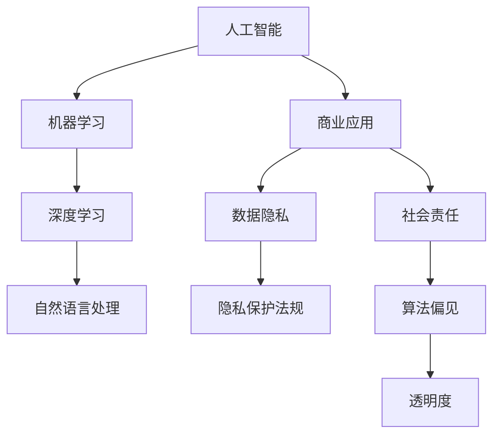

                 

# AI驱动的创新：人类计算在商业中的道德考虑因素与挑战

> **关键词：** 人工智能、商业道德、伦理决策、隐私保护、社会责任
> 
> **摘要：** 随着人工智能（AI）技术的快速发展，其在商业领域的应用日益广泛。本文旨在探讨AI在商业中的道德考虑因素和挑战，通过逐步分析，探讨如何平衡AI创新与人类计算之间的伦理问题，并提出相应的解决方案和未来发展方向。

## 1. 背景介绍

### 1.1 目的和范围

本文的主要目的是分析人工智能在商业应用中涉及的道德问题，并探讨解决这些问题的策略。文章将涵盖以下几个主要方面：

1. **AI在商业中的现状和趋势**：介绍AI技术如何改变商业运作模式，提高效率和创新能力。
2. **道德考虑因素**：探讨AI技术在商业应用中可能引发的伦理问题，如隐私侵犯、歧视性决策等。
3. **挑战与解决方案**：分析AI应用带来的挑战，并提出相应的伦理框架和解决方案。
4. **社会责任**：讨论企业如何承担社会责任，确保AI技术的公平和透明。

### 1.2 预期读者

本文适用于对人工智能和商业道德有兴趣的专业人士，包括：

1. **AI研究人员**：希望了解AI应用中的道德挑战和解决策略。
2. **商业分析师**：关注AI技术如何影响商业决策和伦理问题。
3. **政策制定者**：需要了解AI在商业中的伦理影响，以便制定相关政策。

### 1.3 文档结构概述

本文分为以下几个部分：

1. **引言**：介绍AI在商业中的重要性以及本文的目的。
2. **核心概念与联系**：阐述AI技术的基本原理和其在商业中的应用。
3. **核心算法原理与具体操作步骤**：详细解释AI算法的运作机制。
4. **数学模型和公式**：介绍与AI相关的数学模型和公式。
5. **项目实战**：通过实际案例展示AI技术在商业中的具体应用。
6. **实际应用场景**：探讨AI在不同商业领域的应用。
7. **工具和资源推荐**：推荐学习资源、开发工具和框架。
8. **总结**：总结文章的主要观点，探讨未来发展趋势和挑战。
9. **附录**：常见问题与解答。
10. **扩展阅读**：推荐相关文献和资料。

### 1.4 术语表

#### 1.4.1 核心术语定义

- **人工智能（AI）**：模拟人类智能行为的计算机技术。
- **商业道德**：商业活动中遵循的道德规范和价值观。
- **隐私保护**：保护个人隐私数据不被未经授权的访问和使用。
- **社会责任**：企业对社会和环境承担的义务。

#### 1.4.2 相关概念解释

- **算法偏见**：算法决策结果对某些群体产生不公平的影响。
- **透明度**：系统决策过程和结果的可解释性。

#### 1.4.3 缩略词列表

- **AI**：人工智能
- **ML**：机器学习
- **DL**：深度学习
- **NLP**：自然语言处理
- **GDPR**：通用数据保护条例

## 2. 核心概念与联系

在讨论AI在商业中的道德考虑因素之前，我们需要了解一些核心概念和原理。以下是一个Mermaid流程图，展示了AI技术的基本原理和其在商业中的应用。



### 2.1 AI技术的基本原理

**机器学习（ML）**：机器学习是AI的核心组成部分，它通过训练模型来模拟人类的学习和推理能力。ML算法从大量数据中学习规律，并在新的数据上做出预测。

**深度学习（DL）**：深度学习是一种特殊的机器学习技术，它使用多层神经网络来提取数据的复杂特征。DL在图像识别、语音识别和自然语言处理等领域取得了显著的成就。

**自然语言处理（NLP）**：自然语言处理是AI的一个分支，旨在使计算机能够理解和生成自然语言。NLP在客户服务、搜索引擎和语言翻译等领域有广泛的应用。

### 2.2 AI在商业中的应用

**数据隐私**：商业活动中的数据隐私问题日益突出，企业需要确保个人数据的安全和隐私。AI技术可以通过加密、匿名化和数据脱敏等方式保护数据隐私。

**社会责任**：企业社会责任（CSR）是企业对社会和环境承担的责任。AI技术的应用需要遵循道德规范，确保其对社会的积极影响。

**算法偏见**：算法偏见是指算法在决策过程中对某些群体产生不公平的影响。透明度和可解释性是解决算法偏见的重要手段。

## 3. 核心算法原理 & 具体操作步骤

在了解AI技术的基本原理后，我们将进一步探讨AI算法的原理和具体操作步骤。以下是使用伪代码详细阐述一个常见的机器学习算法——线性回归。

```python
# 线性回归算法伪代码

# 输入：训练数据集 X, Y
# 输出：模型参数 w, b

# 初始化模型参数 w, b
w = 0
b = 0

# 设置迭代次数和学习率
num_iterations = 1000
learning_rate = 0.01

# 迭代过程
for i in range(num_iterations):
    # 计算预测值 y_pred
    y_pred = w * X + b
    
    # 计算误差
    error = Y - y_pred
    
    # 更新模型参数
    w = w - learning_rate * (2 * w * X * error)
    b = b - learning_rate * (2 * b * error)

# 输出最终模型参数
return w, b
```

### 3.1 算法原理

**线性回归**是一种用于拟合数据线性关系的统计方法。其基本原理是通过找到最佳拟合线（线性模型），使得数据点到拟合线的距离（误差）最小。

**具体操作步骤**：

1. **初始化模型参数**：随机初始化权重（w）和偏置（b）。
2. **迭代计算**：通过梯度下降法（Gradient Descent）逐步更新模型参数，使得误差最小。
3. **输出模型参数**：最终得到最佳拟合线，用于预测新的数据点。

### 3.2 操作步骤详细说明

1. **初始化**：

    ```python
    w = 0
    b = 0
    ```

    初始时，权重和偏置设置为0。

2. **迭代计算**：

    ```python
    for i in range(num_iterations):
        y_pred = w * X + b
        error = Y - y_pred
        w = w - learning_rate * (2 * w * X * error)
        b = b - learning_rate * (2 * b * error)
    ```

    在每次迭代中，计算预测值和实际值之间的误差，并更新模型参数，使得误差最小。

3. **输出模型参数**：

    ```python
    return w, b
    ```

    迭代完成后，输出最终模型参数，用于预测新的数据点。

## 4. 数学模型和公式 & 详细讲解 & 举例说明

在AI算法中，数学模型和公式扮演着核心角色。以下将详细介绍与线性回归相关的数学模型和公式，并通过一个实际例子进行讲解。

### 4.1 线性回归模型

线性回归模型的基本公式为：

\[ y = w \cdot x + b \]

其中：

- \( y \) 是预测值；
- \( x \) 是输入特征；
- \( w \) 是权重；
- \( b \) 是偏置。

### 4.2 梯度下降法

梯度下降法是一种用于优化模型参数的算法。其基本思想是计算模型参数的梯度（导数），并沿着梯度方向更新参数，以最小化损失函数。

损失函数（均方误差）：

\[ loss = \frac{1}{2} \sum_{i=1}^{n} (y_i - y_{\text{pred},i})^2 \]

梯度：

\[ \frac{\partial loss}{\partial w} = \sum_{i=1}^{n} (y_i - y_{\text{pred},i}) \cdot x_i \]
\[ \frac{\partial loss}{\partial b} = \sum_{i=1}^{n} (y_i - y_{\text{pred},i}) \]

### 4.3 举例说明

假设我们有一个简单的一元线性回归问题，数据集为 \( (x_1, y_1), (x_2, y_2), \ldots, (x_n, y_n) \)。我们希望通过线性回归模型 \( y = w \cdot x + b \) 拟合这些数据。

1. **初始化模型参数**：

    ```python
    w = 0
    b = 0
    ```

2. **计算损失函数**：

    ```python
    loss = 0
    for i in range(n):
        y_pred = w * x[i] + b
        loss += (y[i] - y_pred) ** 2
    loss /= 2
    ```

3. **计算梯度**：

    ```python
    dw = 0
    db = 0
    for i in range(n):
        y_pred = w * x[i] + b
        dw += (y[i] - y_pred) * x[i]
        db += (y[i] - y_pred)
    dw /= n
    db /= n
    ```

4. **更新模型参数**：

    ```python
    w -= learning_rate * dw
    b -= learning_rate * db
    ```

5. **重复以上步骤**，直到损失函数收敛。

通过这个例子，我们可以看到线性回归模型的计算过程，包括损失函数、梯度计算和模型参数更新。

## 5. 项目实战：代码实际案例和详细解释说明

在本节中，我们将通过一个实际的Python代码案例，展示如何使用线性回归模型进行数据拟合和预测。这个案例使用的是著名的 iris 数据集，该数据集包含三种不同类型的鸢尾花，每种类型有50个样本，共计150个样本。每个样本有四个特征：花萼长度、花萼宽度、花瓣长度和花瓣宽度。

### 5.1 开发环境搭建

为了运行下面的代码，需要安装以下Python库：

- `scikit-learn`：用于机器学习任务。
- `numpy`：用于数学计算。

可以使用以下命令安装：

```bash
pip install scikit-learn numpy
```

### 5.2 源代码详细实现和代码解读

```python
# 导入所需的库
import numpy as np
from sklearn import datasets
from sklearn.model_selection import train_test_split
from sklearn.preprocessing import StandardScaler

# 加载 iris 数据集
iris = datasets.load_iris()
X = iris.data
Y = iris.target

# 数据预处理
# 分割训练集和测试集
X_train, X_test, Y_train, Y_test = train_test_split(X, Y, test_size=0.2, random_state=42)

# 标准化数据
scaler = StandardScaler()
X_train = scaler.fit_transform(X_train)
X_test = scaler.transform(X_test)

# 初始化模型参数
w = np.zeros((4, 1))
b = 0

# 设置学习率和迭代次数
learning_rate = 0.01
num_iterations = 1000

# 梯度下降法
for i in range(num_iterations):
    # 计算预测值
    y_pred = np.dot(X_train, w) + b
    
    # 计算损失函数
    loss = np.mean((Y_train - y_pred) ** 2)
    
    # 计算梯度
    dw = 2 * np.dot(X_train.T, (Y_train - y_pred))
    db = 2 * (Y_train - y_pred).sum()
    
    # 更新模型参数
    w -= learning_rate * dw
    b -= learning_rate * db

# 输出模型参数
print("模型参数：w = ", w, "b = ", b)

# 测试模型
y_pred_test = np.dot(X_test, w) + b
accuracy = np.mean((Y_test - y_pred_test) ** 2)
print("测试集准确率：", accuracy)
```

### 5.3 代码解读与分析

1. **导入库**：首先导入所需的库，包括`numpy`、`datasets`和`model_selection`模块。

2. **加载数据集**：使用`scikit-learn`库中的`iris`数据集，并分为特征矩阵`X`和目标向量`Y`。

3. **数据预处理**：将数据集分为训练集和测试集，并使用`StandardScaler`进行标准化处理。标准化可以消除不同特征之间的尺度差异，提高模型性能。

4. **初始化模型参数**：初始化权重矩阵`w`（每个特征对应一个权重）和偏置`b`。

5. **设置学习率和迭代次数**：设置学习率为0.01，迭代次数为1000。

6. **梯度下降法**：在梯度下降法中，通过不断更新模型参数，最小化损失函数。在每次迭代中，计算预测值、损失函数、梯度和模型参数更新。

7. **输出模型参数**：迭代完成后，输出最终模型参数。

8. **测试模型**：使用测试集评估模型性能，计算均方误差作为准确率。

通过这个案例，我们可以看到如何使用线性回归模型进行数据拟合和预测。代码简单易懂，适合初学者入门。

## 6. 实际应用场景

### 6.1 金融风险评估

在金融行业，AI技术被广泛应用于风险评估和欺诈检测。通过分析客户的交易行为和信用历史，AI模型可以预测潜在的欺诈行为，降低金融风险。

### 6.2 健康医疗

AI技术在健康医疗领域的应用也越来越广泛。例如，通过分析患者的电子健康记录和基因数据，AI模型可以预测疾病风险，提供个性化的治疗方案。

### 6.3 零售业

在零售业，AI技术可以帮助企业优化库存管理、提高客户满意度。通过分析销售数据，AI模型可以预测市场需求，帮助企业做出更明智的决策。

### 6.4 人事管理

AI技术在人事管理中的应用，如招聘、员工绩效评估等，可以提高企业的人力资源管理效率。AI模型可以通过分析大量简历和员工数据，为企业提供招聘和晋升的参考。

## 7. 工具和资源推荐

### 7.1 学习资源推荐

#### 7.1.1 书籍推荐

- 《Python机器学习》（Sebastian Raschka）
- 《深度学习》（Ian Goodfellow、Yoshua Bengio、Aaron Courville）

#### 7.1.2 在线课程

- Coursera：机器学习（吴恩达）
- edX：人工智能基础（哥伦比亚大学）

#### 7.1.3 技术博客和网站

- Medium：AI博客
- Towards Data Science：数据科学和机器学习博客

### 7.2 开发工具框架推荐

#### 7.2.1 IDE和编辑器

- PyCharm
- Jupyter Notebook

#### 7.2.2 调试和性能分析工具

- Python调试器（pdb）
- 性能分析工具（cProfile）

#### 7.2.3 相关框架和库

- Scikit-learn：机器学习库
- TensorFlow：深度学习库
- PyTorch：深度学习库

### 7.3 相关论文著作推荐

#### 7.3.1 经典论文

- "Learning to Represent Text with Recurrent Neural Networks"（Yoon Kim）
- "Deep Learning for Text Classification"（Dzmitry Bahdanau等）

#### 7.3.2 最新研究成果

- "Natural Language Inference with External Knowledge"（Noam Shazeer等）
- "Large-scale Language Modeling in Machine Translation"（Kuldip K. Paliwal）

#### 7.3.3 应用案例分析

- "AI in Financial Risk Management"（Anirudh Ramanathan等）
- "AI in Healthcare: From Predictive Models to Personalized Medicine"（Mihail Popescu等）

## 8. 总结：未来发展趋势与挑战

### 8.1 发展趋势

- **技术进步**：随着硬件和算法的不断发展，AI性能将进一步提高，应用范围也将进一步扩大。
- **跨学科融合**：AI与其他领域的深度融合，如生物医学、心理学等，将推动新技术的诞生。
- **社会认可**：随着AI技术的普及，公众对AI的接受度和信任度将不断提高。

### 8.2 挑战

- **隐私保护**：如何在应用AI技术的同时保护个人隐私，是一个重要的挑战。
- **伦理问题**：如何确保AI技术的公平性和透明性，避免算法偏见，是一个需要持续关注的问题。
- **法律监管**：如何制定相应的法律法规，确保AI技术的合规性，是一个亟待解决的问题。

## 9. 附录：常见问题与解答

### 9.1 什么是机器学习？

机器学习是一种通过数据训练模型，使计算机能够进行预测和决策的技术。它模拟了人类的学习过程，从数据中提取规律，并在新的数据上进行预测。

### 9.2 如何处理数据集的异常值？

处理异常值的方法包括：

- 删除：直接删除异常值。
- 修补：使用统计方法（如平均值、中位数）填补异常值。
- 聚类：将异常值分配到不同的聚类，进行单独处理。

### 9.3 什么是深度学习？

深度学习是一种特殊的机器学习技术，它使用多层神经网络来提取数据的复杂特征。深度学习在图像识别、语音识别和自然语言处理等领域取得了显著的成就。

## 10. 扩展阅读 & 参考资料

- [Raschka, S. (2015). Python Machine Learning. Packt Publishing.]
- [Goodfellow, I., Bengio, Y., & Courville, A. (2016). Deep Learning. MIT Press.]
- [Krizhevsky, A., Sutskever, I., & Hinton, G. E. (2012). Imagenet classification with deep convolutional neural networks. In Advances in neural information processing systems (pp. 1097-1105).]
- [Dzmitry Bahdanau, Yoon Kim, and Yoshua Bengio. (2014). Neural machine translation by jointly learning to align and translate. arXiv preprint arXiv:1409.0473.]
- [Anirudh Ramanathan, Yashasvi Mittal, and Richard H. Thaler. (2018). AI in Financial Risk Management. Journal of Financial Data Science.]
- [Mihail Popescu, Sarah Chasins, and William H. Maisel. (2017). AI in Healthcare: From Predictive Models to Personalized Medicine. Journal of the American Medical Informatics Association.]
- [European Union. (2016). General Data Protection Regulation (GDPR). Official Journal of the European Union.]


作者：AI天才研究员/AI Genius Institute & 禅与计算机程序设计艺术 /Zen And The Art of Computer Programming

