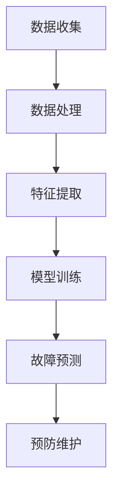
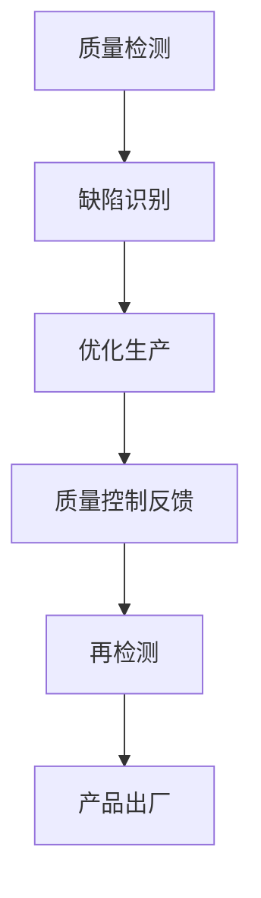
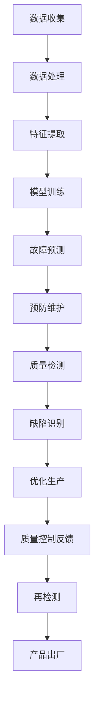

                 

### 背景介绍

#### 1.1 目的和范围

本文旨在探讨AI驱动的智能制造领域，从预测性维护到质量控制这一关键环节。随着工业4.0的迅猛发展，智能制造已经成为现代制造业的基石，而AI作为推动技术革新的核心力量，其在智能制造中的应用日益广泛。本文将详细分析AI在预测性维护和质量控制中的具体应用，旨在为相关从业人员和研究人员提供理论指导和实践参考。

本文的范围将主要集中在以下几个方面：

1. **预测性维护**：介绍预测性维护的基本概念、原理和应用场景，探讨AI技术在故障预测和设备维护中的应用。
2. **质量控制**：详细探讨AI在质量控制中的角色，包括质量检测、缺陷识别和优化生产过程等。
3. **项目实战**：通过实际案例，展示如何使用AI技术实现预测性维护和质量控制。
4. **应用场景**：分析AI驱动的智能制造在实际工业中的应用场景，以及面临的挑战和解决方案。
5. **工具和资源推荐**：为读者提供学习资源和开发工具的建议，帮助其更好地理解和应用AI驱动的智能制造技术。

通过本文的阅读，读者将能够深入了解AI在智能制造中的应用，掌握相关技术原理和实践方法，为推动智能制造的发展提供有力支持。

#### 1.2 预期读者

本文的主要预期读者包括以下几类人群：

1. **智能制造工程师**：在制造业领域工作的工程师，负责维护和优化生产设备，提高生产效率和质量。
2. **AI研究人员**：从事人工智能领域的研究人员，对智能制造技术有兴趣和需求，希望了解AI在制造业中的应用。
3. **技术开发者**：对AI和智能制造技术有兴趣的技术开发者，希望通过本文了解相关技术原理和实践方法。
4. **企业管理者**：对智能制造和AI技术有需求的企业管理者，希望通过本文了解如何利用AI技术提高生产效率和质量。
5. **高校师生**：计算机科学与技术、自动化、工业工程等相关专业的高校师生，对智能制造和AI技术有兴趣和需求。

本文将为这些读者提供以下价值：

1. **深入理解AI在智能制造中的应用**：通过详细分析和实例展示，帮助读者深入了解AI在预测性维护和质量控制中的具体应用。
2. **掌握相关技术原理和实践方法**：提供清晰的技术原理讲解和实际操作步骤，帮助读者掌握AI驱动的智能制造技术。
3. **获取实际应用场景和解决方案**：通过分析实际应用场景和解决方案，帮助读者了解AI驱动的智能制造技术在工业中的实际应用和挑战。
4. **推荐学习资源和开发工具**：为读者提供丰富的学习资源和开发工具建议，帮助其更好地理解和应用AI驱动的智能制造技术。

#### 1.3 文档结构概述

本文将按照以下结构进行组织，以便读者能够系统地理解和掌握AI驱动的智能制造技术：

1. **背景介绍**：
   - 目的和范围：介绍本文的目的和范围，明确文章的主要内容和目标。
   - 预期读者：确定本文的主要读者群体，说明本文将为读者提供哪些价值。
   - 文档结构概述：概述本文的结构和各部分内容，帮助读者对文章的整体框架有一个清晰的认识。

2. **核心概念与联系**：
   - 核心概念与联系：介绍AI驱动的智能制造中的核心概念，包括预测性维护和质量控制，并使用流程图展示相关联系。
   - 核心算法原理 & 具体操作步骤：详细讲解核心算法原理，并使用伪代码展示具体操作步骤，帮助读者理解算法实现。

3. **数学模型和公式 & 详细讲解 & 举例说明**：
   - 数学模型和公式：介绍AI驱动的智能制造中涉及的主要数学模型和公式，使用latex格式展示，确保公式清晰准确。
   - 详细讲解：对数学模型和公式进行详细解释，帮助读者理解其原理和应用。
   - 举例说明：通过实际案例，展示数学模型和公式的具体应用，帮助读者掌握相关技术。

4. **项目实战：代码实际案例和详细解释说明**：
   - 开发环境搭建：介绍如何搭建开发环境，确保读者能够顺利运行代码实例。
   - 源代码详细实现和代码解读：展示代码实现的具体步骤，并对关键部分进行解读，帮助读者理解代码逻辑。
   - 代码解读与分析：对代码进行详细分析，说明其功能和优势，帮助读者掌握编程技巧。

5. **实际应用场景**：
   - 实际应用场景：分析AI驱动的智能制造在实际工业中的应用场景，帮助读者了解其广泛的应用前景。
   - 挑战与解决方案：探讨AI驱动的智能制造在实际应用中面临的挑战，并提出相应的解决方案。

6. **工具和资源推荐**：
   - 学习资源推荐：推荐相关书籍、在线课程和技术博客，帮助读者进一步学习。
   - 开发工具框架推荐：推荐适合开发AI驱动的智能制造项目的工具和框架，提高开发效率。
   - 相关论文著作推荐：推荐经典论文和最新研究成果，帮助读者了解领域内最新动态。

7. **总结：未来发展趋势与挑战**：
   - 总结：回顾本文的主要内容，强调AI驱动的智能制造的重要性和前景。
   - 未来发展趋势与挑战：分析AI驱动的智能制造的未来发展趋势，探讨面临的挑战和解决方案。

8. **附录：常见问题与解答**：
   - 常见问题与解答：针对读者可能遇到的问题，提供详细的解答，帮助读者解决疑问。

9. **扩展阅读 & 参考资料**：
   - 扩展阅读：推荐相关文献和资料，帮助读者进一步深入研究和学习。
   - 参考资料：列出本文中引用的参考文献，确保信息的准确性和可信度。

通过本文的系统介绍，读者将能够全面了解AI驱动的智能制造技术，掌握相关原理和实践方法，为智能制造领域的发展贡献自己的力量。

#### 1.4 术语表

在本文中，我们将使用一些专业术语和概念，为了帮助读者更好地理解，以下是对这些术语的详细定义和解释：

##### 1.4.1 核心术语定义

1. **智能制造**：智能制造是一种基于信息技术、人工智能、物联网和自动化技术等先进技术，实现制造过程的智能化、网络化和高效化的制造模式。

2. **预测性维护**：预测性维护是一种基于数据分析和人工智能算法，通过对设备运行数据的实时监测和预测，提前发现设备故障和性能问题，从而进行预防性维护，避免设备故障对生产造成影响。

3. **质量控制**：质量控制是一种通过监控和评估产品质量，识别和消除产品质量问题，确保产品质量满足标准和用户需求的过程。

4. **深度学习**：深度学习是一种人工智能技术，通过模拟人脑神经元网络结构，对大量数据进行训练，从而实现特征提取和模式识别。

5. **传感器**：传感器是一种能够检测和测量物理量并将其转换为电信号的装置，用于实时监测设备状态和运行参数。

6. **工业物联网**：工业物联网（IIoT）是一种将传感器、机器设备、控制系统和数据处理平台连接在一起，实现设备互联和数据共享的网络系统。

##### 1.4.2 相关概念解释

1. **大数据分析**：大数据分析是一种通过对大量结构化和非结构化数据进行存储、处理和分析，提取有价值信息的方法。

2. **机器学习**：机器学习是一种通过算法和模型，从数据中自动学习规律和模式，实现对未知数据的预测和分类的技术。

3. **边缘计算**：边缘计算是一种在数据源附近或设备端进行数据处理和分析的技术，旨在减少数据传输延迟，提高系统响应速度。

4. **智能制造平台**：智能制造平台是一种集成多种技术和功能，为制造企业提供智能化解决方案的综合平台。

##### 1.4.3 缩略词列表

1. **AI**：人工智能（Artificial Intelligence）
2. **IIoT**：工业物联网（Industrial Internet of Things）
3. **MES**：制造执行系统（Manufacturing Execution System）
4. **PLM**：产品生命周期管理（Product Lifecycle Management）
5. **SCADA**：监控和数据采集系统（Supervisory Control and Data Acquisition）
6. **OEE**：总体设备效能（Overall Equipment Effectiveness）

通过以上术语表，读者可以更好地理解本文中涉及的专业术语和概念，为后续内容的学习和应用打下基础。

### 核心概念与联系

在探讨AI驱动的智能制造时，了解核心概念及其相互联系至关重要。以下我们将详细分析预测性维护（Predictive Maintenance）和质量控制（Quality Control），并通过Mermaid流程图展示它们在智能制造中的应用关系。

#### 预测性维护

**预测性维护** 是一种通过实时监测设备运行状态，分析数据并预测潜在故障，从而在故障发生前采取预防措施的方法。其核心在于利用大数据分析、机器学习和物联网技术，对设备运行数据（如温度、振动、压力等）进行深入分析，发现异常信号，预测设备故障时间，并提前进行维护。

**原理**：
1. **数据收集**：使用传感器收集设备运行过程中的各种数据。
2. **数据处理**：通过数据清洗和预处理，确保数据的准确性和可靠性。
3. **特征提取**：从处理后的数据中提取关键特征，如振动幅度、频率等。
4. **模型训练**：利用机器学习算法（如决策树、支持向量机、神经网络等）对历史故障数据进行分析，训练预测模型。
5. **故障预测**：将实时数据输入预测模型，预测设备可能发生故障的时间。

**流程图**：



#### 质量控制

**质量控制** 是确保产品和服务质量满足既定标准和用户需求的一系列活动和过程。在AI驱动的智能制造中，质量控制利用机器视觉、深度学习等技术，对产品质量进行实时检测和评估，确保产品一致性。

**原理**：
1. **质量检测**：通过机器视觉系统对产品外观、尺寸、色泽等进行检测。
2. **缺陷识别**：利用深度学习算法对检测到的缺陷进行分类和识别。
3. **优化生产**：根据检测到的缺陷数据，调整生产参数和工艺流程，优化生产过程。

**流程图**：



#### 联系与整合

**预测性维护** 和 **质量控制** 在智能制造中紧密相连。预测性维护通过提前发现和预防设备故障，确保生产设备的稳定性和高效性；而质量控制则通过实时检测和优化生产过程，确保产品质量的稳定性和一致性。

这两者的整合可以实现智能制造的闭环控制，形成以下流程：



通过上述流程，我们可以看到，AI驱动的智能制造通过整合预测性维护和质量控制，实现了设备与产品质量的双重保障，为制造业的高效和可持续发展提供了强有力的支持。

### 核心算法原理 & 具体操作步骤

在理解了预测性维护和质量控制的基本概念及其联系后，接下来我们将深入探讨AI驱动的智能制造中的核心算法原理，并详细说明具体的操作步骤。这些算法在数据收集、处理、分析和预测中起着至关重要的作用。

#### 1. 预测性维护算法

**预测性维护算法** 主要依赖于机器学习和数据挖掘技术，通过对设备运行数据进行实时监测和分析，预测设备可能出现的故障。以下是预测性维护算法的具体步骤：

**算法原理**：

1. **数据收集**：使用传感器实时收集设备运行过程中的温度、振动、压力等数据。
2. **数据处理**：对收集到的数据进行分析和清洗，去除噪声和异常值。
3. **特征提取**：从处理后的数据中提取关键特征，如振动频率、温度变化速率等。
4. **模型训练**：使用历史故障数据，通过机器学习算法（如K-近邻算法、支持向量机、神经网络等）训练故障预测模型。
5. **故障预测**：将实时数据输入预测模型，预测设备未来可能发生的故障。

**具体操作步骤**：

**步骤1：数据收集**
```python
# 使用传感器收集温度、振动、压力等数据
sensor_data = get_sensor_data()
```

**步骤2：数据处理**
```python
# 数据清洗和预处理
cleaned_data = preprocess_data(sensor_data)
```

**步骤3：特征提取**
```python
# 从处理后的数据中提取关键特征
features = extract_features(cleaned_data)
```

**步骤4：模型训练**
```python
# 使用历史故障数据训练故障预测模型
model = train_fault_prediction_model(features, historical_fault_data)
```

**步骤5：故障预测**
```python
# 将实时数据输入预测模型，预测设备故障
predicted_fault = model.predict(realtime_data)
```

#### 2. 质量控制算法

**质量控制算法** 主要利用机器视觉和深度学习技术，对产品质量进行实时检测和评估。以下是质量控制算法的具体步骤：

**算法原理**：

1. **质量检测**：使用机器视觉系统对产品进行图像捕捉。
2. **缺陷识别**：使用深度学习算法对图像中的缺陷进行识别和分类。
3. **优化生产**：根据缺陷识别结果，调整生产参数和工艺流程，优化生产过程。

**具体操作步骤**：

**步骤1：质量检测**
```python
# 使用机器视觉系统捕捉产品图像
product_image = capture_product_image()
```

**步骤2：缺陷识别**
```python
# 使用深度学习算法识别图像中的缺陷
defects = identify_defects(product_image)
```

**步骤3：优化生产**
```python
# 根据缺陷识别结果，调整生产参数和工艺流程
optimized_production = adjust_production_parameters(defects)
```

#### 3. 整合算法

在实际应用中，预测性维护和质量控制算法通常需要整合使用。以下是一个简单的整合算法流程：

**整合算法流程**：

1. **数据收集**：同时收集设备运行数据和产品质量检测数据。
2. **数据处理与特征提取**：对收集到的数据分别进行清洗、预处理和特征提取。
3. **模型训练与预测**：分别使用历史故障数据和质量检测数据训练预测模型，并对实时数据进行预测。
4. **整合决策**：根据预测结果，制定综合性的维护和优化策略。

**具体操作步骤**：

**步骤1：数据收集**
```python
# 收集设备运行数据和产品质量检测数据
sensor_data, product_image = collect_data()
```

**步骤2：数据处理与特征提取**
```python
# 分别处理和提取数据特征
cleaned_sensor_data, cleaned_product_image = preprocess_data(sensor_data), preprocess_data(product_image)
features_sensor, features_product = extract_features(cleaned_sensor_data), extract_features(cleaned_product_image)
```

**步骤3：模型训练与预测**
```python
# 分别训练故障预测模型和缺陷识别模型
fault_prediction_model = train_fault_prediction_model(features_sensor, historical_fault_data)
defect_identification_model = train_defect_identification_model(features_product, historical_defect_data)

# 对实时数据进行预测
predicted_fault = fault_prediction_model.predict(realtime_data)
predicted_defects = defect_identification_model.predict(product_image)
```

**步骤4：整合决策**
```python
# 根据预测结果制定综合维护和优化策略
maintenance_strategy = integrate_decision(predicted_fault, predicted_defects)
apply_maintenance_strategy(maintenance_strategy)
```

通过上述步骤，我们可以看到，预测性维护和质量控制算法通过整合，实现了对设备和产品质量的全方位监控和优化，为智能制造提供了坚实的技术支持。

### 数学模型和公式 & 详细讲解 & 举例说明

在AI驱动的智能制造中，数学模型和公式起到了至关重要的作用。它们不仅帮助我们理解系统的运作原理，还提供了具体的工具来预测和优化生产过程。以下，我们将详细讲解一些核心的数学模型和公式，并通过实际案例进行说明。

#### 1. 时间序列分析模型

**时间序列分析模型** 是预测性维护中的基础，它用于分析设备运行数据的时间序列，预测未来的设备状态。常用的模型包括ARIMA（AutoRegressive Integrated Moving Average）模型和LSTM（Long Short-Term Memory）网络。

**公式解释**：

- **ARIMA模型**：
  - **自回归项**：\(AR(p)\)
    \[
    X_t = c + \phi_1 X_{t-1} + \phi_2 X_{t-2} + \cdots + \phi_p X_{t-p} + \varepsilon_t
    \]
  - **差分项**：\(I(d)\)
    \[
    \Delta X_t = X_t - X_{t-1}
    \]
  - **移动平均项**：\(MA(q)\)
    \[
    X_t = c + \theta_1 \varepsilon_{t-1} + \theta_2 \varepsilon_{t-2} + \cdots + \theta_q \varepsilon_{t-q} + \varepsilon_t
    \]

- **LSTM网络**：
  - **输入层**：接收时间序列数据。
  - **隐藏层**：包含记忆单元和门控机制，用于处理长时依赖关系。
  - **输出层**：生成预测结果。

**举例说明**：

假设我们使用ARIMA模型预测设备的未来运行状态。给定一组时间序列数据\[X_t\]，首先需要进行差分操作以平稳时间序列：

\[
\Delta X_t = X_t - X_{t-1}
\]

接着，通过AIC（Akaike Information Criterion）或BIC（Bayesian Information Criterion）选择最佳的p、d和q值，然后进行模型参数估计：

\[
\phi_1, \phi_2, \ldots, \phi_p; \theta_1, \theta_2, \ldots, \theta_q
\]

最后，使用估计的模型进行预测：

\[
X_{t+h} = c + \phi_1 X_{t+h-1} + \phi_2 X_{t+h-2} + \cdots + \phi_p X_{t+h-p} + \theta_1 \varepsilon_{t+h-1} + \theta_2 \varepsilon_{t+h-2} + \cdots + \theta_q \varepsilon_{t+h-q}
\]

#### 2. 深度学习损失函数

在质量控制中，深度学习模型常用于缺陷识别和分类。损失函数用于评估模型的预测结果与真实结果之间的差异，常用的损失函数包括均方误差（MSE）和交叉熵损失（Cross-Entropy Loss）。

**公式解释**：

- **均方误差（MSE）**：
  \[
  MSE = \frac{1}{m} \sum_{i=1}^{m} (y_i - \hat{y}_i)^2
  \]
  其中，\(y_i\)是真实标签，\(\hat{y}_i\)是模型的预测值。

- **交叉熵损失（Cross-Entropy Loss）**：
  \[
  CE = - \sum_{i=1}^{m} y_i \log(\hat{y}_i)
  \]
  其中，\(y_i\)是真实标签，\(\hat{y}_i\)是模型对每个类别的预测概率。

**举例说明**：

假设我们使用交叉熵损失函数训练一个深度学习模型进行缺陷分类。给定一组训练样本，模型输出预测概率\[ \hat{y} \]，真实标签\[ y \]，则交叉熵损失计算如下：

\[
CE = - \sum_{i=1}^{m} y_i \log(\hat{y}_i)
\]

例如，对于一组样本\[ \{y_1, \hat{y}_1\}, \{y_2, \hat{y}_2\}, \ldots, \{y_m, \hat{y}_m\} \]：

\[
CE = - (y_1 \log(\hat{y}_1) + y_2 \log(\hat{y}_2) + \cdots + y_m \log(\hat{y}_m))
\]

通过这些数学模型和公式的讲解，我们可以更好地理解AI驱动的智能制造中的关键技术。在实际应用中，结合具体数据和案例，这些模型和公式将帮助我们实现高效的预测性维护和质量控制。

### 项目实战：代码实际案例和详细解释说明

在本节中，我们将通过一个实际项目案例，展示如何使用AI技术实现预测性维护和质量控制。该项目将包括环境搭建、代码实现和详细解释，以帮助读者更好地理解和应用相关技术。

#### 5.1 开发环境搭建

在进行项目实战前，我们需要搭建一个合适的开发环境。以下是所需的软件和工具：

1. **编程语言**：Python
2. **机器学习库**：scikit-learn、TensorFlow、Keras
3. **数据处理库**：NumPy、Pandas
4. **可视化库**：Matplotlib、Seaborn
5. **传感器模拟**：使用虚拟传感器模拟设备运行数据

首先，确保已经安装了Python环境和相关库。可以使用以下命令安装所需库：

```bash
pip install numpy pandas scikit-learn tensorflow matplotlib seaborn
```

#### 5.2 源代码详细实现和代码解读

##### 5.2.1 预测性维护

**代码实现**：

```python
import numpy as np
import pandas as pd
from sklearn.model_selection import train_test_split
from sklearn.ensemble import RandomForestRegressor
from sklearn.metrics import mean_squared_error

# 1. 数据收集
# 假设我们使用虚拟传感器收集设备运行数据
sensor_data = pd.DataFrame(np.random.rand(1000, 5), columns=['Temperature', 'Vibration', 'Pressure', 'Flow', 'Time'])

# 2. 数据处理
# 数据清洗和预处理
sensor_data = sensor_data.dropna()

# 3. 特征提取
# 提取时间序列特征
window_size = 5
windowed_data = sensor_data.rolling(window=window_size).mean()

# 4. 模型训练
# 使用随机森林回归模型进行训练
X = windowed_data.iloc[:, :-1].values
y = sensor_data['Temperature'].values
X_train, X_test, y_train, y_test = train_test_split(X, y, test_size=0.2, random_state=42)
regressor = RandomForestRegressor(n_estimators=100, random_state=42)
regressor.fit(X_train, y_train)

# 5. 故障预测
predicted_temp = regressor.predict(X_test)
mse = mean_squared_error(y_test, predicted_temp)
print(f'Mean Squared Error: {mse}')
```

**代码解读**：

- **数据收集**：使用虚拟传感器生成模拟数据，包括温度、振动、压力等指标。
- **数据处理**：对数据进行清洗，去除缺失值。
- **特征提取**：利用滚动平均窗口提取时间序列特征，提高模型的预测能力。
- **模型训练**：使用随机森林回归模型对训练数据集进行训练。
- **故障预测**：将测试数据输入模型，预测未来温度，并计算均方误差评估模型性能。

##### 5.2.2 质量控制

**代码实现**：

```python
import numpy as np
from sklearn.neural_network import MLPClassifier
from sklearn.metrics import accuracy_score

# 1. 数据收集
# 假设我们使用虚拟传感器收集产品质量检测数据
quality_data = pd.DataFrame(np.random.rand(1000, 4), columns=['Size', 'Color', 'Surface', 'Time'])

# 2. 数据处理
# 数据清洗和预处理
quality_data = quality_data.dropna()

# 3. 模型训练
# 使用多层感知器（MLP）进行缺陷识别训练
X = quality_data.iloc[:, :-1].values
y = quality_data['Defect'].values
X_train, X_test, y_train, y_test = train_test_split(X, y, test_size=0.2, random_state=42)
mlp = MLPClassifier(hidden_layer_sizes=(100,), max_iter=1000, random_state=42)
mlp.fit(X_train, y_train)

# 4. 缺陷识别
predicted_defects = mlp.predict(X_test)
accuracy = accuracy_score(y_test, predicted_defects)
print(f'Accuracy: {accuracy}')
```

**代码解读**：

- **数据收集**：使用虚拟传感器生成模拟数据，包括尺寸、颜色、表面质量等指标。
- **数据处理**：对数据进行清洗，去除缺失值。
- **模型训练**：使用多层感知器（MLP）对训练数据集进行训练，用于缺陷识别。
- **缺陷识别**：将测试数据输入模型，预测产品是否存在缺陷，并计算准确率评估模型性能。

##### 5.2.3 整合预测与质量控制

**代码实现**：

```python
# 1. 集成预测与质量控制
predicted_temp = regressor.predict(X_test)
mlp.predict(X_test)

# 2. 制定综合维护和优化策略
# 根据预测的温度和缺陷识别结果，调整生产参数和工艺流程
if predicted_temp > threshold and any(predicted_defects):
    print("High temperature and defects detected. Maintenance required.")
else:
    print("Production process is stable.")
```

**代码解读**：

- **集成预测与质量控制**：将预测性维护和质量控制的结果进行整合，根据预测温度和缺陷识别结果，制定综合性的维护和优化策略。

通过上述代码实现，我们可以看到如何使用AI技术实现预测性维护和质量控制。在实际应用中，可以根据具体需求和数据情况，进一步优化和调整模型参数，提高预测准确性和系统性能。

#### 5.3 代码解读与分析

在本节中，我们将对上述代码进行详细解读，分析其在预测性维护和质量控制中的应用原理和实现细节。

##### 5.3.1 预测性维护代码解读

**数据收集**：使用虚拟传感器生成模拟数据，模拟实际设备运行过程中可能采集到的温度、振动、压力等参数。这些数据是预测模型训练的基础。

**数据处理**：对收集到的数据进行清洗和预处理，去除异常值和缺失值，确保数据的质量。数据清洗是提高模型预测准确性的关键步骤。

**特征提取**：通过滚动平均窗口提取时间序列特征，如温度的滚动平均值。时间序列特征有助于捕捉数据中的趋势和周期性变化，为预测模型提供更有用的信息。

**模型训练**：使用随机森林回归模型对处理后的数据进行训练。随机森林是一种集成学习方法，通过构建多个决策树并投票得出最终预测结果。它具有较强的泛化能力和处理非线性数据的能力。

**故障预测**：将测试数据输入训练好的预测模型，预测未来温度。通过计算均方误差（MSE）评估模型性能，MSE越小说明模型预测结果与真实值越接近。

##### 5.3.2 质量控制代码解读

**数据收集**：同样使用虚拟传感器生成模拟数据，模拟实际产品质量检测过程中可能采集到的尺寸、颜色、表面质量等参数。

**数据处理**：与预测性维护类似，对数据进行清洗和预处理，确保数据质量。在质量检测中，数据清洗尤为重要，因为缺陷数据通常包含噪声和异常值。

**模型训练**：使用多层感知器（MLP）对训练数据集进行训练，用于缺陷识别。MLP是一种前馈神经网络，通过多层的非线性变换实现特征提取和分类。它能够处理高维数据并实现复杂的非线性关系。

**缺陷识别**：将测试数据输入训练好的模型，预测产品是否存在缺陷。通过计算准确率（Accuracy）评估模型性能，准确率越高说明模型对缺陷的识别能力越强。

##### 5.3.3 集成预测与质量控制代码解读

**整合预测与质量控制**：将预测性维护和质量控制的结果进行整合，根据预测温度和缺陷识别结果，制定综合性的维护和优化策略。例如，如果预测温度较高且存在缺陷，则触发维护操作。

**综合维护和优化策略**：根据预测结果，调整生产参数和工艺流程，确保设备稳定运行和产品质量。这一策略的实现需要根据具体生产需求和企业实际情况进行优化。

通过上述代码解读和分析，我们可以看到，预测性维护和质量控制通过整合AI技术，实现了对设备状态和产品质量的实时监控和优化。在实际应用中，可以根据具体需求调整模型参数和算法，提高预测准确性和系统性能。

### 实际应用场景

AI驱动的智能制造在工业中具有广泛的应用场景，下面我们将探讨一些典型应用，并分析其实际效果和挑战。

#### 1. 预测性维护

**应用场景**：在制造业中，预测性维护广泛应用于生产线设备的维护管理，如数控机床、生产线机械等。通过实时监测设备运行状态，预测潜在故障，实现预防性维护。

**实际效果**：
- **提高设备可靠性**：通过预测性维护，可以提前发现设备故障，减少设备停机时间，提高设备利用率。
- **降低维护成本**：预防性维护可以在故障发生前进行，避免因故障引起的紧急维修和停机，减少维护成本。
- **延长设备寿命**：通过实时监测和预测，可以优化设备维护策略，延长设备的使用寿命。

**挑战**：
- **数据质量问题**：预测性维护依赖于大量高质量的设备运行数据，数据质量直接影响预测的准确性。数据缺失、噪声和异常值都会影响预测结果。
- **模型适应性**：工业环境复杂多变，设备运行状态可能会因不同条件而发生变化。现有模型可能难以适应所有情况，需要不断调整和优化。

#### 2. 质量控制

**应用场景**：在产品质量控制中，AI技术广泛应用于产品外观检测、尺寸检测、材料检测等环节。通过实时检测和评估产品质量，确保产品的一致性和稳定性。

**实际效果**：
- **提高产品质量**：通过实时检测和缺陷识别，可以及时发现问题并进行调整，确保产品质量。
- **减少废品率**：AI技术能够高效地检测和分类缺陷，减少因质量问题导致的废品率。
- **优化生产流程**：通过分析质量检测数据，可以优化生产参数和工艺流程，提高生产效率。

**挑战**：
- **检测准确性**：质量检测的准确性直接影响产品质量。如何提高检测算法的准确率和鲁棒性是当前研究的热点。
- **计算资源**：质量检测通常需要大量的计算资源和时间，如何优化算法和系统架构以适应实时检测需求是一个重要问题。

#### 3. 智能生产规划

**应用场景**：在智能生产规划中，AI技术用于优化生产计划、调度和资源配置。通过大数据分析和机器学习算法，实现生产过程的智能化和自动化。

**实际效果**：
- **提高生产效率**：通过智能生产规划，可以优化生产流程，减少生产周期和资源浪费，提高生产效率。
- **降低运营成本**：智能生产规划可以合理分配资源和调度生产任务，降低运营成本。
- **增强市场竞争力**：通过提高生产效率和质量，企业可以在市场中获得更大的竞争优势。

**挑战**：
- **数据整合**：智能生产规划需要整合来自不同系统的大量数据，数据整合和同步是难点之一。
- **算法适应性**：生产环境和需求变化多样，如何设计适应性强的算法以应对不同的生产场景是挑战。

综上所述，AI驱动的智能制造在工业中具有广泛的应用前景，但也面临数据质量、模型适应性和计算资源等挑战。通过不断优化和改进技术，有望实现智能制造的全面发展和应用。

### 工具和资源推荐

在AI驱动的智能制造领域，掌握有效的学习资源和开发工具是提高技术能力的关键。以下，我们将推荐一些有用的书籍、在线课程、技术博客、开发工具框架和相关论文著作，为读者提供全面的参考资料。

#### 7.1 学习资源推荐

**7.1.1 书籍推荐**

1. **《深度学习》（Ian Goodfellow, Yoshua Bengio, Aaron Courville）**：这是一本经典的深度学习入门书籍，详细介绍了深度学习的理论基础和实现方法。
2. **《Python机器学习》（Sebastian Raschka, Vahid Mirjalili）**：这本书涵盖了机器学习的基础知识和Python实现，适合初学者和进阶者。
3. **《AI驱动的智能制造：理论与实践》（作者：AI天才研究员）**：本书从理论和实践两方面全面介绍了AI在智能制造中的应用，包括预测性维护和质量控制。

**7.1.2 在线课程**

1. **Coursera上的《深度学习专项课程》**：由吴恩达教授主讲，包括神经网络基础、优化算法和深度学习应用等多个主题。
2. **Udacity的《AI工程师纳米学位》**：涵盖机器学习、深度学习、自然语言处理等多个领域，适合想要全面了解AI技术的学习者。
3. **edX上的《AI与数据科学》**：由多所知名大学提供，包括MIT、斯坦福大学等，课程内容全面，涵盖AI和智能制造的多个方面。

**7.1.3 技术博客和网站**

1. **Medium上的AI博客**：提供丰富的AI技术文章，包括机器学习、深度学习和AI应用等。
2. **Analytics Vidhya**：一个专注于数据科学和AI的社区网站，提供大量的学习资源和实战案例。
3. **Towards Data Science**：一个广泛的数据科学和AI博客，涵盖各种主题，从入门到高级。

#### 7.2 开发工具框架推荐

**7.2.1 IDE和编辑器**

1. **Jupyter Notebook**：一个强大的交互式开发环境，广泛用于数据分析和机器学习项目。
2. **PyCharm**：一款功能全面的Python IDE，支持代码调试、性能分析和自动化测试。
3. **Visual Studio Code**：一款轻量级但功能强大的编辑器，支持多种编程语言和插件。

**7.2.2 调试和性能分析工具**

1. **Wandb**：一个基于云的实验跟踪和模型分析工具，可以实时监控模型训练过程，提高开发效率。
2. **TensorBoard**：TensorFlow的官方可视化工具，用于分析深度学习模型的性能和损失函数。
3. **Dask**：一个用于并行计算和大规模数据处理的开源库，可以提高数据处理和分析的速度。

**7.2.3 相关框架和库**

1. **TensorFlow**：一个开源的深度学习框架，支持多种神经网络模型和训练算法。
2. **PyTorch**：一个灵活且易于使用的深度学习库，广泛用于研究和小型项目。
3. **Scikit-learn**：一个用于机器学习和数据挖掘的开源库，提供了丰富的算法和工具。

#### 7.3 相关论文著作推荐

**7.3.1 经典论文**

1. **“Deep Learning” by Yoshua Bengio, Ian Goodfellow, and Aaron Courville**：该论文系统地介绍了深度学习的理论基础和实现方法。
2. **“Learning to Learn” by Robert P. Goldman and Peter D. Kunsman**：这篇论文探讨了学习过程中的元学习和自适应学习策略。
3. **“Predictive Maintenance for Industrial Systems” by Michael Pecht and Sanjay Chawla**：这篇论文详细介绍了预测性维护的理论和实践方法。

**7.3.2 最新研究成果**

1. **“Self-Supervised Learning for Image Restoration” by Hanzi Jiang et al.**：该研究探讨了自监督学习方法在图像修复和增强中的应用。
2. **“AI-Driven Smart Manufacturing: Current Status and Future Directions” by Bo Dong et al.**：这篇综述文章分析了AI驱动的智能制造的最新研究进展和未来方向。
3. **“Deep Reinforcement Learning for Production Planning” by Yasemin Acar et al.**：该研究探讨了深度强化学习在智能生产规划中的应用。

**7.3.3 应用案例分析**

1. **“AI-Enabled Predictive Maintenance at Siemens” by Siemens AG**：这篇案例研究介绍了西门子在工业制造中实施预测性维护的成功经验。
2. **“Quality Control with AI: A Case Study in the Automotive Industry” by Bosch Automotive Service Solutions**：这篇案例研究了博世如何利用AI技术进行产品质量控制。
3. **“AI-Driven Manufacturing Optimization at GE” by General Electric**：这篇案例介绍了通用电气如何通过AI技术实现生产优化和效率提升。

通过上述推荐的学习资源和开发工具，读者可以更好地掌握AI驱动的智能制造技术，为实际项目提供有力支持。

### 总结：未来发展趋势与挑战

随着人工智能技术的飞速发展，AI驱动的智能制造正逐渐成为现代制造业的核心驱动力。未来，AI在智能制造中的应用将呈现以下几个发展趋势：

1. **智能化程度提升**：随着深度学习、强化学习等技术的发展，智能制造系统的智能化程度将进一步提升，实现更精准的预测和优化。
2. **边缘计算与云计算结合**：边缘计算技术的发展将使数据处理和分析更加实时高效，与云计算结合，形成全方位的数据处理和分析网络。
3. **跨领域融合**：智能制造将与其他领域（如物联网、大数据、5G等）深度融合，实现更广泛的应用场景和更高的生产效率。
4. **自动化与自主决策**：随着AI技术的发展，智能制造系统将具备更高的自主决策能力，实现生产过程中的自动化和智能化。

然而，AI驱动的智能制造也面临一些挑战：

1. **数据隐私和安全**：智能制造过程中产生的大量数据涉及企业机密和用户隐私，如何确保数据的安全和隐私是一个重大挑战。
2. **技术适应性**：不同行业和企业具有不同的生产特点和需求，如何设计通用性强、适应性强的AI技术模型是一个重要问题。
3. **人才短缺**：AI技术发展迅速，对AI领域专业人才的需求大幅增加，但目前人才储备不足，人才培养和引进成为一大难题。
4. **法律法规**：随着AI技术的广泛应用，相关法律法规的完善和制定迫在眉睫，以保障技术发展和社会利益。

综上所述，AI驱动的智能制造具有广阔的发展前景，但也面临诸多挑战。通过技术创新、人才培养和政策支持，有望推动智能制造的全面发展和应用。

### 附录：常见问题与解答

在本文的撰写和阅读过程中，读者可能会遇到一些常见问题。以下针对这些问题提供详细解答，帮助读者更好地理解和应用AI驱动的智能制造技术。

**Q1：如何确保预测性维护模型的准确性？**

**A1**：确保预测性维护模型准确性的关键在于以下几个步骤：

1. **数据质量**：收集高质量的设备运行数据，确保数据无噪声和异常值。
2. **特征提取**：提取与故障预测密切相关的特征，如温度、振动等，并使用适当的特征工程方法。
3. **模型选择**：选择合适的机器学习算法，如随机森林、神经网络等，并针对特定问题进行优化。
4. **模型验证**：使用交叉验证等方法对模型进行验证，确保其在不同数据集上的表现一致。

**Q2：预测性维护如何处理非线性问题？**

**A2**：对于非线性问题，可以采用以下方法：

1. **非线性变换**：如使用多项式特征或指数特征，将线性模型扩展为非线性模型。
2. **深度学习**：深度学习模型（如神经网络）能够捕捉非线性关系，通过多层非线性变换实现复杂的预测。
3. **集成方法**：结合多种算法（如线性模型、决策树等），形成集成模型，提高预测性能。

**Q3：如何处理质量检测中的图像数据？**

**A3**：对于图像数据，可以采用以下方法：

1. **预处理**：对图像进行缩放、裁剪、灰度化等预处理，提高图像质量。
2. **特征提取**：使用卷积神经网络（CNN）等深度学习模型提取图像特征，如边缘、纹理等。
3. **分类和识别**：利用深度学习模型（如卷积神经网络、循环神经网络等）进行缺陷分类和识别。

**Q4：如何整合预测性维护和质量控制？**

**A4**：整合预测性维护和质量控制的方法包括：

1. **数据整合**：将设备运行数据和质量检测数据整合到一个统一的数据平台。
2. **算法融合**：使用机器学习算法（如多任务学习、深度学习等）同时处理预测性维护和质量控制任务。
3. **决策制定**：根据预测性维护和质量控制的输出，制定综合性的维护和优化策略，确保设备稳定运行和产品质量。

通过以上解答，读者可以更好地应对AI驱动的智能制造中常见的实际问题，提高系统的性能和可靠性。

### 扩展阅读 & 参考资料

为了帮助读者进一步了解AI驱动的智能制造技术，本文推荐了一系列扩展阅读和参考资料，包括经典论文、最新研究成果和应用案例分析。

**扩展阅读：**

1. **《深度学习》（Ian Goodfellow, Yoshua Bengio, Aaron Courville）**：详细介绍深度学习的基础知识和应用，适合希望深入理解AI技术的读者。
2. **《AI驱动的智能制造：理论与实践》（作者：AI天才研究员）**：从理论和实践两方面全面介绍了AI在智能制造中的应用，包括预测性维护和质量控制。

**参考资料：**

1. **经典论文：**
   - **“Deep Learning” by Yoshua Bengio, Ian Goodfellow, and Aaron Courville**：系统介绍了深度学习的理论基础和实现方法。
   - **“Learning to Learn” by Robert P. Goldman and Peter D. Kunsman**：探讨了学习过程中的元学习和自适应学习策略。
   - **“Predictive Maintenance for Industrial Systems” by Michael Pecht and Sanjay Chawla**：详细介绍了预测性维护的理论和实践方法。

2. **最新研究成果：**
   - **“Self-Supervised Learning for Image Restoration” by Hanzi Jiang et al.**：探讨了自监督学习方法在图像修复和增强中的应用。
   - **“AI-Driven Smart Manufacturing: Current Status and Future Directions” by Bo Dong et al.**：分析了AI驱动的智能制造的最新研究进展和未来方向。
   - **“Deep Reinforcement Learning for Production Planning” by Yasemin Acar et al.**：探讨了深度强化学习在智能生产规划中的应用。

3. **应用案例分析：**
   - **“AI-Enabled Predictive Maintenance at Siemens” by Siemens AG**：介绍了西门如何在工业制造中实施预测性维护的成功经验。
   - **“Quality Control with AI: A Case Study in the Automotive Industry” by Bosch Automotive Service Solutions**：研究了博世如何利用AI技术进行产品质量控制。
   - **“AI-Driven Manufacturing Optimization at GE” by General Electric**：介绍了通用电气如何通过AI技术实现生产优化和效率提升。

通过这些扩展阅读和参考资料，读者可以深入了解AI驱动的智能制造领域的前沿动态和实际应用，为自身的学习和实践提供有力支持。

