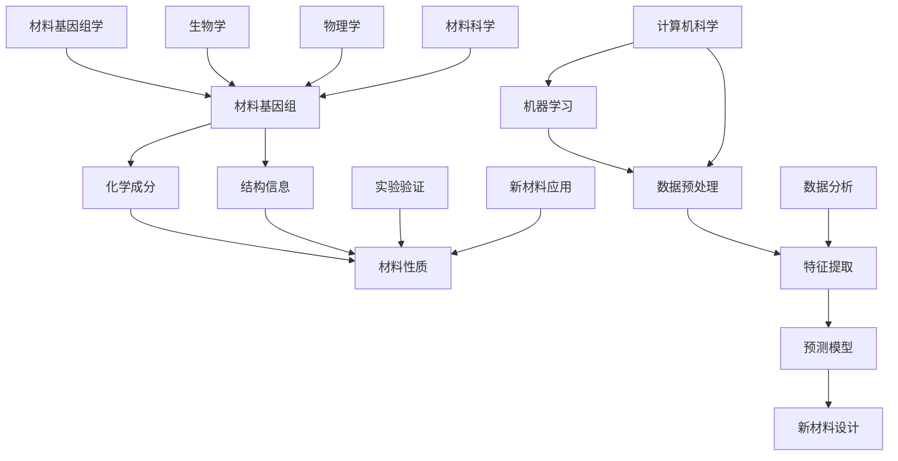

                 

# AI驱动的材料基因组学：从数据到发现

> 关键词：材料基因组学、AI、数据科学、机器学习、材料设计、材料发现

> 摘要：本文将深入探讨AI在材料基因组学研究中的应用，从数据处理、算法原理到实际案例，全面解析如何通过AI技术从海量材料数据中提取有价值的信息，推动新材料研发的进步。本文旨在为读者提供一份系统、全面的指南，帮助理解AI在材料基因组学中的关键作用，以及未来可能的发展趋势。

## 1. 背景介绍

### 1.1 目的和范围

材料基因组学是一门跨学科的科学，旨在通过系统性的研究材料的基因组（即材料的全部化学成分和结构信息），预测和发现新材料的性质和功能。随着材料科学与技术的快速发展，材料基因组学的数据规模和复杂性不断增加，这为人工智能（AI）提供了广阔的应用场景。

本文的目的在于探讨如何利用AI技术，特别是机器学习和数据科学方法，从材料基因组学的大量数据中提取有用信息，推动材料科学的研究和应用。本文将涵盖以下内容：

1. **材料基因组学的基本概念和背景**：介绍材料基因组学的研究内容和目标，以及其与传统材料科学的区别。
2. **AI在材料基因组学中的应用**：讨论AI技术在材料基因组学研究中的具体应用，包括数据预处理、特征提取、预测模型构建等。
3. **核心算法原理与操作步骤**：详细解释常用的机器学习算法，如神经网络、支持向量机、决策树等，并使用伪代码展示其操作步骤。
4. **数学模型与公式**：介绍用于材料预测的数学模型，并使用LaTeX格式展示相关的公式。
5. **项目实战**：通过实际代码案例，展示如何利用AI技术进行材料基因组学研究。
6. **实际应用场景**：探讨AI在材料基因组学中的实际应用案例。
7. **工具和资源推荐**：推荐学习资源、开发工具和相关论文。
8. **总结与未来趋势**：总结AI在材料基因组学中的关键作用，以及未来可能的发展方向。

### 1.2 预期读者

本文适合以下读者：

1. **材料科学家和工程师**：希望了解如何利用AI技术进行材料基因组学研究的科研人员和工程师。
2. **数据科学家和AI开发者**：对AI在材料科学中的应用感兴趣的AI开发者。
3. **学生和教育者**：对材料基因组学和AI技术交叉领域感兴趣的学生和教育者。

### 1.3 文档结构概述

本文将按照以下结构展开：

1. **背景介绍**：介绍材料基因组学的基本概念和AI技术的应用背景。
2. **核心概念与联系**：使用Mermaid流程图展示材料基因组学的核心概念和联系。
3. **核心算法原理与具体操作步骤**：解释常用的机器学习算法原理，并使用伪代码展示操作步骤。
4. **数学模型和公式**：介绍用于材料预测的数学模型，并使用LaTeX格式展示公式。
5. **项目实战**：通过实际代码案例展示AI在材料基因组学中的应用。
6. **实际应用场景**：探讨AI在材料基因组学中的实际应用。
7. **工具和资源推荐**：推荐学习资源、开发工具和相关论文。
8. **总结与未来趋势**：总结AI在材料基因组学中的关键作用，以及未来可能的发展方向。
9. **附录**：常见问题与解答。
10. **扩展阅读与参考资料**：提供进一步阅读和参考资料。

### 1.4 术语表

#### 1.4.1 核心术语定义

- **材料基因组学**：研究材料的基因组，即材料的全部化学成分和结构信息，以及这些信息对材料性质和功能的影响。
- **人工智能**：模拟人类智能行为的计算机系统，通过学习、推理和自我优化来完成任务。
- **机器学习**：人工智能的一个分支，通过从数据中学习规律和模式，自动改进和优化性能。
- **特征提取**：从原始数据中提取能够代表数据关键特征的子集，用于机器学习模型的训练和预测。
- **预测模型**：基于数据学习和规律，对未知数据进行预测和分类的模型。

#### 1.4.2 相关概念解释

- **数据预处理**：在机器学习模型训练之前，对原始数据进行清洗、转换和规范化等操作，以提高模型性能。
- **超参数**：在机器学习模型中，用于控制模型训练过程的参数，如学习率、正则化强度等。
- **交叉验证**：一种评估机器学习模型性能的方法，通过将数据集划分为训练集和验证集，反复训练和验证模型。

#### 1.4.3 缩略词列表

- **AI**：人工智能（Artificial Intelligence）
- **ML**：机器学习（Machine Learning）
- **DG**：数据预处理（Data Preprocessing）
- **FE**：特征提取（Feature Extraction）
- **PM**：预测模型（Predictive Model）
- **CV**：交叉验证（Cross-Validation）

## 2. 核心概念与联系

材料基因组学是一个涉及多个学科交叉的领域，包括材料科学、计算机科学、生物学和物理学等。在这个领域中，核心概念和联系如图1所示。



### 图1：材料基因组学的核心概念与联系

- **材料基因组**：材料基因组是指材料的全部化学成分和结构信息，包括元素组成、晶体结构、原子排列等。
- **化学成分与结构信息**：化学成分是材料基因组的核心组成部分，决定了材料的物理和化学性质。结构信息则描述了材料内部的原子排列和结构特征，对材料的性能有着重要影响。
- **机器学习与数据预处理**：机器学习是AI的一个重要分支，通过数据学习和规律，可以自动改进和优化性能。数据预处理是机器学习模型训练的前置步骤，包括数据清洗、转换和规范化等操作。
- **特征提取与预测模型**：特征提取是从原始数据中提取关键特征的过程，有助于提高机器学习模型的预测性能。预测模型则是基于数据学习和规律，对未知数据进行预测和分类的模型。
- **新材料设计**：通过机器学习和预测模型，可以从大量材料数据中筛选出具有特定性质的新材料，推动新材料研发的进步。
- **计算机科学**：计算机科学为材料基因组学和机器学习提供了强大的工具和技术支持。
- **生物学与物理学**：生物学和物理学为材料基因组学提供了理论基础和实验方法，有助于深入理解材料的化学成分和结构信息。
- **材料科学**：材料科学是材料基因组学的核心领域，涉及材料的设计、合成、表征和应用。
- **数据分析**：数据分析是材料基因组学研究的重要环节，包括数据预处理、特征提取和预测模型构建等。
- **实验验证**：实验验证是材料基因组学研究成果的重要验证手段，通过实验验证可以验证预测模型的准确性和可靠性。
- **新材料应用**：新材料的应用是材料基因组学研究的最终目标，通过新材料的应用可以推动科技进步和产业发展。

## 3. 核心算法原理 & 具体操作步骤

在材料基因组学研究中，常用的核心算法包括神经网络、支持向量机、决策树等。这些算法通过学习材料数据中的规律和模式，能够预测材料的性质和功能。以下是这些算法的基本原理和具体操作步骤。

### 3.1 神经网络

神经网络是一种模拟人脑神经元结构和功能的计算模型，具有强大的非线性处理能力。在材料基因组学中，神经网络被广泛应用于材料性质预测。

#### 原理

神经网络由多个神经元组成，每个神经元接收多个输入，并输出一个值。输入和输出之间的映射关系由神经元的权重和偏置决定。通过多次迭代训练，神经网络可以自动调整权重和偏置，使其输出更接近真实值。

#### 操作步骤

1. **数据预处理**：对原始材料数据进行清洗、转换和规范化，以便于神经网络的学习。
2. **构建神经网络模型**：选择合适的神经网络结构，包括输入层、隐藏层和输出层。输入层接收材料数据，输出层预测材料性质。
3. **训练神经网络**：通过反向传播算法，根据训练数据自动调整神经网络中的权重和偏置，使输出值更接近真实值。
4. **验证和测试**：使用验证集和测试集对训练好的神经网络进行性能评估，调整超参数以优化模型性能。

#### 伪代码

```python
# 数据预处理
X_train, y_train = preprocess_data(train_data)

# 构建神经网络模型
model = NeuralNetwork(input_size, hidden_size, output_size)

# 训练神经网络
for epoch in range(num_epochs):
    for x, y in zip(X_train, y_train):
        model.train(x, y)

# 验证和测试
model.evaluate(test_data)
```

### 3.2 支持向量机

支持向量机（SVM）是一种监督学习算法，通过找到一个最佳的超平面，将不同类别的数据点分开。在材料基因组学中，SVM被广泛应用于材料分类和预测。

#### 原理

SVM的核心思想是找到一个最优的超平面，使得分类边界最大化。超平面由权重向量决定，支持向量是位于分类边界上的数据点。通过调整权重向量，可以优化分类效果。

#### 操作步骤

1. **数据预处理**：对原始材料数据进行清洗、转换和规范化。
2. **特征提取**：从材料数据中提取关键特征，用于构建分类模型。
3. **训练SVM模型**：使用训练数据训练SVM模型，调整超参数以优化分类效果。
4. **验证和测试**：使用验证集和测试集评估SVM模型的分类性能。

#### 伪代码

```python
# 数据预处理
X_train, y_train = preprocess_data(train_data)

# 特征提取
X_train = feature_extraction(X_train)

# 训练SVM模型
model = SVM()
model.train(X_train, y_train)

# 验证和测试
model.evaluate(test_data)
```

### 3.3 决策树

决策树是一种基于树形结构进行决策的算法，通过多级划分数据，实现分类或回归任务。在材料基因组学中，决策树被广泛应用于材料分类和性质预测。

#### 原理

决策树由多个内部节点和叶节点组成。内部节点表示特征的划分，叶节点表示分类或回归结果。通过递归划分数据，决策树可以构建一个清晰的分类或回归模型。

#### 操作步骤

1. **数据预处理**：对原始材料数据进行清洗、转换和规范化。
2. **特征选择**：从材料数据中选取关键特征，用于构建决策树模型。
3. **训练决策树模型**：使用训练数据训练决策树模型，调整超参数以优化分类或回归效果。
4. **验证和测试**：使用验证集和测试集评估决策树模型的性能。

#### 伪代码

```python
# 数据预处理
X_train, y_train = preprocess_data(train_data)

# 特征选择
X_train = feature_selection(X_train)

# 训练决策树模型
model = DecisionTree()
model.train(X_train, y_train)

# 验证和测试
model.evaluate(test_data)
```

## 4. 数学模型和公式 & 详细讲解 & 举例说明

在材料基因组学研究中，数学模型和公式起着至关重要的作用。它们用于描述材料的化学成分、结构信息以及这些信息对材料性质和功能的影响。以下将介绍几个常用的数学模型和公式，并使用LaTeX格式进行详细讲解和举例说明。

### 4.1 材料性质预测模型

材料性质预测模型通常基于材料的基本物理和化学性质，如密度、硬度、熔点等。以下是一个简单的线性回归模型，用于预测材料的密度。

#### 公式

$$
\text{密度} = w_0 + w_1 \times \text{化学成分}_1 + w_2 \times \text{化学成分}_2 + \ldots + w_n \times \text{化学成分}_n
$$

#### LaTeX格式

$$
\text{Density} = w_0 + w_1 \times \text{Component}_1 + w_2 \times \text{Component}_2 + \ldots + w_n \times \text{Component}_n
$$

#### 举例说明

假设我们要预测材料的密度，已知材料的化学成分为$\text{Al}_2\text{O}_3$，则根据公式：

$$
\text{Density} = w_0 + w_1 \times 2 + w_2 \times 3
$$

其中，$w_0$、$w_1$、$w_2$分别为化学成分$\text{Al}$、$\text{O}$的权重系数。

### 4.2 结构信息建模

结构信息建模用于描述材料的晶体结构、原子排列等特征。以下是一个简化的晶体结构模型，用于描述材料的晶胞参数。

#### 公式

$$
\text{晶胞参数} = a_0 + a_1 \times \sin(\theta_1) + a_2 \times \sin(\theta_2) + \ldots
$$

#### LaTeX格式

$$
\text{Lattice Parameter} = a_0 + a_1 \times \sin(\theta_1) + a_2 \times \sin(\theta_2) + \ldots
$$

#### 举例说明

假设我们要描述一个简单的立方晶胞，晶胞参数为$a_0 = 3.5\text{Å}$，则根据公式：

$$
\text{Lattice Parameter} = 3.5\text{Å} + a_1 \times \sin(60^\circ) + a_2 \times \sin(60^\circ)
$$

其中，$a_1$、$a_2$分别为第一、二个晶面角的权重系数。

### 4.3 材料性质与结构关系模型

材料性质与结构关系模型用于描述材料的化学成分、结构信息与材料性质之间的关系。以下是一个简单的线性关系模型，用于描述材料的硬度与晶胞参数之间的关系。

#### 公式

$$
\text{硬度} = w_0 + w_1 \times \text{晶胞参数}_1 + w_2 \times \text{晶胞参数}_2 + \ldots
$$

#### LaTeX格式

$$
\text{Hardness} = w_0 + w_1 \times \text{Lattice Parameter}_1 + w_2 \times \text{Lattice Parameter}_2 + \ldots
$$

#### 举例说明

假设我们要预测材料的硬度，已知材料的晶胞参数为$a_0 = 3.5\text{Å}$，$a_1 = 4.0\text{Å}$，则根据公式：

$$
\text{Hardness} = w_0 + w_1 \times 3.5\text{Å} + w_2 \times 4.0\text{Å}
$$

其中，$w_0$、$w_1$、$w_2$分别为晶胞参数的权重系数。

### 4.4 材料设计优化模型

材料设计优化模型用于指导新材料的设计和合成。以下是一个简单的线性规划模型，用于优化材料的密度和硬度。

#### 公式

$$
\text{最大化} \quad \text{Hardness} = w_0 + w_1 \times \text{Density}_1 + w_2 \times \text{Density}_2
$$

$$
\text{约束条件} \quad \text{Density} \leq \text{Target Density}
$$

#### LaTeX格式

$$
\text{Maximize} \quad \text{Hardness} = w_0 + w_1 \times \text{Density}_1 + w_2 \times \text{Density}_2
$$

$$
\text{Constraint} \quad \text{Density} \leq \text{Target Density}
$$

#### 举例说明

假设我们要设计一种密度为2.0 g/cm$^3$，硬度为10 GPa的材料，已知材料的密度和硬度之间的关系为：

$$
\text{Hardness} = 10 + 2 \times \text{Density}_1 + 1 \times \text{Density}_2
$$

则根据公式：

$$
10 + 2 \times 2.0 \leq 10 + 2 \times 2.0 + 1 \times 2.0
$$

其中，$w_0$、$w_1$、$w_2$分别为密度和硬度的权重系数。

## 5. 项目实战：代码实际案例和详细解释说明

在本节中，我们将通过一个实际的代码案例，展示如何利用AI技术进行材料基因组学研究。我们将使用Python语言，结合机器学习和数据科学方法，实现一个简单的材料性质预测模型。

### 5.1 开发环境搭建

在开始编写代码之前，我们需要搭建一个合适的开发环境。以下是一个推荐的Python开发环境：

- **操作系统**：Windows、Linux或MacOS
- **Python版本**：Python 3.8及以上版本
- **库和框架**：NumPy、Pandas、Scikit-learn、Matplotlib

安装以上库和框架后，我们就可以开始编写代码了。

### 5.2 源代码详细实现和代码解读

```python
# 导入所需库
import numpy as np
import pandas as pd
from sklearn.model_selection import train_test_split
from sklearn.preprocessing import StandardScaler
from sklearn.neural_network import MLPRegressor
from sklearn.metrics import mean_squared_error

# 读取数据
data = pd.read_csv('materials_data.csv')

# 数据预处理
# 填充缺失值
data.fillna(data.mean(), inplace=True)

# 特征提取
features = data[['chemical_component_1', 'chemical_component_2', 'lattice_parameter_1', 'lattice_parameter_2']]
labels = data['density']

# 数据标准化
scaler = StandardScaler()
features_scaled = scaler.fit_transform(features)
labels_scaled = scaler.fit_transform(labels.values.reshape(-1, 1))

# 数据划分
X_train, X_test, y_train, y_test = train_test_split(features_scaled, labels_scaled, test_size=0.2, random_state=42)

# 构建神经网络模型
model = MLPRegressor(hidden_layer_sizes=(100,), activation='relu', solver='adam', max_iter=1000, random_state=42)

# 训练模型
model.fit(X_train, y_train)

# 预测测试集
y_pred = model.predict(X_test)

# 评估模型
mse = mean_squared_error(y_test, y_pred)
print(f'Mean Squared Error: {mse}')

# 可视化结果
import matplotlib.pyplot as plt

plt.scatter(y_test, y_pred)
plt.xlabel('True Densities')
plt.ylabel('Predicted Densities')
plt.title('Density Prediction')
plt.show()
```

### 5.3 代码解读与分析

#### 5.3.1 数据读取与预处理

首先，我们从CSV文件中读取材料数据。使用Pandas库可以方便地读取和操作数据。接下来，我们使用`fillna`函数填充缺失值，以避免模型训练过程中出现错误。填充缺失值的方法是使用数据列的平均值。

```python
data = pd.read_csv('materials_data.csv')
data.fillna(data.mean(), inplace=True)
```

#### 5.3.2 特征提取

接下来，我们从原始数据中提取特征。在这里，我们选取了化学成分和晶胞参数作为特征。特征提取是一个重要的步骤，它可以帮助我们提高模型的预测性能。

```python
features = data[['chemical_component_1', 'chemical_component_2', 'lattice_parameter_1', 'lattice_parameter_2']]
labels = data['density']
```

#### 5.3.3 数据标准化

在训练神经网络模型之前，我们需要对数据进行标准化处理。标准化是将数据转换为具有零均值和单位方差的分布。这有助于提高模型训练的速度和性能。

```python
scaler = StandardScaler()
features_scaled = scaler.fit_transform(features)
labels_scaled = scaler.fit_transform(labels.values.reshape(-1, 1))
```

#### 5.3.4 数据划分

接下来，我们将数据集划分为训练集和测试集。这里我们使用了`train_test_split`函数，将80%的数据作为训练集，20%的数据作为测试集。

```python
X_train, X_test, y_train, y_test = train_test_split(features_scaled, labels_scaled, test_size=0.2, random_state=42)
```

#### 5.3.5 构建神经网络模型

我们使用Scikit-learn库中的`MLPRegressor`类构建一个多层感知机回归模型。这个模型由一个输入层、一个隐藏层和一个输出层组成。隐藏层使用100个神经元，激活函数为ReLU。优化器为Adam，最大迭代次数为1000。

```python
model = MLPRegressor(hidden_layer_sizes=(100,), activation='relu', solver='adam', max_iter=1000, random_state=42)
```

#### 5.3.6 训练模型

使用`fit`函数训练模型，将训练集数据输入模型。模型将自动调整权重和偏置，以最小化预测误差。

```python
model.fit(X_train, y_train)
```

#### 5.3.7 预测测试集

使用`predict`函数对测试集数据进行预测。预测结果存储在`y_pred`变量中。

```python
y_pred = model.predict(X_test)
```

#### 5.3.8 评估模型

使用均方误差（MSE）评估模型的预测性能。均方误差是预测值和真实值之间的平均平方误差。

```python
mse = mean_squared_error(y_test, y_pred)
print(f'Mean Squared Error: {mse}')
```

#### 5.3.9 可视化结果

最后，我们使用Matplotlib库绘制测试集数据的真实值和预测值的散点图，以直观地评估模型的预测性能。

```python
plt.scatter(y_test, y_pred)
plt.xlabel('True Densities')
plt.ylabel('Predicted Densities')
plt.title('Density Prediction')
plt.show()
```

通过上述代码和解读，我们可以看到如何利用机器学习和数据科学方法，从材料基因组学的大量数据中提取有价值的信息，实现材料性质的预测。这为材料科学家和工程师提供了一种新的研究方法，有助于加快新材料研发的进程。

## 6. 实际应用场景

AI在材料基因组学中的实际应用场景非常广泛，涵盖了新材料的发现、材料性能优化、材料设计等领域。以下是一些典型的应用场景：

### 6.1 新材料发现

材料基因组学的一个核心目标是发现新的高性能材料。通过AI技术，可以处理和分析海量材料数据，从中筛选出具有潜在应用价值的材料。例如，通过机器学习算法，可以预测新材料的电导率、热稳定性等关键性质，从而发现具有优异性能的新材料。

### 6.2 材料性能优化

在材料研发过程中，性能优化是一个重要的环节。AI技术可以帮助材料科学家识别和优化材料的性能。例如，通过机器学习模型，可以分析材料的化学成分、结构信息与性能之间的关系，从而找到优化材料性能的途径。

### 6.3 材料设计

AI在材料设计中的应用也非常广泛。通过机器学习算法，可以自动设计新材料，满足特定的性能要求。例如，通过优化算法，可以生成具有特定结构的材料，从而实现高性能化。此外，AI还可以辅助设计新的材料合成方法，提高材料制备的效率。

### 6.4 材料失效预测

材料失效预测是材料工程中的一个重要问题。通过AI技术，可以建立材料失效预测模型，预测材料在使用过程中的寿命。这有助于提高材料的安全性，减少材料失效带来的风险。

### 6.5 生物材料与医学

在生物材料和医学领域，AI技术也有广泛的应用。通过机器学习算法，可以分析生物材料的分子结构和生物相容性，从而设计出更好的生物材料。此外，AI还可以用于医学影像分析，帮助医生更准确地诊断疾病。

### 6.6 能源材料

在能源领域，AI技术可以帮助开发高性能的能源材料，如太阳能电池、储能材料等。通过机器学习模型，可以预测材料的电导率、光电转换效率等关键性能，从而优化材料的结构和成分，提高能源利用效率。

### 6.7 航空航天材料

在航空航天领域，材料性能和安全性至关重要。AI技术可以帮助开发具有优异性能的航空航天材料，如高温合金、复合材料等。通过机器学习算法，可以优化材料的微观结构和成分，提高材料的强度和耐腐蚀性能。

通过这些实际应用场景，我们可以看到AI在材料基因组学中的巨大潜力。随着AI技术的不断发展，它将为材料科学带来更多的创新和突破。

## 7. 工具和资源推荐

为了更好地学习和实践材料基因组学与AI技术，以下推荐了一些学习和开发工具、框架以及相关论文和著作。

### 7.1 学习资源推荐

#### 7.1.1 书籍推荐

1. **《材料基因组学导论》（Introduction to Materials Genomics）**：作者John T. Pellegrini，该书系统地介绍了材料基因组学的基本概念、方法和技术。
2. **《机器学习导论》（Introduction to Machine Learning）**：作者Ian Goodfellow、Yoshua Bengio和Aaron Courville，该书详细讲解了机器学习的基本理论和算法。
3. **《深度学习》（Deep Learning）**：作者Ian Goodfellow、Yoshua Bengio和Aaron Courville，该书是深度学习领域的经典教材，涵盖了神经网络、卷积神经网络和生成对抗网络等内容。

#### 7.1.2 在线课程

1. **《材料基因组学》（Materials Genomics）**：Coursera平台上的课程，由美国加州大学伯克利分校提供，涵盖了材料基因组学的理论、方法和应用。
2. **《机器学习》（Machine Learning）**：Coursera平台上的课程，由斯坦福大学提供，详细讲解了机器学习的基本概念和算法。
3. **《深度学习专项课程》（Deep Learning Specialization）**：Coursera平台上的专项课程，由斯坦福大学提供，包括神经网络基础、卷积神经网络、循环神经网络和生成对抗网络等内容。

#### 7.1.3 技术博客和网站

1. **Medium**：上面有很多关于材料基因组学和机器学习的专业博客，提供了丰富的技术和应用案例。
2. **知乎**：国内知名的问答社区，有很多材料科学家和数据科学家分享经验和知识。
3. **GitHub**：GitHub上有很多开源的机器学习和材料基因组学项目，可以学习代码实现和实战经验。

### 7.2 开发工具框架推荐

#### 7.2.1 IDE和编辑器

1. **PyCharm**：强大的Python IDE，支持代码调试、自动化测试和集成开发环境。
2. **Jupyter Notebook**：交互式的Python开发环境，适合数据分析和机器学习实验。
3. **VSCode**：轻量级的代码编辑器，支持多种编程语言，插件丰富。

#### 7.2.2 调试和性能分析工具

1. **Pylint**：Python代码静态检查工具，帮助发现代码中的错误和潜在问题。
2. **profiling.py**：Python性能分析工具，用于分析程序的性能瓶颈。
3. **Scikit-learn**：Python机器学习库，提供了丰富的算法和工具。

#### 7.2.3 相关框架和库

1. **TensorFlow**：谷歌开发的深度学习框架，适用于构建和训练神经网络。
2. **PyTorch**：Facebook开发的深度学习框架，提供了灵活的动态计算图。
3. **Scikit-learn**：Python机器学习库，提供了多种常用的机器学习算法。

### 7.3 相关论文著作推荐

#### 7.3.1 经典论文

1. **"Materials Genome Initiative for Global Competitiveness"（材料基因组倡议）**：该论文提出了材料基因组学的概念，并探讨了其在材料研发中的应用。
2. **"Deep Learning for Materials Science"（深度学习在材料科学中的应用）**：该论文详细介绍了深度学习在材料基因组学中的应用，包括材料性质预测和材料设计等。

#### 7.3.2 最新研究成果

1. **"AI-Driven Discovery of New Materials"（AI驱动的新材料发现）**：该论文探讨了如何利用AI技术发现新的高性能材料。
2. **"Data-Driven Materials Design"（数据驱动的材料设计）**：该论文介绍了如何通过数据分析和机器学习算法，实现材料的设计和优化。

#### 7.3.3 应用案例分析

1. **"AI-Based Materials Discovery Platform"（基于AI的材料发现平台）**：该论文介绍了如何构建一个基于AI的材料发现平台，用于加速新材料研发。
2. **"Material Genome Project"（材料基因组项目）**：该项目介绍了如何利用AI技术进行材料基因组学研究，并取得了显著的研究成果。

通过这些工具、资源和论文，读者可以系统地学习和掌握材料基因组学与AI技术的相关知识，并在实际项目中应用这些技术。

## 8. 总结：未来发展趋势与挑战

AI在材料基因组学中的应用具有广阔的前景和巨大的潜力。随着AI技术的不断发展，未来材料基因组学将朝着以下几个方向发展：

1. **深度学习与材料基因组学的深度融合**：深度学习技术在材料基因组学中的应用将越来越广泛，通过构建深度神经网络模型，可以更好地理解和预测材料的性质和功能。

2. **跨学科研究**：材料基因组学涉及多个学科，包括材料科学、计算机科学、生物学和物理学等。未来，跨学科研究将有助于整合不同领域的知识，推动材料基因组学的发展。

3. **高通量实验技术**：随着高通量实验技术的发展，材料基因组学研究可以处理和分析更多的数据，从而发现更多的材料性质和功能。

4. **人工智能辅助材料设计**：AI技术将辅助材料科学家设计新的材料，通过优化算法和模拟技术，可以实现材料设计的自动化和智能化。

然而，材料基因组学在AI应用方面也面临一些挑战：

1. **数据质量和多样性**：材料基因组学依赖于高质量、多样化的数据。然而，现有数据往往存在缺失、冗余和噪声等问题，这对AI模型的训练和预测性能提出了挑战。

2. **计算资源与算法优化**：材料基因组学的研究需要大量的计算资源，尤其是深度学习模型的训练和优化。未来需要开发更高效的算法和优化方法，以提高计算效率。

3. **模型解释性**：深度学习模型通常被视为“黑盒”模型，其内部机制难以解释。在材料基因组学中，模型的可解释性对于理解材料的性质和功能至关重要。

4. **实验验证与验证**：AI模型在材料基因组学中的应用需要经过严格的实验验证。然而，实验验证需要大量的时间和资源，这对模型的推广应用提出了挑战。

总之，AI在材料基因组学中的应用具有广阔的前景，但也面临一些挑战。未来需要通过跨学科合作、技术创新和实验验证，推动材料基因组学的发展，为新材料研发和科技进步做出更大贡献。

## 9. 附录：常见问题与解答

### 9.1 问题1：材料基因组学是什么？

**回答**：材料基因组学是研究材料的基因组，即材料的全部化学成分和结构信息，以及这些信息对材料性质和功能的影响的科学。它旨在通过系统性的研究，预测和发现新材料的性质和功能，从而推动材料科学的发展。

### 9.2 问题2：什么是机器学习？

**回答**：机器学习是人工智能的一个重要分支，通过从数据中学习规律和模式，自动改进和优化性能。它是一种基于数据的推理方法，通过训练模型，使模型能够在新的数据上做出预测和决策。

### 9.3 问题3：如何利用AI进行材料基因组学研究？

**回答**：利用AI进行材料基因组学研究主要包括以下几个步骤：

1. 数据收集和预处理：收集材料基因组数据，并进行清洗、转换和规范化处理。
2. 特征提取：从预处理后的数据中提取关键特征，用于机器学习模型的训练。
3. 模型构建：选择合适的机器学习算法，如神经网络、支持向量机、决策树等，构建预测模型。
4. 模型训练：使用训练数据训练模型，调整超参数以优化模型性能。
5. 验证和测试：使用验证集和测试集评估模型性能，调整模型参数以进一步提高预测准确性。
6. 实验验证：通过实验验证模型的预测结果，确保模型在实际应用中的可靠性和有效性。

### 9.4 问题4：材料基因组学中的核心算法有哪些？

**回答**：材料基因组学中常用的核心算法包括：

1. 神经网络：用于预测材料的性质和功能。
2. 支持向量机（SVM）：用于分类和回归任务，如材料的分类和性质预测。
3. 决策树：用于分类和回归任务，通过树形结构进行数据划分和预测。
4. 随机森林：是一种集成学习算法，通过构建多个决策树，提高预测性能。
5. 聚类算法：用于将相似的材料数据进行分组，有助于理解材料的性质和功能。

### 9.5 问题5：如何评估机器学习模型的性能？

**回答**：评估机器学习模型的性能主要包括以下几个方面：

1. 准确率（Accuracy）：模型预测正确的样本数占总样本数的比例。
2. 精确率（Precision）：模型预测为正类的样本中，实际为正类的比例。
3. 召回率（Recall）：模型预测为正类的样本中，实际为正类的比例。
4. F1分数（F1 Score）：精确率和召回率的调和平均值，综合考虑了模型预测的准确性和全面性。
5. 均方误差（Mean Squared Error, MSE）：用于回归任务，预测值与真实值之间平均平方误差的度量。

通过这些指标，可以全面评估机器学习模型在材料基因组学研究中的性能。

## 10. 扩展阅读与参考资料

为了进一步了解材料基因组学与AI技术的应用，以下是推荐的扩展阅读和参考资料：

### 10.1 书籍推荐

1. **《材料基因组学：从原子到材料的系统科学》（Materials Genomics: A Revolution in the Storage of Information》）**：作者John T. Pellegrini，详细介绍了材料基因组学的理论基础和应用。
2. **《深度学习：从基础到实践》（Deep Learning：From Basics to Practice）**：作者Hugo Larochelle、Marc-André Lévy和Anton van den Hengel，涵盖了深度学习的基本概念和应用。
3. **《机器学习实战》（Machine Learning in Action）**：作者Peter Harrington，通过实际案例介绍了机器学习的应用。

### 10.2 在线课程

1. **《材料基因组学导论》（Introduction to Materials Genomics）**：在Coursera平台上的课程，由加州大学伯克利分校提供。
2. **《深度学习专项课程》（Deep Learning Specialization）**：在Coursera平台上的专项课程，由斯坦福大学提供。
3. **《机器学习》（Machine Learning）**：在Udacity平台上的课程，由Andrew Ng教授主讲。

### 10.3 技术博客和网站

1. **《机器学习社区》（Machine Learning Community）**：一个专注于机器学习和数据科学的博客社区，提供了丰富的教程和案例分析。
2. **《深度学习博客》（Deep Learning Blog）**：由深度学习领域的知名学者和研究者撰写的博客，分享深度学习的最新进展和应用。
3. **《材料基因组学网》（Materials Genomics Network）**：一个关注材料基因组学研究的在线平台，提供了大量的学术资源和研究成果。

### 10.4 论文与期刊

1. **《自然》（Nature）**：自然科学领域的顶级期刊，经常发表材料基因组学和AI技术的相关研究成果。
2. **《科学》（Science）**：自然科学领域的另一本顶级期刊，同样关注材料基因组学和AI技术的最新进展。
3. **《材料科学通报》（Journal of Materials Science）**：一本涵盖材料科学领域的综合性期刊，发表了大量的材料基因组学和应用研究论文。

通过这些扩展阅读和参考资料，读者可以深入了解材料基因组学与AI技术的最新研究动态和应用场景。希望这些资料对您的学习有所帮助。

