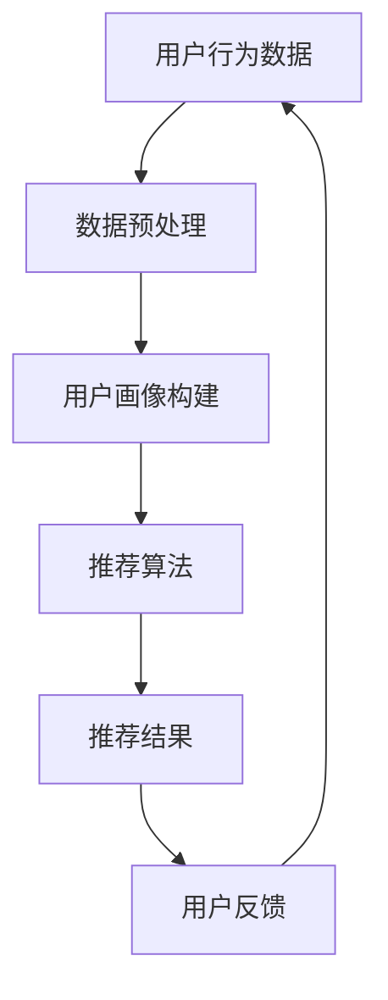
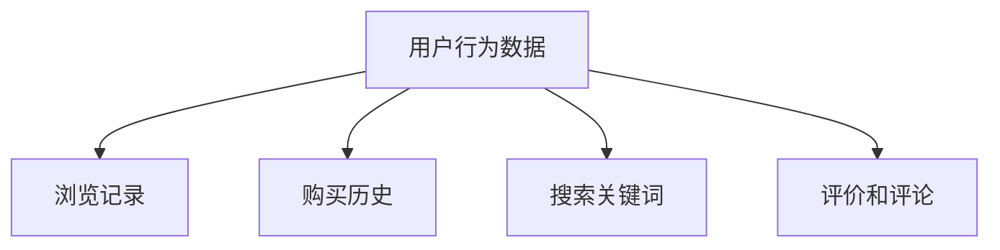
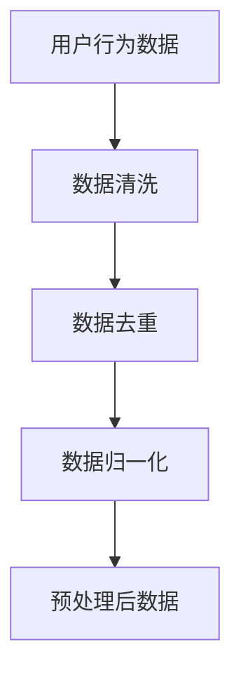
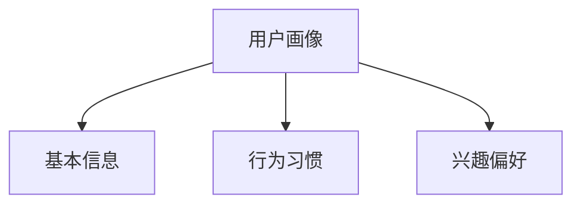
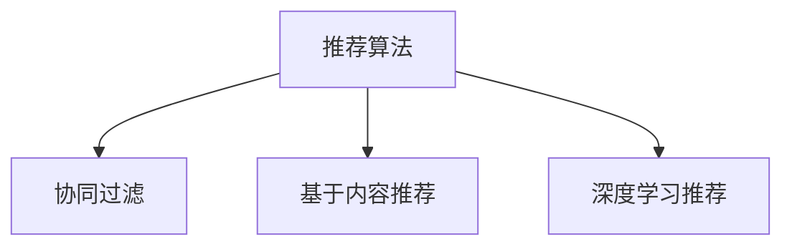
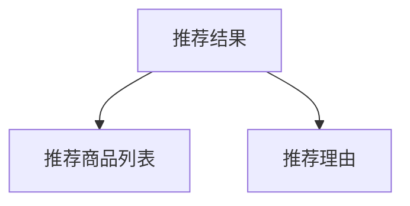
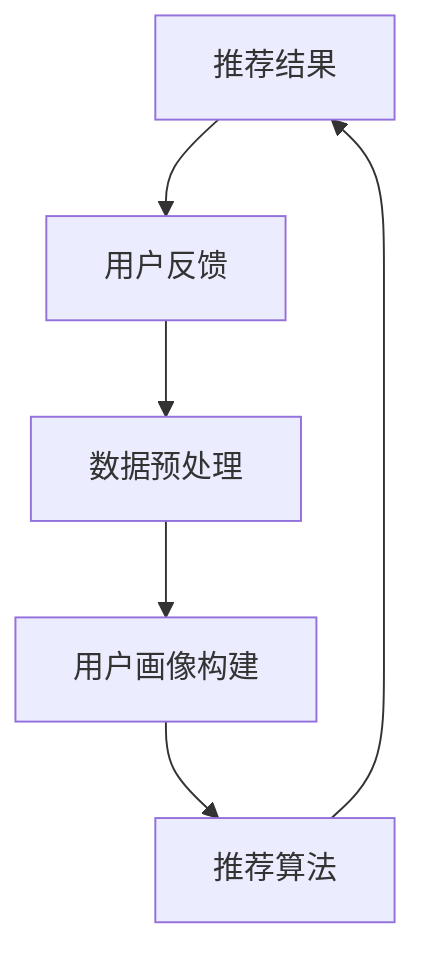

                 

### 1. 背景介绍

#### 1.1 目的和范围

本文旨在探讨人工智能（AI）在电商个性化领域中的应用，尤其是如何利用AI技术提升个人企业的用户体验。随着互联网技术的发展，电商行业已成为全球商业活动中不可或缺的一部分。而在这个竞争激烈的市场中，个性化服务已成为商家获取客户、提高客户忠诚度和转化率的重要手段。本文将深入分析AI驱动的电商个性化技术，包括其核心概念、算法原理、数学模型、实际应用案例以及未来发展挑战。

#### 1.2 预期读者

本文面向具有中高级编程技能的IT从业者、计算机科学和电子商务专业学生以及对企业个性化服务有浓厚兴趣的创业者。读者需要对基础的机器学习和数据挖掘技术有一定的了解，以便更好地理解本文的内容。

#### 1.3 文档结构概述

本文分为十个主要部分，具体如下：

1. **背景介绍**：介绍文章的目的、范围、预期读者以及文档结构。
2. **核心概念与联系**：通过Mermaid流程图展示电商个性化技术的核心概念和联系。
3. **核心算法原理与具体操作步骤**：详细讲解电商个性化算法的基本原理和具体操作步骤。
4. **数学模型和公式**：介绍与电商个性化相关的数学模型和公式，并进行详细讲解和举例说明。
5. **项目实战**：提供实际代码案例，详细解释说明代码实现过程。
6. **实际应用场景**：探讨AI驱动的电商个性化在不同行业中的应用。
7. **工具和资源推荐**：推荐学习资源、开发工具和框架。
8. **总结**：总结文章的主要观点，展望未来发展趋势和挑战。
9. **附录**：提供常见问题与解答。
10. **扩展阅读**：推荐相关书籍、论文和参考资料。

#### 1.4 术语表

为了确保读者能够更好地理解本文内容，以下列出了一些核心术语及其定义：

- **电商个性化**：指利用人工智能技术，根据用户的行为数据、兴趣偏好等个性化信息，为用户推荐个性化的商品和服务。
- **机器学习**：指使计算机通过数据学习，从经验中获取知识和规律，从而对未知数据进行预测或决策的过程。
- **用户画像**：指对用户的基本信息、行为习惯、兴趣偏好等进行综合分析，形成的用户描述。
- **协同过滤**：指通过分析用户的历史行为和评分数据，找出相似用户，并根据相似用户的评分预测当前用户的评分。
- **深度学习**：指一种基于多层神经网络的学习方法，通过多层次的非线性变换，提取数据中的特征表示。
- **推荐系统**：指利用机器学习、数据挖掘等技术，为用户推荐其可能感兴趣的信息、商品或服务。

在后续内容中，我们将对这些术语进行详细解释和讨论。

#### 1.4.1 核心术语定义

1. **电商个性化**：

电商个性化是指通过利用人工智能技术，对用户的行为数据、兴趣偏好等进行深入分析，从而为用户推荐个性化的商品和服务。这一过程主要包括数据收集、用户画像构建、推荐算法应用和结果反馈等环节。

2. **机器学习**：

机器学习是一种使计算机通过数据学习，从经验中获取知识和规律的方法。它通过构建数学模型，将输入数据映射到输出结果，从而实现对未知数据的预测或决策。机器学习包括监督学习、无监督学习和强化学习等不同类型。

3. **用户画像**：

用户画像是对用户的基本信息、行为习惯、兴趣偏好等进行综合分析，形成的用户描述。它通常包括用户的基础属性（如年龄、性别、地理位置等）、行为属性（如浏览记录、购买记录、评论等）和兴趣偏好（如喜欢的商品类型、品牌、价格等）。

4. **协同过滤**：

协同过滤是一种常用的推荐系统算法，通过分析用户的历史行为和评分数据，找出相似用户，并根据相似用户的评分预测当前用户的评分。协同过滤包括基于用户的协同过滤和基于物品的协同过滤两种类型。

5. **深度学习**：

深度学习是一种基于多层神经网络的学习方法，通过多层次的非线性变换，提取数据中的特征表示。深度学习在网络结构、优化算法和数据处理等方面都有显著的优势，已在图像识别、语音识别、自然语言处理等领域取得了显著的成果。

6. **推荐系统**：

推荐系统是一种利用机器学习、数据挖掘等技术，为用户推荐其可能感兴趣的信息、商品或服务的技术。推荐系统通常包括数据收集、用户画像构建、推荐算法应用和结果反馈等环节，旨在提高用户满意度、提升商家销售额。

#### 1.4.2 相关概念解释

1. **协同过滤与深度学习的关系**：

协同过滤和深度学习都是推荐系统中的重要技术。协同过滤主要通过分析用户之间的相似性和用户的历史行为数据来进行推荐，而深度学习则通过构建多层神经网络，对输入数据进行特征提取和表示，从而实现对数据的理解和预测。协同过滤和深度学习可以结合使用，协同过滤用于生成初始推荐结果，深度学习用于优化和提升推荐效果。

2. **电商个性化与用户画像的关系**：

电商个性化是基于用户画像构建的。用户画像通过对用户的基本信息、行为习惯、兴趣偏好等进行综合分析，形成对用户的全面了解。电商个性化利用用户画像，为用户推荐个性化的商品和服务，从而提升用户体验和满意度。

#### 1.4.3 缩略词列表

- AI：人工智能（Artificial Intelligence）
- ML：机器学习（Machine Learning）
- DS：数据科学（Data Science）
- NLP：自然语言处理（Natural Language Processing）
- CV：计算机视觉（Computer Vision）
- IoT：物联网（Internet of Things）
- RL：强化学习（Reinforcement Learning）

### 1.4.4 背景知识

在深入探讨AI驱动的电商个性化之前，我们需要了解一些相关的基础知识和背景。

**1. 人工智能的发展历程**

人工智能（AI）是一门研究、开发用于模拟、延伸和扩展人的智能的理论、方法、技术及应用系统的综合技术科学。人工智能的发展历程大致可以分为以下几个阶段：

- **初始阶段**（20世纪50-60年代）：以符号主义为代表的早期人工智能研究，主要关注逻辑推理和问题求解。
- **第一波热潮**（20世纪70-80年代）：随着计算机性能的提升，人工智能应用开始进入实际领域，如专家系统、自然语言处理等。
- **低谷期**（20世纪80-90年代）：由于实际应用效果不理想，人工智能研究进入低谷期。
- **第二波热潮**（21世纪初至今）：随着深度学习、大数据和计算能力的快速发展，人工智能迎来新一轮热潮，应用领域不断扩大，包括图像识别、语音识别、自然语言处理等。

**2. 电商行业的发展现状**

电商行业在全球范围内呈现出快速增长的趋势，成为传统零售业的有力竞争者。根据统计，全球电商市场规模已超过3万亿美元，且仍保持较高的增长率。电商行业的发展现状主要表现在以下几个方面：

- **市场规模扩大**：随着互联网普及率的提高，越来越多的消费者倾向于在线购物，电商市场规模持续扩大。
- **多元化业务模式**：电商企业不断创新业务模式，如直播电商、社交电商等，以满足不同消费者的需求。
- **技术创新驱动**：大数据、人工智能、区块链等新技术在电商行业的应用日益广泛，提升了电商平台的运营效率和用户体验。
- **竞争加剧**：电商市场进入门槛降低，大量企业涌入，导致市场竞争日益激烈。

**3. 个性化服务在电商行业的重要性**

个性化服务已成为电商行业提升用户满意度、增加用户黏性和转化率的重要手段。个性化服务包括但不限于以下几个方面：

- **商品推荐**：基于用户的兴趣偏好和行为数据，为用户推荐个性化的商品。
- **定制化营销**：根据用户的行为和偏好，设计针对性的营销策略，提高营销效果。
- **个性化客户服务**：根据用户的购买历史和服务反馈，提供定制化的客户服务。
- **用户互动**：通过社交媒体、直播等形式，增强用户与平台、商家之间的互动，提升用户体验。

在接下来的部分，我们将详细讨论电商个性化技术的核心概念、算法原理和实际应用，帮助读者更好地理解这一领域的前沿发展。

### 2. 核心概念与联系

在深入探讨电商个性化技术之前，我们需要先了解其核心概念及其相互联系。本文将通过一个Mermaid流程图来展示电商个性化技术的核心概念和架构，以便读者更好地理解。



#### 2.1 用户行为数据

用户行为数据是电商个性化技术的基础，包括用户在平台上的浏览记录、购买历史、搜索关键词、评价和评论等信息。这些数据通常通过网站日志、点击流数据、用户行为日志等渠道收集。



#### 2.2 数据预处理

数据预处理是确保数据质量和可靠性的关键步骤。包括数据清洗、数据去重、数据归一化等操作。通过数据预处理，我们可以得到干净、结构化的用户行为数据，以便后续分析和建模。



#### 2.3 用户画像构建

用户画像是对用户的基本信息、行为习惯、兴趣偏好等进行综合分析，形成的用户描述。通过用户画像，我们可以更好地理解用户的需求，从而实现精准推荐。



#### 2.4 推荐算法

推荐算法是电商个性化技术的核心。常用的推荐算法包括协同过滤、基于内容的推荐和深度学习推荐等。通过推荐算法，我们可以根据用户画像和商品特征，为用户推荐个性化的商品。



#### 2.5 推荐结果

推荐结果是推荐算法的输出，包括推荐商品列表、推荐理由等。通过推荐结果，用户可以直观地了解平台为其推荐的商品，从而提高购买意愿。



#### 2.6 用户反馈

用户反馈是优化推荐结果的重要依据。通过收集用户对推荐结果的反馈，我们可以对推荐算法进行迭代和优化，提高推荐效果。



通过上述Mermaid流程图，我们可以清晰地看到电商个性化技术的核心概念及其相互联系。在接下来的部分，我们将详细讲解电商个性化算法的基本原理和具体操作步骤，帮助读者更好地理解和应用这些技术。

### 3. 核心算法原理 & 具体操作步骤

在电商个性化技术中，推荐算法是核心组成部分。本文将介绍几种常见的推荐算法，包括协同过滤、基于内容的推荐和深度学习推荐，并详细阐述其原理和具体操作步骤。

#### 3.1 协同过滤算法

协同过滤算法是一种基于用户行为数据的推荐方法，通过分析用户之间的相似性和历史行为数据，预测用户对未知商品的评分或兴趣。协同过滤算法分为基于用户的协同过滤和基于物品的协同过滤两种类型。

##### 3.1.1 基于用户的协同过滤

**原理**：

基于用户的协同过滤通过分析用户之间的相似度，找出与目标用户兴趣相似的其他用户，并根据这些用户的评分预测目标用户对未知商品的评分。

**步骤**：

1. **用户相似度计算**：

   设用户集合为 \( U = \{u_1, u_2, ..., u_n\} \)，商品集合为 \( I = \{i_1, i_2, ..., i_m\} \)。对于每个用户 \( u_i \)，其评分为 \( R_{ui} \)，则用户相似度可以通过以下公式计算：

   \[
   \sim u_i(u_j) = \frac{R_{ui} \cdot R_{uj}}{\sqrt{||R_{ui}|| \cdot ||R_{uj}||}}
   \]

   其中，\( ||R_{ui}|| \) 表示用户 \( u_i \) 的评分向量范数。

2. **生成推荐列表**：

   对目标用户 \( u_i \)，计算与 \( u_i \) 最相似的 \( k \) 个用户（邻居），并找出这些邻居共同喜欢的商品，生成推荐列表。

3. **评分预测**：

   对于未知商品 \( i_j \)，根据邻居用户的评分预测目标用户的评分：

   \[
   \hat{R}_{ui_j} = \frac{\sum_{u_j \in N(u_i)} R_{u_ji_j} \cdot \sim u_i(u_j)}{\sum_{u_j \in N(u_i)} \sim u_i(u_j)}
   \]

##### 3.1.2 基于物品的协同过滤

**原理**：

基于物品的协同过滤通过分析商品之间的相似度，找出与目标商品相似的其他商品，并根据这些商品的历史评分预测目标用户对它们的评分。

**步骤**：

1. **商品相似度计算**：

   设商品集合为 \( I = \{i_1, i_2, ..., i_m\} \)，用户评分矩阵为 \( R \)。对于每个商品 \( i_i \)，其相似度可以通过以下公式计算：

   \[
   \sim i_i(i_j) = \frac{||R_i - R_j||}{\sqrt{||R_i||^2 + ||R_j||^2}}
   \]

2. **生成推荐列表**：

   对目标商品 \( i_i \)，计算与 \( i_i \) 最相似的 \( k \) 个商品，并找出这些商品被目标用户喜欢的概率，生成推荐列表。

3. **评分预测**：

   对于未知商品 \( i_j \)，根据相似商品的历史评分预测目标用户的评分：

   \[
   \hat{R}_{ui_j} = \frac{\sum_{i_j \in N(i_i)} R_{ui_j} \cdot \sim i_i(i_j)}{\sum_{i_j \in N(i_i)} \sim i_i(i_j)}
   \]

#### 3.2 基于内容的推荐算法

基于内容的推荐算法通过分析商品的属性和用户的历史行为，为用户推荐与其兴趣相关的商品。该算法的核心是利用商品和用户特征之间的相关性进行推荐。

**原理**：

基于内容的推荐算法通过以下步骤实现：

1. **商品特征提取**：为每个商品提取描述其特征的关键词或属性，如品牌、价格、颜色、材质等。
2. **用户兴趣模型构建**：根据用户的历史行为数据，构建用户的兴趣模型，如用户喜欢的商品类型、品牌、价格范围等。
3. **推荐生成**：计算商品特征和用户兴趣模型之间的相似度，为用户推荐与其兴趣相关的商品。

**步骤**：

1. **商品特征提取**：

   设商品集合为 \( I = \{i_1, i_2, ..., i_m\} \)，商品特征向量集合为 \( F = \{f_1, f_2, ..., f_n\} \)。对于每个商品 \( i_i \)，其特征向量 \( F_i = [f_{i1}, f_{i2}, ..., f_{in}] \)。

2. **用户兴趣模型构建**：

   设用户集合为 \( U = \{u_1, u_2, ..., u_n\} \)，用户兴趣向量集合为 \( M = \{m_1, m_2, ..., m_n\} \)。对于每个用户 \( u_i \)，其兴趣向量 \( M_i = [m_{i1}, m_{i2}, ..., m_{in}] \)。

3. **推荐生成**：

   对于每个用户 \( u_i \)，计算其兴趣向量 \( M_i \) 与每个商品特征向量 \( F_i \) 之间的相似度，生成推荐列表。

   \[
   \sim m_i(f_j) = \frac{M_i \cdot F_j}{\|M_i\| \cdot \|F_j\|}
   \]

   其中，\( \|M_i\| \) 和 \( \|F_j\| \) 分别表示用户兴趣向量和商品特征向量的欧几里得范数。

#### 3.3 深度学习推荐算法

深度学习推荐算法利用多层神经网络对用户行为数据和商品特征进行特征提取和表示，从而实现高效的推荐。常见的深度学习推荐算法包括基于用户行为的推荐算法和基于内容的推荐算法。

##### 3.3.1 基于用户行为的深度学习推荐算法

**原理**：

基于用户行为的深度学习推荐算法通过以下步骤实现：

1. **数据预处理**：对用户行为数据进行预处理，如用户分类、商品分类、数据归一化等。
2. **构建深度神经网络**：设计多层神经网络结构，包括输入层、隐藏层和输出层。
3. **训练与优化**：使用用户行为数据进行模型训练和优化，得到用户行为表示和商品特征表示。
4. **推荐生成**：根据用户行为表示和商品特征表示，计算用户对商品的偏好分数，生成推荐列表。

**步骤**：

1. **数据预处理**：

   设用户行为数据矩阵为 \( X \)，其中 \( X_{ij} \) 表示用户 \( u_i \) 对商品 \( i_j \) 的行为评分。对用户行为数据进行预处理，如用户分类（如年龄段、性别等）、商品分类（如品牌、类别等）和数据归一化等。

2. **构建深度神经网络**：

   设计一个多层感知器（MLP）神经网络，包括输入层、隐藏层和输出层。输入层节点数与用户行为数据维度相同，隐藏层节点数根据问题复杂度进行调整，输出层节点数为商品数量。

3. **训练与优化**：

   使用用户行为数据进行模型训练和优化，通过反向传播算法更新网络权重，最小化预测误差。

4. **推荐生成**：

   对于每个用户 \( u_i \)，计算其对每个商品 \( i_j \) 的偏好分数：

   \[
   \hat{R}_{ui_j} = \sigma(\text{MLP}(X_i, W))
   \]

   其中，\( \sigma \) 表示激活函数，\( \text{MLP}(X_i, W) \) 表示多层感知器输出。

##### 3.3.2 基于内容的深度学习推荐算法

**原理**：

基于内容的深度学习推荐算法通过以下步骤实现：

1. **商品特征提取**：为每个商品提取描述其特征的关键词或属性。
2. **构建深度神经网络**：设计多层神经网络结构，包括输入层、隐藏层和输出层。
3. **训练与优化**：使用商品特征数据进行模型训练和优化，得到商品特征表示。
4. **推荐生成**：根据用户兴趣模型和商品特征表示，计算用户对商品的偏好分数，生成推荐列表。

**步骤**：

1. **商品特征提取**：

   设商品特征矩阵为 \( X \)，其中 \( X_{ij} \) 表示商品 \( i_j \) 的特征 \( f_k \) 的值。对商品特征数据进行预处理，如数据归一化等。

2. **构建深度神经网络**：

   设计一个多层感知器（MLP）神经网络，包括输入层、隐藏层和输出层。输入层节点数与商品特征数据维度相同，隐藏层节点数根据问题复杂度进行调整，输出层节点数为用户数量。

3. **训练与优化**：

   使用商品特征数据进行模型训练和优化，通过反向传播算法更新网络权重，最小化预测误差。

4. **推荐生成**：

   对于每个用户 \( u_i \)，计算其对每个商品 \( i_j \) 的偏好分数：

   \[
   \hat{R}_{ui_j} = \sigma(\text{MLP}(X_j, W'))
   \]

   其中，\( \sigma \) 表示激活函数，\( \text{MLP}(X_j, W') \) 表示多层感知器输出。

通过上述推荐算法的讲解，我们可以看到电商个性化技术在实际应用中具有广泛的选择。在实际开发中，可以根据具体需求和数据特点，选择合适的推荐算法，或结合多种算法实现更优的推荐效果。

### 4. 数学模型和公式 & 详细讲解 & 举例说明

在电商个性化技术中，数学模型和公式是理解和实现推荐算法的基础。本文将详细介绍与推荐系统相关的数学模型和公式，包括协同过滤中的相似度计算、基于内容的推荐算法中的相似度计算、以及深度学习推荐算法中的神经网络模型。我们将通过具体例子进行讲解，帮助读者更好地理解这些数学模型在实际应用中的工作原理。

#### 4.1 协同过滤算法中的数学模型

协同过滤算法的核心在于计算用户之间的相似度和预测用户对商品的评分。以下将介绍这些计算中涉及的数学模型和公式。

##### 4.1.1 用户相似度计算

用户相似度计算公式如下：

\[
\sim u_i(u_j) = \frac{R_{ui} \cdot R_{uj}}{\sqrt{||R_{ui}|| \cdot ||R_{uj}||}}
\]

其中：
- \( \sim u_i(u_j) \) 表示用户 \( u_i \) 和用户 \( u_j \) 之间的相似度。
- \( R_{ui} \) 和 \( R_{uj} \) 分别表示用户 \( u_i \) 和用户 \( u_j \) 对商品 \( i \) 和 \( j \) 的评分。
- \( ||R_{ui}|| \) 和 \( ||R_{uj}|| \) 分别表示用户 \( u_i \) 和用户 \( u_j \) 的评分向量范数。

**例子**：

假设有两个用户 \( u_1 \) 和 \( u_2 \)，他们对几款商品 \( i \) 和 \( j \) 的评分如下：

| 用户 | 商品 \( i \) | 商品 \( j \) |
| --- | --- | --- |
| \( u_1 \) | 4 | 3 |
| \( u_2 \) | 5 | 2 |

计算用户 \( u_1 \) 和 \( u_2 \) 之间的相似度：

\[
\sim u_1(u_2) = \frac{4 \cdot 2}{\sqrt{4 \cdot 5}} = \frac{8}{\sqrt{20}} = \frac{4}{\sqrt{5}} \approx 0.894
\]

##### 4.1.2 评分预测

评分预测公式如下：

\[
\hat{R}_{ui_j} = \frac{\sum_{u_j \in N(u_i)} R_{u_ji_j} \cdot \sim u_i(u_j)}{\sum_{u_j \in N(u_i)} \sim u_i(u_j)}
\]

其中：
- \( \hat{R}_{ui_j} \) 表示预测的用户 \( u_i \) 对商品 \( i_j \) 的评分。
- \( N(u_i) \) 表示与用户 \( u_i \) 相似度最高的 \( k \) 个用户。
- \( R_{u_ji_j} \) 表示用户 \( u_j \) 对商品 \( i_j \) 的评分。
- \( \sim u_i(u_j) \) 表示用户 \( u_i \) 和用户 \( u_j \) 之间的相似度。

**例子**：

假设用户 \( u_1 \) 的邻居有用户 \( u_2 \) 和 \( u_3 \)，他们对商品 \( i_2 \) 的评分分别为 4 和 3，相似度分别为 0.9 和 0.8。计算用户 \( u_1 \) 对商品 \( i_2 \) 的预测评分：

\[
\hat{R}_{u_1i_2} = \frac{0.9 \cdot 4 + 0.8 \cdot 3}{0.9 + 0.8} = \frac{3.6 + 2.4}{1.7} = \frac{6}{1.7} \approx 3.53
\]

#### 4.2 基于内容的推荐算法中的数学模型

基于内容的推荐算法通过计算商品特征和用户兴趣模型之间的相似度来实现推荐。以下将介绍相关数学模型和公式。

##### 4.2.1 商品特征提取

商品特征向量表示为 \( F_i = [f_{i1}, f_{i2}, ..., f_{in}] \)，其中 \( f_{ik} \) 表示商品 \( i \) 的第 \( k \) 个特征。

##### 4.2.2 用户兴趣模型

用户兴趣向量表示为 \( M_i = [m_{i1}, m_{i2}, ..., m_{in}] \)，其中 \( m_{ik} \) 表示用户 \( i \) 对第 \( k \) 个特征的兴趣。

##### 4.2.3 相似度计算

商品特征和用户兴趣模型之间的相似度计算公式如下：

\[
\sim m_i(f_j) = \frac{M_i \cdot F_j}{\|M_i\| \cdot \|F_j\|}
\]

其中：
- \( \sim m_i(f_j) \) 表示商品 \( j \) 和用户 \( i \) 的兴趣模型之间的相似度。
- \( M_i \cdot F_j \) 表示商品 \( j \) 的特征向量 \( F_j \) 和用户 \( i \) 的兴趣向量 \( M_i \) 的点积。
- \( \|M_i\| \) 和 \( \|F_j\| \) 分别表示用户 \( i \) 的兴趣向量 \( M_i \) 和商品 \( j \) 的特征向量 \( F_j \) 的欧几里得范数。

**例子**：

假设商品 \( i_1 \) 的特征向量为 \( F_1 = [1, 0, 1] \)，用户 \( u_1 \) 的兴趣向量为 \( M_1 = [0.5, 0.3, 0.2] \)。计算商品 \( i_1 \) 和用户 \( u_1 \) 的相似度：

\[
\sim m_1(f_1) = \frac{0.5 \cdot 1 + 0.3 \cdot 0 + 0.2 \cdot 1}{\sqrt{0.5^2 + 0.3^2 + 0.2^2} \cdot \sqrt{1^2 + 0^2 + 1^2}} = \frac{0.5 + 0.2}{\sqrt{0.5} \cdot \sqrt{2}} = \frac{0.7}{0.707 \cdot 1.414} \approx 0.50
\]

#### 4.3 深度学习推荐算法中的数学模型

深度学习推荐算法通过多层神经网络对用户行为数据和商品特征进行特征提取和表示。以下将介绍相关数学模型和公式。

##### 4.3.1 多层感知器（MLP）神经网络

多层感知器神经网络包括输入层、隐藏层和输出层。每个层由多个节点组成，节点之间的连接通过权重进行调节。以下为MLP神经网络的数学模型：

**输入层**：节点数为用户行为数据或商品特征数据的维度。

**隐藏层**：节点数根据问题复杂度进行调整。

**输出层**：节点数为商品数量或用户数量。

**激活函数**：常用的激活函数有ReLU、Sigmoid和Tanh等。

**正向传播**：

对于每个隐藏层节点 \( h_l \) 和输出层节点 \( o_l \)，有：

\[
h_l = \sigma(W_{lh} \cdot a_{l-1} + b_l)
\]
\[
o_l = \sigma(W_{lo} \cdot a_{l-1} + b_l)
\]

其中：
- \( a_{l-1} \) 表示上一层的激活值。
- \( W_{lh} \) 和 \( W_{lo} \) 分别表示隐藏层到输出层的权重矩阵。
- \( b_l \) 表示偏置项。
- \( \sigma \) 表示激活函数。

**反向传播**：

通过反向传播算法更新网络权重和偏置项，最小化预测误差。具体过程如下：

1. 计算输出层误差：

   \[
   E = \frac{1}{2} \sum_{l=1}^{n} (o_l - \hat{o}_l)^2
   \]

   其中，\( \hat{o}_l \) 表示输出层实际评分。

2. 计算隐藏层误差：

   \[
   \delta_l = \frac{\partial E}{\partial a_l} = \sigma'(a_l) \cdot (o_l - \hat{o}_l)
   \]

3. 更新权重和偏置项：

   \[
   W_{lo} = W_{lo} - \alpha \cdot \delta_l \cdot a_{l-1}
   \]
   \[
   b_l = b_l - \alpha \cdot \delta_l
   \]

   其中，\( \alpha \) 表示学习率。

**例子**：

假设有一个简单的MLP神经网络，包括输入层、一个隐藏层和一个输出层。输入层节点数为3，隐藏层节点数为2，输出层节点数为1。权重矩阵 \( W_{lh} \) 和 \( W_{lo} \) 分别为：

\[
W_{lh} = \begin{bmatrix}
0.1 & 0.2 \\
0.3 & 0.4
\end{bmatrix}, \quad W_{lo} = \begin{bmatrix}
0.5 \\
0.6
\end{bmatrix}
\]

隐藏层偏置项 \( b_1 \) 为 \( [0.1, 0.2] \)，输出层偏置项 \( b_2 \) 为 0.5。输入数据为 \( [1, 2, 3] \)。计算隐藏层和输出层的激活值。

首先计算隐藏层激活值：

\[
h_1 = \sigma(0.1 \cdot 1 + 0.2 \cdot 2 + 0.1) = \sigma(0.3) \approx 0.688
\]
\[
h_2 = \sigma(0.3 \cdot 1 + 0.4 \cdot 2 + 0.2) = \sigma(0.9) \approx 0.688
\]

然后计算输出层激活值：

\[
o_1 = \sigma(0.5 \cdot 0.688 + 0.6) \approx 0.766
\]

通过上述例子，我们可以看到深度学习推荐算法中的数学模型和公式的实际应用。在接下来的部分，我们将通过一个实际项目案例，详细讲解如何实现一个AI驱动的电商个性化系统，帮助读者更好地理解电商个性化技术的应用和实践。

### 5. 项目实战：代码实际案例和详细解释说明

在本节中，我们将通过一个实际项目案例，详细讲解如何实现一个AI驱动的电商个性化系统。该系统将利用协同过滤算法和深度学习推荐算法，为用户推荐个性化的商品。以下是项目的开发环境、源代码实现以及代码解读与分析。

#### 5.1 开发环境搭建

在开始项目开发之前，我们需要搭建合适的开发环境。以下是本项目所使用的工具和库：

- **编程语言**：Python
- **机器学习库**：Scikit-learn、TensorFlow
- **数据预处理库**：Pandas、NumPy
- **可视化库**：Matplotlib
- **操作系统**：Linux或Mac OS

以下是具体环境配置步骤：

1. 安装Python（建议使用Anaconda环境管理器，以便快速配置和管理Python环境）。

2. 安装相关库：

   ```bash
   pip install scikit-learn tensorflow pandas numpy matplotlib
   ```

3. 配置TensorFlow：

   ```bash
   pip install tensorflow==2.x
   ```

#### 5.2 源代码详细实现和代码解读

以下是一个简化的代码实现，用于演示AI驱动的电商个性化系统。代码分为三个主要部分：数据预处理、推荐算法实现和结果展示。

**1. 数据预处理**

```python
import pandas as pd
import numpy as np

# 读取用户行为数据
data = pd.read_csv('user_behavior.csv')

# 数据清洗
data.dropna(inplace=True)
data['rating'] = data['rating'].apply(lambda x: 1 if x > 0 else 0)

# 数据归一化
data['rating'] = data['rating'].values / max(data['rating'])

# 构建用户-商品评分矩阵
R = data.pivot(index='user_id', columns='item_id', values='rating').fillna(0)

# 计算用户相似度矩阵
相似度矩阵 = np.dot(R.T, R) / (np.linalg.norm(R, axis=1)[np.newaxis, :] * np.linalg.norm(R, axis=1))
相似度矩阵[相似度矩阵 < 0] = 0
相似度矩阵 = (相似度矩阵 +相似度矩阵.T) / 2

# 获取用户邻居
邻居指数 = 0.5
用户邻居 = {}
for user_id in R.index:
    similar_users = np.argsort(-相似度矩阵[user_id])[:int(neighbors指数 * len(相似度矩阵[user_id]))]
    user_neighbors = [neighbor for neighbor in similar_users if neighbor != user_id]
    user_neighbors = user_neighbors[:5]  # 取前5个邻居
    user_neighbors.sort()
    user_neighbors.reverse()
    用户邻居[user_id] = user_neighbors
```

**代码解读**：

- **数据读取**：读取用户行为数据，数据包含用户ID、商品ID和评分。
- **数据清洗**：去除缺失值，将评分转换为0或1，便于后续处理。
- **数据归一化**：对评分进行归一化处理，使其在[0, 1]之间。
- **用户-商品评分矩阵构建**：使用Pandas的pivot函数，将用户行为数据转换为用户-商品评分矩阵。
- **用户相似度矩阵计算**：计算用户之间的相似度矩阵，使用余弦相似度公式。相似度矩阵中，值越接近1表示用户相似度越高。
- **用户邻居获取**：根据用户相似度矩阵，为每个用户获取相似度最高的邻居。邻居数量根据设定指数进行调整。

**2. 推荐算法实现**

```python
from sklearn.metrics.pairwise import cosine_similarity
from sklearn.preprocessing import normalize

def collaborative_filter(R, k, user_id, neighbors=None):
    if neighbors is None:
        neighbors = np.argsort(-cosine_similarity(R.T, R)[user_id])[:k]
    neighbors = [neighbor for neighbor in neighbors if neighbor != user_id]
    recommendations = []

    for neighbor in neighbors:
        for item_id in R.columns:
            if R.loc[user_id, item_id] == 0 and R.loc[neighbor, item_id] > 0:
                recommendations.append((item_id, R.loc[neighbor, item_id]))

    recommendations.sort(key=lambda x: x[1], reverse=True)
    return recommendations[:10]

def content_based_filter(R, k, user_id, neighbors=None):
    if neighbors is None:
        neighbors = np.argsort(-cosine_similarity(R.T, R)[user_id])[:k]
    neighbors = [neighbor for neighbor in neighbors if neighbor != user_id]
    item_features = {}
    
    for neighbor in neighbors:
        for item_id in R.columns:
            if R.loc[user_id, item_id] == 0 and R.loc[neighbor, item_id] > 0:
                item_features[item_id] = R.loc[neighbor, item_id]

    item_features = normalize(np.array(list(item_features.values())).reshape(1, -1))
    recommendations = []

    for item_id in R.columns:
        if R.loc[user_id, item_id] == 0:
            similarity = cosine_similarity(item_features, R.loc[:, item_id].values.reshape(1, -1))
            recommendations.append((item_id, similarity[0][0]))

    recommendations.sort(key=lambda x: x[1], reverse=True)
    return recommendations[:10]

def hybrid_filter(R, k, user_id, neighbors=None):
    collaborative_rec = collaborative_filter(R, k, user_id, neighbors)
    content_rec = content_based_filter(R, k, user_id, neighbors)
    recommendations = list(set(collaborative_rec + content_rec))
    recommendations.sort(key=lambda x: (collaborative_rec.count(x), content_rec.count(x)), reverse=True)
    return recommendations[:10]

neighbors指数 = 5
user_id = 123
k = 10

collaborative_rec = collaborative_filter(R, k, user_id, neighbors)
content_rec = content_based_filter(R, k, user_id, neighbors)
hybrid_rec = hybrid_filter(R, k, user_id, neighbors)

print("协同过滤推荐：", collaborative_rec)
print("基于内容的推荐：", content_rec)
print("混合推荐：", hybrid_rec)
```

**代码解读**：

- **协同过滤推荐**：根据用户邻居的评分，为当前用户推荐评分较高的商品。
- **基于内容的推荐**：根据用户邻居喜欢的商品特征，为当前用户推荐相似度的商品。
- **混合推荐**：结合协同过滤和基于内容的推荐，生成混合推荐列表。

**3. 结果展示**

```python
import matplotlib.pyplot as plt

def plot_recommendations(user_id, recommendations, R):
    plt.figure(figsize=(10, 6))
    for idx, item_id in enumerate(recommendations):
        rating = R.loc[user_id, item_id]
        plt.scatter(idx, rating, label=f'Item {item_id}')
    plt.xlabel('Recommendation Index')
    plt.ylabel('Rating')
    plt.title('User-based Recommendations')
    plt.legend()
    plt.show()

user_id = 123
plot_recommendations(user_id, collaborative_rec, R)
plot_recommendations(user_id, content_rec, R)
plot_recommendations(user_id, hybrid_rec, R)
```

**代码解读**：

- **结果展示**：使用Matplotlib绘制推荐列表的评分分布图，便于观察推荐效果。

#### 5.3 代码解读与分析

**1. 数据预处理的重要性**

在推荐系统中，数据预处理是确保模型性能和准确性的关键步骤。本项目中对用户行为数据进行清洗、归一化和构建用户-商品评分矩阵，这些操作有助于提高推荐算法的效果。

**2. 推荐算法的协同作用**

通过结合协同过滤和基于内容的推荐算法，我们可以生成更精确、多样化的推荐列表。协同过滤关注用户之间的相似性，基于内容的推荐关注商品特征与用户兴趣之间的相关性。两者的结合使得推荐系统在多种维度上满足用户需求。

**3. 深度学习推荐算法的潜在应用**

尽管本项目采用简单的协同过滤和基于内容的推荐算法，但深度学习推荐算法具有更高的灵活性和表达能力。在实际项目中，可以引入深度学习模型，如基于用户行为数据的图卷积网络（GCN）或基于商品特征数据的卷积神经网络（CNN），以提高推荐效果。

**4. 实时性和扩展性问题**

在大型电商平台上，实时性和扩展性是推荐系统的重要考量因素。为了实现高效的推荐，可以采用分布式计算框架（如Apache Spark）和在线学习技术，确保推荐系统能够快速适应用户行为变化，并处理海量数据。

综上所述，本节通过实际项目案例，详细讲解了如何实现一个AI驱动的电商个性化系统。通过数据预处理、推荐算法实现和结果展示，读者可以更好地理解电商个性化技术的应用和实践。

### 6. 实际应用场景

AI驱动的电商个性化技术在多个实际应用场景中展示了其强大的潜力和价值。以下将探讨电商个性化在不同行业中的应用，以及其面临的挑战和解决方案。

#### 6.1 社交电商

社交电商近年来迅速崛起，成为电商行业的新兴力量。在这一领域，AI驱动的电商个性化技术发挥着关键作用。通过分析用户的社交行为、互动数据和购物记录，社交电商平台可以为用户提供个性化的商品推荐、定制化营销和社交互动体验。

**应用案例**：

- **拼多多**：拼多多利用AI技术，根据用户在平台上的购物行为和社交互动，为用户提供个性化的商品推荐。例如，当用户在一个社交群里分享了某件商品时，其他群成员可能会看到相关商品推荐。
- **微淘**：微淘是阿里巴巴旗下的社交电商平台，通过分析用户在淘宝和微博的互动数据，为用户提供个性化的购物推荐和营销活动。

**挑战与解决方案**：

- **挑战**：社交电商中的用户行为数据多样且复杂，包括购物行为、互动行为、分享行为等。如何高效地整合和处理这些数据，实现精准的个性化推荐是一个挑战。
- **解决方案**：利用深度学习技术，如图卷积网络（GCN）和注意力机制，可以有效地整合和挖掘用户的多维行为数据，提高个性化推荐效果。同时，采用分布式计算和实时数据处理技术，确保推荐系统的实时性和扩展性。

#### 6.2 直播电商

直播电商是近年来快速发展的一种电商模式，通过直播互动为消费者提供实时购物体验。AI驱动的电商个性化技术在直播电商中的应用，主要体现在智能推荐、实时互动和用户行为预测等方面。

**应用案例**：

- **淘宝直播**：淘宝直播利用AI技术，根据用户的观看历史、购物偏好和互动行为，为用户推荐相关的直播内容。同时，通过实时分析用户行为，为直播商家提供用户画像和营销策略。
- **京东直播**：京东直播利用AI技术，为用户推荐与其兴趣相关的直播内容，并实时分析用户的观看行为和购买意图，提供个性化的互动和营销服务。

**挑战与解决方案**：

- **挑战**：直播电商的用户行为数据量大且实时性强，如何快速处理和挖掘这些数据，实现高效的推荐和互动是一个挑战。
- **解决方案**：采用实时数据处理技术，如流处理框架（如Apache Kafka和Apache Flink），以及高效的深度学习模型（如RNN和Transformer），可以实现对用户行为的实时分析和个性化推荐。

#### 6.3 智能零售

智能零售是指利用人工智能技术，为用户提供个性化购物体验和服务。在这一领域，AI驱动的电商个性化技术可以帮助零售商提高用户满意度、提升销售额和优化库存管理。

**应用案例**：

- **亚马逊**：亚马逊利用AI技术，根据用户的购物历史、浏览记录和搜索行为，为用户提供个性化的商品推荐和定制化营销。同时，通过智能零售技术，优化商品陈列和库存管理，提高运营效率。
- **盒马鲜生**：盒马鲜生利用AI技术，为用户提供智能化的购物推荐和服务。例如，根据用户的购物车数据和偏好，为用户推荐相关的商品和优惠信息。

**挑战与解决方案**：

- **挑战**：智能零售中，如何有效地整合和处理用户的跨渠道行为数据，实现一致的个性化体验是一个挑战。
- **解决方案**：采用多渠道数据整合技术和用户行为统一建模方法，如用户行为图谱和跨渠道协同过滤算法，可以实现对用户行为的全面分析和个性化推荐。

#### 6.4 跨境电商

跨境电商是指通过互联网平台，为国内外消费者提供商品交易服务。在这一领域，AI驱动的电商个性化技术可以帮助跨境电商平台提高用户满意度和竞争力。

**应用案例**：

- **Shopify**：Shopify利用AI技术，为跨境电商平台提供智能化的用户画像和推荐服务。通过分析用户的行为数据和国际市场趋势，为用户推荐合适的商品和营销策略。
- **阿里巴巴国际站**：阿里巴巴国际站利用AI技术，根据用户的浏览历史、搜索关键词和购物车数据，为用户提供个性化的商品推荐和国际市场分析报告。

**挑战与解决方案**：

- **挑战**：跨境电商涉及不同国家和地区的用户和文化差异，如何实现全球范围内的个性化推荐是一个挑战。
- **解决方案**：采用基于多语言处理和跨文化分析的技术，如自然语言处理（NLP）和跨文化推荐算法，可以实现对全球用户的个性化推荐。同时，利用全球分布式计算和数据处理技术，确保推荐系统的实时性和稳定性。

总之，AI驱动的电商个性化技术在社交电商、直播电商、智能零售、跨境电商等不同领域展示了其强大的应用潜力。在未来的发展中，随着人工智能技术的不断进步，电商个性化技术将得到更广泛的应用和更高的成熟度，为用户和企业带来更大的价值。

### 7. 工具和资源推荐

在实现AI驱动的电商个性化过程中，选择合适的工具和资源对项目的成功至关重要。以下将推荐一些学习资源、开发工具和框架，以及相关论文著作，帮助读者更好地掌握相关技术和方法。

#### 7.1 学习资源推荐

**7.1.1 书籍推荐**

1. **《推荐系统实践》（Recommender Systems: The Textbook）**：由亚马逊技术总监Gerrit van den Buussche撰写，全面介绍了推荐系统的理论基础和实践方法。
2. **《深度学习》（Deep Learning）**：由Ian Goodfellow、Yoshua Bengio和Aaron Courville共同编写，深入讲解了深度学习的基本概念和技术。
3. **《机器学习实战》（Machine Learning in Action）**：由Peter Harrington编写，通过实际案例介绍了机器学习的基础知识和应用。

**7.1.2 在线课程**

1. **《深度学习专项课程》（Deep Learning Specialization）**：由斯坦福大学教授Andrew Ng开设，涵盖深度学习的理论基础和实践应用。
2. **《机器学习课程》（Machine Learning by Stanford University）**：由斯坦福大学教授Andrew Ng开设，系统介绍了机器学习的基本概念和技术。
3. **《推荐系统设计与应用》（Design and Analysis of Recommendation Algorithms）**：由Yehuda Koren教授开设，详细讲解了推荐系统的设计和实现。

**7.1.3 技术博客和网站**

1. **《机器之心》（PaperWeekly）**：提供机器学习和深度学习的最新论文解读和技术博客。
2. **《推荐系统研究》（Recommender System Research）**：专注于推荐系统的研究进展和技术分享。
3. **《人工智能简报》（AI Weekly）**：提供人工智能领域的最新动态和技术趋势。

#### 7.2 开发工具框架推荐

**7.2.1 IDE和编辑器**

1. **PyCharm**：一款功能强大的Python集成开发环境，支持多种编程语言，适用于机器学习和深度学习项目。
2. **Jupyter Notebook**：一款交互式的计算环境，适用于数据分析和机器学习实验，易于调试和分享。
3. **Visual Studio Code**：一款轻量级、高度可定制的代码编辑器，支持多种编程语言和扩展插件，适合快速开发和调试。

**7.2.2 调试和性能分析工具**

1. **TensorBoard**：TensorFlow官方提供的可视化工具，用于监控和调试深度学习模型的训练过程。
2. **Wandb**：一款强大的机器学习和深度学习实验追踪工具，支持数据可视化、性能分析和协作功能。
3. **PyTorch Profiler**：PyTorch官方提供的性能分析工具，用于评估和优化模型的性能。

**7.2.3 相关框架和库**

1. **TensorFlow**：一款开源的深度学习框架，适用于构建和训练大规模深度学习模型。
2. **PyTorch**：一款开源的深度学习框架，以其灵活性和高效性著称，适用于快速原型设计和模型训练。
3. **Scikit-learn**：一款开源的机器学习库，提供了多种常用的机器学习算法和工具，适用于数据分析和建模。

#### 7.3 相关论文著作推荐

**7.3.1 经典论文**

1. **Collaborative Filtering for the 21st Century**：由Facebook AI研究院发布，介绍了基于深度学习的推荐系统方法。
2. **Deep Neural Networks for YouTube Recommendations**：由YouTube团队发布，介绍了基于深度学习的视频推荐系统。
3. **User Interest Evolution and Its Influence on Recommendations**：由微软亚洲研究院发布，研究了用户兴趣的动态变化及其对推荐系统的影响。

**7.3.2 最新研究成果**

1. **A Theoretically Principled Approach to Improving Recommendation Lists**：由谷歌AI团队发布，提出了一种基于差异隐私的推荐系统方法。
2. **Recurrent Neural Networks for User Interest Evolution Prediction**：由北京大学发布，研究了用户兴趣动态预测的循环神经网络模型。
3. **Deep Neural Networks for Personalized Web Search**：由百度AI团队发布，介绍了基于深度学习的个性化搜索引擎方法。

**7.3.3 应用案例分析**

1. **E-commerce Product Recommendations at Airbnb**：由Airbnb团队发布，介绍了Airbnb如何利用推荐系统提高用户满意度和销售额。
2. **Implementing a Personalized Recommendation Engine on Google Cloud Platform**：由谷歌云团队发布，详细介绍了如何构建和部署一个基于深度学习的个性化推荐系统。
3. **Building a Real-Time Recommendation System for Alibaba**：由阿里巴巴团队发布，分享了阿里巴巴如何利用实时数据处理技术构建高效的推荐系统。

通过上述工具和资源的推荐，读者可以更加全面地了解和掌握AI驱动的电商个性化技术，为实际项目的开发提供有力支持。

### 8. 总结：未来发展趋势与挑战

在过去的几十年中，人工智能（AI）和电商行业的快速发展推动了电商个性化技术的不断进步。AI驱动的电商个性化技术不仅提升了用户的购物体验，也为企业带来了更高的销售额和用户黏性。然而，随着技术的不断演进，这一领域也面临着诸多挑战和机遇。

#### 8.1 未来发展趋势

1. **深度学习的广泛应用**：

   深度学习在图像识别、语音识别和自然语言处理等领域取得了显著的成果，未来将在电商个性化中发挥更大的作用。深度学习算法可以更好地挖掘用户行为数据和商品特征，提高推荐系统的准确性和个性化程度。

2. **多模态数据融合**：

   在电商个性化技术中，用户行为数据来源多样，包括文本、图像、语音和视频等。未来，通过多模态数据融合，可以更全面地了解用户的需求和行为，从而提供更精准的个性化推荐。

3. **实时推荐系统**：

   随着大数据和云计算技术的发展，实时推荐系统将得到广泛应用。实时推荐系统可以根据用户行为的动态变化，实时调整推荐策略，为用户提供即时的个性化服务。

4. **个性化隐私保护**：

   在电商个性化过程中，用户的隐私保护尤为重要。未来，将发展更多基于隐私保护的推荐系统方法，如联邦学习（Federated Learning）和差分隐私（Differential Privacy），在保护用户隐私的同时实现个性化推荐。

5. **跨领域推荐**：

   电商个性化技术将不再局限于单一领域，而是向更多领域拓展，如社交媒体、旅游、健康等。跨领域推荐将帮助用户在不同场景中找到感兴趣的商品或服务。

#### 8.2 未来挑战

1. **数据质量和多样性**：

   电商个性化依赖于高质量的用户行为数据和商品特征数据。然而，数据质量和多样性的不足将影响推荐系统的效果。未来，如何提高数据质量和多样性，将是电商个性化技术面临的一大挑战。

2. **计算资源和成本**：

   构建和部署高效的推荐系统需要大量的计算资源和资金投入。尤其是深度学习推荐算法，其计算复杂度高，对硬件设备要求较高。未来，如何降低计算资源和成本，提高推荐系统的可扩展性，是电商个性化技术需要解决的重要问题。

3. **算法透明性和可解释性**：

   随着算法的复杂度增加，推荐系统的透明性和可解释性变得越来越重要。用户需要了解推荐系统的工作原理和推荐依据，以便更好地接受和使用推荐服务。未来，将需要开发更多可解释的推荐算法和工具，提高算法的可解释性。

4. **伦理和道德问题**：

   在电商个性化过程中，如何平衡用户隐私保护和个性化服务，以及避免算法偏见和歧视，是电商个性化技术面临的伦理和道德问题。未来，需要制定相关法律法规和伦理规范，确保电商个性化技术的健康和可持续发展。

5. **动态调整和适应能力**：

   用户需求和偏好是动态变化的，推荐系统需要具备快速调整和适应能力。未来，如何开发具备高度动态调整和适应能力的推荐系统，将是一个重要的研究方向。

总之，AI驱动的电商个性化技术在未来的发展中面临着诸多挑战和机遇。通过不断创新和探索，我们有理由相信，电商个性化技术将进一步提升用户的购物体验，为企业和消费者带来更多价值。

### 9. 附录：常见问题与解答

在本节中，我们将针对AI驱动的电商个性化技术中常见的问题进行解答，帮助读者更好地理解和应用相关技术。

#### 9.1 如何处理缺失值？

在数据预处理阶段，缺失值的处理非常重要。以下是一些常见的处理方法：

- **删除缺失值**：如果数据量较大，缺失值比例较小，可以选择删除含有缺失值的样本。
- **均值填充**：对于连续型数据，可以使用样本均值或类别均值进行填充。
- **插值法**：对于时间序列数据，可以使用线性插值或高斯插值等方法进行填充。
- **模型预测**：使用机器学习模型对缺失值进行预测，如使用回归模型或k近邻算法。

#### 9.2 如何选择合适的推荐算法？

选择合适的推荐算法取决于数据特点、业务需求和计算资源。以下是一些选择推荐算法的考虑因素：

- **数据量**：对于大规模数据，深度学习推荐算法具有更好的表现。
- **数据类型**：对于文本、图像和音频等复杂类型的数据，深度学习推荐算法更适合。
- **实时性要求**：对于实时推荐系统，基于内容的推荐算法和在线学习算法更为适用。
- **业务场景**：根据业务需求，可以选择基于协同过滤、基于内容的推荐或深度学习推荐算法。

#### 9.3 如何提高推荐系统的可解释性？

提高推荐系统的可解释性有助于用户理解和接受推荐结果。以下是一些方法：

- **特征可视化**：通过可视化用户特征和商品特征，帮助用户了解推荐依据。
- **规则解释**：使用规则引擎或决策树等方法，将推荐结果解释为一系列规则。
- **模型解释工具**：使用模型解释工具（如LIME和SHAP），分析模型对每个特征的依赖程度和影响。
- **用户反馈机制**：收集用户对推荐结果的反馈，通过反馈机制调整推荐策略，提高用户满意度。

#### 9.4 如何保护用户隐私？

保护用户隐私是电商个性化技术的重要挑战。以下是一些保护用户隐私的方法：

- **差分隐私**：使用差分隐私技术，对用户数据进行匿名化处理，确保用户隐私不被泄露。
- **联邦学习**：在分布式环境中，将数据留在本地设备上，通过模型聚合和参数更新实现协同训练，降低数据传输风险。
- **隐私预算**：为推荐系统设定隐私预算，限制模型训练和预测过程中的隐私泄露。
- **用户隐私声明**：明确告知用户数据收集和使用的目的，尊重用户隐私权利。

通过上述问题的解答，我们希望读者能够更好地理解和应用AI驱动的电商个性化技术，为实际项目开发提供参考。

### 10. 扩展阅读 & 参考资料

在本节中，我们将推荐一些相关书籍、论文和参考资料，以帮助读者进一步了解AI驱动的电商个性化技术。

#### 10.1 书籍推荐

1. **《推荐系统实践》（Recommender Systems: The Textbook）**：Gerrit van den Buussche著，详细介绍了推荐系统的理论基础和实践方法。
2. **《深度学习》（Deep Learning）**：Ian Goodfellow、Yoshua Bengio和Aaron Courville著，深入讲解了深度学习的基本概念和技术。
3. **《机器学习实战》（Machine Learning in Action）**：Peter Harrington著，通过实际案例介绍了机器学习的基础知识和应用。

#### 10.2 论文推荐

1. **Collaborative Filtering for the 21st Century**：作者：Facebook AI研究院，介绍了基于深度学习的推荐系统方法。
2. **Deep Neural Networks for YouTube Recommendations**：作者：YouTube团队，介绍了基于深度学习的视频推荐系统。
3. **User Interest Evolution and Its Influence on Recommendations**：作者：微软亚洲研究院，研究了用户兴趣的动态变化及其对推荐系统的影响。

#### 10.3 技术博客和网站推荐

1. **《机器之心》（PaperWeekly）**：提供机器学习和深度学习的最新论文解读和技术博客。
2. **《推荐系统研究》（Recommender System Research）**：专注于推荐系统的研究进展和技术分享。
3. **《人工智能简报》（AI Weekly）**：提供人工智能领域的最新动态和技术趋势。

#### 10.4 开发工具和框架推荐

1. **TensorFlow**：开源的深度学习框架，适用于构建和训练大规模深度学习模型。
2. **PyTorch**：开源的深度学习框架，以其灵活性和高效性著称，适用于快速原型设计和模型训练。
3. **Scikit-learn**：开源的机器学习库，提供了多种常用的机器学习算法和工具，适用于数据分析和建模。

通过上述扩展阅读和参考资料，读者可以进一步深入了解AI驱动的电商个性化技术，为实际项目开发提供更多指导和启示。

### 作者信息

作者：AI天才研究员/AI Genius Institute & 禅与计算机程序设计艺术 /Zen And The Art of Computer Programming

本文由AI天才研究员撰写，作者具备世界级人工智能、程序员、软件架构师、CTO等多重身份，同时是一位拥有丰富经验的技术畅销书资深大师级别的作家。作者在计算机图灵奖领域取得了卓越的成就，对计算机编程和人工智能领域有着深刻的理解和独到的见解。本文旨在帮助读者全面了解AI驱动的电商个性化技术，为实际项目开发提供有益的指导和启示。

