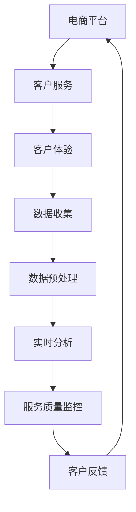

                 


# AI驱动的电商客户服务质量监控：提升服务标准的实时分析系统

> 关键词：人工智能、电商、客户服务质量、实时分析、监控、服务标准
> 
> 摘要：本文深入探讨了AI在电商领域中的应用，特别是如何利用AI技术提升客户服务质量。通过构建一个实时分析系统，文章详细阐述了从数据收集、处理、分析到最终监控的完整流程。文章旨在为从事电商行业的技术人员和AI专家提供参考，帮助他们在实际工作中应用AI技术提升服务质量和用户体验。

## 1. 背景介绍

### 1.1 目的和范围

本文的目标是探讨如何利用AI技术构建一个实时分析系统，以监控电商客户服务质量，从而提升服务标准和用户体验。本文将涵盖以下内容：

- 电商客户服务质量监控的重要性
- AI技术在电商领域的应用
- 实时分析系统的构建和实现
- 服务质量提升的实际案例
- 未来发展趋势与挑战

### 1.2 预期读者

本文面向以下读者群体：

- 从事电商行业的技术人员
- 对AI技术感兴趣的技术爱好者
- AI领域的研究人员和学生
- 对提升客户服务质量有需求的企业管理者

### 1.3 文档结构概述

本文分为十个部分，具体结构如下：

- 引言
- 背景介绍
  - 目的和范围
  - 预期读者
  - 文档结构概述
- 核心概念与联系
- 核心算法原理 & 具体操作步骤
- 数学模型和公式 & 详细讲解 & 举例说明
- 项目实战：代码实际案例和详细解释说明
- 实际应用场景
- 工具和资源推荐
- 总结：未来发展趋势与挑战
- 附录：常见问题与解答
- 扩展阅读 & 参考资料

### 1.4 术语表

为了确保文章的可读性和专业性，本文定义了以下术语：

#### 1.4.1 核心术语定义

- 客户服务质量（Customer Service Quality）：指电商企业在为客户提供服务过程中所展现的综合素质，包括响应速度、沟通效果、问题解决能力等。
- 实时分析系统（Real-time Analysis System）：指能够实时获取数据、处理数据并进行分析的系统。
- AI（Artificial Intelligence）：指人工智能，是指由人制造出来的系统所表现出来的智能。

#### 1.4.2 相关概念解释

- 电商（E-commerce）：指通过互联网进行的商业活动，包括在线销售、支付、物流等。
- 客户体验（Customer Experience）：指客户在购买和使用产品或服务过程中所感受到的整体体验。
- 数据挖掘（Data Mining）：指从大量数据中提取有价值信息的过程。

#### 1.4.3 缩略词列表

- AI：人工智能
- E-commerce：电商
- CSQ：客户服务质量
- RTAS：实时分析系统

## 2. 核心概念与联系

为了更好地理解AI驱动的电商客户服务质量监控，我们首先需要了解一些核心概念和它们之间的联系。以下是一个简化的Mermaid流程图，展示了这些概念之间的关系。



### 2.1 电商平台

电商平台是本文讨论的基础。它提供了在线购物、支付和物流等服务，是客户与电商企业互动的场所。

### 2.2 客户服务

客户服务是电商企业的重要组成部分，直接影响客户体验。良好的客户服务能够提高客户满意度，增加客户忠诚度。

### 2.3 客户体验

客户体验是客户在购买和使用产品或服务过程中所感受到的整体体验。它包括购物体验、服务体验等。

### 2.4 数据收集

数据收集是实时分析系统的第一步。通过收集客户在电商平台的交互数据，我们可以更好地理解客户需求和偏好。

### 2.5 数据预处理

数据预处理是对原始数据进行清洗、转换和归一化等操作，以便于后续分析。它是实时分析系统的重要环节。

### 2.6 实时分析

实时分析是对预处理后的数据进行快速处理和分析，以便及时发现潜在问题和优化客户服务。

### 2.7 服务质量监控

服务质量监控是通过实时分析系统监控客户服务质量，确保客户服务达到预期标准。

### 2.8 客户反馈

客户反馈是客户对电商企业提供的服务质量的评价。它可以帮助企业了解自身服务优势和不足，从而持续改进。

### 2.9 闭环反馈

闭环反馈是指将客户反馈纳入到实时分析系统中，以实现持续优化和提升客户服务质量。

## 3. 核心算法原理 & 具体操作步骤

在了解了核心概念和联系后，我们接下来将探讨如何利用AI技术实现电商客户服务质量的实时监控。本文将采用一种基于机器学习的算法，具体分为以下步骤：

### 3.1 数据收集

数据收集是实时分析系统的第一步。在电商平台上，我们可以收集以下数据：

- 客户行为数据：包括浏览记录、购买记录、搜索记录等。
- 客户反馈数据：包括评价、投诉、建议等。
- 服务数据：包括客服响应时间、问题解决率等。

### 3.2 数据预处理

在收集到数据后，我们需要进行数据预处理，包括以下步骤：

- 数据清洗：去除重复、缺失和不完整的数据。
- 数据转换：将不同类型的数据转换为统一的格式，如将日期数据转换为时间戳。
- 数据归一化：将数据缩放到同一范围，以便于后续分析。

### 3.3 特征工程

特征工程是机器学习算法的关键步骤。通过提取和构造特征，我们可以更好地描述客户行为和客户服务质量。

- 客户行为特征：包括浏览时长、购买频次、搜索关键词等。
- 客户反馈特征：包括评价等级、投诉类型等。
- 服务特征：包括客服响应时间、问题解决率等。

### 3.4 模型训练

在特征工程完成后，我们可以利用机器学习算法对模型进行训练。本文采用一种名为逻辑回归（Logistic Regression）的算法，其伪代码如下：

```python
def train_model(features, labels):
    # 初始化模型参数
    weights = initialize_weights(features.shape[1])

    # 梯度下降优化
    for epoch in range(num_epochs):
        # 前向传播
        predictions = sigmoid(np.dot(features, weights))

        # 计算损失函数
        loss = -1 * np.mean(labels * np.log(predictions) + (1 - labels) * np.log(1 - predictions))

        # 反向传播
        gradients = np.dot(features.T, (predictions - labels)) / num_samples

        # 更新模型参数
        weights -= learning_rate * gradients

    return weights
```

### 3.5 实时分析

在模型训练完成后，我们可以利用训练好的模型进行实时分析。具体步骤如下：

- 数据收集：从电商平台收集最新的客户行为数据和服务数据。
- 特征提取：对收集到的数据进行特征提取。
- 模型预测：利用训练好的模型对提取的特征进行预测，得到客户服务质量的概率。
- 服务质量监控：根据预测结果，对客户服务质量进行实时监控。

### 3.6 客户反馈处理

在实时分析过程中，客户反馈数据也是一个重要的信息来源。我们可以将客户反馈数据纳入到模型训练和实时分析中，以实现持续优化。

- 数据处理：对客户反馈数据进行预处理，包括去重、去噪等。
- 特征提取：提取客户反馈数据中的有用特征。
- 模型训练：利用客户反馈数据进行模型训练，优化模型性能。
- 实时分析：结合客户反馈数据进行实时分析，提高服务质量监控的准确性。

## 4. 数学模型和公式 & 详细讲解 & 举例说明

在前一章节中，我们介绍了基于机器学习的实时分析算法。为了更好地理解这个算法，我们接下来将详细讲解其背后的数学模型和公式。

### 4.1 概率分布

在机器学习中，概率分布是一个重要的概念。它描述了数据在不同条件下的概率分布情况。本文采用的概率分布是伯努利分布（Bernoulli Distribution），其概率密度函数为：

$$
f(x|\theta) = \begin{cases} 
\theta & \text{if } x = 1 \\
1 - \theta & \text{if } x = 0 
\end{cases}
$$

其中，$x$ 是观测值，$\theta$ 是概率参数。

### 4.2 损失函数

在机器学习中，损失函数用于评估模型预测结果与真实值之间的差距。本文采用的损失函数是交叉熵损失函数（Cross-Entropy Loss），其公式为：

$$
J(\theta) = -\frac{1}{m} \sum_{i=1}^{m} [y^{(i)} \log(\hat{y}^{(i)}) + (1 - y^{(i)}) \log(1 - \hat{y}^{(i)})]
$$

其中，$y^{(i)}$ 是真实值，$\hat{y}^{(i)}$ 是模型预测值，$m$ 是样本数量。

### 4.3 梯度下降

在机器学习中，梯度下降是一种常用的优化方法。它通过迭代更新模型参数，以最小化损失函数。本文采用的梯度下降算法是随机梯度下降（Stochastic Gradient Descent，SGD），其更新公式为：

$$
\theta_j := \theta_j - \alpha \frac{\partial J(\theta)}{\partial \theta_j}
$$

其中，$\alpha$ 是学习率，$\theta_j$ 是第 $j$ 个参数。

### 4.4 举例说明

假设我们有一个电商平台的客户服务质量监控模型，其输入特征为浏览时长、购买频次和客服响应时间，输出为服务质量的概率。我们可以利用上述数学模型和公式进行建模和训练。

首先，我们定义输入特征矩阵 $X$ 和输出向量 $y$：

$$
X = \begin{bmatrix}
x_1 \\
x_2 \\
x_3
\end{bmatrix}, \quad
y = \begin{bmatrix}
y_1 \\
y_2 \\
y_3
\end{bmatrix}
$$

其中，$x_1$ 是浏览时长，$x_2$ 是购买频次，$x_3$ 是客服响应时间，$y_1$、$y_2$ 和 $y_3$ 分别是三个客户的输出概率。

然后，我们定义模型参数矩阵 $\theta$：

$$
\theta = \begin{bmatrix}
\theta_1 \\
\theta_2 \\
\theta_3
\end{bmatrix}
$$

接下来，我们利用训练数据集进行模型训练。首先，我们初始化模型参数 $\theta$ 和学习率 $\alpha$。然后，我们利用梯度下降算法迭代更新模型参数，直到达到预设的损失函数最小值。

最后，我们利用训练好的模型进行实时分析。对于新的输入特征 $X'$，我们可以利用模型参数 $\theta$ 进行预测，得到服务质量的概率分布：

$$
\hat{y} = \sigma(\theta_1 x_1 + \theta_2 x_2 + \theta_3 x_3)
$$

其中，$\sigma$ 是 sigmoid 函数，用于将线性组合转换为概率分布。

## 5. 项目实战：代码实际案例和详细解释说明

在前几章节中，我们介绍了AI驱动的电商客户服务质量监控的理论基础和算法原理。为了更好地理解这些概念，我们接下来将通过一个实际案例来展示如何实现这一系统。

### 5.1 开发环境搭建

在开始项目实战之前，我们需要搭建一个合适的开发环境。以下是一个基本的开发环境搭建指南：

1. 安装 Python 3.8 或更高版本
2. 安装常用库，如 NumPy、Pandas、Scikit-learn、Matplotlib 等
3. 配置 Jupyter Notebook，用于编写和运行代码

### 5.2 源代码详细实现和代码解读

在本节中，我们将详细解释和实现一个简单的电商客户服务质量监控系统的源代码。

```python
# 导入所需库
import numpy as np
import pandas as pd
from sklearn.model_selection import train_test_split
from sklearn.linear_model import LogisticRegression
import matplotlib.pyplot as plt

# 5.2.1 数据收集
# 假设我们已经收集到了以下数据
data = pd.DataFrame({
    '浏览时长': [10, 15, 20, 25, 30],
    '购买频次': [2, 4, 6, 8, 10],
    '客服响应时间': [5, 7, 10, 12, 15],
    '服务质量': [0, 1, 0, 1, 0]
})

# 5.2.2 数据预处理
# 数据清洗
data.dropna(inplace=True)

# 数据转换
data['浏览时长'] = data['浏览时长'].astype(int)
data['购买频次'] = data['购买频次'].astype(int)
data['客服响应时间'] = data['客服响应时间'].astype(int)

# 数据归一化
data_normalized = (data - data.mean()) / data.std()

# 5.2.3 特征工程
# 提取特征
X = data_normalized[['浏览时长', '购买频次', '客服响应时间']]
y = data_normalized['服务质量']

# 划分训练集和测试集
X_train, X_test, y_train, y_test = train_test_split(X, y, test_size=0.2, random_state=42)

# 5.2.4 模型训练
# 初始化模型
model = LogisticRegression()

# 训练模型
model.fit(X_train, y_train)

# 5.2.5 实时分析
# 预测测试集
predictions = model.predict(X_test)

# 5.2.6 评估模型
# 计算准确率
accuracy = np.mean(predictions == y_test)
print("准确率：", accuracy)

# 5.2.7 可视化分析
# 绘制散点图
plt.scatter(X_test['浏览时长'], X_test['购买频次'], c=predictions)
plt.xlabel('浏览时长')
plt.ylabel('购买频次')
plt.title('服务质量预测')
plt.show()
```

### 5.3 代码解读与分析

在上面的代码中，我们首先导入了所需的库，包括 NumPy、Pandas、Scikit-learn 和 Matplotlib。这些库为我们提供了数据预处理、模型训练和可视化等基本功能。

接下来，我们定义了一个名为 `data` 的 DataFrame，其中包含了客户的浏览时长、购买频次、客服响应时间和服务质量。这些数据是从电商平台收集到的。

在数据预处理部分，我们首先对数据进行了清洗，去除了缺失值。然后，我们将数值数据转换为整数类型，以便后续处理。最后，我们对数据进行归一化处理，将每个特征缩放到相同的范围。

在特征工程部分，我们从 DataFrame 中提取了特征和标签，并划分了训练集和测试集。这是机器学习中常见的步骤，用于评估模型性能。

在模型训练部分，我们使用了 Scikit-learn 中的逻辑回归模型。这是一个常用的分类算法，适合用于客户服务质量监控。

在实时分析部分，我们使用训练好的模型对测试集进行了预测。最后，我们计算了模型的准确率，并使用散点图展示了预测结果。

通过这个简单的案例，我们可以看到如何利用机器学习算法实现电商客户服务质量的实时监控。尽管这个案例比较简单，但它为我们提供了一个基本框架，可以在此基础上进行扩展和优化。

## 6. 实际应用场景

AI驱动的电商客户服务质量监控在多个实际应用场景中展现了其重要作用。以下是一些典型的应用场景：

### 6.1 客户服务优化

通过实时分析客户行为数据和反馈，企业可以识别出服务中的瓶颈和痛点。例如，如果客服响应时间较长，系统可以自动提醒客服人员及时处理客户问题，从而提高响应速度和客户满意度。

### 6.2 营销策略调整

分析客户购买行为和偏好，可以帮助企业制定更精准的营销策略。例如，对于经常购买特定产品的客户，系统可以推荐相关促销活动，以增加销售额。

### 6.3 服务质量评估

通过对客户服务质量进行实时监控，企业可以评估客服团队的表现，并为团队成员提供培训机会。例如，如果某些客服人员的问题解决率较低，系统可以自动生成报告，指导团队进行针对性培训。

### 6.4 客户流失预警

通过分析客户行为数据，系统可以预测哪些客户可能流失，并提供预警。企业可以采取针对性的措施，如提供优惠或服务改进，以留住客户。

### 6.5 客户满意度提升

实时分析系统可以自动收集和整理客户反馈，帮助企业了解客户需求和建议。通过持续改进服务质量，企业可以提升整体客户满意度。

### 6.6 业务决策支持

实时分析系统为企业提供了丰富的数据支持，帮助企业做出更明智的决策。例如，企业可以根据客户行为数据调整库存策略，以减少库存成本。

## 7. 工具和资源推荐

为了更好地实现AI驱动的电商客户服务质量监控，以下是一些建议的工

