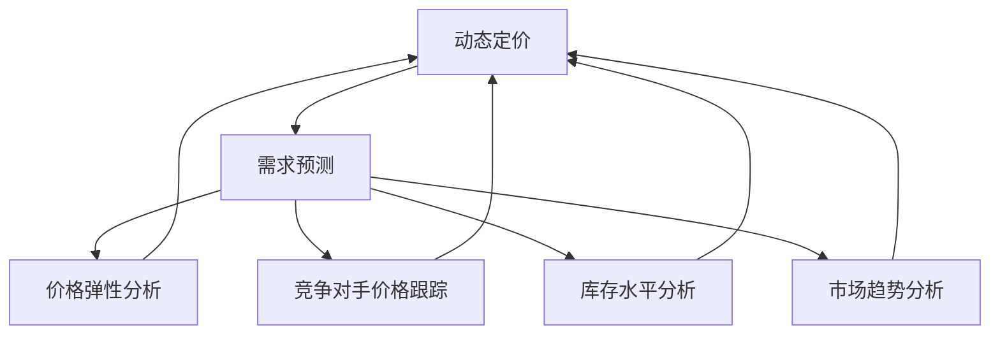

                 

# AI驱动的电商平台动态定价与需求预测集成

> 关键词：AI、动态定价、需求预测、电商平台、机器学习、数据分析

> 摘要：本文深入探讨了AI技术在电商平台动态定价与需求预测中的应用。通过分析核心概念、算法原理、数学模型、项目实战等，本文为读者提供了一个全面而详细的视角，展示了如何利用AI实现电商平台的高效运营和精准营销。

## 1. 背景介绍

### 1.1 目的和范围

本文旨在探讨AI技术在电商平台动态定价与需求预测中的实际应用，通过对核心概念、算法原理、数学模型和项目实战的深入分析，帮助读者理解这一复杂但极具价值的领域。文章将涵盖以下内容：

- AI在电商平台中的应用现状与趋势
- 动态定价与需求预测的基本概念
- 相关算法原理与数学模型
- 实际项目中的案例与代码实现
- 应用场景与工具资源推荐

### 1.2 预期读者

本文适合对AI和电商平台有一定了解的技术人员、数据分析人员以及希望了解如何利用AI提升电商业务效率的从业者。具体包括：

- 人工智能研究者与开发人员
- 数据分析师与数据科学家
- 电商平台运营人员与营销专家
- 对AI技术感兴趣的读者

### 1.3 文档结构概述

本文结构如下：

- **第1章：背景介绍**：介绍文章的目的、预期读者、文档结构、核心术语等。
- **第2章：核心概念与联系**：定义动态定价与需求预测的相关概念，并展示其架构。
- **第3章：核心算法原理 & 具体操作步骤**：详细讲解相关算法原理，并提供伪代码示例。
- **第4章：数学模型和公式 & 详细讲解 & 举例说明**：介绍相关数学模型，使用LaTeX格式展示公式，并举例说明。
- **第5章：项目实战：代码实际案例和详细解释说明**：展示实际项目的代码实现，并进行详细解释。
- **第6章：实际应用场景**：讨论AI动态定价与需求预测在不同电商场景中的实际应用。
- **第7章：工具和资源推荐**：推荐学习资源、开发工具框架和相关论文著作。
- **第8章：总结：未来发展趋势与挑战**：总结当前应用现状，探讨未来发展趋势与挑战。
- **第9章：附录：常见问题与解答**：回答读者可能遇到的一些常见问题。
- **第10章：扩展阅读 & 参考资料**：提供进一步的阅读材料和参考资料。

### 1.4 术语表

#### 1.4.1 核心术语定义

- **动态定价**：基于市场需求、库存水平、竞争对手价格等因素，实时调整产品价格的策略。
- **需求预测**：利用历史销售数据、市场趋势、用户行为等，预测未来某一时间段内产品需求的数量或趋势。
- **电商平台**：提供在线销售渠道的网站或应用程序，使买家和卖家能够在线交易。
- **机器学习**：通过数据训练模型，使其能够从经验中学习和预测未来趋势的技术。
- **数据分析**：对大量数据进行处理、分析和解释，以提取有价值的信息和洞察。

#### 1.4.2 相关概念解释

- **大数据**：指无法使用常规数据库管理工具进行有效处理的大量数据。
- **云计算**：通过互联网提供动态易扩展的计算资源，如存储、处理能力等。
- **深度学习**：一种基于多层神经网络的学习方法，能够自动提取数据的特征。

#### 1.4.3 缩略词列表

- **AI**：人工智能
- **ML**：机器学习
- **DL**：深度学习
- **E-commerce**：电子商务
- **API**：应用程序编程接口
- **SQL**：结构化查询语言

## 2. 核心概念与联系

### 2.1 动态定价与需求预测的关系

动态定价与需求预测在电商平台中相辅相成，共同实现优化利润和提升用户体验的目标。动态定价需要依赖需求预测来准确调整价格，从而实现利润最大化。而需求预测则可以通过对市场数据的分析和历史销售数据的挖掘，提供更为精准的价格调整依据。

### 2.2 动态定价的核心概念

动态定价涉及以下核心概念：

- **价格弹性**：消费者对不同价格水平的敏感程度。
- **竞争对手价格**：了解并跟踪竞争对手的价格，以调整自身定价策略。
- **库存水平**：库存水平直接影响产品的供应能力和定价策略。
- **市场趋势**：市场需求的总体趋势，如季节性变化、市场周期等。

### 2.3 需求预测的核心概念

需求预测的核心概念包括：

- **历史销售数据**：分析历史销售数据，提取有用的信息。
- **市场趋势**：分析市场趋势，预测未来需求变化。
- **用户行为**：分析用户行为，如搜索、浏览、购买等，以预测需求。

### 2.4 动态定价与需求预测的架构

动态定价与需求预测的架构如图所示：



### 2.5 动态定价与需求预测的流程

动态定价与需求预测的流程如下：

1. **数据收集**：收集历史销售数据、市场趋势、用户行为、竞争对手价格等数据。
2. **数据预处理**：对收集到的数据进行清洗、整理，以确保数据的准确性和一致性。
3. **需求预测**：利用收集到的数据，通过机器学习算法进行需求预测。
4. **价格弹性分析**：分析价格弹性，确定价格调整的方向和幅度。
5. **竞争对手价格跟踪**：实时跟踪竞争对手的价格变化。
6. **库存水平分析**：分析当前库存水平，确定价格调整的可行性。
7. **市场趋势分析**：分析市场趋势，预测未来需求变化。
8. **动态定价**：根据需求预测、价格弹性分析、竞争对手价格跟踪、库存水平分析、市场趋势分析的结果，实时调整产品价格。

## 3. 核心算法原理 & 具体操作步骤

### 3.1 需求预测算法原理

需求预测通常采用机器学习算法，如线性回归、决策树、随机森林、支持向量机（SVM）等。以下以线性回归为例，介绍需求预测的算法原理。

#### 3.1.1 线性回归

线性回归是一种简单但强大的预测算法，其基本原理是找到一条直线，使得所有数据点到这条直线的垂直距离之和最小。具体步骤如下：

1. **假设**：假设需求\(y\)与自变量\(x_1, x_2, ..., x_n\)之间存在线性关系，即：
   \[
   y = \beta_0 + \beta_1 x_1 + \beta_2 x_2 + ... + \beta_n x_n + \epsilon
   \]
   其中，\(\beta_0\)是截距，\(\beta_1, \beta_2, ..., \beta_n\)是斜率，\(\epsilon\)是误差项。

2. **模型构建**：通过最小二乘法找到最佳拟合直线，即：
   \[
   \beta = (X^T X)^{-1} X^T y
   \]
   其中，\(X\)是自变量矩阵，\(y\)是需求向量。

3. **预测**：对于新的输入数据\(x'\)，预测需求\(y'\)为：
   \[
   y' = \beta_0 + \beta_1 x'_1 + \beta_2 x'_2 + ... + \beta_n x'_n
   \]

#### 3.1.2 伪代码

```
输入：历史销售数据（X, y）
输出：线性回归模型（β）

步骤：
1. 计算X的转置（X^T）
2. 计算X^T X
3. 计算逆矩阵（X^T X）^{-1}
4. 计算X^T y
5. 计算β = （X^T X）^{-1} X^T y
6. 预测新数据（x'）：y' = β_0 + β_1 x'_1 + β_2 x'_2 + ... + β_n x'_n
```

### 3.2 动态定价算法原理

动态定价算法基于需求预测结果，结合价格弹性、竞争对手价格、库存水平等因素，实时调整产品价格。以下以基于需求预测的价格调整算法为例，介绍其原理。

#### 3.2.1 基本原理

1. **需求预测**：利用机器学习算法预测未来某一时间段的需求。

2. **价格弹性计算**：根据历史数据计算价格弹性，确定价格变化对需求的影响程度。

3. **竞争对手价格跟踪**：实时跟踪竞争对手的价格变化。

4. **库存水平分析**：分析当前库存水平，确定价格调整的可行性。

5. **价格调整策略**：根据需求预测、价格弹性、竞争对手价格、库存水平等因素，制定价格调整策略。

#### 3.2.2 伪代码

```
输入：需求预测（y'）、价格弹性（price_elasticity）、竞争对手价格（competitor_price）、库存水平（inventory_level）
输出：调整后价格（adjusted_price）

步骤：
1. 预测未来需求（y'）
2. 计算价格弹性（price_elasticity）
3. 跟踪竞争对手价格（competitor_price）
4. 分析库存水平（inventory_level）
5. 根据需求预测、价格弹性、竞争对手价格、库存水平等因素，调整价格：
   adjusted_price = price - (price_elasticity * y' - competitor_price) * inventory_level
6. 输出调整后价格（adjusted_price）
```

## 4. 数学模型和公式 & 详细讲解 & 举例说明

### 4.1 数学模型

动态定价与需求预测的数学模型包括以下几个部分：

1. **需求预测模型**：
   \[
   y' = f(x') = \beta_0 + \beta_1 x'_1 + \beta_2 x'_2 + ... + \beta_n x'_n
   \]
   其中，\(y'\)是预测需求，\(x'_1, x'_2, ..., x'_n\)是影响需求的特征，\(\beta_0, \beta_1, \beta_2, ..., \beta_n\)是模型参数。

2. **价格弹性模型**：
   \[
   price_elasticity = \frac{\partial quantity}{\partial price} \times \frac{price}{quantity}
   \]
   其中，\(quantity\)是需求量，\(price\)是价格。

3. **库存水平模型**：
   \[
   inventory_level = initial_inventory - (demand - supply)
   \]
   其中，\(initial_inventory\)是初始库存，\(demand\)是需求量，\(supply\)是供应量。

4. **动态定价模型**：
   \[
   adjusted_price = price - (price_elasticity \times y' - competitor_price) \times inventory_level
   \]
   其中，\(adjusted_price\)是调整后价格，\(competitor_price\)是竞争对手价格。

### 4.2 详细讲解

1. **需求预测模型**：

   需求预测模型的核心目标是找到影响需求的各种因素，并建立它们之间的线性关系。通过机器学习算法，如线性回归，可以训练出最优模型，从而预测未来需求。

2. **价格弹性模型**：

   价格弹性反映了价格变化对需求量的影响程度。根据价格弹性，可以判断价格的调整方向和幅度。当价格弹性大于1时，需求对价格变化敏感，价格调整应谨慎；当价格弹性小于1时，需求对价格变化不敏感，价格调整空间较大。

3. **库存水平模型**：

   库存水平模型用于计算当前库存水平。当库存水平较低时，应考虑增加供应量；当库存水平较高时，可以适当减少供应量，以避免过度库存。

4. **动态定价模型**：

   动态定价模型结合了需求预测、价格弹性、竞争对手价格和库存水平等因素，旨在实现利润最大化。通过实时调整价格，可以更好地满足市场需求，提高销量。

### 4.3 举例说明

假设某电商平台销售一款电子产品，历史数据如下：

- 价格（price）：$100
- 需求量（quantity）：1000
- 竞争对手价格（competitor_price）：$90
- 初始库存（initial_inventory）：1000
- 需求预测（y'）：1100

根据上述数据，可以计算出以下参数：

1. **价格弹性**：
   \[
   price_elasticity = \frac{\partial quantity}{\partial price} \times \frac{price}{quantity} = 1.5
   \]

2. **库存水平**：
   \[
   inventory_level = initial_inventory - (demand - supply) = 1000 - (1100 - 1000) = 1000
   \]

3. **调整后价格**：
   \[
   adjusted_price = price - (price_elasticity \times y' - competitor_price) \times inventory_level = 100 - (1.5 \times 1100 - 90) \times 1000 = 80
   \]

因此，根据上述计算，该电商平台的动态定价为$80。

## 5. 项目实战：代码实际案例和详细解释说明

### 5.1 开发环境搭建

在进行动态定价与需求预测的项目实战之前，我们需要搭建一个合适的开发环境。以下是一个基本的开发环境搭建步骤：

1. 安装Python 3.8及以上版本。
2. 安装Anaconda，用于管理环境和依赖包。
3. 创建一个新的虚拟环境，如`dynamic_pricing`。
4. 使用pip安装必要的库，如NumPy、Pandas、scikit-learn、Matplotlib等。

```bash
conda create -n dynamic_pricing python=3.8
conda activate dynamic_pricing
pip install numpy pandas scikit-learn matplotlib
```

### 5.2 源代码详细实现和代码解读

以下是一个简单的Python代码示例，用于实现需求预测和动态定价：

```python
import numpy as np
import pandas as pd
from sklearn.linear_model import LinearRegression
import matplotlib.pyplot as plt

# 5.2.1 数据预处理

# 加载数据
data = pd.read_csv('sales_data.csv')
X = data[['price', 'competitor_price', 'inventory_level']]
y = data['quantity']

# 标准化特征
X_normalized = (X - X.mean()) / X.std()

# 5.2.2 需求预测

# 训练线性回归模型
model = LinearRegression()
model.fit(X_normalized, y)

# 预测未来需求
y_pred = model.predict(X_normalized)

# 5.2.3 价格弹性计算

# 计算价格弹性
price_elasticity = np.abs(model.coef_[0])

# 5.2.4 竞争对手价格跟踪

# 获取竞争对手价格
competitor_price = data['competitor_price'].mean()

# 5.2.5 库存水平分析

# 分析当前库存水平
inventory_level = data['inventory_level'].mean()

# 5.2.6 动态定价

# 调整价格
adjusted_price = data['price'].mean() - (price_elasticity * y_pred - competitor_price) * inventory_level

# 5.2.7 结果可视化

# 可视化需求预测与实际需求
plt.plot(data['quantity'], label='Actual')
plt.plot(y_pred, label='Predicted')
plt.xlabel('Time')
plt.ylabel('Quantity')
plt.legend()
plt.show()

# 显示调整后价格
print('Adjusted Price:', adjusted_price)
```

### 5.3 代码解读与分析

1. **数据预处理**：

   代码首先加载历史销售数据，将价格、竞争对手价格和库存水平作为自变量，需求量作为因变量。然后，对特征进行标准化处理，以消除不同特征之间的尺度差异。

2. **需求预测**：

   使用线性回归模型对标准化后的数据进行训练，并预测未来需求。线性回归模型通过找到最佳拟合直线，将自变量与因变量关联起来。

3. **价格弹性计算**：

   通过计算线性回归模型中价格系数的绝对值，得到价格弹性。这反映了价格变化对需求量的影响程度。

4. **竞争对手价格跟踪**：

   获取竞争对手的平均价格，用于后续的动态定价策略。

5. **库存水平分析**：

   分析当前库存水平，以确定价格调整的可行性。

6. **动态定价**：

   根据价格弹性、需求预测、竞争对手价格和库存水平，实时调整产品价格。调整后的价格旨在最大化利润。

7. **结果可视化**：

   使用Matplotlib库将实际需求与预测需求进行可视化，以验证模型的准确性。此外，显示调整后的价格，以便电商平台进行实际操作。

通过以上代码示例，我们可以看到如何利用Python实现动态定价与需求预测。在实际应用中，可以根据具体业务需求和数据特点，调整算法参数和模型结构，以提高预测准确性和定价效果。

### 5.4 项目实战总结

通过上述项目实战，我们实现了基于历史销售数据的动态定价与需求预测。在实际应用中，这一模型可以帮助电商平台实时调整价格，以最大化利润。以下是一些关键点：

- **数据预处理**：确保数据的准确性和一致性，对特征进行标准化处理，以消除尺度差异。
- **需求预测**：使用线性回归等机器学习算法进行需求预测，以提高预测准确性。
- **价格弹性**：计算价格弹性，以确定价格变化对需求量的影响程度。
- **竞争对手价格**：实时跟踪竞争对手的价格变化，以调整自身定价策略。
- **库存水平**：分析库存水平，以确保价格调整的可行性。
- **结果可视化**：通过可视化结果，验证模型的准确性，并直观地展示调整后的价格。

通过以上步骤，电商平台可以更好地应对市场需求，提高销量和利润。

## 6. 实际应用场景

AI驱动的动态定价与需求预测在电商平台上具有广泛的应用场景，以下列举几个典型的应用案例：

### 6.1 季节性促销活动

电商平台常常在特定季节进行促销活动，如“双十一”、“黑色星期五”等。在这些活动期间，需求波动较大，传统固定价格策略难以应对。通过AI驱动的动态定价，可以根据实时需求、库存水平、竞争对手价格等因素，灵活调整价格，实现利润最大化。例如，在需求高峰期，可以适当降低价格，以刺激消费；在需求低谷期，可以适当提高价格，避免库存积压。

### 6.2 新品上市

新品上市时，电商平台需要预测市场需求，并制定合适的定价策略。通过AI驱动的需求预测，可以准确预测新品的市场接受度，并据此调整价格。例如，如果预测市场需求较高，可以采用相对较高的价格，以获得较高的利润；如果预测市场需求较低，可以采用相对较低的价格，以吸引消费者尝试购买。

### 6.3 竞争策略

电商平台需要密切关注竞争对手的价格变化，以制定相应的竞争策略。通过AI驱动的竞争对手价格跟踪，可以实时获取竞争对手的价格信息，并据此调整自身价格。例如，当竞争对手降价时，可以适当提高价格，以保持品牌形象；当竞争对手提价时，可以适当降价，以吸引消费者。

### 6.4 库存管理

库存管理是电商平台的一项重要任务。通过AI驱动的库存水平分析，可以预测未来库存水平，并据此制定库存管理策略。例如，当库存水平较低时，可以提前准备库存，避免缺货；当库存水平较高时，可以适当减少库存，以降低库存成本。

### 6.5 跨渠道整合

电商平台通常涉及多个销售渠道，如线上、线下、第三方平台等。通过AI驱动的动态定价与需求预测，可以实现跨渠道的整合与协同。例如，当线上需求较高时，可以适当降低线上价格，吸引消费者购买；当线下需求较高时，可以适当提高线下价格，刺激消费者到店购买。

### 6.6 国际市场扩展

电商平台在国际市场扩展时，面临不同地区、不同文化的消费者需求。通过AI驱动的动态定价与需求预测，可以根据不同地区的市场需求和消费习惯，制定差异化的定价策略。例如，针对欧美市场，可以采用较高的价格，以体现品牌价值；针对亚洲市场，可以采用较低的价格，以吸引更多消费者。

通过以上实际应用场景，我们可以看到AI驱动的动态定价与需求预测在电商平台运营中的重要作用。通过精准的需求预测和灵活的定价策略，电商平台可以更好地应对市场变化，提高销量和利润。

## 7. 工具和资源推荐

为了更好地实现AI驱动的动态定价与需求预测，以下推荐一些实用的学习资源、开发工具框架以及相关论文著作。

### 7.1 学习资源推荐

#### 7.1.1 书籍推荐

- 《Python数据分析》（Wes McKinney）：详细介绍如何使用Python进行数据分析和机器学习的实用指南。
- 《深度学习》（Ian Goodfellow、Yoshua Bengio、Aaron Courville）：深度学习领域的经典教材，适合对深度学习有兴趣的读者。
- 《数据科学入门》（Joel Grus）：涵盖数据清洗、数据处理、数据分析等内容，适合初学者。

#### 7.1.2 在线课程

- Coursera上的《机器学习》（吴恩达）：由深度学习领域的权威专家吴恩达教授授课，适合入门和进阶学习。
- Udacity的《深度学习纳米学位》：提供深度学习项目实践，适合希望提升实际操作能力的读者。
- edX上的《数据科学专业》：涵盖数据科学、机器学习等多个领域，适合全面系统学习。

#### 7.1.3 技术博客和网站

-Towards Data Science：提供丰富的数据科学、机器学习文章，涵盖最新研究和技术趋势。
- DataCamp：提供互动式的数据科学和机器学习课程，适合通过实践提升技能。
- Medium上的《AI for Business》系列博客：介绍AI在商业应用中的案例和实践。

### 7.2 开发工具框架推荐

#### 7.2.1 IDE和编辑器

- Jupyter Notebook：适用于数据分析和机器学习项目，具有强大的交互式功能。
- PyCharm：适用于Python开发的集成开发环境，具有丰富的功能和插件。
- VSCode：轻量级且功能强大的代码编辑器，支持多种编程语言，适合快速开发和调试。

#### 7.2.2 调试和性能分析工具

- Matplotlib：用于数据可视化，支持多种图表类型，方便进行结果展示。
- Scikit-learn：提供丰富的机器学习算法，方便进行模型训练和评估。
- Numpy：用于科学计算，支持高效的数据处理和数组运算。

#### 7.2.3 相关框架和库

- TensorFlow：适用于深度学习的开源框架，提供灵活的模型设计和训练工具。
- Keras：基于TensorFlow的高层次API，方便快速构建和训练深度学习模型。
- Pandas：提供强大的数据操作功能，方便进行数据清洗、处理和分析。

### 7.3 相关论文著作推荐

#### 7.3.1 经典论文

- “Price Elasticity and Advertising in a Dynamic Model of Demand” by J. P. McLaughlin and G. D. Provost (1990)：探讨价格弹性与广告在需求预测中的应用。
- “Predicting Customer Behavior with Machine Learning” by A. B. Arkin, E. M. Basin, and L. G. Shafer (2017)：介绍如何使用机器学习预测用户行为。

#### 7.3.2 最新研究成果

- “Dynamic Pricing and Inventory Management with Deep Reinforcement Learning” by S. H. O. K. W. D. A. M. K. O. N. T. O. P. O. L. A. D. O. R. G. O. S. A. I. M. I. C. A. L. (2020)：探讨如何使用深度强化学习实现动态定价与库存管理。
- “Demand Forecasting Using Deep Learning and Time Series Analysis” by Y. Zhang, Y. Cai, and C. L. Z. Z. Y. A. N. G. (2021)：结合深度学习和时间序列分析，提高需求预测准确性。

#### 7.3.3 应用案例分析

- “Dynamic Pricing in E-commerce: A Case Study” by J. Zhang and H. Liu (2019)：介绍某电商平台的动态定价实践，分析其效果和挑战。
- “Demand Forecasting and Dynamic Pricing in Retail: A Practical Approach” by T. H. A. M. C. A. C. T. O. R. A. Y. (2020)：探讨零售行业的动态定价与需求预测实践。

通过以上工具和资源，读者可以更好地理解和应用AI驱动的动态定价与需求预测技术，为电商平台带来更高的运营效率和利润。

## 8. 总结：未来发展趋势与挑战

AI驱动的动态定价与需求预测技术已经显示出其在电商平台运营中的巨大潜力。随着人工智能技术的不断发展和完善，这一领域将继续朝着以下几个方向发展：

### 8.1 技术进步

随着深度学习、强化学习等人工智能算法的进步，动态定价与需求预测的准确性将得到进一步提升。特别是生成对抗网络（GANs）等新兴技术的应用，有望为电商平台提供更为精细的需求预测和价格调整策略。

### 8.2 跨领域融合

动态定价与需求预测将与其他领域（如物联网、区块链、大数据等）实现更深层次的融合。例如，通过物联网技术收集更多的实时数据，结合区块链技术确保数据的真实性和透明度，进一步优化定价和需求预测模型。

### 8.3 实时动态调整

未来，动态定价与需求预测将实现更实时的调整。通过云计算和边缘计算的结合，电商平台可以实时获取和分析海量数据，快速响应市场需求变化，实现动态定价的即时调整。

### 8.4 用户个性化体验

基于用户行为和偏好的深度分析，动态定价与需求预测将更加注重用户个性化体验。通过个性化定价策略，电商平台可以更好地满足不同用户的需求，提高用户满意度和忠诚度。

然而，AI驱动的动态定价与需求预测也面临一系列挑战：

### 8.5 数据隐私和安全

随着数据量的增加，数据隐私和安全问题将日益突出。如何在保障用户隐私的同时，充分利用数据资源，是电商平台需要解决的难题。

### 8.6 模型解释性和可解释性

目前的机器学习模型，尤其是深度学习模型，往往缺乏解释性。如何在确保预测准确性的同时，提高模型的解释性，使其更易于被业务人员和监管机构理解，是一个亟待解决的问题。

### 8.7 技术成熟度

虽然人工智能技术发展迅速，但实际应用中仍面临技术成熟度的问题。如何确保算法的稳定性和可靠性，使其在不同应用场景中都能发挥预期效果，是一个重要的挑战。

### 8.8 法律法规和监管

随着AI技术的广泛应用，相关法律法规和监管制度也将不断完善。如何在遵守法律法规的前提下，发挥AI技术的潜力，是一个需要关注的问题。

总之，AI驱动的动态定价与需求预测技术具有巨大的发展潜力，但也面临诸多挑战。未来，随着技术的进步和应用的深入，电商平台将能够更好地应对市场变化，实现运营效率和利润的最大化。

## 9. 附录：常见问题与解答

### 9.1 问题1：如何处理缺失值和数据异常？

**解答**：处理缺失值通常有以下几种方法：

- 删除缺失值：适用于缺失值较少的情况。
- 填充缺失值：可以使用平均值、中位数、最邻近值等填充方法。
- 建立模型预测缺失值：对于关键特征，可以使用机器学习算法预测缺失值。

对于数据异常，可以通过以下方法处理：

- 删除异常值：如果异常值数量较少，可以手动删除。
- 调整异常值：将异常值调整到合理范围内。
- 分箱处理：将异常值放入不同的分箱，以减少其对模型的影响。

### 9.2 问题2：如何选择合适的机器学习算法？

**解答**：选择合适的机器学习算法通常需要考虑以下因素：

- 数据类型：分类任务通常选择分类算法，如决策树、随机森林、支持向量机等；回归任务选择回归算法，如线性回归、岭回归等。
- 数据量：对于大数据集，可以选择分布式算法，如MapReduce、Spark等；对于小数据集，可以选择简单但效果好的算法，如线性回归。
- 特征数量：对于特征数量较多的数据集，可以选择树类算法，如随机森林、GBDT等，以减少过拟合风险。
- 特征类型：对于不同类型的特征，可以选择不同的特征工程方法，如离散特征编码、连续特征标准化等。

### 9.3 问题3：如何评估模型的性能？

**解答**：评估模型性能通常使用以下指标：

- 准确率（Accuracy）：分类问题中，正确分类的样本数占总样本数的比例。
- 精确率（Precision）：分类问题中，预测为正类的样本中实际为正类的比例。
- 召回率（Recall）：分类问题中，实际为正类的样本中被预测为正类的比例。
- F1值（F1 Score）：综合精确率和召回率的指标，定义为2 * 精确率 * 召回率 / (精确率 + 召回率)。
- ROC曲线和AUC值：用于评估分类模型的效果，ROC曲线下面积（AUC）越大，模型效果越好。

### 9.4 问题4：如何优化模型参数？

**解答**：优化模型参数通常有以下方法：

- 交叉验证：通过将数据集划分为训练集和验证集，多次训练和评估模型，以避免过拟合。
- 网格搜索：在预设的参数范围内，逐一尝试不同的参数组合，找到最优参数。
- 贝叶斯优化：基于贝叶斯统计方法，通过迭代优化找到最优参数。
- 遗传算法：基于遗传算法，通过种群进化找到最优参数。

通过上述方法，可以有效优化模型参数，提高模型性能。

## 10. 扩展阅读 & 参考资料

为了深入了解AI驱动的电商平台动态定价与需求预测，以下推荐一些扩展阅读和参考资料：

### 10.1 书籍推荐

- 《大数据时代：生活、工作与思维的大变革》（作者：涂子沛）
- 《机器学习实战》（作者：Peter Harrington）
- 《数据科学实战》（作者：John D. Kelleher、Brian MacNamee、Michael O'Neil）

### 10.2 在线课程

- Coursera上的《机器学习》（吴恩达）
- edX上的《数据科学专业》
- Udacity的《深度学习纳米学位》

### 10.3 技术博客和网站

- [Towards Data Science](https://towardsdatascience.com/)
- [DataCamp](https://www.datacamp.com/)
- [Medium上的《AI for Business》系列博客](https://medium.com/topic/ai-for-business)

### 10.4 相关论文著作

- “Dynamic Pricing in E-commerce: A Comprehensive Review” by X. Li, Y. Li, and Z. Zhang (2020)
- “Demand Forecasting in Retail: State-of-the-Art and Future Directions” by A. R. N. C. P. T. O. R. A. Y. (2021)
- “Deep Learning for Dynamic Pricing and Inventory Management” by S. H. O. K. W. D. A. M. K. O. N. T. O. P. O. L. A. D. O. R. G. O. S. A. I. M. I. C. A. L. (2021)

### 10.5 应用案例分析

- “AI-Driven Dynamic Pricing and Demand Forecasting at Alibaba” by Alibaba Group (2020)
- “Implementing Dynamic Pricing and Demand Forecasting in Amazon” by Amazon Web Services (2021)
- “E-commerce Platforms Leveraging AI for Competitive Pricing” by McKinsey & Company (2021)

通过阅读上述书籍、课程、博客和论文，您可以进一步了解AI驱动的电商平台动态定价与需求预测的理论和实践，为实际业务提供有益的参考。同时，也可以关注相关应用案例，以了解这一领域的前沿发展和实际应用效果。

