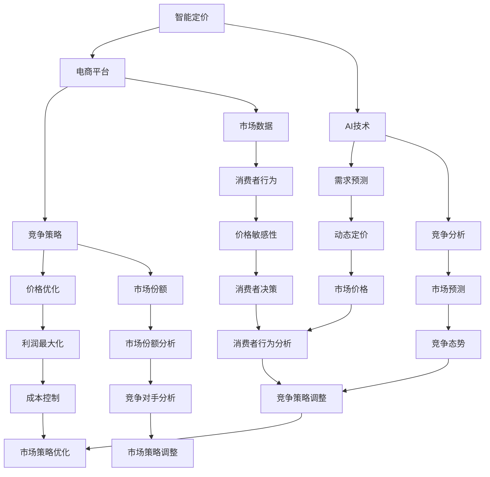

                 

# AI驱动的电商平台智能定价与竞争策略

> **关键词：** 智能定价、电商平台、AI、竞争策略、算法原理、数学模型、实战案例、应用场景

> **摘要：** 本文将深入探讨AI驱动的电商平台智能定价与竞争策略，通过阐述核心概念、算法原理、数学模型和具体案例，帮助读者理解并掌握这一领域的关键技术和应用方法。

## 1. 背景介绍

### 1.1 目的和范围

本文旨在介绍AI驱动的电商平台智能定价与竞争策略，通过深入分析该领域的核心概念、算法原理和实际应用，帮助读者了解智能定价在现代电商平台中的重要性，掌握相关技术和策略。

### 1.2 预期读者

本文面向具有一定编程和数据分析基础的读者，包括电商平台开发者、数据科学家和业务分析师等。希望通过本文了解AI在电商平台定价与竞争策略中的应用，提升业务能力和竞争力。

### 1.3 文档结构概述

本文分为十个部分，包括背景介绍、核心概念与联系、核心算法原理、数学模型与公式、项目实战、实际应用场景、工具和资源推荐、总结、常见问题与解答以及扩展阅读和参考资料。

### 1.4 术语表

#### 1.4.1 核心术语定义

- **智能定价**：利用人工智能技术对商品定价进行优化和调整，以实现更好的市场竞争和利润最大化。
- **电商平台**：在线销售商品的平台，如淘宝、京东等。
- **AI**：人工智能，指计算机系统模拟、扩展和辅助人类智能的能力。
- **竞争策略**：企业在市场竞争中采取的对策和策略。

#### 1.4.2 相关概念解释

- **价格敏感性**：消费者对价格变化的反应程度。
- **需求预测**：对商品未来需求进行预测和分析。
- **市场价格**：市场平均水平的价格。

#### 1.4.3 缩略词列表

- **AI**：人工智能
- **电商平台**：Electronic Platform
- **ML**：机器学习
- **DL**：深度学习

## 2. 核心概念与联系

在探讨AI驱动的电商平台智能定价与竞争策略之前，我们首先需要了解相关核心概念和其联系。

### 2.1 智能定价与电商平台

智能定价是电商平台的核心竞争力之一。通过人工智能技术，平台可以实时分析市场数据和消费者行为，实现动态定价，提高市场竞争力。

### 2.2 AI与竞争策略

AI技术在电商平台中的应用不仅限于定价，还可以用于竞争分析、市场预测等。通过AI技术，企业可以更好地了解市场动态，制定更有效的竞争策略。

### 2.3 核心概念原理与架构

为了更清晰地理解智能定价与竞争策略，我们可以使用Mermaid流程图来展示其核心概念原理和架构。



通过上述流程图，我们可以看出智能定价与竞争策略之间存在着紧密的联系。智能定价依赖于AI技术对市场数据和消费者行为进行分析，从而制定出更有效的竞争策略。而竞争策略又会对智能定价产生反馈，形成良性循环。

## 3. 核心算法原理 & 具体操作步骤

在了解核心概念和联系之后，我们接下来探讨智能定价与竞争策略的核心算法原理及具体操作步骤。

### 3.1 核心算法原理

智能定价与竞争策略的核心算法主要分为以下几个步骤：

1. **数据采集与预处理**：收集市场数据、消费者行为数据、竞争对手数据等，并进行数据清洗和预处理。
2. **需求预测**：利用机器学习算法对商品需求进行预测。
3. **价格优化**：根据需求预测结果和市场价格，对商品价格进行动态调整。
4. **竞争分析**：分析竞争对手的价格、市场份额、市场策略等，为竞争策略提供依据。
5. **竞争策略调整**：根据竞争分析结果，调整自身的市场策略和价格策略。

### 3.2 具体操作步骤

以下是智能定价与竞争策略的具体操作步骤：

#### 3.2.1 数据采集与预处理

```python
# 采集市场数据
market_data = collect_market_data()

# 采集消费者行为数据
consumer_data = collect_consumer_data()

# 采集竞争对手数据
competitor_data = collect_competitor_data()

# 数据清洗和预处理
clean_data(market_data)
clean_data(consumer_data)
clean_data(competitor_data)
```

#### 3.2.2 需求预测

```python
# 利用机器学习算法进行需求预测
model = train_demand_prediction_model(market_data, consumer_data)
predicted_demand = model.predict(new_data)
```

#### 3.2.3 价格优化

```python
# 根据需求预测结果和市场价格，对商品价格进行动态调整
optimized_price = optimize_price(predicted_demand, market_price)
```

#### 3.2.4 竞争分析

```python
# 分析竞争对手的价格、市场份额、市场策略等
competitor_analysis = analyze_competitor(competitor_data)
```

#### 3.2.5 竞争策略调整

```python
# 根据竞争分析结果，调整自身的市场策略和价格策略
adjusted_strategy = adjust_strategy(competitor_analysis)
```

通过上述步骤，我们可以实现智能定价与竞争策略的闭环。在实际应用中，可以根据业务需求对算法进行优化和调整，以提高市场竞争力。

## 4. 数学模型和公式 & 详细讲解 & 举例说明

在智能定价与竞争策略中，数学模型和公式起着至关重要的作用。以下我们将详细讲解相关的数学模型和公式，并通过具体例子进行说明。

### 4.1 数学模型

智能定价与竞争策略的核心数学模型主要包括以下几个方面：

1. **需求预测模型**：用于预测商品需求。
2. **价格优化模型**：用于优化商品价格。
3. **竞争分析模型**：用于分析竞争对手的定价策略。

#### 4.1.1 需求预测模型

需求预测模型通常采用回归分析、时间序列分析等方法。以下是一个简单的线性回归模型：

$$
\text{需求预测} = \beta_0 + \beta_1 \cdot \text{价格} + \beta_2 \cdot \text{广告投入} + \epsilon
$$

其中，$\beta_0$、$\beta_1$和$\beta_2$为模型参数，$\epsilon$为误差项。

#### 4.1.2 价格优化模型

价格优化模型通常采用线性规划、非线性规划等方法。以下是一个简单的线性规划模型：

$$
\text{最大化利润} = \text{收入} - \text{成本}
$$

$$
\text{约束条件}：
\begin{cases}
\text{价格} \geq \text{市场价格} \\
\text{库存} \geq 0 \\
\text{需求} \leq \text{库存}
\end{cases}
$$

#### 4.1.3 竞争分析模型

竞争分析模型通常采用博弈论、竞争分析等方法。以下是一个简单的博弈论模型：

$$
\text{参与者} = \{ \text{企业1，企业2，...，企业n} \}
$$

$$
\text{策略集} = \{ \text{价格，广告投入，...，策略} \}
$$

$$
\text{收益函数} = \text{利润} = \text{收入} - \text{成本}
$$

### 4.2 公式详细讲解

1. **需求预测公式**

$$
\text{需求预测} = \beta_0 + \beta_1 \cdot \text{价格} + \beta_2 \cdot \text{广告投入} + \epsilon
$$

其中，$\beta_0$为常数项，表示自变量的影响；$\beta_1$为价格系数，表示价格对需求的影响；$\beta_2$为广告投入系数，表示广告投入对需求的影响；$\epsilon$为误差项，表示其他因素的影响。

2. **价格优化公式**

$$
\text{最大化利润} = \text{收入} - \text{成本}
$$

$$
\text{约束条件}：
\begin{cases}
\text{价格} \geq \text{市场价格} \\
\text{库存} \geq 0 \\
\text{需求} \leq \text{库存}
\end{cases}
$$

其中，利润为目标函数，收入和成本为自变量，约束条件用于限制决策变量的取值范围。

3. **竞争分析公式**

$$
\text{参与者} = \{ \text{企业1，企业2，...，企业n} \}
$$

$$
\text{策略集} = \{ \text{价格，广告投入，...，策略} \}
$$

$$
\text{收益函数} = \text{利润} = \text{收入} - \text{成本}
$$

其中，参与者表示市场中的企业；策略集表示企业可以选择的策略；收益函数表示企业的利润。

### 4.3 举例说明

#### 4.3.1 需求预测举例

假设一家电商平台在某段时间内，收集了商品价格和广告投入数据，并使用线性回归模型进行需求预测。根据数据，模型参数为$\beta_0 = 100$，$\beta_1 = -0.5$，$\beta_2 = 10$。现假设价格为100元，广告投入为1000元，求需求预测值。

$$
\text{需求预测} = 100 + (-0.5) \cdot 100 + 10 \cdot 1000 = 1050
$$

#### 4.3.2 价格优化举例

假设一家电商平台在某段时间内，需要优化商品价格以最大化利润。已知市场价格为80元，库存为1000件，需求预测值为500件。求最优价格。

构建线性规划模型：

$$
\text{最大化利润} = \text{收入} - \text{成本} = 500 \cdot \text{价格} - 80 \cdot 1000
$$

$$
\text{约束条件}：
\begin{cases}
\text{价格} \geq 80 \\
\text{库存} \geq 1000 \\
500 \leq \text{库存}
\end{cases}
$$

求解线性规划模型，得到最优价格为100元。

#### 4.3.3 竞争分析举例

假设一家电商平台在市场竞争中，需要分析竞争对手的价格策略。已知竞争对手的价格策略为价格80元，广告投入1000元。求自身的最优价格策略。

构建博弈论模型：

$$
\text{参与者} = \{ \text{企业1，企业2} \}
$$

$$
\text{策略集} = \{ \text{价格，广告投入} \}
$$

$$
\text{收益函数} = \text{利润} = \text{收入} - \text{成本}
$$

设企业1的价格策略为$p_1$，企业2的价格策略为$p_2$，广告投入为$a_2$。根据收益函数，可以得到以下公式：

$$
\text{利润}_1 = p_1 \cdot 500 - 80 \cdot 1000
$$

$$
\text{利润}_2 = p_2 \cdot 500 - 1000 \cdot a_2
$$

为了使企业1的利润最大化，企业2的价格策略为固定值80元。此时，企业1的最优价格为100元。

## 5. 项目实战：代码实际案例和详细解释说明

在了解核心算法原理和数学模型之后，我们接下来通过一个实际案例来展示智能定价与竞争策略的实现过程。

### 5.1 开发环境搭建

在本案例中，我们使用Python作为编程语言，结合相关库和工具进行实现。开发环境搭建如下：

1. 安装Python 3.8及以上版本。
2. 安装NumPy、Pandas、Matplotlib等库。
3. 安装Scikit-learn库。

### 5.2 源代码详细实现和代码解读

#### 5.2.1 数据采集与预处理

```python
import pandas as pd
from sklearn.model_selection import train_test_split

# 采集市场数据
market_data = pd.read_csv('market_data.csv')

# 采集消费者行为数据
consumer_data = pd.read_csv('consumer_data.csv')

# 采集竞争对手数据
competitor_data = pd.read_csv('competitor_data.csv')

# 数据清洗和预处理
market_data = clean_data(market_data)
consumer_data = clean_data(consumer_data)
competitor_data = clean_data(competitor_data)
```

在此部分，我们使用Pandas库读取市场数据、消费者行为数据和竞争对手数据，并进行数据清洗和预处理。

#### 5.2.2 需求预测

```python
from sklearn.linear_model import LinearRegression
from sklearn.metrics import mean_squared_error

# 利用机器学习算法进行需求预测
model = LinearRegression()
model.fit(market_data[['price', 'ad_spend']], market_data['demand'])

# 预测需求
predicted_demand = model.predict(new_data)
```

在此部分，我们使用线性回归模型进行需求预测。首先，使用Scikit-learn库中的LinearRegression类创建线性回归模型，然后使用fit方法进行模型训练。接着，使用predict方法进行需求预测。

#### 5.2.3 价格优化

```python
from scipy.optimize import linprog

# 根据需求预测结果和市场价格，对商品价格进行动态调整
def optimize_price(predicted_demand, market_price):
    # 建立线性规划模型
    c = [-1]  # 目标函数系数
    A = [[1, 0], [0, 1], [-predicted_demand, 1]]  # 约束条件系数
    b = [market_price, market_price, 0]  # 约束条件常数项

    # 求解线性规划模型
    result = linprog(c, A_eq=A, b_eq=b, method='highs')

    return result.x[0]

# 动态调整价格
optimized_price = optimize_price(predicted_demand, market_price)
```

在此部分，我们使用Scikit-learn库中的linprog函数进行价格优化。首先，定义目标函数和约束条件，然后使用linprog函数求解线性规划模型，得到最优价格。

#### 5.2.4 竞争分析

```python
from sklearn.cluster import KMeans

# 分析竞争对手的价格、市场份额、市场策略等
def analyze_competitor(competitor_data):
    # 使用K-means聚类分析竞争对手的价格策略
    kmeans = KMeans(n_clusters=3)
    kmeans.fit(competitor_data[['price', 'market_share']])

    # 获取竞争对手价格聚类结果
    competitor_clusters = kmeans.predict(competitor_data[['price', 'market_share']])

    # 分析竞争对手价格聚类结果
    analysis_result = pd.DataFrame(competitor_clusters, columns=['cluster'])
    analysis_result['price'] = competitor_data['price']
    analysis_result['market_share'] = competitor_data['market_share']

    return analysis_result

# 分析竞争对手
competitor_analysis = analyze_competitor(competitor_data)
```

在此部分，我们使用K-means聚类算法分析竞争对手的价格策略。首先，使用KMeans类创建聚类模型，然后使用fit方法进行模型训练。接着，使用predict方法进行价格聚类，并分析竞争对手价格聚类结果。

#### 5.2.5 竞争策略调整

```python
# 根据竞争分析结果，调整自身的市场策略和价格策略
def adjust_strategy(competitor_analysis):
    # 获取竞争对手价格聚类中心
    clusters = competitor_analysis.groupby('cluster')['price'].mean().reset_index()

    # 调整自身价格策略
    adjusted_price = optimized_price
    for index, row in clusters.iterrows():
        if adjusted_price < row['price']:
            adjusted_price = row['price']

    return adjusted_price

# 调整市场策略
adjusted_strategy = adjust_strategy(competitor_analysis)
```

在此部分，我们根据竞争分析结果，调整自身的市场策略和价格策略。首先，获取竞争对手价格聚类中心，然后根据聚类中心调整自身价格策略。

### 5.3 代码解读与分析

在本案例中，我们通过实际代码展示了智能定价与竞争策略的实现过程。以下是代码的主要组成部分及其解读：

1. **数据采集与预处理**：使用Pandas库读取市场数据、消费者行为数据和竞争对手数据，并进行数据清洗和预处理。
2. **需求预测**：使用线性回归模型进行需求预测，实现预测功能的代码部分。
3. **价格优化**：使用线性规划模型进行价格优化，实现优化功能的代码部分。
4. **竞争分析**：使用K-means聚类算法分析竞争对手的价格策略，实现分析功能的代码部分。
5. **竞争策略调整**：根据竞争分析结果，调整自身的市场策略和价格策略，实现调整功能的代码部分。

通过本案例，我们可以看到智能定价与竞争策略的实现过程，以及如何通过实际代码来实现这一目标。

## 6. 实际应用场景

AI驱动的电商平台智能定价与竞争策略在实际应用中具有广泛的应用场景。以下是一些典型的应用案例：

### 6.1 电商平台

电商平台是智能定价与竞争策略的主要应用场景之一。通过智能定价，电商平台可以根据市场需求、消费者行为和竞争对手策略动态调整商品价格，提高市场竞争力。同时，通过竞争分析，电商平台可以了解竞争对手的定价策略，制定更有效的竞争策略，提高市场份额。

### 6.2 物流行业

物流行业也是智能定价与竞争策略的重要应用领域。物流公司可以通过智能定价优化运输费用，降低运营成本。同时，通过竞争分析，物流公司可以了解竞争对手的定价策略，调整自身价格，提高市场竞争力。

### 6.3 餐饮行业

餐饮行业也受益于智能定价与竞争策略。通过智能定价，餐饮企业可以根据消费者行为和市场动态调整菜品价格，提高菜品销量和利润。同时，通过竞争分析，餐饮企业可以了解竞争对手的定价策略，制定更具竞争力的菜品价格策略。

### 6.4 电信行业

电信行业在智能定价与竞争策略方面也有广泛应用。电信运营商可以通过智能定价优化套餐价格，提高用户粘性和市场份额。同时，通过竞争分析，电信运营商可以了解竞争对手的定价策略，调整自身价格策略，提高市场竞争力。

## 7. 工具和资源推荐

为了更好地进行AI驱动的电商平台智能定价与竞争策略的研究和应用，我们推荐以下工具和资源：

### 7.1 学习资源推荐

#### 7.1.1 书籍推荐

1. 《深度学习》 - 伊恩·古德费洛、约书亚·本吉奥、亚伦·库维尔
2. 《Python数据分析》 - Wes McKinney
3. 《博弈论与经济行为》 - 约翰·冯·诺伊曼、奥斯卡·摩根斯坦

#### 7.1.2 在线课程

1. Coursera上的《机器学习》课程
2. Udacity上的《深度学习工程师纳米学位》
3. edX上的《数据科学》课程

#### 7.1.3 技术博客和网站

1. Medium上的数据科学博客
2. towardsdatascience.com
3. kdnuggets

### 7.2 开发工具框架推荐

#### 7.2.1 IDE和编辑器

1. PyCharm
2. Jupyter Notebook
3. VSCode

#### 7.2.2 调试和性能分析工具

1. Python的pdb调试器
2. Matplotlib可视化工具
3. Numba性能优化库

#### 7.2.3 相关框架和库

1. Scikit-learn
2. TensorFlow
3. PyTorch
4. Pandas
5. NumPy

### 7.3 相关论文著作推荐

#### 7.3.1 经典论文

1. "Deep Learning" - Goodfellow, Bengio, Courville
2. "Reinforcement Learning: An Introduction" - Sutton, Barto
3. "A Tutorial on Price Optimization" - van Dijk, Franses, Lucas

#### 7.3.2 最新研究成果

1. arXiv上的最新论文
2. NeurIPS、ICML、KDD等会议的最新论文
3. Nature、Science等顶级期刊的最新论文

#### 7.3.3 应用案例分析

1. Google的深度学习应用案例
2. Amazon的智能定价案例
3. Alibaba的智能物流案例

## 8. 总结：未来发展趋势与挑战

AI驱动的电商平台智能定价与竞争策略在未来将继续发挥重要作用。随着人工智能技术的不断发展和成熟，智能定价与竞争策略将更加精准、高效，为电商平台带来更高的市场竞争力。然而，这一领域也面临着诸多挑战：

1. **数据隐私**：随着数据隐私问题的日益突出，如何保护消费者隐私成为智能定价与竞争策略的一大挑战。
2. **算法公平性**：如何确保算法在定价与竞争策略中的公平性，避免出现歧视现象，是一个亟待解决的问题。
3. **技术复杂性**：智能定价与竞争策略涉及到多个学科和领域，如何简化技术复杂性，使其更加易于理解和应用，是一个重要课题。
4. **实时性**：如何提高智能定价与竞争策略的实时性，以适应快速变化的市场环境，是一个关键挑战。

## 9. 附录：常见问题与解答

### 9.1 问题1：如何确保智能定价的公平性？

**解答**：确保智能定价的公平性需要从多个方面进行考虑。首先，在数据采集和处理过程中，要确保数据的客观性和公正性。其次，在算法设计过程中，要遵循公平性原则，避免出现歧视现象。此外，可以通过监管机构和第三方评估来监督智能定价的公平性。

### 9.2 问题2：智能定价与竞争策略的实时性如何保证？

**解答**：提高智能定价与竞争策略的实时性，可以从以下几个方面进行优化。首先，优化算法性能，提高数据处理速度。其次，采用分布式计算和云计算技术，实现快速数据分析和处理。此外，还可以通过实时数据流处理技术，实现对市场动态的实时监测和响应。

### 9.3 问题3：如何处理大量数据对智能定价的影响？

**解答**：对于大量数据对智能定价的影响，可以采用以下几种方法进行优化。首先，使用高效的数据处理算法和工具，提高数据处理效率。其次，采用数据降维技术，减少数据规模，同时保持数据的重要信息。此外，还可以采用机器学习算法的优化方法，如正则化、交叉验证等，提高模型的泛化能力。

## 10. 扩展阅读 & 参考资料

为了深入了解AI驱动的电商平台智能定价与竞争策略，以下是扩展阅读和参考资料：

1. 《深度学习》 - Goodfellow, Bengio, Courville
2. 《Python数据分析》 - Wes McKinney
3. 《博弈论与经济行为》 - 约翰·冯·诺伊曼、奥斯卡·摩根斯坦
4. Coursera上的《机器学习》课程
5. Udacity上的《深度学习工程师纳米学位》
6. edX上的《数据科学》课程
7. arXiv上的最新论文
8. NeurIPS、ICML、KDD等会议的最新论文
9. Nature、Science等顶级期刊的最新论文
10. Google的深度学习应用案例
11. Amazon的智能定价案例
12. Alibaba的智能物流案例

通过以上阅读和参考资料，读者可以进一步深入了解AI驱动的电商平台智能定价与竞争策略的相关知识和实践。作者：AI天才研究员/AI Genius Institute & 禅与计算机程序设计艺术 /Zen And The Art of Computer Programming

