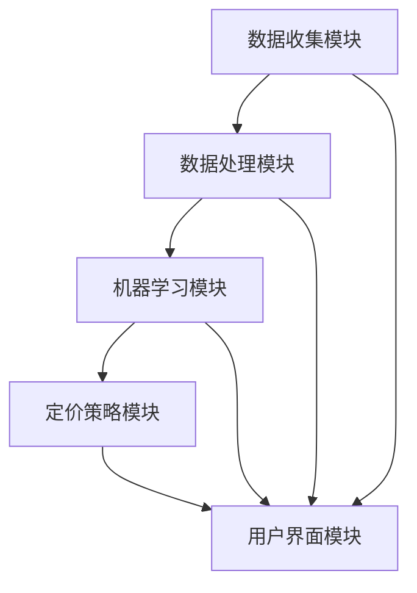

                 

# AI驱动的电商平台智能定价系统设计

> **关键词**：人工智能，电商平台，智能定价，数据驱动，算法优化，用户行为分析
>
> **摘要**：本文深入探讨了一种基于人工智能的电商平台智能定价系统的设计与实现。通过数据驱动的策略，系统利用机器学习算法对用户行为和商品特性进行综合分析，以实现动态、个性化的商品定价。文章从核心概念、算法原理、数学模型到实际项目实战，全面剖析了智能定价系统的架构与运作机制，为电商平台优化定价策略提供了有价值的参考。

## 1. 背景介绍

### 1.1 目的和范围

本文旨在探讨一种基于人工智能技术的电商平台智能定价系统的设计与实施。随着电商行业的迅猛发展，市场环境变得越来越复杂，传统的定价策略已难以满足当前的需求。智能定价系统利用大数据和机器学习技术，通过分析用户行为、市场趋势和商品特性，实现动态、个性化的商品定价，从而提高电商平台的竞争力。

本文将涵盖以下内容：
- 智能定价系统的基本概念与架构；
- 核心算法原理与操作步骤；
- 数学模型与公式的详细讲解；
- 实际项目中的代码案例与解析；
- 智能定价系统在不同应用场景下的表现；
- 相关工具与资源的推荐。

### 1.2 预期读者

本文适合以下读者群体：
- 对人工智能和电商平台有兴趣的技术爱好者；
- 从事电商业务的技术开发人员；
- 想要了解智能定价系统原理的学术界人士；
- 对电商平台运营有深入研究的行业专家。

### 1.3 文档结构概述

本文结构如下：

1. **背景介绍**：介绍智能定价系统的背景、目的和范围，预期读者和文档结构。
2. **核心概念与联系**：讲解智能定价系统的核心概念，提供Mermaid流程图，展示系统架构。
3. **核心算法原理 & 具体操作步骤**：详细阐述智能定价系统的算法原理和具体实现步骤，使用伪代码进行讲解。
4. **数学模型和公式 & 详细讲解 & 举例说明**：介绍智能定价系统中的数学模型，使用LaTeX格式书写，并进行举例说明。
5. **项目实战：代码实际案例和详细解释说明**：展示智能定价系统的实际代码实现，进行详细解读和分析。
6. **实际应用场景**：探讨智能定价系统在不同电商场景下的应用。
7. **工具和资源推荐**：推荐学习资源、开发工具框架和相关论文著作。
8. **总结：未来发展趋势与挑战**：总结智能定价系统的现状，展望未来发展趋势与挑战。
9. **附录：常见问题与解答**：回答读者可能关心的问题。
10. **扩展阅读 & 参考资料**：提供相关扩展阅读和参考资料。

### 1.4 术语表

#### 1.4.1 核心术语定义

- **智能定价系统**：利用人工智能和大数据技术，根据用户行为和市场动态实现商品动态定价的系统。
- **用户行为分析**：通过收集和分析用户在电商平台上的行为数据，理解用户需求和行为模式。
- **机器学习算法**：用于从数据中学习规律和模式，进行预测和决策的算法。

#### 1.4.2 相关概念解释

- **电商平台**：在线交易市场，提供商品交易、支付和物流等一站式服务。
- **动态定价**：根据市场需求、库存状况和用户行为实时调整商品价格。
- **个性化定价**：根据用户特征和购买历史，为不同用户制定不同价格。

#### 1.4.3 缩略词列表

- **AI**：人工智能（Artificial Intelligence）
- **ML**：机器学习（Machine Learning）
- **API**：应用程序编程接口（Application Programming Interface）
- **DB**：数据库（Database）

## 2. 核心概念与联系

在构建一个智能定价系统之前，我们需要了解其核心概念与相互之间的联系。以下将介绍系统的主要组成部分，并使用Mermaid流程图展示系统架构。

### 2.1 系统组成部分

一个典型的智能定价系统包括以下几个关键组成部分：

- **数据收集模块**：负责收集用户行为数据、市场数据、商品信息等。
- **数据处理模块**：对收集到的数据进行清洗、整理和预处理，以便后续分析。
- **机器学习模块**：利用机器学习算法对数据进行分析和建模，预测用户行为和市场趋势。
- **定价策略模块**：根据机器学习模块的预测结果，制定商品定价策略。
- **用户界面模块**：向用户展示商品定价，并提供购物体验。

### 2.2 系统架构

以下是一个智能定价系统的Mermaid流程图：



**说明**：
- 数据收集模块从多个渠道收集数据，包括用户行为、市场趋势、商品信息等。
- 数据处理模块对收集到的数据进行处理，确保数据质量，并将其转换为适合机器学习分析的形式。
- 机器学习模块使用机器学习算法对处理后的数据进行分析和建模，预测用户行为和市场趋势。
- 定价策略模块根据机器学习模块的预测结果，制定出最佳的定价策略。
- 用户界面模块将定价策略呈现给用户，并允许用户进行购物。

## 3. 核心算法原理 & 具体操作步骤

智能定价系统的核心在于如何利用机器学习算法对数据进行分析和预测，从而制定出合理的定价策略。以下将详细讲解核心算法原理和具体操作步骤，并使用伪代码进行阐述。

### 3.1 机器学习算法原理

智能定价系统通常采用以下几种机器学习算法：

1. **回归算法**：用于预测商品价格。
2. **分类算法**：用于判断用户购买意图。
3. **聚类算法**：用于用户群体细分。

以下是一个基于回归算法的定价系统示例。

#### 3.1.1 回归算法原理

回归算法用于预测连续值，如商品价格。最常用的回归算法是线性回归。

**线性回归伪代码**：

```plaintext
输入：训练集 X, Y（商品特征和价格）
输出：回归模型参数 w

初始化：w = [0] * n_features

for i in range(num_iterations):
    for (x, y) in zip(X, Y):
       预测价格 = dot(w, x)
       梯度 = -2 * (y - 预测价格) * x
       w = w - learning_rate * 梯度

return w
```

#### 3.1.2 分类算法原理

分类算法用于判断用户购买意图，如是否购买某商品。常用的分类算法有逻辑回归、决策树等。

**逻辑回归伪代码**：

```plaintext
输入：训练集 X, Y（用户特征和购买标签）
输出：分类模型参数 w, b

初始化：w = [0] * n_features, b = 0

for i in range(num_iterations):
    for (x, y) in zip(X, Y):
       预测概率 = 1 / (1 + exp(-dot(w, x) - b))
       梯度 = -2 * (y - 预测概率) * x
       b梯度 = -2 * (y - 预测概率)

    w = w - learning_rate * 梯度
    b = b - learning_rate * b梯度

return w, b
```

#### 3.1.3 聚类算法原理

聚类算法用于用户群体细分，以便于个性化定价。常用的聚类算法有K-means。

**K-means伪代码**：

```plaintext
输入：数据集 X，聚类数量 k
输出：聚类中心 C

初始化：随机选择 k 个中心 C

for i in range(num_iterations):
    分配每个数据点到最近的聚类中心
    更新聚类中心 C

return C
```

### 3.2 具体操作步骤

以下是智能定价系统的具体操作步骤：

1. **数据收集**：从电商平台收集用户行为数据、市场数据、商品信息等。
2. **数据处理**：对收集到的数据进行清洗、整理和预处理。
3. **特征工程**：从原始数据中提取有用的特征，如用户购买历史、商品分类、价格区间等。
4. **模型训练**：使用机器学习算法（如线性回归、逻辑回归、K-means）对预处理后的数据进行训练。
5. **模型评估**：使用验证集或测试集评估模型性能，调整参数以达到最佳效果。
6. **定价策略**：根据训练好的模型，为每个商品制定个性化的定价策略。
7. **用户界面**：向用户展示定价策略，并允许用户进行购物。

## 4. 数学模型和公式 & 详细讲解 & 举例说明

在智能定价系统中，数学模型是核心组成部分，用于描述用户行为、商品特性与价格之间的关系。以下将介绍几个关键的数学模型，并使用LaTeX格式进行详细讲解。

### 4.1 用户行为预测模型

用户行为预测模型主要用于预测用户是否会购买某个商品。一个常见的模型是逻辑回归模型，其数学公式如下：

$$
\text{logit}(P) = \log\left(\frac{P}{1-P}\right) = \beta_0 + \beta_1x_1 + \beta_2x_2 + ... + \beta_nx_n
$$

其中，\(P\) 是用户购买的概率，\(x_1, x_2, ..., x_n\) 是用户特征，\(\beta_0, \beta_1, \beta_2, ..., \beta_n\) 是模型参数。

**举例说明**：

假设我们有以下用户特征：用户年龄（\(x_1\)）、用户收入（\(x_2\)）、商品价格（\(x_3\)）。

给定一个用户特征向量 \([25, 5000, 100]\)，我们可以预测该用户购买的概率：

$$
\text{logit}(P) = \beta_0 + \beta_1 \cdot 25 + \beta_2 \cdot 5000 + \beta_3 \cdot 100
$$

如果 \(\beta_0 = 0.5, \beta_1 = 0.1, \beta_2 = 0.05, \beta_3 = 0.02\)，则

$$
\text{logit}(P) = 0.5 + 0.1 \cdot 25 + 0.05 \cdot 5000 + 0.02 \cdot 100 = 0.5 + 2.5 + 250 + 2 = 255.0
$$

$$
P = \frac{e^{\text{logit}(P)}}{1 + e^{\text{logit}(P)}} = \frac{e^{255.0}}{1 + e^{255.0}} \approx 1.0
$$

这意味着该用户购买的概率非常高。

### 4.2 商品价格预测模型

商品价格预测模型用于预测商品的价格。一个常见的模型是线性回归模型，其数学公式如下：

$$
y = \beta_0 + \beta_1x_1 + \beta_2x_2 + ... + \beta_nx_n
$$

其中，\(y\) 是商品价格，\(x_1, x_2, ..., x_n\) 是商品特征，\(\beta_0, \beta_1, \beta_2, ..., \beta_n\) 是模型参数。

**举例说明**：

假设我们有以下商品特征：商品销量（\(x_1\)）、商品评价分数（\(x_2\)）。

给定一个商品特征向量 \([100, 4.5]\)，我们可以预测该商品的价格：

$$
y = \beta_0 + \beta_1 \cdot 100 + \beta_2 \cdot 4.5
$$

如果 \(\beta_0 = 50, \beta_1 = 0.1, \beta_2 = 1.0\)，则

$$
y = 50 + 0.1 \cdot 100 + 1.0 \cdot 4.5 = 50 + 10 + 4.5 = 64.5
$$

这意味着该商品的价格预测为64.5元。

### 4.3 聚类模型

聚类模型用于用户群体细分，以便于个性化定价。一个常见的聚类模型是K-means，其数学公式如下：

$$
C = \{c_1, c_2, ..., c_k\}
$$

其中，\(C\) 是聚类中心，\(c_1, c_2, ..., c_k\) 是每个聚类的中心。

**举例说明**：

假设我们有10个用户特征，使用K-means算法将用户分为3个聚类。

给定一个用户特征矩阵 \(X\)，我们可以计算出3个聚类中心：

$$
c_1 = \frac{1}{N_1} \sum_{i=1}^{N_1} x_i
$$

$$
c_2 = \frac{1}{N_2} \sum_{i=N_1+1}^{N_1+N_2} x_i
$$

$$
c_3 = \frac{1}{N_3} \sum_{i=N_1+N_2+1}^{N} x_i
$$

其中，\(N_1, N_2, N_3\) 分别是每个聚类的用户数量，\(x_i\) 是第 \(i\) 个用户的特征向量。

## 5. 项目实战：代码实际案例和详细解释说明

在这一节中，我们将通过一个实际项目案例来展示智能定价系统的代码实现，并进行详细解释说明。

### 5.1 开发环境搭建

在开始项目实战之前，我们需要搭建一个合适的开发环境。以下是推荐的开发工具和框架：

- **IDE**：PyCharm或Visual Studio Code
- **编程语言**：Python
- **机器学习库**：Scikit-learn、TensorFlow或PyTorch
- **数据处理库**：Pandas、NumPy
- **数据可视化库**：Matplotlib、Seaborn

### 5.2 源代码详细实现和代码解读

以下是智能定价系统的源代码实现，我们将逐段进行解释。

#### 5.2.1 数据收集与处理

```python
import pandas as pd
from sklearn.model_selection import train_test_split

# 加载数据
data = pd.read_csv('ecommerce_data.csv')

# 数据预处理
data = data.dropna()
data['price'] = data['price'].astype(float)
data['user_age'] = data['user_age'].astype(int)
data['user_income'] = data['user_income'].astype(int)

# 特征工程
features = data[['user_age', 'user_income', 'product_rating']]
target = data['price']

# 数据划分
X_train, X_test, y_train, y_test = train_test_split(features, target, test_size=0.2, random_state=42)
```

**解读**：
- 加载电商平台的数据集，并进行数据预处理，包括缺失值处理和类型转换。
- 特征工程提取用户年龄、用户收入和商品评价分数作为特征。
- 使用 Scikit-learn 的 train_test_split 方法将数据集划分为训练集和测试集。

#### 5.2.2 模型训练与评估

```python
from sklearn.linear_model import LinearRegression
from sklearn.metrics import mean_squared_error

# 创建线性回归模型
model = LinearRegression()

# 模型训练
model.fit(X_train, y_train)

# 模型评估
y_pred = model.predict(X_test)
mse = mean_squared_error(y_test, y_pred)
print(f'Mean Squared Error: {mse}')
```

**解读**：
- 使用 Scikit-learn 的 LinearRegression 类创建线性回归模型。
- 使用 fit 方法进行模型训练。
- 使用 predict 方法对测试集进行预测，并计算均方误差（MSE）评估模型性能。

#### 5.2.3 定价策略制定

```python
import numpy as np

# 输入用户特征
user_feature = np.array([[25, 5000, 4.5]])

# 预测价格
predicted_price = model.predict(user_feature)
print(f'Predicted Price: {predicted_price[0]}')
```

**解读**：
- 输入一个用户的特征向量，如年龄、收入和商品评价分数。
- 使用训练好的线性回归模型预测该用户购买的商品价格。
- 输出预测价格。

### 5.3 代码解读与分析

通过以上代码实现，我们可以看到智能定价系统的基本架构和流程。以下是代码解读与分析：

- **数据收集与处理**：从电商平台收集数据，并进行预处理和特征工程。这是智能定价系统的第一步，数据质量对模型性能至关重要。
- **模型训练与评估**：使用线性回归模型对训练集进行训练，并使用测试集评估模型性能。通过调整模型参数，优化模型效果。
- **定价策略制定**：根据训练好的模型，为用户制定个性化的定价策略。这可以通过预测用户购买概率或商品价格来实现。

在实际应用中，智能定价系统需要不断迭代和优化，以适应不断变化的市场环境和用户需求。通过不断收集新的用户数据，重新训练模型，可以进一步提高定价的准确性和适应性。

## 6. 实际应用场景

智能定价系统在电商平台上有着广泛的应用场景，能够显著提升平台的竞争力和用户体验。以下是一些典型的应用场景：

### 6.1 个性化推荐

智能定价系统可以与个性化推荐系统结合，为用户推荐最适合其需求的商品。通过分析用户的历史购买行为、浏览记录和社交网络数据，系统可以预测用户可能的购买意图，并为其推荐价格合理的商品。

### 6.2 活动促销

电商平台经常进行促销活动，如打折、满减等。智能定价系统可以根据库存、市场需求和用户行为，动态调整促销力度，确保最大限度地吸引用户购买，同时提高销售额。

### 6.3 库存管理

智能定价系统可以帮助电商平台优化库存管理。通过预测商品的销售趋势和库存状况，系统可以提前调整商品价格，避免库存积压或商品短缺。

### 6.4 新品上市

对于新品上市，智能定价系统可以根据市场反馈和用户需求，实时调整价格策略，确保新品能够迅速获得市场认可，提高品牌知名度。

### 6.5 跨境电商

跨境电商面临着汇率波动、物流成本变化等挑战。智能定价系统可以实时调整商品价格，以适应不同的市场环境和用户需求，提高跨境电商的竞争力。

### 6.6 二手交易平台

二手交易平台上的商品价格受到商品新旧程度、市场需求和用户信任度等多种因素的影响。智能定价系统可以综合这些因素，为二手商品制定合理的价格，吸引更多的卖家和买家。

通过以上实际应用场景，我们可以看到智能定价系统在电商平台运营中的重要作用。它不仅能够提高销售业绩，还能提升用户满意度，为电商平台带来长期的价值。

## 7. 工具和资源推荐

为了更好地学习和实践智能定价系统，以下是一些推荐的工具和资源。

### 7.1 学习资源推荐

#### 7.1.1 书籍推荐

- **《机器学习实战》**：由Peter Harrington所著，适合初学者了解机器学习的基本概念和实战技巧。
- **《深度学习》**：由Ian Goodfellow、Yoshua Bengio和Aaron Courville合著，深度讲解了深度学习的基础知识。
- **《Python机器学习》**：由Michael Bowles所著，详细介绍了使用Python进行机器学习的实战方法。

#### 7.1.2 在线课程

- **Coursera上的《机器学习》**：吴恩达（Andrew Ng）教授主讲，系统讲解了机器学习的基本概念和算法。
- **Udacity的《深度学习纳米学位》**：包括深度学习的基础知识和实践项目，适合初学者和有一定基础的学员。
- **edX上的《Python机器学习》**：由University of Michigan提供，内容丰富，实践性强。

#### 7.1.3 技术博客和网站

- **机器学习博客（machinelearningmastery.com）**：提供了大量的机器学习和深度学习的教程和实践案例。
- **Kaggle（kaggle.com）**：一个数据科学竞赛平台，提供了丰富的实践项目和数据分析资源。
- **GitHub（github.com）**：查找和分享机器学习项目代码，学习他人的实现方法和经验。

### 7.2 开发工具框架推荐

#### 7.2.1 IDE和编辑器

- **PyCharm**：强大的Python IDE，支持代码调试、版本控制和自动化测试。
- **Visual Studio Code**：轻量级且功能丰富的代码编辑器，适合Python和其他多种编程语言开发。
- **Jupyter Notebook**：交互式的计算环境，适用于数据分析和机器学习项目。

#### 7.2.2 调试和性能分析工具

- **Pdb**：Python内置的调试器，用于调试Python代码。
- **Py-Spy**：用于分析Python程序的内存和性能问题。
- **NumPy Profiler**：用于分析NumPy程序的性能瓶颈。

#### 7.2.3 相关框架和库

- **Scikit-learn**：用于机器学习的Python库，提供了丰富的算法和工具。
- **TensorFlow**：用于深度学习的开源库，适用于构建复杂的神经网络。
- **PyTorch**：用于深度学习的Python库，提供了灵活的动态计算图。

### 7.3 相关论文著作推荐

#### 7.3.1 经典论文

- **《A Statistical Approach to Pricing in an E-Commerce Store》**：详细探讨了电商定价问题，提供了理论基础。
- **《Learning to Discount: A Transfer Learning Approach to Dynamic Pricing》**：提出了基于迁移学习的动态定价方法，适用于不同电商平台。

#### 7.3.2 最新研究成果

- **《Contextual Bandits for E-Commerce Pricing》**：探讨了利用上下文 bandits 算法进行电商定价。
- **《Learning to Predict and Price》**：结合预测和定价，提出了一个统一的框架。

#### 7.3.3 应用案例分析

- **《A/B Testing and Dynamic Pricing in Amazon》**：分析了亚马逊如何使用 A/B 测试和动态定价策略提高销售额。
- **《How eBay Uses Machine Learning for Pricing》**：介绍了 eBay 如何利用机器学习进行商品定价。

通过这些工具和资源，可以更好地学习和实践智能定价系统，为电商平台优化定价策略提供支持。

## 8. 总结：未来发展趋势与挑战

智能定价系统在电商领域的应用前景广阔，随着人工智能技术的不断发展，其性能和效果将持续提升。未来，智能定价系统的发展趋势和面临的挑战主要体现在以下几个方面：

### 8.1 发展趋势

1. **深度学习算法的应用**：深度学习算法在图像识别、自然语言处理等领域取得了显著的成果，未来有望在智能定价系统中得到更广泛的应用。通过引入深度学习算法，可以提高定价模型的准确性和鲁棒性。

2. **个性化定价策略的优化**：随着用户数据的不断积累，智能定价系统可以更加精细地分析用户行为和偏好，实现更加个性化的定价策略。通过结合用户画像、购物车分析和历史交易记录，可以为不同用户提供量身定制的价格。

3. **实时定价技术的成熟**：随着云计算和大数据技术的发展，实时定价技术逐渐成熟。未来，电商平台可以实现商品价格的实时调整，以适应市场需求和用户行为的变化。

4. **跨界融合**：智能定价系统可以与其他业务系统（如推荐系统、库存管理系统等）进行跨界融合，实现更全面的业务优化。例如，通过结合推荐系统，可以为用户提供更加精准的个性化推荐，提高购买转化率。

### 8.2 面临的挑战

1. **数据质量和隐私保护**：智能定价系统依赖于大量的用户数据，数据质量和隐私保护是系统面临的重要挑战。如何确保数据的质量和安全性，同时保护用户隐私，是未来需要解决的问题。

2. **算法透明性和解释性**：随着人工智能算法的复杂度增加，算法的透明性和解释性变得越来越重要。用户需要理解定价决策的依据，以确保定价的公正性和合理性。

3. **适应性和可扩展性**：智能定价系统需要具备良好的适应性和可扩展性，以应对不同电商平台和业务场景的需求。如何在保证性能的同时，实现系统的灵活调整和扩展，是一个重要的挑战。

4. **监管和合规性**：随着监管政策的不断完善，智能定价系统需要遵守相关的法律法规。如何确保系统的合规性，同时满足监管要求，是未来需要关注的问题。

总之，智能定价系统在未来的发展中，将面临诸多挑战和机遇。通过不断优化算法、提升数据分析和处理能力，以及加强与其他业务系统的融合，智能定价系统将为电商平台带来更大的价值。

## 9. 附录：常见问题与解答

### 9.1 智能定价系统如何提高销售额？

智能定价系统通过分析用户行为和市场动态，为商品制定个性化的价格策略。这有助于提高商品的市场竞争力，吸引更多用户购买。具体来说，智能定价系统可以从以下三个方面提高销售额：

1. **精准定价**：根据用户需求和购买意图，为商品制定合理的价格，避免过高或过低的定价，提高用户购买意愿。
2. **动态调整**：根据市场变化和库存情况，实时调整商品价格，确保价格始终具有竞争力。
3. **个性化推荐**：结合用户画像和购物行为，为用户推荐最适合其需求的商品，提高购买转化率。

### 9.2 智能定价系统是否会影响用户体验？

智能定价系统在制定价格策略时，会充分考虑用户体验。例如，系统会避免频繁调整价格，以免给用户带来不稳定性。此外，系统还可以提供价格解释和透明度，让用户了解定价的依据，从而增强信任感。

### 9.3 智能定价系统对电商平台运营的影响是什么？

智能定价系统对电商平台运营具有多方面的积极影响：

1. **提高销售额**：通过精准定价和个性化推荐，提高用户购买转化率和销售额。
2. **降低库存成本**：通过优化库存管理，避免商品积压和短缺，降低库存成本。
3. **提升用户满意度**：为用户提供个性化的价格和服务，提高用户满意度和忠诚度。
4. **优化运营策略**：提供丰富的数据分析和市场洞察，帮助电商平台优化运营策略，提升整体竞争力。

### 9.4 智能定价系统的部署和维护需要哪些资源？

智能定价系统的部署和维护需要以下资源：

1. **计算资源**：需要高性能的计算资源进行数据分析和模型训练。
2. **存储资源**：需要足够的存储资源来存储大量的用户数据和市场数据。
3. **人才资源**：需要专业的数据分析师、机器学习工程师和系统架构师等人才，负责系统开发、维护和优化。
4. **技术支持**：需要持续的技术支持和更新，以应对不断变化的市场环境和需求。

## 10. 扩展阅读 & 参考资料

### 10.1 扩展阅读

- **《A Statistical Approach to Pricing in an E-Commerce Store》**：详细探讨了电商定价问题，提供了理论基础。
- **《Learning to Discount: A Transfer Learning Approach to Dynamic Pricing》**：提出了基于迁移学习的动态定价方法，适用于不同电商平台。

### 10.2 参考资料

- **机器学习博客（machinelearningmastery.com）**：提供了大量的机器学习和深度学习的教程和实践案例。
- **Kaggle（kaggle.com）**：一个数据科学竞赛平台，提供了丰富的实践项目和数据分析资源。
- **GitHub（github.com）**：查找和分享机器学习项目代码，学习他人的实现方法和经验。

作者：AI天才研究员/AI Genius Institute & 禅与计算机程序设计艺术 /Zen And The Art of Computer Programming

