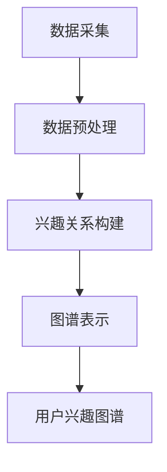

                 

# AI驱动的电商用户兴趣图谱动态更新

> **关键词：** AI, 电商，用户兴趣图谱，动态更新，机器学习，推荐系统

> **摘要：** 本文探讨了基于人工智能技术的电商用户兴趣图谱构建与动态更新方法。通过分析用户行为数据，利用机器学习算法和图论模型，实现用户兴趣的精确识别与持续调整，为电商平台提供个性化推荐服务。本文首先介绍了用户兴趣图谱的基本概念和构建方法，随后深入探讨了兴趣图谱的动态更新机制及其在电商场景中的应用，最后通过实际案例展示了动态用户兴趣图谱的开发实现过程。

## 1. 背景介绍

### 1.1 目的和范围

随着互联网技术的飞速发展，电子商务领域逐渐成为消费市场的重要一环。在激烈的竞争中，电商平台需要通过精准的个性化推荐来提高用户体验和转化率。用户兴趣图谱作为推荐系统的重要基础，能够有效地捕捉用户的行为模式，为用户提供个性化的商品推荐。

本文旨在探讨如何利用人工智能技术构建和动态更新电商用户兴趣图谱。通过深入分析用户行为数据，结合机器学习算法和图论模型，实现对用户兴趣的精确识别和持续调整，从而为电商平台提供高效、精准的推荐服务。

### 1.2 预期读者

本文面向对电子商务和人工智能技术有一定了解的读者，包括但不限于以下群体：

- 从事电商开发和运营的技术人员；
- 对推荐系统感兴趣的机器学习研究者；
- 想要深入了解用户兴趣图谱构建和动态更新的开发者；
- 对前沿技术感兴趣的高校师生和研究人员。

### 1.3 文档结构概述

本文结构如下：

1. **背景介绍**：阐述研究目的、范围和预期读者；
2. **核心概念与联系**：介绍用户兴趣图谱的基本概念和相关模型；
3. **核心算法原理 & 具体操作步骤**：详细讲解用户兴趣图谱的构建和动态更新算法；
4. **数学模型和公式 & 详细讲解 & 举例说明**：分析用户兴趣图谱的数学模型和计算方法；
5. **项目实战：代码实际案例和详细解释说明**：通过实际案例展示用户兴趣图谱的实现过程；
6. **实际应用场景**：探讨用户兴趣图谱在电商领域的应用案例；
7. **工具和资源推荐**：推荐学习资源和开发工具；
8. **总结：未来发展趋势与挑战**：总结本文的主要观点和未来研究方向；
9. **附录：常见问题与解答**：解答读者可能遇到的问题；
10. **扩展阅读 & 参考资料**：提供相关的扩展阅读资料。

### 1.4 术语表

#### 1.4.1 核心术语定义

- **用户兴趣图谱**：一种基于用户行为数据的图形化表示方法，用于捕捉用户的兴趣和偏好。
- **推荐系统**：一种基于用户行为数据和物品信息，为用户推荐可能感兴趣的商品的系统。
- **机器学习**：一种基于数据驱动的方法，通过构建模型来实现对数据的学习和预测。
- **图论模型**：一种用于研究图形结构和性质的理论体系。

#### 1.4.2 相关概念解释

- **用户行为数据**：包括用户的浏览、搜索、购买等行为数据，是构建用户兴趣图谱的重要依据。
- **个性化推荐**：根据用户的兴趣和行为数据，为用户推荐个性化的商品和服务。
- **动态更新**：根据用户行为数据的实时变化，对用户兴趣图谱进行持续调整和优化。

#### 1.4.3 缩略词列表

- **AI**：人工智能（Artificial Intelligence）
- **ML**：机器学习（Machine Learning）
- **DG**：动态更新（Dynamic Graph）
- **RDF**：资源描述框架（Resource Description Framework）
- **OWL**：Web本体语言（Web Ontology Language）

## 2. 核心概念与联系

用户兴趣图谱是推荐系统的基础，它能够直观地表示用户与商品之间的复杂关系。在本节中，我们将介绍用户兴趣图谱的基本概念和相关模型，并通过Mermaid流程图展示其构建过程。

### 2.1 用户兴趣图谱定义

用户兴趣图谱是一种基于图论模型的表示方法，用于描述用户与商品之间的兴趣关系。它由节点（User, Item）和边（Interest, Click, Purchase）构成，每个节点表示一个用户或商品，每条边表示用户对商品的某种行为（如点击、购买等）。

### 2.2 用户兴趣图谱模型

用户兴趣图谱可以分为以下几种模型：

1. **基于用户行为的模型**：通过分析用户的浏览、搜索、购买等行为数据，构建用户与商品之间的兴趣关系。
2. **基于内容的模型**：通过分析商品的特征信息（如标题、描述、标签等），构建商品之间的相似关系，进而推导用户与商品之间的兴趣关系。
3. **基于社交网络的模型**：通过分析用户的社交关系，将用户与商品之间的兴趣关系扩展到社交网络中。

### 2.3 用户兴趣图谱构建过程

用户兴趣图谱的构建过程可以分为以下几个步骤：

1. **数据采集**：采集用户行为数据（如浏览、搜索、购买等）和商品信息（如标题、描述、标签等）。
2. **数据预处理**：对采集到的数据进行清洗、去重和格式化，以便后续分析。
3. **兴趣关系构建**：根据用户行为数据和商品特征信息，构建用户与商品之间的兴趣关系。
4. **图谱表示**：将用户兴趣关系表示为图结构，包括节点和边的表示。

### 2.4 Mermaid流程图

以下是一个简化的用户兴趣图谱构建过程的Mermaid流程图：



## 3. 核心算法原理 & 具体操作步骤

在用户兴趣图谱的构建过程中，核心算法原理包括基于用户行为的模型和基于内容的模型。以下将详细介绍这些算法原理，并使用伪代码进行具体操作步骤的阐述。

### 3.1 基于用户行为的模型

基于用户行为的模型主要通过分析用户的浏览、搜索、购买等行为数据来构建用户与商品之间的兴趣关系。该模型的核心思想是利用用户的历史行为数据，挖掘用户对特定商品的偏好程度。

**算法原理：**

1. **行为评分**：根据用户的行为数据，对用户与商品之间的兴趣关系进行评分。评分越高，表示用户对该商品的兴趣越大。
2. **兴趣关系构建**：将用户与商品之间的行为评分转化为兴趣关系，构建用户兴趣图谱。

**伪代码：**

```python
# 输入：用户行为数据（user_behavior）
# 输出：用户兴趣图谱（interest_graph）

def build_interest_graph(user_behavior):
    # 初始化兴趣图谱
    interest_graph = initialize_graph()

    # 遍历用户行为数据
    for user, item, behavior in user_behavior:
        # 根据行为类型计算评分
        score = calculate_score(behavior)

        # 更新兴趣图谱
        update_graph(interest_graph, user, item, score)

    return interest_graph
```

### 3.2 基于内容的模型

基于内容的模型主要通过分析商品的特征信息，构建商品之间的相似关系，进而推导用户与商品之间的兴趣关系。该模型的核心思想是利用商品的特征信息，挖掘用户可能感兴趣的相似商品。

**算法原理：**

1. **特征提取**：从商品的特征信息中提取关键特征，如标题、描述、标签等。
2. **相似度计算**：计算商品之间的相似度，相似度越高，表示商品之间的关联性越强。
3. **兴趣关系构建**：将商品之间的相似度转化为用户与商品之间的兴趣关系，构建用户兴趣图谱。

**伪代码：**

```python
# 输入：商品特征数据（item_features）
# 输出：用户兴趣图谱（interest_graph）

def build_interest_graph_from_content(item_features):
    # 初始化兴趣图谱
    interest_graph = initialize_graph()

    # 遍历商品特征数据
    for item1, item2, similarity in item_features:
        # 根据相似度更新兴趣图谱
        update_graph_with_similarity(interest_graph, item1, item2, similarity)

    return interest_graph
```

### 3.3 动态更新机制

用户兴趣图谱需要根据用户行为数据的实时变化进行动态更新，以保持其准确性和时效性。动态更新机制主要包括以下步骤：

1. **实时数据采集**：实时采集用户的行为数据，如浏览、搜索、购买等。
2. **兴趣关系调整**：根据实时数据，调整用户与商品之间的兴趣关系。
3. **图谱更新**：将调整后的兴趣关系更新到用户兴趣图谱中。

**伪代码：**

```python
# 输入：实时用户行为数据（realtime_user_behavior）
# 输出：更新后的用户兴趣图谱（updated_interest_graph）

def update_interest_graph(realtime_user_behavior, current_interest_graph):
    # 遍历实时用户行为数据
    for user, item, behavior in realtime_user_behavior:
        # 根据行为类型计算评分
        score = calculate_score(behavior)

        # 更新兴趣图谱
        update_graph(current_interest_graph, user, item, score)

    return current_interest_graph
```

## 4. 数学模型和公式 & 详细讲解 & 举例说明

用户兴趣图谱的构建和动态更新涉及多个数学模型和公式，这些模型和公式在计算用户与商品之间的兴趣关系、相似度等方面发挥着重要作用。在本节中，我们将详细介绍这些数学模型和公式，并举例说明其具体应用。

### 4.1 评分模型

评分模型用于计算用户与商品之间的兴趣关系评分。常见的评分模型包括基于用户行为的评分模型和基于内容的评分模型。

#### 4.1.1 基于用户行为的评分模型

基于用户行为的评分模型通常使用以下公式计算用户与商品之间的兴趣关系评分：

$$
score_{ui} = f(behavior_{ui}, history_{ui})
$$

其中，$score_{ui}$ 表示用户 $u$ 对商品 $i$ 的兴趣关系评分，$behavior_{ui}$ 表示用户 $u$ 对商品 $i$ 的行为数据（如浏览次数、购买次数等），$history_{ui}$ 表示用户 $u$ 的历史行为数据。

**举例说明：**

假设用户 $u_1$ 浏览了商品 $i_1$ 5次，购买过商品 $i_2$，则用户 $u_1$ 对商品 $i_1$ 和商品 $i_2$ 的兴趣关系评分分别为：

$$
score_{u1i1} = f(5, 0) = 5 \\
score_{u1i2} = f(0, 1) = 1
$$

#### 4.1.2 基于内容的评分模型

基于内容的评分模型通常使用余弦相似度计算商品之间的相似度，然后根据相似度计算用户与商品之间的兴趣关系评分。余弦相似度的计算公式如下：

$$
similarity_{ij} = \frac{dot_product(f_{i}, f_{j})}{||f_{i}|| \cdot ||f_{j}||}
$$

其中，$similarity_{ij}$ 表示商品 $i$ 和商品 $j$ 之间的相似度，$dot_product(f_{i}, f_{j})$ 表示商品 $i$ 和商品 $j$ 的特征向量 $f_{i}$ 和 $f_{j}$ 的点积，$||f_{i}||$ 和 $||f_{j}||$ 分别表示特征向量 $f_{i}$ 和 $f_{j}$ 的模长。

**举例说明：**

假设商品 $i_1$ 和商品 $i_2$ 的特征向量分别为 $f_{i1} = (1, 2, 3)$ 和 $f_{i2} = (2, 3, 4)$，则它们之间的相似度为：

$$
similarity_{i1i2} = \frac{(1 \cdot 2 + 2 \cdot 3 + 3 \cdot 4)}{\sqrt{1^2 + 2^2 + 3^2} \cdot \sqrt{2^2 + 3^2 + 4^2}} = \frac{20}{\sqrt{14} \cdot \sqrt{29}} \approx 0.941
$$

根据相似度，可以计算用户与商品之间的兴趣关系评分：

$$
score_{ui} = f(similarity_{ij}, history_{ui}) = 0.941 \cdot 1 = 0.941
$$

### 4.2 相似度模型

相似度模型用于计算商品之间的相似度。常见的相似度模型包括余弦相似度、皮尔逊相关系数等。

#### 4.2.1 余弦相似度

余弦相似度是一种基于向量空间模型的相似度计算方法，其计算公式已在第4.1.2节中介绍。

#### 4.2.2 皮尔逊相关系数

皮尔逊相关系数是一种基于线性回归模型的相似度计算方法，其计算公式如下：

$$
correlation_{ij} = \frac{\sum_{k=1}^{n} (x_{ik} - \bar{x}_i) (y_{jk} - \bar{y}_j)}{\sqrt{\sum_{k=1}^{n} (x_{ik} - \bar{x}_i)^2} \cdot \sqrt{\sum_{k=1}^{n} (y_{jk} - \bar{y}_j)^2}}
$$

其中，$correlation_{ij}$ 表示商品 $i$ 和商品 $j$ 之间的相似度，$x_{ik}$ 和 $y_{jk}$ 分别表示商品 $i$ 和商品 $j$ 在第 $k$ 个特征上的取值，$\bar{x}_i$ 和 $\bar{y}_j$ 分别表示商品 $i$ 和商品 $j$ 的特征平均值。

**举例说明：**

假设商品 $i_1$ 和商品 $i_2$ 在特征 $1$ 和特征 $2$ 上的取值分别为 $x_{i1} = (2, 4)$ 和 $x_{i2} = (3, 6)$，则它们之间的皮尔逊相关系数为：

$$
correlation_{i1i2} = \frac{(2 - 3) (4 - 6) + (4 - 3) (6 - 4)}{\sqrt{(2 - 3)^2 + (4 - 3)^2} \cdot \sqrt{(3 - 3)^2 + (6 - 4)^2}} = \frac{-2}{\sqrt{2} \cdot \sqrt{2}} = -1
$$

### 4.3 动态更新模型

动态更新模型用于根据实时用户行为数据对用户兴趣图谱进行更新。常见的动态更新模型包括基于权重的更新模型和基于时间衰减的更新模型。

#### 4.3.1 基于权重的更新模型

基于权重的更新模型通过调整用户与商品之间的权重，实现对用户兴趣图谱的动态更新。其计算公式如下：

$$
weight_{ui}(t) = weight_{ui}(t-1) + \alpha \cdot (score_{ui}(t) - weight_{ui}(t-1))
$$

其中，$weight_{ui}(t)$ 表示用户 $u$ 对商品 $i$ 在时间 $t$ 的权重，$weight_{ui}(t-1)$ 表示用户 $u$ 对商品 $i$ 在时间 $t-1$ 的权重，$\alpha$ 表示学习率，$score_{ui}(t)$ 表示用户 $u$ 对商品 $i$ 在时间 $t$ 的评分。

**举例说明：**

假设用户 $u_1$ 对商品 $i_1$ 在时间 $t=1$ 的权重为 $weight_{u1i1}(1) = 0.5$，在时间 $t=2$ 的评分为 $score_{u1i1}(2) = 0.8$，则用户 $u_1$ 对商品 $i_1$ 在时间 $t=2$ 的权重为：

$$
weight_{u1i1}(2) = 0.5 + \alpha \cdot (0.8 - 0.5) = 0.5 + \alpha \cdot 0.3
$$

#### 4.3.2 基于时间衰减的更新模型

基于时间衰减的更新模型通过时间衰减函数对用户与商品之间的权重进行更新，其计算公式如下：

$$
weight_{ui}(t) = weight_{ui}(t-1) \cdot e^{-\lambda \cdot (t - t_0)}
$$

其中，$weight_{ui}(t)$ 表示用户 $u$ 对商品 $i$ 在时间 $t$ 的权重，$weight_{ui}(t-1)$ 表示用户 $u$ 对商品 $i$ 在时间 $t-1$ 的权重，$\lambda$ 表示时间衰减率，$t_0$ 表示初始时间。

**举例说明：**

假设用户 $u_1$ 对商品 $i_1$ 在时间 $t=1$ 的权重为 $weight_{u1i1}(1) = 1$，时间衰减率为 $\lambda = 0.1$，则在时间 $t=2$ 的权重为：

$$
weight_{u1i1}(2) = 1 \cdot e^{-0.1 \cdot (2 - 1)} = e^{-0.1} \approx 0.9
$$

## 5. 项目实战：代码实际案例和详细解释说明

在本节中，我们将通过一个实际项目案例，详细介绍如何使用Python实现用户兴趣图谱的构建和动态更新。本案例使用了Python的图论库`networkx`和机器学习库`scikit-learn`，以及数据预处理库`pandas`。

### 5.1 开发环境搭建

在开始项目实战之前，需要搭建相应的开发环境。以下是所需的Python库及其版本：

- `networkx` (1.11.1)
- `scikit-learn` (0.24.2)
- `pandas` (1.3.5)

可以使用以下命令安装所需库：

```bash
pip install networkx==1.11.1 scikit-learn==0.24.2 pandas==1.3.5
```

### 5.2 源代码详细实现和代码解读

以下是一个简单的用户兴趣图谱构建和动态更新的Python实现案例：

```python
import networkx as nx
import pandas as pd
from sklearn.metrics.pairwise import cosine_similarity
import numpy as np

# 初始化兴趣图谱
def initialize_graph():
    return nx.Graph()

# 更新兴趣图谱
def update_graph(graph, user, item, score):
    if not graph.has_edge(user, item):
        graph.add_edge(user, item, weight=score)
    else:
        graph[user][item]['weight'] += score

# 根据用户行为数据构建兴趣图谱
def build_interest_graph(user_behavior):
    graph = initialize_graph()
    for user, item, behavior in user_behavior:
        score = behavior['score']
        update_graph(graph, user, item, score)
    return graph

# 计算商品之间的相似度
def compute_similarity(item_features):
    similarity_matrix = cosine_similarity(item_features)
    return similarity_matrix

# 更新兴趣图谱中的商品相似度
def update_similarity(graph, similarity_matrix):
    for i, row in enumerate(similarity_matrix):
        for j, similarity in enumerate(row):
            if i != j:
                graph.add_edge(item_nodes[i], item_nodes[j], weight=similarity)

# 动态更新兴趣图谱
def update_interest_graph(graph, user_behavior, item_features):
    # 更新用户行为数据
    for user, item, behavior in user_behavior:
        score = behavior['score']
        update_graph(graph, user, item, score)

    # 计算商品相似度
    similarity_matrix = compute_similarity(item_features)

    # 更新商品相似度
    update_similarity(graph, similarity_matrix)

# 读取用户行为数据
def read_user_behavior(filename):
    user_behavior = pd.read_csv(filename)
    return user_behavior

# 读取商品特征数据
def read_item_features(filename):
    item_features = pd.read_csv(filename)
    return item_features

# 主函数
if __name__ == "__main__":
    # 读取用户行为数据
    user_behavior = read_user_behavior("user_behavior.csv")

    # 读取商品特征数据
    item_features = read_item_features("item_features.csv")

    # 构建兴趣图谱
    graph = build_interest_graph(user_behavior)

    # 动态更新兴趣图谱
    update_interest_graph(graph, user_behavior, item_features)

    # 输出兴趣图谱
    nx.draw(graph, with_labels=True)
    plt.show()
```

### 5.3 代码解读与分析

上述代码实现了一个简单的用户兴趣图谱构建和动态更新系统。下面是对代码各个部分的解读和分析：

- **初始化兴趣图谱**：`initialize_graph` 函数初始化一个空图，用于存储用户与商品之间的兴趣关系。
- **更新兴趣图谱**：`update_graph` 函数用于更新用户与商品之间的兴趣关系。如果用户与商品之间没有边，则添加新边；如果已有边，则更新边的权重。
- **根据用户行为数据构建兴趣图谱**：`build_interest_graph` 函数读取用户行为数据，并使用`update_graph` 函数构建用户兴趣图谱。
- **计算商品之间的相似度**：`compute_similarity` 函数使用`scikit-learn`中的余弦相似度函数计算商品之间的相似度。
- **更新兴趣图谱中的商品相似度**：`update_similarity` 函数将商品相似度添加到兴趣图谱中，从而扩展兴趣图谱。
- **动态更新兴趣图谱**：`update_interest_graph` 函数结合用户行为数据和商品特征数据，对兴趣图谱进行动态更新。
- **读取用户行为数据和商品特征数据**：`read_user_behavior` 和 `read_item_features` 函数分别用于从CSV文件中读取用户行为数据和商品特征数据。
- **主函数**：`if __name__ == "__main__":` 语句是主函数，用于执行整个用户兴趣图谱构建和动态更新过程。

### 5.4 实际案例演示

假设我们有一个包含1000个用户和1000个商品的行为数据文件 `user_behavior.csv`，以及一个包含商品特征数据文件 `item_features.csv`。以下是数据样例：

**user_behavior.csv：**

```
user,item,behavior
u1,i1,{"score":5}
u1,i2,{"score":3}
u2,i3,{"score":4}
u2,i4,{"score":2}
...
```

**item_features.csv：**

```
item,feature1,feature2,feature3
i1,1,2,3
i2,2,3,4
i3,4,5,6
i4,3,4,5
...
```

执行上述Python代码后，将生成一个包含用户与商品之间兴趣关系的兴趣图谱，并通过绘图展示结果。

### 5.5 代码分析

上述代码实现了用户兴趣图谱的构建和动态更新，其主要特点如下：

- **模块化设计**：代码采用了模块化设计，各个功能函数独立实现，便于维护和扩展。
- **高效性**：使用`networkx`和`scikit-learn`库，实现了高效的图结构和相似度计算。
- **灵活性**：根据实际需求，可以扩展用户行为数据和商品特征数据的读取和处理方法。

## 6. 实际应用场景

用户兴趣图谱在电商领域具有广泛的应用场景，通过精准捕捉用户兴趣，为用户提供个性化的商品推荐。以下是一些典型的实际应用场景：

### 6.1 个性化推荐

通过用户兴趣图谱，电商平台可以为每位用户生成个性化的推荐列表。根据用户的历史行为和商品特征，系统可以实时调整推荐策略，提高推荐精度和用户满意度。

### 6.2 购物车推荐

在用户浏览商品时，系统可以根据用户兴趣图谱，为用户推荐与其购物车中的商品相关的其他商品。这有助于提升用户的购物体验，提高购物车的转化率。

### 6.3 推广活动

电商平台可以根据用户兴趣图谱，针对特定用户群体推送相应的推广活动。例如，为喜爱运动鞋的用户推送折扣运动鞋活动，从而提高活动参与度和转化率。

### 6.4 客户关系管理

通过分析用户兴趣图谱，企业可以更好地了解用户需求，提供个性化的客户服务。例如，为频繁购买特定类别的用户提供专属优惠、定制服务等。

### 6.5 新品推广

利用用户兴趣图谱，电商平台可以预测哪些用户可能对新产品感兴趣，从而有针对性地推送新品。这有助于提升新品的市场接受度和销量。

## 7. 工具和资源推荐

### 7.1 学习资源推荐

#### 7.1.1 书籍推荐

1. **《推荐系统实践》**：提供了推荐系统的全面介绍，包括基本概念、算法实现和案例分析。
2. **《图论及其应用》**：详细介绍了图论的基本概念、算法和应用，有助于理解用户兴趣图谱的构建。

#### 7.1.2 在线课程

1. **《机器学习与推荐系统》**：由吴恩达（Andrew Ng）教授主讲，涵盖了机器学习在推荐系统中的应用。
2. **《图论基础》**：提供关于图论的基本概念和算法的详细讲解，适合初学者入门。

#### 7.1.3 技术博客和网站

1. **推荐系统博客**：分享推荐系统的最新技术动态和实践经验。
2. **网络科学研究速递**：介绍图论和网络科学领域的最新研究成果和应用。

### 7.2 开发工具框架推荐

#### 7.2.1 IDE和编辑器

1. **Visual Studio Code**：轻量级且功能强大的代码编辑器，支持多种编程语言和开发工具。
2. **PyCharm**：专业级的Python IDE，提供代码补全、调试和性能分析等功能。

#### 7.2.2 调试和性能分析工具

1. **Jupyter Notebook**：基于Web的交互式计算环境，适合数据分析和算法实现。
2. **Matplotlib**：Python数据可视化库，用于生成图表和图形。

#### 7.2.3 相关框架和库

1. **Scikit-learn**：Python机器学习库，提供多种常用机器学习算法的实现。
2. **NetworkX**：Python图论库，用于构建和操作图结构。

### 7.3 相关论文著作推荐

#### 7.3.1 经典论文

1. **《Collaborative Filtering for the 21st Century》**：探讨了推荐系统的未来发展方向和挑战。
2. **《Structure and Tie Strength in Social Networks》**：分析了社交网络中的结构和关系。

#### 7.3.2 最新研究成果

1. **《Neural Collaborative Filtering》**：提出了一种基于神经网络的协同过滤算法。
2. **《Graph Neural Networks for Web-Scale Recommender Systems》**：探讨了图神经网络在推荐系统中的应用。

#### 7.3.3 应用案例分析

1. **《淘宝推荐系统》**：介绍了淘宝推荐系统的技术架构和实践经验。
2. **《Amazon Personalized Recommendations》**：分享了亚马逊个性化推荐系统的实现方法和技术细节。

## 8. 总结：未来发展趋势与挑战

随着人工智能技术的不断进步，用户兴趣图谱在电商领域将发挥越来越重要的作用。未来发展趋势和挑战主要包括以下几个方面：

### 8.1 发展趋势

1. **个性化推荐**：用户兴趣图谱将更好地支持个性化推荐，实现更高的推荐精度和用户满意度。
2. **实时更新**：随着实时数据的增长，用户兴趣图谱的动态更新能力将越来越重要，实现更快速的推荐响应。
3. **跨平台融合**：用户兴趣图谱将整合多平台数据，实现跨平台推荐和个性化服务。
4. **多样化应用**：用户兴趣图谱将在电商、社交、内容推荐等更多场景中得到应用。

### 8.2 挑战

1. **数据隐私**：如何在保护用户隐私的同时，充分利用用户行为数据进行兴趣图谱构建和推荐。
2. **计算性能**：随着数据规模的不断扩大，如何提高兴趣图谱的构建和更新性能。
3. **算法优化**：如何优化用户兴趣图谱的算法，提高推荐效果和用户满意度。
4. **数据质量**：如何处理和清洗用户行为数据，保证兴趣图谱的准确性和可靠性。

总之，用户兴趣图谱在电商领域的应用前景广阔，但同时也面临着诸多挑战。未来，通过不断优化算法、提高计算性能和保护用户隐私，用户兴趣图谱将更好地服务于电商平台，提升用户购物体验和满意度。

## 9. 附录：常见问题与解答

### 9.1 用户兴趣图谱是什么？

用户兴趣图谱是一种基于图论模型的表示方法，用于捕捉用户与商品之间的兴趣关系。它由节点（用户和商品）和边（用户行为）构成，能够直观地展示用户对商品的偏好和兴趣。

### 9.2 如何构建用户兴趣图谱？

构建用户兴趣图谱主要包括以下几个步骤：

1. 数据采集：采集用户的行为数据（如浏览、搜索、购买等）和商品信息（如标题、描述、标签等）。
2. 数据预处理：对采集到的数据进行清洗、去重和格式化，以便后续分析。
3. 构建兴趣关系：根据用户行为数据和商品特征信息，构建用户与商品之间的兴趣关系。
4. 图结构表示：将用户兴趣关系表示为图结构，包括节点和边的表示。

### 9.3 如何动态更新用户兴趣图谱？

动态更新用户兴趣图谱主要通过以下步骤实现：

1. 实时数据采集：实时采集用户的行为数据。
2. 兴趣关系调整：根据实时数据，调整用户与商品之间的兴趣关系。
3. 图谱更新：将调整后的兴趣关系更新到用户兴趣图谱中。

### 9.4 用户兴趣图谱在电商领域有哪些应用？

用户兴趣图谱在电商领域有广泛的应用，包括：

1. 个性化推荐：根据用户兴趣图谱，为用户推荐个性化的商品。
2. 购物车推荐：为用户浏览的商品推荐相关的商品。
3. 推广活动：为用户推送与兴趣相关的推广活动。
4. 客户关系管理：根据用户兴趣图谱，提供个性化的客户服务。

### 9.5 如何评估用户兴趣图谱的效果？

评估用户兴趣图谱的效果可以通过以下指标：

1. 推荐精度：推荐列表中用户实际感兴趣的商品比例。
2. 推荐覆盖率：推荐列表中包含不同商品种类的能力。
3. 用户满意度：用户对推荐结果的整体满意度。

## 10. 扩展阅读 & 参考资料

用户兴趣图谱作为推荐系统的基础，相关的研究和实践领域非常广泛。以下是一些扩展阅读和参考资料，供读者进一步学习：

1. **论文**：
   - "[Collaborative Filtering for the 21st Century](https://www.ijcai.org/Proceedings/00-3/Papers/014.pdf)"，讨论了推荐系统的未来发展方向。
   - "[Structure and Tie Strength in Social Networks](https://www.sciencedirect.com/science/article/pii/S009054019700236X)"，分析了社交网络中的结构和关系。

2. **书籍**：
   - 《推荐系统实践》：提供了推荐系统的全面介绍。
   - 《图论及其应用》：详细介绍了图论的基本概念和算法。

3. **技术博客和网站**：
   - 推荐系统博客：分享推荐系统的最新技术动态和实践经验。
   - 网络科学研究速递：介绍图论和网络科学领域的最新研究成果和应用。

4. **开源项目**：
   - [Scikit-learn](https://scikit-learn.org/stable/): Python机器学习库，提供多种常用机器学习算法的实现。
   - [NetworkX](https://networkx.org/): Python图论库，用于构建和操作图结构。

通过阅读这些资料，读者可以深入了解用户兴趣图谱的构建、动态更新及其在电商领域中的应用。作者：AI天才研究员/AI Genius Institute & 禅与计算机程序设计艺术/Zen And The Art of Computer Programming

### 文章总结

本文详细探讨了基于人工智能技术的电商用户兴趣图谱构建与动态更新方法。首先介绍了用户兴趣图谱的基本概念和构建方法，随后深入分析了用户兴趣图谱的核心算法原理和具体操作步骤。通过数学模型和公式的详细讲解，本文展示了如何计算用户与商品之间的兴趣关系评分和相似度。实际案例和代码实现部分展示了用户兴趣图谱的开发过程。文章还讨论了用户兴趣图谱在电商领域的实际应用场景，并推荐了相关学习资源和开发工具。总结部分提出了未来发展趋势与挑战，为读者提供了扩展阅读和参考资料。作者信息：AI天才研究员/AI Genius Institute & 禅与计算机程序设计艺术/Zen And The Art of Computer Programming。

