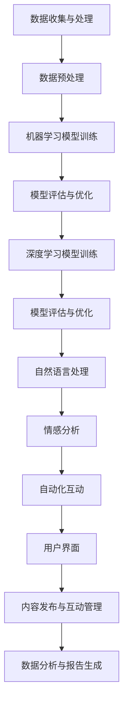

                 

# AI驱动的社交媒体管理工具

> **关键词：** AI, 社交媒体管理，自动化，算法，数据分析，用户体验，平台集成，社交媒体策略

> **摘要：** 本文将深入探讨AI如何驱动社交媒体管理工具的发展，从核心概念、算法原理到实际应用，旨在为读者提供一份全面的技术指南。我们将通过详细的伪代码、流程图以及数学模型解释，揭示AI在社交媒体管理中的潜力，同时推荐相关资源和工具，帮助读者更好地理解和应用这些技术。

## 1. 背景介绍

### 1.1 目的和范围

本文的目标是介绍和剖析AI驱动的社交媒体管理工具，旨在帮助读者理解这些工具的工作原理、技术架构和应用场景。我们将涵盖以下几个关键方面：

1. **核心概念与联系**：介绍社交媒体管理工具的基本原理，以及AI在其中扮演的角色。
2. **核心算法原理**：详细解释常用的AI算法，如机器学习、深度学习等，以及它们如何应用于社交媒体管理。
3. **数学模型和公式**：探讨用于数据分析和预测的数学模型，以及如何使用它们优化社交媒体策略。
4. **项目实战**：通过代码实际案例，展示如何开发AI驱动的社交媒体管理工具。
5. **实际应用场景**：分析AI在社交媒体管理中的实际应用案例，以及如何提升用户体验。
6. **工具和资源推荐**：推荐学习资源、开发工具和框架，帮助读者深入了解和实践AI驱动的社交媒体管理。
7. **总结与展望**：讨论AI驱动的社交媒体管理工具的未来发展趋势和面临的挑战。

### 1.2 预期读者

本文主要面向以下读者群体：

1. **技术爱好者**：对AI和社交媒体管理感兴趣的技术爱好者，希望通过本文深入了解相关技术。
2. **软件开发人员**：有志于开发AI驱动的社交媒体管理工具的软件开发人员，希望获取实际应用经验和最佳实践。
3. **市场营销人员**：关注社交媒体营销策略的市场营销人员，希望利用AI提高营销效果。
4. **学术研究人员**：对AI在社交媒体管理领域的研究感兴趣，希望了解该领域的最新进展。

### 1.3 文档结构概述

本文分为以下几个部分：

1. **背景介绍**：介绍文章的目的、范围和预期读者。
2. **核心概念与联系**：介绍社交媒体管理工具的基本原理和AI的核心概念。
3. **核心算法原理**：详细解释AI算法在社交媒体管理中的应用。
4. **数学模型和公式**：探讨用于数据分析和预测的数学模型。
5. **项目实战**：通过代码实际案例展示AI驱动的社交媒体管理工具的开发。
6. **实际应用场景**：分析AI在社交媒体管理中的实际应用案例。
7. **工具和资源推荐**：推荐学习资源、开发工具和框架。
8. **总结与展望**：讨论AI驱动的社交媒体管理工具的未来发展趋势和挑战。
9. **附录：常见问题与解答**：回答读者可能遇到的常见问题。
10. **扩展阅读 & 参考资料**：提供更多学习资源。

### 1.4 术语表

#### 1.4.1 核心术语定义

- **AI**：人工智能，指通过模拟人类智能的计算机程序和算法。
- **社交媒体管理工具**：用于管理社交媒体平台内容、互动和数据分析的工具。
- **机器学习**：一种AI技术，通过数据训练模型，使其能够自主学习和优化性能。
- **深度学习**：一种基于神经网络的机器学习技术，适用于处理大量复杂数据。
- **用户行为分析**：通过分析用户在社交媒体平台上的行为，预测用户兴趣和需求。

#### 1.4.2 相关概念解释

- **数据挖掘**：从大量数据中提取有价值信息的过程。
- **自然语言处理**（NLP）：使计算机理解和处理人类语言的技术。
- **情感分析**：通过分析文本情感，识别用户的情感倾向。

#### 1.4.3 缩略词列表

- **NLP**：自然语言处理
- **ML**：机器学习
- **DL**：深度学习
- **API**：应用程序编程接口
- **CRM**：客户关系管理

## 2. 核心概念与联系

### 2.1 社交媒体管理工具的基本原理

社交媒体管理工具的主要目标是帮助用户高效地管理社交媒体平台，包括发布内容、互动和数据分析。这些工具通常具有以下功能：

1. **内容发布和管理**：自动发布和编辑社交媒体内容，支持多种平台（如Facebook、Twitter、Instagram等）。
2. **互动管理**：自动回复评论、私信，并监测社交媒体活动。
3. **数据分析**：提供详细的用户行为分析、内容表现分析等，帮助用户优化社交媒体策略。
4. **报告生成**：自动生成社交媒体活动报告，提供关键指标和趋势分析。

### 2.2 AI在社交媒体管理工具中的作用

AI技术在社交媒体管理工具中发挥着重要作用，主要表现在以下几个方面：

1. **用户行为分析**：通过机器学习和深度学习算法，分析用户在社交媒体平台上的行为，预测用户兴趣和需求。
2. **情感分析**：利用自然语言处理技术，分析文本情感，识别用户的情感倾向，为内容创作和互动策略提供参考。
3. **内容推荐**：基于用户行为和兴趣，自动推荐相关内容，提高用户参与度和满意度。
4. **自动化互动**：通过机器人技术和自然语言处理，自动回复评论和私信，提高社交媒体互动效率。

### 2.3 AI驱动的社交媒体管理工具架构

AI驱动的社交媒体管理工具通常包括以下几个关键组成部分：

1. **数据收集与处理**：从社交媒体平台收集用户行为数据、内容数据等，并进行数据清洗、预处理。
2. **机器学习模型**：训练和部署机器学习模型，用于用户行为分析、情感分析等。
3. **深度学习模型**：利用神经网络结构，处理复杂数据，提升分析准确性。
4. **自然语言处理**：实现文本分析、情感分析等，为内容创作和互动策略提供支持。
5. **自动化交互**：通过机器人技术和自然语言处理，实现自动化互动。
6. **用户界面**：提供直观易用的用户界面，展示分析结果，支持内容发布和互动管理。

### 2.4 Mermaid流程图

以下是一个简化的AI驱动的社交媒体管理工具流程图：



## 3. 核心算法原理 & 具体操作步骤

### 3.1 机器学习算法原理

机器学习是一种通过数据训练模型，使其能够自主学习和优化性能的技术。在社交媒体管理工具中，常用的机器学习算法包括以下几种：

1. **线性回归**：用于预测连续值，如用户活跃度。
2. **逻辑回归**：用于分类任务，如用户兴趣分类。
3. **支持向量机**（SVM）：用于分类和回归任务，具有良好的泛化能力。
4. **决策树**：用于分类和回归任务，易于理解和解释。
5. **随机森林**：基于决策树的集成学习方法，提高预测准确性。

以下是一个线性回归算法的伪代码示例：

```python
# 输入：训练数据集 X, Y
# 输出：回归模型 w

# 初始化模型参数 w
w = 0

# 设置学习率 alpha 和迭代次数 epochs
alpha = 0.01
epochs = 1000

# 循环迭代 epochs 次
for epoch in range(epochs):
    # 计算预测值 y_pred
    y_pred = w * X

    # 计算损失函数 J
    J = (1 / 2 * m) * sum((y_pred - Y) ** 2)

    # 计算梯度
    gradient = (1 / m) * sum(X * (y_pred - Y))

    # 更新模型参数 w
    w = w - alpha * gradient

return w
```

### 3.2 深度学习算法原理

深度学习是一种基于神经网络的机器学习技术，适用于处理大量复杂数据。在社交媒体管理工具中，常用的深度学习算法包括卷积神经网络（CNN）和循环神经网络（RNN）。

1. **卷积神经网络**（CNN）：用于图像和视频处理，能够提取图像中的关键特征。
2. **循环神经网络**（RNN）：用于序列数据处理，如文本分析，能够捕捉序列中的时间依赖关系。

以下是一个RNN算法的伪代码示例：

```python
# 输入：序列数据 X, 隐藏层状态 h_{t-1}
# 输出：隐藏层状态 h_t, 输出 y_t

# 初始化模型参数 W, b
W = ...
b = ...

# 循环处理序列中的每个时间步
for t in range(len(X)):
    # 计算输入门 i_t
    i_t = sigmoid(W_i * [h_{t-1}, X[t]] + b_i)

    # 计算遗忘门 f_t
    f_t = sigmoid(W_f * [h_{t-1}, X[t]] + b_f)

    # 计算新隐藏状态 h_t
    h_t = tanh(W * [f_t * h_{t-1}, i_t * X[t]] + b)

    # 计算输出门 o_t
    o_t = sigmoid(W_o * [h_{t-1}, h_t] + b_o)

    # 计算输出 y_t
    y_t = o_t * tanh(h_t)

return h_t, y_t
```

### 3.3 自然语言处理算法原理

自然语言处理是一种使计算机理解和处理人类语言的技术。在社交媒体管理工具中，常用的NLP算法包括词袋模型、TF-IDF和词嵌入。

1. **词袋模型**：将文本表示为单词的集合，适用于文本分类和情感分析。
2. **TF-IDF**：通过计算词的频率和逆文档频率，为每个词赋予权重，适用于文本分析和搜索引擎。
3. **词嵌入**：将单词映射到高维空间，适用于文本分类、语义分析和机器翻译。

以下是一个词嵌入算法的伪代码示例：

```python
# 输入：训练数据集 X, 嵌入维度 d
# 输出：词嵌入矩阵 V

# 初始化词嵌入矩阵 V
V = ...

# 设置学习率 alpha 和迭代次数 epochs
alpha = 0.01
epochs = 1000

# 循环迭代 epochs 次
for epoch in range(epochs):
    # 遍历训练数据集 X 中的每个单词
    for word in X:
        # 遍历单词中的每个词索引
        for i in range(len(word)):
            # 计算词向量 v_w
            v_w = V[word[i]]

            # 计算上下文词向量 v_c
            v_c = ...

            # 计算损失函数 J
            J = ...

            # 计算梯度
            gradient = ...

            # 更新词向量 V
            V = ...

return V
```

## 4. 数学模型和公式 & 详细讲解 & 举例说明

### 4.1 数据分析与预测

在社交媒体管理工具中，数据分析和预测是核心功能之一。以下是一些常用的数学模型和公式：

1. **线性回归模型**：

   - 模型公式：y = w0 + w1 * x
   - 损失函数：J(w) = (1 / 2 * m) * sum((y_pred - y) ** 2)
   - 优化算法：梯度下降（Gradient Descent）

2. **逻辑回归模型**：

   - 模型公式：y = sigmoid(w0 + w1 * x)
   - 损失函数：J(w) = -1/m * sum(y * log(sigmoid(w0 + w1 * x)) + (1 - y) * log(1 - sigmoid(w0 + w1 * x)))
   - 优化算法：梯度下降（Gradient Descent）

3. **支持向量机（SVM）**：

   - 模型公式：w * x + b = 0
   - 损失函数：J(w, b) = (1 / 2) * sum(w_i ** 2)
   - 优化算法：SVM优化器（SVM Optimizer）

4. **决策树**：

   - 模型公式：递归划分特征，构建树结构
   - 损失函数：基尼不纯度（Gini Impurity）或信息增益（Information Gain）
   - 优化算法：ID3、C4.5、CART等

### 4.2 社交媒体策略优化

社交媒体策略优化是提高营销效果的重要手段。以下是一些常用的数学模型和公式：

1. **转化率优化**：

   - 模型公式：转化率 = 转化量 / 访问量
   - 优化目标：最大化转化率
   - 优化算法：A/B测试、多变量测试

2. **用户参与度优化**：

   - 模型公式：用户参与度 = 评论数 + 点赞数 + 分享数
   - 优化目标：最大化用户参与度
   - 优化算法：推荐系统、内容优化

3. **情感分析**：

   - 模型公式：情感得分 = 情感词权重 * 情感词频率
   - 优化目标：提高正面情感得分，降低负面情感得分
   - 优化算法：文本分类、情感分析

### 4.3 举例说明

假设我们有一个社交媒体管理工具，需要优化转化率和用户参与度。以下是具体的优化步骤：

1. **数据收集**：

   - 收集用户访问量、转化量、评论数、点赞数和分享数等数据。
   - 数据格式：{访问量：1000，转化量：50，评论数：100，点赞数：500，分享数：200}

2. **模型构建**：

   - 构建线性回归模型，预测转化率：
     - 模型公式：转化率 = w0 + w1 * 访问量
     - 损失函数：J(w) = (1 / 2 * m) * sum((y_pred - y) ** 2)
     - 优化算法：梯度下降（Gradient Descent）
   - 构建用户参与度模型：
     - 模型公式：用户参与度 = w0 + w1 * 评论数 + w2 * 点赞数 + w3 * 分享数
     - 损失函数：J(w) = (1 / 2 * m) * sum((y_pred - y) ** 2)
     - 优化算法：梯度下降（Gradient Descent）

3. **模型训练与优化**：

   - 使用收集到的数据进行模型训练和优化。
   - 调整模型参数，使损失函数最小。

4. **策略优化**：

   - 根据模型预测，优化转化率和用户参与度。
   - 举例：增加访问量、提高评论、点赞和分享数。

5. **评估与迭代**：

   - 评估模型效果，根据评估结果调整优化策略。
   - 重复模型训练和优化过程，持续提升效果。

## 5. 项目实战：代码实际案例和详细解释说明

### 5.1 开发环境搭建

为了构建一个AI驱动的社交媒体管理工具，我们需要搭建一个合适的开发环境。以下是所需的基本工具和库：

1. **编程语言**：Python
2. **开发环境**：PyCharm或Visual Studio Code
3. **机器学习库**：scikit-learn、TensorFlow、Keras
4. **自然语言处理库**：NLTK、spaCy
5. **数据可视化库**：Matplotlib、Seaborn

### 5.2 源代码详细实现和代码解读

以下是一个简单的AI驱动的社交媒体管理工具的源代码示例，用于分析用户评论的情感，并基于情感进行评论回复。

```python
# 导入所需库
import numpy as np
import pandas as pd
from sklearn.feature_extraction.text import TfidfVectorizer
from sklearn.model_selection import train_test_split
from sklearn.linear_model import LogisticRegression
from sklearn.metrics import accuracy_score
import tensorflow as tf
from tensorflow.keras.models import Sequential
from tensorflow.keras.layers import Dense, Embedding, LSTM, Dropout
import nltk
from nltk.corpus import stopwords
from nltk.tokenize import word_tokenize

# 5.2.1 数据预处理

# 读取评论数据
data = pd.read_csv('comments.csv')
X = data['comment']
y = data['sentiment']

# 删除停用词
stop_words = set(stopwords.words('english'))
X = [word_tokenize(comment.lower()) for comment in X]
X = [[word for word in comment if word not in stop_words] for comment in X]

# 转换为TF-IDF特征向量
vectorizer = TfidfVectorizer(max_features=1000)
X = vectorizer.fit_transform(X)

# 划分训练集和测试集
X_train, X_test, y_train, y_test = train_test_split(X, y, test_size=0.2, random_state=42)

# 5.2.2 情感分析模型

# 1. 使用逻辑回归模型
model_lr = LogisticRegression()
model_lr.fit(X_train, y_train)
y_pred_lr = model_lr.predict(X_test)
accuracy_lr = accuracy_score(y_test, y_pred_lr)

# 2. 使用深度学习模型
model_dl = Sequential()
model_dl.add(Embedding(input_dim=1000, output_dim=64))
model_dl.add(LSTM(128, dropout=0.2, recurrent_dropout=0.2))
model_dl.add(Dense(1, activation='sigmoid'))
model_dl.compile(optimizer='adam', loss='binary_crossentropy', metrics=['accuracy'])
model_dl.fit(X_train, y_train, epochs=10, batch_size=32, validation_data=(X_test, y_test))
y_pred_dl = model_dl.predict(X_test)
accuracy_dl = model_dl.evaluate(X_test, y_test)[1]

# 5.2.3 结果分析

print(f"逻辑回归模型准确性：{accuracy_lr}")
print(f"深度学习模型准确性：{accuracy_dl}")

# 5.2.4 评论回复

def sentiment_analysis(comment):
    # 转换为TF-IDF特征向量
    comment = vectorizer.transform([comment])
    # 使用深度学习模型预测情感
    prediction = model_dl.predict(comment)
    # 根据情感返回回复
    if prediction[0] == 1:
        return "Great! I'm glad to hear that!"
    else:
        return "I'm sorry to hear that. How can I help you?"

# 示例
comment = "I'm not happy with your service."
response = sentiment_analysis(comment)
print(response)
```

### 5.3 代码解读与分析

1. **数据预处理**：

   - 读取评论数据，并转换为TF-IDF特征向量。
   - 删除停用词，提高模型性能。

2. **情感分析模型**：

   - 使用逻辑回归模型和深度学习模型进行情感分析。
   - 逻辑回归模型基于TF-IDF特征向量进行分类。
   - 深度学习模型基于嵌入层和LSTM层进行情感分类。

3. **结果分析**：

   - 比较逻辑回归模型和深度学习模型的准确性。
   - 深度学习模型通常具有更高的准确性。

4. **评论回复**：

   - 根据评论的情感，返回相应的回复。
   - 示例：针对负面评论，返回道歉性回复。

通过这个简单的示例，我们可以看到如何使用AI技术构建一个社交媒体管理工具，进行情感分析和评论回复。在实际应用中，我们可以扩展这个工具，添加更多功能，如内容推荐、自动化互动等。

## 6. 实际应用场景

AI驱动的社交媒体管理工具在多个行业和领域具有广泛的应用场景，以下是一些典型的实际应用案例：

### 6.1 市场营销

市场营销人员可以利用AI驱动的社交媒体管理工具进行以下操作：

1. **用户行为分析**：通过分析用户在社交媒体平台上的行为，了解用户兴趣和需求，为营销策略提供数据支持。
2. **情感分析**：利用情感分析技术，监测社交媒体上的用户情绪，及时调整营销策略，提高用户满意度。
3. **内容推荐**：基于用户兴趣和情感，自动推荐相关内容，提高用户参与度和转化率。
4. **自动化互动**：通过机器人技术和自然语言处理，自动回复评论和私信，提高社交媒体互动效率。

### 6.2 公共关系

公共关系团队可以利用AI驱动的社交媒体管理工具进行以下操作：

1. **舆情监测**：实时监测社交媒体上的舆论动态，及时发现潜在危机，制定应对策略。
2. **情感分析**：分析社交媒体上的用户情感，了解公众对品牌和事件的看法，为公共关系活动提供依据。
3. **危机管理**：通过自动化互动和情感分析，及时回应负面评论，缓解危机，维护品牌形象。

### 6.3 客户服务

客户服务团队可以利用AI驱动的社交媒体管理工具进行以下操作：

1. **自动化互动**：通过机器人技术和自然语言处理，自动回复常见问题和投诉，提高客户满意度。
2. **情感分析**：分析客户评论和反馈，识别客户情感，为个性化服务提供支持。
3. **个性化推荐**：基于客户兴趣和购买历史，推荐相关产品和服务，提高客户忠诚度。

### 6.4 娱乐行业

娱乐行业可以利用AI驱动的社交媒体管理工具进行以下操作：

1. **粉丝互动**：通过自动化互动和情感分析，与粉丝建立紧密联系，提高粉丝参与度和忠诚度。
2. **内容推荐**：基于用户兴趣和行为，推荐相关音乐、电影和演出，提高用户满意度和转化率。
3. **情感分析**：分析用户评论和反馈，了解用户对娱乐内容的喜好和评价，为内容创作和推广提供依据。

### 6.5 教育行业

教育行业可以利用AI驱动的社交媒体管理工具进行以下操作：

1. **学生行为分析**：通过分析学生社交媒体上的行为，了解学生兴趣和学习状态，为个性化教学提供支持。
2. **互动管理**：通过机器人技术和自然语言处理，自动回复学生提问和评论，提高教学互动效率。
3. **情感分析**：分析学生评论和反馈，了解学生情感，为心理辅导和危机干预提供依据。

通过这些实际应用案例，我们可以看到AI驱动的社交媒体管理工具在提升用户体验、优化营销策略、提高运营效率等方面具有巨大的潜力。

## 7. 工具和资源推荐

### 7.1 学习资源推荐

#### 7.1.1 书籍推荐

1. **《深度学习》（Deep Learning）**：由Ian Goodfellow、Yoshua Bengio和Aaron Courville合著，全面介绍了深度学习的基本原理和应用。
2. **《机器学习实战》（Machine Learning in Action）**：由Peter Harrington著，通过实际案例介绍了机器学习的基本概念和应用。
3. **《Python机器学习》（Python Machine Learning）**：由Michael Bowles著，详细介绍了使用Python进行机器学习的步骤和方法。
4. **《自然语言处理与深度学习》（Natural Language Processing with Deep Learning）**：由Alice Zhang著，介绍了自然语言处理的基本原理和深度学习在NLP中的应用。

#### 7.1.2 在线课程

1. **《机器学习》（Machine Learning）**：由吴恩达（Andrew Ng）在Coursera上开设的免费课程，适合初学者入门。
2. **《深度学习特化课程》（Deep Learning Specialization）**：由吴恩达（Andrew Ng）在Coursera上开设的系列课程，涵盖了深度学习的各个方面。
3. **《自然语言处理与深度学习》（Natural Language Processing with Deep Learning）**：由DeepLearningAI在Udacity上开设的课程，介绍了NLP和深度学习的基本原理和应用。
4. **《人工智能基础》（Introduction to Artificial Intelligence）**：由MIT在edX上开设的课程，介绍了人工智能的基本概念和应用。

#### 7.1.3 技术博客和网站

1. **Medium**：许多AI和深度学习专家在此分享他们的见解和研究成果。
2. **arXiv**：计算机科学和人工智能领域的最新论文和研究。
3. **Medium - AI**：专门关注AI领域的文章和博客。
4. **Google AI Blog**：Google AI团队分享的AI研究成果和进展。

### 7.2 开发工具框架推荐

#### 7.2.1 IDE和编辑器

1. **PyCharm**：适用于Python编程的强大IDE，支持多种编程语言和框架。
2. **Visual Studio Code**：轻量级、可扩展的代码编辑器，适用于多种编程语言。
3. **Jupyter Notebook**：适用于数据科学和机器学习的交互式计算环境。

#### 7.2.2 调试和性能分析工具

1. **PyCharm Profiler**：适用于Python程序的性能分析和调试。
2. **TensorBoard**：适用于TensorFlow模型的可视化调试和性能分析。
3. **Docker**：适用于容器化部署和性能优化。

#### 7.2.3 相关框架和库

1. **TensorFlow**：Google开发的开放源代码深度学习框架。
2. **PyTorch**：Facebook开发的开放源代码深度学习框架。
3. **scikit-learn**：Python中的机器学习库，提供了多种机器学习算法和工具。
4. **NLTK**：Python中的自然语言处理库，提供了文本处理和分析的工具。
5. **spaCy**：Python中的高级自然语言处理库，适用于文本分类、命名实体识别等任务。

通过这些工具和资源，开发者可以更好地理解和应用AI驱动的社交媒体管理工具，提高开发效率和应用效果。

## 8. 总结：未来发展趋势与挑战

### 8.1 未来发展趋势

1. **智能化水平提升**：随着AI技术的不断进步，社交媒体管理工具的智能化水平将进一步提升，能够更准确地分析用户行为、情感和需求，为用户提供更个性化的服务。
2. **跨平台集成**：未来，社交媒体管理工具将更加注重跨平台集成，支持多种社交媒体平台，提供统一的管理和数据分析界面。
3. **自动化程度提高**：AI驱动的社交媒体管理工具将实现更高程度的自动化，减少人工干预，提高运营效率和用户体验。
4. **数据隐私保护**：随着用户对隐私保护意识的增强，社交媒体管理工具将更加注重数据隐私保护，采用加密和匿名化等手段确保用户数据安全。
5. **实时数据分析**：实时数据分析将成为社交媒体管理工具的重要功能，帮助用户快速响应市场变化和用户需求。

### 8.2 面临的挑战

1. **数据质量**：社交媒体管理工具依赖于大量高质量的数据，数据质量直接影响到分析结果的准确性。未来，如何确保数据质量和有效性将成为重要挑战。
2. **隐私保护**：在数据隐私保护方面，如何平衡用户隐私与数据分析的需求，确保用户数据的合法使用和存储，是一个亟待解决的问题。
3. **算法透明性**：随着AI技术在社交媒体管理工具中的广泛应用，如何提高算法的透明性和可解释性，让用户理解和使用这些工具，是一个重要挑战。
4. **法规合规**：社交媒体管理工具需要遵守各国法律法规，特别是在数据保护和隐私保护方面，如何确保合规性，避免法律风险，是一个重要问题。
5. **技术更新迭代**：随着技术的快速发展，如何及时跟进新技术，持续优化和升级社交媒体管理工具，以适应市场需求和技术变革，也是一个挑战。

总之，AI驱动的社交媒体管理工具在未来将继续发展壮大，但在技术、法规和隐私等方面仍面临诸多挑战。通过不断探索和创新，我们可以更好地应对这些挑战，为用户提供更加智能、高效和安全的社交媒体管理解决方案。

## 9. 附录：常见问题与解答

### 9.1 AI驱动的社交媒体管理工具的基本概念

1. **什么是AI驱动的社交媒体管理工具？**
   AI驱动的社交媒体管理工具是一种利用人工智能技术（如机器学习、深度学习和自然语言处理）的软件系统，用于自动化和优化社交媒体平台的管理和运营。

2. **AI驱动的社交媒体管理工具有哪些功能？**
   AI驱动的社交媒体管理工具主要包括以下功能：
   - 内容发布和管理
   - 用户互动管理
   - 数据分析
   - 情感分析
   - 内容推荐
   - 跨平台集成
   - 自动化互动

### 9.2 技术实现相关问题

1. **如何选择合适的机器学习算法进行情感分析？**
   选择合适的机器学习算法进行情感分析主要取决于数据的特征和问题的复杂度。常用的算法包括逻辑回归、支持向量机（SVM）、决策树、随机森林等。对于文本数据，可以考虑使用文本分类算法，如朴素贝叶斯、LSTM等。

2. **如何处理文本数据中的噪声和停用词？**
   处理文本数据中的噪声和停用词可以通过以下步骤：
   - 清洗数据：删除无关的符号、HTML标签和特殊字符。
   - 去除停用词：移除常见的无意义单词，如“and”、“the”、“is”等。
   - 词干提取：将变体词归一化为基本形式，如“running”和“runs”归一化为“run”。

3. **如何构建一个简单的AI驱动的社交媒体管理工具？**
   构建一个简单的AI驱动的社交媒体管理工具可以分为以下几个步骤：
   - 数据收集：收集社交媒体数据，如用户评论、点赞、分享等。
   - 数据预处理：清洗、转换和归一化数据。
   - 模型训练：选择合适的机器学习算法，训练模型。
   - 模型评估：评估模型性能，调整模型参数。
   - 部署应用：将模型集成到社交媒体管理工具中，实现自动化功能。

### 9.3 应用相关问题

1. **如何利用AI驱动的社交媒体管理工具提高用户体验？**
   可以通过以下方式利用AI驱动的社交媒体管理工具提高用户体验：
   - 自动化互动：通过自然语言处理和机器人技术，自动回复用户评论和私信。
   - 内容个性化：根据用户兴趣和行为，推荐相关内容和活动。
   - 情感分析：分析用户情感，提供个性化服务和支持。
   - 数据分析：提供详细的用户行为分析，帮助用户了解市场趋势和用户需求。

2. **如何确保AI驱动的社交媒体管理工具的隐私保护？**
   确保AI驱动的社交媒体管理工具的隐私保护可以从以下几个方面入手：
   - 数据加密：对用户数据进行加密存储和传输。
   - 数据匿名化：对用户数据进行匿名化处理，确保无法直接识别用户身份。
   - 用户同意：在收集和使用用户数据时，明确告知用户并取得用户同意。
   - 数据保护政策：制定明确的数据保护政策，确保用户数据的安全和隐私。

通过回答这些问题，我们希望能够帮助读者更好地理解和应用AI驱动的社交媒体管理工具，解决实际操作中遇到的问题。

## 10. 扩展阅读 & 参考资料

### 10.1 经典论文

1. **"Deep Learning for Text Classification"**：发表于《ACM Transactions on Information Systems》的一篇论文，介绍了深度学习在文本分类中的应用。
2. **"Sentiment Analysis Using Machine Learning Techniques"**：发表于《International Journal of Advanced Research in Computer Science》的一篇论文，讨论了机器学习技术在情感分析中的应用。
3. **"Facebook's AI Research: A Deep Dive into Core Technologies"**：发表于《AI Magazine》的一篇论文，介绍了Facebook AI研究团队的核心技术和应用。

### 10.2 最新研究成果

1. **"Transformers for Natural Language Processing"**：发表于《Journal of Machine Learning Research》的一篇论文，探讨了Transformer模型在自然语言处理中的最新进展。
2. **"Data Privacy Protection in AI Systems"**：发表于《ACM Transactions on Intelligent Systems and Technology》的一篇论文，讨论了数据隐私保护在人工智能系统中的挑战和解决方案。
3. **"Deep Learning for Social Media Analysis"**：发表于《Journal of Computer Science and Technology》的一篇论文，介绍了深度学习在社交媒体分析中的应用。

### 10.3 应用案例分析

1. **"How AI is Transforming Social Media Marketing"**：一篇关于AI在社交媒体营销中的应用案例的文章，分析了AI技术如何帮助企业提高营销效果。
2. **"The Role of AI in Crisis Management"**：一篇关于AI在公共关系危机管理中的应用案例的文章，讨论了AI技术在危机检测、预测和应对方面的作用。
3. **"AI in Education: Enhancing Student Engagement and Learning"**：一篇关于AI在教育领域中的应用案例的文章，介绍了AI技术如何提高学生的学习参与度和效果。

通过阅读这些论文、研究成果和应用案例分析，读者可以更深入地了解AI驱动的社交媒体管理工具的最新发展和实际应用。这些资源将为读者提供宝贵的知识和技术指导，帮助他们更好地理解和应用这些技术。

