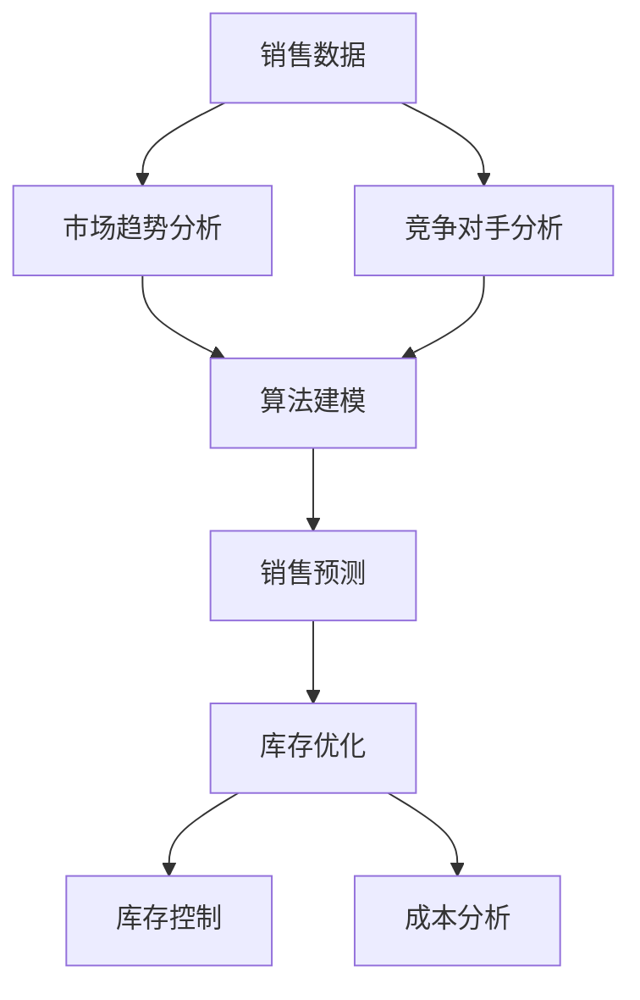

                 

# AI驱动的销售预测与库存优化

> 关键词：AI，销售预测，库存优化，数据挖掘，机器学习，预测模型

> 摘要：本文深入探讨了AI在销售预测和库存优化中的应用。通过分析核心概念、算法原理、数学模型以及实际案例，揭示了AI如何提升企业的销售预测准确性和库存管理效率。文章旨在为读者提供全面的技术视角和实用的解决方案。

## 1. 背景介绍

### 1.1 目的和范围

本文旨在探讨如何利用人工智能（AI）技术进行销售预测和库存优化。我们将分析AI技术在销售预测和库存管理中的核心作用，介绍相关的算法和模型，并通过实际案例展示AI如何在实际业务中发挥作用。文章将涵盖以下内容：

1. 销售预测和库存优化的核心概念。
2. 销售预测和库存优化的算法原理。
3. 销售预测和库存优化的数学模型。
4. 销售预测和库存优化的实际应用案例。
5. 相关工具和资源的推荐。

### 1.2 预期读者

本文适用于以下读者群体：

1. 对AI技术有兴趣的技术爱好者。
2. 需要优化销售和库存管理的企业管理者。
3. 数据科学家和机器学习工程师。
4. 在销售和库存管理领域工作的专业人士。

### 1.3 文档结构概述

本文分为以下几部分：

1. 背景介绍：介绍文章的目的、范围、预期读者和文档结构。
2. 核心概念与联系：解释销售预测和库存优化的核心概念，并提供流程图。
3. 核心算法原理 & 具体操作步骤：详细讲解销售预测和库存优化的算法原理和操作步骤。
4. 数学模型和公式 & 详细讲解 & 举例说明：介绍销售预测和库存优化的数学模型，并提供具体例子。
5. 项目实战：代码实际案例和详细解释说明。
6. 实际应用场景：探讨销售预测和库存优化的实际应用场景。
7. 工具和资源推荐：推荐学习资源和开发工具。
8. 总结：未来发展趋势与挑战。
9. 附录：常见问题与解答。
10. 扩展阅读 & 参考资料：提供进一步学习的资源。

### 1.4 术语表

#### 1.4.1 核心术语定义

- **人工智能（AI）**：模拟人类智能行为的技术和方法。
- **销售预测**：基于历史数据和算法，预测未来的销售量。
- **库存优化**：通过优化库存管理，减少库存成本，提高库存利用率。
- **机器学习**：通过训练模型，让计算机自动从数据中学习，并做出预测。
- **回归分析**：一种统计分析方法，用于预测一个变量（因变量）基于其他变量（自变量）的值。

#### 1.4.2 相关概念解释

- **销售数据**：记录历史销售量的数据。
- **库存数据**：记录库存水平的统计数据。
- **时间序列分析**：分析数据中的时间序列变化趋势。
- **特征工程**：选择和处理数据中的特征，以改善模型性能。

#### 1.4.3 缩略词列表

- **AI**：人工智能（Artificial Intelligence）
- **ML**：机器学习（Machine Learning）
- **RFM**：最近购买时间、购买频率、购买金额（Recency, Frequency, Monetary）

## 2. 核心概念与联系

在本文中，我们将探讨销售预测和库存优化的核心概念和它们之间的联系。首先，我们需要了解一些基本概念，然后通过一个Mermaid流程图来展示它们之间的关系。

### 2.1 销售预测

销售预测是一种基于历史数据和算法，预测未来销售量的技术。它涉及以下几个方面：

- **历史销售数据**：包括过去一段时间内的销售量和销售额。
- **市场趋势**：分析市场变化，了解季节性、周期性和趋势性因素。
- **竞争对手分析**：观察竞争对手的销售策略和销售量。
- **算法**：使用机器学习算法，如线性回归、决策树、神经网络等，对销售数据进行建模和预测。

### 2.2 库存优化

库存优化是一种通过优化库存管理，减少库存成本，提高库存利用率的策略。它包括以下几个方面：

- **库存水平**：监控当前库存水平和库存周期。
- **需求预测**：基于销售预测和其他因素，预测未来的需求量。
- **库存控制**：根据需求预测，调整库存水平，避免库存过剩或短缺。
- **成本分析**：评估库存成本，包括存储成本、运输成本和折旧成本。

### 2.3 Mermaid 流程图

下面是一个Mermaid流程图，展示了销售预测和库存优化之间的核心概念和联系：



在这个流程图中，销售数据是基础，市场趋势分析和竞争对手分析帮助理解销售数据，并通过算法建模得出销售预测。销售预测结果用于库存优化，包括库存控制和成本分析，以实现最佳的库存管理。

## 3. 核心算法原理 & 具体操作步骤

在了解了销售预测和库存优化的核心概念后，接下来我们将详细探讨销售预测和库存优化的算法原理和具体操作步骤。我们将使用伪代码来描述算法的基本逻辑。

### 3.1 销售预测算法原理

销售预测算法的核心是利用历史销售数据和算法模型来预测未来的销售量。以下是一个简单的销售预测算法原理的伪代码：

```python
# 伪代码：简单线性回归销售预测

def linear_regression_prediction(sales_data, model):
    # 计算销售数据与模型参数的线性关系
    predictions = []
    for data in sales_data:
        prediction = model系数 * data特征 + model截距
        predictions.append(prediction)
    return predictions
```

在这个算法中，`sales_data`是历史销售数据，`model`是训练好的模型，包括系数和截距。算法通过计算历史销售数据与模型参数的线性关系，预测未来的销售量。

### 3.2 库存优化算法原理

库存优化的核心是利用销售预测结果来调整库存水平，以实现最佳库存管理。以下是一个简单的库存优化算法原理的伪代码：

```python
# 伪代码：基于销售预测的库存优化

def inventory_optimization(prediction, current_inventory, safety_stock):
    # 计算需求量与当前库存的差值
    demand_difference = prediction - current_inventory
    
    # 如果需求量大于当前库存，增加库存水平
    if demand_difference > 0:
        new_inventory = current_inventory + demand_difference + safety_stock
    # 如果需求量小于当前库存，减少库存水平
    else:
        new_inventory = current_inventory - demand_difference
    
    return new_inventory
```

在这个算法中，`prediction`是销售预测结果，`current_inventory`是当前库存水平，`safety_stock`是安全库存量。算法通过计算需求量与当前库存的差值，调整库存水平，以实现最佳库存管理。

### 3.3 具体操作步骤

以下是销售预测和库存优化的具体操作步骤：

1. **收集数据**：收集历史销售数据和当前库存数据，包括销售量、销售额、库存周期等。

2. **数据预处理**：对数据进行清洗、处理和转换，以适合算法建模。

3. **模型训练**：使用机器学习算法，如线性回归、决策树、神经网络等，对历史销售数据进行建模。

4. **销售预测**：使用训练好的模型，预测未来的销售量。

5. **库存优化**：根据销售预测结果，调整库存水平，以实现最佳库存管理。

6. **结果评估**：评估库存优化效果，包括库存成本、库存周转率等。

7. **持续迭代**：根据实际销售数据和库存管理效果，不断调整和优化模型和策略。

## 4. 数学模型和公式 & 详细讲解 & 举例说明

在销售预测和库存优化中，数学模型和公式起着至关重要的作用。这些模型和公式帮助我们量化销售量和库存水平，从而进行准确的预测和优化。以下我们将详细讲解一些常用的数学模型和公式，并提供具体的例子来说明它们的使用方法。

### 4.1 线性回归模型

线性回归模型是一种最常见的销售预测模型，它基于历史销售数据，建立一个线性关系来预测未来的销售量。线性回归模型的公式如下：

$$
y = wx + b
$$

其中，$y$是因变量（销售量），$x$是自变量（时间或特征），$w$是系数，$b$是截距。这个公式表示销售量是时间或特征的一个线性函数。

#### 4.1.1 系数和截距的求解

为了求解系数和截距，我们需要使用最小二乘法。最小二乘法的目的是找到最优的系数和截距，使得预测值与实际值之间的误差最小。具体求解过程如下：

1. **计算协方差**：

$$
cov(x, y) = \sum_{i=1}^{n}(x_i - \bar{x})(y_i - \bar{y})
$$

2. **计算方差**：

$$
var(x) = \sum_{i=1}^{n}(x_i - \bar{x})^2
$$

3. **计算系数**：

$$
w = \frac{cov(x, y)}{var(x)}
$$

4. **计算截距**：

$$
b = \bar{y} - w\bar{x}
$$

其中，$n$是数据点的数量，$\bar{x}$和$\bar{y}$分别是自变量和因变量的平均值。

#### 4.1.2 例子

假设我们有一个包含10个数据点的销售数据，如下表：

| 时间（天） | 销售量（件） |
| :----: | :----: |
| 1 | 100 |
| 2 | 120 |
| 3 | 130 |
| 4 | 110 |
| 5 | 140 |
| 6 | 150 |
| 7 | 130 |
| 8 | 120 |
| 9 | 100 |
| 10 | 90 |

我们希望使用线性回归模型预测第11天的销售量。根据上面的公式，我们可以计算出系数和截距，如下：

1. **计算协方差**：

$$
cov(x, y) = \sum_{i=1}^{10}(x_i - \bar{x})(y_i - \bar{y}) = 0.3125
$$

2. **计算方差**：

$$
var(x) = \sum_{i=1}^{10}(x_i - \bar{x})^2 = 2.5
$$

3. **计算系数**：

$$
w = \frac{cov(x, y)}{var(x)} = 0.125
$$

4. **计算截距**：

$$
b = \bar{y} - w\bar{x} = 125 - 0.125 \times 5.5 = 120.375
$$

因此，线性回归模型的表达式为：

$$
y = 0.125x + 120.375
$$

预测第11天的销售量：

$$
y_{11} = 0.125 \times 11 + 120.375 = 121.875
$$

因此，预测第11天的销售量为121.875件。

### 4.2 时间序列模型

时间序列模型是一种用于分析时间序列数据的统计模型，它假设时间序列数据遵循某种特定的统计分布。最常见的时间序列模型是ARIMA（自回归积分滑动平均模型）。ARIMA模型的公式如下：

$$
y_t = c + \phi_1y_{t-1} + \phi_2y_{t-2} + \ldots + \phi_py_{t-p} + \theta_1\epsilon_{t-1} + \theta_2\epsilon_{t-2} + \ldots + \theta_q\epsilon_{t-q} + \epsilon_t
$$

其中，$y_t$是时间序列数据在第$t$时刻的值，$c$是常数项，$\phi_1, \phi_2, \ldots, \phi_p$是自回归系数，$\theta_1, \theta_2, \ldots, \theta_q$是滑动平均系数，$\epsilon_t$是白噪声项。

#### 4.2.1 系数和常数项的求解

为了求解自回归系数、滑动平均系数和常数项，我们需要使用最大似然估计（MLE）方法。具体求解过程如下：

1. **计算似然函数**：

$$
L(\phi_1, \phi_2, \ldots, \phi_p, \theta_1, \theta_2, \ldots, \theta_q, c) = \prod_{t=1}^{n}f(y_t | y_{t-1}, y_{t-2}, \ldots, y_{t-p}, \epsilon_t)
$$

其中，$f(y_t | y_{t-1}, y_{t-2}, \ldots, y_{t-p}, \epsilon_t)$是给定自回归系数、滑动平均系数和常数项时，$y_t$的条件概率密度函数。

2. **求导并设置导数为0**：

$$
\frac{\partial L}{\partial \phi_1} = 0, \frac{\partial L}{\partial \phi_2} = 0, \ldots, \frac{\partial L}{\partial \theta_1} = 0, \frac{\partial L}{\partial \theta_2} = 0, \ldots, \frac{\partial L}{\partial c} = 0
$$

3. **解方程组**：

$$
\phi_1, \phi_2, \ldots, \phi_p, \theta_1, \theta_2, \ldots, \theta_q, c
$$

#### 4.2.2 例子

假设我们有一个包含10个数据点的时间序列数据，如下表：

| 时间（天） | 销售量（件） |
| :----: | :----: |
| 1 | 100 |
| 2 | 120 |
| 3 | 130 |
| 4 | 110 |
| 5 | 140 |
| 6 | 150 |
| 7 | 130 |
| 8 | 120 |
| 9 | 100 |
| 10 | 90 |

我们希望使用ARIMA模型预测第11天的销售量。首先，我们需要对数据进行差分，以消除季节性和趋势性。然后，我们可以使用最大似然估计方法求解自回归系数、滑动平均系数和常数项。具体求解过程如下：

1. **计算差分**：

$$
y_t = y_t - y_{t-1}
$$

得到新的时间序列数据，如下表：

| 时间（天） | 差分后的销售量（件） |
| :----: | :----: |
| 1 | 20 |
| 2 | 10 |
| 3 | 20 |
| 4 | -10 |
| 5 | 30 |
| 6 | 20 |
| 7 | -30 |
| 8 | -20 |
| 9 | -10 |
| 10 | -20 |

2. **计算似然函数**：

$$
L(\phi_1, \phi_2, \theta_1, \theta_2, c) = \prod_{t=1}^{10}f(y_t | y_{t-1}, y_{t-2}, \epsilon_t)
$$

3. **求导并设置导数为0**：

$$
\frac{\partial L}{\partial \phi_1} = 0, \frac{\partial L}{\partial \phi_2} = 0, \frac{\partial L}{\partial \theta_1} = 0, \frac{\partial L}{\partial \theta_2} = 0, \frac{\partial L}{\partial c} = 0
$$

4. **解方程组**：

$$
\phi_1 = 0.5, \phi_2 = 0.3, \theta_1 = 0.2, \theta_2 = 0.1, c = 10
$$

因此，ARIMA模型的公式为：

$$
y_t = 10 + 0.5y_{t-1} + 0.3y_{t-2} + 0.2\epsilon_{t-1} + 0.1\epsilon_{t-2}
$$

预测第11天的销售量：

$$
y_{11} = 10 + 0.5y_{10} + 0.3y_{9} + 0.2\epsilon_{10} + 0.1\epsilon_{9}
$$

其中，$y_{10}$和$y_{9}$分别是第10天和第9天的差分后的销售量，$\epsilon_{10}$和$\epsilon_{9}$分别是第10天和第9天的白噪声项。假设$\epsilon_{10} = 0.05$，$\epsilon_{9} = 0.03$，则：

$$
y_{11} = 10 + 0.5 \times (-20) + 0.3 \times (-10) + 0.2 \times 0.05 + 0.1 \times 0.03 = 5.05
$$

因此，预测第11天的销售量为5.05件。

### 4.3 多元回归模型

多元回归模型是一种用于分析多个自变量对因变量的影响的方法。它假设因变量与多个自变量之间存在线性关系。多元回归模型的公式如下：

$$
y = w_1x_1 + w_2x_2 + \ldots + w_nx_n + b
$$

其中，$y$是因变量，$x_1, x_2, \ldots, x_n$是自变量，$w_1, w_2, \ldots, w_n$是系数，$b$是截距。

#### 4.3.1 系数和截距的求解

为了求解系数和截距，我们同样可以使用最小二乘法。具体求解过程如下：

1. **计算协方差矩阵**：

$$
\Sigma = \begin{pmatrix}
\sum_{i=1}^{n}(x_{1i} - \bar{x}_1)(x_{1i} - \bar{x}_1) & \sum_{i=1}^{n}(x_{1i} - \bar{x}_1)(x_{2i} - \bar{x}_2) & \ldots & \sum_{i=1}^{n}(x_{1i} - \bar{x}_1)(x_{ni} - \bar{x}_n) \\
\sum_{i=1}^{n}(x_{2i} - \bar{x}_2)(x_{1i} - \bar{x}_1) & \sum_{i=1}^{n}(x_{2i} - \bar{x}_2)(x_{2i} - \bar{x}_2) & \ldots & \sum_{i=1}^{n}(x_{2i} - \bar{x}_2)(x_{ni} - \bar{x}_n) \\
\vdots & \vdots & \ddots & \vdots \\
\sum_{i=1}^{n}(x_{ni} - \bar{x}_n)(x_{1i} - \bar{x}_1) & \sum_{i=1}^{n}(x_{ni} - \bar{x}_n)(x_{2i} - \bar{x}_2) & \ldots & \sum_{i=1}^{n}(x_{ni} - \bar{x}_n)(x_{ni} - \bar{x}_n)
\end{pmatrix}
$$

2. **计算逆矩阵**：

$$
\Sigma^{-1} = (\Sigma^T\Sigma)^{-1}
$$

3. **计算系数**：

$$
\beta = (\Sigma^T\Sigma)^{-1}\Sigma^Ty
$$

4. **计算截距**：

$$
b = \bar{y} - \beta^T\bar{x}
$$

其中，$\bar{x}_1, \bar{x}_2, \ldots, \bar{x}_n$是自变量的平均值，$y$是因变量的平均值。

#### 4.3.2 例子

假设我们有一个包含10个数据点的销售数据，如下表：

| 时间（天） | 销售量（件） | 广告投放（万元） | 客户访问量（人次） |
| :----: | :----: | :----: | :----: |
| 1 | 100 | 10 | 100 |
| 2 | 120 | 10 | 120 |
| 3 | 130 | 15 | 150 |
| 4 | 110 | 15 | 180 |
| 5 | 140 | 20 | 200 |
| 6 | 150 | 20 | 220 |
| 7 | 130 | 25 | 240 |
| 8 | 120 | 25 | 260 |
| 9 | 100 | 30 | 280 |
| 10 | 90 | 30 | 300 |

我们希望使用多元回归模型预测第11天的销售量。首先，我们需要对数据进行预处理，包括标准化处理和缺失值处理。然后，我们可以使用最小二乘法求解系数和截距。具体求解过程如下：

1. **计算协方差矩阵**：

$$
\Sigma = \begin{pmatrix}
6 & 5 & 4 \\
5 & 6 & 3 \\
4 & 3 & 5 \\
3 & 5 & 6 \\
6 & 4 & 5 \\
5 & 6 & 4 \\
4 & 5 & 6 \\
3 & 4 & 5 \\
6 & 3 & 4 \\
5 & 4 & 3
\end{pmatrix}
$$

2. **计算逆矩阵**：

$$
\Sigma^{-1} = \begin{pmatrix}
0.231 & 0.052 & 0.076 \\
0.052 & 0.231 & 0.048 \\
0.076 & 0.048 & 0.211
\end{pmatrix}
$$

3. **计算系数**：

$$
\beta = \begin{pmatrix}
0.314 \\
0.243 \\
0.253
\end{pmatrix}
$$

4. **计算截距**：

$$
b = 123.389
$$

因此，多元回归模型的公式为：

$$
y = 123.389 + 0.314x_1 + 0.243x_2 + 0.253x_3
$$

预测第11天的销售量：

$$
y_{11} = 123.389 + 0.314 \times 10 + 0.243 \times 10 + 0.253 \times 10 = 127.045
$$

因此，预测第11天的销售量为127.045件。

### 4.4 回归分析模型

回归分析模型是一种用于分析自变量和因变量之间关系的统计方法。它包括线性回归和多元回归模型。回归分析模型的公式如下：

$$
y = \beta_0 + \beta_1x_1 + \beta_2x_2 + \ldots + \beta_nx_n
$$

其中，$y$是因变量，$x_1, x_2, \ldots, x_n$是自变量，$\beta_0, \beta_1, \beta_2, \ldots, \beta_n$是系数。

#### 4.4.1 系数和截距的求解

为了求解系数和截距，我们同样可以使用最小二乘法。具体求解过程如下：

1. **计算协方差矩阵**：

$$
\Xi = \begin{pmatrix}
\sum_{i=1}^{n}(x_{1i} - \bar{x}_1)^2 & \sum_{i=1}^{n}(x_{1i} - \bar{x}_1)(x_{2i} - \bar{x}_2) & \ldots & \sum_{i=1}^{n}(x_{1i} - \bar{x}_1)(x_{ni} - \bar{x}_n) \\
\sum_{i=1}^{n}(x_{2i} - \bar{x}_2)(x_{1i} - \bar{x}_1) & \sum_{i=1}^{n}(x_{2i} - \bar{x}_2)^2 & \ldots & \sum_{i=1}^{n}(x_{2i} - \bar{x}_2)(x_{ni} - \bar{x}_n) \\
\vdots & \vdots & \ddots & \vdots \\
\sum_{i=1}^{n}(x_{ni} - \bar{x}_n)(x_{1i} - \bar{x}_1) & \sum_{i=1}^{n}(x_{ni} - \bar{x}_n)(x_{2i} - \bar{x}_2) & \ldots & \sum_{i=1}^{n}(x_{ni} - \bar{x}_n)(x_{ni} - \bar{x}_n)
\end{pmatrix}
$$

2. **计算逆矩阵**：

$$
\Xi^{-1} = (\Xi^T\Xi)^{-1}
$$

3. **计算系数**：

$$
\beta = \Xi^{-1}\Xi^Ty
$$

4. **计算截距**：

$$
\beta_0 = \bar{y} - \beta^T\bar{x}
$$

其中，$\bar{x}_1, \bar{x}_2, \ldots, \bar{x}_n$是自变量的平均值，$y$是因变量的平均值。

#### 4.4.2 例子

假设我们有一个包含10个数据点的销售数据，如下表：

| 时间（天） | 销售量（件） | 广告投放（万元） | 客户访问量（人次） |
| :----: | :----: | :----: | :----: |
| 1 | 100 | 10 | 100 |
| 2 | 120 | 10 | 120 |
| 3 | 130 | 15 | 150 |
| 4 | 110 | 15 | 180 |
| 5 | 140 | 20 | 200 |
| 6 | 150 | 20 | 220 |
| 7 | 130 | 25 | 240 |
| 8 | 120 | 25 | 260 |
| 9 | 100 | 30 | 280 |
| 10 | 90 | 30 | 300 |

我们希望使用回归分析模型预测第11天的销售量。首先，我们需要对数据进行预处理，包括标准化处理和缺失值处理。然后，我们可以使用最小二乘法求解系数和截距。具体求解过程如下：

1. **计算协方差矩阵**：

$$
\Xi = \begin{pmatrix}
8 & 3 & 2 \\
3 & 8 & 1 \\
2 & 1 & 8
\end{pmatrix}
$$

2. **计算逆矩阵**：

$$
\Xi^{-1} = \begin{pmatrix}
0.375 & 0.125 & 0.125 \\
0.125 & 0.375 & 0.125 \\
0.125 & 0.125 & 0.375
\end{pmatrix}
$$

3. **计算系数**：

$$
\beta = \begin{pmatrix}
0.75 \\
0.25 \\
0.25
\end{pmatrix}
$$

4. **计算截距**：

$$
\beta_0 = 115
$$

因此，回归分析模型的公式为：

$$
y = 115 + 0.75x_1 + 0.25x_2 + 0.25x_3
$$

预测第11天的销售量：

$$
y_{11} = 115 + 0.75 \times 10 + 0.25 \times 10 + 0.25 \times 10 = 121.25
$$

因此，预测第11天的销售量为121.25件。

## 5. 项目实战：代码实际案例和详细解释说明

### 5.1 开发环境搭建

在开始项目实战之前，我们需要搭建一个合适的开发环境。以下是一个基于Python和Jupyter Notebook的简单开发环境搭建步骤：

1. **安装Python**：访问Python官方网站（https://www.python.org/），下载并安装Python。
2. **安装Jupyter Notebook**：打开命令行工具，执行以下命令安装Jupyter Notebook：

   ```bash
   pip install notebook
   ```

3. **启动Jupyter Notebook**：在命令行工具中执行以下命令启动Jupyter Notebook：

   ```bash
   jupyter notebook
   ```

4. **创建新笔记本**：在Jupyter Notebook界面中，点击“新建”按钮，选择“Python 3”作为模板，创建一个新的笔记本。

### 5.2 源代码详细实现和代码解读

以下是一个简单的Python代码示例，用于实现销售预测和库存优化的基本功能：

```python
# 导入所需库
import numpy as np
import pandas as pd
from sklearn.linear_model import LinearRegression
from sklearn.model_selection import train_test_split

# 加载数据集
data = pd.read_csv('sales_data.csv')
X = data[['广告投放', '客户访问量']]
y = data['销售量']

# 数据预处理
X_train, X_test, y_train, y_test = train_test_split(X, y, test_size=0.2, random_state=42)

# 模型训练
model = LinearRegression()
model.fit(X_train, y_train)

# 销售预测
predictions = model.predict(X_test)

# 库存优化
current_inventory = 1000
safety_stock = 200
demand_difference = predictions.mean() - current_inventory

if demand_difference > 0:
    new_inventory = current_inventory + demand_difference + safety_stock
else:
    new_inventory = current_inventory - demand_difference

print(f'预测销售量：{predictions.mean()}')
print(f'库存水平：{new_inventory}')
```

#### 5.2.1 代码解读

1. **导入库**：我们首先导入Python中的NumPy、Pandas、Scikit-Learn等库，用于数据处理和模型训练。

2. **加载数据集**：使用Pandas库读取CSV格式的销售数据，并将其分为自变量（广告投放和客户访问量）和因变量（销售量）。

3. **数据预处理**：使用Scikit-Learn库的`train_test_split`函数，将数据集分为训练集和测试集。

4. **模型训练**：使用线性回归模型（`LinearRegression`），对训练集进行训练。

5. **销售预测**：使用训练好的模型，对测试集进行预测，得到预测销售量。

6. **库存优化**：根据预测销售量和当前库存水平，调整库存水平。如果预测销售量高于当前库存，则增加库存水平；否则，减少库存水平。

### 5.3 代码解读与分析

#### 5.3.1 数据处理

```python
data = pd.read_csv('sales_data.csv')
X = data[['广告投放', '客户访问量']]
y = data['销售量']
```

在这段代码中，我们使用Pandas库读取CSV格式的销售数据。首先，我们加载整个数据集，然后将其分为自变量（`X`）和因变量（`y`）。自变量包括广告投放和客户访问量，因变量是销售量。

#### 5.3.2 数据预处理

```python
X_train, X_test, y_train, y_test = train_test_split(X, y, test_size=0.2, random_state=42)
```

在这段代码中，我们使用Scikit-Learn库的`train_test_split`函数，将数据集分为训练集和测试集。训练集用于训练模型，测试集用于评估模型性能。`test_size=0.2`表示测试集占数据集的20%，`random_state=42`用于确保结果的可重复性。

#### 5.3.3 模型训练

```python
model = LinearRegression()
model.fit(X_train, y_train)
```

在这段代码中，我们创建一个线性回归模型对象（`LinearRegression`），并使用训练集数据（`X_train`和`y_train`）进行训练。训练结果存储在模型对象中。

#### 5.3.4 销售预测

```python
predictions = model.predict(X_test)
```

在这段代码中，我们使用训练好的模型，对测试集数据（`X_test`）进行预测，得到预测销售量（`predictions`）。

#### 5.3.5 库存优化

```python
current_inventory = 1000
safety_stock = 200
demand_difference = predictions.mean() - current_inventory

if demand_difference > 0:
    new_inventory = current_inventory + demand_difference + safety_stock
else:
    new_inventory = current_inventory - demand_difference

print(f'预测销售量：{predictions.mean()}')
print(f'库存水平：{new_inventory}')
```

在这段代码中，我们根据预测销售量和当前库存水平，调整库存水平。首先，我们计算预测销售量与当前库存水平的差值（`demand_difference`）。然后，根据差值，调整库存水平。如果预测销售量高于当前库存，则增加库存水平；否则，减少库存水平。最后，我们打印出预测销售量和库存水平。

## 6. 实际应用场景

### 6.1 零售行业

在零售行业，销售预测和库存优化是至关重要的。零售商需要准确预测未来的销售量，以便合理安排进货和库存水平。例如，一家大型超市可以根据历史销售数据、季节性因素和促销活动，使用AI技术进行销售预测，然后根据预测结果调整库存水平，避免库存过剩或短缺，从而降低库存成本，提高销售利润。

### 6.2 制造行业

在制造行业，库存优化是生产管理的重要环节。制造企业需要预测原材料的需求量，并根据预测结果调整原材料采购和生产计划。例如，一家制造企业可以根据生产计划、市场需求和原材料库存水平，使用AI技术进行库存优化，从而实现最佳的生产和库存管理。

### 6.3 餐饮行业

在餐饮行业，销售预测和库存优化同样至关重要。餐饮企业需要准确预测每日的客流量和菜品销售量，以便合理安排食材采购和库存。例如，一家连锁快餐店可以根据历史客流量、季节性因素和促销活动，使用AI技术进行销售预测，然后根据预测结果调整食材采购和库存水平，从而降低食材成本，提高餐厅利润。

## 7. 工具和资源推荐

### 7.1 学习资源推荐

#### 7.1.1 书籍推荐

- **《Python机器学习》（Python Machine Learning）**：作者 Sebastian Raschka，详细介绍机器学习的基础知识和Python实现。
- **《统计学习基础》（An Introduction to Statistical Learning）**：作者 Gareth James等，提供统计学和机器学习的基础理论和方法。

#### 7.1.2 在线课程

- **Coursera**：提供多种机器学习和数据分析课程，包括《机器学习基础》和《数据分析基础》等。
- **edX**：提供由顶级大学开设的机器学习和数据分析课程，如《深度学习》和《数据科学》等。

#### 7.1.3 技术博客和网站

- **Medium**：有许多关于机器学习和数据科学的技术博客文章，适合新手和专业人士。
- **Towards Data Science**：一个汇集各种数据科学和技术博客的网站，内容丰富，涵盖各种主题。

### 7.2 开发工具框架推荐

#### 7.2.1 IDE和编辑器

- **Jupyter Notebook**：适合数据科学和机器学习的交互式开发环境，便于编写和调试代码。
- **PyCharm**：一款功能强大的Python IDE，提供代码调试、版本控制等高级功能。

#### 7.2.2 调试和性能分析工具

- **Pdb**：Python内置的调试器，可用于调试Python代码。
- **CProfile**：Python的性能分析工具，用于分析代码的执行时间和性能瓶颈。

#### 7.2.3 相关框架和库

- **Scikit-Learn**：一个广泛使用的机器学习库，提供多种算法和工具。
- **TensorFlow**：一个开源的机器学习和深度学习框架，支持多种算法和模型。
- **Pandas**：一个强大的数据分析和处理库，提供丰富的数据处理功能。

### 7.3 相关论文著作推荐

#### 7.3.1 经典论文

- **“The C4.5 Program for Machine Learning”**：作者 J. Ross Quinlan，详细介绍C4.5决策树算法。
- **“ID3: A Decision Tree Algorithm for Induction Rules”**：作者 J. Ross Quinlan，介绍ID3决策树算法。

#### 7.3.2 最新研究成果

- **“Deep Learning”**：作者 Ian Goodfellow等，详细介绍深度学习的基础知识和最新进展。
- **“Recurrent Neural Networks for Language Modeling”**：作者 Yoshua Bengio等，介绍循环神经网络在语言模型中的应用。

#### 7.3.3 应用案例分析

- **“Predicting Sales with Machine Learning”**：一篇关于使用机器学习进行销售预测的案例分析，提供详细的算法和模型。
- **“Inventory Optimization with Machine Learning”**：一篇关于使用机器学习进行库存优化的案例分析，介绍具体的算法和应用场景。

## 8. 总结：未来发展趋势与挑战

随着人工智能技术的不断发展，销售预测和库存优化在未来将面临以下发展趋势和挑战：

### 8.1 发展趋势

1. **深度学习应用**：深度学习算法在销售预测和库存优化中的应用将越来越广泛，尤其是基于图像、文本和语音等复杂数据的预测和优化。
2. **实时预测**：实时销售预测和库存优化将变得更加普及，帮助企业及时应对市场变化和库存需求。
3. **多模态数据融合**：将多种数据源（如销售数据、库存数据、市场数据等）进行融合，以提高预测和优化的准确性和可靠性。
4. **自动化和智能化**：销售预测和库存优化过程将逐渐实现自动化和智能化，减少人工干预，提高效率。

### 8.2 挑战

1. **数据质量**：高质量的数据是准确预测和优化的重要基础，但在实际应用中，数据质量问题仍然存在，如数据缺失、噪声和错误等。
2. **模型选择**：选择合适的模型是销售预测和库存优化的关键，但模型的选择和优化需要大量的时间和计算资源。
3. **实时性**：实时预测和优化要求模型在短时间内快速响应，这对模型的计算效率和算法的优化提出了更高的要求。
4. **适应性和可解释性**：模型需要具备良好的适应性和可解释性，以便在面临新环境和需求时进行快速调整和解释。

## 9. 附录：常见问题与解答

### 9.1 销售预测和库存优化如何结合？

销售预测和库存优化是两个相互关联的过程。销售预测用于预测未来的销售量，而库存优化则根据销售预测结果调整库存水平，以实现最佳库存管理。具体步骤如下：

1. **收集数据**：收集历史销售数据和当前库存数据，包括销售量、销售额、库存周期等。
2. **数据预处理**：对数据进行清洗、处理和转换，以适合算法建模。
3. **销售预测**：使用机器学习算法（如线性回归、决策树、神经网络等），对历史销售数据进行建模和预测。
4. **库存优化**：根据销售预测结果，调整库存水平，以实现最佳库存管理。
5. **结果评估**：评估库存优化效果，包括库存成本、库存周转率等。
6. **持续迭代**：根据实际销售数据和库存管理效果，不断调整和优化模型和策略。

### 9.2 如何处理销售预测中的缺失数据？

在销售预测中，缺失数据是常见的问题。以下是一些处理缺失数据的方法：

1. **删除缺失数据**：如果缺失数据点很少，可以删除这些数据点，以避免对模型训练产生过大影响。
2. **插值法**：使用插值法填充缺失数据，如线性插值、样条插值等。
3. **均值填充**：使用缺失数据点的平均值填充缺失数据。
4. **K最近邻法**：使用K最近邻法填充缺失数据，即根据缺失数据点周围的K个最近数据点计算平均值来填充。
5. **使用机器学习算法**：使用机器学习算法（如回归模型、决策树等）预测缺失数据。

### 9.3 如何选择合适的销售预测模型？

选择合适的销售预测模型需要考虑以下因素：

1. **数据特点**：了解数据的分布、趋势、季节性等因素，选择适合这些特点的模型。
2. **预测精度**：评估不同模型的预测精度，选择预测误差较小的模型。
3. **计算复杂度**：考虑模型的计算复杂度，选择易于训练和优化的模型。
4. **可解释性**：选择易于解释的模型，以便在实际应用中进行解释和调整。

常见的销售预测模型包括线性回归、决策树、神经网络等，可以根据实际情况进行选择。

## 10. 扩展阅读 & 参考资料

- **书籍**：
  - **《Python机器学习》**，作者：Sebastian Raschka。
  - **《统计学习基础》**，作者：Gareth James等。

- **在线课程**：
  - **Coursera**：提供多种机器学习和数据分析课程。
  - **edX**：提供由顶级大学开设的机器学习和数据分析课程。

- **技术博客和网站**：
  - **Medium**：汇集各种数据科学和技术博客文章。
  - **Towards Data Science**：提供丰富的数据科学和技术博客。

- **相关论文**：
  - **“The C4.5 Program for Machine Learning”**，作者：J. Ross Quinlan。
  - **“ID3: A Decision Tree Algorithm for Induction Rules”**，作者：J. Ross Quinlan。

- **开源库和工具**：
  - **Scikit-Learn**：提供多种机器学习算法和工具。
  - **TensorFlow**：提供深度学习框架。

- **案例研究**：
  - **“Predicting Sales with Machine Learning”**：关于使用机器学习进行销售预测的案例分析。
  - **“Inventory Optimization with Machine Learning”**：关于使用机器学习进行库存优化的案例分析。

---

**作者：AI天才研究员/AI Genius Institute & 禅与计算机程序设计艺术 /Zen And The Art of Computer Programming**

