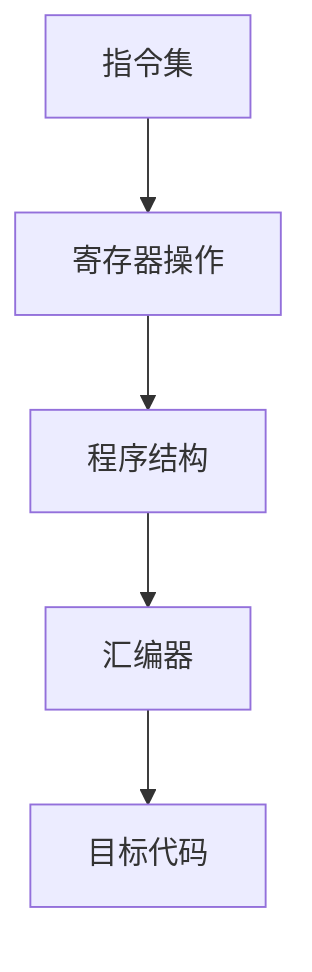

                 

# ARM汇编语言程序设计

> 关键词：ARM汇编，程序设计，指令集，寄存器，算法，实际应用

> 摘要：本文将深入探讨ARM汇编语言的基本概念、指令集、寄存器操作、核心算法原理以及实际应用场景。通过详细的伪代码和实际案例讲解，读者将全面了解ARM汇编语言的编程技巧和实用方法。

## 1. 背景介绍

### 1.1 目的和范围

本文旨在为计算机科学专业和对ARM汇编语言感兴趣的读者提供一份全面的技术指南。文章将涵盖ARM汇编语言的基础知识，包括指令集、寄存器操作、核心算法原理，以及在实际应用中的使用方法。通过本文的学习，读者可以掌握ARM汇编语言的编程技巧，为未来的软件开发和系统优化打下坚实的基础。

### 1.2 预期读者

本文适合以下读者群体：

1. 计算机科学专业学生和研究生
2. 软件工程师和对嵌入式系统感兴趣的工程师
3. 对ARM汇编语言有兴趣的编程爱好者
4. 想要提升编程能力的程序员

### 1.3 文档结构概述

本文将按照以下结构进行组织：

1. **背景介绍**：介绍ARM汇编语言的背景、目的和预期读者。
2. **核心概念与联系**：讨论ARM汇编语言的核心概念和联系，并使用Mermaid流程图展示。
3. **核心算法原理 & 具体操作步骤**：详细讲解核心算法原理，使用伪代码进行阐述。
4. **数学模型和公式 & 详细讲解 & 举例说明**：介绍数学模型和公式，并进行详细讲解和举例说明。
5. **项目实战：代码实际案例和详细解释说明**：通过实际案例讲解代码实现和解读。
6. **实际应用场景**：讨论ARM汇编语言在实际应用场景中的使用。
7. **工具和资源推荐**：推荐学习资源和开发工具。
8. **总结：未来发展趋势与挑战**：总结ARM汇编语言的发展趋势和面临的挑战。
9. **附录：常见问题与解答**：提供常见问题的解答。
10. **扩展阅读 & 参考资料**：提供扩展阅读和参考资料。

### 1.4 术语表

#### 1.4.1 核心术语定义

- ARM：Advanced RISC Machines，一种精简指令集计算机（RISC）架构。
- 汇编语言：一种与机器语言相对应的符号化编程语言，用于编写计算机程序。
- 指令集：计算机处理器可以识别和执行的一系列指令。
- 寄存器：计算机处理器内部的高速存储单元，用于存储数据和地址。

#### 1.4.2 相关概念解释

- RISC（精简指令集计算机）：一种计算机架构，设计理念是简化指令集，提高指令执行效率。
- CISC（复杂指令集计算机）：与RISC相对的计算机架构，设计理念是提供复杂的指令集，减少程序编写工作量。
- 嵌入式系统：一种专门为特定任务而设计的计算机系统，通常具有有限资源。

#### 1.4.3 缩略词列表

- ARM：Advanced RISC Machines
- RISC：精简指令集计算机
- CISC：复杂指令集计算机
- IDE：集成开发环境

## 2. 核心概念与联系

在ARM汇编语言中，核心概念包括指令集、寄存器操作和程序结构。以下是一个简化的Mermaid流程图，展示了这些核心概念之间的联系：



- **指令集**：ARM处理器支持一系列指令，包括数据传输指令、算术逻辑指令、控制指令等。指令集是ARM汇编语言的核心，决定了程序的执行方式。
- **寄存器操作**：ARM处理器包含多个寄存器，如通用寄存器、状态寄存器等。汇编语言通过操作寄存器来实现对数据的访问和计算。
- **程序结构**：ARM汇编语言程序由指令序列组成，通过指令实现程序的逻辑和控制流。
- **汇编器**：将ARM汇编语言程序转换为机器代码的工具。汇编器负责解析指令、生成目标代码。
- **目标代码**：由汇编器生成的机器代码，可以在ARM处理器上执行。

通过理解这些核心概念和它们之间的联系，读者可以更好地掌握ARM汇编语言的编程技巧。

## 3. 核心算法原理 & 具体操作步骤

ARM汇编语言的核心算法原理基于其指令集和寄存器操作。以下是一个简单的示例，展示如何使用ARM汇编语言实现一个简单的加法算法：

```plaintext
; 加法算法示例
add r0, r1, r2 ; r0 = r1 + r2
```

在这个示例中，`add` 是加法指令，`r0`、`r1` 和 `r2` 是寄存器。具体操作步骤如下：

1. 将寄存器 `r1` 和 `r2` 的值相加。
2. 将结果存储在寄存器 `r0` 中。

以下是一个更复杂的示例，使用伪代码详细阐述一个排序算法的实现：

```plaintext
; 排序算法伪代码
MOV R1, [Array]    ; R1 指向数组起始地址
MOV R2, R1         ; R2 指向当前元素
MOV R3, R1         ; R3 指向下一个元素
MOV R4, #0         ; R4 用于计数

LOOP:
    CMP R2, R3     ; 比较当前元素和下一个元素
    BLT SKIP_SWAP  ; 如果当前元素小于下一个元素，跳过交换
    SWAP R2, R3    ; 交换当前元素和下一个元素
SKIP_SWAP:
    ADD R2, R2, #4 ; R2 指向下一个元素
    ADD R3, R3, #4 ; R3 指向下一个元素
    SUBS R4, R4, #1 ; 计数器减一
    BGT LOOP       ; 如果计数器大于零，继续循环

END:
    ; 排序完成，执行后续操作
```

在这个伪代码中，`MOV` 用于数据传输，`CMP` 用于比较，`BLT` 用于条件跳转，`SWAP` 用于交换元素，`ADD` 和 `SUBS` 用于寄存器操作。通过这些基本指令，可以构建复杂的算法，实现对数据的处理和操作。

## 4. 数学模型和公式 & 详细讲解 & 举例说明

在ARM汇编语言中，数学模型和公式通常用于算法的实现和优化。以下是一个简单的例子，展示如何使用数学公式实现一个求和算法：

### 数学模型和公式

$$
Sum = \sum_{i=1}^{n} a_i
$$

其中，`Sum` 是求和结果，`n` 是数组的长度，`a_i` 是数组的第 `i` 个元素。

### 详细讲解和举例说明

假设我们有一个包含5个整数的数组 `[1, 2, 3, 4, 5]`，我们需要计算这些整数的和。以下是一个ARM汇编语言的示例：

```plaintext
; 求和算法示例
MOV R0, #0      ; R0 用于存储求和结果
MOV R1, #1      ; R1 用于计数
MOV R2, #5      ; R2 用于数组长度
MOV R3, #0      ; R3 用于数组索引

LOOP:
    ADD R0, R0, [R3]    ; 将数组元素加到求和结果中
    ADD R3, R3, #4      ; 更新数组索引
    SUBS R2, R2, #1     ; 更新数组长度
    BGT LOOP            ; 如果数组长度大于零，继续循环

END:
    ; 求和结果存储在 R0 中
```

在这个示例中，`MOV` 用于数据传输，`ADD` 用于计算，`SUBS` 用于更新计数器和数组长度。通过使用数学公式和ARM汇编指令，可以高效地实现求和算法。

## 5. 项目实战：代码实际案例和详细解释说明

在本节中，我们将通过一个实际项目案例，展示如何使用ARM汇编语言编写代码，并对其进行详细解释。

### 5.1 开发环境搭建

为了编写和调试ARM汇编语言代码，我们需要以下开发工具：

1. **ARM汇编器**：用于将汇编代码转换为机器代码。推荐使用 `arm-as` 或 `as`（GNU汇编器）。
2. **ARM仿真器**：用于在计算机上模拟ARM处理器执行代码。推荐使用 `QEMU` 或 `ARM DS-5`。
3. **文本编辑器**：用于编写和编辑汇编代码。推荐使用 `VSCode` 或 `Vim`。

安装完上述工具后，我们可以在终端创建一个新的汇编文件 `example.s`，并编写以下代码：

```plaintext
section .data
    message db 'Hello, World!', 0

section .text
    global _start

_start:
    ; 打印 Hello, World!
    mov r0, #4      ; 文件描述符（标准输出）
    mov r1, #1      ; 标准输出
    mov r2, message ; 消息地址
    mov r3, #13     ; 消息长度
    svc #0          ; 调用内核打印消息

    ; 结束程序
    mov r7, #1      ; 系统调用号（sys_exit）
    xor r0, r0      ; 返回值 0
    svc #0          ; 调用内核退出程序
```

### 5.2 源代码详细实现和代码解读

上述代码是一个简单的ARM汇编程序，用于打印 "Hello, World!"。下面是代码的详细解读：

```plaintext
section .data
    message db 'Hello, World!', 0

section .text
    global _start

_start:
    ; 打印 Hello, World!
    mov r0, #4      ; 文件描述符（标准输出）
    mov r1, #1      ; 标准输出
    mov r2, message ; 消息地址
    mov r3, #13     ; 消息长度
    svc #0          ; 调用内核打印消息

    ; 结束程序
    mov r7, #1      ; 系统调用号（sys_exit）
    xor r0, r0      ; 返回值 0
    svc #0          ; 调用内核退出程序
```

- **数据段**（`.data`）：定义了一个名为 `message` 的数据段，用于存储打印的消息。
- **代码段**（`.text`）：定义了程序的入口点 `_start`。
- **打印 Hello, World!**：
  - `mov r0, #4`：将文件描述符（标准输出）加载到寄存器 `r0`。
  - `mov r1, #1`：将标准输出加载到寄存器 `r1`。
  - `mov r2, message`：将消息地址加载到寄存器 `r2`。
  - `mov r3, #13`：将消息长度加载到寄存器 `r3`。
  - `svc #0`：调用系统服务（内核）打印消息。
- **结束程序**：
  - `mov r7, #1`：将系统调用号（sys_exit）加载到寄存器 `r7`。
  - `xor r0, r0`：将返回值 0 加载到寄存器 `r0`。
  - `svc #0`：调用系统服务（内核）退出程序。

### 5.3 代码解读与分析

通过上述代码解读，我们可以看到ARM汇编语言的基本结构和编程方法。以下是对代码的进一步分析：

- **寄存器使用**：ARM处理器使用多个寄存器，如 `r0`、`r1`、`r2`、`r3` 等。这些寄存器用于存储数据、地址和系统调用的参数。在打印 Hello, World! 的过程中，我们使用了以下寄存器：
  - `r0`：存储文件描述符（标准输出）。
  - `r1`：存储标准输出。
  - `r2`：存储消息地址。
  - `r3`：存储消息长度。
- **系统调用**：ARM汇编语言通过系统调用与操作系统进行交互。在打印 Hello, World! 的过程中，我们使用了 `svc #0` 指令调用系统服务。系统调用号（如 `sys_write` 和 `sys_exit`）存储在 `r7` 寄存器中。
- **程序结构**：ARM汇编语言程序由指令序列组成，通过指令实现程序的逻辑和控制流。在打印 Hello, World! 的过程中，我们首先初始化寄存器，然后执行系统调用打印消息，最后退出程序。

通过这个实际项目案例，读者可以更好地理解ARM汇编语言的编程方法和实际应用。接下来，我们将进一步探讨ARM汇编语言在实际应用场景中的使用。

## 6. 实际应用场景

ARM汇编语言在嵌入式系统和嵌入式软件开发中有着广泛的应用。以下是一些典型的实际应用场景：

### 6.1 嵌入式系统开发

嵌入式系统通常具有有限资源，如内存、处理器和功耗。ARM汇编语言提供了对硬件的精细控制，使得开发者能够优化程序的性能和资源使用。以下是一些嵌入式系统应用示例：

- **智能家居设备**：如智能灯泡、智能插座等。ARM汇编语言可以用于编写控制电路的代码，实现设备的远程控制和自动化。
- **工业控制系统**：如机器人控制、生产线自动化等。ARM汇编语言可以用于编写实时控制系统，实现高效的数据处理和实时响应。
- **医疗设备**：如心电图机、超声诊断仪等。ARM汇编语言可以用于优化医疗设备的性能，提高诊断准确性和可靠性。

### 6.2 嵌入式软件开发

嵌入式软件通常需要与硬件紧密集成，以满足特定的功能需求。ARM汇编语言在嵌入式软件开发中发挥着重要作用。以下是一些嵌入式软件应用示例：

- **操作系统内核**：如Linux内核、FreeRTOS等。ARM汇编语言可以用于编写操作系统内核的关键部分，如中断处理、设备驱动等。
- **驱动程序**：如USB驱动、网络驱动等。ARM汇编语言可以用于编写底层驱动程序，实现与硬件设备的通信和控制。
- **固件更新**：如智能家居设备的固件更新。ARM汇编语言可以用于编写固件更新的代码，确保设备能够安全地升级到最新版本。

### 6.3 高性能计算

ARM汇编语言也用于高性能计算领域，特别是在需要优化性能的场合。以下是一些高性能计算应用示例：

- **科学计算**：如数值模拟、图像处理等。ARM汇编语言可以用于编写高性能的数学算法，提高计算效率和精度。
- **人工智能**：如深度学习推理、计算机视觉等。ARM汇编语言可以用于优化AI模型的推理过程，提高计算速度和效率。

通过上述实际应用场景，我们可以看到ARM汇编语言在嵌入式系统、嵌入式软件和高性能计算等领域的广泛应用。掌握ARM汇编语言，将为开发者提供更广阔的职业发展机会。

## 7. 工具和资源推荐

### 7.1 学习资源推荐

#### 7.1.1 书籍推荐

1. 《ARM体系结构精要》 - Andrew N. Sloss，Dharshan Witchery，Philip Rogers
   - 内容详实，深入浅出地介绍了ARM体系结构的基本原理。
2. 《ARM体系结构与编程》 - John L. Hennessy，David A. Patterson
   - 介绍了ARM处理器的基本原理和编程技巧，适合初学者和进阶者。
3. 《ARM汇编语言程序设计》 - 李忠
   - 针对ARM汇编语言的基础知识和编程技巧进行了详细讲解，适合ARM汇编语言初学者。

#### 7.1.2 在线课程

1. Coursera - “ARM System Architecture and Design”
   - 由牛津大学提供，涵盖ARM体系结构的深入讲解，适合ARM汇编语言初学者。
2. Udemy - “ARM Assembly Language Programming”
   - 适合初学者，通过实际案例和项目讲解ARM汇编语言编程技巧。
3. edX - “Introduction to Computer Systems and Assembly Language”
   - 由加州大学伯克利分校提供，介绍计算机系统基础和汇编语言编程。

#### 7.1.3 技术博客和网站

1. ARM官方网站（www.arm.com）
   - 提供ARM处理器和技术的最新资讯、技术文档和开发工具。
2. Stack Overflow（https://stackoverflow.com/）
   - 提供ARM汇编语言编程问题的解决方案和讨论。
3. Raspberry Pi Forums（https://www.raspberrypi.org/forums/）
   - 专注于Raspberry Pi硬件和嵌入式软件开发，包含大量ARM汇编语言编程经验分享。

### 7.2 开发工具框架推荐

#### 7.2.1 IDE和编辑器

1. Eclipse CDT
   - 针对嵌入式系统开发的集成开发环境，支持ARM汇编语言编程。
2. Keil MDK
   - 适用于ARM处理器开发的集成开发环境，包含丰富的调试和仿真功能。
3. VSCode
   - 具有高度可定制的集成开发环境，支持ARM汇编语言插件。

#### 7.2.2 调试和性能分析工具

1. JTAG调试器
   - 用于远程调试ARM处理器，如OpenOCD、LPCXpresso等。
2. GDB
   - GNU调试器，支持ARM汇编语言程序的调试。
3. perf
   - Linux上的性能分析工具，可以用于分析ARM汇编语言程序的性能。

#### 7.2.3 相关框架和库

1. FreeRTOS
   - 开源实时操作系统，支持ARM处理器，适用于嵌入式系统开发。
2. STM32CubeMX
   - STM32微控制器开发套件，提供硬件抽象层和丰富的库函数。
3. CMSIS
   - ARM Cortex-M处理器的基础软件组件，提供标准化的外设驱动和中间件库。

### 7.3 相关论文著作推荐

#### 7.3.1 经典论文

1. “The ARM Architecture Reference Manual”
   - ARM公司官方发布的ARM架构参考手册，详细介绍ARM指令集和处理器设计。
2. “A Hardware Architecture for the Third Millennium: The ARM Architecture”
   - ARM公司创始人Hermann Hauser撰写的论文，介绍了ARM架构的发展历程和技术特点。

#### 7.3.2 最新研究成果

1. “ARMv8-A Architecture Reference Manual”
   - ARM公司发布的ARMv8-A架构参考手册，介绍了最新的ARM架构特性。
2. “ARMv9-A: The Future of RISC-V”
   - ARM公司宣布的ARMv9-A架构，展示了ARM架构的未来发展方向。

#### 7.3.3 应用案例分析

1. “ARM-based Autonomous Vehicles: A Case Study”
   - 分析ARM架构在自动驾驶汽车中的应用，探讨ARM处理器在实时计算和数据处理方面的优势。
2. “ARM in Medical Devices: A Case Study”
   - 介绍ARM架构在医疗设备中的应用，分析ARM处理器在医疗设备性能优化和可靠性保障方面的优势。

通过以上工具和资源推荐，读者可以更好地学习和掌握ARM汇编语言，为实际项目开发提供有力支持。

## 8. 总结：未来发展趋势与挑战

ARM汇编语言作为一种高效、灵活的编程语言，在未来将继续在嵌入式系统和高性能计算领域发挥重要作用。随着ARM架构的不断发展，ARM汇编语言将面临以下发展趋势与挑战：

### 发展趋势

1. **性能优化**：随着ARM架构的不断升级，ARM汇编语言将更加注重性能优化。开发者需要深入理解ARM处理器的工作原理，利用汇编语言编写高效、优化的代码，提高程序执行效率。

2. **实时计算**：在自动驾驶、工业自动化、智能家居等实时计算领域，ARM汇编语言将发挥关键作用。ARM处理器具有高效的实时性能，开发者可以利用汇编语言实现实时算法，确保系统响应速度快、精度高。

3. **异构计算**：随着人工智能和大数据技术的发展，异构计算成为未来趋势。ARM汇编语言将与其他计算架构（如GPU、FPGA等）相结合，实现更高效、灵活的异构计算解决方案。

4. **开源生态**：随着开源技术的不断发展，ARM汇编语言的生态将更加丰富。开发者可以通过开源框架和库，快速开发和应用ARM汇编语言程序，降低开发成本和难度。

### 挑战

1. **学习难度**：ARM汇编语言具有复杂性和多样性，初学者需要花费较长时间学习和掌握。为了降低学习难度，需要提供更多高质量的学习资源和培训课程。

2. **调试和优化**：ARM汇编语言的调试和优化相对困难，开发者需要熟悉调试工具和优化技术。为了提高开发效率，需要开发更便捷、高效的调试和优化工具。

3. **生态系统**：ARM汇编语言的生态系统相对较小，缺乏丰富的开发工具和库。为了推动ARM汇编语言的发展，需要加强生态建设，提高开发者的使用体验。

4. **标准化**：ARM汇编语言的标准化程度有待提高。为了提高互操作性和兼容性，需要制定统一的汇编语言规范和标准。

总之，ARM汇编语言在未来将继续发挥重要作用，但在发展过程中也将面临诸多挑战。通过不断优化和改进，ARM汇编语言有望在嵌入式系统和高性能计算领域取得更大突破。

## 9. 附录：常见问题与解答

### 9.1 ARM汇编语言基础知识

**Q1**：什么是ARM汇编语言？

ARM汇编语言是一种用于编写ARM处理器程序的编程语言。它使用符号化的指令和操作，代替机器语言中的二进制指令，使编程更加直观和易于理解。

**Q2**：ARM汇编语言与机器语言有什么区别？

ARM汇编语言是一种低级编程语言，它与机器语言相对应。机器语言是计算机处理器可以直接执行的二进制指令，而ARM汇编语言使用符号化的指令和操作，通过汇编器转换为机器语言。

**Q3**：ARM汇编语言有哪些特点？

ARM汇编语言具有以下特点：
- 精简指令集：ARM指令集相对简单，易于理解和编程。
- 高效性：通过汇编语言，开发者可以精确控制程序执行流程，提高程序性能。
- 通用性：ARM汇编语言适用于各种ARM处理器，具有广泛的适用性。

### 9.2 ARM汇编语言编程技巧

**Q4**：如何编写ARM汇编语言程序？

编写ARM汇编语言程序的基本步骤如下：
1. 设计程序逻辑和算法。
2. 选择合适的指令集和寄存器。
3. 编写汇编代码，实现程序逻辑。
4. 使用汇编器将汇编代码转换为机器代码。
5. 调试和优化程序。

**Q5**：如何在ARM汇编语言中使用循环和条件语句？

在ARM汇编语言中，可以使用以下指令实现循环和条件语句：

- **循环**：
  - `B` 指令：无条件跳转。
  - `BL` 指令：带返回的无条件跳转。
  - `BNE`、`BEQ`、`BGT`、`BLT` 等：条件跳转指令。

- **条件语句**：
  - `CMP` 指令：比较寄存器值。
  - `MOV` 指令：根据比较结果移动数据。

以下是一个简单的循环示例：

```plaintext
loop:
    CMP R1, #10     ; 比较R1和10
    BGT end_loop    ; 如果R1大于10，跳到end_loop
    ; 执行循环体
    ADD R1, R1, #1  ; R1 = R1 + 1
    B loop          ; 跳转回loop
end_loop:
    ; 循环结束，执行后续操作
```

### 9.3 ARM汇编语言调试和优化

**Q6**：如何调试ARM汇编语言程序？

调试ARM汇编语言程序可以使用以下方法：
- 使用集成开发环境（IDE）内置的调试器，如Eclipse CDT、Keil MDK等。
- 使用GDB调试器，通过命令行进行调试。
- 使用JTAG调试器，如OpenOCD，进行远程调试。

以下是一个简单的调试示例：

```plaintext
(gdb) break _start      ; 设置断点
(gdb) run                ; 开始执行程序
(gdb) next               ; 单步执行
(gdb) print r0           ; 打印寄存器r0的值
(gdb) step               ; 进入函数内部
(gdb) finish             ; 返回上一层函数
(gdb) cont               ; 继续执行程序
(gdb) quit               ; 退出调试器
```

**Q7**：如何优化ARM汇编语言程序？

优化ARM汇编语言程序的方法包括：
- 减少指令执行次数：通过优化算法和数据结构，减少程序中的指令执行次数。
- 使用寄存器优化：尽可能使用寄存器进行数据操作，减少内存访问。
- 指令调度：合理安排指令执行顺序，提高流水线效率。
- 循环优化：优化循环结构，减少循环次数和循环内的指令执行。

以下是一个简单的优化示例：

```plaintext
; 原始代码
loop:
    ADD R1, R1, R2    ; R1 = R1 + R2
    SUBS R3, R3, #1   ; R3 = R3 - 1
    BNE loop          ; 如果R3不等于0，跳转回loop

; 优化后的代码
loop:
    ADD R1, R1, R2    ; R1 = R1 + R2
    SUBS R3, R3, #1   ; R3 = R3 - 1
    BNE loop_end      ; 如果R3不等于0，跳转回loop_end
    MOV R0, R1        ; R0 = R1
loop_end:
    ; 循环结束，执行后续操作
```

通过上述常见问题与解答，读者可以更好地了解ARM汇编语言的基本概念、编程技巧和调试优化方法。

## 10. 扩展阅读 & 参考资料

ARM汇编语言是一个广泛且深入的技术领域，以下是一些扩展阅读和参考资料，供读者进一步学习和研究：

### 10.1 经典书籍

1. **《ARM体系结构精要》 - Andrew N. Sloss，Dharshan Witchery，Philip Rogers**
   - 详细介绍了ARM体系结构的基本原理，包括指令集和处理器设计。

2. **《ARM体系结构与编程》 - John L. Hennessy，David A. Patterson**
   - 深入探讨了ARM处理器的基本原理和编程技巧，适合初学者和进阶者。

3. **《ARM汇编语言程序设计》 - 李忠**
   - 针对ARM汇编语言的基础知识和编程技巧进行了详细讲解，适合ARM汇编语言初学者。

### 10.2 在线课程

1. **Coursera - “ARM System Architecture and Design”**
   - 由牛津大学提供，涵盖ARM体系结构的深入讲解，适合ARM汇编语言初学者。

2. **Udemy - “ARM Assembly Language Programming”**
   - 适合初学者，通过实际案例和项目讲解ARM汇编语言编程技巧。

3. **edX - “Introduction to Computer Systems and Assembly Language”**
   - 由加州大学伯克利分校提供，介绍计算机系统基础和汇编语言编程。

### 10.3 技术博客和网站

1. **ARM官方网站（www.arm.com）**
   - 提供ARM处理器和技术的最新资讯、技术文档和开发工具。

2. **Stack Overflow（https://stackoverflow.com/）**
   - 提供ARM汇编语言编程问题的解决方案和讨论。

3. **Raspberry Pi Forums（https://www.raspberrypi.org/forums/）**
   - 专注于Raspberry Pi硬件和嵌入式软件开发，包含大量ARM汇编语言编程经验分享。

### 10.4 学术论文

1. **“The ARM Architecture Reference Manual”**
   - ARM公司官方发布的ARM架构参考手册，详细介绍ARM指令集和处理器设计。

2. **“A Hardware Architecture for the Third Millennium: The ARM Architecture”**
   - ARM公司创始人Hermann Hauser撰写的论文，介绍了ARM架构的发展历程和技术特点。

3. **“ARMv8-A Architecture Reference Manual”**
   - ARM公司发布的ARMv8-A架构参考手册，介绍了最新的ARM架构特性。

通过以上扩展阅读和参考资料，读者可以深入了解ARM汇编语言的技术细节，提高编程能力和技术水平。希望这些资源能为读者的学习之路提供有力支持。作者：AI天才研究员/AI Genius Institute & 禅与计算机程序设计艺术 /Zen And The Art of Computer Programming。

