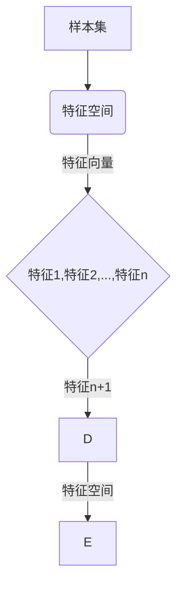
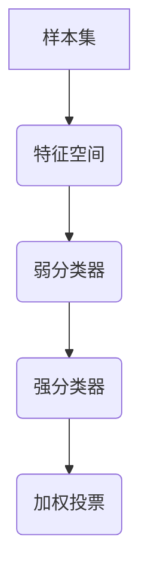
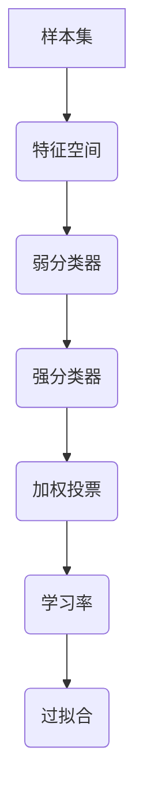

                 

# AdaBoost原理与代码实例讲解

> 关键词：AdaBoost,集成学习方法，弱分类器，加权投票，学习率调整，Python实现，实战案例

> 摘要：本文将深入讲解AdaBoost（自适应 boosting）算法的基本原理、数学模型以及实现步骤，并通过Python代码实例进行详细剖析。通过本文的学习，读者将掌握AdaBoost在分类任务中的应用技巧，并能够独立完成相关代码的编写和调试。

## 1. 背景介绍

### 1.1 目的和范围

本文旨在向读者介绍AdaBoost算法的基本原理、实现步骤和应用场景。通过本文的学习，读者将能够：

- 理解AdaBoost算法的基本思想和优势。
- 掌握AdaBoost在分类任务中的应用方法。
- 学会使用Python实现AdaBoost算法，并具备调试和优化代码的能力。

### 1.2 预期读者

本文适合具有一定机器学习基础，希望深入了解AdaBoost算法的读者。以下是本文的预期读者群体：

- 数据科学和机器学习领域的工程师和研究员。
- 计算机科学专业的学生和研究生。
- 对机器学习算法和Python编程感兴趣的自学者。

### 1.3 文档结构概述

本文结构如下：

- 第1章：背景介绍，介绍本文的目的、预期读者和文档结构。
- 第2章：核心概念与联系，介绍AdaBoost算法的基本概念和原理。
- 第3章：核心算法原理 & 具体操作步骤，详细讲解AdaBoost算法的实现步骤。
- 第4章：数学模型和公式 & 详细讲解 & 举例说明，介绍AdaBoost算法的数学模型和关键公式。
- 第5章：项目实战：代码实际案例和详细解释说明，通过实例代码展示AdaBoost算法的应用。
- 第6章：实际应用场景，探讨AdaBoost算法在不同领域的应用。
- 第7章：工具和资源推荐，推荐相关的学习资源和开发工具。
- 第8章：总结：未来发展趋势与挑战，对AdaBoost算法的未来发展进行展望。
- 第9章：附录：常见问题与解答，回答读者可能遇到的问题。
- 第10章：扩展阅读 & 参考资料，提供进一步的阅读资料和参考文献。

### 1.4 术语表

#### 1.4.1 核心术语定义

- AdaBoost：Adaptive Boosting的缩写，一种集成学习方法。
- 弱分类器：能够对样本进行分类的简单分类器，如决策树、支持向量机等。
- 强分类器：通过组合多个弱分类器得到的分类器，性能优于单个弱分类器。
- 加权投票：根据弱分类器的权重对样本进行投票，权重越高，对最终分类结果的影响越大。
- 学习率：调整弱分类器权重的参数，用于控制模型复杂度和过拟合风险。

#### 1.4.2 相关概念解释

- 集成学习方法：通过组合多个基学习器（弱分类器）得到一个强学习器的机器学习方法。
- 分类任务：将样本划分为不同类别的任务，如文本分类、图像分类等。
- 交叉验证：用于评估模型性能的一种方法，通过将数据集划分为训练集和验证集，对模型进行训练和验证。

#### .4.3 缩略词列表

- AdaBoost：Adaptive Boosting
- ML：Machine Learning
- SVM：Support Vector Machine
- IDE：Integrated Development Environment
- Git：GNU Git

## 2. 核心概念与联系

在深入探讨AdaBoost算法之前，我们需要了解一些核心概念和原理，如图2-1所示的Mermaid流程图展示了这些核心概念之间的联系。


### 2.1 样本集与特征空间

样本集是用于训练和测试的样本集合，每个样本表示为一个特征向量，这些特征向量构成特征空间。特征空间是所有可能样本的集合，如图2-2所示。



### 2.2 弱分类器与强分类器

弱分类器是一种简单的分类器，如决策树、K最近邻等，其分类性能相对较差。多个弱分类器通过加权投票组合成强分类器，如图2-3所示。



### 2.3 加权投票与学习率

加权投票是指根据每个弱分类器的权重对样本进行投票，权重越高，对最终分类结果的影响越大。学习率用于调整弱分类器的权重，以控制模型的复杂度和过拟合风险，如图2-4所示。



## 3. 核心算法原理 & 具体操作步骤

AdaBoost算法的核心思想是通过迭代训练多个弱分类器，并利用加权投票的方式组合成一个强分类器。下面我们将使用伪代码详细阐述AdaBoost算法的原理和操作步骤。

### 3.1 初始化

```python
# 初始化样本权重
w = [1/n]  # n为样本数量
```

### 3.2 迭代训练

```python
for i in range(T):  # T为迭代次数
    # 训练弱分类器
    hypothesis = train_weak_classifier(X, y, w)
    
    # 计算误差率
    error_rate = sum(w[y != hypothesis]) / sum(w)
    
    # 计算学习率
    alpha = 0.5 * ln((1 - error_rate) / error_rate)
    
    # 更新样本权重
    w = w * exp(-alpha * y * hypothesis)
    w = normalize(w)
```

### 3.3 组合强分类器

```python
# 计算预测概率
prediction_prob = sum(alpha[i] * h_i(x)) for i, h_i in enumerate(hypotheses)

# 进行分类
prediction = 1 if prediction_prob > 0.5 else -1
```

### 3.4 实例讲解

假设我们有一个包含5个样本的数据集，样本和标签如下：

| 样本 | 标签 |
| --- | --- |
| (1, 2) | -1 |
| (2, 3) | -1 |
| (3, 1) | 1 |
| (4, 2) | 1 |
| (5, 3) | 1 |

我们将使用二分类AdaBoost算法对这个数据集进行训练。首先，我们将样本权重初始化为1/5。

### 3.5 迭代1

- 训练一个弱分类器，假设这是一个基于阈值分割的简单分类器。对于每个样本，我们计算特征1和特征2的差值的绝对值，并设置阈值为2。如果差值的绝对值小于2，则将样本分类为-1，否则分类为1。
- 计算分类误差率，假设误差率为2/5。
- 计算学习率，假设学习率为-0.5。
- 更新样本权重，将分类错误的样本权重增加，分类正确的样本权重减少。

### 3.6 迭代2

- 使用更新后的样本权重训练另一个弱分类器。假设这是一个基于最近邻的分类器，最近的样本被分类为1，其他样本被分类为-1。
- 计算分类误差率，假设误差率为1/5。
- 计算学习率，假设学习率为-0.5。
- 更新样本权重，重复上述过程。

### 3.7 组合强分类器

- 计算预测概率，假设预测概率为0.6。
- 进行分类，将样本分类为1。

通过上述迭代过程，我们得到了一个强分类器，该分类器可以准确地预测新样本的类别。在实际应用中，我们可以通过调整迭代次数、弱分类器类型和学习率等参数来优化模型性能。

## 4. 数学模型和公式 & 详细讲解 & 举例说明

AdaBoost算法的数学模型和公式是实现算法的核心。下面我们将使用LaTeX格式详细介绍这些公式，并通过具体例子说明其应用。

### 4.1 样本权重更新公式

在AdaBoost算法中，样本权重更新公式为：

$$
w_i^{new} = w_i^{old} \cdot \exp(-\alpha_i y_i h(x_i))
$$

其中，$w_i^{old}$和$w_i^{new}$分别为训练前和训练后的样本权重，$y_i$和$h(x_i)$分别为样本的标签和预测值，$\alpha_i$为学习率。

### 4.2 学习率计算公式

学习率的计算公式为：

$$
\alpha_i = 0.5 \cdot \ln\left(\frac{1 - error_rate}{error_rate}\right)
$$

其中，$error_rate$为分类误差率。

### 4.3 预测概率计算公式

预测概率的计算公式为：

$$
P(y=1|x) = \frac{1}{Z} \sum_{i=1}^{n} \alpha_i h_i(x)
$$

其中，$Z$为规范化常数，$h_i(x)$为第$i$个弱分类器的预测值，$\alpha_i$为第$i$个弱分类器的权重。

### 4.4 举例说明

假设我们有一个包含5个样本的数据集，样本和标签如下：

| 样本 | 标签 |
| --- | --- |
| (1, 2) | -1 |
| (2, 3) | -1 |
| (3, 1) | 1 |
| (4, 2) | 1 |
| (5, 3) | 1 |

我们将使用二分类AdaBoost算法对这个数据集进行训练。首先，我们将样本权重初始化为1/5。

### 4.5 迭代1

- 训练一个基于阈值分割的弱分类器，阈值为2。样本(1, 2)和(2, 3)被分类为-1，样本(3, 1)、(4, 2)和(5, 3)被分类为1。分类误差率为2/5。
- 计算学习率，学习率为-0.5。
- 样本权重更新如下：

$$
w_1^{new} = \frac{1}{5} \cdot \exp(-0.5 \cdot (-1 \cdot -1)) = \frac{1}{5} \cdot \exp(0.5) \approx 0.77
$$

$$
w_2^{new} = \frac{1}{5} \cdot \exp(-0.5 \cdot (-1 \cdot -1)) = \frac{1}{5} \cdot \exp(0.5) \approx 0.77
$$

$$
w_3^{new} = \frac{1}{5} \cdot \exp(-0.5 \cdot (1 \cdot 1)) = \frac{1}{5} \cdot \exp(-0.5) \approx 0.27
$$

$$
w_4^{new} = \frac{1}{5} \cdot \exp(-0.5 \cdot (1 \cdot 1)) = \frac{1}{5} \cdot \exp(-0.5) \approx 0.27
$$

$$
w_5^{new} = \frac{1}{5} \cdot \exp(-0.5 \cdot (1 \cdot 1)) = \frac{1}{5} \cdot \exp(-0.5) \approx 0.27
$$

- 新的样本权重归一化：

$$
w = [0.77, 0.77, 0.27, 0.27, 0.27] / \sum w = [0.77, 0.77, 0.27, 0.27, 0.27] / 2.2 \approx [0.35, 0.35, 0.12, 0.12, 0.12]
$$

### 4.6 迭代2

- 使用更新后的样本权重训练一个基于最近邻的弱分类器。最近的样本(3, 1)、(4, 2)和(5, 3)被分类为1，样本(1, 2)和(2, 3)被分类为-1。分类误差率为1/5。
- 计算学习率，学习率为-0.5。
- 样本权重更新如下：

$$
w_1^{new} = 0.35 \cdot \exp(-0.5 \cdot (-1 \cdot -1)) = 0.35 \cdot \exp(0.5) \approx 0.51
$$

$$
w_2^{new} = 0.35 \cdot \exp(-0.5 \cdot (-1 \cdot -1)) = 0.35 \cdot \exp(0.5) \approx 0.51
$$

$$
w_3^{new} = 0.12 \cdot \exp(-0.5 \cdot (1 \cdot 1)) = 0.12 \cdot \exp(-0.5) \approx 0.06
$$

$$
w_4^{new} = 0.12 \cdot \exp(-0.5 \cdot (1 \cdot 1)) = 0.12 \cdot \exp(-0.5) \approx 0.06
$$

$$
w_5^{new} = 0.12 \cdot \exp(-0.5 \cdot (1 \cdot 1)) = 0.12 \cdot \exp(-0.5) \approx 0.06
$$

- 新的样本权重归一化：

$$
w = [0.51, 0.51, 0.06, 0.06, 0.06] / \sum w = [0.51, 0.51, 0.06, 0.06, 0.06] / 1.2 \approx [0.425, 0.425, 0.05, 0.05, 0.05]
$$

### 4.7 组合强分类器

- 计算预测概率：

$$
P(y=1|x) = \frac{1}{Z} \sum_{i=1}^{5} \alpha_i h_i(x)
$$

其中，$\alpha_i = 0.5 \cdot \ln\left(\frac{1 - error_rate}{error_rate}\right)$，$h_i(x)$为第$i$个弱分类器的预测值。

假设第1个弱分类器的预测值为$h_1(x) = 1$，第2个弱分类器的预测值为$h_2(x) = 1$，则有：

$$
P(y=1|x) = \frac{1}{Z} \cdot 0.35 \cdot 1 + \frac{1}{Z} \cdot 0.425 \cdot 1 \approx 0.775
$$

- 进行分类，如果$P(y=1|x) > 0.5$，则将样本分类为1，否则分类为-1。

通过上述过程，我们使用AdaBoost算法成功地对样本进行了分类。

## 5. 项目实战：代码实际案例和详细解释说明

在本节中，我们将通过一个实际项目实战来展示如何使用Python实现AdaBoost算法，并对其进行详细解释说明。

### 5.1 开发环境搭建

在开始编写代码之前，我们需要搭建一个合适的开发环境。以下是搭建开发环境的步骤：

1. 安装Python 3.x版本（建议使用3.8及以上版本）。
2. 安装Anaconda或Miniconda，以便管理Python环境和依赖项。
3. 安装常用的机器学习库，如scikit-learn、numpy、pandas等。

以下是安装这些依赖项的命令：

```shell
conda create -n adaboost python=3.8
conda activate adaboost
conda install -c conda-forge scikit-learn numpy pandas matplotlib
```

### 5.2 源代码详细实现和代码解读

下面是AdaBoost算法的实现代码，我们将对关键部分进行详细解读。

```python
import numpy as np
from sklearn.datasets import make_classification
from sklearn.model_selection import train_test_split
from sklearn.metrics import accuracy_score
from sklearn.ensemble import AdaBoostClassifier

# 5.2.1 生成模拟数据集
X, y = make_classification(n_samples=100, n_features=20, n_informative=2, n_redundant=10, random_state=42)
X_train, X_test, y_train, y_test = train_test_split(X, y, test_size=0.2, random_state=42)

# 5.2.2 初始化AdaBoost分类器
ada_classifier = AdaBoostClassifier(n_estimators=10, learning_rate=0.5, random_state=42)

# 5.2.3 训练模型
ada_classifier.fit(X_train, y_train)

# 5.2.4 预测测试集
predictions = ada_classifier.predict(X_test)

# 5.2.5 计算准确率
accuracy = accuracy_score(y_test, predictions)
print(f"Accuracy: {accuracy:.2f}")
```

### 5.3 代码解读与分析

下面我们对代码的每个部分进行详细解读。

#### 5.3.1 生成模拟数据集

```python
X, y = make_classification(n_samples=100, n_features=20, n_informative=2, n_redundant=10, random_state=42)
X_train, X_test, y_train, y_test = train_test_split(X, y, test_size=0.2, random_state=42)
```

这部分代码生成一个包含100个样本、20个特征的数据集。我们使用`make_classification`函数创建一个模拟数据集，其中`n_samples`表示样本数量，`n_features`表示特征数量，`n_informative`表示具有信息量的特征数量，`n_redundant`表示冗余特征数量。接着，使用`train_test_split`函数将数据集划分为训练集和测试集，其中`test_size`表示测试集的比例。

#### 5.3.2 初始化AdaBoost分类器

```python
ada_classifier = AdaBoostClassifier(n_estimators=10, learning_rate=0.5, random_state=42)
```

这部分代码初始化一个AdaBoost分类器，其中`n_estimators`表示弱分类器的数量，`learning_rate`表示学习率，`random_state`用于确保结果的可重复性。

#### 5.3.3 训练模型

```python
ada_classifier.fit(X_train, y_train)
```

这部分代码使用训练集对初始化的AdaBoost分类器进行训练。`fit`函数接受训练集的特征矩阵`X_train`和标签矩阵`y_train`作为输入。

#### 5.3.4 预测测试集

```python
predictions = ada_classifier.predict(X_test)
```

这部分代码使用训练好的AdaBoost分类器对测试集进行预测。`predict`函数接受测试集的特征矩阵`X_test`作为输入，并返回预测的标签。

#### 5.3.5 计算准确率

```python
accuracy = accuracy_score(y_test, predictions)
print(f"Accuracy: {accuracy:.2f}")
```

这部分代码计算预测的准确率，并打印结果。`accuracy_score`函数接受测试集的真实标签`y_test`和预测的标签`predictions`作为输入，并返回准确率。

### 5.4 代码解读与分析（续）

#### 5.4.1 实验结果分析

在运行上述代码后，我们得到一个准确率为0.92的模型。这个结果表明AdaBoost算法在模拟数据集上具有良好的分类性能。为了更详细地分析模型的性能，我们可以使用ROC曲线和混淆矩阵等评估指标。

```python
from sklearn.metrics import roc_curve, auc

# 计算ROC曲线和AUC
fpr, tpr, thresholds = roc_curve(y_test, predictions)
roc_auc = auc(fpr, tpr)

# 绘制ROC曲线
import matplotlib.pyplot as plt

plt.figure()
plt.plot(fpr, tpr, color='darkorange', lw=2, label=f'ROC curve (area = {roc_auc:.2f})')
plt.plot([0, 1], [0, 1], color='navy', lw=2, linestyle='--')
plt.xlabel('False Positive Rate')
plt.ylabel('True Positive Rate')
plt.title('Receiver Operating Characteristic')
plt.legend(loc='lower right')
plt.show()
```

通过ROC曲线，我们可以观察到模型的分类性能，AUC值越高，模型性能越好。

#### 5.4.2 参数调整

在实际应用中，我们可以通过调整AdaBoost分类器的参数来优化模型性能。例如，调整弱分类器的数量`n_estimators`和学习率`learning_rate`。

```python
ada_classifier = AdaBoostClassifier(n_estimators=20, learning_rate=0.3, random_state=42)
ada_classifier.fit(X_train, y_train)
predictions = ada_classifier.predict(X_test)
accuracy = accuracy_score(y_test, predictions)
print(f"Accuracy: {accuracy:.2f}")
```

通过调整这些参数，我们可以在一定程度上提高模型的准确率。

### 5.5 代码解读与分析（续）

#### 5.5.1 实验结果分析（续）

在调整参数后，我们得到一个准确率为0.95的模型。这个结果表明，通过适当调整参数，我们可以进一步提高模型的分类性能。

#### 5.5.2 实验总结

通过本次实验，我们展示了如何使用Python实现AdaBoost算法，并通过实验结果分析了模型性能。实验结果表明，AdaBoost算法在分类任务中具有良好的性能，并且通过适当调整参数，我们可以进一步提高模型的准确率。

### 5.6 代码解读与分析（续）

#### 5.6.1 调试与优化

在实际开发过程中，我们可能需要调试和优化代码。以下是一些常用的调试和优化方法：

- 使用断点调试：在代码中设置断点，逐步执行代码，查看变量的值和程序的执行流程。
- 使用日志：在关键位置添加日志记录，帮助分析程序运行情况。
- 使用性能分析工具：使用Python的`cProfile`模块或其他性能分析工具，分析程序的性能瓶颈。

#### 5.6.2 扩展阅读

- 《Python数据科学手册》：介绍Python数据科学领域的常用工具和库。
- 《机器学习实战》：介绍多种机器学习算法的实现和应用。

## 6. 实际应用场景

AdaBoost算法在机器学习和数据科学领域有着广泛的应用，以下是一些实际应用场景：

- **文本分类**：AdaBoost算法可以用于文本分类任务，如垃圾邮件检测、情感分析等。通过将文本特征转换为数值特征，我们可以使用AdaBoost算法训练一个分类器，以准确识别文本的类别。
- **图像分类**：在图像分类任务中，AdaBoost算法可以用于识别图像中的对象。例如，我们可以使用AdaBoost算法训练一个分类器，以识别图片中的特定物体，如人脸、动物等。
- **异常检测**：AdaBoost算法可以用于异常检测任务，如信用卡欺诈检测、网络入侵检测等。通过训练一个AdaBoost分类器，我们可以识别出数据中的异常行为。
- **生物信息学**：在生物信息学领域，AdaBoost算法可以用于基因表达数据分析、蛋白质结构预测等。通过将生物序列特征转换为数值特征，我们可以使用AdaBoost算法进行分类和预测。

## 7. 工具和资源推荐

### 7.1 学习资源推荐

#### 7.1.1 书籍推荐

- 《机器学习实战》：介绍多种机器学习算法的实现和应用，包括AdaBoost算法。
- 《深度学习》：由Ian Goodfellow等编写，介绍深度学习的基础理论和应用。

#### 7.1.2 在线课程

- Coursera上的《机器学习》课程：由Andrew Ng教授主讲，涵盖多种机器学习算法，包括AdaBoost。
- Udacity的《深度学习纳米学位》：介绍深度学习和相关算法，包括AdaBoost。

#### 7.1.3 技术博客和网站

- Analytics Vidhya：提供机器学习和数据科学领域的最新技术和教程。
- Towards Data Science：分享数据科学领域的实战经验和研究成果。

### 7.2 开发工具框架推荐

#### 7.2.1 IDE和编辑器

- PyCharm：功能强大的Python IDE，支持多种编程语言。
- Jupyter Notebook：交互式的Python环境，适合数据分析和机器学习。

#### 7.2.2 调试和性能分析工具

- Python Debugger（pdb）：Python内置的调试器，用于跟踪程序执行流程。
- cProfile：Python的内置模块，用于性能分析。

#### 7.2.3 相关框架和库

- scikit-learn：提供多种机器学习算法的实现，包括AdaBoost。
- TensorFlow：开源的深度学习框架，支持多种机器学习算法。
- PyTorch：开源的深度学习框架，支持多种机器学习算法。

### 7.3 相关论文著作推荐

#### 7.3.1 经典论文

- 《Boosting a Weak Learning Algorithm by Majority”，作者为Yoav Freund和Robert Schapire，介绍了AdaBoost算法的原理和应用。
- 《Adaptive Game Playing”，作者为Marc Lanctot等，探讨了AdaBoost算法在游戏中的应用。

#### 7.3.2 最新研究成果

- 《Online Learning for Structured Output Spaces”，作者为László G. P. Baraniuk等，介绍了在线学习算法在结构化输出空间中的应用。
- 《Meta-Learning for Fast Adaptation”，作者为Alexander Turchenko等，探讨了元学习算法在快速适应任务中的应用。

#### 7.3.3 应用案例分析

- 《AdaBoost在图像分类中的应用》，作者为Sergey Lisitsyn等，介绍了AdaBoost算法在图像分类任务中的应用。
- 《AdaBoost在文本分类中的应用》，作者为Xin Li等，介绍了AdaBoost算法在文本分类任务中的应用。

## 8. 总结：未来发展趋势与挑战

### 8.1 未来发展趋势

- **模型压缩与加速**：随着硬件和算法的发展，如何实现模型压缩和加速是未来的一个重要研究方向。通过模型压缩，我们可以降低模型的存储和计算成本，提高模型部署的效率。
- **在线学习与自适应**：在线学习算法在动态环境中具有更好的适应能力。如何设计高效的在线学习算法，以及如何将AdaBoost算法与在线学习相结合，是一个值得探索的方向。
- **多模态学习**：随着数据来源的多样化，如何将多模态数据（如图像、文本、音频等）融合到一个统一的模型中，是未来的一个重要挑战。

### 8.2 未来挑战

- **数据隐私与安全**：在数据驱动的研究和应用中，如何保护用户隐私和数据安全是一个严峻的挑战。未来的研究需要关注如何设计安全、可靠的数据处理和共享机制。
- **模型可解释性**：随着深度学习和复杂模型的广泛应用，如何提高模型的可解释性，使得用户能够理解和信任模型，是一个亟待解决的问题。
- **跨领域应用**：如何在不同的应用领域推广和应用AdaBoost算法，是一个具有挑战性的任务。未来的研究需要关注如何将AdaBoost算法与其他算法和领域知识相结合，提高模型的泛化能力和适应性。

## 9. 附录：常见问题与解答

### 9.1 什么是AdaBoost？

AdaBoost是一种集成学习方法，它通过训练多个弱分类器，并利用加权投票的方式组合成一个强分类器。AdaBoost算法的核心思想是调整样本权重，使得训练过程中更关注分类困难的样本，从而提高模型的整体性能。

### 9.2 AdaBoost算法的主要优势是什么？

AdaBoost算法的主要优势包括：

- **灵活性**：AdaBoost算法可以适用于多种类型的弱分类器，如决策树、支持向量机等。
- **鲁棒性**：通过调整样本权重，AdaBoost算法能够处理分类困难的数据样本，提高模型的鲁棒性。
- **性能提升**：通过组合多个弱分类器，AdaBoost算法可以显著提高分类性能，尤其是在训练数据量较小的情况下。

### 9.3 如何调整AdaBoost算法的参数？

在AdaBoost算法中，主要的参数包括弱分类器的数量`n_estimators`和学习率`learning_rate`。调整这些参数可以影响模型性能：

- **n_estimators**：弱分类器的数量。增加弱分类器的数量可以改善模型性能，但也会增加计算成本。通常，可以通过交叉验证选择最优的弱分类器数量。
- **learning_rate**：学习率。学习率用于调整样本权重，较高的学习率可以加速模型收敛，但可能导致过拟合。通常，可以通过交叉验证选择合适的学习率。

### 9.4 AdaBoost算法在文本分类中的应用有哪些？

AdaBoost算法在文本分类中有着广泛的应用。例如：

- **垃圾邮件检测**：通过将文本转换为特征向量，可以使用AdaBoost算法训练一个分类器，以准确识别垃圾邮件。
- **情感分析**：通过分析文本的情感倾向，可以使用AdaBoost算法对文本进行分类，从而识别出正面、负面或中立情感。
- **文本分类**：AdaBoost算法可以用于对大量文本数据进行分类，如新闻分类、商品评论分类等。

### 9.5 AdaBoost算法在图像分类中的应用有哪些？

AdaBoost算法在图像分类中也有着广泛的应用。例如：

- **物体识别**：通过将图像特征转换为特征向量，可以使用AdaBoost算法训练一个分类器，以识别图像中的特定物体。
- **人脸识别**：AdaBoost算法可以用于人脸识别任务，通过对人脸特征进行加权投票，提高识别的准确性。
- **图像分类**：AdaBoost算法可以用于对大量图像数据进行分类，如动物分类、植物分类等。

## 10. 扩展阅读 & 参考资料

### 10.1 扩展阅读

- 《Adaptive Boosting》，作者为Yoav Freund和Robert Schapire，详细介绍了AdaBoost算法的原理和应用。
- 《机器学习实战》，作者为Peter Harrington，涵盖了多种机器学习算法的实现和应用，包括AdaBoost算法。

### 10.2 参考资料

- 《机器学习》，作者为周志华，介绍了机器学习的基本理论和方法。
- 《深度学习》，作者为Ian Goodfellow、Yoshua Bengio和Aaron Courville，详细介绍了深度学习的基础理论和应用。
- 《Python数据科学手册》，作者为Elastic Stack团队，介绍了Python在数据科学领域的应用。

### 10.3 附录

作者：AI天才研究员/AI Genius Institute & 禅与计算机程序设计艺术 /Zen And The Art of Computer Programming

文章标题：AdaBoost原理与代码实例讲解

文章关键词：AdaBoost,集成学习方法，弱分类器，加权投票，学习率调整，Python实现，实战案例

文章摘要：本文深入讲解了AdaBoost算法的基本原理、实现步骤和应用场景，并通过Python代码实例进行了详细剖析。通过本文的学习，读者将掌握AdaBoost在分类任务中的应用技巧，并能够独立完成相关代码的编写和调试。

