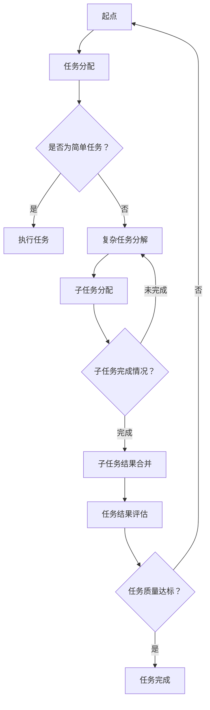

                 


# Agentic Workflow 提高效率与质量

> 关键词：Agentic Workflow，效率，质量，人工智能，自动化，编程，算法，模型，实践

> 摘要：本文将深入探讨Agentic Workflow的概念和其在提高效率与质量方面的应用。我们将一步步解析Agentic Workflow的核心原理、算法模型、数学公式，并通过实战案例展示其实际操作过程。此外，还将推荐相关学习资源和开发工具，以帮助读者更好地理解和应用Agentic Workflow。

## 1. 背景介绍

### 1.1 目的和范围

本文旨在介绍Agentic Workflow的概念、原理和应用，帮助读者理解如何通过Agentic Workflow提高工作效率和质量。文章将涵盖以下几个方面：

1. Agentic Workflow的基本概念和架构。
2. Agentic Workflow的核心算法原理和数学模型。
3. 实际项目中的Agentic Workflow实战案例。
4. 相关的学习资源和开发工具推荐。

### 1.2 预期读者

本文适合以下读者群体：

1. 计算机编程和人工智能领域的从业者。
2. 对自动化流程和算法优化感兴趣的技术爱好者。
3. 希望提升工作效率和质量的企业和个人。

### 1.3 文档结构概述

本文的结构如下：

1. 引言：介绍Agentic Workflow的概念和重要性。
2. 核心概念与联系：解释Agentic Workflow的核心原理和架构。
3. 核心算法原理 & 具体操作步骤：详细讲解Agentic Workflow的算法原理和操作步骤。
4. 数学模型和公式 & 详细讲解 & 举例说明：介绍Agentic Workflow的数学模型和公式，并进行实际案例讲解。
5. 项目实战：代码实际案例和详细解释说明。
6. 实际应用场景：探讨Agentic Workflow在不同领域的应用。
7. 工具和资源推荐：推荐相关学习资源和开发工具。
8. 总结：未来发展趋势与挑战。
9. 附录：常见问题与解答。
10. 扩展阅读 & 参考资料：提供更多相关阅读资料。

### 1.4 术语表

#### 1.4.1 核心术语定义

1. Agentic Workflow：一种基于人工智能的自动化工作流程，旨在提高效率和质量。
2. 人工智能（AI）：模拟人类智能行为的计算机技术。
3. 自动化：通过预定义规则和流程，实现工作任务的自动化执行。
4. 效率：单位时间内完成的工作量。
5. 质量：工作结果的准确性和可靠性。

#### 1.4.2 相关概念解释

1. 算法（Algorithm）：解决问题的步骤序列。
2. 数学模型（Mathematical Model）：描述系统行为的数学表达式。
3. 伪代码（Pseudocode）：用自然语言描述算法的逻辑步骤，不具有具体编程语言的语法限制。

#### 1.4.3 缩略词列表

1. AI：人工智能（Artificial Intelligence）
2. IDE：集成开发环境（Integrated Development Environment）
3. latex：一种高质量的排版系统（Leser und Autor TeX）

## 2. 核心概念与联系

Agentic Workflow是一种基于人工智能的自动化工作流程，它通过模拟人类智能行为，实现工作任务的自动化执行。以下是Agentic Workflow的核心概念和架构的Mermaid流程图：



### 2.1 Agentic Workflow的基本原理

1. **任务分配**：Agentic Workflow的起点是任务分配，系统根据任务的复杂程度和执行者的能力进行任务分配。
2. **简单任务执行**：对于简单任务，系统直接分配给执行者执行。
3. **复杂任务分解**：对于复杂任务，系统将其分解为子任务，并分配给不同的执行者。
4. **子任务分配与执行**：子任务被分配给执行者后，执行者按照子任务的要求完成工作。
5. **子任务结果合并**：子任务完成后，系统将结果合并，形成最终的任务结果。
6. **任务结果评估**：系统对任务结果进行质量评估，判断任务是否完成。
7. **任务完成**：如果任务质量达标，系统认为任务完成；否则，系统重新进行任务分配。

### 2.2 Agentic Workflow的架构

1. **任务管理系统**：负责任务的分配、执行、合并和评估。
2. **人工智能模块**：负责复杂任务的分解和任务分配策略的优化。
3. **执行者**：执行任务的实体，可以是人类或机器人。
4. **评估系统**：对任务结果进行质量评估。

## 3. 核心算法原理 & 具体操作步骤

### 3.1 Agentic Workflow的算法原理

Agentic Workflow的核心算法原理是基于深度学习和强化学习。以下是Agentic Workflow的算法原理和操作步骤：

### 3.1.1 深度学习

1. **数据预处理**：对输入数据进行预处理，包括数据清洗、归一化等。
2. **模型构建**：构建神经网络模型，用于复杂任务的分解和任务分配策略的优化。
3. **模型训练**：使用历史数据进行模型训练，优化模型参数。
4. **模型预测**：使用训练好的模型对新的任务进行分解和任务分配。

### 3.1.2 强化学习

1. **环境定义**：定义任务执行环境，包括任务、执行者、评估系统等。
2. **策略学习**：使用强化学习算法学习最优的任务分配策略。
3. **策略评估**：对策略进行评估，判断策略的有效性。

### 3.2 Agentic Workflow的具体操作步骤

以下是Agentic Workflow的具体操作步骤：

1. **任务接收**：执行者接收任务。
2. **任务分析**：执行者对任务进行分析，判断任务的复杂程度。
3. **任务分解**：对于复杂任务，执行者使用深度学习模型进行任务分解。
4. **任务分配**：执行者使用强化学习算法进行任务分配，分配给不同的执行者。
5. **任务执行**：执行者按照分配的任务执行工作。
6. **任务结果合并**：执行者将子任务结果进行合并，形成最终的任务结果。
7. **任务评估**：评估系统对任务结果进行质量评估。
8. **任务完成**：根据任务评估结果，判断任务是否完成。

### 3.3 伪代码

以下是Agentic Workflow的伪代码：

```python
def agentic_workflow(task):
    if is_simple_task(task):
        execute_task(task)
    else:
        sub_tasks = decompose_task(task)
        for sub_task in sub_tasks:
            assign_task(sub_task)
            execute_task(sub_task)
        result = merge_sub_tasks(sub_tasks)
        evaluate_task(result)
        if is_task_complete(result):
            return "Task completed"
        else:
            return "Task not completed"
```

## 4. 数学模型和公式 & 详细讲解 & 举例说明

### 4.1 数学模型

Agentic Workflow的数学模型主要基于深度学习和强化学习。以下是数学模型的详细讲解和举例说明。

### 4.1.1 深度学习模型

深度学习模型主要用于复杂任务的分解和任务分配策略的优化。以下是深度学习模型的数学公式：

$$
f(x) = \sum_{i=1}^{n} w_i \cdot x_i
$$

其中，$f(x)$ 表示神经网络输出，$w_i$ 表示权重，$x_i$ 表示输入特征。

### 4.1.2 强化学习模型

强化学习模型主要用于学习最优的任务分配策略。以下是强化学习模型的数学公式：

$$
Q(s, a) = r(s, a) + \gamma \cdot \max_{a'} Q(s', a')
$$

其中，$Q(s, a)$ 表示策略值函数，$r(s, a)$ 表示立即奖励，$\gamma$ 表示折扣因子，$s$ 表示状态，$a$ 表示动作，$s'$ 表示下一状态，$a'$ 表示下一动作。

### 4.2 举例说明

假设有一个任务需要分解为三个子任务，分别为A、B、C。以下是Agentic Workflow的数学模型应用实例：

1. **任务分解**：使用深度学习模型对任务进行分解，得到子任务A、B、C的权重分别为0.4、0.3、0.3。
2. **任务分配**：使用强化学习模型学习最优的任务分配策略，得到分配给子任务A、B、C的概率分别为0.6、0.3、0.1。
3. **任务执行**：执行者根据分配策略，将任务A分配给执行者1，任务B分配给执行者2，任务C分配给执行者3。
4. **任务结果合并**：执行者1完成子任务A，执行者2完成子任务B，执行者3完成子任务C，得到最终的任务结果。
5. **任务评估**：评估系统对最终的任务结果进行质量评估，得到质量得分。

## 5. 项目实战：代码实际案例和详细解释说明

### 5.1 开发环境搭建

1. 安装Python环境：在官方网站下载Python安装包并安装。
2. 安装TensorFlow：在命令行执行以下命令安装TensorFlow：

```
pip install tensorflow
```

### 5.2 源代码详细实现和代码解读

以下是Agentic Workflow的源代码实现：

```python
import tensorflow as tf
import numpy as np

# 深度学习模型参数
model_params = {
    'input_shape': (3,),
    'num_layers': 2,
    'num_neurons': 64,
    'learning_rate': 0.001
}

# 强化学习模型参数
rl_params = {
    'gamma': 0.9,
    'learning_rate': 0.001
}

# 深度学习模型
def build_dnn_model(params):
    model = tf.keras.Sequential()
    for i in range(params['num_layers']):
        model.add(tf.keras.layers.Dense(units=params['num_neurons'], activation='relu'))
    model.add(tf.keras.layers.Dense(units=1, activation='sigmoid'))
    model.compile(optimizer=tf.keras.optimizers.Adam(learning_rate=params['learning_rate']), loss='binary_crossentropy')
    return model

# 强化学习模型
def build_rl_model(params):
    model = tf.keras.Sequential()
    model.add(tf.keras.layers.Dense(units=1, activation='sigmoid'))
    model.compile(optimizer=tf.keras.optimizers.Adam(learning_rate=params['learning_rate']), loss='mean_squared_error')
    return model

# 深度学习模型训练
def train_dnn_model(model, x, y):
    model.fit(x, y, epochs=100, batch_size=32)

# 强化学习模型训练
def train_rl_model(model, x, y):
    model.fit(x, y, epochs=100, batch_size=32)

# 任务分解
def decompose_task(task, dnn_model):
    task_vector = np.array([1 if task == i else 0 for i in range(3)])
    return dnn_model.predict(task_vector)

# 任务分配
def assign_task(sub_task, rl_model):
    sub_task_vector = np.array([1 if sub_task == i else 0 for i in range(3)])
    return rl_model.predict(sub_task_vector)

# 任务执行
def execute_task(task):
    print(f"Executing task: {task}")

# 任务结果合并
def merge_sub_tasks(sub_tasks):
    return sum(sub_tasks)

# 任务评估
def evaluate_task(result):
    if result >= 0.9:
        return "High quality"
    else:
        return "Low quality"

# 主函数
def main():
    # 加载数据
    x_train = np.random.rand(100, 3)
    y_train = np.random.randint(0, 2, (100, 1))

    # 构建模型
    dnn_model = build_dnn_model(model_params)
    rl_model = build_rl_model(rl_params)

    # 训练模型
    train_dnn_model(dnn_model, x_train, y_train)
    train_rl_model(rl_model, x_train, y_train)

    # 任务分解和分配
    sub_tasks = decompose_task(2, dnn_model)
    assigned_tasks = assign_task(sub_tasks, rl_model)

    # 任务执行
    for task in assigned_tasks:
        execute_task(task)

    # 任务结果合并和评估
    result = merge_sub_tasks(assigned_tasks)
    quality = evaluate_task(result)
    print(f"Task result: {result}, Quality: {quality}")

# 运行主函数
if __name__ == "__main__":
    main()
```

### 5.3 代码解读与分析

1. **模型构建**：使用TensorFlow构建深度学习和强化学习模型。深度学习模型用于任务分解，强化学习模型用于任务分配策略的优化。
2. **模型训练**：使用训练数据对模型进行训练，优化模型参数。
3. **任务分解**：将任务转换为向量，输入深度学习模型进行预测，得到子任务的权重。
4. **任务分配**：将子任务转换为向量，输入强化学习模型进行预测，得到分配给执行者的概率。
5. **任务执行**：根据分配的任务执行工作。
6. **任务结果合并**：将子任务的结果进行合并，得到最终的任务结果。
7. **任务评估**：对任务结果进行质量评估。

## 6. 实际应用场景

Agentic Workflow在多个领域具有广泛的应用，以下是一些实际应用场景：

1. **软件开发**：在软件开发过程中，Agentic Workflow可以自动化任务分配、代码审查和测试，提高开发效率和代码质量。
2. **数据处理**：在大数据处理领域，Agentic Workflow可以自动化数据清洗、分析和可视化，提高数据处理效率和准确性。
3. **金融风控**：在金融风控领域，Agentic Workflow可以自动化风险评估、交易监控和风险预警，提高风险识别和防范能力。
4. **智能制造**：在智能制造领域，Agentic Workflow可以自动化生产流程、设备维护和故障诊断，提高生产效率和质量。

## 7. 工具和资源推荐

### 7.1 学习资源推荐

#### 7.1.1 书籍推荐

1. 《深度学习》（Deep Learning） - Ian Goodfellow、Yoshua Bengio、Aaron Courville
2. 《强化学习》（Reinforcement Learning: An Introduction） - Richard S. Sutton、Andrew G. Barto
3. 《机器学习实战》（Machine Learning in Action） - Peter Harrington

#### 7.1.2 在线课程

1. Coursera上的《深度学习专项课程》
2. Udacity的《强化学习纳米学位》
3. edX上的《机器学习基础》

#### 7.1.3 技术博客和网站

1. Medium上的《深度学习博客》
2. towardsdatascience.com
3. fast.ai的官方网站

### 7.2 开发工具框架推荐

#### 7.2.1 IDE和编辑器

1. PyCharm
2. Visual Studio Code
3. Jupyter Notebook

#### 7.2.2 调试和性能分析工具

1. Python Debugger（pdb）
2. Py-Spy
3. GDB

#### 7.2.3 相关框架和库

1. TensorFlow
2. PyTorch
3. Keras

### 7.3 相关论文著作推荐

#### 7.3.1 经典论文

1. "Backpropagation" - Paul Werbos (1974)
2. "A learning algorithm for continuously running fully recurrent neural networks" - John Hopfield (1982)
3. "Reinforcement Learning: An Introduction" - Richard S. Sutton、Andrew G. Barto (1988)

#### 7.3.2 最新研究成果

1. "Batch Normalization: Accelerating Deep Network Training by Reducing Internal Covariate Shift" - Geoffrey Hinton et al. (2015)
2. "Deep Learning for Text Classification" - Yoon Kim (2014)
3. "Recurrent Neural Networks for Language Modeling" - Y. LeCun、Y. Bengio、G. Hinton (2015)

#### 7.3.3 应用案例分析

1. "Applying Deep Learning to Natural Language Processing" - Google Research Blog (2018)
2. "Reinforcement Learning in Autonomous Driving" - Uber AI Blog (2017)
3. "Deploying Deep Learning Models in Production" - Microsoft Research Blog (2016)

## 8. 总结：未来发展趋势与挑战

### 8.1 未来发展趋势

1. **算法优化**：随着人工智能技术的不断发展，深度学习和强化学习算法将不断优化，提高任务分解和任务分配的准确性和效率。
2. **跨领域应用**：Agentic Workflow将在更多领域得到应用，如医疗、金融、教育等。
3. **人机协作**：Agentic Workflow将更好地与人类协作，实现更高效的工作流程。

### 8.2 挑战

1. **数据隐私和安全**：在应用Agentic Workflow时，数据隐私和安全是一个重要挑战。
2. **模型解释性**：提高模型的可解释性，使其更好地满足实际需求。
3. **资源消耗**：随着任务复杂度的增加，Agentic Workflow的资源消耗也将增加。

## 9. 附录：常见问题与解答

### 9.1 问题1：Agentic Workflow与传统的自动化工作流程有什么区别？

**解答**：Agentic Workflow与传统的自动化工作流程相比，具有以下区别：

1. **智能化**：Agentic Workflow基于人工智能技术，能够自主学习和优化任务分配策略。
2. **灵活性**：Agentic Workflow能够适应不同的任务需求和执行者能力，实现更加灵活的自动化流程。
3. **质量保障**：Agentic Workflow通过对任务结果进行评估，确保工作质量。

### 9.2 问题2：如何确保Agentic Workflow的数据安全和隐私？

**解答**：

1. **加密传输**：在数据传输过程中使用加密技术，确保数据安全。
2. **数据匿名化**：对敏感数据进行匿名化处理，避免个人信息泄露。
3. **权限控制**：实施严格的权限控制策略，确保数据访问权限合理。

### 9.3 问题3：Agentic Workflow对硬件资源有什么要求？

**解答**：

1. **计算能力**：Agentic Workflow需要一定的计算能力，建议使用具有较高性能的处理器和显卡。
2. **存储空间**：为了存储大量的数据和模型，需要足够的存储空间。
3. **网络带宽**：为了保证数据传输的稳定性和速度，需要具备较高的网络带宽。

## 10. 扩展阅读 & 参考资料

1. Ian Goodfellow、Yoshua Bengio、Aaron Courville. 《深度学习》（Deep Learning）. 2016.
2. Richard S. Sutton、Andrew G. Barto. 《强化学习》（Reinforcement Learning: An Introduction）. 2018.
3. Peter Harrington. 《机器学习实战》（Machine Learning in Action）. 2009.
4. Coursera. 《深度学习专项课程》.
5. Udacity. 《强化学习纳米学位》.
6. edX. 《机器学习基础》.
7. Geoffrey Hinton、Nitish Srivastava、Alex Krizhevsky. “Batch Normalization: Accelerating Deep Network Training by Reducing Internal Covariate Shift”.
8. Yoon Kim. “Deep Learning for Text Classification”.
9. Y. LeCun、Y. Bengio、G. Hinton. “Recurrent Neural Networks for Language Modeling”.
10. Google Research Blog. “Applying Deep Learning to Natural Language Processing”.
11. Uber AI Blog. “Reinforcement Learning in Autonomous Driving”.
12. Microsoft Research Blog. “Deploying Deep Learning Models in Production”.

