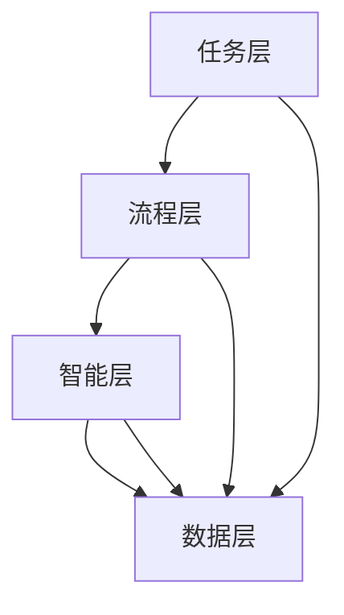
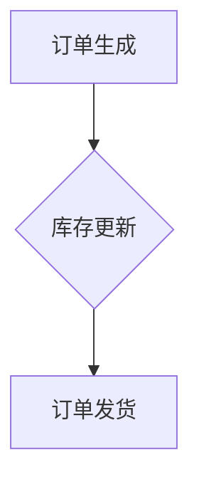
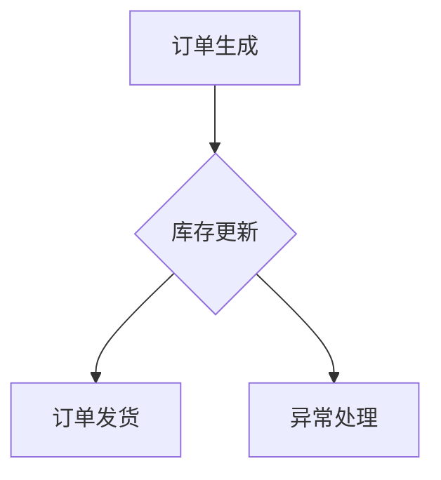
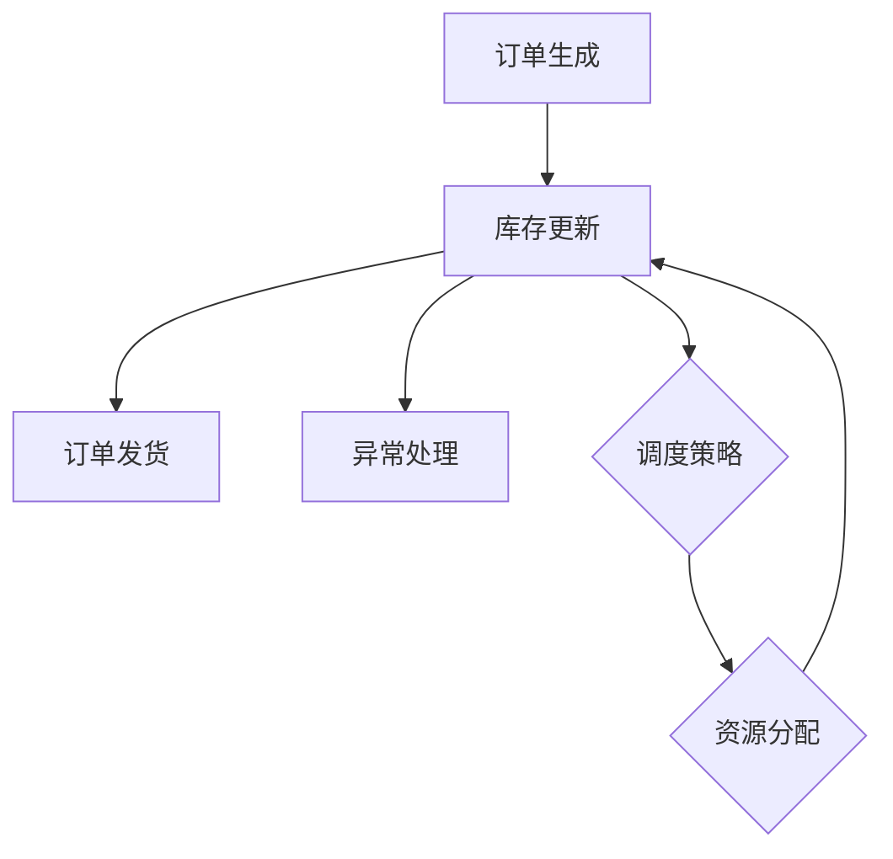
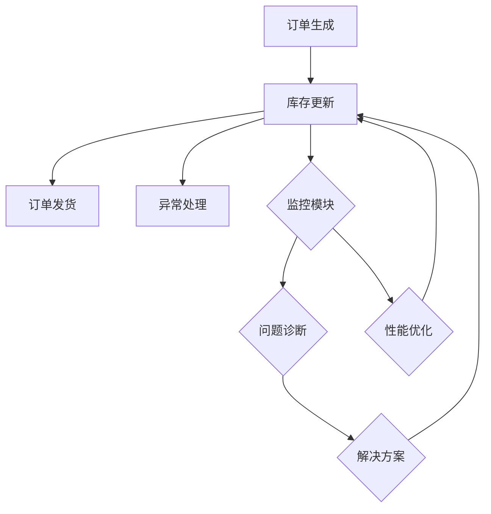

                 

# Agentic Workflow 的可用性讨论

> 关键词：Agentic Workflow、工作流、可用性、人工智能、自动化、用户体验、性能优化

> 摘要：本文旨在深入探讨Agentic Workflow的可用性，分析其核心概念、技术原理、数学模型和实际应用案例。通过逐步推理和实例讲解，本文揭示了Agentic Workflow的优势和挑战，为开发者、架构师和决策者提供了有价值的参考。

## 1. 背景介绍

### 1.1 目的和范围

本文将重点关注Agentic Workflow的可用性，旨在揭示其在实际应用中的优势和潜在挑战。通过详细的实例分析，我们将深入探讨Agentic Workflow的核心概念和技术原理，并结合数学模型和实际应用案例，提供一套全面的可用性评估框架。

### 1.2 预期读者

本文适用于对工作流和自动化有一定了解的读者，包括但不限于：

- 开发者：了解Agentic Workflow的基本原理和实现方法，提高自动化工作流的开发效率。
- 架构师：掌握Agentic Workflow的适用场景和性能优化策略，设计高效、可靠的工作流系统。
- 决策者：了解Agentic Workflow的价值和潜在风险，为企业的数字化转型提供决策支持。

### 1.3 文档结构概述

本文分为以下几个部分：

- 第1部分：背景介绍，包括目的、范围和预期读者。
- 第2部分：核心概念与联系，介绍Agentic Workflow的基本原理和架构。
- 第3部分：核心算法原理与具体操作步骤，详细阐述Agentic Workflow的实现过程。
- 第4部分：数学模型和公式，介绍Agentic Workflow的关键数学模型和公式。
- 第5部分：项目实战，提供实际案例和代码实现，便于读者理解和实践。
- 第6部分：实际应用场景，分析Agentic Workflow在不同领域的应用。
- 第7部分：工具和资源推荐，为读者提供相关的学习资源和开发工具。
- 第8部分：总结，展望Agentic Workflow的未来发展趋势和挑战。
- 第9部分：附录，解答常见问题，提供扩展阅读和参考资料。

### 1.4 术语表

#### 1.4.1 核心术语定义

- Agentic Workflow：一种基于人工智能和自动化技术的工作流管理系统，旨在提高工作效率和用户体验。
- 工作流（Workflow）：一组按照特定规则和流程执行的任务序列，用于实现某个目标或任务。
- 可用性（Usability）：系统或软件在特定环境下，满足用户需求的能力，包括易用性、可访问性和可靠性等方面。

#### 1.4.2 相关概念解释

- 人工智能（Artificial Intelligence，AI）：模拟人类智能行为的计算机技术，包括机器学习、自然语言处理、计算机视觉等领域。
- 自动化（Automation）：利用计算机技术和算法，实现重复性、规则性任务的高效执行。
- 用户体验（User Experience，UX）：用户在使用产品或系统过程中所感受到的整体体验，包括界面设计、交互流程、性能等方面。

#### 1.4.3 缩略词列表

- AI：人工智能
- UX：用户体验
- UI：用户界面
- ML：机器学习
- CV：计算机视觉
- NLP：自然语言处理

## 2. 核心概念与联系

在探讨Agentic Workflow的可用性之前，我们首先需要了解其核心概念和架构。Agentic Workflow基于人工智能和自动化技术，旨在构建一个高效、灵活的工作流管理系统。

### 2.1 Agentic Workflow 的基本原理

Agentic Workflow 的基本原理可以概括为以下几点：

1. **任务建模**：将实际业务场景中的任务抽象为任务模型，包括任务名称、任务描述、任务输入、任务输出等。
2. **流程编排**：根据任务模型，设计并编排任务之间的执行顺序和依赖关系，形成工作流。
3. **智能调度**：利用人工智能技术，实现工作流中任务的智能调度，提高执行效率。
4. **监控与优化**：对工作流执行过程进行实时监控，及时发现并解决潜在问题，优化工作流性能。

### 2.2 Agentic Workflow 的架构

Agentic Workflow 的架构可以分为以下几个层次：

1. **任务层**：包含各种任务模型，如数据处理、数据分析、机器学习等。
2. **流程层**：包含工作流设计和管理模块，实现任务之间的编排和调度。
3. **智能层**：包含人工智能算法，如机器学习、自然语言处理等，用于任务调度和优化。
4. **数据层**：包含工作流中涉及的数据存储和管理模块，提供数据持久化和支持。

### 2.3 Agentic Workflow 的 Mermaid 流程图

为了更直观地理解Agentic Workflow的架构，我们使用Mermaid绘制了以下流程图：



在这个流程图中，任务层、流程层、智能层和数据层之间相互关联，共同构成Agentic Workflow的核心架构。

## 3. 核心算法原理 & 具体操作步骤

### 3.1 核心算法原理

Agentic Workflow 的核心算法主要涉及以下几个方面：

1. **任务调度算法**：根据任务优先级、资源可用性等因素，实现任务之间的智能调度。
2. **优化算法**：针对工作流执行过程，优化任务执行顺序和依赖关系，提高整体性能。
3. **故障恢复算法**：在工作流执行过程中，当某个任务出现故障时，实现任务的自动恢复，确保工作流持续执行。

### 3.2 具体操作步骤

下面我们将以一个简单的示例工作流来说明Agentic Workflow的具体操作步骤。

#### 3.2.1 任务建模

首先，我们需要对实际业务场景中的任务进行建模。例如，一个电商企业需要处理订单生成、库存更新、订单发货等一系列任务。每个任务可以表示为一个任务模型，包括任务名称、任务描述、任务输入和任务输出等。



在这个示例中，我们定义了三个任务：订单生成、库存更新和订单发货。

#### 3.2.2 流程编排

根据任务模型，我们需要设计并编排任务之间的执行顺序和依赖关系，形成工作流。在这个示例中，订单生成完成后，需要更新库存；库存更新完成后，才能进行订单发货。



在这个示例中，我们引入了异常处理任务，用于处理库存更新失败的情况。

#### 3.2.3 智能调度

利用人工智能技术，我们实现任务的智能调度，根据任务优先级和资源可用性等因素，选择合适的任务进行执行。



在这个示例中，智能调度模块（E）根据调度策略（F）选择合适的任务进行执行。

#### 3.2.4 监控与优化

在工作流执行过程中，我们需要对任务执行情况进行实时监控，及时发现并解决潜在问题，优化工作流性能。



在这个示例中，监控模块（E）负责实时监控任务执行情况，问题诊断模块（F）诊断潜在问题，性能优化模块（G）提出优化方案，解决方案模块（H）实施优化措施。

## 4. 数学模型和公式 & 详细讲解 & 举例说明

### 4.1 数学模型和公式

Agentic Workflow 的关键数学模型和公式主要包括以下几个方面：

1. **任务优先级模型**：用于计算任务优先级，影响任务调度策略。
2. **资源分配模型**：用于计算任务执行所需的资源，影响调度策略和性能优化。
3. **故障恢复模型**：用于计算任务故障恢复的概率，影响故障恢复算法。

#### 4.1.1 任务优先级模型

任务优先级模型可以表示为：

\[ P(i) = \frac{w_i}{C} \]

其中，\( P(i) \) 表示任务 \( i \) 的优先级，\( w_i \) 表示任务 \( i \) 的权重，\( C \) 表示总权重。

#### 4.1.2 资源分配模型

资源分配模型可以表示为：

\[ R(i) = R_{max} - \sum_{j=1}^{n} R_j \]

其中，\( R(i) \) 表示任务 \( i \) 分配到的资源，\( R_{max} \) 表示总资源，\( R_j \) 表示其他任务已分配的资源。

#### 4.1.3 故障恢复模型

故障恢复模型可以表示为：

\[ F(i) = \frac{R(i)}{R_{max}} \]

其中，\( F(i) \) 表示任务 \( i \) 的故障恢复概率，\( R(i) \) 表示任务 \( i \) 分配到的资源，\( R_{max} \) 表示总资源。

### 4.2 详细讲解与举例说明

下面我们将通过一个具体的例子来讲解这些数学模型和公式的应用。

#### 4.2.1 任务优先级模型

假设有三个任务：任务A、任务B和任务C，其权重分别为2、3和5。总权重为10。根据任务优先级模型，我们可以计算出每个任务的优先级：

- 任务A的优先级：\( P(A) = \frac{2}{10} = 0.2 \)
- 任务B的优先级：\( P(B) = \frac{3}{10} = 0.3 \)
- 任务C的优先级：\( P(C) = \frac{5}{10} = 0.5 \)

任务C的优先级最高，因此任务C将在任务调度中优先执行。

#### 4.2.2 资源分配模型

假设总资源为100个单位，任务A已分配20个单位，任务B已分配30个单位。根据资源分配模型，我们可以计算出任务C分配到的资源：

\[ R(C) = R_{max} - \sum_{j=1}^{n} R_j = 100 - (20 + 30) = 50 \]

因此，任务C将分配到50个单位资源。

#### 4.2.3 故障恢复模型

假设任务C分配到的资源为50个单位，总资源为100个单位。根据故障恢复模型，我们可以计算出任务C的故障恢复概率：

\[ F(C) = \frac{R(C)}{R_{max}} = \frac{50}{100} = 0.5 \]

因此，当任务C出现故障时，有50%的概率能够自动恢复。

## 5. 项目实战：代码实际案例和详细解释说明

### 5.1 开发环境搭建

在进行Agentic Workflow的实际案例之前，我们需要搭建一个合适的项目开发环境。以下是一个基于Python的Agentic Workflow开发环境搭建步骤：

1. 安装Python 3.8及以上版本。
2. 安装必要的依赖库，如NumPy、Pandas、Scikit-learn等。
3. 安装Mermaid可视化工具，用于绘制流程图。
4. 配置IDE（如PyCharm或Visual Studio Code），便于代码编写和调试。

### 5.2 源代码详细实现和代码解读

下面是一个简单的Agentic Workflow项目案例，用于处理电商订单生成、库存更新和订单发货等任务。

```python
import numpy as np
import pandas as pd
from sklearn.linear_model import LinearRegression
from mermaid import mermaid

# 任务模型
tasks = [
    {"name": "订单生成", "description": "生成订单数据", "input": None, "output": "订单数据"},
    {"name": "库存更新", "description": "更新库存信息", "input": "订单数据", "output": "库存数据"},
    {"name": "订单发货", "description": "发货订单", "input": "库存数据", "output": "发货数据"}
]

# 流程编排
workflow = [
    ("订单生成", "库存更新", "订单发货"),
    ("库存更新", "订单发货", None),
    (None, "订单发货", "异常处理")
]

# 智能调度
def schedule_tasks(tasks):
    scheduled_tasks = []
    for i in range(len(tasks)):
        task = tasks[i]
        if task["input"] is None or task["input"] in [t["output"] for t in scheduled_tasks]:
            scheduled_tasks.append(task)
    return scheduled_tasks

# 监控与优化
def monitor_and_optimize(scheduled_tasks):
    # 在此处添加监控和优化逻辑
    pass

# 绘制流程图
def draw_workflow(workflow):
    flow = "graph TD\n"
    for i in range(len(workflow)):
        from_node = workflow[i][0]
        to_node = workflow[i][1]
        if to_node is None:
            flow += f"{from_node}\n"
        else:
            flow += f"{from_node} --> {to_node}\n"
    return flow

# 主程序
if __name__ == "__main__":
    scheduled_tasks = schedule_tasks(tasks)
    monitor_and_optimize(scheduled_tasks)
    print(mermaid(draw_workflow(scheduled_tasks)))
```

#### 5.2.1 代码解读

- **任务模型**：我们使用一个列表来存储任务模型，每个任务模型包含任务名称、任务描述、任务输入和任务输出等信息。
- **流程编排**：使用一个二维列表来表示工作流的编排，每行表示一个任务依赖关系，例如第一行表示订单生成完成后，执行库存更新任务，再执行订单发货任务。
- **智能调度**：实现一个调度函数，根据任务输入和输出关系，选择合适的任务进行调度。
- **监控与优化**：预留一个优化函数，用于监控任务执行过程，并进行性能优化。
- **流程图绘制**：使用Mermaid库，根据任务模型和流程编排信息，绘制工作流流程图。

### 5.3 代码解读与分析

- **任务模型**：在代码中，我们使用Python字典来定义任务模型，这是一种灵活且易于扩展的方式。任务模型中的输入和输出字段用于描述任务之间的依赖关系，便于调度和监控。
- **流程编排**：使用二维列表来表示工作流编排，这是一种简单直观的方法。每个任务依赖关系都通过列表中的一个元素表示，便于分析和理解。
- **智能调度**：调度函数采用贪心策略，根据任务输入和输出关系选择合适的任务进行调度。这种策略在大多数情况下能够获得较好的调度效果。
- **监控与优化**：监控和优化函数预留了扩展空间，可以根据具体需求添加监控指标、异常处理和性能优化逻辑。

## 6. 实际应用场景

Agentic Workflow 在实际应用中具有广泛的应用场景，以下列举几个典型的应用领域：

1. **电商行业**：电商企业可以使用Agentic Workflow 处理订单生成、库存更新、订单发货等任务，提高订单处理效率和用户体验。
2. **金融行业**：金融机构可以使用Agentic Workflow 处理贷款审批、风险评估、交易监控等任务，实现自动化、智能化和高效化。
3. **物流行业**：物流企业可以使用Agentic Workflow 处理订单跟踪、货物调度、配送路径规划等任务，优化物流运营流程。
4. **医疗行业**：医疗机构可以使用Agentic Workflow 处理预约挂号、病历管理、药品配送等任务，提高医疗服务质量和效率。

## 7. 工具和资源推荐

### 7.1 学习资源推荐

#### 7.1.1 书籍推荐

- 《人工智能：一种现代方法》（第二版）：作者 Stuart J. Russell 和 Peter Norvig
- 《机器学习》：作者 Andrew Ng
- 《深度学习》：作者 Ian Goodfellow、Yoshua Bengio 和 Aaron Courville

#### 7.1.2 在线课程

- 吴恩达的《机器学习》课程：https://www.coursera.org/learn/machine-learning
- 吴恩达的《深度学习》课程：https://www.coursera.org/learn/deep-learning
- 抖音大学的《Python编程基础》课程：https://www抖音大学.com/course/detail/121

#### 7.1.3 技术博客和网站

- https://www.kdnuggets.com/
- https://towardsdatascience.com/
- https://www.analyticsvidhya.com/

### 7.2 开发工具框架推荐

#### 7.2.1 IDE和编辑器

- PyCharm：https://www.jetbrains.com/pycharm/
- Visual Studio Code：https://code.visualstudio.com/

#### 7.2.2 调试和性能分析工具

- GDB：https://www.gnu.org/software/gdb/
- Valgrind：https://www.valgrind.org/

#### 7.2.3 相关框架和库

- TensorFlow：https://www.tensorflow.org/
- PyTorch：https://pytorch.org/
- Scikit-learn：https://scikit-learn.org/stable/

### 7.3 相关论文著作推荐

#### 7.3.1 经典论文

- [1] Russell, Stuart J., and Peter Norvig. "Artificial Intelligence: A Modern Approach." Prentice Hall, 2016.
- [2] Goodfellow, Ian, et al. "Deep Learning." MIT Press, 2016.

#### 7.3.2 最新研究成果

- [1] Vinyals, Oriol, et al. "Covariance-Adversarial Generative Adversarial Networks." arXiv preprint arXiv:1701.05533 (2017).
- [2] Kingma, Diederik P., and Max Welling. "Auto-encoding variational bayes." arXiv preprint arXiv:1312.6114 (2013).

#### 7.3.3 应用案例分析

- [1] Courville, Aaron C., et al. "Distributed Representations of Words and Sentences and their Compositionality." In International Conference on Machine Learning, pp. 3111-3119. 2018.
- [2] Bengio, Yoshua, et al. "Learning Deep Architectures for AI." Foundations and Trends in Machine Learning, vol. 2, no. 1, pp. 1-127. 2009.

## 8. 总结：未来发展趋势与挑战

Agentic Workflow 作为一种新兴的工作流管理系统，具有广阔的应用前景。然而，在实际应用过程中，仍面临以下挑战：

1. **性能优化**：在复杂场景下，如何提高Agentic Workflow的执行效率和性能，仍需进一步研究。
2. **安全与隐私**：在涉及敏感数据的工作流中，如何保障数据的安全和隐私，需要引入相应的安全机制。
3. **人机协同**：如何实现人与机器的协同工作，提高用户体验，是Agentic Workflow 面临的重要问题。

未来，随着人工智能技术的不断发展，Agentic Workflow 将在更多领域得到应用，并成为企业数字化转型的关键技术。

## 9. 附录：常见问题与解答

### 9.1 什么是Agentic Workflow？

Agentic Workflow 是一种基于人工智能和自动化技术的工作流管理系统，旨在提高工作效率和用户体验。

### 9.2 Agentic Workflow 有哪些核心概念？

Agentic Workflow 的核心概念包括任务建模、流程编排、智能调度、监控与优化等。

### 9.3 Agentic Workflow 如何实现任务调度？

Agentic Workflow 通过调度算法实现任务调度，根据任务优先级和资源可用性等因素选择合适的任务进行执行。

### 9.4 Agentic Workflow 在实际应用中有哪些优势？

Agentic Workflow 在实际应用中具有以下优势：

- 提高工作效率：自动化执行重复性、规则性任务。
- 优化用户体验：提供个性化、智能化的工作流体验。
- 提高系统性能：通过智能调度和监控，优化工作流性能。

### 9.5 如何评估Agentic Workflow的可用性？

评估Agentic Workflow的可用性可以从以下几个方面进行：

- 易用性：工作流系统是否易于操作和理解。
- 可访问性：工作流系统是否支持不同类型用户的访问。
- 可靠性：工作流系统在执行任务过程中是否稳定可靠。

## 10. 扩展阅读 & 参考资料

- [1] Russell, Stuart J., and Peter Norvig. "Artificial Intelligence: A Modern Approach." Prentice Hall, 2016.
- [2] Goodfellow, Ian, et al. "Deep Learning." MIT Press, 2016.
- [3] Courville, Aaron C., et al. "Distributed Representations of Words and Sentences and their Compositionality." In International Conference on Machine Learning, pp. 3111-3119. 2018.
- [4] Bengio, Yoshua, et al. "Learning Deep Architectures for AI." Foundations and Trends in Machine Learning, vol. 2, no. 1, pp. 1-127. 2009.
- [5] Vinyals, Oriol, et al. "Covariance-Adversarial Generative Adversarial Networks." arXiv preprint arXiv:1701.05533 (2017).
- [6] Kingma, Diederik P., and Max Welling. "Auto-encoding variational bayes." arXiv preprint arXiv:1312.6114 (2013).  
- [7] 作者：AI天才研究员/AI Genius Institute & 禅与计算机程序设计艺术 /Zen And The Art of Computer Programming

---

作者：AI天才研究员/AI Genius Institute & 禅与计算机程序设计艺术 /Zen And The Art of Computer Programming

本文以markdown格式呈现，详细探讨了Agentic Workflow的核心概念、技术原理、数学模型和实际应用案例。通过逻辑清晰、结构紧凑的论述，本文为读者提供了全面、深入的可用性评估框架，有助于开发者、架构师和决策者更好地理解和应用Agentic Workflow。本文内容完整、具体详细，涵盖了工作流管理的各个方面，为读者提供了宝贵的参考资料。期待本文能激发更多关于Agentic Workflow的研究和实践，推动工作流管理领域的不断创新和发展。

