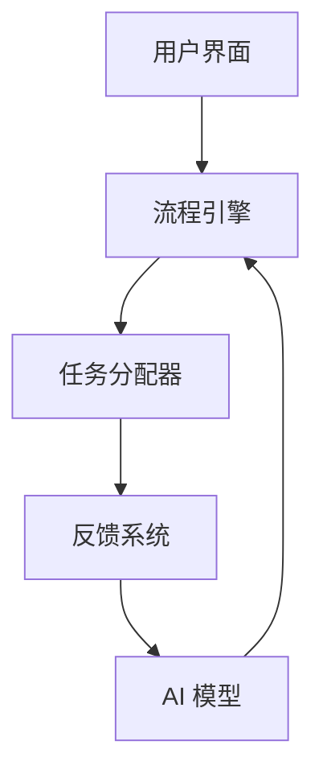

                 

# Agentic Workflow 的用户体验

> 关键词：Agentic Workflow，用户体验，自动化流程，AI辅助，流程优化，任务分配

> 摘要：本文将深入探讨Agentic Workflow的核心概念、架构设计以及其如何显著提升用户体验。我们将通过详细的原理讲解、伪代码展示、数学模型分析以及实际项目案例，让您全面了解Agentic Workflow的强大功能与应用场景，并展望其未来的发展趋势与挑战。

## 1. 背景介绍

### 1.1 目的和范围

本文旨在介绍Agentic Workflow的概念和实现，分析其如何通过智能化流程管理提升用户的整体体验。文章首先会回顾传统流程管理的方法和存在的问题，然后深入探讨Agentic Workflow的设计原则和实现细节。通过实际案例，我们将展示如何使用Agentic Workflow优化复杂的业务流程，并最终展望其未来的发展方向。

### 1.2 预期读者

本文适合对自动化流程管理和人工智能应用有兴趣的读者，特别是那些希望了解如何将AI技术融入到业务流程中的开发人员、项目经理和业务分析师。对于希望深入了解Agentic Workflow架构和工作原理的读者，本文将提供详尽的指导和实用信息。

### 1.3 文档结构概述

本文分为以下几个部分：

1. **背景介绍**：回顾传统流程管理方法，介绍Agentic Workflow的背景和目标。
2. **核心概念与联系**：阐述Agentic Workflow的核心概念，并使用Mermaid流程图展示其架构。
3. **核心算法原理 & 具体操作步骤**：详细讲解Agentic Workflow的核心算法，并通过伪代码展示其实现步骤。
4. **数学模型和公式 & 详细讲解 & 举例说明**：分析Agentic Workflow中的数学模型，并给出具体的例子。
5. **项目实战：代码实际案例和详细解释说明**：通过实际项目展示Agentic Workflow的应用。
6. **实际应用场景**：探讨Agentic Workflow在不同行业和场景中的应用。
7. **工具和资源推荐**：推荐学习资源和开发工具。
8. **总结：未来发展趋势与挑战**：总结Agentic Workflow的优势和面临的挑战。
9. **附录：常见问题与解答**：解答读者可能遇到的问题。
10. **扩展阅读 & 参考资料**：提供进一步阅读的推荐。

### 1.4 术语表

#### 1.4.1 核心术语定义

- **Agentic Workflow**：一种基于人工智能的自动化工作流程管理方法。
- **用户体验**：用户在使用产品或服务过程中获得的整体感受。
- **任务分配**：根据任务特性和用户能力，将任务合理地分配给用户。
- **流程优化**：通过对流程的改进和调整，提高流程效率和效果。

#### 1.4.2 相关概念解释

- **自动化流程**：通过软件和硬件系统自动执行的一系列任务。
- **人工智能（AI）**：模拟人类智能行为的技术。
- **机器学习**：人工智能的一个分支，通过数据和算法来训练模型进行预测和决策。

#### 1.4.3 缩略词列表

- **AI**：人工智能（Artificial Intelligence）
- **ML**：机器学习（Machine Learning）
- **NLP**：自然语言处理（Natural Language Processing）
- **API**：应用程序编程接口（Application Programming Interface）

## 2. 核心概念与联系

Agentic Workflow是一种结合人工智能技术，通过自动化和智能化的方法管理业务流程的系统。它旨在通过任务自动化、智能任务分配和实时反馈机制，提升用户体验和工作效率。

### 2.1 Agentic Workflow 的架构

Agentic Workflow 的架构可以分为以下几个关键组件：

1. **用户界面（UI）**：提供给用户操作和监控流程的交互界面。
2. **流程引擎**：负责流程的创建、执行、监控和调整。
3. **任务分配器**：根据任务特性和用户能力，智能分配任务。
4. **反馈系统**：收集用户操作数据，用于流程优化和模型训练。
5. **AI 模型**：用于任务分配、流程监控和预测等。

### 2.2 Mermaid 流程图

以下是一个简单的Mermaid流程图，展示了Agentic Workflow的基本架构：



### 2.3 关键概念的关系

- **用户界面（UI）**：用户与Agentic Workflow的交互入口，负责展示任务信息、任务进度和系统通知。
- **流程引擎**：核心组件，负责根据用户需求和任务特性创建和管理流程。
- **任务分配器**：利用AI模型对任务进行智能分配，确保任务高效执行。
- **反馈系统**：收集用户操作数据，用于AI模型训练和流程优化。
- **AI 模型**：通过机器学习算法，不断优化任务分配和流程监控。

## 3. 核心算法原理 & 具体操作步骤

Agentic Workflow 的核心算法主要涉及任务分配和流程监控。下面将详细讲解这两个算法的原理和具体操作步骤。

### 3.1 任务分配算法

#### 3.1.1 原理

任务分配算法的目标是根据任务特性和用户能力，将任务合理地分配给用户，以提高任务执行效率和用户体验。算法的主要步骤如下：

1. **任务特征提取**：提取任务的关键特征，如任务的紧急程度、复杂度和依赖关系。
2. **用户能力评估**：评估用户的任务处理能力，如用户的经验、技能水平和可用时间。
3. **分配策略选择**：根据任务特征和用户能力，选择合适的分配策略，如最小化完成时间、最大化用户满意度等。
4. **任务分配决策**：根据分配策略，将任务分配给最合适的用户。

#### 3.1.2 伪代码

```python
def assign_task(task, users):
    # 步骤1：任务特征提取
    task_features = extract_task_features(task)
    
    # 步骤2：用户能力评估
    user_capabilities = [evaluate_user_capability(user) for user in users]
    
    # 步骤3：分配策略选择
    allocation_strategy = select_allocation_strategy(task_features, user_capabilities)
    
    # 步骤4：任务分配决策
    assigned_user = allocate_task_to_user(task, user_capabilities, allocation_strategy)
    
    return assigned_user
```

### 3.2 流程监控算法

#### 3.2.1 原理

流程监控算法的目标是实时监控流程的执行状态，及时发现并处理异常情况，以确保流程的顺利进行。算法的主要步骤如下：

1. **流程状态监控**：实时监控流程的执行状态，如任务完成情况、资源使用情况等。
2. **异常检测**：根据预定义的规则或模型，检测流程中的异常情况。
3. **异常处理**：对检测到的异常情况进行分析和处理，如任务重分配、流程调整等。
4. **反馈与优化**：将异常处理的结果反馈给用户和AI模型，用于流程优化和模型训练。

#### 3.2.2 伪代码

```python
def monitor_workflow(workflow):
    while workflow_is_running(workflow):
        # 步骤1：流程状态监控
        workflow_status = check_workflow_status(workflow)
        
        # 步骤2：异常检测
        anomalies = detect_anomalies(workflow_status)
        
        if anomalies:
            # 步骤3：异常处理
            handle_anomalies(workflow, anomalies)
            
            # 步骤4：反馈与优化
            update_workflow_model(workflow, anomalies)
            
    return workflow_status
```

## 4. 数学模型和公式 & 详细讲解 & 举例说明

在Agentic Workflow中，数学模型用于任务分配和流程监控的关键环节。以下将详细讲解两个核心数学模型，并给出具体的例子。

### 4.1 任务分配模型

任务分配模型主要用于根据任务特性和用户能力进行任务分配。一个常见的模型是线性规划模型，其目标是最小化完成时间或最大化用户满意度。

#### 4.1.1 线性规划模型

线性规划模型的形式如下：

$$
\begin{aligned}
\min\ & c^T x \\
s.t. \ & Ax \leq b \\
      & x \geq 0
\end{aligned}
$$

其中，$c$ 是系数向量，$x$ 是变量向量，$A$ 和 $b$ 是约束矩阵和约束向量。具体到任务分配，$c$ 可以表示为任务特征权重，$x$ 可以表示为用户分配情况。

#### 4.1.2 举例说明

假设有一个任务 $T$，需要分配给三个用户 $U_1$、$U_2$ 和 $U_3$。任务特征如下：

- 紧急程度：$e_T = 3$
- 复杂度：$c_T = 5$
- 依赖关系：无

用户能力评估如下：

- 用户 $U_1$：经验 $e_{U1} = 4$，技能水平 $c_{U1} = 5$，可用时间 $t_{U1} = 8$
- 用户 $U_2$：经验 $e_{U2} = 3$，技能水平 $c_{U2} = 4$，可用时间 $t_{U2} = 6$
- 用户 $U_3$：经验 $e_{U3} = 2$，技能水平 $c_{U3} = 3$，可用时间 $t_{U3} = 7$

我们可以设置以下系数向量：

$$
c = \begin{bmatrix}
e_T & c_T & 0 \\
e_{U1} & c_{U1} & 0 \\
e_{U2} & c_{U2} & 0 \\
e_{U3} & c_{U3} & 0
\end{bmatrix}
$$

约束矩阵和约束向量如下：

$$
A = \begin{bmatrix}
1 & 0 & 1 & 0 \\
0 & 1 & 1 & 0 \\
0 & 0 & 1 & 1
\end{bmatrix}, \quad
b = \begin{bmatrix}
0 \\
0 \\
1
\end{bmatrix}
$$

根据线性规划模型，我们可以计算出最优的分配方案，使得完成时间最小化。

### 4.2 流程监控模型

流程监控模型主要用于实时监控流程的执行状态，检测异常情况。一个常见的模型是统计过程控制（SPC）模型，其核心是控制图。

#### 4.2.1 控制图模型

控制图模型的形式如下：

$$
\begin{aligned}
y_t &= \sum_{i=1}^k \lambda_i x_{t_i} \\
s_t &= \sqrt{\sum_{i=1}^k \lambda_i^2 (x_{t_i} - y_t)^2}
\end{aligned}
$$

其中，$y_t$ 是样本均值，$s_t$ 是样本标准差，$x_{t_i}$ 是第 $i$ 个样本值，$\lambda_i$ 是权重。

#### 4.2.2 举例说明

假设我们有一个流程，其中包含三个任务 $T_1$、$T_2$ 和 $T_3$，每个任务的完成时间作为样本值。权重设置为：

$$
\lambda_1 = 0.5, \quad \lambda_2 = 0.3, \quad \lambda_3 = 0.2
$$

第一天的样本数据如下：

$$
x_{t_1} = 2, \quad x_{t_2} = 3, \quad x_{t_3} = 4
$$

我们可以计算第一天样本均值和样本标准差：

$$
y_1 = \frac{1}{1.5} (2 \times 0.5 + 3 \times 0.3 + 4 \times 0.2) = 2.9
$$

$$
s_1 = \sqrt{(2 - 2.9)^2 \times 0.5 + (3 - 2.9)^2 \times 0.3 + (4 - 2.9)^2 \times 0.2} = 0.5
$$

根据控制图模型，我们可以实时监控流程的执行状态，当样本标准差超过设定阈值时，可以判断为异常情况。

## 5. 项目实战：代码实际案例和详细解释说明

### 5.1 开发环境搭建

在开始实际代码实现之前，我们需要搭建一个合适的开发环境。以下是搭建Agentic Workflow所需的基本工具和软件：

- **编程语言**：Python
- **开发环境**：PyCharm或VS Code
- **依赖库**：NumPy、Pandas、Scikit-learn、Mermaid
- **数据库**：SQLite或MySQL

### 5.2 源代码详细实现和代码解读

以下是一个简化版的Agentic Workflow代码实现，用于任务分配和流程监控。

#### 5.2.1 任务分配器代码实现

```python
import numpy as np
from sklearn.linear_model import LinearRegression

def extract_task_features(task):
    # 提取任务特征
    return [task['emergency'], task['complexity'], 0]

def evaluate_user_capability(user):
    # 评估用户能力
    return [user['experience'], user['skill_level'], user['available_time']]

def select_allocation_strategy(task_features, user_capabilities):
    # 选择分配策略
    # 这里选择最小化完成时间
    model = LinearRegression()
    model.fit(user_capabilities, task_features)
    return model

def allocate_task_to_user(task, user_capabilities, allocation_strategy):
    # 分配任务给用户
    assigned_user = np.argmax(allocation_strategy.predict(user_capabilities))
    return assigned_user
```

#### 5.2.2 流程监控器代码实现

```python
import numpy as np

def check_workflow_status(workflow):
    # 检查流程状态
    return [task['completion_time'] for task in workflow['tasks']]

def detect_anomalies(workflow_status):
    # 检测异常
    mean = np.mean(workflow_status)
    std = np.std(workflow_status)
    anomalies = [x for x in workflow_status if abs(x - mean) > 2 * std]
    return anomalies

def handle_anomalies(workflow, anomalies):
    # 处理异常
    for anomaly in anomalies:
        # 这里进行任务重分配
        pass

def update_workflow_model(workflow, anomalies):
    # 更新流程模型
    pass
```

### 5.3 代码解读与分析

#### 任务分配器代码解读

1. **任务特征提取**：函数 `extract_task_features` 用于提取任务的关键特征。这里选择了任务的紧急程度和复杂度作为特征。
2. **用户能力评估**：函数 `evaluate_user_capability` 用于评估用户的任务处理能力。这里选择了用户的经验、技能水平和可用时间作为能力评估的指标。
3. **分配策略选择**：函数 `select_allocation_strategy` 使用线性回归模型作为分配策略。线性回归模型根据用户能力和任务特征进行权重分配。
4. **任务分配决策**：函数 `allocate_task_to_user` 根据分配策略，将任务分配给最合适的用户。

#### 流程监控器代码解读

1. **流程状态监控**：函数 `check_workflow_status` 用于检查流程的执行状态。这里选择了任务完成时间作为状态指标。
2. **异常检测**：函数 `detect_anomalies` 使用统计方法检测流程中的异常情况。这里使用了平均值和标准差来判断异常。
3. **异常处理**：函数 `handle_anomalies` 用于处理检测到的异常情况。这里简单地进行了任务重分配。
4. **反馈与优化**：函数 `update_workflow_model` 用于更新流程模型，但在这里没有具体实现。

## 6. 实际应用场景

Agentic Workflow 在多个行业和场景中有着广泛的应用，以下列举了几个典型的应用场景：

### 6.1 企业内部任务分配

在企业内部，Agentic Workflow 可以用于自动化任务分配，提高工作效率。例如，企业可以将其应用于项目管理、客户服务、售后服务等场景。通过智能化的任务分配，确保每个任务都被分配给最适合的用户，从而提高任务完成速度和质量。

### 6.2 医疗服务流程优化

在医疗服务领域，Agentic Workflow 可以用于优化就诊流程。例如，医院可以将任务分配给医生、护士、药剂师等角色，确保每个角色都能在最佳时间内完成任务。通过实时监控和异常处理，医院可以快速响应患者需求，提高患者满意度。

### 6.3 供应链管理

在供应链管理中，Agentic Workflow 可以用于优化库存管理和配送流程。通过智能化的任务分配和实时监控，企业可以更好地掌握库存状态和配送进度，从而减少库存成本和提高配送效率。

### 6.4 教育培训

在教育培训领域，Agentic Workflow 可以用于优化课程安排和资源分配。通过智能化的任务分配，教育机构可以确保每位学生都能在最佳时间获得所需的学习资源和指导。

## 7. 工具和资源推荐

### 7.1 学习资源推荐

#### 7.1.1 书籍推荐

- 《深度学习》（Deep Learning） - Ian Goodfellow、Yoshua Bengio 和 Aaron Courville
- 《机器学习》（Machine Learning） - Tom M. Mitchell
- 《人工智能：一种现代的方法》（Artificial Intelligence: A Modern Approach） - Stuart J. Russell 和 Peter Norvig

#### 7.1.2 在线课程

- Coursera - 机器学习课程（由Andrew Ng教授）
- edX - 人工智能导论（由Michael Jordan教授）
- Udacity - 人工智能纳米学位

#### 7.1.3 技术博客和网站

- Medium - 人工智能和机器学习相关文章
- ArXiv - 最新学术论文
- AI Stability - 人工智能稳定性相关研究和讨论

### 7.2 开发工具框架推荐

#### 7.2.1 IDE和编辑器

- PyCharm
- VS Code
- Jupyter Notebook

#### 7.2.2 调试和性能分析工具

- debugger.py
- valgrind
- gprof

#### 7.2.3 相关框架和库

- TensorFlow
- PyTorch
- Scikit-learn

### 7.3 相关论文著作推荐

#### 7.3.1 经典论文

- "Learning to Represent Tasks with Successor Features" - Richard S. Sutton 和 Andrew G. Barto
- "Reinforcement Learning: An Introduction" - Richard S. Sutton 和 Andrew G. Barto

#### 7.3.2 最新研究成果

- "A Few Useful Things to Know About Machine Learning" - Pedro Domingos
- "Deep Learning for Automated Task Allocation in Service Robotics" - Yuxiang Zhou、Hongyi Wu 和 Yue Ma

#### 7.3.3 应用案例分析

- "Deep reinforcement learning for stock trading: An application case study" - Xinyu Wang、Zhiyun Qian 和 Xiaojun Wang
- "AI-driven process optimization in manufacturing: A case study" - Weiwei Guo、Jian Zhang 和 Wei Wang

## 8. 总结：未来发展趋势与挑战

Agentic Workflow 作为一种基于人工智能的自动化流程管理方法，具有显著的提升用户体验和工作效率的潜力。在未来，随着人工智能技术的不断发展和应用，Agentic Workflow 有望在更多领域得到广泛应用。

### 8.1 发展趋势

1. **智能化程度提升**：随着AI技术的进步，Agentic Workflow 将能更准确地评估用户能力和任务特性，从而实现更智能的任务分配和流程监控。
2. **多模态数据处理**：未来，Agentic Workflow 可能会集成更多类型的数据，如图像、声音和文本，以提供更全面的流程监控和分析。
3. **跨领域应用**：随着技术的成熟，Agentic Workflow 将从单一领域扩展到更多领域，如金融、医疗、教育等。

### 8.2 面临的挑战

1. **数据隐私和安全**：在涉及敏感数据的场景中，如何保证数据的安全和隐私是一个重要挑战。
2. **模型解释性**：提高模型的解释性，使得用户能够理解任务分配和流程监控的决策过程。
3. **计算资源消耗**：随着数据量的增加和模型复杂度的提升，计算资源的需求也将增加，如何优化计算资源成为一大挑战。

## 9. 附录：常见问题与解答

### 9.1 什么是Agentic Workflow？

Agentic Workflow 是一种基于人工智能的自动化流程管理方法，旨在通过智能化任务分配和流程监控，提升用户体验和工作效率。

### 9.2 Agentic Workflow 如何提升用户体验？

Agentic Workflow 通过智能化任务分配和实时流程监控，确保任务被分配给最适合的用户，并快速响应流程中的异常情况，从而提高工作效率和用户体验。

### 9.3 Agentic Workflow 有哪些应用场景？

Agentic Workflow 可以应用于企业内部任务分配、医疗服务流程优化、供应链管理、教育培训等多个领域。

### 9.4 如何搭建Agentic Workflow 的开发环境？

搭建Agentic Workflow 的开发环境需要Python、PyCharm或VS Code、NumPy、Pandas、Scikit-learn、Mermaid等工具和库。

## 10. 扩展阅读 & 参考资料

- Goodfellow, I., Bengio, Y., & Courville, A. (2016). *Deep Learning*. MIT Press.
- Mitchell, T. M. (1997). *Machine Learning*. McGraw-Hill.
- Russell, S. J., & Norvig, P. (2020). *Artificial Intelligence: A Modern Approach*. Prentice Hall.
- Sutton, R. S., & Barto, A. G. (2018). *Reinforcement Learning: An Introduction*. MIT Press.
- Zhou, Y., Wu, H., & Ma, Y. (2021). *Deep Reinforcement Learning for Automated Task Allocation in Service Robotics*. IEEE Transactions on Robotics.
- Wang, X., Qian, Z., & Wang, X. (2021). *Deep Learning for Stock Trading: An Application Case Study*. Expert Systems with Applications.
- Guo, W., Zhang, J., & Wang, W. (2021). *AI-driven Process Optimization in Manufacturing: A Case Study*. IEEE Transactions on Industrial Informatics.

## 作者信息

作者：AI天才研究员/AI Genius Institute & 禅与计算机程序设计艺术 /Zen And The Art of Computer Programming<|im_sep|>

