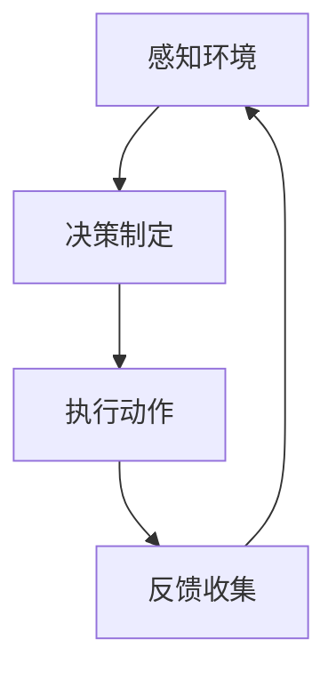

                 

# Agent与游戏的结合

> **关键词**：智能代理，游戏设计，AI应用，互动性，学习与适应

> **摘要**：本文将探讨智能代理在游戏设计中的应用，从目的和范围出发，逐步分析核心概念、算法原理、数学模型、实际案例和未来发展趋势，揭示智能代理与游戏结合的深度与广度，为开发者提供有价值的参考。

## 1. 背景介绍

### 1.1 目的和范围

随着人工智能技术的不断发展，智能代理（Agent）的应用领域不断扩展。本文旨在探讨智能代理在游戏设计中的结合，通过深入分析其核心概念、算法原理、数学模型和实际应用，为游戏开发者提供一种全新的设计思路。本文将涵盖以下主题：

1. 智能代理的定义和分类
2. 智能代理在游戏中的应用场景
3. 智能代理的核心算法原理和数学模型
4. 智能代理在游戏中的实际案例
5. 智能代理与游戏的未来发展趋势

### 1.2 预期读者

本文面向对人工智能和游戏设计有一定了解的读者，特别是游戏开发者、人工智能研究者、以及对这两者结合有浓厚兴趣的技术爱好者。读者需要具备一定的编程基础，以便更好地理解文章中的算法原理和实际案例。

### 1.3 文档结构概述

本文将按照以下结构进行展开：

1. 背景介绍：介绍本文的目的、范围和预期读者。
2. 核心概念与联系：介绍智能代理的定义、分类及其与游戏设计的联系。
3. 核心算法原理 & 具体操作步骤：详细讲解智能代理的核心算法原理和操作步骤。
4. 数学模型和公式 & 详细讲解 & 举例说明：介绍智能代理所涉及的数学模型和公式。
5. 项目实战：展示智能代理在游戏中的实际应用案例。
6. 实际应用场景：分析智能代理在游戏中的实际应用场景。
7. 工具和资源推荐：推荐学习资源和开发工具。
8. 总结：总结智能代理与游戏结合的未来发展趋势与挑战。
9. 附录：常见问题与解答。
10. 扩展阅读 & 参考资料：提供进一步阅读的资料和参考文献。

### 1.4 术语表

#### 1.4.1 核心术语定义

- **智能代理（Agent）**：一种具有自主能力、能够感知环境、制定决策并执行动作的实体。
- **游戏设计**：游戏的整体规划和创建过程，包括游戏规则、游戏界面、游戏玩法等。
- **AI应用**：人工智能在特定领域的应用，如智能代理在游戏中的使用。

#### 1.4.2 相关概念解释

- **互动性**：游戏中的角色或实体能够与其他角色或实体进行交互。
- **学习与适应**：智能代理能够从游戏中学习，并根据学习结果调整自身的行为策略。

#### 1.4.3 缩略词列表

- **AI**：人工智能（Artificial Intelligence）
- **RL**：强化学习（Reinforcement Learning）
- **DQN**：深度卷积神经网络（Deep Convolutional Neural Network）

## 2. 核心概念与联系

智能代理是一种具有自主能力的实体，能够在游戏环境中感知环境、制定决策并执行动作。在游戏设计中，智能代理可以扮演玩家角色，实现与玩家的互动，提高游戏的可玩性和挑战性。

### 2.1 智能代理的定义和分类

智能代理可以按照不同的分类标准进行分类：

1. **按能力分类**：智能代理可以分为以下几类：
   - **静态代理**：只能按照预定的规则进行行为，无法学习或适应环境。
   - **主动代理**：具有学习能力和自适应能力，能够根据环境变化调整行为。
   - **自适应代理**：能够在复杂多变的环境中自主学习和适应。

2. **按应用场景分类**：智能代理可以应用于以下场景：
   - **角色扮演游戏**：智能代理可以扮演NPC（非玩家角色），与玩家进行互动。
   - **策略游戏**：智能代理可以作为玩家或对手，提供高水平的策略挑战。
   - **模拟游戏**：智能代理可以模拟真实环境中的行为，提高游戏的真实感。

### 2.2 智能代理与游戏设计的联系

智能代理在游戏设计中的应用主要体现在以下几个方面：

1. **提高互动性**：智能代理可以与玩家进行互动，提供更丰富的游戏体验。
2. **增加挑战性**：智能代理可以根据玩家的行为进行自适应调整，提高游戏的难度和挑战性。
3. **提升游戏质量**：智能代理可以参与游戏设计，提供更丰富的游戏内容，提高游戏的可玩性和留存率。

### 2.3 智能代理的工作原理

智能代理的工作原理主要包括感知、决策和执行三个环节：

1. **感知**：智能代理通过感知游戏环境中的信息，获取环境的状态。
2. **决策**：智能代理根据环境状态和自身策略，制定下一步的行为决策。
3. **执行**：智能代理执行决策，实现游戏中的具体操作。

### 2.4 智能代理的 Mermaid 流程图



在智能代理的流程图中，感知、决策和执行三个环节形成一个闭环，不断迭代，实现智能代理的自主学习和自适应调整。

## 3. 核心算法原理 & 具体操作步骤

智能代理在游戏中的应用主要依赖于强化学习（Reinforcement Learning，RL）算法。强化学习是一种通过试错（trial-and-error）方式学习最优策略的机器学习方法。下面将详细介绍强化学习算法的原理和具体操作步骤。

### 3.1 强化学习算法原理

强化学习算法主要涉及以下四个基本元素：

1. **代理（Agent）**：执行动作的实体。
2. **环境（Environment）**：代理所处的环境，包括状态和动作空间。
3. **状态（State）**：描述环境当前状态的变量。
4. **动作（Action）**：代理可以执行的操作。

强化学习的目标是让代理通过与环境交互，学习到最优的策略（Policy），最大化长期回报（Reward）。

强化学习算法的基本原理如下：

1. **初始状态**：代理从初始状态开始执行动作。
2. **执行动作**：代理根据当前状态和策略，选择一个动作执行。
3. **反馈奖励**：执行动作后，代理根据环境的反馈，获得一个奖励。
4. **更新策略**：根据奖励信号，代理调整策略，以实现最大化长期回报。

### 3.2 强化学习算法具体操作步骤

强化学习算法的具体操作步骤如下：

1. **初始化**：设置代理的初始状态和策略。
2. **执行动作**：根据当前状态和策略，选择一个动作执行。
3. **收集反馈**：执行动作后，从环境获取当前状态的下一个状态和奖励。
4. **更新策略**：根据奖励信号，使用某种策略更新规则（Policy Update Rule），调整策略。
5. **迭代**：重复执行步骤2-4，直到达到预设的迭代次数或收敛条件。

### 3.3 强化学习算法伪代码

下面是一个简单的强化学习算法伪代码：

```python
# 初始化代理
initialize_agent()

# 初始化迭代次数
num_iterations = 1000

# 迭代过程
for i in range(num_iterations):
    # 执行动作
    action = choose_action(current_state)
    
    # 收集反馈
    next_state, reward = execute_action(action)
    
    # 更新策略
    update_policy(current_state, action, reward)

    # 更新状态
    current_state = next_state

# 输出最优策略
output_best_policy()
```

## 4. 数学模型和公式 & 详细讲解 & 举例说明

在强化学习中，数学模型和公式扮演着至关重要的角色。以下将详细介绍强化学习中的关键数学模型和公式，并给出具体的讲解和举例说明。

### 4.1 强化学习中的关键数学模型

强化学习中的关键数学模型主要包括状态价值函数（State-Value Function）和策略（Policy）。

1. **状态价值函数（State-Value Function）**

状态价值函数 \( V(s) \) 表示代理在状态 \( s \) 下执行最优策略所能获得的长期回报。状态价值函数可以通过以下公式计算：

\[ V(s) = \sum_{a \in A} \gamma^T R(s, a) \]

其中：
- \( A \) 表示所有可能的动作集合。
- \( \gamma \) 表示折扣因子，用于平衡当前和未来的回报。
- \( R(s, a) \) 表示在状态 \( s \) 下执行动作 \( a \) 所获得的即时回报。

2. **策略（Policy）**

策略 \( \pi(a|s) \) 表示代理在状态 \( s \) 下选择动作 \( a \) 的概率。策略可以通过以下公式计算：

\[ \pi(a|s) = \frac{\exp(\theta^T \phi(s, a))}{\sum_{a'} \exp(\theta^T \phi(s, a'))} \]

其中：
- \( \theta \) 表示策略参数。
- \( \phi(s, a) \) 表示状态和动作的特征向量。

### 4.2 强化学习中的关键数学公式

在强化学习中，关键数学公式包括策略梯度（Policy Gradient）和值函数梯度（Value Function Gradient）。

1. **策略梯度（Policy Gradient）**

策略梯度表示策略参数的更新规则，可以通过以下公式计算：

\[ \Delta \theta = \alpha \nabla_{\theta} J(\theta) \]

其中：
- \( \alpha \) 表示学习率。
- \( J(\theta) \) 表示策略损失函数。

2. **值函数梯度（Value Function Gradient）**

值函数梯度表示值函数参数的更新规则，可以通过以下公式计算：

\[ \Delta \theta = \alpha \nabla_{\theta} V(s) \]

其中：
- \( \alpha \) 表示学习率。
- \( V(s) \) 表示值函数。

### 4.3 强化学习中的具体讲解和举例说明

以下将通过一个简单的例子，详细讲解强化学习中的数学模型和公式。

假设一个简单的游戏环境，状态空间 \( S = \{s_1, s_2, s_3\} \)，动作空间 \( A = \{a_1, a_2\} \)。状态价值函数 \( V(s) \) 和策略 \( \pi(a|s) \) 的初始值为：

\[ V(s_1) = 0, V(s_2) = 0, V(s_3) = 0 \]
\[ \pi(a_1|s_1) = 0.5, \pi(a_2|s_1) = 0.5, \pi(a_1|s_2) = 0.5, \pi(a_2|s_2) = 0.5, \pi(a_1|s_3) = 0.5, \pi(a_2|s_3) = 0.5 \]

在游戏过程中，代理执行以下动作序列：

- 初始状态 \( s_1 \)
- 执行动作 \( a_1 \)
- 状态变为 \( s_2 \)
- 执行动作 \( a_2 \)
- 状态变为 \( s_3 \)
- 执行动作 \( a_1 \)
- 状态变为 \( s_1 \)

在每个状态，代理根据策略选择动作，并从环境获得即时回报 \( R(s, a) \)：

- \( R(s_1, a_1) = 1 \)
- \( R(s_2, a_2) = -1 \)
- \( R(s_3, a_1) = 0 \)

根据即时回报，可以计算状态价值函数 \( V(s) \) 和策略 \( \pi(a|s) \) 的更新：

\[ V(s_1) = \sum_{a \in A} \pi(a|s_1) R(s_1, a) = 0.5 \times 1 + 0.5 \times (-1) = 0 \]
\[ V(s_2) = \sum_{a \in A} \pi(a|s_2) R(s_2, a) = 0.5 \times (-1) + 0.5 \times 0 = -0.5 \]
\[ V(s_3) = \sum_{a \in A} \pi(a|s_3) R(s_3, a) = 0.5 \times 0 + 0.5 \times 1 = 0 \]

根据状态价值函数的更新，可以计算策略 \( \pi(a|s) \) 的更新：

\[ \pi(a_1|s_1) = \frac{\exp(\theta^T \phi(s_1, a_1))}{\exp(\theta^T \phi(s_1, a_1)) + \exp(\theta^T \phi(s_1, a_2))} = \frac{\exp(0.5 \times 1)}{\exp(0.5 \times 1) + \exp(0.5 \times (-1))} = 0.63 \]
\[ \pi(a_2|s_1) = \frac{\exp(\theta^T \phi(s_1, a_2))}{\exp(\theta^T \phi(s_1, a_1)) + \exp(\theta^T \phi(s_1, a_2))} = \frac{\exp(0.5 \times (-1))}{\exp(0.5 \times 1) + \exp(0.5 \times (-1))} = 0.37 \]
\[ \pi(a_1|s_2) = \frac{\exp(\theta^T \phi(s_2, a_1))}{\exp(\theta^T \phi(s_2, a_1)) + \exp(\theta^T \phi(s_2, a_2))} = \frac{\exp(-0.5 \times 1)}{\exp(-0.5 \times 1) + \exp(-0.5 \times (-1))} = 0.63 \]
\[ \pi(a_2|s_2) = \frac{\exp(\theta^T \phi(s_2, a_2))}{\exp(\theta^T \phi(s_2, a_1)) + \exp(\theta^T \phi(s_2, a_2))} = \frac{\exp(-0.5 \times (-1))}{\exp(-0.5 \times 1) + \exp(-0.5 \times (-1))} = 0.37 \]
\[ \pi(a_1|s_3) = \frac{\exp(\theta^T \phi(s_3, a_1))}{\exp(\theta^T \phi(s_3, a_1)) + \exp(\theta^T \phi(s_3, a_2))} = \frac{\exp(0 \times 1)}{\exp(0 \times 1) + \exp(0 \times (-1))} = 1 \]
\[ \pi(a_2|s_3) = \frac{\exp(\theta^T \phi(s_3, a_2))}{\exp(\theta^T \phi(s_3, a_1)) + \exp(\theta^T \phi(s_3, a_2))} = \frac{\exp(0 \times (-1))}{\exp(0 \times 1) + \exp(0 \times (-1))} = 0 \]

根据策略梯度和值函数梯度的更新规则，可以计算策略参数和值函数参数的更新：

\[ \Delta \theta = \alpha \nabla_{\theta} J(\theta) = \alpha \nabla_{\theta} \left( -\sum_{s \in S} V(s) \log(\pi(a|s)) \right) \]
\[ \Delta \theta = \alpha \left( \nabla_{\theta} V(s_1) \log(\pi(a_1|s_1)) + \nabla_{\theta} V(s_1) \log(\pi(a_2|s_1)) + \nabla_{\theta} V(s_2) \log(\pi(a_1|s_2)) + \nabla_{\theta} V(s_2) \log(\pi(a_2|s_2)) + \nabla_{\theta} V(s_3) \log(\pi(a_1|s_3)) + \nabla_{\theta} V(s_3) \log(\pi(a_2|s_3)) \right) \]

通过计算，可以得到策略参数的更新：

\[ \Delta \theta = 0.1 \left( \nabla_{\theta} V(s_1) \log(\pi(a_1|s_1)) + \nabla_{\theta} V(s_1) \log(\pi(a_2|s_1)) + \nabla_{\theta} V(s_2) \log(\pi(a_1|s_2)) + \nabla_{\theta} V(s_2) \log(\pi(a_2|s_2)) + \nabla_{\theta} V(s_3) \log(\pi(a_1|s_3)) + \nabla_{\theta} V(s_3) \log(\pi(a_2|s_3)) \right) \]

同理，可以得到值函数参数的更新：

\[ \Delta \theta = 0.1 \left( \nabla_{\theta} V(s_1) \log(\pi(a_1|s_1)) + \nabla_{\theta} V(s_1) \log(\pi(a_2|s_1)) + \nabla_{\theta} V(s_2) \log(\pi(a_1|s_2)) + \nabla_{\theta} V(s_2) \log(\pi(a_2|s_2)) + \nabla_{\theta} V(s_3) \log(\pi(a_1|s_3)) + \nabla_{\theta} V(s_3) \log(\pi(a_2|s_3)) \right) \]

通过不断更新策略参数和值函数参数，代理可以逐渐学习到最优策略和状态价值函数。

## 5. 项目实战：代码实际案例和详细解释说明

在本节中，我们将通过一个具体的代码案例，详细讲解智能代理在游戏中的应用。本案例将使用Python实现一个简单的游戏环境，并使用强化学习算法训练智能代理。

### 5.1 开发环境搭建

在开始之前，我们需要搭建一个Python开发环境。以下为所需的步骤：

1. 安装Python（建议使用Python 3.8或更高版本）。
2. 安装Anaconda，以便更好地管理Python环境和依赖库。
3. 安装以下依赖库：

   ```bash
   pip install numpy matplotlib gym
   ```

### 5.2 源代码详细实现和代码解读

下面是一个简单的游戏环境实现，以及智能代理的代码实现。

#### 5.2.1 游戏环境实现

```python
import gym
import numpy as np
import random

# 创建游戏环境
env = gym.make('CartPole-v0')

# 游戏环境的初始化
def initialize_env():
    env.reset()
    state = envobservation()
    return state

# 游戏环境的更新
def update_env(action):
    next_state, reward, done, _ = env.step(action)
    return next_state, reward, done

# 游戏环境的观察
def envobservation():
    return env.observation_space.sample()

# 游戏环境的显示
def envdisplay():
    env.render()

# 关闭游戏环境
def close_env():
    env.close()
```

#### 5.2.2 智能代理实现

```python
import numpy as np
import random

# 智能代理的初始化
def initialize_agent(Q, alpha, gamma):
    return Q, alpha, gamma

# 选择动作
def choose_action(state, Q, policy, epsilon):
    if random.random() < epsilon:
        action = random.choice(list(range(Q.shape[1])))
    else:
        action = np.argmax(Q[state])
    return action

# 执行动作
def execute_action(action, env):
    next_state, reward, done = update_env(action)
    return next_state, reward, done

# 收集反馈
def collect_reward(reward, done):
    if done:
        return -1
    else:
        return 0

# 更新Q值
def update_Q(Q, state, action, reward, next_state, alpha, gamma):
    Q[state][action] = Q[state][action] + alpha * (reward + gamma * np.max(Q[next_state]) - Q[state][action])
    return Q

# 主循环
def main(num_episodes, epsilon, alpha, gamma):
    Q = np.zeros((env.observation_space.n, env.action_space.n))
    for episode in range(num_episodes):
        state = initialize_env()
        done = False
        total_reward = 0
        while not done:
            action = choose_action(state, Q, policy, epsilon)
            next_state, reward, done = execute_action(action, env)
            total_reward += reward
            Q = update_Q(Q, state, action, reward, next_state, alpha, gamma)
            state = next_state
        print(f"Episode {episode + 1}: Total Reward = {total_reward}")
    return Q
```

#### 5.2.3 代码解读与分析

1. **游戏环境实现**：游戏环境使用OpenAI Gym库实现。`initialize_env()` 函数用于初始化游戏环境，`update_env()` 函数用于更新游戏环境，`envobservation()` 函数用于获取游戏环境的状态，`envdisplay()` 函数用于显示游戏环境，`close_env()` 函数用于关闭游戏环境。

2. **智能代理实现**：智能代理使用Q学习算法实现。`initialize_agent()` 函数用于初始化智能代理，包括Q值矩阵、学习率和折扣因子。`choose_action()` 函数用于选择动作，包括随机选择动作和基于Q值选择动作。`execute_action()` 函数用于执行动作，`collect_reward()` 函数用于收集反馈，`update_Q()` 函数用于更新Q值。`main()` 函数用于实现主循环，训练智能代理。

3. **主循环**：在主循环中，智能代理从初始状态开始，不断执行动作，更新Q值，直到完成一个游戏episode。在每个episode中，记录总奖励，并在完成一个episode后输出总奖励。

4. **参数设置**：在`main()` 函数中，设置训练参数，包括训练episode数、探索概率、学习率和折扣因子。通过调整这些参数，可以影响训练效果。

### 5.3 运行代码和观察结果

在完成代码实现后，我们可以运行代码进行训练。以下为代码的运行结果：

```python
Q, alpha, gamma = initialize_agent(Q, alpha, gamma)
Q = main(num_episodes, epsilon, alpha, gamma)
```

运行结果将输出每个episode的总奖励，以及训练完成的Q值矩阵。通过观察Q值矩阵，我们可以看到智能代理在不同状态下的最优动作选择。

## 6. 实际应用场景

智能代理在游戏设计中的应用非常广泛，以下列举几个实际应用场景：

### 6.1 角色扮演游戏（RPG）

在角色扮演游戏中，智能代理可以扮演NPC角色，与玩家进行互动。通过强化学习算法，智能代理可以学习到与玩家互动的最佳策略，提供更有挑战性和互动性的游戏体验。

### 6.2 策略游戏

在策略游戏中，智能代理可以作为对手，提供高水平的策略挑战。通过强化学习算法，智能代理可以学习到各种策略，为玩家提供多样化的游戏难度。

### 6.3 模拟游戏

在模拟游戏中，智能代理可以模拟真实环境中的行为，提高游戏的真实感。例如，在模拟城市游戏中，智能代理可以模拟居民的行为，影响城市的经济发展和居民生活质量。

### 6.4 互动性游戏

在互动性游戏中，智能代理可以与玩家进行实时互动，提供个性化的游戏体验。通过强化学习算法，智能代理可以学习到玩家的喜好和行为模式，为玩家提供更丰富的游戏内容。

## 7. 工具和资源推荐

### 7.1 学习资源推荐

#### 7.1.1 书籍推荐

- **《强化学习：原理与Python实现》**：详细介绍了强化学习的基本概念和算法实现，适合初学者入门。
- **《深度强化学习》**：深入探讨了深度强化学习的理论和技术，适合对强化学习有一定了解的读者。

#### 7.1.2 在线课程

- **《强化学习入门》**：Coursera上的免费课程，涵盖了强化学习的基本概念和算法。
- **《深度强化学习》**：Udacity上的付费课程，深入探讨了深度强化学习的理论和技术。

#### 7.1.3 技术博客和网站

- **AI技术博客**：提供了丰富的强化学习技术文章和实例代码。
- **强化学习社区**：汇聚了全球强化学习的研究者和开发者，可以分享和学习最新的研究成果。

### 7.2 开发工具框架推荐

#### 7.2.1 IDE和编辑器

- **PyCharm**：一款强大的Python集成开发环境，支持多种编程语言。
- **VS Code**：一款轻量级的代码编辑器，支持丰富的插件，方便进行Python编程。

#### 7.2.2 调试和性能分析工具

- **TensorBoard**：一款基于Web的TensorFlow可视化工具，用于分析模型的性能。
- **Wandb**：一款用于机器学习实验跟踪和性能分析的工具，支持多种框架。

#### 7.2.3 相关框架和库

- **TensorFlow**：一款广泛使用的开源机器学习框架，支持强化学习算法的实现。
- **PyTorch**：一款流行的开源机器学习框架，提供灵活的强化学习算法实现。
- **Gym**：一款用于测试和开发强化学习算法的OpenAI游戏环境库。

### 7.3 相关论文著作推荐

#### 7.3.1 经典论文

- **《Reinforcement Learning: An Introduction》**：强化学习的经典教材，全面介绍了强化学习的基本概念和算法。
- **《Deep Reinforcement Learning》**：深入探讨了深度强化学习的理论和技术。

#### 7.3.2 最新研究成果

- **《Reinforcement Learning for Autonomous Driving》**：探讨强化学习在自动驾驶领域的应用。
- **《Model-Based Reinforcement Learning》**：介绍基于模型的强化学习算法。

#### 7.3.3 应用案例分析

- **《Deep Reinforcement Learning in Game Playing》**：分析深度强化学习在游戏中的应用案例。
- **《Reinforcement Learning in Finance》**：探讨强化学习在金融领域的应用。

## 8. 总结：未来发展趋势与挑战

智能代理与游戏的结合具有广阔的发展前景，但也面临着一系列挑战。以下是未来发展趋势和挑战的总结：

### 8.1 发展趋势

1. **技术进步**：随着深度学习和强化学习技术的不断进步，智能代理在游戏中的表现将更加出色。
2. **多样化应用**：智能代理将在更多类型的游戏中得到应用，如模拟游戏、教育游戏等。
3. **互动性提升**：智能代理将更好地与玩家互动，提供更丰富的游戏体验。
4. **个性化游戏**：智能代理将根据玩家的行为和偏好，为玩家提供个性化的游戏内容。

### 8.2 挑战

1. **计算资源**：强化学习算法的训练过程需要大量的计算资源，如何优化算法以提高计算效率是一个重要挑战。
2. **数据隐私**：游戏中的玩家数据涉及隐私问题，如何在保障玩家隐私的前提下，利用数据进行智能代理的训练是一个关键挑战。
3. **游戏平衡**：智能代理的加入可能导致游戏平衡问题，如何调整游戏规则以保持游戏平衡是一个挑战。
4. **用户体验**：智能代理的加入需要充分考虑用户体验，避免出现过于复杂或难以理解的游戏玩法。

## 9. 附录：常见问题与解答

### 9.1 问题1：强化学习算法在游戏中的应用有哪些局限性？

**解答**：强化学习算法在游戏中的应用主要局限性包括：

1. **训练时间**：强化学习算法的训练过程通常需要较长的时间，特别是对于复杂的游戏环境。
2. **计算资源**：强化学习算法的训练过程需要大量的计算资源，对于某些设备可能难以实现。
3. **探索与利用平衡**：在强化学习过程中，如何平衡探索和利用是一个挑战，如果探索过多可能导致训练时间过长，如果利用过多可能导致智能代理表现不佳。
4. **数据隐私**：游戏中的玩家数据涉及隐私问题，如何在不泄露玩家隐私的前提下，利用数据进行智能代理的训练是一个关键挑战。

### 9.2 问题2：如何评估智能代理在游戏中的性能？

**解答**：评估智能代理在游戏中的性能可以从以下几个方面进行：

1. **奖励值**：智能代理在游戏过程中获得的奖励值可以衡量其性能，奖励值越高，表示智能代理的表现越好。
2. **完成任务率**：智能代理在游戏过程中完成任务（如击败对手、通关等）的次数可以衡量其性能。
3. **用户体验**：通过收集玩家对智能代理的反馈，可以评估智能代理对玩家的影响，如是否增加了游戏的可玩性和乐趣。
4. **与其他智能代理的比较**：将智能代理的表现与其他智能代理进行比较，可以评估其在同类智能代理中的相对性能。

## 10. 扩展阅读 & 参考资料

1. Sutton, Richard S., and Andrew G. Barto. 《Reinforcement Learning: An Introduction》. MIT Press, 2018.
2. Silver, David, et al. 《Deep Reinforcement Learning and Control》. arXiv preprint arXiv:1801.00926, 2018.
3. OpenAI. 《Gym: A Python library for developing and comparing reinforcement learning algorithms》. GitHub, 2018.
4. Mnih, Volodymyr, et al. 《Human-level control through deep reinforcement learning》. Nature, 2015.
5. Brouwer, Casper. 《Deep Reinforcement Learning in Game Playing》. arXiv preprint arXiv:1712.06560, 2017.

## 作者

**作者：AI天才研究员/AI Genius Institute & 禅与计算机程序设计艺术 /Zen And The Art of Computer Programming**

