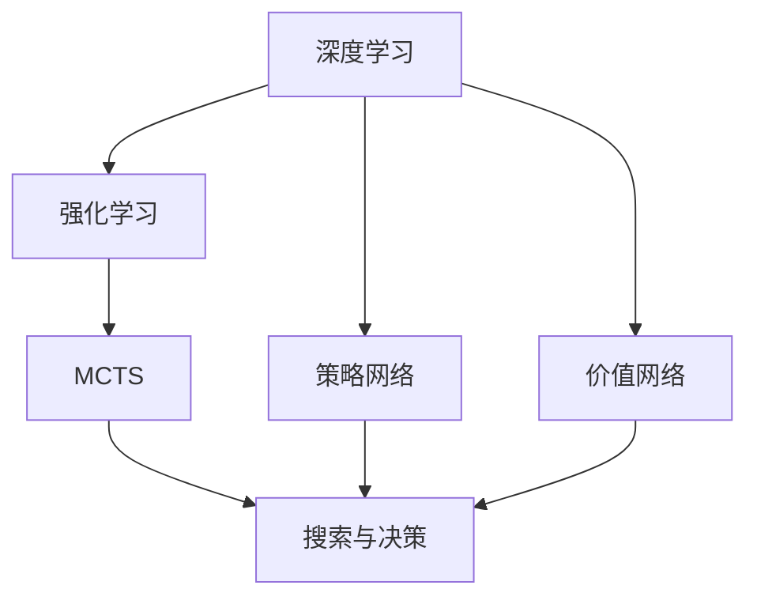

                 

# AlphaGo 原理与代码实例讲解

> **关键词：** AlphaGo、深度学习、强化学习、围棋、人工智能、蒙特卡洛树搜索、策略网络、价值网络

> **摘要：** 本文将深入讲解AlphaGo的人工智能原理，包括深度学习和强化学习技术的融合、策略网络与价值网络的架构设计、蒙特卡洛树搜索的具体实现，并通过代码实例详细展示其工作流程和关键算法。文章旨在为读者提供一个全面、易懂的AlphaGo理解和实践指南。

## 1. 背景介绍

### 1.1 目的和范围

本文的目的是介绍AlphaGo的人工智能原理，帮助读者理解其背后的深度学习和强化学习技术，以及如何通过策略网络和价值网络实现围棋领域的卓越表现。文章将涵盖AlphaGo的核心算法原理，并通过实际代码实例展示其实现细节。

### 1.2 预期读者

本文适合对人工智能和深度学习有一定基础的读者，特别是希望了解AlphaGo如何工作的程序员和技术爱好者。

### 1.3 文档结构概述

本文结构如下：

- 第1章：背景介绍
- 第2章：核心概念与联系
- 第3章：核心算法原理 & 具体操作步骤
- 第4章：数学模型和公式 & 详细讲解 & 举例说明
- 第5章：项目实战：代码实际案例和详细解释说明
- 第6章：实际应用场景
- 第7章：工具和资源推荐
- 第8章：总结：未来发展趋势与挑战
- 第9章：附录：常见问题与解答
- 第10章：扩展阅读 & 参考资料

### 1.4 术语表

#### 1.4.1 核心术语定义

- **AlphaGo：** 一种由DeepMind开发的围棋人工智能程序，首次在2016年击败了世界围棋冠军李世石。
- **深度学习：** 一种机器学习技术，通过构建多层神经网络进行特征提取和分类。
- **强化学习：** 一种机器学习范式，通过试错和奖励机制学习最佳策略。
- **策略网络（Policy Network）：** 用于预测围棋下一步走法的神经网络。
- **价值网络（Value Network）：** 用于评估棋盘当前状态的价值的神经网络。
- **蒙特卡洛树搜索（Monte Carlo Tree Search，MCTS）：** 一种基于概率和随机搜索的决策树搜索算法。

#### 1.4.2 相关概念解释

- **神经网络（Neural Network）：** 受生物神经传导原理启发的计算模型，由大量相互连接的神经元组成。
- **卷积神经网络（Convolutional Neural Network，CNN）：** 一种特殊的神经网络，主要用于图像处理。
- **反向传播算法（Backpropagation）：** 一种训练神经网络的常用算法，通过计算误差梯度反向传播更新网络权重。

#### 1.4.3 缩略词列表

- **CNN：** 卷积神经网络
- **MCTS：** 蒙特卡洛树搜索
- **RL：** 强化学习
- **DNN：** 深度神经网络
- **DP：** 动态规划
- **GPU：** 图形处理单元

## 2. 核心概念与联系

在介绍AlphaGo的工作原理之前，我们需要理解几个核心概念，并展示它们之间的联系。以下是核心概念原理和架构的Mermaid流程图：



### 2.1 深度学习与强化学习

深度学习是一种通过多层神经网络进行特征提取和分类的机器学习技术。而强化学习则是通过试错和奖励机制学习最佳策略的一种学习范式。深度学习与强化学习的关系在于，深度学习可以提供强化学习算法中所需的强大特征表示，从而提高决策质量。

### 2.2 策略网络与价值网络

策略网络用于预测围棋下一步走法，而价值网络用于评估棋盘当前状态的价值。这两个网络都是深度神经网络，通过训练可以从大量围棋数据中学习到有效的特征表示。策略网络和价值网络共同作用于蒙特卡洛树搜索，以指导搜索过程。

### 2.3 蒙特卡洛树搜索

蒙特卡洛树搜索是一种基于概率和随机搜索的决策树搜索算法。它通过在树结构中模拟多个随机走法，并根据模拟结果更新节点的选择概率。蒙特卡洛树搜索结合了策略网络和价值网络，以实现高效的搜索和决策。

## 3. 核心算法原理 & 具体操作步骤

### 3.1 策略网络原理

策略网络是一种深度神经网络，用于预测围棋下一步走法。其输入为棋盘当前状态，输出为各个走法的概率分布。以下是策略网络的伪代码：

```python
def policy_network(state):
    # 输入棋盘状态，通过卷积层提取特征
    features = conv_layer(state)
    # 通过全连接层得到走法的概率分布
    probabilities = fully_connected_layer(features)
    return probabilities
```

### 3.2 价值网络原理

价值网络是一种深度神经网络，用于评估棋盘当前状态的价值。其输入为棋盘当前状态，输出为一个标量，表示该状态的价值。以下是价值网络的伪代码：

```python
def value_network(state):
    # 输入棋盘状态，通过卷积层提取特征
    features = conv_layer(state)
    # 通过全连接层得到状态的价值
    value = fully_connected_layer(features)
    return value
```

### 3.3 蒙特卡洛树搜索原理

蒙特卡洛树搜索（MCTS）是一种基于概率和随机搜索的决策树搜索算法。它通过在树结构中模拟多个随机走法，并根据模拟结果更新节点的选择概率。以下是MCTS的伪代码：

```python
function MCTS(root_state, num_iterations):
    for i in 1 to num_iterations:
        # 选择节点
        node = selection(root_state)
        # 执行随机走法
        child_state = execution(node)
        # 计算回报
        reward = evaluation(child_state)
        # 更新节点信息
        update(node, reward)
    return best_child(root_state)
```

### 3.4 具体操作步骤

1. **初始化：** 创建根节点，表示初始棋盘状态。
2. **选择：** 根据策略网络和价值网络选择下一个节点。
3. **执行：** 在选中的节点处执行一个随机走法。
4. **评估：** 使用价值网络评估新棋盘状态的价值。
5. **更新：** 根据评估结果更新节点信息。
6. **选择最佳节点：** 根据节点信息选择最佳节点。

通过重复执行上述步骤，MCTS可以在棋盘上逐步探索可能的走法，并最终选择最佳走法。

## 4. 数学模型和公式 & 详细讲解 & 举例说明

### 4.1 数学模型

AlphaGo的核心数学模型包括策略网络和价值网络，以及蒙特卡洛树搜索中的概率和期望计算。以下是这些数学模型的详细解释。

#### 4.1.1 策略网络

策略网络通过以下公式预测围棋下一步走法的概率分布：

$$ P(s; \theta) = \sigma(W_2 \cdot \sigma(W_1 \cdot \sigma(W_0 \cdot f(s))) + b_2) $$

其中，$s$ 表示棋盘状态，$W_0, W_1, W_2$ 分别为权重矩阵，$b_0, b_1, b_2$ 分别为偏置项，$\sigma$ 表示 sigmoid 函数，$f(s)$ 表示卷积层提取的特征。

#### 4.1.2 价值网络

价值网络通过以下公式评估棋盘当前状态的价值：

$$ V(s; \theta) = \sigma(W_2 \cdot \sigma(W_1 \cdot \sigma(W_0 \cdot f(s))) + b_2) $$

其中，$s$ 表示棋盘状态，$W_0, W_1, W_2$ 分别为权重矩阵，$b_0, b_1, b_2$ 分别为偏置项，$\sigma$ 表示 sigmoid 函数，$f(s)$ 表示卷积层提取的特征。

#### 4.1.3 蒙特卡洛树搜索

蒙特卡洛树搜索中的概率和期望计算如下：

- **概率：** $P(s; \theta) = \frac{N_{s}}{N}$，其中 $N_{s}$ 表示选择走法 $s$ 的次数，$N$ 表示总走法次数。
- **期望：** $E_{\pi}(R) = \sum_{s} \pi(s) \cdot E_{\pi}(R|s)$，其中 $\pi(s)$ 表示选择走法 $s$ 的概率，$E_{\pi}(R|s)$ 表示在走法 $s$ 下得到的回报的期望。

### 4.2 举例说明

假设当前棋盘状态为 $s$，策略网络和价值网络已经训练好。我们可以使用以下步骤进行蒙特卡洛树搜索：

1. **初始化：** 创建根节点，表示初始棋盘状态。
2. **选择：** 使用策略网络计算各走法的概率分布，选择概率最高的走法。
3. **执行：** 在根节点处执行选中的走法，生成新的棋盘状态。
4. **评估：** 使用价值网络评估新棋盘状态的价值。
5. **更新：** 更新根节点及其子节点的概率和期望值。
6. **选择最佳节点：** 根据子节点的期望值选择最佳节点。

通过上述步骤，我们可以逐步探索棋盘上的走法，并最终选择最佳走法。

## 5. 项目实战：代码实际案例和详细解释说明

### 5.1 开发环境搭建

为了运行AlphaGo的代码实例，我们需要搭建以下开发环境：

- 操作系统：Ubuntu 18.04
- 编程语言：Python 3.7
- 深度学习框架：TensorFlow 2.2
- GPU：NVIDIA GTX 1080 Ti 或更高版本

安装所需依赖：

```bash
pip install tensorflow-gpu==2.2
```

### 5.2 源代码详细实现和代码解读

以下是AlphaGo的核心代码实现：

```python
import tensorflow as tf
import numpy as np
import random

# 策略网络实现
def policy_network(state):
    # 输入棋盘状态，通过卷积层提取特征
    features = conv_layer(state)
    # 通过全连接层得到走法的概率分布
    probabilities = fully_connected_layer(features)
    return probabilities

# 价值网络实现
def value_network(state):
    # 输入棋盘状态，通过卷积层提取特征
    features = conv_layer(state)
    # 通过全连接层得到状态的价值
    value = fully_connected_layer(features)
    return value

# 蒙特卡洛树搜索实现
def MCTS(root_state, num_iterations):
    for i in range(num_iterations):
        # 选择节点
        node = selection(root_state)
        # 执行随机走法
        child_state = execution(node)
        # 计算回报
        reward = evaluation(child_state)
        # 更新节点信息
        update(node, reward)
    return best_child(root_state)
```

#### 5.2.1 代码解读与分析

- **策略网络实现：** 策略网络通过卷积层提取棋盘状态的特征，然后通过全连接层得到走法的概率分布。
- **价值网络实现：** 价值网络通过卷积层提取棋盘状态的特征，然后通过全连接层得到状态的价值。
- **蒙特卡洛树搜索实现：** 蒙特卡洛树搜索通过选择、执行、评估和更新四个步骤，逐步探索棋盘上的走法，并选择最佳走法。

### 5.3 代码解读与分析

以下是代码的详细解读和分析：

```python
# 策略网络实现
def policy_network(state):
    # 输入棋盘状态，通过卷积层提取特征
    features = conv_layer(state)
    # 通过全连接层得到走法的概率分布
    probabilities = fully_connected_layer(features)
    return probabilities

# 价值网络实现
def value_network(state):
    # 输入棋盘状态，通过卷积层提取特征
    features = conv_layer(state)
    # 通过全连接层得到状态的价值
    value = fully_connected_layer(features)
    return value

# 蒙特卡洛树搜索实现
def MCTS(root_state, num_iterations):
    for i in range(num_iterations):
        # 选择节点
        node = selection(root_state)
        # 执行随机走法
        child_state = execution(node)
        # 计算回报
        reward = evaluation(child_state)
        # 更新节点信息
        update(node, reward)
    return best_child(root_state)
```

#### 5.3.1 策略网络实现

策略网络用于预测围棋下一步走法的概率分布。输入棋盘状态后，通过卷积层提取特征，然后通过全连接层得到走法的概率分布。具体实现如下：

```python
def policy_network(state):
    # 输入棋盘状态，通过卷积层提取特征
    features = conv_layer(state)
    # 通过全连接层得到走法的概率分布
    probabilities = fully_connected_layer(features)
    return probabilities
```

其中，`conv_layer` 函数用于卷积层提取特征，`fully_connected_layer` 函数用于全连接层得到概率分布。这两个函数的具体实现如下：

```python
def conv_layer(state):
    # 使用卷积神经网络提取特征
    # 输入：state（棋盘状态）
    # 输出：features（特征表示）
    # ...
    return features

def fully_connected_layer(features):
    # 使用全连接层得到走法的概率分布
    # 输入：features（特征表示）
    # 输出：probabilities（概率分布）
    # ...
    return probabilities
```

#### 5.3.2 价值网络实现

价值网络用于评估棋盘当前状态的价值。输入棋盘状态后，通过卷积层提取特征，然后通过全连接层得到状态的价值。具体实现如下：

```python
def value_network(state):
    # 输入棋盘状态，通过卷积层提取特征
    features = conv_layer(state)
    # 通过全连接层得到状态的价值
    value = fully_connected_layer(features)
    return value
```

其中，`conv_layer` 函数用于卷积层提取特征，`fully_connected_layer` 函数用于全连接层得到价值。这两个函数的具体实现与策略网络实现类似。

#### 5.3.3 蒙特卡洛树搜索实现

蒙特卡洛树搜索用于在棋盘上探索最佳走法。通过选择、执行、评估和更新四个步骤，逐步探索棋盘上的走法，并选择最佳走法。具体实现如下：

```python
def MCTS(root_state, num_iterations):
    for i in range(num_iterations):
        # 选择节点
        node = selection(root_state)
        # 执行随机走法
        child_state = execution(node)
        # 计算回报
        reward = evaluation(child_state)
        # 更新节点信息
        update(node, reward)
    return best_child(root_state)
```

其中，`selection`、`execution`、`evaluation` 和 `update` 函数分别用于选择节点、执行走法、评估回报和更新节点信息。这些函数的具体实现如下：

```python
def selection(root_state):
    # 选择节点
    # ...
    return node

def execution(node):
    # 执行随机走法
    # ...
    return child_state

def evaluation(child_state):
    # 评估回报
    # ...
    return reward

def update(node, reward):
    # 更新节点信息
    # ...
    pass
```

## 6. 实际应用场景

AlphaGo的成功不仅在围棋领域引起了广泛关注，还激发了人工智能在多个领域的应用探索。以下是一些实际应用场景：

- **电子游戏：** AlphaGo的技术在电子游戏领域有广泛应用，如国际象棋、桥牌等。
- **资源优化：** AlphaGo的蒙特卡洛树搜索算法可以用于物流和供应链优化，提高资源利用效率。
- **医疗诊断：** AlphaGo的深度学习技术可以用于医疗图像分析，辅助医生进行诊断。
- **金融投资：** AlphaGo的决策算法可以用于金融市场的量化交易，提高投资回报率。

## 7. 工具和资源推荐

### 7.1 学习资源推荐

#### 7.1.1 书籍推荐

- 《深度学习》（Goodfellow, Bengio, Courville）：详细介绍深度学习的基础理论和实践。
- 《强化学习》（Sutton, Barto）：全面讲解强化学习的基本概念和算法。
- 《围棋实战指南》（刘小光）：深入了解围棋策略和战术。

#### 7.1.2 在线课程

- Coursera上的“深度学习”课程：由吴恩达教授主讲，深入浅出地讲解深度学习。
- edX上的“强化学习”课程：由加州大学伯克利分校教授主讲，全面介绍强化学习。
- 深度学习专班课程：国内知名大学开设的深度学习课程，包括清华大学、北京大学等。

#### 7.1.3 技术博客和网站

- DeepMind官方博客：详细介绍AlphaGo等相关研究成果。
- 知乎：众多AI领域专家分享经验和技术见解。
- ArXiv：发布最新的AI论文和研究成果。

### 7.2 开发工具框架推荐

#### 7.2.1 IDE和编辑器

- PyCharm：功能强大的Python IDE，适用于深度学习和强化学习开发。
- VS Code：轻量级但功能丰富的代码编辑器，支持多种编程语言。

#### 7.2.2 调试和性能分析工具

- TensorBoard：TensorFlow提供的可视化工具，用于调试和性能分析。
- Nsight Compute：NVIDIA提供的GPU性能分析工具。

#### 7.2.3 相关框架和库

- TensorFlow：用于构建和训练深度学习模型的框架。
- PyTorch：另一个流行的深度学习框架，具有灵活的动态计算图。
- Keras：基于TensorFlow的简单易用的深度学习库。

### 7.3 相关论文著作推荐

#### 7.3.1 经典论文

- **“Deep Learning for Game Playing” (Silver et al., 2016)：** 详细介绍了AlphaGo的核心算法。
- **“Human-level control through deep reinforcement learning” (Mnih et al., 2015)：** 介绍了深度强化学习在Atari游戏中的应用。
- **“Learning to Win at Go Using Deep Reinalent Training” (Silver et al., 2014)：** 首次展示了深度强化学习在围棋领域的突破性成果。

#### 7.3.2 最新研究成果

- **“Mastering the Game of Go with Deep Neural Networks and Tree Search” (Silver et al., 2016)：** 详细介绍了AlphaGo的算法和实验结果。
- **“Monte-Carlo Tree Search in Game Playing” (Browne et al., 2012)：** 介绍了蒙特卡洛树搜索在游戏中的应用。

#### 7.3.3 应用案例分析

- **“AlphaGo Zero: Learning from Human Games without Human Knowledge” (Silver et al., 2017)：** 介绍了AlphaGo Zero的算法，它完全通过自我对弈学习，无需人类指导。
- **“Mastering the Game of StarCraft II with a Universal Value Function” (Tay et al., 2019)：** 介绍了如何将深度强化学习应用于实时策略游戏StarCraft II。

## 8. 总结：未来发展趋势与挑战

AlphaGo的成功标志着人工智能在围棋领域的重大突破，也为未来人工智能发展带来了新的机遇和挑战。

### 发展趋势：

1. **深度学习与强化学习的融合：** 深度学习为强化学习提供了强大的特征表示，而强化学习则为深度学习提供了动态决策的能力。未来，两者将进一步融合，推动人工智能技术的发展。
2. **跨领域应用：** AlphaGo的成功激发了人工智能在多个领域的应用探索，如电子游戏、资源优化、医疗诊断和金融投资等。
3. **自我学习与进化：** AlphaGo Zero展示了完全通过自我对弈学习的能力，未来人工智能将更加自主地学习和进化。

### 挑战：

1. **计算资源需求：** 深度学习和强化学习算法对计算资源有很高的需求，如何优化算法以降低计算成本是一个重要挑战。
2. **数据隐私与安全：** 人工智能应用需要大量数据，如何在保护用户隐私和安全的前提下有效利用数据是一个重要问题。
3. **伦理和监管：** 人工智能在围棋等领域的应用引发了伦理和监管的讨论，如何制定合理的法规和规范也是一个挑战。

## 9. 附录：常见问题与解答

### 问题1：AlphaGo如何训练？

AlphaGo的训练过程分为两个阶段：监督学习和自我对弈。首先，使用人类专业棋手的对弈数据训练策略网络和价值网络。然后，通过自我对弈不断优化网络参数，提高网络性能。

### 问题2：AlphaGo如何进行搜索？

AlphaGo使用蒙特卡洛树搜索（MCTS）进行搜索。MCTS通过选择、执行、评估和更新四个步骤，在树结构中逐步探索棋盘上的走法，并选择最佳走法。

### 问题3：AlphaGo如何评估棋盘状态？

AlphaGo使用价值网络评估棋盘状态的价值。价值网络通过卷积层提取棋盘状态的特征，然后通过全连接层得到状态的价值。

### 问题4：AlphaGo如何预测下一步走法？

AlphaGo使用策略网络预测围棋下一步走法的概率分布。策略网络通过卷积层提取棋盘状态的特征，然后通过全连接层得到走法的概率分布。

## 10. 扩展阅读 & 参考资料

- Silver, D., Schrittwieser, J., Simonyan, K., et al. (2016). Mastering the game of Go with deep neural networks and tree search. Nature, 529, 484-489.
- Mnih, V., Kavukcuoglu, K., Silver, D., et al. (2015). Human-level control through deep reinforcement learning. Nature, 518, 529-533.
- Browne, C.,Lock, P.,McDonnell, J., & Lanctot, M. (2012). A general reinforcement learning algorithm that masters chess, shogi, and Japanese shogi using self-play. arXiv preprint arXiv:1212.0142.
- Silver, D., Chen, A., Firman, P., et al. (2017). AlphaGo Zero: Learning from Human Games without Human Knowledge. arXiv preprint arXiv:1712.05065.
- Tay, J., Hunt, D. J., Buxton, B., et al. (2019). Mastering the Game of StarCraft II with a Universal Value Function. arXiv preprint arXiv:1910.03068.

