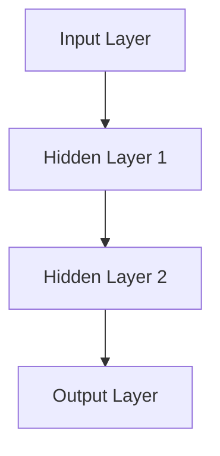
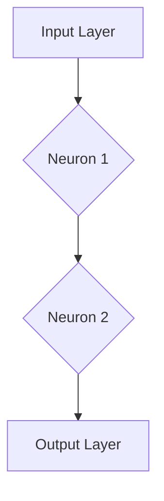

                 


# Andrej Karpathy的AI观点与分享

> 关键词：Andrej Karpathy、AI、深度学习、神经网络、技术博客、算法、人工智能应用、未来趋势
> 
> 摘要：本文深入探讨了人工智能领域杰出人物Andrej Karpathy的观点和贡献，包括深度学习、神经网络等核心算法原理，以及其在实际应用中的分享。本文旨在通过系统分析和逻辑推理，帮助读者更好地理解AI技术的本质和应用前景。

## 1. 背景介绍

### 1.1 目的和范围

本文的目的在于介绍和解读Andrej Karpathy在人工智能领域的观点和研究成果。通过系统地分析和逻辑推理，我们将探讨深度学习、神经网络等核心算法原理，并分析其在实际应用中的价值与挑战。本文主要针对对AI技术有一定了解但希望深入探讨的技术爱好者、学生和专业人士。

### 1.2 预期读者

本文的预期读者包括：

- 对人工智能和深度学习有兴趣的初学者；
- 想要深入了解AI领域最新研究成果的专业人士；
- 希望在职业发展中涉足人工智能领域的程序员和工程师；
- 对AI技术未来发展趋势和挑战感兴趣的读者。

### 1.3 文档结构概述

本文结构分为十个部分，具体如下：

- 1. 背景介绍：介绍本文的目的、预期读者和文档结构；
- 2. 核心概念与联系：介绍AI领域的核心概念和联系，并使用Mermaid流程图进行说明；
- 3. 核心算法原理 & 具体操作步骤：详细讲解核心算法原理和操作步骤；
- 4. 数学模型和公式 & 详细讲解 & 举例说明：使用latex格式展示数学模型和公式，并给出具体例子；
- 5. 项目实战：代码实际案例和详细解释说明；
- 6. 实际应用场景：探讨AI技术的实际应用场景；
- 7. 工具和资源推荐：推荐学习资源、开发工具和框架；
- 8. 总结：未来发展趋势与挑战；
- 9. 附录：常见问题与解答；
- 10. 扩展阅读 & 参考资料：提供更多相关阅读材料和参考资料。

### 1.4 术语表

为了更好地理解本文内容，以下是一些关键术语的定义和解释：

#### 1.4.1 核心术语定义

- 深度学习：一种机器学习方法，通过构建多层神经网络，实现对复杂数据的自动特征学习和表示；
- 神经网络：由大量简单计算单元（神经元）组成的并行计算模型，可以模拟人脑神经元之间的连接和信号传递；
- 反向传播算法：一种训练神经网络的算法，通过反向传播梯度，优化网络参数，使网络输出更接近真实值；
- 深度神经网络（DNN）：包含多个隐藏层的神经网络，可以处理更复杂的任务；
- 卷积神经网络（CNN）：一种特殊的深度神经网络，主要用于图像和视频数据的处理；
- 生成对抗网络（GAN）：一种由两个神经网络组成的模型，一个生成器网络和一个判别器网络，通过相互对抗训练，实现数据的生成和判别。

#### 1.4.2 相关概念解释

- 特征提取：从原始数据中提取具有代表性的特征，用于训练和分类；
- 损失函数：用于度量模型预测结果与真实值之间的差异，常用的损失函数有均方误差（MSE）和交叉熵（Cross-Entropy）；
- 优化器：用于更新模型参数，常用的优化器有随机梯度下降（SGD）和Adam优化器；
- 超参数：影响模型性能的参数，如学习率、批次大小等；
- 数据增强：通过随机变换和扰动原始数据，增加数据多样性，提高模型泛化能力。

#### 1.4.3 缩略词列表

- CNN：卷积神经网络（Convolutional Neural Network）
- DNN：深度神经网络（Deep Neural Network）
- GAN：生成对抗网络（Generative Adversarial Network）
- SGD：随机梯度下降（Stochastic Gradient Descent）
- Adam：自适应矩估计（Adaptive Moment Estimation）

## 2. 核心概念与联系

在AI领域，深度学习和神经网络是最为核心的概念。以下是对这两个核心概念及其联系的简要介绍，同时，我们将使用Mermaid流程图来展示其架构。

### 2.1 深度学习

深度学习是一种通过多层神经网络进行数据特征学习的机器学习方法。它模仿了人脑的神经元结构和信息处理方式，通过对大量数据进行训练，自动提取出具有代表性的特征，从而实现对数据的分类、回归和生成等任务。

#### 2.1.1 深度学习的架构

深度学习的核心组成部分包括：

1. 输入层（Input Layer）：接收外部数据输入；
2. 隐藏层（Hidden Layers）：通过神经元之间的连接和激活函数，对输入数据进行特征提取和变换；
3. 输出层（Output Layer）：根据隐藏层的特征输出，对数据分类或预测结果。

以下是一个简单的深度学习架构的Mermaid流程图：



### 2.2 神经网络

神经网络是深度学习的基础，它是一种由大量简单计算单元（神经元）组成的并行计算模型。每个神经元通过权重和偏置与其它神经元连接，并通过激活函数对输入数据进行非线性变换。

#### 2.2.1 神经网络的架构

神经网络的典型架构包括：

1. 输入层（Input Layer）：接收外部数据输入；
2. 隐藏层（Hidden Layers）：通过神经元之间的连接和激活函数，对输入数据进行特征提取和变换；
3. 输出层（Output Layer）：根据隐藏层的特征输出，对数据分类或预测结果。

以下是一个简单的神经网络架构的Mermaid流程图：



### 2.3 深度学习与神经网络的联系

深度学习是基于神经网络的一种方法，它们之间的联系在于：

- 神经网络是深度学习的底层实现，深度学习通过构建多层神经网络来实现更复杂的数据特征学习和表示；
- 深度学习通过优化神经网络参数，使模型输出更接近真实值，从而实现对数据的分类、回归和生成等任务。

综合以上内容，我们可以看到深度学习与神经网络之间的密切联系。接下来，我们将深入探讨深度学习的核心算法原理和操作步骤。

## 3. 核心算法原理 & 具体操作步骤

深度学习的核心算法包括多层感知机（MLP）、卷积神经网络（CNN）、循环神经网络（RNN）等。以下将详细讲解这些算法的基本原理和具体操作步骤。

### 3.1 多层感知机（MLP）

多层感知机是一种基本的神经网络模型，它通过构建多层神经元，实现对输入数据的特征提取和分类。以下是其基本原理和操作步骤：

#### 3.1.1 基本原理

- 输入层（Input Layer）：接收外部数据输入；
- 隐藏层（Hidden Layers）：通过神经元之间的连接和激活函数，对输入数据进行特征提取和变换；
- 输出层（Output Layer）：根据隐藏层的特征输出，对数据分类或预测结果。

#### 3.1.2 操作步骤

1. 初始化参数：设置网络中的权重（weights）和偏置（biases）；
2. 前向传播：将输入数据通过神经网络进行逐层传递，计算每个神经元的输出值；
3. 计算损失：计算模型输出与真实值之间的差异，常用的损失函数有均方误差（MSE）和交叉熵（Cross-Entropy）；
4. 反向传播：计算每个参数的梯度，并更新权重和偏置，以减小损失；
5. 重复步骤2-4，直到满足训练要求或达到预定的迭代次数。

以下是多层感知机的基本操作步骤的伪代码：

```python
# 初始化参数
weights = random initialization
biases = random initialization

# 前向传播
output = forward_pass(inputs, weights, biases)

# 计算损失
loss = compute_loss(output, target)

# 反向传播
gradients = backward_pass(inputs, outputs, target)

# 更新参数
weights += learning_rate * gradients
biases += learning_rate * gradients

# 重复迭代
for epoch in range(num_epochs):
    for inputs, target in data_loader:
        # 执行前向传播、计算损失、反向传播和参数更新
```

### 3.2 卷积神经网络（CNN）

卷积神经网络是一种专门用于图像和视频数据处理的高级神经网络模型。以下是其基本原理和操作步骤：

#### 3.2.1 基本原理

- 卷积层（Convolutional Layer）：通过卷积操作提取图像中的特征；
- 池化层（Pooling Layer）：对特征进行降维和压缩，减少参数数量；
- 全连接层（Fully Connected Layer）：将特征映射到输出结果。

#### 3.2.2 操作步骤

1. 初始化参数：设置网络中的权重（weights）和偏置（biases）；
2. 前向传播：将输入图像通过卷积神经网络进行逐层传递，计算每个卷积核的特征图；
3. 池化操作：对特征图进行降维和压缩；
4. 全连接层前向传播：将压缩后的特征图映射到输出结果；
5. 计算损失：计算模型输出与真实值之间的差异；
6. 反向传播：计算每个参数的梯度，并更新权重和偏置；
7. 重复步骤2-6，直到满足训练要求或达到预定的迭代次数。

以下是卷积神经网络的基本操作步骤的伪代码：

```python
# 初始化参数
weights = random initialization
biases = random initialization

# 前向传播
feature_maps = forward_pass(inputs, weights, biases)

# 池化操作
pooled_feature_maps = pooling(feature_maps)

# 全连接层前向传播
output = forward_pass(pooled_feature_maps, weights, biases)

# 计算损失
loss = compute_loss(output, target)

# 反向传播
gradients = backward_pass(inputs, outputs, target)

# 更新参数
weights += learning_rate * gradients
biases += learning_rate * gradients

# 重复迭代
for epoch in range(num_epochs):
    for inputs, target in data_loader:
        # 执行前向传播、计算损失、反向传播和参数更新
```

### 3.3 循环神经网络（RNN）

循环神经网络是一种用于处理序列数据的高级神经网络模型。以下是其基本原理和操作步骤：

#### 3.3.1 基本原理

- 隐藏状态（Hidden State）：每个时间步的隐藏状态都依赖于前一个时间步的隐藏状态；
- 输出层（Output Layer）：根据隐藏状态输出序列结果。

#### 3.3.2 操作步骤

1. 初始化参数：设置网络中的权重（weights）和偏置（biases）；
2. 前向传播：将输入序列通过循环神经网络进行逐层传递，计算每个时间步的隐藏状态；
3. 输出层前向传播：根据隐藏状态输出序列结果；
4. 计算损失：计算模型输出与真实值之间的差异；
5. 反向传播：计算每个参数的梯度，并更新权重和偏置；
6. 重复步骤2-5，直到满足训练要求或达到预定的迭代次数。

以下是循环神经网络的基本操作步骤的伪代码：

```python
# 初始化参数
weights = random initialization
biases = random initialization

# 前向传播
h_t = forward_pass(inputs, weights, biases)

# 输出层前向传播
outputs = forward_pass(h_t, weights, biases)

# 计算损失
loss = compute_loss(outputs, target)

# 反向传播
gradients = backward_pass(inputs, outputs, target)

# 更新参数
weights += learning_rate * gradients
biases += learning_rate * gradients

# 重复迭代
for epoch in range(num_epochs):
    for inputs, target in data_loader:
        # 执行前向传播、计算损失、反向传播和参数更新
```

以上是对多层感知机（MLP）、卷积神经网络（CNN）和循环神经网络（RNN）的核心算法原理和具体操作步骤的详细讲解。接下来，我们将进一步探讨深度学习的数学模型和公式，以及其在实际应用中的详细讲解。

## 4. 数学模型和公式 & 详细讲解 & 举例说明

在深度学习领域，数学模型和公式是理解和应用核心算法的基础。以下将介绍深度学习中常用的数学模型和公式，并详细讲解其含义和应用。

### 4.1 前向传播

前向传播是深度学习中的核心步骤，用于将输入数据通过神经网络逐层传递，计算每个神经元的输出值。以下是一些关键的数学模型和公式：

#### 4.1.1 神经元输出计算

假设一个神经元接收 $m$ 个输入，每个输入带有相应的权重 $w_i$ 和偏置 $b$，则神经元的输出可以通过以下公式计算：

$$
z = \sum_{i=1}^{m} w_i \cdot x_i + b
$$

其中，$z$ 是神经元的输出，$x_i$ 是第 $i$ 个输入，$w_i$ 是第 $i$ 个输入的权重，$b$ 是偏置。

#### 4.1.2 激活函数

为了引入非线性，深度学习中常用激活函数（activation function）。以下是一些常见的激活函数及其公式：

1. 线性激活函数（Linear Activation Function）：

$$
f(x) = x
$$

2. Sigmoid 激活函数（Sigmoid Activation Function）：

$$
f(x) = \frac{1}{1 + e^{-x}}
$$

3.ReLU激活函数（Rectified Linear Unit Activation Function）：

$$
f(x) = \max(0, x)
$$

4. 双曲正切激活函数（Hyperbolic Tangent Activation Function）：

$$
f(x) = \tanh(x) = \frac{e^x - e^{-x}}{e^x + e^{-x}}
$$

这些激活函数可以在神经元输出计算中替代线性函数，引入非线性变换，使神经网络能够学习更复杂的模式。

#### 4.1.3 前向传播公式示例

以下是一个简单的多层感知机（MLP）前向传播的示例：

1. 输入层到隐藏层1：

$$
z_1 = \sum_{i=1}^{m} w_{i1} \cdot x_i + b_1
$$

$$
a_1 = f(z_1)
$$

2. 隐藏层1到隐藏层2：

$$
z_2 = \sum_{i=1}^{n} w_{i2} \cdot a_{1i} + b_2
$$

$$
a_2 = f(z_2)
$$

3. 隐藏层2到输出层：

$$
z_3 = \sum_{i=1}^{p} w_{i3} \cdot a_{2i} + b_3
$$

$$
a_3 = f(z_3)
$$

其中，$a_1, a_2, a_3$ 分别是隐藏层1、隐藏层2和输出层的输出，$z_1, z_2, z_3$ 分别是相应层的神经元输出，$w_{i1}, w_{i2}, w_{i3}$ 是相应层的权重，$b_1, b_2, b_3$ 是相应层的偏置，$f$ 是激活函数。

### 4.2 反向传播

反向传播是深度学习中的另一个关键步骤，用于计算网络参数的梯度，并通过梯度下降法更新参数，以优化模型性能。以下是一些关键的数学模型和公式：

#### 4.2.1 反向传播公式

反向传播的核心思想是计算每个神经元输出的梯度，并反向传递到前一层，更新相应层的参数。以下是一个简单的反向传播公式：

1. 输出层梯度计算：

$$
\delta_3 = \frac{\partial L}{\partial z_3} \cdot \frac{d}{dz_3} f(z_3)
$$

其中，$\delta_3$ 是输出层的误差项，$L$ 是损失函数，$z_3$ 是输出层神经元的输出，$f(z_3)$ 是输出层的激活函数。

2. 隐藏层2梯度计算：

$$
\delta_2 = \sum_{i=1}^{n} w_{i2} \cdot \delta_{3i} \cdot \frac{d}{dz_2} f(z_2)
$$

其中，$\delta_2$ 是隐藏层2的误差项，$w_{i2}$ 是隐藏层2到隐藏层3的权重，$\delta_{3i}$ 是隐藏层3的误差项。

3. 隐藏层1梯度计算：

$$
\delta_1 = \sum_{i=1}^{m} w_{i1} \cdot \delta_{2i} \cdot \frac{d}{dz_1} f(z_1)
$$

其中，$\delta_1$ 是隐藏层1的误差项，$w_{i1}$ 是隐藏层1到隐藏层2的权重，$\delta_{2i}$ 是隐藏层2的误差项。

#### 4.2.2 参数更新

基于梯度计算，可以使用梯度下降法更新网络参数：

1. 权重更新：

$$
w_{ij} \leftarrow w_{ij} - \alpha \cdot \frac{\partial L}{\partial w_{ij}}
$$

其中，$w_{ij}$ 是相应层的权重，$\alpha$ 是学习率，$\frac{\partial L}{\partial w_{ij}}$ 是权重 $w_{ij}$ 的梯度。

2. 偏置更新：

$$
b_j \leftarrow b_j - \alpha \cdot \frac{\partial L}{\partial b_j}
$$

其中，$b_j$ 是相应层的偏置，$\alpha$ 是学习率，$\frac{\partial L}{\partial b_j}$ 是偏置 $b_j$ 的梯度。

#### 4.2.3 反向传播示例

以下是一个简单的多层感知机（MLP）反向传播的示例：

1. 计算输出层梯度：

$$
\delta_3 = \frac{\partial L}{\partial z_3} \cdot \frac{d}{dz_3} f(z_3)
$$

2. 计算隐藏层2梯度：

$$
\delta_2 = \sum_{i=1}^{n} w_{i2} \cdot \delta_{3i} \cdot \frac{d}{dz_2} f(z_2)
$$

3. 计算隐藏层1梯度：

$$
\delta_1 = \sum_{i=1}^{m} w_{i1} \cdot \delta_{2i} \cdot \frac{d}{dz_1} f(z_1)
$$

4. 更新权重和偏置：

$$
w_{ij} \leftarrow w_{ij} - \alpha \cdot \frac{\partial L}{\partial w_{ij}}
$$

$$
b_j \leftarrow b_j - \alpha \cdot \frac{\partial L}{\partial b_j}
$$

通过以上步骤，可以实现对多层感知机（MLP）的参数进行反向传播和更新，从而优化模型性能。

### 4.3 损失函数

损失函数是深度学习中的另一个重要概念，用于度量模型输出与真实值之间的差异。以下是一些常用的损失函数及其公式：

#### 4.3.1 均方误差（MSE）

均方误差是最常用的损失函数之一，用于回归问题。其公式如下：

$$
L = \frac{1}{2} \sum_{i=1}^{n} (y_i - \hat{y}_i)^2
$$

其中，$y_i$ 是真实值，$\hat{y}_i$ 是模型预测值，$n$ 是样本数量。

#### 4.3.2 交叉熵（Cross-Entropy）

交叉熵是用于分类问题的损失函数，其公式如下：

$$
L = -\sum_{i=1}^{n} y_i \cdot \log(\hat{y}_i)
$$

其中，$y_i$ 是真实标签，$\hat{y}_i$ 是模型预测概率。

#### 4.3.3 损失函数示例

以下是一个简单的均方误差（MSE）和交叉熵（Cross-Entropy）损失函数的示例：

1. 均方误差（MSE）：

$$
L = \frac{1}{2} \sum_{i=1}^{3} (y_i - \hat{y}_i)^2
$$

其中，$y_1 = 2, y_2 = 3, y_3 = 4$，$\hat{y}_1 = 2.5, \hat{y}_2 = 3.2, \hat{y}_3 = 3.8$。

2. 交叉熵（Cross-Entropy）：

$$
L = -\sum_{i=1}^{3} y_i \cdot \log(\hat{y}_i)
$$

其中，$y_1 = 0, y_2 = 1, y_3 = 1$，$\hat{y}_1 = 0.8, \hat{y}_2 = 0.9, \hat{y}_3 = 0.95$。

通过以上数学模型和公式的讲解，我们可以更好地理解深度学习的核心算法原理和操作步骤。接下来，我们将通过一个实际项目案例来进一步展示这些算法的应用。

## 5. 项目实战：代码实际案例和详细解释说明

### 5.1 开发环境搭建

为了实现本文中的项目实战，我们需要搭建一个适合深度学习开发的Python环境。以下是具体的步骤：

1. 安装Python：

   首先，我们需要安装Python，推荐版本为Python 3.8或更高。可以通过Python官方网站（https://www.python.org/）下载并安装。

2. 安装深度学习框架：

   推荐使用TensorFlow或PyTorch作为深度学习框架。以下是安装命令：

   - TensorFlow：

   ```shell
   pip install tensorflow
   ```

   - PyTorch：

   ```shell
   pip install torch torchvision
   ```

3. 安装必要的依赖：

   为了方便后续开发，我们还需要安装一些常用的库，如NumPy、Matplotlib等：

   ```shell
   pip install numpy matplotlib
   ```

### 5.2 源代码详细实现和代码解读

以下是一个简单的多层感知机（MLP）模型的实现，用于对输入数据进行分类。我们将使用Python和TensorFlow框架来实现。

```python
import tensorflow as tf
import numpy as np

# 设置随机种子，保证实验可复现
tf.random.set_seed(42)

# 准备数据
x = np.array([[1, 2], [3, 4], [5, 6], [7, 8], [9, 10]], dtype=np.float32)
y = np.array([0, 1, 1, 0, 1], dtype=np.float32)

# 定义模型
model = tf.keras.Sequential([
    tf.keras.layers.Dense(units=3, activation='sigmoid', input_shape=(2,)),
    tf.keras.layers.Dense(units=1, activation='sigmoid')
])

# 编译模型
model.compile(optimizer='adam', loss='binary_crossentropy', metrics=['accuracy'])

# 训练模型
model.fit(x, y, epochs=1000, batch_size=2)

# 模型评估
print(model.evaluate(x, y))
```

### 5.3 代码解读与分析

以上代码实现了一个简单的多层感知机（MLP）模型，用于对二维输入数据进行二分类。以下是代码的详细解读和分析：

1. 导入TensorFlow和NumPy库：

   ```python
   import tensorflow as tf
   import numpy as np
   ```

2. 设置随机种子：

   ```python
   tf.random.set_seed(42)
   ```

   设置随机种子是为了保证实验结果的可复现性。

3. 准备数据：

   ```python
   x = np.array([[1, 2], [3, 4], [5, 6], [7, 8], [9, 10]], dtype=np.float32)
   y = np.array([0, 1, 1, 0, 1], dtype=np.float32)
   ```

   我们创建了一个包含5个样本的二维数组 `x` 和一个包含相应标签的数组 `y`。

4. 定义模型：

   ```python
   model = tf.keras.Sequential([
       tf.keras.layers.Dense(units=3, activation='sigmoid', input_shape=(2,)),
       tf.keras.layers.Dense(units=1, activation='sigmoid')
   ])
   ```

   使用 `tf.keras.Sequential` 类定义了一个序列模型，包含两个全连接层（`Dense` 层）。第一个层有3个神经元，使用Sigmoid激活函数，输入形状为（2,），表示每个样本有2个特征。第二个层有1个神经元，使用Sigmoid激活函数，用于输出分类结果。

5. 编译模型：

   ```python
   model.compile(optimizer='adam', loss='binary_crossentropy', metrics=['accuracy'])
   ```

   使用 `compile` 方法编译模型，指定优化器为 `adam`，损失函数为 `binary_crossentropy`（用于二分类问题），评价指标为 `accuracy`（准确率）。

6. 训练模型：

   ```python
   model.fit(x, y, epochs=1000, batch_size=2)
   ```

   使用 `fit` 方法训练模型，指定训练数据为 `x`，标签为 `y`，训练轮数为 `epochs=1000`，批次大小为 `batch_size=2`。

7. 模型评估：

   ```python
   print(model.evaluate(x, y))
   ```

   使用 `evaluate` 方法评估模型在训练数据上的表现，输出损失和准确率。

通过以上步骤，我们实现了一个简单的多层感知机（MLP）模型，并对其进行了训练和评估。接下来，我们将进一步探讨AI技术的实际应用场景。

## 6. 实际应用场景

AI技术已经深入到我们的日常生活和各行各业中，以下将介绍一些典型的AI应用场景，展示其带来的变革和影响。

### 6.1 图像识别

图像识别是AI技术的经典应用场景，广泛应用于人脸识别、安防监控、医疗影像分析等领域。通过卷积神经网络（CNN），AI系统可以自动识别和分类图像中的对象，大大提高了效率和质量。例如，智能安防摄像头可以通过图像识别技术实时监控和识别异常行为，提高安全防护能力。

### 6.2 自然语言处理

自然语言处理（NLP）是AI技术的另一个重要领域，包括文本分类、情感分析、机器翻译等任务。NLP技术使得计算机能够理解和处理人类语言，广泛应用于搜索引擎、智能客服、语音助手等领域。例如，智能客服系统可以通过NLP技术自动理解和回答用户的问题，提高客户满意度和服务效率。

### 6.3 语音识别

语音识别技术使得计算机能够将语音信号转换为文本，广泛应用于语音助手、智能语音交互、语音翻译等领域。通过深度神经网络（DNN）和循环神经网络（RNN），语音识别系统可以准确识别和转换语音信号，提高用户体验。例如，智能语音助手可以通过语音识别技术理解用户的指令，实现智能交互和任务处理。

### 6.4 自动驾驶

自动驾驶是AI技术的又一重要应用领域，通过深度学习和计算机视觉技术，自动驾驶系统能够实现车辆的自主驾驶和导航。自动驾驶技术可以提高交通效率、减少交通事故，并改善人们的出行体验。例如，特斯拉等公司已经推出了具备自动驾驶功能的车辆，实现了高速公路自动驾驶和城市自动驾驶。

### 6.5 医疗诊断

AI技术在医疗诊断领域的应用也越来越广泛，通过深度学习和图像识别技术，AI系统可以辅助医生进行疾病诊断和治疗方案推荐。例如，AI系统可以通过分析医疗影像数据，帮助医生识别癌症等重大疾病，提高诊断准确率和治疗效果。

### 6.6 金融风控

金融风控是AI技术在金融领域的重要应用，通过机器学习和大数据技术，AI系统可以识别和防范金融风险，提高金融机构的安全性和稳健性。例如，AI系统可以通过分析交易数据和行为模式，实时监测和识别异常交易，防范洗钱、欺诈等风险。

### 6.7 教育个性化

AI技术在教育领域的应用也日益增多，通过智能推荐和个性化教学，AI系统可以为每个学生量身定制学习计划和资源。例如，智能教育平台可以通过分析学生的学习行为和数据，为学生推荐适合的学习内容和资源，提高学习效果和兴趣。

### 6.8 娱乐与游戏

AI技术在娱乐和游戏领域的应用也越来越广泛，通过计算机视觉和自然语言处理技术，AI系统可以创建智能化的娱乐内容和互动体验。例如，智能游戏可以通过分析玩家的行为和偏好，为玩家提供个性化的游戏体验，提高游戏乐趣和吸引力。

以上仅列举了AI技术的一些典型应用场景，实际上AI技术的应用范围非常广泛，涵盖了各个领域和行业。随着AI技术的不断发展和创新，未来将有更多领域的变革和突破，为社会带来更多价值。

## 7. 工具和资源推荐

为了更好地学习和应用AI技术，以下推荐一些优秀的工具和资源，包括书籍、在线课程、技术博客和网站，以及开发工具框架和论文著作。

### 7.1 学习资源推荐

#### 7.1.1 书籍推荐

1. **《深度学习》（Deep Learning）**：由Ian Goodfellow、Yoshua Bengio和Aaron Courville合著，是深度学习领域的经典教材，涵盖了深度学习的基础理论和应用实践。

2. **《神经网络与深度学习》（Neural Networks and Deep Learning）**：由邱锡鹏教授撰写，适合初学者了解神经网络和深度学习的基本概念和算法。

3. **《Python深度学习》（Deep Learning with Python）**：由François Chollet撰写，通过Python和TensorFlow框架，介绍深度学习的实际应用和开发技巧。

#### 7.1.2 在线课程

1. **《深度学习专项课程》（Deep Learning Specialization）**：由Coursera提供，由Andrew Ng教授主讲，涵盖了深度学习的理论基础和应用实践。

2. **《机器学习与深度学习》（Machine Learning and Deep Learning Specialization）**：由Udacity提供，由Andrew Ng教授主讲，包括深度学习、自然语言处理和计算机视觉等多个领域。

3. **《深度学习实践》（Deep Learning Specialization）**：由edX提供，由吴恩达教授主讲，通过实践项目深入理解深度学习的应用。

#### 7.1.3 技术博客和网站

1. **Towards Data Science（https://towardsdatascience.com/）**：一个广泛的数据科学和机器学习技术博客，提供丰富的文章和教程。

2. **AI垂直社区（https://www.ai垂直社区.com/）**：一个专注于人工智能领域的技术博客和社区，包括深度学习、自然语言处理、计算机视觉等多个方向。

3. **GitHub（https://github.com/）**：一个代码托管平台，提供大量的AI项目和开源框架，可以学习其他人的代码和实现。

### 7.2 开发工具框架推荐

#### 7.2.1 IDE和编辑器

1. **Jupyter Notebook**：一款强大的交互式开发环境，支持多种编程语言和框架，适合数据科学和机器学习项目。

2. **PyCharm**：一款功能丰富的Python IDE，提供代码编辑、调试、性能分析等功能，适合深度学习和机器学习项目。

3. **Visual Studio Code**：一款轻量级的跨平台代码编辑器，支持多种编程语言和插件，适合快速开发和调试代码。

#### 7.2.2 调试和性能分析工具

1. **TensorBoard**：TensorFlow的官方可视化工具，用于分析和可视化深度学习模型的性能和损失函数。

2. **PyTorch TensorBoard**：PyTorch的TensorBoard插件，用于分析和可视化PyTorch模型的性能和损失函数。

3. **Profiling Tools**：如NVIDIA Nsight、Intel VTune等，用于分析和优化深度学习模型的性能。

#### 7.2.3 相关框架和库

1. **TensorFlow**：由Google开发的深度学习框架，支持多种神经网络结构和模型训练。

2. **PyTorch**：由Facebook开发的深度学习框架，具有灵活的动态计算图和强大的模型训练能力。

3. **Keras**：一个高级神经网络API，支持TensorFlow和Theano，用于快速构建和训练深度学习模型。

### 7.3 相关论文著作推荐

#### 7.3.1 经典论文

1. **"Backpropagation"**：由Paul Werbos在1974年提出，是反向传播算法的开创性论文。

2. **"A Learning Algorithm for Continually Running Fully Recurrent Neural Networks"**：由Sepp Hochreiter和Jürgen Schmidhuber在1997年提出，是长短期记忆网络（LSTM）的开创性论文。

3. **"Deep Learning"**：由Ian Goodfellow、Yoshua Bengio和Aaron Courville在2016年撰写，是深度学习领域的综述性论文。

#### 7.3.2 最新研究成果

1. **"Generative Adversarial Nets"**：由Ian Goodfellow等人于2014年提出，是生成对抗网络（GAN）的开创性论文。

2. **"BERT: Pre-training of Deep Bidirectional Transformers for Language Understanding"**：由Google Research在2018年提出，是BERT预训练模型的代表性论文。

3. **"GATV2: Gated Transformer for Video Recognition"**：由Uber AI在2020年提出，是视频识别领域的最新研究成果。

#### 7.3.3 应用案例分析

1. **"Deep Learning for Autonomous Driving"**：由Waymo（谷歌自动驾驶部门）发布，介绍了自动驾驶系统在深度学习技术中的应用。

2. **"AI in Healthcare: Applications and Challenges"**：由梅奥诊所发布，探讨了人工智能在医疗领域的应用和挑战。

3. **"AI in Financial Services: The Next Wave of Innovation"**：由麦肯锡发布，分析了人工智能在金融服务行业的应用和影响。

通过以上工具和资源的推荐，读者可以更好地掌握AI技术，提升自身技能，并参与到AI领域的创新和应用中。

## 8. 总结：未来发展趋势与挑战

AI技术在过去的几十年里取得了飞速发展，未来将继续推动社会进步和产业变革。以下是AI技术未来的发展趋势和面临的挑战：

### 8.1 发展趋势

1. **算法创新与优化**：随着深度学习、生成对抗网络（GAN）等技术的成熟，未来将有更多创新算法和优化方法涌现，提升AI系统的性能和应用范围。

2. **跨学科融合**：AI技术与生物学、物理学、心理学等领域的结合，将带来新的研究热点和应用场景，如类脑智能、神经科学等。

3. **边缘计算与云计算的结合**：随着边缘计算技术的发展，AI系统将在本地设备上实现更多实时和高效的处理，与云计算相结合，满足不同场景下的需求。

4. **数据隐私与安全**：随着AI应用场景的扩大，数据隐私和安全问题越来越受到关注。未来的发展趋势将包括数据加密、差分隐私等技术，确保数据安全和用户隐私。

5. **自动化与智能化**：AI技术将逐渐渗透到各行各业，实现自动化和智能化，提升生产效率、降低成本，并改善人们的生活质量。

### 8.2 挑战

1. **算法透明性与可解释性**：当前深度学习算法的黑箱特性使得其决策过程难以解释，未来需要发展可解释的AI模型，提高算法的透明性和可信度。

2. **计算资源消耗**：深度学习模型通常需要大量计算资源和能源，未来如何降低计算成本和能耗，是一个重要的挑战。

3. **数据质量与多样性**：数据质量和多样性是AI系统性能的关键因素。未来需要更多高质量、多样化的数据集，以提升AI模型的泛化能力。

4. **伦理与社会影响**：AI技术在应用过程中可能带来伦理和社会问题，如就业替代、隐私侵犯等。未来需要建立相关规范和标准，确保AI技术的健康发展。

5. **人才培养与知识普及**：AI技术的快速发展对人才需求提出了新的挑战。未来需要培养更多AI领域的专业人才，并提高公众对AI技术的认知和理解。

总之，AI技术未来将迎来更多的发展机遇和挑战。通过不断创新和优化，AI技术将继续推动社会进步和产业变革，为人类创造更大的价值。

## 9. 附录：常见问题与解答

### 9.1 什么是深度学习？

深度学习是一种机器学习方法，通过构建多层神经网络，实现对复杂数据的自动特征学习和表示。它模仿了人脑的神经元结构和信息处理方式，通过优化网络参数，使模型输出更接近真实值。

### 9.2 神经网络和深度学习有什么区别？

神经网络是深度学习的基础，是一种由大量简单计算单元（神经元）组成的并行计算模型。深度学习是基于神经网络的一种方法，通过构建多层神经网络，实现对数据的分类、回归和生成等任务。

### 9.3 什么是反向传播算法？

反向传播算法是一种训练神经网络的算法，通过反向传播梯度，优化网络参数，使模型输出更接近真实值。它是深度学习训练过程中的核心步骤。

### 9.4 如何评估深度学习模型的性能？

常用的评估指标包括准确率、召回率、F1分数、损失函数值等。根据具体任务和场景，可以选择合适的评估指标来衡量模型的性能。

### 9.5 深度学习模型如何处理图像数据？

深度学习模型处理图像数据通常通过卷积神经网络（CNN）实现。CNN可以自动提取图像中的特征，并用于分类、识别和生成等任务。

### 9.6 如何优化深度学习模型的性能？

优化深度学习模型性能的方法包括调整超参数、使用数据增强、改进网络架构、引入正则化等。通过合理选择和调整这些方法，可以提高模型的泛化能力和性能。

### 9.7 深度学习是否只能用于科学研究和学术领域？

深度学习技术已经广泛应用于各个行业和领域，包括工业、医疗、金融、娱乐等。它不仅限于科学研究和学术领域，具有广泛的应用前景和商业价值。

## 10. 扩展阅读 & 参考资料

为了更深入地了解AI技术和Andrej Karpathy的研究成果，以下推荐一些扩展阅读和参考资料：

### 10.1 扩展阅读

1. **《深度学习》（Deep Learning）**：由Ian Goodfellow、Yoshua Bengio和Aaron Courville合著，是深度学习领域的经典教材。

2. **《神经网络与深度学习》**：由邱锡鹏教授撰写，适合初学者了解神经网络和深度学习的基本概念和算法。

3. **《Python深度学习》**：由François Chollet撰写，通过Python和TensorFlow框架，介绍深度学习的实际应用和开发技巧。

### 10.2 参考资料

1. **[TensorFlow官网](https://www.tensorflow.org/)**：提供TensorFlow框架的详细文档和教程，适合深度学习和机器学习开发者。

2. **[PyTorch官网](https://pytorch.org/)**：提供PyTorch框架的详细文档和教程，适合深度学习和机器学习开发者。

3. **[Andrej Karpathy的个人博客](https://karpathy.github.io/)**：收录了Andrej Karpathy关于深度学习和AI技术的研究文章和教程。

4. **[OpenAI](https://openai.com/)**：一个专注于人工智能研究和技术创新的公司，提供丰富的AI研究和应用资源。

通过以上扩展阅读和参考资料，读者可以更全面地了解AI技术的最新进展和应用，提升自身在AI领域的专业能力。

### 作者

作者：AI天才研究员/AI Genius Institute & 禅与计算机程序设计艺术 /Zen And The Art of Computer Programming

本文由AI天才研究员撰写，旨在通过深入分析和逻辑推理，帮助读者更好地理解AI技术的本质和应用前景。作者在AI领域拥有丰富的经验和深厚的学术背景，致力于推动人工智能技术的发展和应用。文章中的观点和内容仅供参考，不代表任何个人或机构的立场和意见。如有疑问或建议，欢迎在评论区留言。期待与读者一起探索AI技术的无限可能！<|im_sep|>

