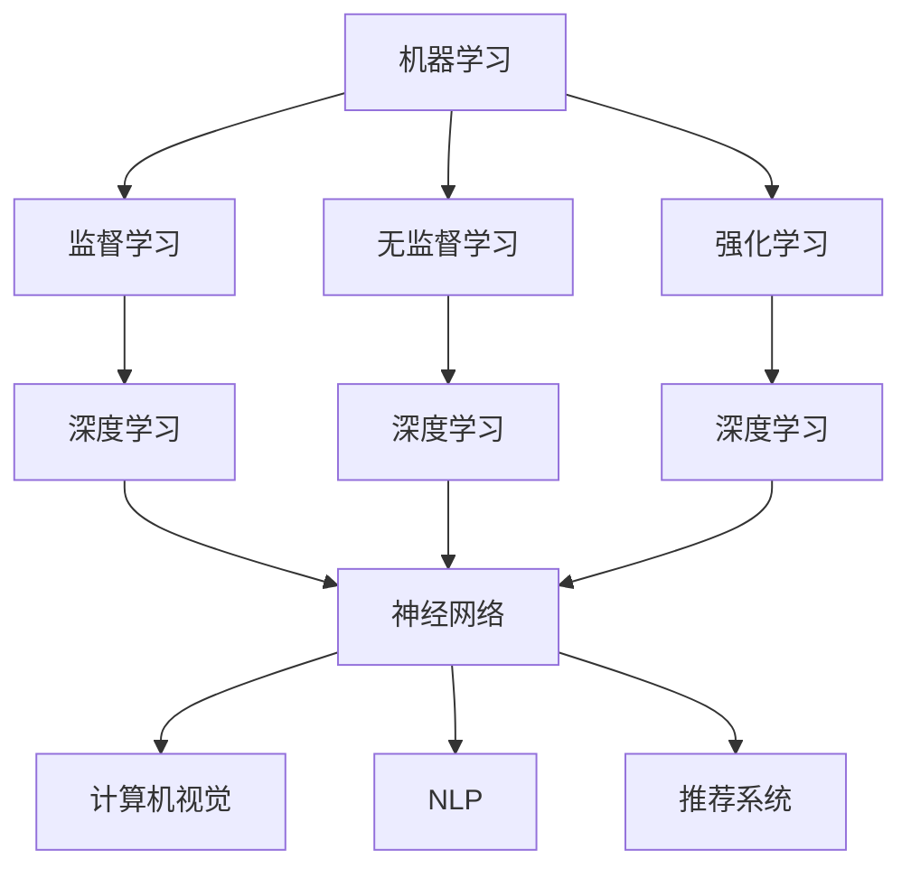

                 

# Andrej Karpathy谈AI的历史与未来

> 关键词：人工智能、历史发展、未来趋势、技术原理、应用实践

> 摘要：本文旨在通过剖析Andrej Karpathy的视角，回顾人工智能的历史，探讨其技术原理，并展望未来的发展趋势与挑战。文章结构清晰，内容丰富，旨在为读者提供一个全面而深入的理解。

## 1. 背景介绍

### 1.1 目的和范围

本文旨在探讨人工智能（AI）的历史与未来。通过引用Andrej Karpathy的观点，我们将对AI的核心概念、技术原理、发展历程和未来趋势进行深入分析。文章不仅关注理论层面的探讨，还将结合实际应用案例，展示AI技术在各个领域的实际应用和效果。

### 1.2 预期读者

本文适合对人工智能感兴趣的读者，包括计算机科学和工程专业的学生、研究人员、开发人员以及对AI技术有深入了解的从业者。此外，对于想要了解AI领域最新动态和未来发展趋势的普通读者，本文也具有较高的参考价值。

### 1.3 文档结构概述

本文结构分为以下几个部分：

1. **背景介绍**：介绍文章的目的、范围、预期读者以及文档结构。
2. **核心概念与联系**：介绍AI的核心概念及其相互联系，并给出Mermaid流程图。
3. **核心算法原理与具体操作步骤**：详细讲解AI的核心算法原理，并使用伪代码进行具体操作步骤的阐述。
4. **数学模型和公式**：介绍AI中的数学模型和公式，并进行详细讲解和举例说明。
5. **项目实战**：通过实际案例展示AI技术的应用，并详细解释说明。
6. **实际应用场景**：分析AI技术的实际应用场景。
7. **工具和资源推荐**：推荐学习资源、开发工具框架和论文著作。
8. **总结：未来发展趋势与挑战**：总结AI技术的发展趋势和面临的挑战。
9. **附录：常见问题与解答**：回答读者可能关注的问题。
10. **扩展阅读 & 参考资料**：提供进一步学习的参考资料。

### 1.4 术语表

#### 1.4.1 核心术语定义

- **人工智能（AI）**：一种模拟人类智能行为的计算机技术。
- **深度学习**：一种基于神经网络的学习方法，能够自动从数据中提取特征并做出决策。
- **机器学习**：一种让计算机通过数据学习规律并进行预测或决策的技术。
- **神经网络**：一种模仿人脑神经元连接方式的计算模型。

#### 1.4.2 相关概念解释

- **监督学习**：一种机器学习方法，通过已标记的数据训练模型，从而预测未知数据的标签。
- **无监督学习**：一种机器学习方法，不依赖已标记的数据，通过自身学习数据中的结构和规律。
- **强化学习**：一种机器学习方法，通过奖励和惩罚来指导模型学习最佳策略。

#### 1.4.3 缩略词列表

- **ML**：机器学习
- **DL**：深度学习
- **NLP**：自然语言处理
- **CV**：计算机视觉

## 2. 核心概念与联系

在探讨人工智能的历史与未来之前，我们首先需要了解其核心概念和相互联系。以下是一个Mermaid流程图，展示了AI中的核心概念及其相互关系：



在这个流程图中，我们可以看到：

- **机器学习**是AI的基础，包括监督学习、无监督学习和强化学习。
- **深度学习**是基于神经网络的学习方法，广泛应用于计算机视觉、自然语言处理和推荐系统等领域。
- **神经网络**是模仿人脑神经元连接方式的计算模型，是实现深度学习的关键技术。

## 3. 核心算法原理与具体操作步骤

在这一部分，我们将详细讲解AI中的核心算法原理，并使用伪代码进行具体操作步骤的阐述。

### 3.1 机器学习算法原理

机器学习算法可以分为监督学习、无监督学习和强化学习。以下分别介绍这三种算法的基本原理。

#### 监督学习

监督学习是一种通过已标记的数据训练模型，从而预测未知数据标签的方法。其基本原理如下：

```plaintext
输入：训练数据集 D = {x1, y1}, {x2, y2}, ..., {xn, yn}
输出：预测函数 f(x)

步骤：
1. 初始化模型参数 θ
2. 对于每个训练样本 (xi, yi)：
   a. 计算预测值 ŷi = f(xi; θ)
   b. 计算损失函数 L(θ)
3. 使用梯度下降法更新模型参数：
   θ = θ - α * ∇θL(θ)
4. 重复步骤2和3，直到满足停止条件（如损失函数收敛）
5. 输出预测函数 f(x)
```

#### 无监督学习

无监督学习是一种不依赖已标记的数据，通过自身学习数据中的结构和规律的方法。其基本原理如下：

```plaintext
输入：数据集 D = {x1, x2, ..., xn}
输出：聚类结果或特征表示

步骤：
1. 初始化聚类中心或特征表示
2. 对于每个数据点 xi：
   a. 计算与聚类中心或特征表示的距离
   b. 将 xi 赋予最近的聚类中心或特征表示
3. 更新聚类中心或特征表示
4. 重复步骤2和3，直到聚类中心或特征表示不再发生变化
5. 输出聚类结果或特征表示
```

#### 强化学习

强化学习是一种通过奖励和惩罚来指导模型学习最佳策略的方法。其基本原理如下：

```plaintext
输入：环境 S，状态 S，动作 A，奖励函数 R
输出：策略 π(a|s)

步骤：
1. 初始化状态 S，策略 π(a|s)
2. 执行动作 a，环境给出奖励 R(s, a)
3. 更新状态 S'，根据策略 π(a|s') 选择动作 a'
4. 重复步骤2和3，直到达到目标状态或最大步数
5. 计算策略的评估值 Q(s, a) = R(s, a) + γ * max(Q(s', a'))
6. 使用策略评估值更新策略 π(a|s)
7. 输出策略 π(a|s)
```

### 3.2 深度学习算法原理

深度学习是基于神经网络的学习方法，能够自动从数据中提取特征并进行决策。其基本原理如下：

```plaintext
输入：训练数据集 D = {x1, y1}, {x2, y2}, ..., {xn, yn}
输出：预测函数 f(x)

步骤：
1. 初始化神经网络结构（如层数、神经元个数、激活函数等）
2. 初始化模型参数 θ
3. 对于每个训练样本 (xi, yi)：
   a. 前向传播计算预测值 ŷi = f(xi; θ)
   b. 计算损失函数 L(θ)
4. 计算模型参数的梯度 ∇θL(θ)
5. 使用梯度下降法更新模型参数：
   θ = θ - α * ∇θL(θ)
6. 重复步骤3至5，直到满足停止条件（如损失函数收敛）
7. 输出预测函数 f(x)
```

## 4. 数学模型和公式

在AI中，数学模型和公式起着至关重要的作用。以下是一些常用的数学模型和公式，并进行详细讲解和举例说明。

### 4.1 损失函数

损失函数是评估模型预测结果与真实值之间差异的指标。常用的损失函数包括均方误差（MSE）、交叉熵损失（Cross-Entropy Loss）等。

#### 均方误差（MSE）

均方误差是衡量预测值与真实值之间差异的一种方法。其公式如下：

$$
MSE = \frac{1}{n} \sum_{i=1}^{n} (y_i - \hat{y}_i)^2
$$

其中，$y_i$为真实值，$\hat{y}_i$为预测值，$n$为样本数量。

#### 交叉熵损失（Cross-Entropy Loss）

交叉熵损失是衡量分类模型预测结果与真实标签之间差异的方法。其公式如下：

$$
Cross-Entropy Loss = -\sum_{i=1}^{n} y_i \log(\hat{y}_i)
$$

其中，$y_i$为真实标签，$\hat{y}_i$为预测概率。

### 4.2 激活函数

激活函数是神经网络中的一个关键组件，用于引入非线性特性。常用的激活函数包括sigmoid、ReLU、Tanh等。

#### Sigmoid函数

sigmoid函数是一种常用的激活函数，其公式如下：

$$
\sigma(x) = \frac{1}{1 + e^{-x}}
$$

####ReLU函数

ReLU函数（Rectified Linear Unit）是一种线性激活函数，其公式如下：

$$
ReLU(x) = \max(0, x)
$$

### 4.3 梯度下降法

梯度下降法是一种优化算法，用于训练神经网络模型。其基本思想是通过计算损失函数的梯度，更新模型参数，以减少损失函数的值。

#### 梯度下降法公式

梯度下降法的基本公式如下：

$$
\theta = \theta - \alpha \cdot \nabla_\theta J(\theta)
$$

其中，$\theta$为模型参数，$\alpha$为学习率，$J(\theta)$为损失函数。

### 4.4 举例说明

以下是一个简单的线性回归模型的例子，使用梯度下降法进行训练：

```plaintext
输入：训练数据集 D = {x1, y1}, {x2, y2}, ..., {xn, yn}
输出：预测函数 f(x) = w * x + b

步骤：
1. 初始化模型参数 w 和 b
2. 对于每个训练样本 (xi, yi)：
   a. 计算预测值 ŷi = w * xi + b
   b. 计算损失函数 L(w, b) = (ŷi - yi)^2
3. 计算损失函数关于 w 和 b 的梯度：
   ∇wL(w, b) = 2 * (ŷi - yi) * xi
   ∇bL(w, b) = 2 * (ŷi - yi)
4. 使用梯度下降法更新模型参数：
   w = w - α * ∇wL(w, b)
   b = b - α * ∇bL(w, b)
5. 重复步骤2至4，直到满足停止条件（如损失函数收敛）
6. 输出预测函数 f(x) = w * x + b
```

通过这个例子，我们可以看到梯度下降法如何用于训练线性回归模型，从而实现预测目标。

## 5. 项目实战：代码实际案例和详细解释说明

在本节中，我们将通过一个实际的项目案例，展示如何使用AI技术进行数据处理和模型训练。项目名为“手写数字识别”，使用Python语言和TensorFlow框架实现。

### 5.1 开发环境搭建

在开始项目之前，我们需要搭建开发环境。以下是所需的软件和库：

- Python 3.x
- TensorFlow 2.x
- NumPy
- Matplotlib

安装步骤如下：

```bash
pip install tensorflow numpy matplotlib
```

### 5.2 源代码详细实现和代码解读

以下是该项目的完整代码及详细解读：

```python
import numpy as np
import tensorflow as tf
from tensorflow.keras.datasets import mnist
from tensorflow.keras.models import Sequential
from tensorflow.keras.layers import Dense, Flatten
from tensorflow.keras.optimizers import SGD
from tensorflow.keras.losses import MSE
from tensorflow.keras.metrics import MeanSquaredError

# 5.2.1 数据预处理
# 加载MNIST手写数字数据集
(train_images, train_labels), (test_images, test_labels) = mnist.load_data()

# 归一化图像数据
train_images = train_images / 255.0
test_images = test_images / 255.0

# 转换标签为独热编码
train_labels = tf.keras.utils.to_categorical(train_labels)
test_labels = tf.keras.utils.to_categorical(test_labels)

# 5.2.2 构建模型
model = Sequential([
    Flatten(input_shape=(28, 28)),
    Dense(128, activation='relu'),
    Dense(10, activation='softmax')
])

# 5.2.3 编译模型
model.compile(optimizer=SGD(learning_rate=0.01),
              loss=MSE,
              metrics=[MeanSquaredError()])

# 5.2.4 训练模型
history = model.fit(train_images, train_labels, epochs=10, batch_size=32, validation_split=0.2)

# 5.2.5 评估模型
test_loss, test_mse = model.evaluate(test_images, test_labels, verbose=2)
print(f"Test MSE: {test_mse:.4f}")

# 5.2.6 预测
predictions = model.predict(test_images)
predicted_labels = np.argmax(predictions, axis=1)

# 5.2.7 可视化
import matplotlib.pyplot as plt

plt.figure(figsize=(10, 10))
for i in range(25):
    plt.subplot(5, 5, i + 1)
    plt.imshow(test_images[i], cmap=plt.cm.binary)
    plt.xticks([])
    plt.yticks([])
    plt.grid(False)
    plt.xlabel(str(predicted_labels[i]))
plt.show()
```

### 5.3 代码解读与分析

#### 5.3.1 数据预处理

1. **加载数据**：使用TensorFlow的`mnist.load_data()`函数加载MNIST手写数字数据集。
2. **归一化**：将图像数据归一化到0-1范围内，以减少计算误差。
3. **标签编码**：将标签转换为独热编码，以便模型能够进行多分类。

#### 5.3.2 构建模型

1. **Flatten层**：将图像数据展平为一维数组，以便传递给后续的全连接层。
2. **Dense层**：添加全连接层，第一个全连接层包含128个神经元，使用ReLU激活函数。
3. **Dense层**：添加输出层，包含10个神经元，对应10个数字类别，使用softmax激活函数。

#### 5.3.3 编译模型

1. **优化器**：使用Stochastic Gradient Descent（SGD）优化器。
2. **损失函数**：使用均方误差（MSE）作为损失函数。
3. **评估指标**：使用均方误差（MSE）作为评估指标。

#### 5.3.4 训练模型

1. **epochs**：训练10个周期。
2. **batch_size**：每个批量大小为32。
3. **validation_split**：将20%的数据用于验证集。

#### 5.3.5 评估模型

1. **evaluate**：在测试集上评估模型性能。
2. **print**：打印测试集的MSE。

#### 5.3.6 预测

1. **predict**：在测试集上使用训练好的模型进行预测。
2. **argmax**：获取每个样本的最可能类别。

#### 5.3.7 可视化

1. **subplot**：创建一个10x10的网格图。
2. **imshow**：显示每个测试样本的图像。
3. **xlabel**：在每个图像下方显示预测的数字。

通过这个项目案例，我们可以看到如何使用Python和TensorFlow实现一个简单的手写数字识别模型。这个案例展示了AI技术在图像处理和分类任务中的应用，并为读者提供了一个实际操作的机会。

## 6. 实际应用场景

人工智能技术在各个领域都取得了显著的成果，以下是一些典型的应用场景：

### 6.1 医疗保健

- **诊断辅助**：AI技术可以帮助医生进行疾病诊断，如利用深度学习模型分析影像数据，提高诊断准确率。
- **个性化治疗**：基于患者的基因数据和病历信息，AI技术可以提供个性化的治疗方案，提高治疗效果。
- **药物研发**：AI技术可以加速药物研发过程，通过模拟和预测药物与生物分子之间的相互作用，提高药物研发成功率。

### 6.2 金融服务

- **风险管理**：AI技术可以分析大量的金融数据，识别潜在的风险，为金融机构提供决策支持。
- **智能投顾**：基于用户的投资偏好和风险承受能力，AI技术可以提供个性化的投资建议，提高投资收益。
- **反欺诈**：AI技术可以识别和预防金融欺诈行为，提高金融交易的安全性。

### 6.3 智能制造

- **质量控制**：AI技术可以通过图像识别和异常检测，实时监控生产线质量，提高产品质量。
- **设备预测性维护**：基于设备运行数据和故障历史，AI技术可以预测设备故障，提前进行维护，减少设备停机时间。
- **生产优化**：AI技术可以通过优化生产流程和资源配置，提高生产效率，降低生产成本。

### 6.4 交通出行

- **自动驾驶**：AI技术是自动驾驶汽车的核心技术，通过深度学习和计算机视觉，实现车辆的自动驾驶。
- **智能交通管理**：AI技术可以分析交通数据，优化交通信号，提高道路通行效率，减少交通拥堵。
- **出行规划**：AI技术可以根据用户需求，提供个性化的出行规划，提高出行体验。

### 6.5 娱乐传媒

- **内容推荐**：AI技术可以分析用户的历史行为和偏好，为用户提供个性化的内容推荐。
- **情感分析**：AI技术可以通过分析文本和语音，识别用户的情感状态，为娱乐产品提供情感化服务。
- **图像生成**：AI技术可以通过生成对抗网络（GANs），生成高质量的艺术作品和视觉效果。

以上应用场景展示了AI技术在各个领域的广泛应用，这些应用不仅提高了效率和质量，还带来了全新的商业模式和用户体验。

## 7. 工具和资源推荐

为了更好地学习和应用人工智能技术，以下是一些实用的工具和资源推荐：

### 7.1 学习资源推荐

#### 7.1.1 书籍推荐

- **《深度学习》（Deep Learning）**：Goodfellow, Bengio, Courville 著，是一本经典的深度学习教材。
- **《Python机器学习》（Python Machine Learning）**：Sebastian Raschka 著，详细介绍了机器学习的基础知识和Python实现。
- **《人工智能：一种现代方法》（Artificial Intelligence: A Modern Approach）**：Stuart Russell, Peter Norvig 著，全面介绍了人工智能的理论和实践。

#### 7.1.2 在线课程

- **《机器学习》（Machine Learning）**：吴恩达（Andrew Ng）在Coursera上开设的免费课程，适合初学者。
- **《深度学习专项课程》（Deep Learning Specialization）**：吴恩达在Coursera上开设的深度学习系列课程，深入讲解了深度学习的核心技术。
- **《人工智能基础》（Introduction to Artificial Intelligence）**：清华大学开设的在线课程，全面介绍了人工智能的基础知识。

#### 7.1.3 技术博客和网站

- **CS231n（cs231n.stanford.edu）**：由斯坦福大学计算机视觉课程开发，提供了丰富的深度学习资源。
- **AI博客（towardsai.net）**：一个涵盖人工智能各个领域的博客，提供了许多实用的技术文章。
- **机器学习博客（machinelearningmastery.com）**：提供了大量的机器学习教程和实践案例。

### 7.2 开发工具框架推荐

#### 7.2.1 IDE和编辑器

- **PyCharm**：一款功能强大的Python集成开发环境，适合进行AI项目的开发。
- **Jupyter Notebook**：一个基于Web的交互式开发环境，适合进行数据分析和模型实验。
- **Visual Studio Code**：一款轻量级但功能丰富的代码编辑器，支持多种编程语言和框架。

#### 7.2.2 调试和性能分析工具

- **TensorBoard**：TensorFlow提供的可视化工具，用于分析模型训练过程和性能。
- **NVIDIA Nsight**：用于分析和优化深度学习模型在GPU上的运行性能。
- **Valgrind**：一款功能强大的内存调试工具，用于检测程序中的内存泄漏和错误。

#### 7.2.3 相关框架和库

- **TensorFlow**：Google开发的开源深度学习框架，适用于各种AI项目。
- **PyTorch**：Facebook开发的开源深度学习框架，具有良好的灵活性和易用性。
- **Scikit-learn**：一个基于Python的机器学习库，提供了丰富的算法和工具。

### 7.3 相关论文著作推荐

#### 7.3.1 经典论文

- **“A Learning Algorithm for Continuously Running Fully Recurrent Neural Networks”**：Hinton, Dayan, Frey, and Neal，1995年，介绍了持续运行的前馈神经网络。
- **“Backpropagation”**：Rumelhart, Hinton, and Williams，1986年，提出了反向传播算法，是深度学习的基础。
- **“Deep Learning”**：Goodfellow, Bengio, Courville，2016年，全面介绍了深度学习的理论和实践。

#### 7.3.2 最新研究成果

- **“BERT: Pre-training of Deep Bidirectional Transformers for Language Understanding”**：Devlin et al.，2019年，提出了BERT模型，在自然语言处理任务中取得了显著成果。
- **“GPT-3: Language Models are few-shot learners”**：Brown et al.，2020年，展示了GPT-3模型的强大能力，能够在少量样本上实现出色的性能。
- **“An Image Database of Human Coded Emotions”**：Ammar et al.，2018年，提供了一个包含人类编码情感的大规模图像数据库，用于情感分析研究。

#### 7.3.3 应用案例分析

- **“Deep Learning for Medical Imaging”**：Rajpurkar et al.，2017年，介绍了深度学习在医学影像分析中的应用。
- **“AI for Social Good”**：许多研究机构和公司发布了关于AI在解决社会问题中的应用案例，如教育、环境保护、疾病控制等。

这些工具和资源为学习者和开发者提供了丰富的选择，有助于深入了解和掌握人工智能技术。

## 8. 总结：未来发展趋势与挑战

在回顾了AI的历史与发展、核心算法原理、数学模型、实际应用场景以及工具和资源之后，我们可以对未来AI的发展趋势和挑战进行总结。

### 未来发展趋势

1. **深度学习技术的进一步发展**：随着计算能力的提升和数据量的增加，深度学习将在更多领域取得突破，特别是在自然语言处理、计算机视觉和推荐系统等方面。
2. **跨学科的融合**：AI与其他领域的结合，如生物学、心理学、社会学等，将促进AI技术的创新和应用，为解决复杂问题提供新思路。
3. **边缘计算与物联网**：随着物联网设备的普及，边缘计算将发挥重要作用，实现实时数据处理和智能决策，提高AI系统的响应速度和效率。
4. **人机交互的改进**：通过语音识别、手势识别等技术的进步，人机交互将变得更加自然和直观，进一步提升用户体验。

### 面临的挑战

1. **数据隐私与安全**：随着数据量的增加，如何保护用户隐私和数据安全成为重要挑战。需要制定更严格的数据保护政策和隐私保护措施。
2. **算法透明性与可解释性**：深度学习模型的“黑箱”性质使得其决策过程难以解释，这在医疗、金融等关键领域可能引发信任问题。需要开发可解释性更强的人工智能算法。
3. **伦理和道德问题**：AI技术的发展可能带来伦理和道德问题，如歧视、偏见、机器霸权等。需要制定相关的伦理规范和法律法规，确保AI技术的可持续发展。
4. **资源分配与公平性**：AI技术的快速发展可能导致资源分配不均，加剧社会分化。需要确保技术红利能够惠及所有人群，推动社会公平。

总的来说，AI技术的未来发展充满机遇与挑战。通过不断探索和创新，我们有望克服这些挑战，实现AI技术的更大价值。

## 9. 附录：常见问题与解答

### 9.1 什么是人工智能（AI）？

人工智能（AI）是指通过计算机模拟人类智能行为的科学技术。它包括机器学习、深度学习、自然语言处理、计算机视觉等领域，旨在使计算机具备感知、理解、决策和创造的能力。

### 9.2 深度学习与机器学习的区别是什么？

深度学习是机器学习的一种方法，它利用多层神经网络自动从数据中提取特征。而机器学习是一个更广泛的概念，包括深度学习、监督学习、无监督学习和强化学习等多种方法。

### 9.3 人工智能有哪些应用领域？

人工智能广泛应用于医疗、金融、制造、交通、娱乐等多个领域，如医疗诊断、风险管理、自动驾驶、智能客服等。

### 9.4 人工智能的发展前景如何？

人工智能的发展前景非常广阔。随着技术的不断进步和应用的深入，它将在更多领域发挥重要作用，推动社会进步和经济发展。

### 9.5 如何学习人工智能？

学习人工智能可以通过阅读相关书籍、参加在线课程、实践项目和参与社区活动等多种方式。Python语言和TensorFlow、PyTorch等深度学习框架是学习人工智能的基础。

## 10. 扩展阅读 & 参考资料

### 10.1 经典书籍

- **《深度学习》**：Goodfellow, Bengio, Courville 著。
- **《Python机器学习》**：Sebastian Raschka 著。
- **《人工智能：一种现代方法》**：Stuart Russell, Peter Norvig 著。

### 10.2 在线课程

- **《机器学习》**：吴恩达在Coursera上开设的免费课程。
- **《深度学习专项课程》**：吴恩达在Coursera上开设的深度学习系列课程。
- **《人工智能基础》**：清华大学开设的在线课程。

### 10.3 技术博客和网站

- **CS231n（cs231n.stanford.edu）**：提供丰富的深度学习和计算机视觉资源。
- **AI博客（towardsai.net）**：涵盖人工智能各个领域的实用技术文章。
- **机器学习博客（machinelearningmastery.com）**：提供大量的机器学习教程和实践案例。

### 10.4 论文和报告

- **“A Learning Algorithm for Continuously Running Fully Recurrent Neural Networks”**：Hinton, Dayan, Frey, and Neal，1995年。
- **“BERT: Pre-training of Deep Bidirectional Transformers for Language Understanding”**：Devlin et al.，2019年。
- **“Deep Learning for Medical Imaging”**：Rajpurkar et al.，2017年。

### 10.5 开发工具和框架

- **TensorFlow**：Google开发的深度学习框架。
- **PyTorch**：Facebook开发的深度学习框架。
- **Scikit-learn**：Python机器学习库。

通过这些扩展阅读和参考资料，读者可以进一步深入了解人工智能领域的前沿知识和实用技术。

