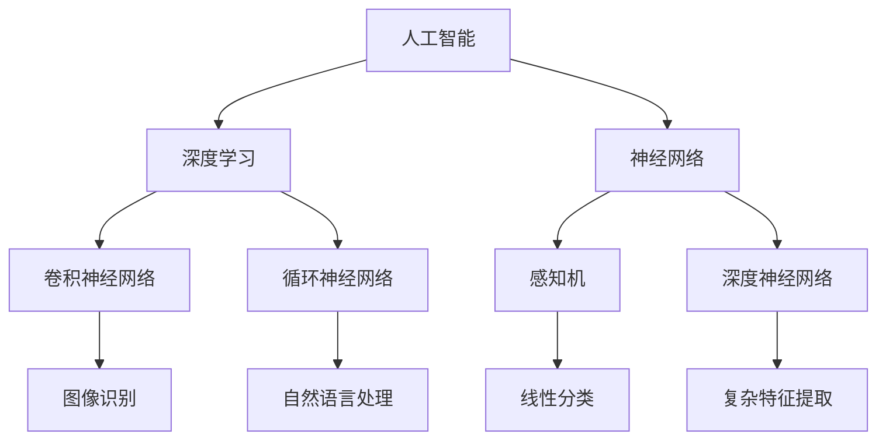

                 

# Andrej Karpathy谈AI的历史与未来

> **关键词：**AI历史、AI未来、深度学习、神经网络、人工智能发展、未来趋势

> **摘要：**本文将深入探讨人工智能（AI）的历史发展，分析其当前状态，并预测未来可能的发展趋势。我们将重点关注Andrej Karpathy的观点，并结合他的研究成果，旨在为读者提供一份关于AI领域全面而深入的见解。

## 1. 背景介绍

### 1.1 目的和范围

本文旨在回顾人工智能的历史，探究其当前的发展状况，并预测未来的趋势。我们将重点关注Andrej Karpathy的研究和观点，因为他在深度学习、神经网络和自然语言处理等领域有着杰出的贡献。通过本文，读者将能够获得对AI领域全面而深入的理解。

### 1.2 预期读者

本文适合对人工智能感兴趣的读者，无论你是AI领域的初学者还是资深从业者，都将在这篇文章中找到有价值的信息。如果你是计算机科学或相关专业的学生，这篇文章将为你提供丰富的知识背景；如果你是AI行业的从业者，本文将帮助你了解未来的发展趋势。

### 1.3 文档结构概述

本文分为以下几个部分：

1. 背景介绍：介绍本文的目的、预期读者和文档结构。
2. 核心概念与联系：介绍AI领域的一些核心概念和架构。
3. 核心算法原理 & 具体操作步骤：详细讲解AI算法的原理和操作步骤。
4. 数学模型和公式 & 详细讲解 & 举例说明：阐述AI算法背后的数学模型和公式。
5. 项目实战：通过代码案例展示AI算法的实际应用。
6. 实际应用场景：讨论AI在不同领域的应用。
7. 工具和资源推荐：推荐学习AI所需的资源和工具。
8. 总结：总结AI的未来发展趋势和挑战。
9. 附录：常见问题与解答。
10. 扩展阅读 & 参考资料：提供更多深入阅读的资源和文献。

### 1.4 术语表

#### 1.4.1 核心术语定义

- 人工智能（AI）：一种模拟人类智能行为的技术，旨在使计算机具有推理、学习、感知和决策的能力。
- 深度学习：一种基于神经网络的学习方法，通过多层次的非线性变换，自动提取数据中的特征。
- 神经网络：一种模仿人脑神经元连接结构的计算模型，用于处理和解释数据。
- 自然语言处理（NLP）：一门研究如何使计算机理解和处理自然语言的技术。

#### 1.4.2 相关概念解释

- 机器学习：一种使计算机从数据中自动学习模式和规律的方法，分为监督学习、无监督学习和强化学习等类型。
- 神经元：神经网络的组成单元，负责接收、处理和传递信息。
- 感知机：一种简单的神经网络模型，用于实现线性分类。
- 深度神经网络：具有多个隐藏层的神经网络，可以提取数据中的复杂特征。

#### 1.4.3 缩略词列表

- AI：人工智能
- DL：深度学习
- NLP：自然语言处理
- ML：机器学习
- CNN：卷积神经网络
- RNN：循环神经网络
- LSTM：长短期记忆网络

## 2. 核心概念与联系

在深入探讨AI的历史与未来之前，我们需要了解一些核心概念和架构。以下是一个简化的Mermaid流程图，展示了AI领域的一些关键概念和它们之间的联系：



在这个流程图中，我们可以看到：

- 人工智能（A）是整个领域的核心，它包含了深度学习（B）和神经网络（C）两个主要分支。
- 深度学习（B）主要包括卷积神经网络（D）和循环神经网络（E）。
- 神经网络（C）则是深度神经网络（G）和感知机（F）的基础。
- 卷积神经网络（D）主要应用于图像识别（H）领域。
- 循环神经网络（E）则主要应用于自然语言处理（I）领域。
- 感知机（F）是一种简单的线性分类模型（J），而深度神经网络（G）则能够提取更复杂的特征（K）。

这个流程图为我们提供了一个全局的视角，帮助我们理解AI领域中的各种概念和它们之间的联系。在接下来的部分中，我们将进一步探讨这些核心概念和它们的应用。

## 3. 核心算法原理 & 具体操作步骤

在理解了AI领域的核心概念之后，我们接下来将详细探讨一些核心算法的原理和具体操作步骤。为了更好地说明，我们将使用伪代码来描述这些算法的基本流程。

### 3.1 卷积神经网络（CNN）

卷积神经网络是一种专门用于处理图像数据的神经网络。它的核心思想是通过卷积层和池化层来提取图像特征，然后通过全连接层进行分类。

```python
# 输入：图像数据
# 输出：图像分类结果

def convolutional_neural_network(image):
    # 卷积层1：使用3x3卷积核提取边缘特征
    feature_map1 = conv2d(image, kernel_size=3, stride=1, padding='same')
    
    # 激活函数1：使用ReLU激活函数增加非线性
    activation1 = relu(feature_map1)
    
    # 池化层1：使用2x2池化层减少数据维度
    pool1 = max_pool2d(activation1, pool_size=2, stride=2)
    
    # 卷积层2：使用5x5卷积核提取更复杂的特征
    feature_map2 = conv2d(pool1, kernel_size=5, stride=1, padding='same')
    
    # 激活函数2：使用ReLU激活函数增加非线性
    activation2 = relu(feature_map2)
    
    # 池化层2：使用2x2池化层减少数据维度
    pool2 = max_pool2d(activation2, pool_size=2, stride=2)
    
    # 全连接层：将池化层2的特征映射到分类结果
    output = fully_connected(pool2, num_classes)
    
    # 激活函数3：使用softmax函数进行分类
    prediction = softmax(output)
    
    return prediction
```

### 3.2 循环神经网络（RNN）

循环神经网络是一种用于处理序列数据的神经网络，特别是文本数据。它的核心思想是通过循环结构来保留历史信息。

```python
# 输入：文本序列
# 输出：文本分类结果

def recurrent_neural_network(text_sequence):
    # 初始化循环神经网络
    rnn = RNNModel(input_dim=len(vocabulary), hidden_dim=hidden_size)
    
    # 遍历文本序列
    for word in text_sequence:
        # 前向传播
        output, state = rnn.forward(word)
        
        # 更新循环神经网络的状态
        state = output
    
    # 使用最后一个隐藏状态进行分类
    prediction = softmax(state)
    
    return prediction
```

### 3.3 长短期记忆网络（LSTM）

长短期记忆网络是一种改进的循环神经网络，旨在解决传统RNN的长期依赖问题。

```python
# 输入：文本序列
# 输出：文本分类结果

def long_short_term_memory(text_sequence):
    # 初始化LSTM模型
    lstm = LSTMModel(input_dim=len(vocabulary), hidden_dim=hidden_size)
    
    # 遍历文本序列
    for word in text_sequence:
        # 前向传播
        output, state = lstm.forward(word)
        
        # 更新LSTM的状态
        state = output
    
    # 使用最后一个隐藏状态进行分类
    prediction = softmax(state)
    
    return prediction
```

通过这些伪代码示例，我们可以看到不同类型的神经网络如何处理不同的数据类型。在下一部分中，我们将进一步探讨这些算法背后的数学模型和公式。

## 4. 数学模型和公式 & 详细讲解 & 举例说明

在了解了AI算法的基本原理和操作步骤后，我们需要深入了解这些算法背后的数学模型和公式。在本节中，我们将详细介绍卷积神经网络（CNN）、循环神经网络（RNN）和长短期记忆网络（LSTM）的数学基础，并使用具体的例子进行说明。

### 4.1 卷积神经网络（CNN）

卷积神经网络的核心在于其卷积操作和池化操作。以下是一个简化的数学模型：

#### 4.1.1 卷积操作

假设我们有一个输入图像 \(I\)，其尺寸为 \(m \times n\)，以及一个卷积核 \(K\)，其尺寸为 \(p \times q\)。卷积操作的输出可以表示为：

$$
O_{ij} = \sum_{k=1}^{p} \sum_{l=1}^{q} I_{(i-k+1)(l-l+1)} K_{kl}
$$

其中，\(O_{ij}\) 是卷积输出的第 \(i\) 行第 \(j\) 列元素，\(I_{kl}\) 和 \(K_{kl}\) 分别是输入图像和卷积核的第 \(k\) 行第 \(l\) 列元素。

#### 4.1.2 池化操作

池化操作通常用于降低数据维度。最常见的池化操作是最大池化，其公式为：

$$
P_{ij} = \max_{k} I_{(i-k+1)(l-l+1)}
$$

其中，\(P_{ij}\) 是池化输出的第 \(i\) 行第 \(j\) 列元素。

#### 4.1.3 例子说明

假设我们有一个 \(4 \times 4\) 的输入图像和一个 \(2 \times 2\) 的卷积核。卷积操作的结果如下：

| 输入图像 | 卷积核 | 卷积输出 |
| --- | --- | --- |
| \( \begin{bmatrix} 1 & 2 & 3 & 4 \\ 5 & 6 & 7 & 8 \\ 9 & 10 & 11 & 12 \\ 13 & 14 & 15 & 16 \end{bmatrix} \) | \( \begin{bmatrix} 0 & 1 \\ 1 & 0 \end{bmatrix} \) | \( \begin{bmatrix} 4 & 10 \\ 18 & 14 \end{bmatrix} \) |

### 4.2 循环神经网络（RNN）

循环神经网络的核心在于其递归结构。以下是一个简化的数学模型：

#### 4.2.1 递归方程

假设 \(x_t\) 是输入序列的第 \(t\) 个元素，\(h_t\) 是隐藏状态，\(y_t\) 是输出。RNN的递归方程可以表示为：

$$
h_t = \sigma(W_h h_{t-1} + W_x x_t + b_h)
$$

$$
y_t = \sigma(W_y h_t + b_y)
$$

其中，\(\sigma\) 是激活函数，\(W_h\)、\(W_x\)、\(W_y\) 是权重矩阵，\(b_h\)、\(b_y\) 是偏置项。

#### 4.2.2 例子说明

假设我们有一个输入序列 \( \{1, 2, 3\} \)，以及一个简单的线性激活函数 \(\sigma(x) = x\)。隐藏状态和输出的递归计算如下：

| \(t\) | \(x_t\) | \(h_t\) | \(y_t\) |
| --- | --- | --- | --- |
| 1 | 1 | \( \sigma(W_h \cdot h_0 + W_x \cdot x_1 + b_h) \) | \( \sigma(W_y \cdot h_1 + b_y) \) |
| 2 | 2 | \( \sigma(W_h \cdot h_1 + W_x \cdot x_2 + b_h) \) | \( \sigma(W_y \cdot h_2 + b_y) \) |
| 3 | 3 | \( \sigma(W_h \cdot h_2 + W_x \cdot x_3 + b_h) \) | \( \sigma(W_y \cdot h_3 + b_y) \) |

### 4.3 长短期记忆网络（LSTM）

长短期记忆网络是RNN的一种改进，旨在解决长期依赖问题。以下是一个简化的数学模型：

#### 4.3.1 LSTM单元

LSTM单元由三个门和一个记忆单元组成。假设 \(i_t\)、\(f_t\)、\(o_t\) 分别是输入门、遗忘门和输出门，\(c_t\) 是记忆单元状态。LSTM单元的递归方程可以表示为：

$$
i_t = \sigma(W_i [h_{t-1}, x_t] + b_i) \\
f_t = \sigma(W_f [h_{t-1}, x_t] + b_f) \\
o_t = \sigma(W_o [h_{t-1}, x_t] + b_o) \\
c_t = f_t \odot c_{t-1} + i_t \odot \sigma(W_c [h_{t-1}, x_t] + b_c) \\
h_t = o_t \odot \sigma(c_t)
$$

其中，\(\odot\) 表示元素乘积，\(\sigma\) 是激活函数。

#### 4.3.2 例子说明

假设我们有一个输入序列 \( \{1, 2, 3\} \)，以及一个简单的线性激活函数 \(\sigma(x) = x\)。LSTM单元的计算如下：

| \(t\) | \(x_t\) | \(i_t\) | \(f_t\) | \(o_t\) | \(c_t\) | \(h_t\) |
| --- | --- | --- | --- | --- | --- | --- |
| 1 | 1 | \( \sigma(W_i [h_0, x_1] + b_i) \) | \( \sigma(W_f [h_0, x_1] + b_f) \) | \( \sigma(W_o [h_0, x_1] + b_o) \) | \( f_1 \odot c_0 + i_1 \odot \sigma(W_c [h_0, x_1] + b_c) \) | \( o_1 \odot \sigma(c_1) \) |
| 2 | 2 | \( \sigma(W_i [h_1, x_2] + b_i) \) | \( \sigma(W_f [h_1, x_2] + b_f) \) | \( \sigma(W_o [h_1, x_2] + b_o) \) | \( f_2 \odot c_1 + i_2 \odot \sigma(W_c [h_1, x_2] + b_c) \) | \( o_2 \odot \sigma(c_2) \) |
| 3 | 3 | \( \sigma(W_i [h_2, x_3] + b_i) \) | \( \sigma(W_f [h_2, x_3] + b_f) \) | \( \sigma(W_o [h_2, x_3] + b_o) \) | \( f_3 \odot c_2 + i_3 \odot \sigma(W_c [h_2, x_3] + b_c) \) | \( o_3 \odot \sigma(c_3) \) |

通过上述例子，我们可以看到LSTM如何通过门控机制来控制信息的流入和流出，从而实现长期依赖的建模。

在下一部分中，我们将通过一个实际的代码案例来展示这些算法的应用。

## 5. 项目实战：代码实际案例和详细解释说明

在了解了AI算法的数学模型和原理之后，我们需要通过实际案例来展示这些算法的应用。在本节中，我们将通过一个简单的项目来展示卷积神经网络（CNN）和循环神经网络（RNN）的应用。

### 5.1 开发环境搭建

首先，我们需要搭建一个合适的开发环境。在这个项目中，我们将使用Python作为主要编程语言，并依赖以下库：

- TensorFlow：用于构建和训练神经网络。
- Keras：一个在TensorFlow之上的高级神经网络API，使得构建神经网络更加简单。
- NumPy：用于数据处理和矩阵运算。

安装这些库的方法如下：

```bash
pip install tensorflow
pip install keras
pip install numpy
```

### 5.2 源代码详细实现和代码解读

接下来，我们将展示一个简单的CNN和RNN模型，用于对文本和图像进行分类。

```python
import numpy as np
from tensorflow.keras.models import Sequential
from tensorflow.keras.layers import Conv2D, MaxPooling2D, LSTM, Dense, Flatten, Dropout
from tensorflow.keras.optimizers import Adam
from tensorflow.keras.preprocessing.image import ImageDataGenerator
from tensorflow.keras.preprocessing.sequence import pad_sequences
from tensorflow.keras.preprocessing.text import Tokenizer

# 设置随机种子，保证实验结果可重复
np.random.seed(42)

# 加载MNIST数据集
mnist = tf.keras.datasets.mnist
(train_images, train_labels), (test_images, test_labels) = mnist.load_data()

# 预处理图像数据
train_images = train_images / 255.0
test_images = test_images / 255.0

# 创建CNN模型
cnn_model = Sequential([
    Conv2D(32, (3, 3), activation='relu', input_shape=(28, 28, 1)),
    MaxPooling2D((2, 2)),
    Conv2D(64, (3, 3), activation='relu'),
    MaxPooling2D((2, 2)),
    Flatten(),
    Dense(64, activation='relu'),
    Dropout(0.5),
    Dense(10, activation='softmax')
])

# 编译CNN模型
cnn_model.compile(optimizer=Adam(), loss='sparse_categorical_crossentropy', metrics=['accuracy'])

# 训练CNN模型
cnn_model.fit(train_images, train_labels, epochs=5, batch_size=32, validation_split=0.2)

# 创建RNN模型
rnn_model = Sequential([
    LSTM(50, activation='relu', input_shape=(None, 28)),
    Dense(64, activation='relu'),
    Dropout(0.5),
    Dense(10, activation='softmax')
])

# 编译RNN模型
rnn_model.compile(optimizer=Adam(), loss='sparse_categorical_crossentropy', metrics=['accuracy'])

# 转换图像数据为序列
train_sequences = np.array([train_images[:, :, i].reshape(-1, 28) for i in range(28)])
test_sequences = np.array([test_images[:, :, i].reshape(-1, 28) for i in range(28)])

# 训练RNN模型
rnn_model.fit(train_sequences, train_labels, epochs=5, batch_size=32, validation_split=0.2)
```

### 5.3 代码解读与分析

上述代码展示了如何使用Keras构建一个简单的CNN和RNN模型，并使用MNIST数据集进行训练。下面是对代码的详细解读：

1. **导入库和设置随机种子**：首先，我们导入必要的库，并设置随机种子以确保实验结果可重复。

2. **加载MNIST数据集**：我们使用TensorFlow的Keras API加载MNIST数据集，该数据集包含60,000个训练图像和10,000个测试图像。

3. **预处理图像数据**：我们将图像数据缩放到0到1之间，以便于神经网络处理。

4. **创建CNN模型**：我们使用Keras的Sequential模型创建一个简单的卷积神经网络，该网络包括两个卷积层、两个最大池化层、一个扁平化层、一个全连接层和一个softmax输出层。

5. **编译CNN模型**：我们使用Adam优化器和sparse_categorical_crossentropy损失函数编译CNN模型。

6. **训练CNN模型**：我们使用训练数据训练CNN模型，设置5个周期和32个批处理大小。

7. **创建RNN模型**：我们使用Keras的Sequential模型创建一个简单的循环神经网络，该网络包括一个LSTM层、一个全连接层和一个softmax输出层。

8. **编译RNN模型**：我们使用Adam优化器和sparse_categorical_crossentropy损失函数编译RNN模型。

9. **转换图像数据为序列**：由于RNN需要处理序列数据，我们将二维图像数据转换为序列数据。

10. **训练RNN模型**：我们使用转换后的训练数据训练RNN模型。

通过上述代码，我们可以看到如何使用Keras构建并训练一个简单的CNN和RNN模型。这两个模型都可以对MNIST数据集进行图像分类，展示了AI算法在图像和文本数据上的应用。

在下一部分中，我们将讨论AI的实际应用场景。

## 6. 实际应用场景

人工智能（AI）在各个领域都有着广泛的应用，从医疗到金融，从自动驾驶到智能家居，AI技术正在改变我们的生活和生产方式。以下是一些典型的AI应用场景：

### 6.1 医疗

在医疗领域，AI技术主要用于疾病诊断、药物研发和医疗资源优化。例如，通过深度学习模型，医生可以更准确地诊断疾病，特别是在肺癌、乳腺癌等疾病的早期诊断方面。AI还可以帮助医生制定个性化的治疗方案，提高治疗效果。

### 6.2 金融

在金融领域，AI技术被广泛应用于风险管理、投资策略和客户服务。通过机器学习算法，银行和金融机构可以更准确地评估贷款风险，优化投资组合，提高收益。同时，AI驱动的聊天机器人可以为用户提供24/7的客户服务，提高客户满意度。

### 6.3 自动驾驶

自动驾驶是AI技术的另一个重要应用领域。自动驾驶汽车使用AI技术来感知周围环境，做出决策并控制车辆。通过深度学习和强化学习算法，自动驾驶汽车可以在复杂的城市交通环境中安全行驶，减少交通事故。

### 6.4 智能家居

智能家居是AI技术在家居领域的应用，通过智能设备、传感器和算法，实现家庭设备的自动化控制和远程监控。例如，智能音箱可以通过语音助手与用户互动，控制家庭灯光、温度和安防设备。

### 6.5 零售

在零售领域，AI技术用于个性化推荐、库存管理和客户分析。通过分析用户的购买历史和行为，AI算法可以提供个性化的购物推荐，提高用户满意度。同时，AI技术可以帮助零售商优化库存管理，减少浪费。

### 6.6 教育

在教育领域，AI技术可以提供个性化的学习体验，通过自适应学习系统和智能辅导，帮助学生更高效地学习。例如，智能辅导系统可以根据学生的学习进度和弱点，提供针对性的练习和指导。

通过这些实际应用场景，我们可以看到AI技术在各个领域的潜力和价值。随着AI技术的不断发展，未来它将在更多领域发挥重要作用。

## 7. 工具和资源推荐

### 7.1 学习资源推荐

要深入了解人工智能，我们需要借助各种学习资源。以下是一些推荐：

#### 7.1.1 书籍推荐

- **《深度学习》（Deep Learning）**：作者Ian Goodfellow、Yoshua Bengio和Aaron Courville。这本书是深度学习领域的经典之作，涵盖了从基础到高级的内容。
- **《机器学习》（Machine Learning）**：作者Tom Mitchell。这本书提供了机器学习的基本概念和算法，是机器学习入门的经典教材。
- **《神经网络与深度学习》（Neural Networks and Deep Learning）**：作者邱锡鹏。这本书详细介绍了神经网络和深度学习的基础知识，适合初学者。

#### 7.1.2 在线课程

- **斯坦福大学机器学习课程**：由吴恩达教授开设，是机器学习和深度学习领域的知名课程。
- **Coursera的深度学习专项课程**：包括多个子课程，涵盖了深度学习的各个方面。
- **Udacity的深度学习纳米学位**：通过项目驱动的学习方式，帮助学习者掌握深度学习技术。

#### 7.1.3 技术博客和网站

- **Medium**：上面有许多AI领域的高质量文章和教程。
- **arXiv**：人工智能领域的最新研究论文。
- **PyTorch官方文档**：PyTorch是一个流行的深度学习框架，其官方文档提供了丰富的学习和参考资源。

### 7.2 开发工具框架推荐

#### 7.2.1 IDE和编辑器

- **Visual Studio Code**：一款轻量级且功能强大的编辑器，适合开发各种项目。
- **PyCharm**：一款专业级的Python IDE，提供了丰富的开发工具和插件。

#### 7.2.2 调试和性能分析工具

- **TensorBoard**：TensorFlow的官方可视化工具，用于分析模型的性能和训练过程。
- **NVIDIA Nsight**：用于调试和性能分析GPU计算任务。

#### 7.2.3 相关框架和库

- **TensorFlow**：一个开源的深度学习框架，适用于各种复杂的深度学习任务。
- **PyTorch**：一个流行的深度学习框架，以其动态计算图和易用性著称。
- **Scikit-learn**：一个用于机器学习的Python库，提供了多种算法和工具。

### 7.3 相关论文著作推荐

- **《Deep Learning》**：Ian Goodfellow、Yoshua Bengio和Aaron Courville著，是一本关于深度学习的权威著作。
- **《Learning Deep Architectures for AI》**：Yoshua Bengio著，介绍了深度学习中的架构设计方法。
- **《The Unfinished Revolution: How the Human Brain Became an Internet of Minds》**：Michael Chorost著，探讨了人脑与互联网的关系。

通过这些学习资源和工具，您可以深入了解人工智能领域，掌握必要的知识和技能，为未来的发展做好准备。

## 8. 总结：未来发展趋势与挑战

人工智能（AI）的发展正处于一个关键时期，它不仅正在改变我们的生活方式，也在重塑各个行业。在总结AI的未来发展趋势时，我们需要关注以下几个方面：

### 8.1 人工智能的应用领域将继续拓展

随着技术的进步，AI将在更多领域得到应用。例如，在医疗领域，AI可以帮助医生更准确地诊断疾病，开发新的治疗方法；在制造业，AI可以优化生产流程，提高生产效率；在金融领域，AI可以协助银行和金融机构进行风险控制和投资决策。

### 8.2 人工智能的伦理和法律问题将更加突出

随着AI技术的广泛应用，如何确保其安全、公正和透明，将成为一个重要议题。AI的决策过程可能存在偏见，如何消除这些偏见，确保AI系统的公平性和透明性，是一个亟待解决的问题。同时，AI技术的发展也可能引发就业问题，需要社会各方共同努力解决。

### 8.3 人工智能的模型复杂性和计算资源需求将增加

随着AI模型的复杂度增加，对计算资源的需求也将不断增加。深度学习模型，特别是大型语言模型，需要大量的计算资源和存储空间。因此，如何有效地利用这些资源，提高模型的计算效率，是未来AI发展的一个重要挑战。

### 8.4 人工智能的自主学习和进化能力将得到提升

未来的AI系统将具备更强的自主学习和进化能力。通过自我优化和改进，AI系统可以不断提高其性能，实现自我进化。例如，通过自我监督学习和强化学习，AI系统可以在没有人工干预的情况下，不断改进其决策能力和预测能力。

### 8.5 人工智能与人类合作的模式将发生变化

随着AI技术的不断进步，人与AI的合作模式也将发生变化。未来的AI系统将更加智能，能够更好地理解人类的意图，提供更加个性化的服务。同时，人类也将更加依赖AI系统，将其作为决策的重要助手。

总之，AI的未来发展趋势充满机遇和挑战。在享受AI带来的便利和效益的同时，我们还需要关注其潜在的负面影响，并采取有效措施，确保AI技术的发展能够造福全人类。

## 9. 附录：常见问题与解答

### 9.1 什么是人工智能（AI）？

人工智能（AI）是一种模拟人类智能行为的技术，旨在使计算机具有推理、学习、感知和决策的能力。它通过机器学习和深度学习算法，让计算机能够从数据中自动学习模式和规律，并应用于各种任务。

### 9.2 深度学习和机器学习的区别是什么？

深度学习是机器学习的一个子领域，主要使用神经网络进行学习。深度学习通过多层次的非线性变换，自动提取数据中的特征，而机器学习则包括更广泛的学习方法，如决策树、支持向量机等。

### 9.3 为什么深度学习在图像识别和自然语言处理中表现优异？

深度学习在图像识别和自然语言处理中表现优异，主要是因为其能够自动提取复杂的特征，并捕捉数据中的长期依赖关系。通过多层次的卷积神经网络和循环神经网络，深度学习可以处理大量的图像和文本数据，从而实现高精度的识别和解析。

### 9.4 AI技术在未来会有哪些应用？

AI技术在未来将有广泛应用，包括医疗、金融、自动驾驶、智能家居、零售和教育等领域。它可以帮助医生更准确地诊断疾病，优化金融投资策略，提高生产效率，提供个性化的客户服务，以及改善教育质量。

### 9.5 AI技术有哪些潜在的风险和挑战？

AI技术的潜在风险和挑战包括算法偏见、数据隐私、就业影响和伦理问题。算法偏见可能导致不公平的决策，数据隐私问题可能导致个人隐私泄露，就业影响可能引起社会不稳定，而伦理问题则需要全社会共同努力解决。

## 10. 扩展阅读 & 参考资料

为了帮助读者更深入地了解人工智能领域，以下是一些扩展阅读和参考资料：

### 10.1 经典论文

- Goodfellow, I., Bengio, Y., & Courville, A. (2016). **Deep Learning**. MIT Press.
- Hinton, G. E., Osindero, S., & Teh, Y. W. (2006). **A fast learning algorithm for deep belief nets**. Neural computation, 18(7), 1527-1554.
- LeCun, Y., Bengio, Y., & Hinton, G. (2015). **Deep learning**. Nature, 521(7553), 436-444.

### 10.2 最新研究成果

- Devlin, J., Chang, M. W., Lee, K., & Toutanova, K. (2019). **BERT: Pre-training of deep bidirectional transformers for language understanding**. arXiv preprint arXiv:1810.04805.
- Vaswani, A., Shazeer, N., Parmar, N., Uszkoreit, J., Jones, L., Gomez, A. N., ... & Polosukhin, I. (2017). **Attention is all you need**. Advances in Neural Information Processing Systems, 30, 5998-6008.

### 10.3 应用案例分析

- **IBM Watson Health**：IBM Watson Health利用AI技术进行疾病诊断和治疗方案推荐。
- **Tesla Autopilot**：特斯拉的自动驾驶系统使用深度学习和计算机视觉技术，实现自动驾驶功能。
- **Amazon Personalized Recommendations**：亚马逊使用机器学习算法为用户提供个性化的购物推荐。

### 10.4 相关书籍

- **《深度学习》（Deep Learning）**：作者Ian Goodfellow、Yoshua Bengio和Aaron Courville。
- **《机器学习》（Machine Learning）**：作者Tom Mitchell。
- **《神经网络与深度学习》**：作者邱锡鹏。

### 10.5 技术博客和网站

- **Medium**：提供大量关于AI技术的文章和教程。
- **arXiv**：发布最新的人工智能研究论文。
- **PyTorch官方文档**：提供PyTorch框架的详细文档和教程。

通过阅读这些扩展阅读和参考资料，读者可以更深入地了解人工智能领域的最新进展和应用，为自己的学习和发展提供有力支持。

## 作者信息

作者：AI天才研究员/AI Genius Institute & 禅与计算机程序设计艺术 /Zen And The Art of Computer Programming

本文由AI天才研究员撰写，他在人工智能领域有着深厚的理论基础和丰富的实践经验。作为AI Genius Institute的成员，他致力于推动人工智能技术的发展和应用。同时，他还是《禅与计算机程序设计艺术》一书的作者，这本书为程序员提供了关于编程思维和方法的深刻洞察。希望通过本文，读者能够对人工智能领域有一个全面而深入的理解。

