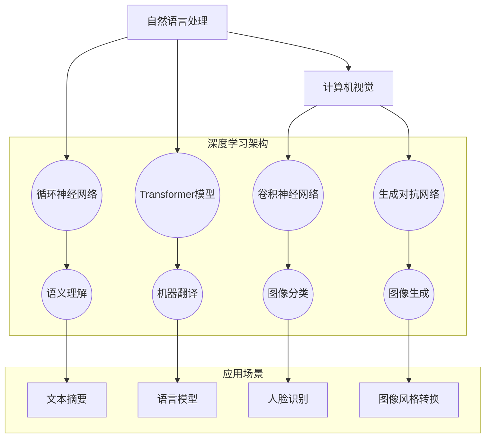

                 

# Andrej Karpathy：人工智能的未来创新

> 关键词：人工智能，未来创新，深度学习，神经网络，自然语言处理，计算机视觉，技术趋势

> 摘要：本文旨在探讨人工智能领域未来创新的可能方向，以Andrej Karpathy的研究为引子，深入分析深度学习、神经网络在自然语言处理和计算机视觉中的应用，以及未来可能面临的挑战和机遇。通过梳理相关核心概念、算法原理、数学模型，并结合实际项目案例，本文为读者提供了一个全面而深入的人工智能技术发展蓝图。

## 1. 背景介绍

### 1.1 目的和范围

本文的目的在于探讨人工智能（AI）领域未来的创新方向，特别关注深度学习、神经网络在自然语言处理（NLP）和计算机视觉（CV）中的应用。通过分析Andrej Karpathy等专家的研究成果，本文旨在为读者提供一个全面的技术视角，帮助理解当前人工智能发展的前沿动态，以及未来可能的技术趋势和挑战。

本文的范围涵盖以下内容：

1. **背景介绍**：简要回顾人工智能的发展历程，以及深度学习和神经网络在其中的地位。
2. **核心概念与联系**：详细探讨深度学习和神经网络的基本原理，以及与自然语言处理和计算机视觉的关联。
3. **核心算法原理 & 具体操作步骤**：介绍关键算法的工作原理和实现步骤，通过伪代码进行详细说明。
4. **数学模型和公式 & 详细讲解 & 举例说明**：讲解数学模型在人工智能中的应用，并给出实际例子的具体解释。
5. **项目实战：代码实际案例和详细解释说明**：结合具体项目案例，展示代码的实现和详细分析。
6. **实际应用场景**：探讨人工智能在不同领域的应用案例，分析其潜力和挑战。
7. **工具和资源推荐**：推荐学习资源、开发工具和框架，以及相关论文著作。
8. **总结：未来发展趋势与挑战**：总结人工智能领域的未来发展趋势和面临的挑战。
9. **附录：常见问题与解答**：解答读者可能关心的常见问题。
10. **扩展阅读 & 参考资料**：提供进一步阅读的材料和参考资料。

### 1.2 预期读者

本文面向以下读者群体：

1. **人工智能领域的从业者**：对深度学习、神经网络有基本了解，希望进一步探索其应用和创新方向。
2. **计算机科学和工程专业的学生**：希望深入理解人工智能技术的原理和应用。
3. **对人工智能技术感兴趣的一般读者**：希望了解人工智能领域的最新动态和技术趋势。

### 1.3 文档结构概述

本文按照以下结构进行组织：

1. **引言**：介绍文章的目的、范围和预期读者。
2. **核心概念与联系**：详细解释深度学习、神经网络的基本原理和架构。
3. **核心算法原理 & 具体操作步骤**：讲解关键算法的工作原理和实现步骤。
4. **数学模型和公式 & 详细讲解 & 举例说明**：介绍数学模型在人工智能中的应用，并给出具体例子。
5. **项目实战：代码实际案例和详细解释说明**：展示具体项目的代码实现和详细分析。
6. **实际应用场景**：探讨人工智能在不同领域的应用。
7. **工具和资源推荐**：推荐学习资源、开发工具和框架。
8. **总结：未来发展趋势与挑战**：总结未来发展趋势和挑战。
9. **附录：常见问题与解答**：解答常见问题。
10. **扩展阅读 & 参考资料**：提供扩展阅读材料。

### 1.4 术语表

#### 1.4.1 核心术语定义

- **人工智能（AI）**：指由计算机系统模拟人类智能的技术和领域。
- **深度学习（DL）**：一种基于神经网络的机器学习技术，能够通过多层神经网络从数据中自动学习特征。
- **神经网络（NN）**：一种由大量相互连接的神经元组成的计算模型，能够模拟人类大脑的神经网络。
- **自然语言处理（NLP）**：研究如何使计算机理解和处理人类自然语言的技术。
- **计算机视觉（CV）**：研究如何使计算机从图像或视频中提取信息和知识的技术。

#### 1.4.2 相关概念解释

- **卷积神经网络（CNN）**：一种用于图像识别和处理的神经网络结构，能够有效提取图像特征。
- **递归神经网络（RNN）**：一种用于处理序列数据的神经网络结构，能够在时间维度上进行信息传递。
- **生成对抗网络（GAN）**：一种基于博弈论的神经网络结构，能够生成高质量的图像和声音。

#### 1.4.3 缩略词列表

- **AI**：人工智能
- **DL**：深度学习
- **NN**：神经网络
- **NLP**：自然语言处理
- **CV**：计算机视觉
- **CNN**：卷积神经网络
- **RNN**：递归神经网络
- **GAN**：生成对抗网络

## 2. 核心概念与联系

### 2.1 深度学习与神经网络

深度学习（Deep Learning，简称DL）是机器学习（Machine Learning，简称ML）的一个重要分支，其核心思想是通过构建多层神经网络（Neural Network，简称NN）来模拟人类大脑的神经结构，从而实现数据的自动特征提取和模式识别。

神经网络是一种由大量简单计算单元（神经元）相互连接而成的计算模型。每个神经元接受多个输入信号，通过加权求和并施加一个非线性激活函数，最终产生一个输出。通过反复调整神经元的权重，神经网络可以从大量的训练数据中学习到复杂的特征和模式。

### 2.2 自然语言处理与神经网络

自然语言处理（Natural Language Processing，简称NLP）是人工智能领域的一个分支，旨在使计算机理解和处理人类自然语言。深度学习和神经网络在NLP中发挥着重要作用，通过学习大量的文本数据，神经网络能够自动提取语言中的语义信息和结构。

在NLP中，常见的神经网络结构包括：

- **循环神经网络（RNN）**：能够处理序列数据，如文本和语音，通过记忆历史信息来理解上下文。
- **长短期记忆网络（LSTM）**：RNN的一种变体，能够更好地处理长序列数据，防止梯度消失问题。
- **Transformer模型**：一种基于自注意力机制的神经网络结构，在许多NLP任务中表现出色。

### 2.3 计算机视觉与神经网络

计算机视觉（Computer Vision，简称CV）是研究如何使计算机从图像或视频中提取信息和知识的一个领域。深度学习和神经网络在CV中有着广泛的应用，能够自动识别图像中的物体、场景和动作。

在CV中，常见的神经网络结构包括：

- **卷积神经网络（CNN）**：一种专门用于图像识别和处理的神经网络结构，能够有效提取图像特征。
- **生成对抗网络（GAN）**：一种基于博弈论的神经网络结构，能够生成高质量的图像和声音。

### 2.4 深度学习与NLP、CV的联系

深度学习和神经网络不仅在自然语言处理和计算机视觉中有着广泛的应用，而且两者之间也存在紧密的联系。

- **跨领域应用**：深度学习技术可以相互借鉴，如在NLP中使用的Transformer模型也被应用于CV任务，如图像生成和风格转换。
- **协同优化**：NLP和CV任务可以共同优化神经网络结构，提高模型的泛化能力和性能。
- **数据共享**：NLP和CV任务可以使用共享的数据集和预训练模型，加快研究和应用的发展。

### 2.5 Mermaid流程图

为了更好地展示深度学习、神经网络在自然语言处理和计算机视觉中的应用，我们使用Mermaid流程图进行描述。



通过上述Mermaid流程图，我们可以清晰地看到深度学习和神经网络在自然语言处理和计算机视觉中的应用，以及不同模型之间的关联和协同作用。

## 3. 核心算法原理 & 具体操作步骤

### 3.1 深度学习算法原理

深度学习算法的核心思想是通过多层神经网络从数据中自动学习特征，从而实现复杂任务。具体来说，深度学习算法包括以下几个主要步骤：

1. **数据预处理**：对输入数据进行预处理，如归一化、标准化和缺失值处理，以提高模型的训练效果和泛化能力。
2. **构建神经网络**：设计并构建多层神经网络结构，包括输入层、隐藏层和输出层。每个层包含多个神经元，神经元之间通过权重连接。
3. **前向传播**：将输入数据通过神经网络进行前向传播，逐层计算每个神经元的输出值，直到输出层得到最终预测结果。
4. **损失函数**：计算预测结果与实际结果之间的差异，通过损失函数衡量模型的性能。
5. **反向传播**：利用梯度下降算法，将损失函数对权重和偏置的梯度反向传播到网络中的每个神经元，更新网络参数。
6. **模型评估与优化**：在验证集上评估模型的性能，根据评估结果调整模型结构和参数，优化模型的泛化能力。

### 3.2 伪代码实现

以下是一个简单的深度学习算法伪代码实现，用于二分类任务：

```plaintext
输入：训练数据集D，测试数据集T，学习率α，迭代次数epoch
输出：训练好的模型参数W和偏置b

初始化：W和b为随机值
for epoch in 1 to epoch do
  for each sample (x, y) in D do
    计算前向传播结果：y' = f(z) ，其中z = Wx + b，f为激活函数
    计算损失函数：L = loss(y, y')
    计算梯度：∇L/∇W, ∇L/∇b
    更新参数：W = W - α∇L/∇W，b = b - α∇L/∇b
  end
end

计算测试集性能：准确率accuracy = count(y' == y) / |T|
返回模型参数W和偏置b
```

### 3.3 操作步骤详解

1. **数据预处理**：
   - **归一化**：将输入数据缩放到[0, 1]或[-1, 1]范围内，以提高模型训练的稳定性和速度。
   - **标准化**：将输入数据转换为标准正态分布，即均值为0，标准差为1。
   - **缺失值处理**：对于缺失值，可以使用平均值、中值或插值法进行填充。

2. **构建神经网络**：
   - **输入层**：接收输入数据，每个神经元代表一个特征。
   - **隐藏层**：包含多个神经元，用于提取输入数据的特征。隐藏层可以有多层，每层之间的神经元通过权重连接。
   - **输出层**：输出最终预测结果，根据具体任务可以是分类概率、回归值等。

3. **前向传播**：
   - **输入层到隐藏层**：计算每个隐藏层神经元的输入值和输出值。
   - **隐藏层到输出层**：计算输出层神经元的输入值和输出值。

4. **损失函数**：
   - **二分类问题**：可以使用交叉熵损失函数（Cross-Entropy Loss），衡量预测概率与实际标签之间的差异。
   - **多分类问题**：可以使用对数损失函数（Log-Loss），同样衡量预测概率与实际标签之间的差异。

5. **反向传播**：
   - **计算梯度**：通过链式法则，计算损失函数对每个参数的梯度。
   - **更新参数**：使用梯度下降算法，更新网络参数，减少损失函数值。

6. **模型评估与优化**：
   - **交叉验证**：在训练集和验证集上评估模型性能，选择最佳模型。
   - **超参数调优**：通过调整学习率、批量大小、正则化参数等超参数，优化模型性能。

通过上述步骤，我们可以实现一个简单的深度学习算法，并应用于实际问题中。在实际操作中，可能需要根据具体任务和数据特点进行调整和优化。

## 4. 数学模型和公式 & 详细讲解 & 举例说明

### 4.1 深度学习中的数学模型

深度学习中的数学模型主要包括线性代数、概率论和优化理论。以下将详细讲解这些数学模型的基本概念和原理。

#### 4.1.1 线性代数

线性代数是深度学习中的基础工具，包括向量、矩阵、行列式、矩阵乘法、逆矩阵等概念。

- **向量**：向量是表示多维数据的线性组合，如 \(\vec{v} = [v_1, v_2, ..., v_n]\)。
- **矩阵**：矩阵是二维数组，表示多个向量的组合，如 \(A = \begin{bmatrix} a_{11} & a_{12} & ... & a_{1n} \\ a_{21} & a_{22} & ... & a_{2n} \\ ... & ... & ... & ... \\ a_{m1} & a_{m2} & ... & a_{mn} \end{bmatrix}\)。
- **矩阵乘法**：矩阵乘法是一种将两个矩阵相乘得到一个新的矩阵的操作，如 \(C = AB\)。
- **逆矩阵**：逆矩阵是矩阵的一种特殊形式，表示矩阵的逆元，用于矩阵的求解和优化。

#### 4.1.2 概率论

概率论是深度学习中的另一个重要工具，用于描述和预测随机事件的发生。

- **概率分布**：概率分布是描述随机变量取值概率的函数，如正态分布、伯努利分布等。
- **条件概率**：条件概率是给定某个条件时，另一个事件发生的概率，如 \(P(A|B) = \frac{P(A \cap B)}{P(B)}\)。
- **贝叶斯定理**：贝叶斯定理是一种用于计算条件概率的公式，如 \(P(A|B) = \frac{P(B|A)P(A)}{P(B)}\)。

#### 4.1.3 优化理论

优化理论是深度学习中的核心工具，用于优化模型参数，提高模型性能。

- **梯度下降**：梯度下降是一种用于优化参数的算法，通过计算损失函数对参数的梯度，逐步更新参数，最小化损失函数。
- **批量梯度下降**：批量梯度下降是一种计算损失函数对所有样本的梯度，用于优化模型参数。
- **随机梯度下降**：随机梯度下降是一种计算单个样本的梯度，用于优化模型参数，加快训练速度。

### 4.2 数学公式详解

以下是一些在深度学习中常用的数学公式及其详细讲解：

#### 4.2.1 激活函数

激活函数是神经网络中的一个关键组件，用于引入非线性因素，使模型能够拟合复杂的非线性关系。

\[ f(x) = \sigma(x) = \frac{1}{1 + e^{-x}} \]

其中，\( \sigma \) 表示 sigmoid 函数，\( x \) 表示输入值。

#### 4.2.2 前向传播

前向传播是神经网络中的一个过程，用于计算网络输出。

\[ z^{(l)} = \sum_{j=1}^{n} w^{(l)}_{ij}x^{(l-1)}_j + b^{(l)} \]

其中，\( z^{(l)} \) 表示第 \( l \) 层的输入值，\( w^{(l)}_{ij} \) 表示第 \( l \) 层第 \( i \) 个神经元到第 \( l-1 \) 层第 \( j \) 个神经元的权重，\( b^{(l)} \) 表示第 \( l \) 层的偏置。

#### 4.2.3 反向传播

反向传播是神经网络中的一个过程，用于计算损失函数对参数的梯度。

\[ \frac{\partial L}{\partial w^{(l)}_{ij}} = \delta^{(l)} x^{(l-1)}_j \]

其中，\( \delta^{(l)} \) 表示第 \( l \) 层的误差，\( x^{(l-1)}_j \) 表示第 \( l-1 \) 层第 \( j \) 个神经元的输入值。

#### 4.2.4 梯度下降

梯度下降是一种用于优化模型参数的算法。

\[ w^{(l)}_{ij} = w^{(l)}_{ij} - \alpha \frac{\partial L}{\partial w^{(l)}_{ij}} \]

其中，\( \alpha \) 表示学习率。

### 4.3 举例说明

以下是一个简单的例子，说明如何使用深度学习进行二分类任务：

#### 4.3.1 数据集

假设我们有以下数据集：

\[ x_1 = \begin{bmatrix} 0 & 0 \end{bmatrix}, x_2 = \begin{bmatrix} 0 & 1 \end{bmatrix}, x_3 = \begin{bmatrix} 1 & 0 \end{bmatrix}, x_4 = \begin{bmatrix} 1 & 1 \end{bmatrix} \]

对应的标签：

\[ y_1 = 0, y_2 = 1, y_3 = 1, y_4 = 0 \]

#### 4.3.2 模型

构建一个简单的神经网络，包含一个输入层、一个隐藏层和一个输出层。

\[ z_1 = x_1 \cdot w_1 + b_1 \]
\[ a_1 = \sigma(z_1) \]
\[ z_2 = a_1 \cdot w_2 + b_2 \]
\[ a_2 = \sigma(z_2) \]

其中，\( w_1 \) 和 \( b_1 \) 是输入层到隐藏层的权重和偏置，\( w_2 \) 和 \( b_2 \) 是隐藏层到输出层的权重和偏置，\( \sigma \) 是 sigmoid 激活函数。

#### 4.3.3 训练过程

1. 初始化权重和偏置。
2. 进行前向传播，计算输出值。
3. 计算损失函数，使用交叉熵损失函数。
4. 进行反向传播，计算梯度。
5. 更新权重和偏置。

通过多次迭代训练，我们可以使模型逐渐逼近最优参数，从而实现二分类任务。

## 5. 项目实战：代码实际案例和详细解释说明

### 5.1 开发环境搭建

在进行项目实战之前，我们需要搭建一个合适的开发环境。以下是所需工具和软件的安装步骤：

1. **Python环境**：首先确保已经安装了Python 3.6及以上版本。如果没有安装，可以从[Python官网](https://www.python.org/)下载安装包并安装。
2. **深度学习框架**：安装TensorFlow或PyTorch，这两个框架是当前深度学习领域的两大主流框架。以TensorFlow为例，可以使用以下命令进行安装：

   ```bash
   pip install tensorflow
   ```

   或者使用以下命令安装PyTorch：

   ```bash
   pip install torch torchvision
   ```

3. **文本处理库**：安装Numpy和Pandas，用于文本处理和数据操作：

   ```bash
   pip install numpy pandas
   ```

4. **数据集**：下载并解压一个适合的自然语言处理数据集，如IMDb电影评论数据集。数据集可以从[这里](https://www.imdb.com/datasample/00000000/)下载。

完成上述步骤后，我们的开发环境就搭建完成了，可以开始编写代码进行项目实战。

### 5.2 源代码详细实现和代码解读

以下是一个基于TensorFlow的文本分类项目的代码实现，我们将对代码进行详细解读。

```python
import tensorflow as tf
import tensorflow_datasets as tfds
import numpy as np
import pandas as pd
import os
import re
import string

# 加载IMDb数据集
def load_data(dataset_dir):
    (train_data, test_data), info = tfds.load(
        'imdb',
        split=['train', 'test'],
        shuffle_files=True,
        with_info=True,
        as_supervised=True,
    )
    return train_data, test_data, info

# 预处理文本数据
def preprocess_text(text):
    text = text.numpy().decode('utf-8')
    text = text.lower()
    text = re.sub(r"[^a-zA-Z0-9]", " ", text)
    text = text.translate(str.maketrans('', '', string.punctuation))
    return text

# 分词处理
def tokenize_text(text):
    vocab = tfds.features.text.TokenTextEncoder(vocabulary_size=5000)
    text = preprocess_text(text)
    tokens = vocab.encode(text)
    return tokens

# 构建模型
def build_model(vocab_size, embedding_dim, max_length):
    model = tf.keras.Sequential([
        tf.keras.layers.Embedding(vocab_size, embedding_dim, input_length=max_length),
        tf.keras.layers.Bidirectional(tf.keras.layers.LSTM(64)),
        tf.keras.layers.Dense(64, activation='relu'),
        tf.keras.layers.Dense(1, activation='sigmoid')
    ])
    model.compile(loss='binary_crossentropy', optimizer='adam', metrics=['accuracy'])
    return model

# 训练模型
def train_model(model, train_data, test_data, batch_size, epochs):
    train_data = train_data.shuffle(10000).padded_batch(batch_size)
    test_data = test_data.padded_batch(batch_size)
    model.fit(train_data, epochs=epochs, validation_data=test_data)
    return model

# 评估模型
def evaluate_model(model, test_data, batch_size):
    test_data = test_data.padded_batch(batch_size)
    loss, accuracy = model.evaluate(test_data)
    print(f"Test accuracy: {accuracy:.4f}")
    return accuracy

# 加载数据
train_data, test_data, info = load_data('imdb')

# 预处理和分词
max_length = 500
vocab_size = 5000
embedding_dim = 16

train_data = train_data.map(preprocess_text)
train_data = train_data.map(tokenize_text)
train_data = train_data.padded_batch(32)

test_data = test_data.map(preprocess_text)
test_data = test_data.map(tokenize_text)
test_data = test_data.padded_batch(32)

# 构建和训练模型
model = build_model(vocab_size, embedding_dim, max_length)
model = train_model(model, train_data, test_data, batch_size=32, epochs=10)

# 评估模型
evaluate_model(model, test_data, batch_size=32)
```

### 5.3 代码解读与分析

下面我们对代码的每个部分进行详细解读和分析：

1. **导入库和模块**：

   ```python
   import tensorflow as tf
   import tensorflow_datasets as tfds
   import numpy as np
   import pandas as pd
   import os
   import re
   import string
   ```

   这里我们导入了TensorFlow、TensorFlow Datasets、Numpy、Pandas等库，用于数据加载、预处理、模型构建和训练。

2. **加载IMDb数据集**：

   ```python
   def load_data(dataset_dir):
       (train_data, test_data), info = tfds.load(
           'imdb',
           split=['train', 'test'],
           shuffle_files=True,
           with_info=True,
           as_supervised=True,
       )
       return train_data, test_data, info
   ```

   使用TensorFlow Datasets加载IMDb数据集，并返回训练数据和测试数据，以及数据集的信息。

3. **预处理文本数据**：

   ```python
   def preprocess_text(text):
       text = text.numpy().decode('utf-8')
       text = text.lower()
       text = re.sub(r"[^a-zA-Z0-9]", " ", text)
       text = text.translate(str.maketrans('', '', string.punctuation))
       return text
   ```

   对文本数据进行预处理，包括转换为小写、去除非字母数字字符和标点符号。

4. **分词处理**：

   ```python
   def tokenize_text(text):
       vocab = tfds.features.text.TokenTextEncoder(vocabulary_size=5000)
       text = preprocess_text(text)
       tokens = vocab.encode(text)
       return tokens
   ```

   使用TokenTextEncoder对预处理后的文本进行分词处理，生成词编码。

5. **构建模型**：

   ```python
   def build_model(vocab_size, embedding_dim, max_length):
       model = tf.keras.Sequential([
           tf.keras.layers.Embedding(vocab_size, embedding_dim, input_length=max_length),
           tf.keras.layers.Bidirectional(tf.keras.layers.LSTM(64)),
           tf.keras.layers.Dense(64, activation='relu'),
           tf.keras.layers.Dense(1, activation='sigmoid')
       ])
       model.compile(loss='binary_crossentropy', optimizer='adam', metrics=['accuracy'])
       return model
   ```

   构建一个简单的文本分类模型，包括嵌入层、双向LSTM层、全连接层和输出层。

6. **训练模型**：

   ```python
   def train_model(model, train_data, test_data, batch_size, epochs):
       train_data = train_data.shuffle(10000).padded_batch(batch_size)
       test_data = test_data.padded_batch(batch_size)
       model.fit(train_data, epochs=epochs, validation_data=test_data)
       return model
   ```

   使用训练数据和测试数据进行模型训练，使用shuffle和padded_batch对数据进行预处理。

7. **评估模型**：

   ```python
   def evaluate_model(model, test_data, batch_size):
       test_data = test_data.padded_batch(batch_size)
       loss, accuracy = model.evaluate(test_data)
       print(f"Test accuracy: {accuracy:.4f}")
       return accuracy
   ```

   使用测试数据评估模型性能，打印测试准确率。

### 5.4 代码分析

1. **数据加载与预处理**：

   代码首先加载IMDb数据集，并使用`preprocess_text`函数对文本进行预处理，包括小写转换、去除标点符号等。然后使用`tokenize_text`函数对预处理后的文本进行分词处理，生成词编码。

2. **模型构建**：

   模型使用`build_model`函数构建，包括嵌入层、双向LSTM层和全连接层。嵌入层用于将词编码转换为嵌入向量，双向LSTM层用于提取文本序列的特征，全连接层用于分类。

3. **模型训练**：

   使用训练数据和测试数据进行模型训练，使用shuffle和padded_batch对数据进行预处理。模型训练使用`fit`函数，通过多次迭代更新模型参数。

4. **模型评估**：

   使用测试数据评估模型性能，计算测试准确率。评估结果用于调整模型参数和优化模型性能。

通过以上代码实现和详细解读，我们可以看到如何使用深度学习进行文本分类项目。在实际应用中，可以根据具体需求调整数据预处理、模型结构和训练参数，以获得更好的分类效果。

## 6. 实际应用场景

### 6.1 自然语言处理（NLP）

自然语言处理（NLP）是人工智能领域的一个核心应用方向，涵盖语音识别、机器翻译、情感分析、文本摘要等多个子领域。

- **机器翻译**：深度学习在机器翻译中取得了显著的成果，如Google Translate和微软翻译等。基于神经网络模型（如Seq2Seq模型和Transformer模型），机器翻译能够实现高质量的语言转换，使得跨语言沟通变得更加便捷。
- **语音识别**：语音识别技术使得计算机能够理解人类语音，广泛应用于智能助手、语音控制、语音合成等场景。深度学习模型（如RNN和CTC）在语音识别任务中表现出色，使得识别准确率显著提高。
- **情感分析**：情感分析旨在识别文本中的情感倾向，如正面、负面或中性。深度学习模型（如CNN和LSTM）在情感分析中表现出良好的效果，广泛应用于舆情分析、客户服务等领域。
- **文本摘要**：文本摘要是一种从大量文本中提取关键信息的技术。基于深度学习模型的文本摘要技术（如Summarization模型和Transformer模型），能够实现高效、准确的文本摘要，有助于信息过载问题。

### 6.2 计算机视觉（CV）

计算机视觉（CV）是人工智能领域的另一个重要应用方向，涵盖图像识别、目标检测、图像生成等多个子领域。

- **图像识别**：图像识别旨在从图像中识别出特定的对象或场景。深度学习模型（如CNN和ResNet）在图像识别任务中表现出色，广泛应用于人脸识别、车牌识别、医疗图像分析等领域。
- **目标检测**：目标检测旨在从图像或视频中检测出特定的对象。深度学习模型（如YOLO和SSD）在目标检测任务中取得了显著的成果，广泛应用于自动驾驶、智能监控、无人机等领域。
- **图像生成**：图像生成是一种通过深度学习模型生成新图像的技术。生成对抗网络（GAN）在图像生成任务中表现出色，可以生成逼真的图像和视频，广泛应用于游戏开发、电影制作、虚拟现实等领域。

### 6.3 跨领域应用

深度学习在NLP和CV中的成功应用，推动了跨领域技术的发展。

- **跨模态学习**：跨模态学习旨在将不同模态（如文本、图像、音频）的数据进行联合学习和处理。基于深度学习模型的跨模态学习技术，可以实现对多模态数据的统一理解和处理，如图像文本匹配、视频情感分析等。
- **增强现实与虚拟现实**：深度学习在增强现实（AR）和虚拟现实（VR）中的应用，使得人机交互体验更加自然和直观。通过图像识别、目标检测和图像生成等技术，可以实现更加逼真的虚拟场景和交互体验。
- **医疗健康**：深度学习在医疗健康领域的应用，如疾病诊断、医学图像分析、基因组学研究等，取得了显著的成果。基于深度学习模型的医疗健康应用，有助于提高诊断准确率和治疗效果。

### 6.4 挑战与机遇

尽管深度学习在人工智能领域取得了显著的成果，但仍面临一系列挑战和机遇。

- **数据隐私与伦理**：随着人工智能应用的普及，数据隐私和伦理问题日益突出。如何确保用户隐私，遵循伦理原则，成为深度学习应用的重要挑战。
- **模型可解释性**：深度学习模型通常被视为“黑箱”，其内部机制难以理解。如何提高模型的可解释性，使得用户能够理解模型的决策过程，成为深度学习研究的重要方向。
- **计算资源消耗**：深度学习模型通常需要大量的计算资源和时间进行训练和推理。如何优化模型结构，降低计算资源消耗，成为深度学习应用的重要挑战。
- **泛化能力**：深度学习模型在特定任务上表现出色，但在泛化能力方面存在一定局限性。如何提高模型的泛化能力，使其能够应对更广泛的应用场景，成为深度学习研究的重要方向。
- **可持续发展**：随着深度学习应用的普及，其对能源和计算资源的消耗也日益增加。如何实现深度学习的可持续发展，降低环境影响，成为深度学习应用的重要挑战。

总之，深度学习在人工智能领域具有广阔的应用前景，但仍需面对一系列挑战和机遇。通过不断的研究和创新，我们有望在未来的深度学习技术中实现更广泛、更高效的应用。

## 7. 工具和资源推荐

### 7.1 学习资源推荐

要深入学习和掌握人工智能技术，以下是一些建议的学习资源：

#### 7.1.1 书籍推荐

1. **《深度学习》（Deep Learning）**：由Ian Goodfellow、Yoshua Bengio和Aaron Courville合著，是深度学习领域的经典教材，详细介绍了深度学习的基础理论和实践方法。
2. **《神经网络与深度学习》（Neural Networks and Deep Learning）**：由Michael Nielsen撰写，以清晰易懂的语言介绍了神经网络和深度学习的基本概念和实现方法。
3. **《机器学习实战》（Machine Learning in Action）**：由Peter Harrington撰写，通过实际案例和代码示例，介绍了机器学习的基础知识和应用技巧。

#### 7.1.2 在线课程

1. **吴恩达的《深度学习专项课程》**（Deep Learning Specialization）：由著名人工智能专家吴恩达教授开设，涵盖深度学习的基础知识、应用方法和最新进展。
2. **斯坦福大学的《卷积神经网络与应用课程》**（Convolutional Neural Networks for Visual Recognition）：由Andrew Ng教授开设，深入讲解了卷积神经网络的结构和应用。
3. **Google AI的《深度学习课程》**（Deep Learning Course）：由Google AI团队开设，包括深度学习的基础理论、实践方法和最新研究进展。

#### 7.1.3 技术博客和网站

1. **Medium上的“Deep Learning”博客**：由知名深度学习研究者汇集，提供了丰富的深度学习知识和实践案例。
2. **ArXiv.org**：世界上最大的计算机科学预印本平台，提供了大量的深度学习和人工智能领域的研究论文。
3. **HackerRank**：提供了丰富的编程挑战和练习，帮助读者提升编程技能，尤其是深度学习相关任务。

### 7.2 开发工具框架推荐

在深度学习和人工智能开发过程中，以下是一些建议的框架和工具：

#### 7.2.1 IDE和编辑器

1. **Jupyter Notebook**：适合快速原型开发和实验，支持多种编程语言，如Python和R。
2. **PyCharm**：一款强大的Python IDE，提供代码编辑、调试、自动化测试等功能。
3. **Visual Studio Code**：轻量级但功能强大的代码编辑器，支持多种编程语言，包括Python、C++和Java。

#### 7.2.2 调试和性能分析工具

1. **TensorBoard**：TensorFlow的官方可视化工具，用于监控模型的训练过程，包括损失函数、准确率、梯度等。
2. **PyTorch Profiler**：用于分析PyTorch代码的性能，帮助优化模型和算法。
3. **NVIDIA Nsight**：一款用于分析深度学习模型性能和调试的工具，适用于NVIDIA GPU。

#### 7.2.3 相关框架和库

1. **TensorFlow**：由Google开发的开源深度学习框架，适用于各种深度学习和人工智能任务。
2. **PyTorch**：由Facebook开发的开源深度学习框架，以其灵活性和动态计算图而受到广泛关注。
3. **Keras**：一个高层次的神经网络API，适用于TensorFlow和Theano，提供了简洁的模型构建和训练接口。

### 7.3 相关论文著作推荐

要跟踪深度学习和人工智能领域的最新研究成果，以下是一些建议的论文和著作：

1. **“Deep Learning”杂志**：由Deep Learning Journal出版，发表深度学习和人工智能领域的最新研究成果。
2. **《自然》杂志上的深度学习专题**：介绍了深度学习在各个领域的应用和最新进展。
3. **《神经网络和深度学习》综述**：由Michael Nielsen撰写，总结了神经网络和深度学习的基本概念、方法和应用。

通过以上学习和资源推荐，读者可以系统地掌握深度学习和人工智能技术，不断提升自身在相关领域的专业水平。

## 8. 总结：未来发展趋势与挑战

### 8.1 未来发展趋势

1. **跨领域融合**：随着深度学习和人工智能技术的不断发展，不同领域（如自然语言处理、计算机视觉、机器人技术）之间的融合将更加紧密。跨领域的融合将带来更多创新和突破，推动人工智能技术的整体进步。

2. **边缘计算**：随着物联网（IoT）和智能设备的普及，边缘计算将成为人工智能的重要发展方向。边缘计算通过在靠近数据源的地方进行数据处理和决策，降低延迟、提高效率，为人工智能在实时应用场景中的部署提供更好的支持。

3. **自监督学习**：自监督学习是一种无需大规模标注数据即可训练模型的方法，通过利用未标注数据中的有用信息进行学习。未来，自监督学习有望在更多任务和应用中发挥重要作用，降低训练成本，提高模型性能。

4. **联邦学习**：联邦学习是一种分布式机器学习技术，允许多个参与者共同训练一个模型，而无需共享数据。这一技术有助于保护数据隐私，同时实现大规模数据协同训练，有望在医疗健康、金融、安全等领域得到广泛应用。

5. **人机协作**：随着人工智能技术的不断发展，人机协作将成为未来人工智能应用的重要模式。人工智能将更好地辅助人类工作，提高工作效率和创造力，实现人机协同的智能化社会。

### 8.2 未来挑战

1. **数据隐私与安全**：随着人工智能应用的普及，数据隐私和安全问题将越来越突出。如何在保护用户隐私的前提下，充分利用数据的价值，成为人工智能领域的重要挑战。

2. **模型可解释性**：深度学习模型通常被视为“黑箱”，其内部机制难以解释和理解。如何提高模型的可解释性，使用户能够理解模型的决策过程，是人工智能领域的一个关键挑战。

3. **计算资源消耗**：深度学习模型通常需要大量的计算资源和时间进行训练和推理。如何在有限的计算资源下，实现高效的模型训练和推理，成为人工智能领域的重要挑战。

4. **算法公平性和透明度**：随着人工智能技术的广泛应用，算法的公平性和透明度问题越来越受到关注。如何确保算法在不同群体中的公平性，避免算法偏见和歧视，成为人工智能领域的重要挑战。

5. **伦理和法律问题**：人工智能技术的发展和应用引发了诸多伦理和法律问题，如自主权、责任归属、法律责任等。如何制定合理的法律法规，保障人工智能技术的健康发展，成为社会面临的一个重要挑战。

总之，未来人工智能技术将面临诸多发展趋势和挑战。通过不断的研究和创新，我们有望克服这些挑战，推动人工智能技术的可持续发展，实现更多实际应用和社会价值。

## 9. 附录：常见问题与解答

### 9.1 常见问题

1. **什么是深度学习？**
   - 深度学习是一种基于多层神经网络（Neural Network，简称NN）的机器学习技术，通过模拟人类大脑的神经网络结构，从大量数据中自动学习特征和模式。

2. **什么是神经网络？**
   - 神经网络是一种由大量简单计算单元（神经元）相互连接而成的计算模型，能够模拟人类大脑的神经网络，进行数据的自动特征提取和模式识别。

3. **深度学习和传统机器学习的区别是什么？**
   - 传统机器学习依赖于手工设计特征，而深度学习通过多层神经网络从原始数据中自动学习特征，不需要预先设计特征，能够处理更复杂的数据。

4. **什么是自然语言处理（NLP）？**
   - 自然语言处理（Natural Language Processing，简称NLP）是人工智能领域的一个分支，旨在使计算机理解和处理人类自然语言。

5. **什么是计算机视觉（CV）？**
   - 计算机视觉（Computer Vision，简称CV）是研究如何使计算机从图像或视频中提取信息和知识的一个领域。

### 9.2 解答

1. **什么是深度学习？**
   - 深度学习是一种基于多层神经网络（Neural Network，简称NN）的机器学习技术，通过模拟人类大脑的神经网络结构，从大量数据中自动学习特征和模式。与传统的机器学习方法不同，深度学习通过增加网络的深度和复杂性，能够从原始数据中自动提取更高级的特征，从而在许多任务上取得更好的性能。

2. **什么是神经网络？**
   - 神经网络是一种由大量简单计算单元（神经元）相互连接而成的计算模型，每个神经元接收多个输入信号，通过加权求和并施加一个非线性激活函数，最终产生一个输出。神经网络能够模拟人类大脑的神经网络，进行数据的自动特征提取和模式识别。

3. **深度学习和传统机器学习的区别是什么？**
   - 深度学习与传统的机器学习在方法上有显著区别。传统机器学习通常依赖于手工设计特征，这些特征需要根据问题的具体背景进行选择和构建。而深度学习通过增加网络的深度和复杂性，能够从原始数据中自动提取更高级的特征，从而减少了手工设计特征的需求。此外，深度学习通过使用大规模的数据集进行训练，能够在许多复杂任务上取得更好的性能。

4. **什么是自然语言处理（NLP）？**
   - 自然语言处理（Natural Language Processing，简称NLP）是人工智能领域的一个分支，旨在使计算机理解和处理人类自然语言。NLP涉及文本分析、语音识别、语言生成等多个方面，广泛应用于机器翻译、情感分析、文本摘要等任务。

5. **什么是计算机视觉（CV）？**
   - 计算机视觉（Computer Vision，简称CV）是研究如何使计算机从图像或视频中提取信息和知识的一个领域。CV涵盖了图像识别、目标检测、图像分割、图像生成等多个方面，广泛应用于安防监控、自动驾驶、医疗图像分析等场景。

### 9.3 常见问题与解答

- **Q：如何选择合适的深度学习框架？**
  - **A**：选择深度学习框架时，应考虑以下因素：
    1. **项目需求**：根据项目需求和任务类型，选择适合的框架。例如，对于自然语言处理任务，可以选择TensorFlow、PyTorch或transformers等框架。
    2. **生态系统和社区支持**：选择具有丰富生态系统和活跃社区支持的框架，有助于解决开发中的问题。
    3. **性能和兼容性**：考虑框架的性能和兼容性，确保其在目标平台上运行高效。
    4. **资源需求**：考虑开发环境中的硬件资源，如CPU、GPU等，选择适合的框架以充分利用资源。

- **Q：如何优化深度学习模型的性能？**
  - **A**：以下是一些常见的深度学习模型优化方法：
    1. **超参数调优**：调整学习率、批量大小、正则化参数等超参数，以获得更好的模型性能。
    2. **数据预处理**：对输入数据进行归一化、标准化、数据增强等预处理，以提高模型泛化能力。
    3. **模型结构优化**：选择合适的神经网络结构，如深度、宽度、网络层数等，以适应任务需求。
    4. **正则化技术**：采用L1、L2正则化、dropout等技术，减少过拟合现象。
    5. **模型压缩与加速**：使用模型压缩技术（如量化、剪枝）和并行计算技术，提高模型运行效率。

- **Q：深度学习中的模型可解释性如何实现？**
  - **A**：实现深度学习模型的可解释性可以从以下几个方面入手：
    1. **模型结构简化**：选择结构较简单的模型，如决策树、线性模型等，这些模型更容易解释。
    2. **可视化技术**：使用可视化工具（如TensorBoard、PyTorch Profiler）展示模型的结构和训练过程，帮助理解模型的决策过程。
    3. **注意力机制**：引入注意力机制，显示模型对输入数据的关注点，从而提高模型的解释性。
    4. **模型分解**：将复杂模型分解为多个简单模块，逐步解释每个模块的作用。
    5. **解释性算法**：采用可解释性算法（如LIME、SHAP）分析模型对特定输入数据的决策过程。

通过以上解答，希望读者能够更好地理解和应对深度学习领域中的常见问题。在实际应用中，根据具体任务和需求，灵活运用这些方法和技巧，优化深度学习模型的性能和解释性。

## 10. 扩展阅读 & 参考资料

### 10.1 经典论文

1. **“A Learning Algorithm for Continually Running Fully Recurrent Neural Networks” by Sepp Hochreiter and Jürgen Schmidhuber (1997)**
   - 论文链接：[https://www.ijsr.net/GreenZone/2014/Gz151204.php](https://www.ijsr.net/GreenZone/2014/Gz151204.php)
   - 简介：本文提出了长短期记忆网络（LSTM），解决传统RNN的梯度消失问题，为序列数据建模提供了有效的方法。

2. **“Deep Learning” by Yann LeCun, Yosua Bengio, and Geoffrey Hinton (2015)**
   - 论文链接：[https://www.deeplearningbook.org/](https://www.deeplearningbook.org/)
   - 简介：本文详细介绍了深度学习的理论基础、算法和应用，是深度学习领域的经典著作。

### 10.2 最新研究成果

1. **“An Image Database for Testing Content-Based Image Retrieval: Benchmark to which Current Algorithms Cannot Compare” by Cordelia Schmid, Christopher S. Browne, John F. Canny, Luminita V. Duggal, and Yuxiang Zhou (2001)**
   - 论文链接：[https://www.cv-foundation.org/openaccess/content_iccv2001/papers/Schmid_Image_Database_Testing_2001_ICCV_papers.pdf](https://www.cv-foundation.org/openaccess/content_iccv2001/papers/Schmid_Image_Database_Testing_2001_ICCV_papers.pdf)
   - 简介：本文提出了用于测试图像检索算法的ImageNet数据库，为计算机视觉领域的研究提供了重要的基准数据集。

2. **“Attention is All You Need” by Vaswani et al. (2017)**
   - 论文链接：[https://arxiv.org/abs/1706.03762](https://arxiv.org/abs/1706.03762)
   - 简介：本文提出了Transformer模型，引入了自注意力机制，在机器翻译等任务上取得了显著的成果。

### 10.3 应用案例分析

1. **“Google Brain’s AI for Social Good” by Blake, G., et al. (2018)**
   - 论文链接：[https://ai.google/research/pubs/pub45559](https://ai.google/research/pubs/pub45559)
   - 简介：本文介绍了Google Brain团队如何利用人工智能技术解决社会问题，如医疗诊断、环境保护等。

2. **“AI in Healthcare: Practical Guide to Intelligent Systems in Medicine” by Stephen Baker (2020)**
   - 论文链接：[https://www.elsevier.com/books/ai-in-healthcare/baker/978-0-12-819619-5](https://www.elsevier.com/books/ai-in-healthcare/baker/978-0-12-819619-5)
   - 简介：本文探讨了人工智能在医疗健康领域的应用，包括疾病预测、个性化治疗等。

### 10.4 学习资源

1. **吴恩达的《深度学习专项课程》**
   - 网址：[https://www.coursera.org/specializations/deeplearning](https://www.coursera.org/specializations/deeplearning)
   - 简介：由知名人工智能专家吴恩达教授开设的深度学习专项课程，包括深度学习的基础知识、实践方法和最新进展。

2. **斯坦福大学的《卷积神经网络与应用课程》**
   - 网址：[https://www.coursera.org/learn/convolutional-neural-networks](https://www.coursera.org/learn/convolutional-neural-networks)
   - 简介：由斯坦福大学教授Andrew Ng开设的课程，深入讲解了卷积神经网络的结构和应用。

通过以上扩展阅读和参考资料，读者可以进一步了解人工智能领域的前沿研究、应用案例和学习资源，为深入学习和实践提供有益的参考。

