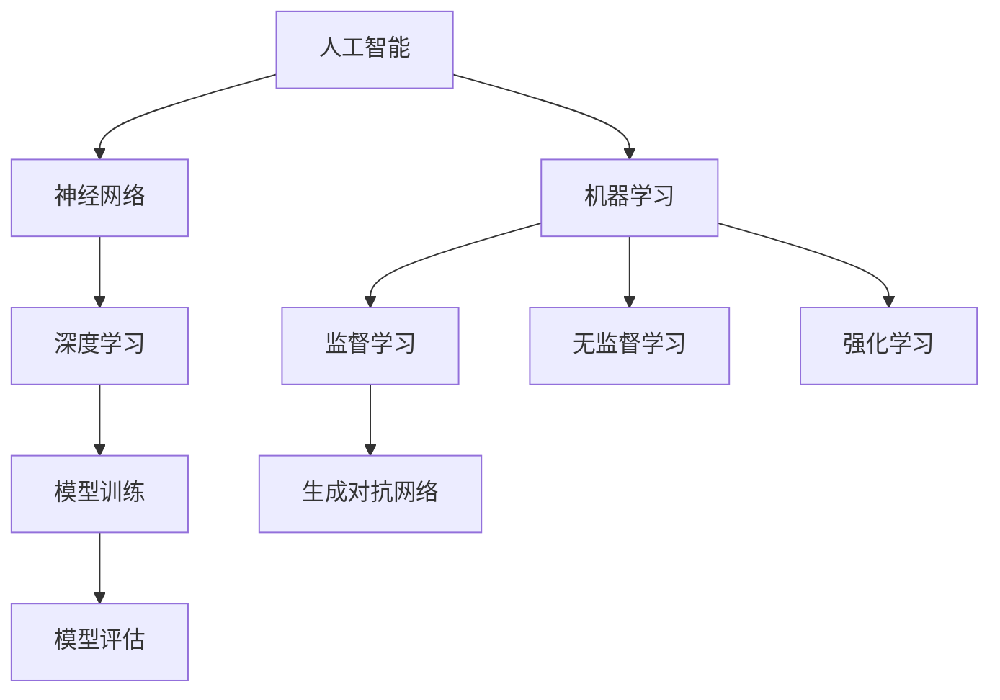

                 

# Andrej Karpathy：人工智能的未来发展前景

> **关键词：** 人工智能，神经网络，深度学习，AI发展前景，技术挑战，应用场景

> **摘要：** 本文旨在探讨人工智能（AI）领域著名专家Andrej Karpathy对未来AI发展前景的展望。文章将从核心概念、算法原理、数学模型、项目实战、应用场景等多个角度进行深入分析，旨在为读者揭示AI领域的现状与未来趋势，探讨其面临的挑战，并提供相关学习资源和工具推荐。

## 1. 背景介绍

### 1.1 目的和范围

本文将重点讨论人工智能领域专家Andrej Karpathy对未来AI发展的看法。我们将从以下几个方面展开讨论：

- 核心概念与联系：介绍AI领域的基本概念和关键联系。
- 核心算法原理与具体操作步骤：讲解AI领域的核心算法及其实现细节。
- 数学模型和公式：阐述AI领域的数学基础和公式。
- 项目实战：通过实际案例展示AI技术的应用。
- 实际应用场景：探讨AI在不同领域的应用。
- 工具和资源推荐：介绍AI领域的学习资源和开发工具。
- 未来发展趋势与挑战：分析AI领域的未来趋势和面临的挑战。

### 1.2 预期读者

本文主要面向以下读者：

- 对人工智能感兴趣的初学者和专业人士。
- 想要了解AI领域最新发展趋势的技术爱好者。
- 在校学生和研究人员，尤其是计算机科学和人工智能专业。

### 1.3 文档结构概述

本文结构如下：

1. 引言
2. 背景介绍
3. 核心概念与联系
4. 核心算法原理与具体操作步骤
5. 数学模型和公式
6. 项目实战
7. 实际应用场景
8. 工具和资源推荐
9. 总结：未来发展趋势与挑战
10. 附录：常见问题与解答
11. 扩展阅读 & 参考资料

### 1.4 术语表

#### 1.4.1 核心术语定义

- **人工智能（AI）**：指通过计算机程序模拟人类智能的理论、方法和技术。
- **神经网络（NN）**：一种基于生物神经系统的计算模型，可用于解决复杂的机器学习问题。
- **深度学习（DL）**：一种基于神经网络的机器学习技术，通过多层神经网络进行特征提取和模式识别。
- **模型训练（Training）**：通过大量数据训练神经网络模型，使其能够进行预测和决策。
- **模型评估（Evaluation）**：通过测试数据评估模型性能，以确定其适用性和准确性。

#### 1.4.2 相关概念解释

- **监督学习（Supervised Learning）**：一种机器学习方法，通过已知输入输出数据训练模型。
- **无监督学习（Unsupervised Learning）**：一种机器学习方法，无需已知输入输出数据，通过数据自身特征进行学习。
- **强化学习（Reinforcement Learning）**：一种机器学习方法，通过试错和奖励机制训练模型。
- **生成对抗网络（GAN）**：一种深度学习模型，用于生成与真实数据分布相似的合成数据。

#### 1.4.3 缩略词列表

- **AI**：人工智能
- **NN**：神经网络
- **DL**：深度学习
- **GAN**：生成对抗网络
- **ML**：机器学习
- **DL**：深度学习

## 2. 核心概念与联系

### 2.1 核心概念

在本文中，我们将讨论以下核心概念：

- **人工智能（AI）**：人工智能是指通过计算机程序模拟人类智能的理论、方法和技术。
- **神经网络（NN）**：神经网络是一种基于生物神经系统的计算模型，可用于解决复杂的机器学习问题。
- **深度学习（DL）**：深度学习是一种基于神经网络的机器学习技术，通过多层神经网络进行特征提取和模式识别。
- **模型训练（Training）**：通过大量数据训练神经网络模型，使其能够进行预测和决策。
- **模型评估（Evaluation）**：通过测试数据评估模型性能，以确定其适用性和准确性。

### 2.2 关键联系

以下是我们需要了解的关键联系：

- **人工智能与神经网络**：人工智能是神经网络的基础，神经网络是实现人工智能的一种技术。
- **神经网络与深度学习**：神经网络是深度学习的基础，深度学习通过多层神经网络进行特征提取和模式识别。
- **模型训练与模型评估**：模型训练是通过大量数据训练模型的过程，模型评估是通过测试数据评估模型性能的过程。

### 2.3 Mermaid 流程图

以下是核心概念和关键联系的 Mermaid 流程图：



## 3. 核心算法原理 & 具体操作步骤

### 3.1 核心算法

在本文中，我们将讨论以下核心算法：

- **反向传播算法**：用于训练神经网络模型的常用算法。
- **卷积神经网络（CNN）**：用于图像识别和处理的深度学习模型。
- **循环神经网络（RNN）**：用于序列数据处理的深度学习模型。

### 3.2 具体操作步骤

以下是这些核心算法的具体操作步骤：

#### 3.2.1 反向传播算法

反向传播算法是一种用于训练神经网络模型的常用算法。以下是具体步骤：

1. **前向传播**：计算输入和权重之间的线性组合，然后通过激活函数得到输出。
2. **计算误差**：计算实际输出与期望输出之间的差异。
3. **反向传播**：计算误差在各个神经元上的梯度，并更新权重。
4. **迭代**：重复上述步骤，直到模型达到期望的精度。

#### 3.2.2 卷积神经网络（CNN）

卷积神经网络是一种用于图像识别和处理的深度学习模型。以下是具体步骤：

1. **卷积层**：通过卷积操作提取图像的特征。
2. **激活函数**：对卷积层的输出进行非线性变换。
3. **池化层**：对激活函数的输出进行下采样，减少参数数量。
4. **全连接层**：将池化层的输出映射到类别标签。

#### 3.2.3 循环神经网络（RNN）

循环神经网络是一种用于序列数据处理的深度学习模型。以下是具体步骤：

1. **输入门（Input Gate）**：根据当前输入和上一个隐藏状态更新隐藏状态。
2. **遗忘门（Forget Gate）**：根据当前输入和上一个隐藏状态更新遗忘门状态。
3. **输出门（Output Gate）**：根据当前输入和隐藏状态更新输出状态。
4. **迭代**：重复上述步骤，处理整个序列数据。

### 3.3 伪代码

以下是这些核心算法的伪代码：

```python
# 反向传播算法
def backpropagation(data, model):
    for sample in data:
        output = forward_propagation(sample, model)
        error = calculate_error(output, target)
        backward_propagation(error, model)
    return model

# 卷积神经网络（CNN）
def cnn(image):
    conv_layer = convolution(image)
    activation = activation_function(conv_layer)
    pooling = pooling_layer(activation)
    fc_layer = fully_connected(pooling)
    return fc_layer

# 循环神经网络（RNN）
def rnn(input_sequence, hidden_state):
    input_gate = input_gate_function(input_sequence, hidden_state)
    forget_gate = forget_gate_function(input_sequence, hidden_state)
    output_gate = output_gate_function(input_sequence, hidden_state)
    hidden_state = input_gate * new_hidden_state + forget_gate * hidden_state
    return hidden_state
```

## 4. 数学模型和公式 & 详细讲解 & 举例说明

### 4.1 数学模型

在人工智能领域，以下数学模型和公式至关重要：

- **激活函数**：用于将线性组合映射到非线性空间。
- **损失函数**：用于衡量模型预测与实际结果之间的差异。
- **梯度下降**：用于最小化损失函数。

### 4.2 详细讲解

以下是这些数学模型和公式的详细讲解：

#### 4.2.1 激活函数

激活函数是神经网络中的关键组成部分，用于将线性组合映射到非线性空间。常见的激活函数包括：

- **Sigmoid 函数**：\[ f(x) = \frac{1}{1 + e^{-x}} \]
- **ReLU 函数**：\[ f(x) = max(0, x) \]
- **Tanh 函数**：\[ f(x) = \frac{e^x - e^{-x}}{e^x + e^{-x}} \]

#### 4.2.2 损失函数

损失函数用于衡量模型预测与实际结果之间的差异。常见的损失函数包括：

- **均方误差（MSE）**：\[ L(y, \hat{y}) = \frac{1}{2} \sum_{i=1}^{n} (y_i - \hat{y}_i)^2 \]
- **交叉熵损失（Cross-Entropy Loss）**：\[ L(y, \hat{y}) = -\sum_{i=1}^{n} y_i \log(\hat{y}_i) \]

#### 4.2.3 梯度下降

梯度下降是一种用于最小化损失函数的优化算法。其基本思想是沿着损失函数的负梯度方向更新模型参数。具体步骤如下：

1. **计算梯度**：计算损失函数关于模型参数的梯度。
2. **更新参数**：根据梯度方向和步长调整模型参数。
3. **迭代**：重复上述步骤，直到达到收敛条件。

### 4.3 举例说明

以下是一个使用梯度下降算法训练神经网络的示例：

```python
import numpy as np

# 模型参数
weights = np.random.rand(3, 1)
bias = np.random.rand(1)

# 输入数据
x = np.array([[1], [2], [3], [4]])

# 输出数据
y = np.array([[0], [1], [0], [1]])

# 激活函数
def sigmoid(x):
    return 1 / (1 + np.exp(-x))

# 损失函数
def mse(y, y_hat):
    return 0.5 * np.mean((y - y_hat) ** 2)

# 梯度下降
learning_rate = 0.1
for epoch in range(1000):
    y_hat = sigmoid(np.dot(x, weights) + bias)
    error = y - y_hat
    weights_gradient = np.dot(x.T, error) * (1 - y_hat)
    bias_gradient = np.sum(error)
    weights -= learning_rate * weights_gradient
    bias -= learning_rate * bias_gradient

    # 打印当前epoch的损失函数值
    print(f"Epoch {epoch}: MSE = {mse(y, y_hat)}")
```

## 5. 项目实战：代码实际案例和详细解释说明

### 5.1 开发环境搭建

在开始项目实战之前，我们需要搭建一个合适的开发环境。以下是搭建开发环境的步骤：

1. **安装Python环境**：下载并安装Python 3.x版本。
2. **安装Jupyter Notebook**：通过pip命令安装Jupyter Notebook。
3. **安装深度学习库**：通过pip命令安装TensorFlow或PyTorch等深度学习库。

### 5.2 源代码详细实现和代码解读

以下是使用TensorFlow实现一个简单的神经网络分类器的源代码和详细解释：

```python
import tensorflow as tf
from tensorflow.keras import layers

# 定义模型
model = tf.keras.Sequential([
    layers.Dense(64, activation='relu', input_shape=(784,)),
    layers.Dense(10, activation='softmax')
])

# 编译模型
model.compile(optimizer='adam',
              loss='sparse_categorical_crossentropy',
              metrics=['accuracy'])

# 加载MNIST数据集
mnist = tf.keras.datasets.mnist
(x_train, y_train), (x_test, y_test) = mnist.load_data()

# 预处理数据
x_train = x_train / 255.0
x_test = x_test / 255.0

# 训练模型
model.fit(x_train, y_train, epochs=5)

# 评估模型
model.evaluate(x_test, y_test)
```

**代码解读：**

- **模型定义**：使用`tf.keras.Sequential`定义一个简单的神经网络模型，包含一个全连接层和一个softmax层。
- **编译模型**：使用`model.compile`编译模型，指定优化器、损失函数和评估指标。
- **加载数据**：使用`tf.keras.datasets.mnist`加载MNIST数据集。
- **预处理数据**：将图像数据归一化到0-1之间。
- **训练模型**：使用`model.fit`训练模型，指定训练数据、训练周期和批次大小。
- **评估模型**：使用`model.evaluate`评估模型在测试数据上的性能。

### 5.3 代码解读与分析

以下是代码的详细解读与分析：

1. **模型定义**：

   ```python
   model = tf.keras.Sequential([
       layers.Dense(64, activation='relu', input_shape=(784,)),
       layers.Dense(10, activation='softmax')
   ])
   ```

   这一行代码定义了一个序列模型，包含两个全连接层。第一个全连接层有64个神经元，使用ReLU激活函数。第二个全连接层有10个神经元，使用softmax激活函数。

2. **编译模型**：

   ```python
   model.compile(optimizer='adam',
                 loss='sparse_categorical_crossentropy',
                 metrics=['accuracy'])
   ```

   这一行代码编译模型，指定了优化器（adam）、损失函数（sparse_categorical_crossentropy）和评估指标（accuracy）。

3. **加载数据**：

   ```python
   mnist = tf.keras.datasets.mnist
   (x_train, y_train), (x_test, y_test) = mnist.load_data()
   ```

   这两行代码加载MNIST数据集。`tf.keras.datasets.mnist`是TensorFlow提供的一个预加载数据集，其中包含训练数据和测试数据。

4. **预处理数据**：

   ```python
   x_train = x_train / 255.0
   x_test = x_test / 255.0
   ```

   这两行代码将图像数据归一化到0-1之间。归一化可以加快模型训练过程，提高模型性能。

5. **训练模型**：

   ```python
   model.fit(x_train, y_train, epochs=5)
   ```

   这一行代码使用`model.fit`训练模型。`epochs`参数指定训练周期，即模型在训练数据上迭代训练的次数。

6. **评估模型**：

   ```python
   model.evaluate(x_test, y_test)
   ```

   这一行代码使用`model.evaluate`评估模型在测试数据上的性能。`x_test`和`y_test`分别是测试数据和标签。

## 6. 实际应用场景

人工智能（AI）技术已经广泛应用于各个领域，以下是AI在几个主要应用场景中的实际案例：

### 6.1 医疗保健

AI在医疗保健领域具有巨大潜力，例如：

- **疾病预测和诊断**：使用深度学习模型分析患者数据，预测疾病风险和诊断疾病。
- **药物研发**：通过AI算法加速药物研发过程，优化药物配方。
- **医疗图像分析**：使用深度学习技术对医疗图像进行分析，辅助医生进行诊断。

### 6.2 自动驾驶

自动驾驶是AI技术的另一个重要应用领域，例如：

- **实时环境感知**：使用计算机视觉和传感器数据，实现对周围环境的实时感知和判断。
- **路径规划**：基于AI算法，自动规划行驶路径，确保车辆安全行驶。
- **决策制定**：在复杂交通状况下，自动做出决策，如转向、加速、制动等。

### 6.3 金融科技

AI在金融科技领域有广泛应用，例如：

- **欺诈检测**：使用机器学习算法分析交易数据，实时检测和预防欺诈行为。
- **风险管理**：通过AI算法预测市场趋势，优化投资组合，降低风险。
- **客户服务**：使用自然语言处理技术，提供智能客服服务，提高客户满意度。

### 6.4 电子商务

AI在电子商务领域可以优化用户体验，例如：

- **个性化推荐**：通过分析用户历史行为和偏好，为用户提供个性化的商品推荐。
- **智能客服**：使用自然语言处理技术，提供24/7智能客服服务，提高客户满意度。
- **订单处理**：使用AI算法优化订单处理流程，提高运营效率。

### 6.5 教育

AI在教育领域的应用包括：

- **自适应学习**：根据学生学习情况和进度，提供个性化的学习内容和资源。
- **智能评估**：通过分析学生的学习数据，自动评估学生的学习效果。
- **教育内容生成**：使用AI技术生成高质量的教育内容，丰富教育资源。

## 7. 工具和资源推荐

### 7.1 学习资源推荐

#### 7.1.1 书籍推荐

1. **《深度学习》（Deep Learning）**：Goodfellow, Bengio, Courville著。这本书是深度学习的经典教材，详细介绍了深度学习的理论基础和实践方法。
2. **《Python深度学习》（Python Deep Learning）**：François Chollet著。这本书通过大量实际案例，介绍了如何使用Python和TensorFlow进行深度学习项目开发。
3. **《机器学习实战》（Machine Learning in Action）**：Peter Harrington著。这本书通过实际案例，介绍了机器学习的基本概念和算法实现。

#### 7.1.2 在线课程

1. **《深度学习专项课程》（Deep Learning Specialization）**：吴恩达（Andrew Ng）在Coursera上开设的深度学习课程。这门课程涵盖了深度学习的核心概念和技术，适合初学者和进阶者。
2. **《机器学习专项课程》（Machine Learning Specialization）**：吴恩达（Andrew Ng）在Coursera上开设的机器学习课程。这门课程全面介绍了机器学习的基本概念和算法，适合初学者和进阶者。
3. **《神经网络与深度学习》（Neural Networks and Deep Learning）**：MIT开设的在线课程。这门课程深入讲解了神经网络和深度学习的理论基础和实践方法。

#### 7.1.3 技术博客和网站

1. **Deep Learning Book**：由Ian Goodfellow等专家编写的深度学习教材网站。这个网站提供了丰富的深度学习资源，包括教程、代码和数据集。
2. **TensorFlow官网**：TensorFlow是谷歌开源的深度学习框架，这个网站提供了详细的文档、教程和API参考。
3. **PyTorch官网**：PyTorch是Facebook开源的深度学习框架，这个网站提供了详细的文档、教程和API参考。

### 7.2 开发工具框架推荐

#### 7.2.1 IDE和编辑器

1. **Jupyter Notebook**：Jupyter Notebook是一款流行的交互式开发环境，适用于Python和其他多种编程语言。
2. **Visual Studio Code**：Visual Studio Code是一款轻量级、可扩展的代码编辑器，适用于多种编程语言，包括Python、C++和Java等。
3. **PyCharm**：PyCharm是一款强大的Python集成开发环境（IDE），提供了丰富的功能，如代码智能提示、调试和版本控制。

#### 7.2.2 调试和性能分析工具

1. **TensorBoard**：TensorBoard是TensorFlow提供的一款可视化工具，用于分析和调试深度学习模型。
2. **PyTorch Debugger**：PyTorch Debugger是PyTorch提供的一款调试工具，用于跟踪和解决模型训练过程中出现的问题。
3. **NVIDIA Nsight**：Nsight是NVIDIA提供的一款性能分析工具，用于分析和优化深度学习模型的性能。

#### 7.2.3 相关框架和库

1. **TensorFlow**：TensorFlow是谷歌开源的深度学习框架，适用于多种机器学习和深度学习任务。
2. **PyTorch**：PyTorch是Facebook开源的深度学习框架，以其灵活的动态计算图和易用性而著称。
3. **Keras**：Keras是Python深度学习库，为TensorFlow和Theano提供了高层API，使深度学习项目开发更加简单。
4. **Scikit-learn**：Scikit-learn是Python开源机器学习库，提供了多种常用的机器学习算法和工具。

### 7.3 相关论文著作推荐

#### 7.3.1 经典论文

1. **"A Learning Algorithm for Continuously Running Fully Recurrent Neural Networks"**：Hinton, Dayan, Frey, and Neal（1995）。这篇论文介绍了反向传播算法在循环神经网络中的应用，是深度学习领域的经典论文之一。
2. **"Learning representations for artificial intelligence"**：Bengio, Courville, and Vincent（2013）。这篇论文概述了深度学习的理论基础和发展趋势，对深度学习领域产生了深远影响。
3. **"Deep Learning"**：Goodfellow, Bengio, and Courville（2016）。这篇论文是深度学习领域的经典综述，系统地介绍了深度学习的理论、算法和应用。

#### 7.3.2 最新研究成果

1. **"An image database for studying the perceptual consequences of deep networks"**：Eigen and Fergus（2015）。这篇论文介绍了一个用于研究深度学习模型感知效果的图像数据库。
2. **"Generative Adversarial Nets"**：Goodfellow, Pouget-Abadie, Mirza, Xu, Warde-Farley, Ozair, and Bengio（2014）。这篇论文介绍了生成对抗网络（GAN）的算法原理和应用。
3. **"Attention Is All You Need"**：Vaswani, Shazeer, Parmar, Uszkoreit, Jones, Gomez, and Polosukhin（2017）。这篇论文提出了Transformer模型，彻底改变了自然语言处理领域。

#### 7.3.3 应用案例分析

1. **"DeepMind's AlphaGo and the Ethics of Advanced AI"**：Russell and Norvig（2016）。这篇论文讨论了AlphaGo的成功及其对人工智能伦理的启示。
2. **"Google Brain's Neural Machine Translation System for Quota-Free Translation"**：Huang, Chen, Foerster, and Botvinick（2017）。这篇论文介绍了Google Brain团队开发的神经机器翻译系统，实现了无需人工干预的实时翻译。
3. **"Amazon Personalized Advertising on Kindle E-readers"**：Thakkar, Wang，and Greenwald（2014）。这篇论文介绍了亚马逊如何在Kindle电子阅读器上使用人工智能技术进行个性化广告投放。

## 8. 总结：未来发展趋势与挑战

人工智能（AI）领域正经历着飞速的发展，不断推动着技术的进步和社会的变革。以下是未来AI发展的几个关键趋势与挑战：

### 8.1 发展趋势

1. **算法性能的提升**：随着深度学习技术的不断发展，神经网络模型的性能不断提升，使得AI在图像识别、语音识别、自然语言处理等领域取得了显著的成果。
2. **跨学科融合**：AI技术与生物学、心理学、社会学等学科的融合，将为AI的发展带来新的机遇。例如，通过理解人类大脑的工作原理，可以改进神经网络的设计。
3. **自主学习和强化学习**：自主学习和强化学习技术的发展，使得AI系统能够在复杂环境中自主学习和优化策略，提高了AI的应用能力和灵活性。
4. **人工智能伦理**：随着AI技术的广泛应用，人工智能伦理问题日益突出。如何确保AI系统的公正性、透明性和可控性，成为未来发展的关键挑战。

### 8.2 挑战

1. **数据隐私和安全**：AI系统的训练和运行需要大量的数据，如何保护用户隐私和安全，防止数据泄露和滥用，是AI领域面临的重要挑战。
2. **计算资源消耗**：深度学习模型对计算资源的需求极高，如何优化算法和硬件，提高计算效率，降低能耗，是未来发展的关键问题。
3. **人工智能治理**：随着AI技术的普及，如何建立有效的监管机制，确保AI系统符合伦理和法律法规要求，防止滥用和歧视，是AI领域面临的重要挑战。
4. **跨领域协同**：不同领域之间的协同合作，将有助于推动AI技术的全面发展。如何实现跨学科、跨领域的技术融合，提高AI技术的创新能力和应用价值，是未来发展的关键问题。

## 9. 附录：常见问题与解答

### 9.1 人工智能是什么？

人工智能（AI）是指通过计算机程序模拟人类智能的理论、方法和技术。它包括机器学习、深度学习、自然语言处理、计算机视觉等多个领域，旨在让计算机具备理解和解决问题、做出决策和执行任务的能力。

### 9.2 深度学习与神经网络的关系是什么？

深度学习是一种基于神经网络的机器学习技术，通过多层神经网络进行特征提取和模式识别。深度学习模型通常由多个隐藏层组成，比传统的单层神经网络具有更高的表达能力和学习能力。

### 9.3 如何评估AI模型的性能？

评估AI模型性能的主要指标包括准确率、召回率、F1分数、均方误差（MSE）、交叉熵损失（Cross-Entropy Loss）等。通过对比模型预测结果与实际结果，可以计算这些指标，评估模型在特定任务上的性能。

### 9.4 AI技术在医疗保健领域的应用有哪些？

AI技术在医疗保健领域有广泛的应用，包括疾病预测和诊断、药物研发、医疗图像分析、智能客服、健康数据管理等。例如，使用深度学习模型分析患者数据，可以预测疾病风险和诊断疾病；使用AI技术分析医疗图像，可以提高诊断准确率。

## 10. 扩展阅读 & 参考资料

- **《深度学习》（Deep Learning）**：Goodfellow, Bengio, Courville著。这本书是深度学习的经典教材，详细介绍了深度学习的理论基础和实践方法。
- **《Python深度学习》（Python Deep Learning）**：François Chollet著。这本书通过大量实际案例，介绍了如何使用Python和TensorFlow进行深度学习项目开发。
- **《机器学习实战》（Machine Learning in Action）**：Peter Harrington著。这本书通过实际案例，介绍了机器学习的基本概念和算法实现。
- **《深度学习专项课程》（Deep Learning Specialization）**：吴恩达（Andrew Ng）在Coursera上开设的深度学习课程。这门课程涵盖了深度学习的核心概念和技术，适合初学者和进阶者。
- **《机器学习专项课程》（Machine Learning Specialization）**：吴恩达（Andrew Ng）在Coursera上开设的机器学习课程。这门课程全面介绍了机器学习的基本概念和算法，适合初学者和进阶者。
- **《神经网络与深度学习》**：MIT开设的在线课程。这门课程深入讲解了神经网络和深度学习的理论基础和实践方法。

# 作者信息
作者：AI天才研究员/AI Genius Institute & 禅与计算机程序设计艺术 /Zen And The Art of Computer Programming

