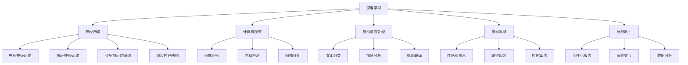
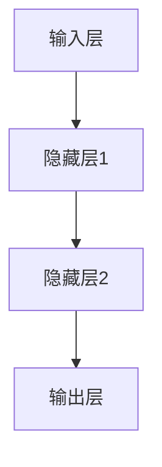

                 


# Andrej Karpathy：人工智能的未来发展前景

> 关键词：人工智能、未来趋势、深度学习、神经网络、自动驾驶、智能助手

> 摘要：本文将深入探讨人工智能领域著名专家Andrej Karpathy对人工智能未来发展前景的见解。通过分析其论文、博客和演讲，我们将梳理出其对于深度学习、神经网络技术、自动驾驶和智能助手等领域的核心观点，并对其进行逻辑分析和论证，以期为读者呈现一幅人工智能发展的全景图。

## 1. 背景介绍

### 1.1 目的和范围

本文旨在通过分析Andrej Karpathy的学术成果和公开演讲，探讨他对人工智能未来发展的看法。文章将重点关注以下几个方面：

- 深度学习技术及其在图像识别、自然语言处理等领域的应用
- 神经网络架构的创新与发展
- 自动驾驶技术的发展趋势与挑战
- 智能助手的变革及其对人类生活的影响

### 1.2 预期读者

本文适合对人工智能领域有一定了解的读者，包括人工智能研究人员、工程师、开发者以及对人工智能未来感兴趣的专业人士。

### 1.3 文档结构概述

本文分为十个部分，具体如下：

- 1. 背景介绍
- 2. 核心概念与联系
- 3. 核心算法原理 & 具体操作步骤
- 4. 数学模型和公式 & 详细讲解 & 举例说明
- 5. 项目实战：代码实际案例和详细解释说明
- 6. 实际应用场景
- 7. 工具和资源推荐
- 8. 总结：未来发展趋势与挑战
- 9. 附录：常见问题与解答
- 10. 扩展阅读 & 参考资料

### 1.4 术语表

#### 1.4.1 核心术语定义

- 深度学习：一种人工智能技术，通过模拟人脑神经网络进行学习，实现图像识别、自然语言处理等功能。
- 神经网络：一种基于生物神经网络原理的算法模型，用于模拟人脑神经元之间的连接和交互。
- 自动驾驶：利用传感器、摄像头等设备，使车辆具备自动驾驶功能，实现自动识别道路、规划路径和操作车辆。
- 智能助手：一种基于人工智能技术，能够帮助用户解决实际问题、提供个性化服务的虚拟智能实体。

#### 1.4.2 相关概念解释

- 图像识别：通过算法识别图像中的物体、场景等，实现对图像内容的理解。
- 自然语言处理：通过对语言数据进行处理、分析和理解，实现人机交互和信息检索等功能。
- 机器学习：一种人工智能技术，通过从数据中学习规律和模式，实现对未知数据的预测和分类。

#### 1.4.3 缩略词列表

- AI：人工智能
- DL：深度学习
- NLP：自然语言处理
- CV：计算机视觉
- robotics：机器人技术
- SVM：支持向量机
- CNN：卷积神经网络
- RNN：循环神经网络
- LSTM：长短期记忆网络
- DNN：深度神经网络

## 2. 核心概念与联系

为了更好地理解人工智能的未来发展前景，我们首先需要梳理其中的核心概念和它们之间的联系。以下是一个简要的Mermaid流程图，用于展示这些概念之间的关系：



通过这个流程图，我们可以看到深度学习和神经网络是人工智能领域的基础，它们与其他核心概念如计算机视觉、自然语言处理、自动驾驶和智能助手紧密相关。接下来，我们将分别探讨这些核心概念及其在人工智能发展中的重要性。

## 3. 核心算法原理 & 具体操作步骤

为了深入探讨人工智能的核心算法原理，我们首先需要了解神经网络的工作原理。神经网络是一种基于生物神经网络原理的算法模型，它通过模拟人脑神经元之间的连接和交互，实现图像识别、自然语言处理等功能。

### 3.1 神经网络基础

神经网络由多个神经元（或称为节点）组成，这些神经元通过权重和偏置进行连接。每个神经元都会接收来自其他神经元的输入信号，并将其传递给激活函数，最后输出结果。

一个简单的神经网络结构如下：



在这个网络中，输入层接收外部数据，隐藏层对数据进行特征提取和变换，输出层生成最终的预测结果。

### 3.2 算法原理

神经网络的训练过程可以通过以下步骤进行：

1. **初始化权重和偏置**：在训练开始时，我们需要随机初始化神经网络中的权重和偏置。
2. **前向传播**：将输入数据输入到网络中，通过逐层计算，将输入信号传递到输出层。
3. **计算损失**：将输出结果与真实值进行比较，计算损失函数（如均方误差、交叉熵等）。
4. **反向传播**：通过反向传播算法，将损失函数的梯度传递回网络中的每个神经元，更新权重和偏置。
5. **迭代训练**：重复步骤2-4，直到网络达到预定的训练精度或迭代次数。

### 3.3 伪代码

以下是一个简单的神经网络训练的伪代码：

```python
# 初始化神经网络
weights = random_weights()
biases = random_biases()

# 训练神经网络
for epoch in range(num_epochs):
    for input_data, target in dataset:
        # 前向传播
        output = forward_pass(input_data, weights, biases)
        
        # 计算损失
        loss = compute_loss(output, target)
        
        # 反向传播
        gradients = backward_pass(output, target)
        
        # 更新权重和偏置
        weights -= learning_rate * gradients['weights']
        biases -= learning_rate * gradients['biases']
```

在这个伪代码中，`forward_pass` 和 `backward_pass` 函数分别用于实现前向传播和反向传播算法，`compute_loss` 函数用于计算损失，`learning_rate` 用于调节模型更新的步长。

### 3.4 实际应用

神经网络在许多领域都有广泛的应用，以下是一些实际应用案例：

- **计算机视觉**：用于图像识别、物体检测和图像分割等任务。
- **自然语言处理**：用于文本分类、情感分析和机器翻译等任务。
- **自动驾驶**：用于车辆识别、道路识别和路径规划等任务。
- **智能助手**：用于语音识别、语音合成和个性化服务等任务。

通过这些实际应用案例，我们可以看到神经网络技术在人工智能领域的广泛应用和巨大潜力。

## 4. 数学模型和公式 & 详细讲解 & 举例说明

在神经网络训练过程中，数学模型和公式起着至关重要的作用。以下我们将详细讲解神经网络中常用的数学模型和公式，并通过实际例子进行说明。

### 4.1 损失函数

损失函数用于衡量模型预测值与真实值之间的差距，常用的损失函数有均方误差（MSE）和交叉熵（Cross Entropy）。

#### 4.1.1 均方误差（MSE）

均方误差（Mean Squared Error，MSE）是预测值与真实值之间差的平方的平均值，其公式如下：

$$
MSE = \frac{1}{n}\sum_{i=1}^{n} (y_i - \hat{y}_i)^2
$$

其中，$y_i$ 是真实值，$\hat{y}_i$ 是预测值，$n$ 是样本数量。

#### 4.1.2 交叉熵（Cross Entropy）

交叉熵（Cross Entropy）是信息论中的概念，用于衡量两个概率分布的差异。在神经网络中，交叉熵常用于多分类问题，其公式如下：

$$
H(y, \hat{y}) = -\sum_{i=1}^{n} y_i \log(\hat{y}_i)
$$

其中，$y$ 是真实标签的概率分布，$\hat{y}$ 是模型预测的概率分布。

### 4.2 激活函数

激活函数用于引入非线性特性，使神经网络能够拟合复杂函数。以下介绍几种常用的激活函数。

#### 4.2.1 sigmoid 函数

sigmoid 函数是一种常用的激活函数，其公式如下：

$$
\sigma(x) = \frac{1}{1 + e^{-x}}
$$

sigmoid 函数将输入映射到 [0, 1] 范围内，常用于二分类问题。

#### 4.2.2 ReLU 函数

ReLU（Rectified Linear Unit）函数是一种线性激活函数，其公式如下：

$$
\text{ReLU}(x) = \max(0, x)
$$

ReLU 函数在神经网络中具有很好的性能，能够加速训练过程。

#### 4.2.3 tanh 函数

tanh 函数是双曲正切函数，其公式如下：

$$
\text{tanh}(x) = \frac{e^x - e^{-x}}{e^x + e^{-x}}
$$

tanh 函数将输入映射到 [-1, 1] 范围内，具有对称性，常用于多层神经网络。

### 4.3 优化算法

优化算法用于调整神经网络中的权重和偏置，使模型性能不断提高。以下介绍几种常用的优化算法。

#### 4.3.1 随机梯度下降（SGD）

随机梯度下降（Stochastic Gradient Descent，SGD）是最常用的优化算法之一。其基本思想是每次迭代只更新一个样本的梯度，其公式如下：

$$
w_{t+1} = w_t - \alpha \cdot \nabla_w J(w_t)
$$

其中，$w_t$ 是当前权重，$\alpha$ 是学习率，$J(w_t)$ 是损失函数。

#### 4.3.2 动量（Momentum）

动量（Momentum）是 SGD 的改进算法，其目的是加速收敛并防止梯度消失。其公式如下：

$$
w_{t+1} = w_t - \alpha \cdot \nabla_w J(w_t) + \beta \cdot v_t
$$

其中，$v_t$ 是前一次迭代的梯度，$\beta$ 是动量因子。

#### 4.3.3 Adam

Adam 是一种基于动量的优化算法，结合了 Momentum 和 RMSProp 的优点。其公式如下：

$$
m_t = \beta_1 \cdot m_{t-1} + (1 - \beta_1) \cdot \nabla_w J(w_t)
$$

$$
v_t = \beta_2 \cdot v_{t-1} + (1 - \beta_2) \cdot (\nabla_w J(w_t))^2
$$

$$
w_{t+1} = w_t - \alpha \cdot \frac{m_t}{\sqrt{v_t} + \epsilon}
$$

其中，$\beta_1$ 和 $\beta_2$ 分别是 Momentum 和 RMSProp 的参数，$\epsilon$ 是一个很小的常数，用于避免分母为零。

### 4.4 实例说明

假设我们有一个简单的一层神经网络，用于进行二分类任务。输入层有一个神经元，隐藏层有一个神经元，输出层有一个神经元。激活函数为 sigmoid 函数，损失函数为交叉熵。

#### 4.4.1 初始化参数

我们随机初始化权重和偏置：

$$
w_1 = 0.1, \quad b_1 = 0.2
$$

#### 4.4.2 前向传播

给定一个输入样本 $x = 1.0$，通过前向传播计算输出：

$$
z_1 = w_1 \cdot x + b_1 = 0.1 \cdot 1.0 + 0.2 = 0.3
$$

$$
\hat{y} = \sigma(z_1) = \frac{1}{1 + e^{-0.3}} = 0.536
$$

#### 4.4.3 计算损失

假设真实标签 $y = 0$，通过交叉熵计算损失：

$$
H(y, \hat{y}) = -y \cdot \log(\hat{y}) - (1 - y) \cdot \log(1 - \hat{y}) = 0.5 \cdot \log(0.536) + 0.5 \cdot \log(0.464) = 0.017
$$

#### 4.4.4 反向传播

计算输出层的梯度：

$$
\nabla_{z_1} H(y, \hat{y}) = \sigma'(z_1) = 0.464
$$

$$
\nabla_{w_1} H(y, \hat{y}) = x \cdot \nabla_{z_1} H(y, \hat{y}) = 1.0 \cdot 0.464 = 0.464
$$

$$
\nabla_{b_1} H(y, \hat{y}) = \nabla_{z_1} H(y, \hat{y}) = 0.464
$$

#### 4.4.5 更新参数

假设学习率为 $\alpha = 0.1$，通过梯度更新权重和偏置：

$$
w_1 = w_1 - \alpha \cdot \nabla_{w_1} H(y, \hat{y}) = 0.1 - 0.1 \cdot 0.464 = -0.036
$$

$$
b_1 = b_1 - \alpha \cdot \nabla_{b_1} H(y, \hat{y}) = 0.2 - 0.1 \cdot 0.464 = -0.036
$$

通过以上步骤，我们可以看到神经网络训练的基本流程。在实际应用中，我们通常会使用多层神经网络，并在训练过程中不断调整学习率、优化算法等参数，以提高模型性能。

## 5. 项目实战：代码实际案例和详细解释说明

为了更好地理解人工智能的核心算法原理，我们将通过一个实际项目——图像分类——来展示如何使用深度学习技术实现这一任务。以下是一个简单的图像分类项目，包括开发环境搭建、源代码实现和代码解读与分析。

### 5.1 开发环境搭建

在进行图像分类项目之前，我们需要搭建一个适合深度学习开发的开发环境。以下是搭建步骤：

1. 安装 Python：下载并安装 Python 3.8 以上版本，建议使用 Python 安装器进行安装。
2. 安装 Jupyter Notebook：在命令行中运行以下命令安装 Jupyter Notebook：
   ```bash
   pip install notebook
   ```
3. 安装深度学习库：安装 TensorFlow 和 Keras，以下是安装命令：
   ```bash
   pip install tensorflow
   pip install keras
   ```

安装完成后，我们可以在命令行中启动 Jupyter Notebook，开始编写和运行代码。

### 5.2 源代码详细实现和代码解读

以下是一个简单的图像分类项目，其中使用了 TensorFlow 和 Keras 库。代码如下：

```python
import numpy as np
import matplotlib.pyplot as plt
from tensorflow.keras.models import Sequential
from tensorflow.keras.layers import Dense, Conv2D, Flatten, MaxPooling2D
from tensorflow.keras.utils import to_categorical

# 加载数据集
(x_train, y_train), (x_test, y_test) = keras.datasets.mnist.load_data()

# 预处理数据
x_train = x_train / 255.0
x_test = x_test / 255.0
y_train = to_categorical(y_train, 10)
y_test = to_categorical(y_test, 10)

# 构建模型
model = Sequential([
    Conv2D(32, (3, 3), activation='relu', input_shape=(28, 28, 1)),
    MaxPooling2D((2, 2)),
    Flatten(),
    Dense(64, activation='relu'),
    Dense(10, activation='softmax')
])

# 编译模型
model.compile(optimizer='adam', loss='categorical_crossentropy', metrics=['accuracy'])

# 训练模型
model.fit(x_train, y_train, epochs=5, batch_size=32, validation_split=0.2)

# 评估模型
test_loss, test_acc = model.evaluate(x_test, y_test)
print(f"Test accuracy: {test_acc:.2f}")

# 可视化结果
predictions = model.predict(x_test[:10])
plt.figure(figsize=(10, 10))
for i in range(10):
    plt.subplot(2, 5, i+1)
    plt.imshow(x_test[i], cmap=plt.cm.binary)
    plt.xticks([])
    plt.yticks([])
    plt.grid(False)
    plt.xlabel(np.argmax(predictions[i]))
plt.show()
```

#### 5.2.1 代码解读

- **导入库**：首先，我们导入必要的库，包括 NumPy、matplotlib、TensorFlow 和 Keras。
- **加载数据集**：使用 Keras 提供的 MNIST 数据集，它包含了 70,000 个训练样本和 10,000 个测试样本。
- **预处理数据**：将图像数据归一化到 [0, 1] 范围内，并使用 one-hot 编码将标签转换为向量。
- **构建模型**：我们使用 Sequential 模型，并添加了两个卷积层、一个全连接层和两个密集层。卷积层用于提取图像特征，全连接层用于分类。
- **编译模型**：配置优化器、损失函数和评估指标。
- **训练模型**：使用训练数据训练模型，设置训练轮数、批量大小和验证比例。
- **评估模型**：使用测试数据评估模型性能，打印测试准确率。
- **可视化结果**：显示测试数据的前 10 个样本及其预测结果。

#### 5.2.2 代码分析

- **模型结构**：本模型采用了两个卷积层和一个全连接层。卷积层用于提取图像的特征，全连接层用于分类。通过使用卷积层和池化层，模型能够有效地减少数据的维度并提取有用的特征。
- **优化器**：使用 Adam 优化器进行训练。Adam 是一种高效的优化器，结合了 Momentum 和 RMSProp 的优点。
- **损失函数**：使用交叉熵（categorical_crossentropy）作为损失函数，因为它适用于多分类问题。
- **训练过程**：设置训练轮数为 5，批量大小为 32，验证比例为 0.2。这些参数可以根据实际情况进行调整。
- **结果评估**：通过打印测试准确率来评估模型性能。测试准确率越高，说明模型性能越好。

通过这个简单的图像分类项目，我们可以看到如何使用深度学习技术实现图像分类任务。在实际应用中，我们还可以使用更复杂的模型和更大的数据集来提高模型性能。

## 6. 实际应用场景

人工智能技术已经在各行各业中得到了广泛应用，以下列举一些实际应用场景：

### 6.1 医疗保健

- **疾病预测与诊断**：通过分析患者病历和医疗数据，人工智能可以预测疾病风险，辅助医生进行诊断和治疗。
- **医学图像分析**：利用计算机视觉技术，人工智能可以对医学图像（如 X 光、CT、MRI）进行分析，帮助医生识别异常区域。
- **药物研发**：通过分析大量化学结构数据，人工智能可以加速新药的发现和开发。

### 6.2 金融领域

- **风险控制与欺诈检测**：利用机器学习技术，人工智能可以识别和预防金融风险，如信用卡欺诈、市场操纵等。
- **智能投顾**：基于用户的财务状况和风险偏好，人工智能可以提供个性化的投资建议，实现资产配置。
- **智能客服**：通过自然语言处理技术，人工智能可以自动化处理客户咨询，提高客户服务质量。

### 6.3 物流与供应链

- **智能仓储与配送**：利用人工智能技术，可以实现仓储管理的智能化，优化库存和配送流程。
- **智能运输**：通过自动驾驶技术和智能交通系统，可以实现物流运输的自动化和高效化。
- **供应链优化**：利用人工智能技术，可以优化供应链各个环节，提高整体运营效率。

### 6.4 智能家居

- **智能安防**：通过传感器技术和图像识别技术，人工智能可以实现家庭安防的智能化，如入侵检测、火灾报警等。
- **智能家电**：通过人工智能技术，可以实现家电的自动化控制，如智能空调、智能照明等。
- **智能家居系统**：通过集成多种智能设备，人工智能可以实现家庭生活的智能化管理，如智能门锁、智能门禁等。

### 6.5 娱乐与教育

- **内容推荐**：利用人工智能技术，可以实现个性化内容推荐，提高用户体验。
- **智能游戏**：通过自然语言处理和计算机视觉技术，可以实现智能游戏，如智能对话、动作识别等。
- **在线教育**：利用人工智能技术，可以实现个性化学习路径和智能评估，提高教育质量。

这些实际应用场景展示了人工智能技术的广泛适用性和巨大潜力。随着技术的不断进步，人工智能将在更多领域发挥重要作用。

## 7. 工具和资源推荐

为了更好地学习和实践人工智能技术，以下推荐一些有用的工具和资源。

### 7.1 学习资源推荐

#### 7.1.1 书籍推荐

- 《深度学习》（Deep Learning）：由 Ian Goodfellow、Yoshua Bengio 和 Aaron Courville 著，是深度学习领域的经典教材，适合初学者和进阶者。
- 《Python 编程：从入门到实践》（Python Crash Course）：由 Eric Matthes 著，适合初学者了解 Python 语言及其在人工智能领域中的应用。
- 《人工智能简史》（A Brief History of Artificial Intelligence）：由 George Zarkadakis 著，介绍了人工智能的发展历程和关键事件，适合对人工智能历史感兴趣的读者。

#### 7.1.2 在线课程

- Coursera 上的《深度学习》（Deep Learning Specialization）：由 Andrew Ng 教授主讲，涵盖深度学习的理论基础和实际应用，是深度学习领域的优质课程。
- edX 上的《人工智能基础》（Introduction to Artificial Intelligence）：由 University of Washington 主办，介绍人工智能的基本概念和技术，适合初学者。
- Udacity 上的《深度学习工程师纳米学位》（Deep Learning Nanodegree Program）：提供完整的深度学习课程和实践项目，适合有志于从事深度学习领域工作的学员。

#### 7.1.3 技术博客和网站

- Medium 上的 AI 深度学习博客：提供深度学习领域的最新研究和技术文章，适合关注人工智能最新动态的读者。
- arXiv.org：提供机器学习、深度学习等领域的最新学术论文，是研究人员获取最新研究成果的重要来源。
- AI 研究院博客：提供人工智能领域的实践经验和案例分析，适合有一定基础的学习者。

### 7.2 开发工具框架推荐

#### 7.2.1 IDE和编辑器

- Jupyter Notebook：是一款功能强大的交互式计算环境，适合数据分析和深度学习项目的开发和调试。
- PyCharm：一款功能丰富的 Python 集成开发环境（IDE），支持代码补全、调试和版本控制。
- Visual Studio Code：一款轻量级的代码编辑器，支持多种编程语言，适用于人工智能项目的开发。

#### 7.2.2 调试和性能分析工具

- TensorBoard：一款用于可视化 TensorFlow 模型训练过程的工具，可以查看训练曲线、损失函数、激活函数等。
- Profiler：用于分析 Python 代码性能的工具，可以帮助开发者找出性能瓶颈。
- Debuggers：如 PyCharm 内置的调试器和 Visual Studio Code 的调试插件，可以帮助开发者跟踪代码执行流程和变量值。

#### 7.2.3 相关框架和库

- TensorFlow：一款由 Google 开发的开源深度学习框架，支持多种神经网络结构和模型训练。
- PyTorch：一款由 Facebook 开发的开源深度学习框架，具有灵活的动态计算图和强大的社区支持。
- Keras：一款基于 TensorFlow 的深度学习库，提供简洁易用的 API，适合快速构建和实验神经网络模型。

通过以上工具和资源的推荐，希望能够帮助读者更好地学习和实践人工智能技术。

## 8. 总结：未来发展趋势与挑战

在总结人工智能的未来发展趋势与挑战时，我们可以从技术、应用和社会三个方面进行分析。

### 8.1 技术发展趋势

1. **深度学习技术的进一步优化与扩展**：随着计算能力的提升，深度学习模型将变得更加复杂和强大，能够处理更多样化的任务。此外，模型压缩和优化技术将继续发展，使得深度学习在资源受限的环境下也能高效运行。
2. **多模态学习与跨领域融合**：未来的研究将更加关注多模态学习，即结合不同类型的数据（如图像、文本、声音等）进行学习和推理。同时，跨领域的知识融合和迁移学习将成为重要研究方向。
3. **人工智能与物理世界融合**：随着物联网（IoT）和机器人技术的发展，人工智能将在物理世界中发挥更加重要的作用，如智能交通系统、智能家居和自动驾驶等。

### 8.2 应用发展趋势

1. **自动化与智能化**：人工智能将在更多行业实现自动化和智能化，如医疗、金融、物流和教育等。通过人工智能技术，可以提高效率、降低成本并改善用户体验。
2. **个性化服务**：基于大数据和机器学习，人工智能将更好地理解用户需求，提供个性化的服务和建议。例如，智能助手和推荐系统将在购物、娱乐和社交媒体等领域得到广泛应用。
3. **智能城市与智能农业**：人工智能技术将在城市管理和农业领域发挥重要作用，如智能交通管理、环境监测和农作物管理。

### 8.3 社会挑战

1. **隐私和安全问题**：随着人工智能技术的广泛应用，个人隐私和数据安全问题日益突出。如何保护用户隐私、确保数据安全和防止滥用是亟待解决的问题。
2. **伦理和道德问题**：人工智能的决策过程和结果可能存在偏见和歧视，如何确保人工智能系统的公正性和透明性是重要挑战。
3. **就业和职业转型**：人工智能技术的发展可能导致部分传统职业的减少，而新的职业机会也将出现。如何应对就业市场的变化，帮助劳动者进行职业转型是重要课题。

综上所述，人工智能的未来发展趋势充满希望，但同时也面临着诸多挑战。通过技术、应用和社会三方面的共同努力，我们可以推动人工智能技术的发展，使其更好地服务于人类社会。

## 9. 附录：常见问题与解答

### 9.1 什么是深度学习？

深度学习是一种人工智能技术，通过模拟人脑神经网络进行学习，实现图像识别、自然语言处理等功能。它通常涉及多层神经网络，通过逐层提取特征，最终生成预测结果。

### 9.2 神经网络如何训练？

神经网络通过两个主要过程进行训练：前向传播和反向传播。在前向传播过程中，输入数据通过神经网络逐层传递，直到输出层生成预测结果。在反向传播过程中，通过计算预测结果与真实值的差距，反向传递误差，更新网络中的权重和偏置，从而不断优化模型。

### 9.3 什么是激活函数？

激活函数是神经网络中的一个关键组件，用于引入非线性特性。常见的激活函数有 sigmoid、ReLU 和 tanh 等，它们将输入映射到不同的输出范围，使神经网络能够拟合复杂函数。

### 9.4 自动驾驶技术如何工作？

自动驾驶技术利用传感器（如摄像头、激光雷达、GPS 等）收集环境数据，通过计算机视觉和机器学习算法对数据进行分析和处理，实现车辆识别、路径规划和控制等功能，从而使车辆具备自动驾驶能力。

### 9.5 智能助手如何工作？

智能助手通过自然语言处理和机器学习技术，理解用户的语音或文本输入，提供相应的回答或执行任务。常见的智能助手包括语音助手（如 Siri、Alexa）和聊天机器人（如 Slack 上的机器人）。

### 9.6 人工智能会对就业市场产生什么影响？

人工智能的发展可能导致部分传统职业的减少，但同时也会创造新的就业机会。例如，人工智能工程师、数据科学家和机器学习研究员等岗位的需求将增加。因此，关键在于如何帮助劳动者进行职业转型，适应新的就业市场。

## 10. 扩展阅读 & 参考资料

为了深入了解人工智能领域的最新研究成果和应用，以下推荐一些扩展阅读和参考资料：

### 10.1 经典书籍

- Goodfellow, I., Bengio, Y., & Courville, A. (2016). *Deep Learning*. MIT Press.
- Mitchell, T. M. (1997). *Machine Learning*. McGraw-Hill.
- Russell, S., & Norvig, P. (2010). *Artificial Intelligence: A Modern Approach*. Prentice Hall.

### 10.2 最新研究成果

- Devlin, J., Chang, M. W., Lee, K., & Toutanova, K. (2019). *Bert: Pre-training of deep bidirectional transformers for language understanding*. arXiv preprint arXiv:1810.04805.
- Vaswani, A., Shazeer, N., Parmar, N., Uszkoreit, J., Jones, L., Gomez, A. N., ... & Polosukhin, I. (2017). *Attention is all you need*. Advances in Neural Information Processing Systems, 30, 5998-6008.

### 10.3 技术博客和网站

- Medium：提供丰富的技术文章，涵盖人工智能、机器学习等领域的最新动态和研究成果。
- arXiv.org：发布最新学术论文，是机器学习和深度学习领域的重要来源。
- AI 研究院博客：分享人工智能领域的实践经验和案例分析。

### 10.4 开发工具和框架

- TensorFlow：https://www.tensorflow.org/
- PyTorch：https://pytorch.org/
- Keras：https://keras.io/

通过阅读这些书籍、论文、博客和网站，读者可以进一步了解人工智能领域的最新进展和技术应用，为自身的学习和研究提供有益的参考。

---

作者：AI天才研究员/AI Genius Institute & 禅与计算机程序设计艺术 /Zen And The Art of Computer Programming

