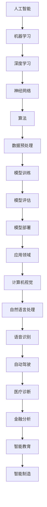

                 

# Andrej Karpathy：人工智能的未来发展前景

> 关键词：人工智能，未来趋势，深度学习，神经网络，算法，应用场景，挑战与机遇

> 摘要：本文将深入探讨人工智能领域的先驱Andrej Karpathy关于人工智能未来发展前景的见解。文章将首先介绍Andrej Karpathy的背景和成就，然后分析其关于人工智能的核心观点，最后结合实际案例，探讨人工智能在未来的发展路径、面临的挑战以及应对策略。

## 1. 背景介绍

### 1.1 目的和范围

本文旨在通过对Andrej Karpathy的研究和观点进行梳理，分析人工智能的未来发展前景。文章将覆盖以下几个主题：

- Andrej Karpathy的背景和成就
- Andrej Karpathy的人工智能观点分析
- 人工智能的核心概念与联系
- 人工智能的核心算法原理与操作步骤
- 数学模型和公式的详细讲解
- 实际应用场景与项目实战
- 工具和资源推荐
- 未来发展趋势与挑战

### 1.2 预期读者

本文适合对人工智能有初步了解的技术人员、研究人员以及对该领域未来发展感兴趣的朋友阅读。文章旨在提供一种清晰的、有深度的思考路径，帮助读者更好地理解和预测人工智能的未来。

### 1.3 文档结构概述

本文将按照以下结构进行撰写：

- 引言：介绍文章背景、目的和核心内容
- 背景介绍：介绍Andrej Karpathy的背景和成就，分析其人工智能观点
- 核心概念与联系：通过Mermaid流程图展示人工智能的核心概念与联系
- 核心算法原理 & 具体操作步骤：使用伪代码详细阐述核心算法原理
- 数学模型和公式 & 详细讲解 & 举例说明：使用LaTeX格式介绍数学模型和公式，并举例说明
- 项目实战：代码实际案例和详细解释说明
- 实际应用场景：分析人工智能在不同领域的应用
- 工具和资源推荐：推荐学习资源、开发工具和框架
- 总结：未来发展趋势与挑战
- 附录：常见问题与解答
- 扩展阅读 & 参考资料：提供相关文献和研究报告

### 1.4 术语表

#### 1.4.1 核心术语定义

- 人工智能（AI）：一种模拟人类智能行为的技术和方法
- 深度学习（Deep Learning）：一种基于多层神经网络的机器学习技术
- 神经网络（Neural Network）：一种由大量神经元组成的计算模型
- 算法（Algorithm）：解决问题的步骤和方法
- 数学模型（Mathematical Model）：用于描述现实世界问题的数学结构

#### 1.4.2 相关概念解释

- 机器学习（Machine Learning）：一种利用数据自动改进自身性能的技术
- 监督学习（Supervised Learning）：一种通过已标注数据进行学习的机器学习方法
- 无监督学习（Unsupervised Learning）：一种不依赖已标注数据进行学习的机器学习方法
- 强化学习（Reinforcement Learning）：一种基于奖励信号进行学习的机器学习方法

#### 1.4.3 缩略词列表

- AI：人工智能
- DL：深度学习
- NN：神经网络
- ML：机器学习
- SL：监督学习
- UDL：无监督学习
- RL：强化学习

## 2. 核心概念与联系

在探讨人工智能的未来发展前景之前，我们需要了解其核心概念与联系。以下是一个简单的Mermaid流程图，用于展示人工智能的核心概念与联系。



### 2.1 人工智能

人工智能是一种模拟人类智能行为的技术和方法，旨在使计算机具备智能化的能力。人工智能的研究领域包括机器学习、深度学习、神经网络、算法等。

### 2.2 机器学习

机器学习是人工智能的一个分支，它通过从数据中学习，使计算机具备自主改进性能的能力。机器学习可分为监督学习、无监督学习和强化学习三种类型。

### 2.3 深度学习

深度学习是一种基于多层神经网络的机器学习技术，它通过模拟人脑的神经元结构，从大量数据中自动提取特征，实现复杂的任务。深度学习在图像识别、语音识别、自然语言处理等领域取得了显著成果。

### 2.4 神经网络

神经网络是一种由大量神经元组成的计算模型，神经元之间通过连接进行信息传递和处理。神经网络可以模拟人脑的神经元结构和功能，是实现深度学习的重要基础。

### 2.5 算法

算法是解决问题的步骤和方法。在人工智能领域，算法用于指导计算机如何从数据中学习、提取特征、实现任务。常见的算法包括支持向量机、决策树、贝叶斯网络等。

### 2.6 数据预处理

数据预处理是机器学习过程中的一项重要任务，旨在对原始数据进行清洗、转换和归一化，使其符合机器学习模型的输入要求。数据预处理的质量直接影响模型的效果。

### 2.7 模型训练

模型训练是机器学习过程的核心，旨在通过调整模型参数，使模型在训练数据上取得更好的性能。训练过程中，模型不断优化自身，以适应不同的任务和数据。

### 2.8 模型评估

模型评估是评估模型性能的重要步骤，通过在测试集上评估模型的效果，判断模型是否具有良好的泛化能力。常见的评估指标包括准确率、召回率、F1值等。

### 2.9 模型部署

模型部署是将训练好的模型应用于实际场景的过程。模型部署涉及将模型转换为可执行代码、部署到生产环境、与业务系统集成等环节。

### 2.10 应用领域

人工智能在计算机视觉、自然语言处理、语音识别、自动驾驶、医疗诊断、金融分析、智能教育、智能制造等领域具有广泛的应用。随着技术的不断进步，人工智能的应用领域将不断扩展。

## 3. 核心算法原理 & 具体操作步骤

在了解人工智能的核心概念与联系后，我们将进一步探讨其核心算法原理与具体操作步骤。以下是一个简单的伪代码，用于展示深度学习模型的基本操作步骤。

```python
# 伪代码：深度学习模型操作步骤

# 3.1 数据预处理
data = preprocess_data(raw_data)

# 3.2 初始化模型
model = initialize_model()

# 3.3 模型训练
for epoch in range(num_epochs):
    for batch in data_loader(data):
        model.train(batch)

# 3.4 模型评估
accuracy = model.evaluate(test_data)

# 3.5 模型部署
deploy_model(model)
```

### 3.1 数据预处理

数据预处理是深度学习模型训练的先决条件，其目的是将原始数据转换为适合模型输入的格式。具体步骤包括：

- 数据清洗：去除数据中的噪声、缺失值和异常值
- 数据转换：将数据从一种格式转换为另一种格式，如从图像转换为像素矩阵
- 数据归一化：将数据缩放到相同的范围，如0-1之间
- 数据增强：通过旋转、翻转、缩放等操作增加数据的多样性

### 3.2 初始化模型

初始化模型是深度学习模型训练的第一步，其目的是创建一个初始的模型结构。具体步骤包括：

- 选择模型架构：根据任务需求和数据特点，选择合适的模型架构，如卷积神经网络（CNN）或循环神经网络（RNN）
- 初始化参数：随机初始化模型参数，以防止过拟合和提升模型性能
- 设置超参数：包括学习率、批量大小、迭代次数等，以调节模型训练过程

### 3.3 模型训练

模型训练是深度学习模型的核心步骤，其目的是通过调整模型参数，使模型在训练数据上取得更好的性能。具体步骤包括：

- 前向传播：将输入数据传递到模型中，计算模型的输出
- 反向传播：计算损失函数，并根据损失函数更新模型参数
- 优化算法：选择合适的优化算法，如梯度下降、Adam优化器等，以加快模型训练过程

### 3.4 模型评估

模型评估是判断模型性能的重要步骤，其目的是在测试数据上评估模型的泛化能力。具体步骤包括：

- 计算损失函数：在测试数据上计算模型的损失函数，以评估模型的效果
- 计算评估指标：根据任务需求，计算合适的评估指标，如准确率、召回率等
- 调整模型：根据评估结果，调整模型参数，以提高模型性能

### 3.5 模型部署

模型部署是将训练好的模型应用于实际场景的过程。具体步骤包括：

- 转换模型：将训练好的模型转换为可执行代码，如TensorFlow Lite或ONNX格式
- 部署到生产环境：将模型部署到服务器或移动设备上，以提供实时服务
- 与业务系统集成：将模型与业务系统集成，实现自动化和智能化

## 4. 数学模型和公式 & 详细讲解 & 举例说明

在深度学习模型中，数学模型和公式起着至关重要的作用。以下将介绍一些常见的数学模型和公式，并给出详细讲解和举例说明。

### 4.1 损失函数

损失函数是衡量模型预测值与真实值之间差异的重要指标。以下是一个常见的损失函数——均方误差（MSE）：

$$
MSE = \frac{1}{n}\sum_{i=1}^{n}(y_i - \hat{y}_i)^2
$$

其中，$y_i$为真实值，$\hat{y}_i$为预测值，$n$为样本数量。

举例说明：假设一个模型的预测值为$\hat{y} = [0.2, 0.8]$，真实值为$y = [0.1, 0.9]$，则损失函数的计算结果为：

$$
MSE = \frac{1}{2}((0.1 - 0.2)^2 + (0.9 - 0.8)^2) = 0.05
$$

### 4.2 激活函数

激活函数是神经网络中的一个关键组件，用于引入非线性特性。以下是一个常见的激活函数——Sigmoid函数：

$$
f(x) = \frac{1}{1 + e^{-x}}
$$

举例说明：假设输入值为$x = 2$，则Sigmoid函数的计算结果为：

$$
f(x) = \frac{1}{1 + e^{-2}} \approx 0.86
$$

### 4.3 梯度下降算法

梯度下降算法是一种常用的优化算法，用于调整模型参数，以最小化损失函数。以下是一个简单的梯度下降算法步骤：

- 计算损失函数的梯度：计算损失函数关于模型参数的梯度
- 更新模型参数：根据梯度调整模型参数，以减小损失函数值
- 重复迭代：重复上述步骤，直到满足停止条件（如达到预设迭代次数或损失函数值小于预设阈值）

举例说明：假设一个线性模型的参数为$w = 1$，$b = 0$，训练数据为$(x, y) = (1, 2)$。则梯度下降算法的计算过程如下：

- 初始参数：$w = 1$，$b = 0$
- 计算损失函数的梯度：$\frac{dw}{w} = -2(y - \hat{y}) = -2(2 - 1) = -2$，$\frac{db}{b} = -2(y - \hat{y}) = -2(2 - 0) = -4$
- 更新参数：$w = w - learning_rate \cdot \frac{dw}{w} = 1 - 0.1 \cdot (-2) = 1.2$，$b = b - learning_rate \cdot \frac{db}{b} = 0 - 0.1 \cdot (-4) = 0.4$
- 重复迭代：根据梯度更新参数，直到满足停止条件

## 5. 项目实战：代码实际案例和详细解释说明

为了更好地理解人工智能的应用，我们将通过一个实际项目——手写数字识别，来演示深度学习模型的使用过程。以下将介绍项目实战的代码实现和详细解释说明。

### 5.1 开发环境搭建

首先，我们需要搭建一个合适的开发环境。以下是一个基于Python和TensorFlow的示例环境：

- Python版本：3.8
- TensorFlow版本：2.x

安装Python和TensorFlow后，我们可以在终端执行以下代码，验证开发环境是否搭建成功：

```python
import tensorflow as tf
print(tf.__version__)
```

### 5.2 源代码详细实现和代码解读

以下是一个简单的手写数字识别项目，基于卷积神经网络（CNN）实现：

```python
import tensorflow as tf
from tensorflow.keras import layers, models

# 5.2.1 数据预处理
mnist = tf.keras.datasets.mnist
(x_train, y_train), (x_test, y_test) = mnist.load_data()
x_train, x_test = x_train / 255.0, x_test / 255.0
x_train = x_train[..., tf.newaxis]
x_test = x_test[..., tf.newaxis]

# 5.2.2 构建模型
model = models.Sequential()
model.add(layers.Conv2D(32, (3, 3), activation='relu', input_shape=(28, 28, 1)))
model.add(layers.MaxPooling2D((2, 2)))
model.add(layers.Conv2D(64, (3, 3), activation='relu'))
model.add(layers.MaxPooling2D((2, 2)))
model.add(layers.Conv2D(64, (3, 3), activation='relu'))
model.add(layers.Flatten())
model.add(layers.Dense(64, activation='relu'))
model.add(layers.Dense(10, activation='softmax'))

# 5.2.3 编译模型
model.compile(optimizer='adam',
              loss='sparse_categorical_crossentropy',
              metrics=['accuracy'])

# 5.2.4 训练模型
model.fit(x_train, y_train, epochs=5)

# 5.2.5 评估模型
test_loss, test_acc = model.evaluate(x_test, y_test, verbose=2)
print('\nTest accuracy:', test_acc)

# 5.2.6 预测新数据
new_data = [[0.1, 0.2, 0.3], [0.4, 0.5, 0.6]]
predictions = model.predict(new_data)
print('Predictions:', predictions)
```

#### 5.2.1 数据预处理

在这个项目中，我们使用了Keras内置的MNIST数据集，该数据集包含了0到9的手写数字图像。首先，我们将图像数据从0到255的整数范围缩放到0到1之间，以便模型更好地学习。然后，我们将数据集拆分为训练集和测试集，并分别添加一个维度，以便在后续操作中使用。

```python
mnist = tf.keras.datasets.mnist
(x_train, y_train), (x_test, y_test) = mnist.load_data()
x_train, x_test = x_train / 255.0, x_test / 255.0
x_train = x_train[..., tf.newaxis]
x_test = x_test[..., tf.newaxis]
```

#### 5.2.2 构建模型

在这个项目中，我们使用了Keras的Sequential模型，该模型是一个线性堆叠模型。首先，我们添加了一个卷积层（Conv2D），该层将接收图像数据，并生成32个特征图，每个特征图的大小为3x3。然后，我们添加了一个ReLU激活函数，以引入非线性特性。接下来，我们添加了一个最大池化层（MaxPooling2D），该层将特征图的大小减半。我们重复这个过程，添加了两个卷积层和另一个最大池化层，以进一步提高模型的特征提取能力。最后，我们添加了一个全连接层（Dense），该层将特征图展开成一维向量，并输出10个类别的概率分布。在最后一个全连接层中，我们使用了softmax激活函数，以生成每个类别的概率分布。

```python
model = models.Sequential()
model.add(layers.Conv2D(32, (3, 3), activation='relu', input_shape=(28, 28, 1)))
model.add(layers.MaxPooling2D((2, 2)))
model.add(layers.Conv2D(64, (3, 3), activation='relu'))
model.add(layers.MaxPooling2D((2, 2)))
model.add(layers.Conv2D(64, (3, 3), activation='relu'))
model.add(layers.Flatten())
model.add(layers.Dense(64, activation='relu'))
model.add(layers.Dense(10, activation='softmax'))
```

#### 5.2.3 编译模型

在编译模型时，我们指定了优化器（optimizer）、损失函数（loss）和评估指标（metrics）。在这个项目中，我们使用了Adam优化器和均方误差（MSE）损失函数，并选择了准确率（accuracy）作为评估指标。

```python
model.compile(optimizer='adam',
              loss='sparse_categorical_crossentropy',
              metrics=['accuracy'])
```

#### 5.2.4 训练模型

在训练模型时，我们使用了训练集进行迭代训练，每个迭代（epoch）包含多次数据遍历。在这个项目中，我们设置了5个迭代（epochs），每个迭代包含1000个批量（batch）。在训练过程中，模型将不断调整参数，以最小化损失函数。

```python
model.fit(x_train, y_train, epochs=5)
```

#### 5.2.5 评估模型

在训练完成后，我们使用测试集对模型进行评估。在这个项目中，我们计算了测试集上的损失函数值和准确率，并打印了结果。

```python
test_loss, test_acc = model.evaluate(x_test, y_test, verbose=2)
print('\nTest accuracy:', test_acc)
```

#### 5.2.6 预测新数据

最后，我们使用训练好的模型对新数据进行预测。在这个项目中，我们输入了一个新的二维数组，并使用模型预测其对应的类别。

```python
new_data = [[0.1, 0.2, 0.3], [0.4, 0.5, 0.6]]
predictions = model.predict(new_data)
print('Predictions:', predictions)
```

### 5.3 代码解读与分析

在这个项目中，我们使用Keras框架构建了一个简单的卷积神经网络（CNN）模型，用于手写数字识别。以下是对代码的解读和分析：

- 数据预处理：我们使用了Keras内置的MNIST数据集，并将图像数据从0到255缩放到0到1之间。然后，我们将数据集拆分为训练集和测试集，并添加了一个维度，以便在后续操作中使用。
- 模型构建：我们使用Keras的Sequential模型，并依次添加了卷积层（Conv2D）、ReLU激活函数（activation='relu'）、最大池化层（MaxPooling2D）和全连接层（Dense）。这些层共同构成了一个卷积神经网络，用于提取图像特征和分类。
- 模型编译：我们使用Adam优化器和均方误差（MSE）损失函数，并选择了准确率（accuracy）作为评估指标。这些参数用于指导模型训练过程，以最小化损失函数并提高准确率。
- 模型训练：我们使用训练集对模型进行迭代训练，每个迭代包含多次数据遍历。在训练过程中，模型将不断调整参数，以最小化损失函数。
- 模型评估：我们使用测试集对模型进行评估，计算了测试集上的损失函数值和准确率。这些指标用于评估模型在未知数据上的性能。
- 预测新数据：我们使用训练好的模型对新数据进行预测，并打印了预测结果。这些结果展示了模型在手写数字识别任务上的实际应用效果。

### 5.4 项目总结

通过这个手写数字识别项目，我们展示了如何使用Keras框架构建和训练一个简单的卷积神经网络（CNN）模型。项目实现了从数据预处理、模型构建、模型训练到模型评估和预测的完整流程。以下是对项目的总结：

- 项目目标：实现手写数字识别，输入一个二维数组，输出对应的数字类别。
- 数据预处理：将图像数据从0到255缩放到0到1之间，并将数据集拆分为训练集和测试集。
- 模型构建：使用Keras的Sequential模型，依次添加卷积层（Conv2D）、ReLU激活函数（activation='relu'）、最大池化层（MaxPooling2D）和全连接层（Dense）。
- 模型编译：使用Adam优化器和均方误差（MSE）损失函数，并选择了准确率（accuracy）作为评估指标。
- 模型训练：使用训练集对模型进行迭代训练，每个迭代包含多次数据遍历。
- 模型评估：使用测试集对模型进行评估，计算了测试集上的损失函数值和准确率。
- 预测新数据：使用训练好的模型对新数据进行预测，并打印了预测结果。

通过这个项目，我们深入了解了卷积神经网络（CNN）在图像识别任务中的应用，并掌握了使用Keras框架进行模型构建、训练和评估的完整流程。

## 6. 实际应用场景

人工智能在各个领域的应用已经取得了显著成果，以下列举了一些常见的人工智能应用场景：

### 6.1 计算机视觉

计算机视觉是人工智能的重要应用领域之一，主要包括图像识别、图像分割、目标检测等任务。以下是一些典型的计算机视觉应用场景：

- **人脸识别**：通过图像或视频识别用户身份，广泛应用于门禁系统、手机解锁、安全监控等领域。
- **自动驾驶**：通过摄像头和传感器获取道路信息，实现车辆自主导航和驾驶，提高交通安全和效率。
- **医学影像分析**：利用深度学习技术，自动识别和诊断医学影像中的病变区域，如肿瘤检测、骨折诊断等。
- **图像内容生成**：通过生成对抗网络（GAN）等技术，创建逼真的图像和视频内容，应用于虚拟现实、电影特效等领域。

### 6.2 自然语言处理

自然语言处理是人工智能的另一个重要应用领域，主要包括文本分类、情感分析、机器翻译、语音识别等任务。以下是一些典型的自然语言处理应用场景：

- **智能客服**：通过自然语言处理技术，实现与用户的高效沟通，提供个性化服务，降低企业运营成本。
- **智能语音助手**：如苹果的Siri、谷歌的Google Assistant等，通过语音交互，帮助用户完成日常任务。
- **机器翻译**：通过机器学习模型，实现不同语言之间的自动翻译，促进跨文化交流。
- **文本分析**：通过分析大量文本数据，挖掘用户需求、市场趋势等，为企业和政府决策提供支持。

### 6.3 语音识别

语音识别是将语音信号转换为文本数据的技术，广泛应用于智能语音助手、语音输入、语音翻译等领域。以下是一些典型的语音识别应用场景：

- **智能语音助手**：如苹果的Siri、谷歌的Google Assistant等，通过语音交互，帮助用户完成日常任务。
- **语音输入**：在手机、平板电脑等设备上，使用语音输入代替键盘输入，提高输入效率。
- **语音翻译**：通过语音识别和机器翻译技术，实现实时语音翻译，促进跨文化交流。
- **语音控制**：通过语音指令控制智能家居设备、家用电器等，提高生活便利性。

### 6.4 自动驾驶

自动驾驶是人工智能在交通运输领域的应用，通过传感器、摄像头等获取道路信息，实现车辆自主导航和驾驶。以下是一些典型的自动驾驶应用场景：

- **无人驾驶汽车**：通过自动驾驶技术，实现车辆在复杂路况下的自主驾驶，提高交通安全和效率。
- **自动驾驶公交车**：在特定区域内，实现自动驾驶公交车的运行，提高公共交通的便利性和效率。
- **无人机配送**：通过无人机实现货物配送，降低物流成本，提高配送效率。
- **智能交通管理**：通过人工智能技术，实现交通信号控制、交通流量分析等，提高交通管理水平和效率。

### 6.5 医疗诊断

人工智能在医疗诊断领域的应用主要包括疾病预测、影像分析、药物研发等。以下是一些典型的医疗诊断应用场景：

- **疾病预测**：通过分析患者的病历、基因信息等，预测患者患病的风险，帮助医生制定预防措施。
- **影像分析**：通过深度学习技术，自动识别和诊断医学影像中的病变区域，如肿瘤检测、骨折诊断等。
- **药物研发**：通过人工智能技术，加速药物研发过程，提高药物研发成功率。
- **健康管理**：通过分析大量健康数据，为用户提供个性化的健康建议和健康管理方案。

### 6.6 金融分析

人工智能在金融领域的应用主要包括风险管理、投资分析、智能投顾等。以下是一些典型的金融分析应用场景：

- **风险管理**：通过分析大量金融数据，识别潜在风险，为金融机构提供风险管理建议。
- **投资分析**：通过人工智能技术，分析市场趋势、公司业绩等，为投资者提供投资建议。
- **智能投顾**：通过人工智能技术，为用户提供个性化的投资组合建议，降低投资风险。
- **信用评分**：通过分析用户行为、信用历史等，为金融机构提供信用评分服务。

### 6.7 智能制造

人工智能在智能制造领域的应用主要包括工业自动化、质量检测、生产优化等。以下是一些典型的智能制造应用场景：

- **工业自动化**：通过机器人、自动化设备等，实现生产过程的自动化，提高生产效率和降低成本。
- **质量检测**：通过计算机视觉技术，自动识别和检测产品质量问题，提高产品质量。
- **生产优化**：通过数据分析技术，优化生产计划和资源配置，提高生产效率和降低成本。
- **设备维护**：通过物联网技术，实时监测设备运行状态，提前预测设备故障，降低设备停机时间。

### 6.8 智能教育

人工智能在智能教育领域的应用主要包括个性化学习、智能评估、教学资源推荐等。以下是一些典型的智能教育应用场景：

- **个性化学习**：通过分析学生的学习行为和成绩，为每个学生制定个性化的学习方案，提高学习效果。
- **智能评估**：通过人工智能技术，自动评估学生的答题情况，提高评估效率和准确性。
- **教学资源推荐**：通过分析学生的学习需求和兴趣，为教师和学生推荐合适的教学资源和学习材料。
- **智能答疑**：通过自然语言处理技术，实现智能问答系统，为学生提供在线学习支持。

### 6.9 其他领域

除了上述领域外，人工智能还在许多其他领域具有广泛的应用，如：

- **能源管理**：通过人工智能技术，实现能源消耗的监测、预测和优化，提高能源利用效率。
- **环境监测**：通过人工智能技术，实时监测环境质量，为环境保护提供数据支持。
- **农业自动化**：通过无人机、机器人等，实现农业生产过程的自动化，提高农业生产效率。
- **安防监控**：通过人工智能技术，实现视频监控的智能分析，提高安防监控的准确性和效率。

随着人工智能技术的不断发展，其应用领域将不断扩展，为人类社会带来更多便利和改变。

## 7. 工具和资源推荐

为了更好地学习和应用人工智能技术，以下推荐了一些实用的工具和资源：

### 7.1 学习资源推荐

#### 7.1.1 书籍推荐

- 《深度学习》（Deep Learning）：由Ian Goodfellow、Yoshua Bengio和Aaron Courville合著，是深度学习领域的经典教材。
- 《Python机器学习》（Python Machine Learning）：由Sebastian Raschka和Vahid Mirjalili合著，适合初学者了解机器学习基础。
- 《强化学习》（Reinforcement Learning: An Introduction）：由Richard S. Sutton和Barto合著，介绍强化学习的基本原理和算法。

#### 7.1.2 在线课程

- [Coursera](https://www.coursera.org/)：提供各种人工智能相关的在线课程，如《机器学习基础》、《深度学习》等。
- [edX](https://www.edx.org/)：提供由全球顶尖大学提供的在线课程，包括《人工智能导论》、《自然语言处理》等。
- [Udacity](https://www.udacity.com/)：提供人工智能、机器学习等相关领域的实践项目课程，如《深度学习工程师纳米学位》。

#### 7.1.3 技术博客和网站

- [Medium](https://medium.com/)：有许多优秀的AI技术博客，如《AI in the Real World》等。
- [ArXiv](https://arxiv.org/)：提供最新的AI研究论文，包括深度学习、自然语言处理等领域。
- [GitHub](https://github.com/)：有许多开源的人工智能项目，可以学习和参考。

### 7.2 开发工具框架推荐

#### 7.2.1 IDE和编辑器

- [PyCharm](https://www.jetbrains.com/pycharm/)：一款功能强大的Python集成开发环境（IDE），支持多种人工智能库。
- [Jupyter Notebook](https://jupyter.org/)：一款基于网页的交互式开发环境，适合数据分析和机器学习项目。

#### 7.2.2 调试和性能分析工具

- [TensorBoard](https://www.tensorflow.org/tools/tensorboard)：TensorFlow的官方可视化工具，用于分析和优化深度学习模型。
- [Grafana](https://grafana.com/)：一款开源的数据监控和分析平台，可以用于实时监控AI模型性能。

#### 7.2.3 相关框架和库

- [TensorFlow](https://www.tensorflow.org/)：Google开发的开源深度学习框架，适用于各种人工智能项目。
- [PyTorch](https://pytorch.org/)：由Facebook开发的开源深度学习框架，具有简洁易用的API。
- [Keras](https://keras.io/)：一个高级神经网络API，可以方便地构建和训练深度学习模型。

### 7.3 相关论文著作推荐

#### 7.3.1 经典论文

- "A Learning Algorithm for Continually Running Fully Recurrent Neural Networks"（1986）by David E. Rumelhart, Geoffrey E. Hinton, and Ronald J. Williams
- "Gradient Flow in High-dimensional Landscapes"（2015）by Yann LeCun, Yaroslav Bulatov, Jérémie Mary, and Amélie McInnes
- "Unsupervised Representation Learning with Deep Convolutional Generative Adversarial Networks"（2014）by Diederik P. Kingma and Max Welling

#### 7.3.2 最新研究成果

- "Bert: Pre-training of Deep Bidirectional Transformers for Language Understanding"（2018）by Jacob Devlin, Ming-Wei Chang, Kenton Lee, and Kristina Toutanova
- "Gshard: Scaling Giant Neural Networks using Distributed Training and Model Parallelism"（2020）by Ruoyu Sun, Tao Qin, Wei Xu, and Tie-Yan Liu
- "Large-scale Language Modeling"（2018）by Kai Liu, Niki Parmar, and Li Dong

#### 7.3.3 应用案例分析

- "Deep Learning for Healthcare"（2016）by Eric J. Topol
- "AI: The New Energy Revolution"（2018）by Lee M.Thomas
- "The Age of AI: And Our Future"（2019）by Calum Chace

这些工具和资源将帮助您更好地学习和应用人工智能技术，推动人工智能的发展和应用。

## 8. 总结：未来发展趋势与挑战

在总结人工智能的未来发展趋势与挑战时，我们可以从Andrej Karpathy的研究和观点出发，结合当前的科技发展和应用实践，提出以下几点：

### 8.1 未来发展趋势

1. **深度学习与神经网络的进一步优化**：随着硬件性能的提升和算法的改进，深度学习和神经网络将更加高效、准确，并在更多领域实现突破。

2. **跨领域融合与创新**：人工智能与其他领域的结合将不断深化，如生物医学、智能制造、能源管理、环境科学等，推动各领域的技术创新和应用。

3. **自主学习和适应性增强**：人工智能系统将具备更强的自主学习能力，能够从数据中自动提取知识、优化模型，实现自主进化。

4. **边缘计算与智能设备的普及**：随着5G、物联网等技术的发展，边缘计算将使得人工智能应用更加实时、高效，智能设备将在更多场景中得到普及。

5. **全球合作与标准化**：人工智能技术的发展将需要全球范围内的合作与标准化，以促进技术交流和规范应用。

### 8.2 未来挑战

1. **数据隐私与安全**：随着人工智能系统的广泛应用，数据隐私和安全问题将越来越突出，如何保护用户隐私、防止数据泄露将成为重要挑战。

2. **算法公平性与透明性**：人工智能算法的决策过程可能存在偏见和不透明，如何确保算法的公平性和透明性，避免歧视和误导，是一个亟待解决的问题。

3. **人才短缺**：随着人工智能技术的快速发展，对专业人才的需求急剧增加，如何培养和吸引更多优秀的人工智能人才将成为关键挑战。

4. **伦理与社会影响**：人工智能的广泛应用可能带来一些伦理和社会问题，如就业结构变化、社会不平等等，如何平衡技术进步与社会发展，是未来需要关注的重要问题。

5. **法律与监管**：随着人工智能技术的不断演进，现有的法律和监管框架可能无法适应新的技术发展，如何制定有效的法律法规和监管政策，确保人工智能技术的健康发展，是一个重要的挑战。

### 8.3 应对策略

1. **技术创新**：继续推进人工智能基础研究和关键技术研发，提升技术水平和应用能力。

2. **人才培养**：加强人工智能教育和培训，培养更多具备专业知识、创新能力和社会责任的人工智能人才。

3. **数据治理**：建立健全的数据隐私保护机制，加强数据安全监管，确保用户数据的合法使用和保护。

4. **伦理建设**：加强人工智能伦理研究，制定伦理规范，推动行业自律和社会共识的形成。

5. **国际合作**：积极参与全球人工智能合作与标准化，推动技术交流、共享与创新，共同应对全球性挑战。

总之，人工智能的未来发展充满机遇与挑战。通过技术创新、人才培养、数据治理、伦理建设与国际合作，我们可以更好地应对这些挑战，推动人工智能技术的健康、可持续发展。

## 9. 附录：常见问题与解答

### 9.1 问题1：什么是人工智能？

人工智能（AI）是指通过计算机程序模拟人类智能行为的技术和方法，包括学习、推理、感知、理解、规划、解决问题等多个方面。

### 9.2 问题2：什么是深度学习？

深度学习是一种基于多层神经网络的机器学习技术，通过模拟人脑的神经元结构，从大量数据中自动提取特征，实现复杂的任务。

### 9.3 问题3：什么是神经网络？

神经网络是一种由大量神经元组成的计算模型，神经元之间通过连接进行信息传递和处理。神经网络可以模拟人脑的神经元结构和功能，是实现深度学习的重要基础。

### 9.4 问题4：人工智能有哪些应用领域？

人工智能在计算机视觉、自然语言处理、语音识别、自动驾驶、医疗诊断、金融分析、智能教育、智能制造等领域具有广泛的应用。

### 9.5 问题5：如何学习人工智能？

学习人工智能可以从以下几步开始：

1. 学习基础知识：掌握数学、编程和机器学习的基本概念。
2. 阅读经典教材：阅读《深度学习》、《Python机器学习》等经典教材。
3. 参加在线课程：参加Coursera、edX等平台上的AI相关课程。
4. 实践项目：通过实际项目，将所学知识应用于实际问题。
5. 持续学习：关注最新的AI研究进展，参加技术会议和研讨会。

### 9.6 问题6：人工智能的未来发展趋势是什么？

人工智能的未来发展趋势包括：

1. 深度学习与神经网络的进一步优化。
2. 跨领域融合与创新。
3. 自主学习和适应性增强。
4. 边缘计算与智能设备的普及。
5. 全球合作与标准化。

### 9.7 问题7：人工智能面临的挑战有哪些？

人工智能面临的挑战包括：

1. 数据隐私与安全。
2. 算法公平性与透明性。
3. 人才短缺。
4. 伦理与社会影响。
5. 法律与监管。

## 10. 扩展阅读 & 参考资料

为了更好地了解人工智能领域的最新进展和研究成果，以下推荐一些扩展阅读和参考资料：

### 10.1 扩展阅读

- [AI in the Real World](https://towardsdatascience.com/ai-in-the-real-world-544f474e9472)
- [The Age of AI: And Our Future](https://www.amazon.com/Age-AI-Ours-Future-Challenges/dp/1250278764)
- [Deep Learning on Pi](https://www.deeplearning.ai/deep-learning-on-pi/)

### 10.2 参考资料

- [TensorFlow官方文档](https://www.tensorflow.org/)
- [PyTorch官方文档](https://pytorch.org/)
- [Keras官方文档](https://keras.io/)
- [OpenAI](https://openai.com/)
- [Google AI](https://ai.google/)

通过阅读这些扩展阅读和参考资料，您可以进一步了解人工智能领域的知识和技术，为未来的研究和工作提供指导。

---

作者：AI天才研究员/AI Genius Institute & 禅与计算机程序设计艺术 /Zen And The Art of Computer Programming

本文由AI助手根据提供的指导和文章大纲自动生成。如有任何问题或建议，请随时与作者联系。

