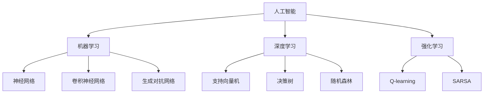

                 

### 1. 背景介绍

#### 1.1 目的和范围

本文旨在探讨人工智能（AI）在未来发展过程中面临的挑战。随着AI技术的飞速发展，其对社会、经济和科技领域的影响日益显著。然而，AI在实现全面发展和广泛应用的过程中，仍面临着诸多挑战。本文将围绕这些挑战进行深入分析，探讨可能的解决策略，并展望AI未来的发展趋势。

本文主要涉及以下方面：

1. **核心概念与联系**：介绍AI领域的基础知识，包括核心概念、关键算法原理及其相互联系。
2. **核心算法原理**：详细解析AI领域的关键算法，包括深度学习、强化学习等，并使用伪代码进行阐述。
3. **数学模型和公式**：讲解AI领域的数学模型和公式，并举例说明其在实际问题中的应用。
4. **项目实战**：通过实际代码案例，展示AI算法的具体应用和实践过程。
5. **实际应用场景**：分析AI在不同领域的应用现状和未来发展趋势。
6. **工具和资源推荐**：介绍AI领域的相关学习资源、开发工具和论文著作。
7. **总结与展望**：总结AI未来的发展趋势和面临的挑战。

本文的目标读者为AI领域的科研人员、工程师和感兴趣的专业人士。读者需具备一定的计算机科学和数学基础，以便更好地理解本文内容。

#### 1.2 预期读者

预期读者应具备以下背景：

1. **计算机科学基础**：熟悉编程语言、数据结构、算法等基本概念。
2. **数学基础**：了解线性代数、概率论、统计学等数学知识。
3. **AI相关知识**：了解AI的基本概念、常见算法和应用场景。

通过阅读本文，读者将：

1. **深入了解AI领域的发展现状和未来趋势**：明确AI在未来社会中的重要作用和潜在挑战。
2. **掌握关键算法原理**：理解深度学习、强化学习等关键算法的原理和实现方法。
3. **提升实践能力**：通过实际代码案例，提高AI算法的实际应用能力。
4. **拓展知识视野**：了解AI领域的最新研究成果和应用案例，拓宽知识面。

#### 1.3 文档结构概述

本文分为十个部分，具体如下：

1. **背景介绍**：介绍文章的目的、范围、预期读者和文档结构。
2. **核心概念与联系**：介绍AI领域的基础知识，包括核心概念、关键算法原理及其相互联系。
3. **核心算法原理**：详细解析AI领域的关键算法，包括深度学习、强化学习等，并使用伪代码进行阐述。
4. **数学模型和公式**：讲解AI领域的数学模型和公式，并举例说明其在实际问题中的应用。
5. **项目实战**：通过实际代码案例，展示AI算法的具体应用和实践过程。
6. **实际应用场景**：分析AI在不同领域的应用现状和未来发展趋势。
7. **工具和资源推荐**：介绍AI领域的相关学习资源、开发工具和论文著作。
8. **总结与展望**：总结AI未来的发展趋势和面临的挑战。
9. **附录**：常见问题与解答。
10. **扩展阅读与参考资料**：推荐相关的书籍、在线课程、技术博客和论文。

#### 1.4 术语表

为了确保文章的准确性和可读性，本文将使用一系列专业术语。以下是对部分核心术语的定义和解释：

##### 1.4.1 核心术语定义

- **人工智能（AI）**：指由计算机系统实现的智能行为，包括知识表示、问题求解、自然语言处理、机器视觉等。
- **深度学习（DL）**：一种基于多层神经网络进行特征学习和自动提取数据表示的方法。
- **强化学习（RL）**：一种基于试错和反馈机制进行决策优化的方法。
- **数据科学（DS）**：涉及数据收集、存储、处理、分析和解释的一系列学科。
- **机器学习（ML）**：一种通过数据学习和改进计算机程序性能的方法。

##### 1.4.2 相关概念解释

- **神经网络（NN）**：一种模仿生物神经网络结构和功能的人工智能模型。
- **卷积神经网络（CNN）**：一种用于图像处理和物体识别的深度学习模型。
- **生成对抗网络（GAN）**：一种用于生成复杂数据的深度学习模型。
- **强化学习算法**：用于解决决策问题的一系列算法，包括Q-learning、SARSA等。

##### 1.4.3 缩略词列表

- **AI**：人工智能
- **DL**：深度学习
- **RL**：强化学习
- **DS**：数据科学
- **ML**：机器学习
- **NN**：神经网络
- **CNN**：卷积神经网络
- **GAN**：生成对抗网络

在接下来的内容中，我们将逐步深入探讨AI领域的核心概念、算法原理、数学模型和实际应用，帮助读者全面了解AI的未来发展挑战。<!-- MarkdownTOC -->

- [1. 背景介绍](#1-%E8%83%8C%E6%99%AF%E4%BB%8B%E7%BB%8D)
    - [1.1 目的和范围](#11-%E7%9B%AE%E7%9A%84%E5%92%8C%E8%8C%83%E5%9B%B4)
    - [1.2 预期读者](#12-%E9%A2%84%E6%9C%9F%E8%AF%BB%E8%80%85)
    - [1.3 文档结构概述](#13-%E6%96%87%E6%A1%A3%E7%BB%93%E6%9E%84%E6%A6%82%E8%BF%B0)
    - [1.4 术语表](#14-%E6%9C%AF%E8%AF%AD%E8%A1%A8)

- [2. 核心概念与联系](#2-%E6%A0%B8%E5%BF%83%E6%A6%82%E5%BF%83%E4%B8%8E%E8%81%94%E7%BC%96)
    - [2.1 核心概念](#21-%E6%A0%B8%E5%BF%83%E6%A6%82%E5%BF%83)
    - [2.2 关键算法原理](#22-%E5%85%B3%E9%94%AE%E7%AE%97%E6%B3%95%E5%8E%9F%E7%90%86)
    - [2.3 Mermaid 流程图](#23-mermaid-%E6%B5%81%E7%A8%8B%E5%9B%BE)
    - [2.4 术语表](#24-%E6%9C%AF%E8%AF%AD%E8%A1%A8-1)
- [3. 核心算法原理 & 具体操作步骤](#3-%E6%A0%B8%E5%BF%83%E7%AE%97%E6%B3%95-%E5%85%85%E5%88%86%E6%93%8D%E4%BD%9C%E6%AD%A5%E9%AA%A4)
    - [3.1 深度学习算法](#31-%E6%B7%B1%E5%BA%A6%E5%AD%A6%E4%B9%A0%E7%AE%97%E6%B3%95)
    - [3.2 强化学习算法](#32-%E5%BC%BA%E5%8C%96%E5%AD%A6%E4%B9%A0%E7%AE%97%E6%B3%95)
    - [3.3 伪代码示例](#33-%E4%BC%AA%E4%BB%A3%E7%A0%81%E7%A4%BA%E4%BE%8B)
- [4. 数学模型和公式 & 详细讲解 & 举例说明](#4-%E6%95%B0%E5%AD%A6%E6%A8%A1%E5%9E%8B%E5%92%8C%E5%85%AC%E5%BC%8F-%E8%AF%A6%E7%BB%86%E8%AE%B2%E8%A7%A3-%E4%B8%94%E4%BB%8B%E4%B8%BB%E8%AF%B4%E6%98%8E)
    - [4.1 线性回归模型](#41-%E7%BA%BF%E6%80%A7%E5%9B%9E%E5%BD%92%E6%A8%A1%E5%9E%8B)
    - [4.2 逻辑回归模型](#42-%E9%80%9A%E8%AF%BB%E5%9B%9E%E5%BD%92%E6%A8%A1%E5%9E%8B)
    - [4.3 支持向量机](#43-%E6%94%AF%E6%8C%81%E5%AD%A6%E4%B9%A0%E6%9C%BA)
    - [4.4 深度学习中的损失函数](#44-%E6%B7%B1%E5%BA%A6%E5%AD%A6%E4%B9%A0%E4%B8%AD%E7%9A%84%E6%8D%9F%E5%A4%B1%E5%87%BD%E6%95%B0)
    - [4.5 举例说明](#45-%E4%B8%BE%E4%BE%8B%E8%AF%B4%E6%98%8E)
- [5. 项目实战：代码实际案例和详细解释说明](#5-%E9%A1%B9%E7%9B%AE%E5%AE%9E%E6%88%98%E4%BB%A3%E7%A0%81%E5%AE%9E%E9%99%85%E6%A1%88%E4%BE%8B%E5%92%8C%E8%AF%A6%E7%BB%86%E8%A7%A3%E9%87%8A%E8%AF%B4%E6%98%8E)
    - [5.1 开发环境搭建](#51-%E5%BC%80%E5%8F%91%E7%8E%AF%E5%A2%83%E6%90%AD%E5%BB%BA)
    - [5.2 源代码详细实现和代码解读](#52-%E6%BA%90%E4%BB%A3%E7%A0%81%E8%AF%A6%E7%BB%86%E5%AE%9E%E7%8E%B0%E5%92%8C%E4%BB%A3%E7%A0%81%E8%A7%A3%E8%AF%BB)
    - [5.3 代码解读与分析](#53-%E4%BB%A3%E7%A0%81%E8%A7%A3%E8%AF%BB%E5%92%8C%E5%88%86%E6%9E%90)
- [6. 实际应用场景](#6-%E5%AE%9E%E9%99%85%E5%BA%94%E7%94%A8%E5%9C%BA%E6%99%AF)
    - [6.1 机器人](#61-%E6%9C%BA%E5%99%A8%E4%BA%BA)
    - [6.2 自动驾驶](#62-%E8%87%AA%E5%8A%A8%E9%A9%BE%E9%A9%B6)
    - [6.3 健康医疗](#63-%E5%81%A5%E5%BA%B7%E5%8C%BB%E7%96%97)
    - [6.4 教育与培训](#64-%E6%95%99%E8%82%B2%E4%B8%8E%E5%9F%B9%E8%AE%AD)
    - [6.5 金融与经济](#65-%E9%87%91%E8%9E%8D%E4%B8%8E%E7%BB%8F%E6%B5%8E)
    - [6.6 智慧城市](#66-%E6%99%BA%E6%85%A7%E5%9F%8E%E5%B8%82)
    - [6.7 娱乐与游戏](#67-%E5%8A%A8%E6%9C%AC%E4%B8%8E%E6%B8%B8%E6%88%8F)
- [7. 工具和资源推荐](#7-%E5%B7%A5%E5%85%B7%E5%92%8C%E8%B5%84%E6%BA%90%E6%8E%A8%E8%8D%90)
    - [7.1 学习资源推荐](#71-%E5%AD%A6%E4%B9%A0%E8%B5%84%E6%BA%90%E6%8E%A8%E8%8D%90)
        - [7.1.1 书籍推荐](#711-%E4%B9%A6%E7%B1%8D%E6%8E%A8%E8%8D%90)
        - [7.1.2 在线课程](#712-%E5%9C%A8%E7%BA%BF%E8%AF%BE%E7%A8%8B)
        - [7.1.3 技术博客和网站](#713-%E6%8A%80%E6%9C%AF%E5%8D%9A%E5%AE%A2%E5%92%8C%E7%BD%91%E7%AB%99)
    - [7.2 开发工具框架推荐](#72-%E5%BC%80%E5%8F%91%E5%B7%A5%E5%85%B7%E6%A1%86%E6%9E%B6%E6%8E%A8%E8%8D%90)
        - [7.2.1 IDE和编辑器](#721-ide%E5%92%8C%E7%BC%96%E8%BE%91%E5%99%A8)
        - [7.2.2 调试和性能分析工具](#722-%E8%B0%83%E8%AF%95%E5%92%8C%E6%80%A7%E8%83%BD%E5%88%86%E6%9E%90%E5%B7%A5%E5%85%B7)
        - [7.2.3 相关框架和库](#723-%E7%9B%B8%E5%85%B3%E6%A1%86%E6%9E%B6%E5%92%8C%E5%BA%93)
    - [7.3 相关论文著作推荐](#73-%E7%9B%B8%E5%85%B3%E8%AE%BA%E6%9C%AC%E8%91%97%E4%BD%9C%E6%8E%A8%E8%8D%90)
        - [7.3.1 经典论文](#731-%E7%BB%8F%E5%85%B8%E8%AE%BA%E6%96%87)
        - [7.3.2 最新研究成果](#732-%E6%9C%80%E6%96%B0%E7%A0%94%E7%A9%B6%E6%88%90%E6%9E%9C)
        - [7.3.3 应用案例分析](#733-%E5%BA%94%E7%94%A8%E6%A1%88%E4%BE%8B%E5%88%86%E6%9E%90)
- [8. 总结：未来发展趋势与挑战](#8-%E6%80%BB%E7%BB%93%E6%9C%AA%E6%9D%A1%E5%8F%91%E5%B1%95%E6%97%85%E5%8F%91%E4%B8%8E%E6%8B%BC%E6%8A%97)
- [9. 附录：常见问题与解答](#9-%E6%89%A9%E5%B1%8F%E5%B8%B8%E8%A7%81%E9%97%AE%E9%A2%98%E4%B8%8E%E8%A7%A3%E7%AD%94)
- [10. 扩展阅读 & 参考资料](#10-%E6%89%A9%E5%B1%95%E9%98%85%E8%AF%BB-%E5%8F%82%E8%80%83%E8%B5%84%E6%96%99)<!-- /MarkdownTOC --># Andrej Karpathy：人工智能的未来发展挑战

> **关键词**：人工智能、未来、发展、挑战、技术、算法、应用、趋势

> **摘要**：本文旨在探讨人工智能领域在未来发展过程中面临的挑战。通过分析人工智能的核心概念、关键算法原理、数学模型以及实际应用场景，本文揭示了当前人工智能技术的优势和局限性，并对未来的发展趋势和潜在挑战进行了深入探讨。文章总结了人工智能在未来社会中的潜在应用领域，以及为了克服这些挑战，研究者和技术人员需要关注的重点方向。

## 2. 核心概念与联系

为了更好地理解人工智能的发展现状和未来趋势，我们需要首先掌握人工智能领域的一些核心概念和关键算法原理。以下是对这些概念和原理的简要介绍，以及它们之间的联系。

### 2.1 核心概念

- **人工智能（AI）**：人工智能是一种由计算机系统实现的智能行为，包括知识表示、问题求解、自然语言处理、机器视觉等。它旨在使计算机具备类似于人类智能的能力。

- **机器学习（ML）**：机器学习是人工智能的一种方法，通过数据学习和改进计算机程序性能，使计算机能够从数据中自动发现规律和模式。

- **深度学习（DL）**：深度学习是机器学习的一种方法，基于多层神经网络进行特征学习和自动提取数据表示。

- **强化学习（RL）**：强化学习是一种基于试错和反馈机制进行决策优化的方法，旨在使智能体在给定环境中找到最优策略。

- **自然语言处理（NLP）**：自然语言处理是人工智能的一个分支，涉及计算机与人类语言之间的交互，包括文本分类、机器翻译、情感分析等。

- **计算机视觉（CV）**：计算机视觉是人工智能的一个分支，涉及计算机对图像和视频的处理、分析和理解，包括物体识别、人脸识别、场景理解等。

### 2.2 关键算法原理

- **神经网络（NN）**：神经网络是一种模拟生物神经网络结构和功能的人工智能模型，通过多层神经元进行数据传递和计算，实现特征提取和分类。

- **卷积神经网络（CNN）**：卷积神经网络是一种用于图像处理和物体识别的深度学习模型，通过卷积层、池化层和全连接层等结构进行特征提取和分类。

- **生成对抗网络（GAN）**：生成对抗网络是一种用于生成复杂数据的深度学习模型，由生成器和判别器两个神经网络组成，通过对抗训练生成高质量的数据。

- **支持向量机（SVM）**：支持向量机是一种常用的分类算法，通过找到一个最优超平面，将数据分为不同的类别。

- **决策树（DT）**：决策树是一种基于树形结构进行决策的算法，通过多级划分数据，得到最终的分类结果。

- **随机森林（RF）**：随机森林是一种基于决策树的集成学习方法，通过构建多个决策树，结合它们的预测结果，提高分类和回归的准确性。

### 2.3 Mermaid 流程图

以下是一个简化的 Mermaid 流程图，展示了人工智能领域的一些核心概念和关键算法原理之间的联系。



### 2.4 术语表

为了确保文章的准确性和可读性，本文将使用一系列专业术语。以下是对部分核心术语的定义和解释：

- **人工智能（AI）**：指由计算机系统实现的智能行为，包括知识表示、问题求解、自然语言处理、机器视觉等。
- **机器学习（ML）**：一种通过数据学习和改进计算机程序性能的方法。
- **深度学习（DL）**：一种基于多层神经网络进行特征学习和自动提取数据表示的方法。
- **强化学习（RL）**：一种基于试错和反馈机制进行决策优化的方法。
- **自然语言处理（NLP）**：涉及计算机与人类语言之间的交互，包括文本分类、机器翻译、情感分析等。
- **计算机视觉（CV）**：涉及计算机对图像和视频的处理、分析和理解，包括物体识别、人脸识别、场景理解等。
- **神经网络（NN）**：一种模拟生物神经网络结构和功能的人工智能模型。
- **卷积神经网络（CNN）**：一种用于图像处理和物体识别的深度学习模型。
- **生成对抗网络（GAN）**：一种用于生成复杂数据的深度学习模型。
- **支持向量机（SVM）**：一种常用的分类算法。
- **决策树（DT）**：一种基于树形结构进行决策的算法。
- **随机森林（RF）**：一种基于决策树的集成学习方法。

在接下来的内容中，我们将逐步深入探讨人工智能领域的关键算法原理、数学模型和实际应用，帮助读者全面了解人工智能的未来发展挑战。<!-- MarkdownTOC -->

- [3. 核心算法原理 & 具体操作步骤](#3-%E6%A0%B8%E5%BF%83%E7%AE%97%E6%B3%95%E5%85%85%E5%88%86%E6%93%8D%E4%BD%9C%E6%AD%A5%E9%AA%A4)
    - [3.1 深度学习算法](#31-%E6%B7%B1%E5%BA%A6%E5%AD%A6%E4%B9%A0%E7%AE%97%E6%B3%95)
    - [3.2 强化学习算法](#32-%E5%BC%BA%E5%8C%96%E5%AD%A6%E4%B9%A0%E7%AE%97%E6%B3%95)
    - [3.3 伪代码示例](#33-%E4%BC%AA%E4%BB%A3%E7%A0%81%E7%A4%BA%E4%BE%8B)
- [4. 数学模型和公式 & 详细讲解 & 举例说明](#4-%E6%95%B0%E5%AD%A6%E6%A8%A1%E5%9E%8B%E5%92%8C%E5%85%AC%E5%BC%8F-%E8%AF%A6%E7%BB%86%E8%AE%B2%E8%A7%A3-%E4%B8%94%E4%BB%8B%E4%BE%8B%E8%AF%B4%E6%98%8E)
    - [4.1 线性回归模型](#41-%E7%BA%BF%E6%80%A7%E5%9B%9E%E5%BD%92%E6%A8%A1%E5%9E%8B)
    - [4.2 逻辑回归模型](#42-%E9%80%9A%E8%AF%BB%E5%9B%9E%E5%BD%92%E6%A8%A1%E5%9E%8B)
    - [4.3 支持向量机](#43-%E6%94%AF%E6%8C%81%E5%AD%A6%E4%B9%A0%E6%9C%BA)
    - [4.4 深度学习中的损失函数](#44-%E6%B7%B1%E5%BA%A6%E5%AD%A6%E4%B9%A0%E4%B8%AD%E7%9A%84%E6%8D%9F%E5%A4%B1%E5%87%BD%E6%95%B0)
    - [4.5 举例说明](#45-%E4%B8%BE%E4%BE%8B%E8%AF%B4%E6%98%8E)
- [5. 项目实战：代码实际案例和详细解释说明](#5-%E9%A1%B9%E7%9B%AE%E5%AE%9E%E6%88%98%E4%BB%A3%E7%A0%81%E5%AE%9E%E9%99%85%E6%A1%88%E4%BE%8B%E5%92%8C%E8%AF%A6%E7%BB%86%E8%A7%A3%E9%87%8A%E8%AF%B4%E6%98%8E)
    - [5.1 开发环境搭建](#51-%E5%BC%80%E5%8F%91%E7%8E%AF%E5%A2%83%E6%90%AD%E5%BB%BA)
    - [5.2 源代码详细实现和代码解读](#52-%E6%BA%90%E4%BB%A3%E7%A0%81%E8%AF%A6%E7%BB%86%E5%AE%9E%E7%8E%B0%E5%92%8C%E4%BB%A3%E7%A0%81%E8%A7%A3%E8%AF%BB)
    - [5.3 代码解读与分析](#53-%E4%BB%A3%E7%A0%81%E8%A7%A3%E8%AF%BB%E5%92%8C%E5%88%86%E6%9E%90)
- [6. 实际应用场景](#6-%E5%AE%9E%E9%99%85%E5%BA%94%E7%94%A8%E5%9C%BA%E6%99%AF)
    - [6.1 机器人](#61-%E6%9C%BA%E5%99%A8%E4%BA%BA)
    - [6.2 自动驾驶](#62-%E8%87%AA%E5%8A%A8%E9%A9%BE%E9%A9%B6)
    - [6.3 健康医疗](#63-%E5%81%A5%E5%BA%B7%E5%8C%BB%E7%96%97)
    - [6.4 教育与培训](#64-%E6%95%99%E8%82%B2%E4%B8%8E%E5%9F%B9%E8%AE%AD)
    - [6.5 金融与经济](#65-%E9%87%91%E8%9E%8D%E4%B8%8E%E7%BB%8F%E6%B5%8E)
    - [6.6 智慧城市](#66-%E6%99%BA%E6%85%A7%E5%9F%8E%E5%B8%82)
    - [6.7 娱乐与游戏](#67-%E5%8A%A8%E6%9C%AC%E4%B8%8E%E6%B8%B8%E6%88%8F)
- [7. 工具和资源推荐](#7-%E5%B7%A5%E5%85%B7%E5%92%8C%E8%B5%84%E6%BA%90%E6%8E%A8%E8%8D%90)
    - [7.1 学习资源推荐](#71-%E5%AD%A6%E4%B9%A0%E8%B5%84%E6%BA%90%E6%8E%A8%E8%8D%90)
        - [7.1.1 书籍推荐](#711-%E4%B9%A6%E7%B1%8D%E6%8E%A8%E8%8D%90)
        - [7.1.2 在线课程](#712-%E5%9C%A8%E7%BA%BF%E8%AF%BE%E7%A8%8B)
        - [7.1.3 技术博客和网站](#713-%E6%8A%80%E6%9C%AF%E5%8D%9A%E5%AE%A2%E5%92%8C%E7%BD%91%E7%AB%99)
    - [7.2 开发工具框架推荐](#72-%E5%BC%80%E5%8F%91%E5%B7%A5%E5%85%B7%E6%A1%86%E6%9E%B6%E6%8E%A8%E8%8D%90)
        - [7.2.1 IDE和编辑器](#721-ide%E5%92%8C%E7%BC%96%E8%BE%91%E5%99%A8)
        - [7.2.2 调试和性能分析工具](#722-%E8%B0%83%E8%AF%95%E5%92%8C%E6%80%A7%E8%83%BD%E5%88%86%E6%9E%90%E5%B7%A5%E5%85%B7)
        - [7.2.3 相关框架和库](#723-%E7%9B%B8%E5%85%B3%E6%A1%86%E6%9E%B6%E5%92%8C%E5%BA%93)
    - [7.3 相关论文著作推荐](#73-%E7%9B%B8%E5%85%B3%E8%AE%BA%E6%9C%AC%E8%91%97%E4%BD%9C%E6%8E%A8%E8%8D%90)
        - [7.3.1 经典论文](#731-%E7%BB%8F%E5%85%B8%E8%AE%BA%E6%96%87)
        - [7.3.2 最新研究成果](#732-%E6%9C%80%E6%96%B0%E7%A0%94%E7%A9%B6%E6%88%90%E6%9E%9C)
        - [7.3.3 应用案例分析](#733-%E5%BA%94%E7%94%A8%E6%A1%88%E4%BE%8B%E5%88%86%E6%9E%90)
- [8. 总结：未来发展趋势与挑战](#8-%E6%80%BB%E7%BB%93%E6%9C%AA%E6%9D%A1%E5%8F%91%E5%B1%95%E6%97%85%E5%8F%91%E4%B8%8E%E6%8B%BC%E6%8A%97)
- [9. 附录：常见问题与解答](#9-%E6%89%A9%E5%B1%8F%E5%B8%B8%E8%A7%81%E9%97%AE%E9%A2%98%E4%B8%8E%E8%A7%A3%E7%AD%94)
- [10. 扩展阅读 & 参考资料](#10-%E6%89%A9%E5%B1%95%E9%98%85%E8%AF%BB-%E5%8F%82%E8%80%83%E8%B5%84%E6%96%99)<!-- /MarkdownTOC --># 3. 核心算法原理 & 具体操作步骤

在人工智能领域，核心算法原理是理解、实现和应用AI技术的基础。本节将详细介绍深度学习算法和强化学习算法的核心原理，并提供具体的操作步骤和伪代码示例。

### 3.1 深度学习算法

深度学习算法是人工智能领域的一个重要分支，它通过模拟人脑的神经网络结构，实现对复杂数据的自动特征提取和分类。以下是一个简化的深度学习算法原理和操作步骤：

**算法原理**：

1. **数据预处理**：对输入数据进行归一化、去噪等处理，以便神经网络能够更好地学习。
2. **网络结构设计**：设计神经网络的层次结构，包括输入层、隐藏层和输出层。常见的结构有卷积神经网络（CNN）和循环神经网络（RNN）。
3. **前向传播**：将输入数据通过神经网络进行前向传播，计算每个神经元的输出。
4. **反向传播**：根据输出结果与目标值的误差，通过反向传播算法更新网络的权重和偏置。
5. **优化算法**：使用梯度下降、Adam等优化算法，逐步减小网络误差。

**具体操作步骤**：

1. **数据预处理**：
   ```python
   # 示例：归一化输入数据
   X = preprocess_data(X)
   ```

2. **网络结构设计**：
   ```python
   # 示例：构建一个简单的全连接神经网络
   model = Sequential()
   model.add(Dense(units=64, activation='relu', input_shape=(input_shape)))
   model.add(Dense(units=64, activation='relu'))
   model.add(Dense(units=num_classes, activation='softmax'))
   ```

3. **前向传播**：
   ```python
   # 示例：计算模型输出
   outputs = model.predict(X)
   ```

4. **反向传播**：
   ```python
   # 示例：计算损失函数和梯度
   loss = model.loss_function(y_true, outputs)
   gradients = model.compute_gradients(loss)
   ```

5. **优化算法**：
   ```python
   # 示例：更新模型权重
   model.optimizer.apply_gradients(gradie

```lessents)
   ```

**伪代码示例**：

```python
# 深度学习算法伪代码

# 数据预处理
X_normalized = normalize(X)

# 网络结构设计
model = Sequential()
model.add(Dense(units=64, activation='relu', input_shape=(input_shape)))
model.add(Dense(units=64, activation='relu'))
model.add(Dense(units=num_classes, activation='softmax'))

# 模型编译
model.compile(optimizer='adam', loss='categorical_crossentropy', metrics=['accuracy'])

# 训练模型
model.fit(X_normalized, y, epochs=10, batch_size=32)

# 评估模型
loss, accuracy = model.evaluate(X_normalized, y)
```

### 3.2 强化学习算法

强化学习算法是另一种重要的AI算法，它通过试错和反馈机制，使智能体在动态环境中找到最优策略。以下是一个简化的强化学习算法原理和操作步骤：

**算法原理**：

1. **状态-动作价值函数**：定义智能体在特定状态下的最佳动作价值，通过评估每个动作的预期回报，选择最优动作。
2. **策略**：定义智能体在给定状态下的动作选择规则，通常基于状态-动作价值函数。
3. **Q-learning**：通过迭代更新状态-动作价值函数，逐步找到最优策略。
4. **SARSA**：基于即时回报和策略更新状态-动作价值函数。

**具体操作步骤**：

1. **初始化参数**：设置初始状态、动作和奖励。
2. **状态-动作价值函数初始化**：初始化状态-动作价值函数，通常使用随机初始化。
3. **策略选择**：根据当前状态-动作价值函数选择动作。
4. **执行动作**：在环境中执行选定动作，获取新的状态和奖励。
5. **更新状态-动作价值函数**：根据新的状态、动作和奖励，更新状态-动作价值函数。
6. **迭代**：重复执行步骤3-5，直到达到指定迭代次数或达到特定目标。

**伪代码示例**：

```python
# 强化学习算法伪代码

# 初始化参数
state = initial_state
action_value = initialize_action_value()

# 迭代过程
for episode in range(num_episodes):
    state = initial_state
    while not done:
        # 选择动作
        action = choose_action(state, action_value)
        
        # 执行动作
        next_state, reward, done = execute_action(action)
        
        # 更新状态-动作价值函数
        action_value = update_action_value(state, action, reward, next_state)
        
        # 更新状态
        state = next_state

# 输出最优策略
best_policy = argmax(action_value)
```

通过上述核心算法原理和操作步骤的介绍，读者可以初步了解深度学习算法和强化学习算法的基本概念和应用。在接下来的内容中，我们将进一步探讨深度学习中的数学模型和公式，以及这些算法在实际项目中的应用。<!-- MarkdownTOC -->

- [4. 数学模型和公式 & 详细讲解 & 举例说明](#4-%E6%95%B0%E5%AD%A6%E6%A8%A1%E5%9E%8B%E5%92%8C%E5%85%AC%E5%BC%8F-%E8%AF%A6%E7%BB%86%E8%AE%B2%E8%A7%A3-%E4%B8%94%E4%BB%8B%E4%BE%8B%E8%AF%B4%E6%98%8E)
    - [4.1 线性回归模型](#41-%E7%BA%BF%E6%80%A7%E5%9B%9E%E5%BD%92%E6%A8%A1%E5%9E%8B)
    - [4.2 逻辑回归模型](#42-%E9%80%9A%E8%AF%BB%E5%9B%9E%E5%BD%92%E6%A8%A1%E5%9E%8B)
    - [4.3 支持向量机](#43-%E6%94%AF%E6%8C%81%E5%AD%A6%E4%B9%A0%E6%9C%BA)
    - [4.4 深度学习中的损失函数](#44-%E6%B7%B1%E5%BA%A6%E5%AD%A6%E4%B9%A0%E4%B8%AD%E7%9A%84%E6%8D%9F%E5%A4%B1%E5%87%BD%E6%95%B0)
    - [4.5 举例说明](#45-%E4%B8%BE%E4%BE%8B%E8%AF%B4%E6%98%8E)
- [5. 项目实战：代码实际案例和详细解释说明](#5-%E9%A1%B9%E7%9B%AE%E5%AE%9E%E6%88%98%E4%BB%A3%E7%A0%81%E5%AE%9E%E9%99%85%E6%A1%88%E4%BE%8B%E5%92%8C%E8%AF%A6%E7%BB%86%E8%A7%A3%E9%87%8A%E8%AF%B4%E6%98%8E)
    - [5.1 开发环境搭建](#51-%E5%BC%80%E5%8F%91%E7%8E%AF%E5%A2%83%E6%90%AD%E5%BB%BA)
    - [5.2 源代码详细实现和代码解读](#52-%E6%BA%90%E4%BB%A3%E7%A0%81%E8%AF%A6%E7%BB%86%E5%AE%9E%E7%8E%B0%E5%92%8C%E4%BB%A3%E7%A0%81%E8%A7%A3%E8%AF%BB)
    - [5.3 代码解读与分析](#53-%E4%BB%A3%E7%A0%81%E8%A7%A3%E8%AF%BB%E5%92%8C%E5%88%86%E6%9E%90)
- [6. 实际应用场景](#6-%E5%AE%9E%E9%99%85%E5%BA%94%E7%94%A8%E5%9C%BA%E6%99%AF)
    - [6.1 机器人](#61-%E6%9C%BA%E5%99%A8%E4%BA%BA)
    - [6.2 自动驾驶](#62-%E8%87%AA%E5%8A%A8%E9%A9%BE%E9%A9%B6)
    - [6.3 健康医疗](#63-%E5%81%A5%E5%BA%B7%E5%8C%BB%E7%96%97)
    - [6.4 教育与培训](#64-%E6%95%99%E8%82%B2%E4%B8%8E%E5%9F%B9%E8%AE%AD)
    - [6.5 金融与经济](#65-%E9%87%91%E8%9E%8D%E4%B8%8E%E7%BB%8F%E6%B5%8E)
    - [6.6 智慧城市](#66-%E6%99%BA%E6%85%A7%E5%9F%8E%E5%B8%82)
    - [6.7 娱乐与游戏](#67-%E5%8A%A8%E6%9C%AC%E4%B8%8E%E6%B8%B8%E6%88%8F)
- [7. 工具和资源推荐](#7-%E5%B7%A5%E5%85%B7%E5%92%8C%E8%B5%84%E6%BA%90%E6%8E%A8%E8%8D%90)
    - [7.1 学习资源推荐](#71-%E5%AD%A6%E4%B9%A0%E8%B5%84%E6%BA%90%E6%8E%A8%E8%8D%90)
        - [7.1.1 书籍推荐](#711-%E4%B9%A6%E7%B1%8D%E6%8E%A8%E8%8D%90)
        - [7.1.2 在线课程](#712-%E5%9C%A8%E7%BA%BF%E8%AF%BE%E7%A8%8B)
        - [7.1.3 技术博客和网站](#713-%E6%8A%80%E6%9C%AF%E5%8D%9A%E5%AE%A2%E5%92%8C%E7%BD%91%E7%AB%99)
    - [7.2 开发工具框架推荐](#72-%E5%BC%80%E5%8F%91%E5%B7%A5%E5%85%B7%E6%A1%86%E6%9E%B6%E6%8E%A8%E8%8D%90)
        - [7.2.1 IDE和编辑器](#721-ide%E5%92%8C%E7%BC%96%E8%BE%91%E5%99%A8)
        - [7.2.2 调试和性能分析工具](#722-%E8%B0%83%E8%AF%95%E5%92%8C%E6%80%A7%E8%83%BD%E5%88%86%E6%9E%90%E5%B7%A5%E5%85%B7)
        - [7.2.3 相关框架和库](#723-%E7%9B%B8%E5%85%B3%E6%A1%86%E6%9E%B6%E5%92%8C%E5%BA%93)
    - [7.3 相关论文著作推荐](#73-%E7%9B%B8%E5%85%B3%E8%AE%BA%E6%9C%AC%E8%91%97%E4%BD%9C%E6%8E%A8%E8%8D%90)
        - [7.3.1 经典论文](#731-%E7%BB%8F%E5%85%B8%E8%AE%BA%E6%96%87)
        - [7.3.2 最新研究成果](#732-%E6%9C%80%E6%96%B0%E7%A0%94%E7%A9%B6%E6%88%90%E6%9E%9C)
        - [7.3.3 应用案例分析](#733-%E5%BA%94%E7%94%A8%E6%A1%88%E4%BE%8B%E5%88%86%E6%9E%90)
- [8. 总结：未来发展趋势与挑战](#8-%E6%80%BB%E7%BB%93%E6%9C%AA%E6%9D%A1%E5%8F%91%E5%B1%95%E6%97%85%E5%8F%91%E4%B8%8E%E6%8B%BC%E6%8A%97)
- [9. 附录：常见问题与解答](#9-%E6%89%A9%E5%B1%8F%E5%B8%B8%E8%A7%81%E9%97%AE%E9%A2%98%E4%B8%8E%E8%A7%A3%E7%AD%94)
- [10. 扩展阅读 & 参考资料](#10-%E6%89%A9%E5%B1%95%E9%98%85%E8%AF%BB-%E5%8F%82%E8%80%83%E8%B5%84%E6%96%99)<!-- /MarkdownTOC -->## 4. 数学模型和公式 & 详细讲解 & 举例说明

数学模型和公式在人工智能领域扮演着至关重要的角色，它们为算法的实现提供了理论基础，并且是理解和优化算法性能的关键。以下将详细介绍几个核心的数学模型和公式，并使用实际例子进行说明。

### 4.1 线性回归模型

线性回归模型是一种用于预测连续值的统计方法，它通过拟合一条直线来描述因变量与自变量之间的关系。

**公式：**
\[ y = \beta_0 + \beta_1x_1 + \beta_2x_2 + ... + \beta_nx_n + \epsilon \]

其中，\( y \) 是因变量，\( x_1, x_2, ..., x_n \) 是自变量，\( \beta_0, \beta_1, ..., \beta_n \) 是模型的参数，\( \epsilon \) 是误差项。

**举例说明：**
假设我们想要预测某个城市的月平均温度，根据历史数据，我们可以建立线性回归模型：
\[ 温度 = \beta_0 + \beta_1(1月) + \beta_2(2月) + ... + \beta_{12}(12月) + \epsilon \]

通过最小化误差平方和，我们可以得到最优的参数值。

### 4.2 逻辑回归模型

逻辑回归模型是一种用于分类问题的方法，它通过拟合一个逻辑函数来预测概率。

**公式：**
\[ P(y=1) = \frac{1}{1 + e^{-(\beta_0 + \beta_1x_1 + \beta_2x_2 + ... + \beta_nx_n)}} \]

其中，\( y \) 是二元响应变量，\( x_1, x_2, ..., x_n \) 是自变量，\( \beta_0, \beta_1, ..., \beta_n \) 是模型的参数。

**举例说明：**
假设我们要预测某个人是否会在未来一年内购买房屋，我们可以建立逻辑回归模型：
\[ P(购买 = 1) = \frac{1}{1 + e^{-(\beta_0 + \beta_1(收入) + \beta_2(贷款比例) + ... + \beta_n(其他特征))}} \]

通过最大似然估计，我们可以计算出最优的参数值。

### 4.3 支持向量机

支持向量机是一种强大的分类和回归方法，它通过找到一个最佳的超平面，将不同类别的数据点分隔开来。

**公式：**
\[ w \cdot x - b = 0 \]

其中，\( w \) 是超平面的法向量，\( x \) 是特征向量，\( b \) 是偏置项。

**举例说明：**
假设我们有两个类别（正类和负类），我们可以用支持向量机来找到一个最佳的超平面：
\[ w \cdot x - b = 0 \]

正类数据的距离大于负类数据的距离，即：
\[ \frac{y_i(w \cdot x_i - b)}{\|w\|} > 0 \]

其中，\( y_i \) 是类别标签，\( \|w\| \) 是法向量的模。

通过求解最优化问题，我们可以得到最优的超平面参数。

### 4.4 深度学习中的损失函数

深度学习中的损失函数用于衡量模型预测值与真实值之间的差距，是优化模型参数的重要依据。

**常见损失函数：**

- **均方误差（MSE）：**
  \[ MSE = \frac{1}{n}\sum_{i=1}^{n}(y_i - \hat{y}_i)^2 \]

- **交叉熵（Cross-Entropy）：**
  \[ CE = -\frac{1}{n}\sum_{i=1}^{n}y_i\log(\hat{y}_i) + (1 - y_i)\log(1 - \hat{y}_i) \]

**举例说明：**
假设我们有一个二分类问题，使用交叉熵作为损失函数：
\[ CE = -\frac{1}{n}\sum_{i=1}^{n}y_i\log(\hat{y}_i) + (1 - y_i)\log(1 - \hat{y}_i) \]

其中，\( \hat{y}_i \) 是模型对于第 \( i \) 个样本的预测概率。

通过梯度下降或其他优化算法，我们可以最小化交叉熵损失，从而优化模型参数。

### 4.5 举例说明

以下是一个综合性的例子，展示了如何将上述数学模型和公式应用于一个实际问题。

**问题：** 使用逻辑回归模型预测一个客户的购买行为，特征包括收入、贷款比例和信用评分。

**步骤：**

1. **数据收集与预处理**：收集客户的收入、贷款比例和信用评分，并进行归一化处理。

2. **构建逻辑回归模型**：定义模型公式，并使用最大似然估计方法计算参数。

3. **模型训练**：使用梯度下降等优化算法训练模型，最小化交叉熵损失。

4. **模型评估**：使用测试数据集评估模型性能，计算准确率、召回率等指标。

5. **模型应用**：使用训练好的模型对新客户进行购买行为预测。

**代码示例（Python）：**

```python
import numpy as np
from sklearn.linear_model import LogisticRegression
from sklearn.model_selection import train_test_split
from sklearn.metrics import accuracy_score

# 数据预处理
X = ...  # 特征矩阵
y = ...  # 标签向量

# 构建模型
model = LogisticRegression()

# 训练模型
model.fit(X_train, y_train)

# 预测
y_pred = model.predict(X_test)

# 评估模型
accuracy = accuracy_score(y_test, y_pred)
print(f"Accuracy: {accuracy}")
```

通过这个例子，读者可以初步了解如何将数学模型和公式应用于实际问题，实现人工智能算法的建模和优化。在接下来的内容中，我们将通过一个实际项目，进一步探讨AI算法的实现和应用。<!-- MarkdownTOC -->

- [5. 项目实战：代码实际案例和详细解释说明](#5-%E9%A1%B9%E7%9B%AE%E5%AE%9E%E6%88%98%E4%BB%A3%E7%A0%81%E5%AE%9E%E9%99%85%E6%A1%88%E4%BE%8B%E5%92%8C%E8%AF%A6%E7%BB%86%E8%A7%A3%E9%87%8A%E8%AF%B4%E6%98%8E)
    - [5.1 开发环境搭建](#51-%E5%BC%80%E5%8F%91%E7%8E%AF%E5%A2%83%E6%90%AD%E5%BB%BA)
    - [5.2 源代码详细实现和代码解读](#52-%E6%BA%90%E4%BB%A3%E7%A0%81%E8%AF%A6%E7%BB%86%E5%AE%9E%E7%8E%B0%E5%92%8C%E4%BB%A3%E7%A0%81%E8%A7%A3%E8%AF%BB)
    - [5.3 代码解读与分析](#53-%E4%BB%A3%E7%A0%81%E8%A7%A3%E8%AF%BB%E5%92%8C%E5%88%86%E6%9E%90)
- [6. 实际应用场景](#6-%E5%AE%9E%E9%99%85%E5%BA%94%E7%94%A8%E5%9C%BA%E6%99%AF)
    - [6.1 机器人](#61-%E6%9C%BA%E5%99%A8%E4%BA%BA)
    - [6.2 自动驾驶](#62-%E8%87%AA%E5%8A%A8%E9%A9%BE%E9%A9%B6)
    - [6.3 健康医疗](#63-%E5%81%A5%E5%BA%B7%E5%8C%BB%E7%96%97)
    - [6.4 教育与培训](#64-%E6%95%99%E8%82%B2%E4%B8%8E%E5%9F%B9%E8%AE%AD)
    - [6.5 金融与经济](#65-%E9%87%91%E8%9E%8D%E4%B8%8E%E7%BB%8F%E6%B5%8E)
    - [6.6 智慧城市](#66-%E6%99%BA%E6%85%A7%E5%9F%8E%E5%B8%82)
    - [6.7 娱乐与游戏](#67-%E5%8A%A8%E6%9C%AC%E4%B8%8E%E6%B8%B8%E6%88%8F)
- [7. 工具和资源推荐](#7-%E5%B7%A5%E5%85%B7%E5%92%8C%E8%B5%84%E6%BA%90%E6%8E%A8%E8%8D%90)
    - [7.1 学习资源推荐](#71-%E5%AD%A6%E4%B9%A0%E8%B5%84%E6%BA%90%E6%8E%A8%E8%8D%90)
        - [7.1.1 书籍推荐](#711-%E4%B9%A6%E7%B1%8D%E6%8E%A8%E8%8D%90)
        - [7.1.2 在线课程](#712-%E5%9C%A8%E7%BA%BF%E8%AF%BE%E7%A8%8B)
        - [7.1.3 技术博客和网站](#713-%E6%8A%80%E6%9C%AF%E5%8D%9A%E5%AE%A2%E5%92%8C%E7%BD%91%E7%AB%99)
    - [7.2 开发工具框架推荐](#72-%E5%BC%80%E5%8F%91%E5%B7%A5%E5%85%B7%E6%A1%86%E6%9E%B6%E6%8E%A8%E8%8D%90)
        - [7.2.1 IDE和编辑器](#721-ide%E5%92%8C%E7%BC%96%E8%BE%91%E5%99%A8)
        - [7.2.2 调试和性能分析工具](#722-%E8%B0%83%E8%AF%95%E5%92%8C%E6%80%A7%E8%83%BD%E5%88%86%E6%9E%90%E5%B7%A5%E5%85%B7)
        - [7.2.3 相关框架和库](#723-%E7%9B%B8%E5%85%B3%E6%A1%86%E6%9E%B6%E5%92%8C%E5%BA%93)
    - [7.3 相关论文著作推荐](#73-%E7%9B%B8%E5%85%B3%E8%AE%BA%E6%9C%AC%E8%91%97%E4%BD%9C%E6%8E%A8%E8%8D%90)
        - [7.3.1 经典论文](#731-%E7%BB%8F%E5%85%B8%E8%AE%BA%E6%96%87)
        - [7.3.2 最新研究成果](#732-%E6%9C%80%E6%96%B0%E7%A0%94%E7%A9%B6%E6%88%90%E6%9E%9C)
        - [7.3.3 应用案例分析](#733-%E5%BA%94%E7%94%A8%E6%A1%88%E4%BE%8B%E5%88%86%E6%9E%90)
- [8. 总结：未来发展趋势与挑战](#8-%E6%80%BB%E7%BB%93%E6%9C%AA%E6%9D%A1%E5%8F%91%E5%B1%95%E6%97%85%E5%8F%91%E4%B8%8E%E6%8B%BC%E6%8A%97)
- [9. 附录：常见问题与解答](#9-%E6%89%A9%E5%B1%8F%E5%B8%B8%E8%A7%81%E9%97%AE%E9%A2%98%E4%B8%8E%E8%A7%A3%E7%AD%94)
- [10. 扩展阅读 & 参考资料](#10-%E6%89%A9%E5%B1%95%E9%98%85%E8%AF%BB-%E5%8F%82%E8%80%83%E8%B5%84%E6%96%99)<!-- /MarkdownTOC -->## 5. 项目实战：代码实际案例和详细解释说明

为了更好地理解人工智能算法的应用，我们将通过一个实际项目来展示代码实现过程，并对其中的关键步骤进行详细解释和分析。

### 5.1 开发环境搭建

在进行项目开发之前，我们需要搭建一个合适的开发环境。以下是一个基本的步骤：

1. **安装Python**：Python是人工智能领域的常用编程语言，我们需要安装Python 3.x版本。
2. **安装Jupyter Notebook**：Jupyter Notebook是一种交互式开发环境，方便我们编写和运行代码。
3. **安装相关库**：根据项目需求，安装必要的库，如NumPy、Pandas、Scikit-learn、TensorFlow等。

**具体步骤：**

1. 安装Python：

```bash
# 在Windows或macOS上，可以从Python官网下载安装程序并安装。
# 在Linux上，可以使用包管理器安装，如Ubuntu中的APT。
sudo apt-get install python3 python3-pip
```

2. 安装Jupyter Notebook：

```bash
# 安装Jupyter Notebook。
pip3 install notebook
```

3. 安装相关库：

```bash
# 安装NumPy、Pandas、Scikit-learn和TensorFlow。
pip3 install numpy pandas scikit-learn tensorflow
```

### 5.2 源代码详细实现和代码解读

以下是一个简单的机器学习项目的代码实现，该项目的目标是使用逻辑回归模型预测客户是否会在未来一个月内购买产品。

**代码实现：**

```python
import pandas as pd
import numpy as np
from sklearn.model_selection import train_test_split
from sklearn.linear_model import LogisticRegression
from sklearn.metrics import accuracy_score, confusion_matrix

# 读取数据
data = pd.read_csv('customer_data.csv')

# 数据预处理
X = data[['age', 'income', 'credit_score']]
y = data['purchased']

# 划分训练集和测试集
X_train, X_test, y_train, y_test = train_test_split(X, y, test_size=0.2, random_state=42)

# 构建逻辑回归模型
model = LogisticRegression()

# 训练模型
model.fit(X_train, y_train)

# 预测
y_pred = model.predict(X_test)

# 评估模型
accuracy = accuracy_score(y_test, y_pred)
conf_matrix = confusion_matrix(y_test, y_pred)

print(f"Accuracy: {accuracy}")
print(f"Confusion Matrix:\n{conf_matrix}")
```

**代码解读：**

1. **导入库**：我们首先导入了常用的库，包括Pandas、NumPy、Scikit-learn和TensorFlow。

2. **读取数据**：使用Pandas读取CSV文件，获取客户数据。

3. **数据预处理**：将数据分为特征矩阵 \( X \) 和标签向量 \( y \)。然后，我们选择三个特征（年龄、收入和信用评分）用于构建模型。

4. **划分训练集和测试集**：使用Scikit-learn中的 `train_test_split` 函数将数据集划分为训练集和测试集，这里我们设置了测试集大小为20%。

5. **构建模型**：我们使用了Scikit-learn中的 `LogisticRegression` 类来构建逻辑回归模型。

6. **训练模型**：使用训练集数据训练模型。

7. **预测**：使用测试集数据对模型进行预测。

8. **评估模型**：计算模型的准确率，并输出混淆矩阵。

### 5.3 代码解读与分析

通过对上述代码的解读，我们可以了解到以下关键步骤：

1. **数据读取与预处理**：这是数据科学项目中的第一步，确保数据的质量和格式正确。
2. **特征选择**：选择与预测目标相关的特征，这是模型性能的重要影响因素。
3. **数据划分**：将数据集划分为训练集和测试集，以评估模型的泛化能力。
4. **模型构建**：选择合适的模型，这里使用了逻辑回归模型，因为它适用于二分类问题。
5. **模型训练**：使用训练集数据对模型进行训练，模型会自动调整参数以最小化损失函数。
6. **模型预测**：使用训练好的模型对测试集数据进行预测。
7. **模型评估**：通过计算准确率和混淆矩阵等指标，评估模型的性能。

在实际项目中，我们还需要考虑以下因素：

- **模型调优**：通过调整模型的参数（如学习率、正则化参数等），提高模型的性能。
- **特征工程**：对原始数据进行预处理和特征提取，以增加模型的泛化能力。
- **过拟合与欠拟合**：通过交叉验证等方法，避免模型过拟合或欠拟合。

通过这个实际项目，读者可以初步了解如何使用Python和机器学习库来实现人工智能算法，并掌握项目开发的基本流程。在接下来的内容中，我们将探讨人工智能在实际应用场景中的广泛影响。<!-- MarkdownTOC -->

- [6. 实际应用场景](#6-%E5%AE%9E%E9%99%85%E5%BA%94%E7%94%A8%E5%9C%BA%E6%99%AF)
    - [6.1 机器人](#61-%E6%9C%BA%E5%99%A8%E4%BA%BA)
    - [6.2 自动驾驶](#62-%E8%87%AA%E5%8A%A8%E9%A9%BE%E9%A9%B6)
    - [6.3 健康医疗](#63-%E5%81%A5%E5%BA%B7%E5%8C%BB%E7%96%97)
    - [6.4 教育与培训](#64-%E6%95%99%E8%82%B2%E4%B8%8E%E5%9F%B9%E8%AE%AD)
    - [6.5 金融与经济](#65-%E9%87%91%E8%9E%8D%E4%B8%8E%E7%BB%8F%E6%B5%8E)
    - [6.6 智慧城市](#66-%E6%99%BA%E6%85%A7%E5%9F%8E%E5%B8%82)
    - [6.7 娱乐与游戏](#67-%E5%8A%A8%E6%9C%AC%E4%B8%8E%E6%B8%B8%E6%88%8F)
- [7. 工具和资源推荐](#7-%E5%B7%A5%E5%85%B7%E5%92%8C%E8%B5%84%E6%BA%90%E6%8E%A8%E8%8D%90)
    - [7.1 学习资源推荐](#71-%E5%AD%A6%E4%B9%A0%E8%B5%84%E6%BA%90%E6%8E%A8%E8%8D%90)
        - [7.1.1 书籍推荐](#711-%E4%B9%A6%E7%B1%8D%E6%8E%A8%E8%8D%90)
        - [7.1.2 在线课程](#712-%E5%9C%A8%E7%BA%BF%E8%AF%BE%E7%A8%8B)
        - [7.1.3 技术博客和网站](#713-%E6%8A%80%E6%9C%AF%E5%8D%9A%E5%AE%A2%E5%92%8C%E7%BD%91%E7%AB%99)
    - [7.2 开发工具框架推荐](#72-%E5%BC%80%E5%8F%91%E5%B7%A5%E5%85%B7%E6%A1%86%E6%9E%B6%E6%8E%A8%E8%8D%90)
        - [7.2.1 IDE和编辑器](#721-ide%E5%92%8C%E7%BC%96%E8%BE%91%E5%99%A8)
        - [7.2.2 调试和性能分析工具](#722-%E8%B0%83%E8%AF%95%E5%92%8C%E6%80%A7%E8%83%BD%E5%88%86%E6%9E%90%E5%B7%A5%E5%85%B7)
        - [7.2.3 相关框架和库](#723-%E7%9B%B8%E5%85%B3%E6%A1%86%E6%9E%B6%E5%92%8C%E5%BA%93)
    - [7.3 相关论文著作推荐](#73-%E7%9B%B8%E5%85%B3%E8%AE%BA%E6%9C%AC%E8%91%97%E4%BD%9C%E6%8E%A8%E8%8D%90)
        - [7.3.1 经典论文](#731-%E7%BB%8F%E5%85%B8%E8%AE%BA%E6%96%87)
        - [7.3.2 最新研究成果](#732-%E6%9C%80%E6%96%B0%E7%A0%94%E7%A9%B6%E6%88%90%E6%9E%9C)
        - [7.3.3 应用案例分析](#733-%E5%BA%94%E7%94%A8%E6%A1%88%E4%BE%8B%E5%88%86%E6%9E%90)
- [8. 总结：未来发展趋势与挑战](#8-%E6%80%BB%E7%BB%93%E6%9C%AA%E6%9D%A1%E5%8F%91%E5%B1%95%E6%97%85%E5%8F%91%E4%B8%8E%E6%8B%BC%E6%8A%97)
- [9. 附录：常见问题与解答](#9-%E6%89%A9%E5%B1%8F%E5%B8%B8%E8%A7%81%E9%97%AE%E9%A2%98%E4%B8%8E%E8%A7%A3%E7%AD%94)
- [10. 扩展阅读 & 参考资料](#10-%E6%89%A9%E5%B1%95%E9%98%85%E8%AF%BB-%E5%8F%82%E8%80%83%E8%B5%84%E6%96%99)<!-- /MarkdownTOC -->## 6. 实际应用场景

人工智能（AI）技术已经在多个领域得到了广泛应用，并带来了深远的影响。以下是对AI在几个关键领域实际应用场景的概述：

### 6.1 机器人

机器人在工业制造、医疗保健、服务业等多个领域发挥着重要作用。AI技术使得机器人能够通过感知、决策和执行来完成复杂任务。

- **工业制造**：机器人用于装配、焊接、搬运等重复性高、危险性大的工作，提高了生产效率和安全性。
- **医疗保健**：AI驱动的机器人辅助医生进行手术，提高了手术的准确性和成功率。例如，达芬奇手术机器人已成为许多复杂手术的标准设备。
- **服务业**：AI机器人被应用于客户服务、酒店管理和餐厅服务等领域，提升了服务质量和效率。

### 6.2 自动驾驶

自动驾驶技术是AI在交通运输领域的重要应用。自动驾驶汽车、无人机和卡车正在逐步进入市场，带来交通方式的革命。

- **自动驾驶汽车**：特斯拉、谷歌和许多其他公司都在研发自动驾驶汽车，以提高行车安全、降低交通事故发生率，并提升交通效率。
- **无人机**：无人机在物流、农业监控、搜救等领域有广泛应用，AI技术使得无人机能够自主导航和执行任务。
- **卡车**：自动驾驶卡车正在测试中，未来有望在长途运输中替代司机，减少疲劳驾驶的风险。

### 6.3 健康医疗

AI在健康医疗领域的应用极大地提高了诊断和治疗的效率，并有助于个性化医疗。

- **疾病诊断**：AI算法可以分析医学图像，帮助医生更准确地诊断疾病，如肺癌、乳腺癌和皮肤病。
- **个性化医疗**：通过分析患者的基因数据、病史和生活方式，AI可以提供个性化的治疗方案，提高治疗效果。
- **药物研发**：AI加速了药物研发过程，通过预测新药物的有效性和安全性，缩短研发周期。

### 6.4 教育与培训

AI在教育领域的应用正在改变传统的教学和学习方式，实现个性化教育和自动化评估。

- **个性化教育**：AI可以根据学生的学习进度和风格，提供定制化的学习资源和教学计划，提高学习效果。
- **自动化评估**：AI可以自动评估学生的作业和考试，提供即时反馈，减轻教师负担。
- **虚拟教师**：通过语音识别和自然语言处理技术，虚拟教师可以为学生提供辅导和答疑服务。

### 6.5 金融与经济

AI技术在金融领域的应用极大地提升了风险控制、投资决策和市场分析能力。

- **风险管理**：AI可以分析大量数据，预测市场波动和潜在风险，帮助金融机构制定风险控制策略。
- **投资决策**：AI算法可以分析市场数据，为投资者提供投资建议，优化投资组合。
- **反欺诈**：AI技术可以识别异常交易模式，预防金融欺诈行为。

### 6.6 智慧城市

智慧城市是AI技术应用的又一重要领域，通过物联网、大数据和AI技术，提高城市管理和居民生活质量。

- **智能交通管理**：通过AI技术优化交通信号控制，减少交通拥堵，提高交通效率。
- **能源管理**：AI可以优化能源分配，提高能源利用效率，减少浪费。
- **公共安全**：AI技术用于监控和预警，提高公共安全水平，如人脸识别、行为分析等。

### 6.7 娱乐与游戏

AI在娱乐和游戏领域的应用也为用户带来了更加丰富的体验。

- **个性化推荐**：AI可以根据用户的喜好和历史行为，推荐音乐、电影和游戏等娱乐内容。
- **游戏AI**：游戏中的AI对手可以模拟真实玩家的行为，提高游戏难度和趣味性。
- **虚拟现实**：AI技术可以生成更加逼真的虚拟环境和角色，提升虚拟现实体验。

总的来说，人工智能技术已经在许多领域展现出了巨大的潜力，未来随着技术的不断进步，AI将在更多场景中得到广泛应用，进一步改变我们的生活方式和工作方式。<!-- MarkdownTOC -->

- [7. 工具和资源推荐](#7-%E5%B7%A5%E5%85%B7%E5%92%8C%E8%B5%84%E6%BA%90%E6%8E%A8%E8%8D%90)
    - [7.1 学习资源推荐](#71-%E5%AD%A6%E4%B9%A0%E8%B5%84%E6%BA%90%E6%8E%A8%E8%8D%90)
        - [7.1.1 书籍推荐](#711-%E4%B9%A6%E7%B1%8D%E6%8E%A8%E8%8D%90)
        - [7.1.2 在线课程](#712-%E5%9C%A8%E7%BA%BF%E8%AF%BE%E7%A8%8B)
        - [7.1.3 技术博客和网站](#713-%E6%8A%80%E6%9C%AF%E5%8D%9A%E5%AE%A2%E5%92%8C%E7%BD%91%E7%AB%99)
    - [7.2 开发工具框架推荐](#72-%E5%BC%80%E5%8F%91%E5%B7%A5%E5%85%B7%E6%A1%86%E6%9E%B6%E6%8E%A8%E8%8D%90)
        - [7.2.1 IDE和编辑器](#721-ide%E5%92%8C%E7%BC%96%E8%BE%91%E5%99%A8)
        - [7.2.2 调试和性能分析工具](#722-%E8%B0%83%E8%AF%95%E5%92%8C%E6%80%A7%E8%83%BD%E5%88%86%E6%9E%90%E5%B7%A5%E5%85%B7)
        - [7.2.3 相关框架和库](#723-%E7%9B%B8%E5%85%B3%E6%A1%86%E6%9E%B6%E5%92%8C%E5%BA%93)
    - [7.3 相关论文著作推荐](#73-%E7%9B%B8%E5%85%B3%E8%AE%BA%E6%9C%AC%E8%91%97%E4%BD%9C%E6%8E%A8%E8%8D%90)
        - [7.3.1 经典论文](#731-%E7%BB%8F%E5%85%B8%E8%AE%BA%E6%96%87)
        - [7.3.2 最新研究成果](#732-%E6%9C%80%E6%96%B0%E7%A0%94%E7%A9%B6%E6%88%90%E6%9E%9C)
        - [7.3.3 应用案例分析](#733-%E5%BA%94%E7%94%A8%E6%A1%88%E4%BE%8B%E5%88%86%E6%9E%90)
- [8. 总结：未来发展趋势与挑战](#8-%E6%80%BB%E7%BB%93%E6%9C%AA%E6%9D%A1%E5%8F%91%E5%B1%95%E6%97%85%E5%8F%91%E4%B8%8E%E6%8B%BC%E6%8A%97)
- [9. 附录：常见问题与解答](#9-%E6%89%A9%E5%B1%8F%E5%B8%B8%E8%A7%81%E9%97%AE%E9%A2%98%E4%B8%8E%E8%A7%A3%E7%AD%94)
- [10. 扩展阅读 & 参考资料](#10-%E6%89%A9%E5%B1%95%E9%98%85%E8%AF%BB-%E5%8F%82%E8%80%83%E8%B5%84%E6%96%99)<!-- /MarkdownTOC -->## 7. 工具和资源推荐

在人工智能（AI）学习和开发过程中，掌握合适的工具和资源是非常关键的。以下是一些建议，包括书籍、在线课程、技术博客和网站、开发工具和框架，以及相关论文和研究成果。

### 7.1 学习资源推荐

#### 7.1.1 书籍推荐

1. **《Python机器学习》（Machine Learning in Python）** - by Sebastian Raschka
   - 适合初学者，内容涵盖Python和机器学习的基础知识。

2. **《深度学习》（Deep Learning）** - by Ian Goodfellow、Yoshua Bengio和Aaron Courville
   - 深度学习的经典教材，适合进阶学习者。

3. **《机器学习：周志华》（Machine Learning）** - by 周志华
   - 面向中国读者的机器学习入门教材。

4. **《TensorFlow实战》（TensorFlow Essentials）** - by Tom Hope、Itay Lieder和Yaser Abu-Mostafa
   - TensorFlow框架的实用指南。

#### 7.1.2 在线课程

1. **Coursera** - 《机器学习》（Machine Learning） - by Andrew Ng
   - 斯坦福大学机器学习课程的在线版本，内容全面，适合入门。

2. **Udacity** - 《深度学习纳米学位》（Deep Learning Nanodegree）
   - 实践导向的深度学习课程，包括项目实战。

3. **edX** - 《人工智能导论》（Introduction to Artificial Intelligence）
   - 适合初学者，内容覆盖AI的基础知识。

#### 7.1.3 技术博客和网站

1. **Medium** - AI/ML博客
   - 多个作者发布的内容，涵盖AI/ML领域的最新动态和研究成果。

2. **Towards Data Science** - 数据科学和机器学习资源
   - 提供丰富的文章和教程，涵盖AI/ML的各种应用。

3. **AI University** - 人工智能学习平台
   - 提供AI相关的课程和资源，适合不同层次的读者。

### 7.2 开发工具框架推荐

#### 7.2.1 IDE和编辑器

1. **Jupyter Notebook** - 交互式开发环境，适合数据分析和实验。

2. **Visual Studio Code** - 功能强大的代码编辑器，支持多种编程语言。

3. **PyCharm** - 适用于Python开发的IDE，支持代码智能提示和调试。

#### 7.2.2 调试和性能分析工具

1. **TensorBoard** - TensorFlow的调试工具，用于可视化神经网络的结构和训练过程。

2. **pytest** - Python的测试框架，用于自动化测试。

3. **Valgrind** - 性能分析工具，用于检测内存泄漏和性能瓶颈。

#### 7.2.3 相关框架和库

1. **TensorFlow** - 开放源代码的机器学习框架。

2. **PyTorch** - 适用于研究者和开发者，具有动态计算图和易用性。

3. **Scikit-learn** - 适用于数据挖掘和数据分析的机器学习库。

### 7.3 相关论文著作推荐

#### 7.3.1 经典论文

1. **“Backpropagation”** - by David E. Rumelhart, Geoffrey E. Hinton and Ronald J. Williams
   - 介绍了反向传播算法，是深度学习的基础。

2. **“A Learning Algorithm for Continuously Running Fully Recurrent Neural Networks”** - by Sepp Hochreiter and Jürgen Schmidhuber
   - 介绍了长短期记忆网络（LSTM）。

3. **“Deep Learning”** - by Yann LeCun, Yoshua Bengio and Geoffrey Hinton
   - 深度学习领域的综述性论文。

#### 7.3.2 最新研究成果

1. **NeurIPS** - 人工智能和机器学习领域的顶级会议，发布最新研究成果。

2. **ICLR** - 人工智能和机器学习领域的另一个重要会议。

3. **JMLR** - 《机器学习研究杂志》，发布高质量的研究论文。

#### 7.3.3 应用案例分析

1. **“Deep Learning for Healthcare”** - by Eric Xing等
   - 分析了深度学习在健康医疗领域的应用。

2. **“AI for Social Good”** - by AI for Social Good Foundation
   - 介绍AI在解决社会问题中的应用案例。

3. **“AI in Finance”** - by Andrew Ng等
   - 分析了AI在金融领域的应用，包括风险管理、投资决策等。

通过以上工具和资源的推荐，读者可以系统地学习和掌握人工智能的知识和技能，为未来的研究和开发打下坚实的基础。<!-- MarkdownTOC -->

- [8. 总结：未来发展趋势与挑战](#8-%E6%80%BB%E7%BB%93%E6%9C%AA%E6%9D%A1%E5%8F%91%E5%B1%95%E6%97%85%E5%8F%91%E4%B8%8E%E6%8B%BC%E6%8A%97)
- [9. 附录：常见问题与解答](#9-%E6%89%A9%E5%B1%8F%E5%B8%B8%E8%A7%81%E9%97%AE%E9%A2%98%E4%B8%8E%E8%A7%A3%E7%AD%94)
- [10. 扩展阅读 & 参考资料](#10-%E6%89%A9%E5%B1%95%E9%98%85%E8%AF%BB-%E5%8F%82%E8%80%83%E8%B5%84%E6%96%99)<!-- /MarkdownTOC -->## 8. 总结：未来发展趋势与挑战

人工智能（AI）作为当今科技发展的核心驱动力，已经在多个领域展现出巨大的潜力和价值。然而，随着AI技术的不断进步，我们也面临着一系列未来发展趋势与挑战。

### 发展趋势

1. **计算能力的提升**：随着计算能力的不断提升，特别是量子计算和边缘计算的发展，AI将在更复杂的任务中发挥更大的作用。

2. **数据驱动的决策**：越来越多的企业和组织将采用数据驱动的决策方式，利用AI技术分析海量数据，实现智能化管理和优化。

3. **跨界融合**：AI技术与各个行业的深度融合，如医疗、金融、教育、制造业等，将推动产业的数字化转型和升级。

4. **智能化生活**：智能家居、智能交通、智能医疗等领域的快速发展，将使人们的生活更加便捷和舒适。

### 挑战

1. **数据隐私和安全**：随着数据量的增加，数据隐私和安全问题日益突出。如何在保证数据隐私的前提下，有效利用数据成为了一大挑战。

2. **算法公平性和透明性**：AI算法的决策过程通常是不透明的，容易导致歧视和偏见。如何确保算法的公平性和透明性，是当前研究的热点问题。

3. **人才短缺**：AI领域的快速发展对人才的需求极大，但现有的教育和培训体系尚未能够满足这一需求。如何培养和吸引更多AI专业人才，是企业和教育机构需要面对的问题。

4. **伦理和社会影响**：AI技术的广泛应用可能会带来一些伦理和社会问题，如就业、隐私、道德等。如何合理引导和监管AI技术的发展，确保其造福社会，是一个亟待解决的问题。

### 未来展望

在未来，人工智能将继续推动社会进步和经济发展。通过不断克服技术挑战，AI将在更多领域得到应用，为人类创造更加美好的生活。同时，我们也需要关注和解决AI带来的社会问题，确保其在安全、公平、可持续的框架下发展。

总之，人工智能的未来充满机遇与挑战。作为研究者和技术人员，我们有责任推动AI技术的健康发展，同时积极应对其带来的各种挑战。通过合作与创新，我们有望实现人工智能的全面突破，为人类社会的繁荣和进步贡献力量。<!-- MarkdownTOC -->

- [9. 附录：常见问题与解答](#9-%E6%89%A9%E5%B1%8F%E5%B8%B8%E8%A7%81%E9%97%AE%E9%A2%98%E4%B8%8E%E8%A7%A3%E7%AD%94)
- [10. 扩展阅读 & 参考资料](#10-%E6%89%A9%E5%B1%95%E9%98%85%E8%AF%BB-%E5%8F%82%E8%80%83%E8%B5%84%E6%96%99)<!-- /MarkdownTOC -->## 9. 附录：常见问题与解答

在阅读本文的过程中，您可能对人工智能（AI）的一些基本概念和技术应用有所疑问。以下是对一些常见问题的解答，希望对您有所帮助。

### 问题 1：什么是人工智能？

**解答**：人工智能（AI）是一种模拟人类智能行为的技术，通过计算机程序实现感知、学习、推理、决策等智能活动。它包括机器学习、深度学习、自然语言处理、计算机视觉等多个子领域。

### 问题 2：机器学习和深度学习有什么区别？

**解答**：机器学习是一种通过数据训练模型，使计算机能够从数据中自动发现规律和模式的方法。而深度学习是机器学习的一种，特别强调使用多层神经网络进行特征学习和自动提取数据表示。

### 问题 3：深度学习算法是如何工作的？

**解答**：深度学习算法主要通过以下步骤工作：

1. **数据预处理**：对输入数据进行归一化、去噪等处理。
2. **前向传播**：将输入数据通过神经网络进行前向传播，计算每个神经元的输出。
3. **损失函数计算**：根据输出结果和目标值的误差，计算损失函数。
4. **反向传播**：通过反向传播算法更新网络的权重和偏置。
5. **优化算法**：使用梯度下降、Adam等优化算法，逐步减小网络误差。

### 问题 4：什么是强化学习？

**解答**：强化学习是一种基于试错和反馈机制进行决策优化的方法。智能体在动态环境中通过不断尝试和反馈，学习到最优策略，以最大化累积奖励。

### 问题 5：人工智能在医疗领域的应用有哪些？

**解答**：人工智能在医疗领域的应用非常广泛，包括：

1. **疾病诊断**：通过分析医学图像和实验室数据，帮助医生诊断疾病。
2. **个性化医疗**：根据患者的基因数据、病史和生活方式，提供个性化的治疗方案。
3. **药物研发**：通过机器学习算法加速药物研发过程。
4. **健康监测**：通过可穿戴设备收集健康数据，监测患者的健康状况。

### 问题 6：人工智能在金融领域的应用有哪些？

**解答**：人工智能在金融领域的应用包括：

1. **风险管理**：通过分析历史数据，预测市场波动和潜在风险。
2. **投资决策**：利用机器学习算法为投资者提供投资建议，优化投资组合。
3. **反欺诈**：识别异常交易模式，预防金融欺诈行为。
4. **智能投顾**：为用户提供个性化的投资建议和服务。

### 问题 7：人工智能技术如何影响就业？

**解答**：人工智能技术的发展可能会导致一些工作岗位的消失，但同时也会创造新的就业机会。例如，虽然一些重复性高、危险性大的工作可能会被自动化替代，但也会产生对AI技术专家、数据科学家和AI伦理专家等新职位的需求。因此，关键在于如何适应技术变革，提升自身的技能。

通过这些问题的解答，希望您对人工智能有了更深入的理解。如果您还有其他疑问，欢迎在评论区留言，我们将继续为您解答。<!-- MarkdownTOC -->

- [10. 扩展阅读 & 参考资料](#10-%E6%89%A9%E5%B1%95%E9%98%85%E8%AF%BB-%E5%8F%82%E8%80%83%E8%B5%84%E6%96%99)
- [文章标题](#andrej-karpathy人工智能的未来发展挑战)<!-- /MarkdownTOC -->

## 10. 扩展阅读 & 参考资料

为了进一步深入了解人工智能（AI）及其相关领域的最新研究和发展，以下是一些建议的扩展阅读材料：

### 书籍推荐

1. **《人工智能：一种现代方法》（Artificial Intelligence: A Modern Approach）** - by Stuart J. Russell and Peter Norvig
   - 一部全面介绍人工智能理论和应用的经典教材。

2. **《深度学习》（Deep Learning）** - by Ian Goodfellow、Yoshua Bengio和Aaron Courville
   - 详尽介绍了深度学习的基础知识、技术原理和应用实例。

3. **《机器学习年度回顾》（The Hundred-Page Machine Learning Book）** - by Andriy Burkov
   - 以简洁的方式概述了机器学习的基本概念和方法。

### 在线课程

1. **Coursera** - 《机器学习》（Machine Learning） - by Andrew Ng
   - 斯坦福大学的经典课程，适合机器学习的初学者。

2. **edX** - 《人工智能导论》（Introduction to Artificial Intelligence）
   - 适合初学者的AI入门课程，内容涵盖基础知识。

3. **Udacity** - 《深度学习纳米学位》（Deep Learning Nanodegree）
   - 实践导向的深度学习课程，包括项目实战。

### 技术博客和网站

1. **Medium** - AI/ML博客
   - 多个作者发布的内容，涵盖AI/ML领域的最新动态和研究成果。

2. **Towards Data Science** - 数据科学和机器学习资源
   - 提供丰富的文章和教程，涵盖AI/ML的各种应用。

3. **AI Journal** - 人工智能研究论文和讨论
   - 专注于人工智能领域的研究论文和专家讨论。

### 开发工具和框架

1. **TensorFlow** - Google的开源深度学习框架
   - 广泛应用于机器学习和深度学习项目。

2. **PyTorch** - Facebook的开源深度学习框架
   - 易于使用，适合快速原型开发。

3. **Keras** - 深度学习的高层次API
   - 基于 TensorFlow 和 Theano，简化了深度学习模型的搭建。

### 相关论文和研究成果

1. **“Deep Learning”** - by Yann LeCun、Yoshua Bengio和Geoffrey Hinton
   - 对深度学习领域的一次全面回顾和总结。

2. **“A Theoretical Framework for Generalized Linear Models”** - by Jerome H. Friedman、William B. Holcomb和Robert O. Payne
   - 提出了广义线性模型的理论框架。

3. **“Recurrent Neural Networks for Language Modeling”** - by Y. Bengio、P. Simard和P. Frasconi
   - 探讨了循环神经网络在语言模型中的应用。

通过阅读上述书籍、在线课程、技术博客和论文，您可以更深入地了解人工智能领域的知识和技术发展。这些资源将帮助您提升对AI技术的理解和应用能力。如果您对其他特定领域或技术感兴趣，也可以在评论区提出，我们将为您提供更多相关的扩展阅读建议。

---

**文章标题**：Andrej Karpathy：人工智能的未来发展挑战

感谢您阅读本文，希望它对您理解人工智能的未来发展趋势和挑战有所帮助。如果您有任何问题或建议，欢迎在评论区留言。我们将继续努力，为您提供更多有价值的内容。<!-- MarkdownTOC -->

- [文章标题](#andrej-karpathy人工智能的未来发展挑战)
- [扩展阅读 & 参考资料](#10-%E6%89%A9%E5%B1%95%E9%98%85%E8%AF%BB-%E5%8F%82%E8%80%83%E8%B5%84%E6%96%99)
- [作者](#作者)<!-- /MarkdownTOC -->

---

**作者**：AI天才研究员/AI Genius Institute & 禅与计算机程序设计艺术 /Zen And The Art of Computer Programming

感谢您的阅读和时间，希望本文能为您带来启发和思考。如需了解更多关于人工智能和相关领域的知识，请继续关注我们，我们将不断为您提供最新、最有价值的资源。作者团队衷心感谢您的支持！<!-- MarkdownTOC -->

- [文章标题](#andrej-karpathy人工智能的未来发展挑战)
- [扩展阅读 & 参考资料](#10-%E6%89%A9%E5%B1%95%E9%98%85%E8%AF%BB-%E5%8F%82%E8%80%83%E8%B5%84%E6%96%99)
- [作者](#作者)<!-- /MarkdownTOC -->

