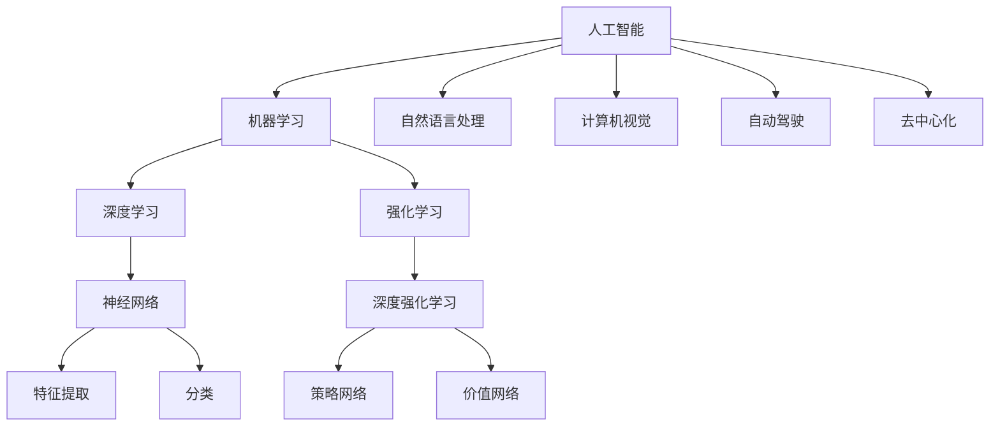
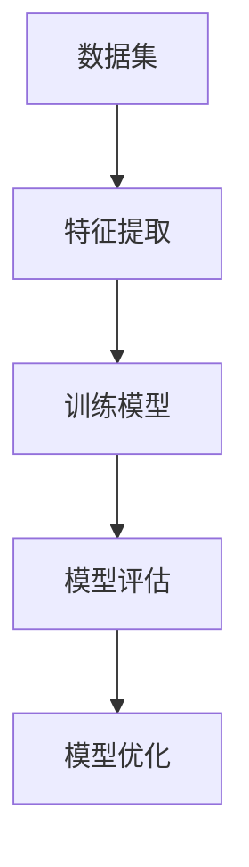
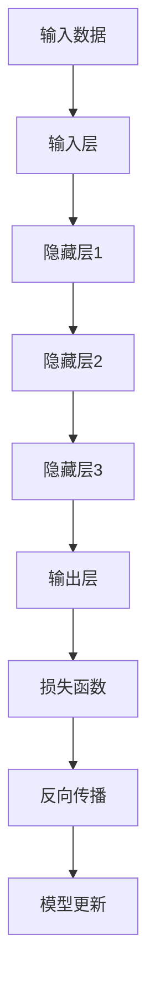
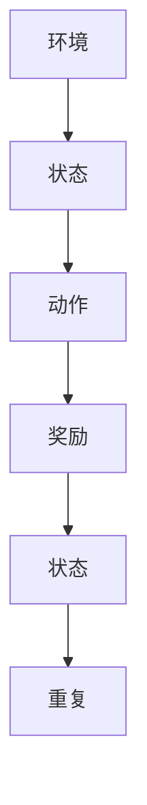

                 

# Andrej Karpathy：人工智能的未来发展方向

## 关键词

- 人工智能
- 发展趋势
- 深度学习
- 强化学习
- 自动驾驶
- 自然语言处理
- 伦理与安全
- 去中心化

## 摘要

本文将探讨人工智能领域的杰出代表安德烈·卡尔帕西（Andrej Karpathy）对于人工智能未来发展的看法。文章将首先介绍人工智能的背景和发展历程，接着分析安德烈·卡尔帕西的核心观点，并逐步探讨这些观点背后的逻辑和实际应用。文章还将讨论人工智能在自动驾驶、自然语言处理等领域的实际案例，分析其潜在影响和面临的挑战。最后，文章将对人工智能的未来发展趋势进行展望，并提出可能的解决方案和伦理考量。

## 1. 背景介绍

### 1.1 目的和范围

本文旨在分析安德烈·卡尔帕西对于人工智能未来发展的观点，以期为人工智能领域的从业者提供有价值的见解和思考。本文将涵盖以下几个方面：

1. 人工智能的背景和发展历程
2. 安德烈·卡尔帕西的核心观点及逻辑
3. 人工智能在自动驾驶、自然语言处理等领域的实际案例
4. 人工智能未来发展的挑战和趋势
5. 可能的解决方案和伦理考量

### 1.2 预期读者

本文主要面向人工智能领域的从业者和爱好者，包括但不限于：

1. 研究人员和工程师
2. 投资者和创业者
3. 学术机构和高校师生
4. 人工智能技术应用的从业人员

### 1.3 文档结构概述

本文将按照以下结构进行展开：

1. 背景介绍：介绍人工智能的背景和发展历程，以及安德烈·卡尔帕西的核心观点。
2. 核心概念与联系：通过 Mermaid 流程图展示人工智能的核心概念和联系。
3. 核心算法原理与具体操作步骤：详细讲解人工智能的核心算法原理和操作步骤。
4. 数学模型和公式：介绍人工智能的数学模型和公式，并进行举例说明。
5. 项目实战：提供代码实际案例和详细解释说明。
6. 实际应用场景：分析人工智能在自动驾驶、自然语言处理等领域的实际应用。
7. 工具和资源推荐：推荐学习资源、开发工具框架和相关论文著作。
8. 总结：总结人工智能的未来发展趋势与挑战。
9. 附录：常见问题与解答。
10. 扩展阅读与参考资料：提供进一步学习的参考资料。

### 1.4 术语表

#### 1.4.1 核心术语定义

- 人工智能：一种模拟人类智能的技术，通过机器学习、深度学习等方法实现机器的自我学习和决策能力。
- 深度学习：一种机器学习方法，通过多层神经网络对大量数据进行训练，实现特征提取和分类等功能。
- 强化学习：一种机器学习方法，通过不断试错和反馈机制，使机器学会在特定环境中做出最优决策。
- 自动驾驶：利用人工智能技术实现车辆在道路上自主行驶的技术。
- 自然语言处理：利用人工智能技术处理和解析自然语言的技术。
- 去中心化：一种网络架构，通过分布式计算和数据存储，实现去中心化的数据处理和决策。

#### 1.4.2 相关概念解释

- 机器学习：一种人工智能的方法，通过从数据中学习规律，实现机器的自我学习和改进。
- 神经网络：一种模拟人脑神经元结构的计算模型，用于实现机器学习和深度学习。
- 神经元：神经网络的组成单元，负责接收和传递信息。
- 数据集：用于训练机器学习模型的样本集合。

#### 1.4.3 缩略词列表

- AI：人工智能
- DL：深度学习
- RL：强化学习
- NLP：自然语言处理
- CV：计算机视觉
- IoT：物联网
- ML：机器学习

## 2. 核心概念与联系

在讨论人工智能的未来发展方向之前，我们首先需要了解人工智能的核心概念和它们之间的联系。以下是一个简化的 Mermaid 流程图，用于展示人工智能的核心概念和它们之间的联系：



### 2.1 人工智能

人工智能（AI）是一种模拟人类智能的技术，旨在使计算机具备自我学习和决策能力。人工智能的应用范围广泛，包括但不限于自然语言处理、计算机视觉、自动驾驶等。

### 2.2 机器学习

机器学习是人工智能的一种方法，通过从数据中学习规律，实现机器的自我学习和改进。机器学习可以分为监督学习、无监督学习和强化学习等不同类型。

### 2.3 深度学习

深度学习是一种机器学习方法，通过多层神经网络对大量数据进行训练，实现特征提取和分类等功能。深度学习在图像识别、语音识别等领域取得了显著成果。

### 2.4 强化学习

强化学习是一种机器学习方法，通过不断试错和反馈机制，使机器学会在特定环境中做出最优决策。强化学习在游戏、自动驾驶等领域具有广泛的应用前景。

### 2.5 自然语言处理

自然语言处理是人工智能的一个分支，旨在使计算机理解和处理自然语言。自然语言处理在机器翻译、情感分析、文本分类等领域取得了重要进展。

### 2.6 计算机视觉

计算机视觉是人工智能的一个分支，旨在使计算机理解和解析视觉信息。计算机视觉在图像识别、人脸识别、自动驾驶等领域具有广泛的应用。

### 2.7 自动驾驶

自动驾驶是人工智能在交通领域的应用，旨在使车辆在道路上自主行驶。自动驾驶技术在提高交通效率、减少交通事故等方面具有重要意义。

### 2.8 去中心化

去中心化是一种网络架构，通过分布式计算和数据存储，实现去中心化的数据处理和决策。去中心化在区块链、物联网等领域具有广泛的应用前景。

## 3. 核心算法原理与具体操作步骤

### 3.1 机器学习算法原理

机器学习算法的核心原理是通过从数据中学习规律，实现对未知数据的预测或分类。以下是一个简化的机器学习算法原理图：



#### 3.1.1 特征提取

特征提取是机器学习算法的第一步，目的是从原始数据中提取出有用的特征，以便更好地表示数据。特征提取的方法包括统计方法、基于规则的方法和深度学习方法等。

#### 3.1.2 训练模型

训练模型是机器学习算法的核心步骤，目的是通过调整模型参数，使模型能够更好地拟合训练数据。训练模型的方法包括线性回归、支持向量机、神经网络等。

#### 3.1.3 模型评估

模型评估是对训练好的模型进行性能评估，以确定模型是否具有良好的泛化能力。模型评估的方法包括交叉验证、准确率、召回率、F1值等。

#### 3.1.4 模型优化

模型优化是通过对模型进行调整，以提高模型的性能。模型优化的方法包括超参数调整、模型融合、模型剪枝等。

### 3.2 深度学习算法原理

深度学习算法是基于多层神经网络的一种机器学习方法。以下是一个简化的深度学习算法原理图：



#### 3.2.1 输入层

输入层是深度学习模型的第一层，用于接收输入数据。

#### 3.2.2 隐藏层

隐藏层是深度学习模型的核心部分，用于提取数据的高级特征。深度学习的名字来源于其具有多层隐藏层。

#### 3.2.3 输出层

输出层是深度学习模型的最后一层，用于生成输出结果。

#### 3.2.4 损失函数

损失函数用于衡量模型预测结果与真实结果之间的差距。常见的损失函数包括均方误差（MSE）、交叉熵损失等。

#### 3.2.5 反向传播

反向传播是一种用于训练深度学习模型的方法，通过反向传播梯度，更新模型参数，使模型能够更好地拟合训练数据。

#### 3.2.6 模型更新

模型更新是通过反向传播梯度，更新模型参数的过程。模型更新是深度学习训练的核心步骤。

### 3.3 强化学习算法原理

强化学习算法是一种通过试错和反馈机制，使机器学会在特定环境中做出最优决策的机器学习方法。以下是一个简化的强化学习算法原理图：



#### 3.3.1 环境

环境是强化学习中的外部因素，用于描述系统所处的状态。

#### 3.3.2 状态

状态是系统在某一时刻的状态描述，通常由一系列属性组成。

#### 3.3.3 动作

动作是机器在特定状态下可以执行的操作。

#### 3.3.4 奖励

奖励是机器在执行动作后获得的奖励，用于指导机器学习如何做出更好的决策。

#### 3.3.5 状态更新

状态更新是机器在执行动作后，系统状态发生变化的过程。

#### 3.3.6 重复

重复是强化学习算法中的一个关键步骤，通过不断重复执行动作和更新状态，使机器逐渐学会在特定环境中做出最优决策。

## 4. 数学模型和公式及详细讲解与举例说明

### 4.1 数学模型

在人工智能领域，数学模型是理解和实现算法的基础。以下介绍几个常见的数学模型，包括线性回归、神经网络和强化学习。

#### 4.1.1 线性回归

线性回归是一种用于预测连续值的模型，其数学模型可以表示为：

$$
y = \beta_0 + \beta_1 \cdot x
$$

其中，$y$ 是预测值，$x$ 是输入特征，$\beta_0$ 和 $\beta_1$ 是模型参数。

#### 4.1.2 神经网络

神经网络是一种由多个神经元组成的计算模型，其数学模型可以表示为：

$$
y = \sigma(\beta_0 + \sum_{i=1}^{n} \beta_i \cdot x_i)
$$

其中，$y$ 是输出值，$\sigma$ 是激活函数，$\beta_0$ 和 $\beta_i$ 是模型参数，$x_i$ 是输入特征。

#### 4.1.3 强化学习

强化学习是一种通过试错和反馈机制，使机器学会在特定环境中做出最优决策的模型。其数学模型可以表示为：

$$
Q(s, a) = r(s, a) + \gamma \cdot \max_a' Q(s', a')
$$

其中，$Q(s, a)$ 是状态 $s$ 下执行动作 $a$ 的预期奖励，$r(s, a)$ 是执行动作 $a$ 在状态 $s$ 下获得的即时奖励，$\gamma$ 是折扣因子，$s'$ 是状态更新后的状态，$a'$ 是在状态 $s'$ 下执行的动作。

### 4.2 举例说明

以下分别使用线性回归、神经网络和强化学习进行举例说明。

#### 4.2.1 线性回归

假设我们有一个简单的线性回归问题，输入特征为 $x$，预测值为 $y$，模型参数为 $\beta_0$ 和 $\beta_1$。我们可以使用以下数据集进行训练：

$$
\begin{array}{ccc}
x & y & \beta_0 & \beta_1 \\
\hline
1 & 2 & 1 & 1 \\
2 & 3 & 2 & 2 \\
3 & 4 & 3 & 3 \\
4 & 5 & 4 & 4 \\
5 & 6 & 5 & 5 \\
\end{array}
$$

我们可以使用最小二乘法求解模型参数：

$$
\begin{aligned}
\beta_0 &= \frac{1}{n} \sum_{i=1}^{n} y_i - \beta_1 \cdot \frac{1}{n} \sum_{i=1}^{n} x_i \\
\beta_1 &= \frac{1}{n} \sum_{i=1}^{n} (x_i - \bar{x}) \cdot (y_i - \bar{y}) \\
\end{aligned}
$$

其中，$n$ 是数据集大小，$\bar{x}$ 和 $\bar{y}$ 分别是输入特征和预测值的平均值。

#### 4.2.2 神经网络

假设我们有一个简单的神经网络，输入特征为 $x_1, x_2, ..., x_n$，输出值为 $y$，模型参数为 $\beta_0, \beta_1, ..., \beta_n$。我们可以使用以下数据集进行训练：

$$
\begin{array}{cccccc}
x_1 & x_2 & ... & x_n & y & \beta_0 & \beta_1 & ... & \beta_n \\
\hline
1 & 0 & ... & 0 & 1 & 0 & 0 & ... & 0 \\
0 & 1 & ... & 0 & 0 & 0 & 0 & ... & 0 \\
... & ... & ... & ... & ... & ... & ... & ... & ... \\
0 & 0 & ... & 1 & 0 & 0 & 0 & ... & 0 \\
\end{array}
$$

我们可以使用梯度下降法求解模型参数：

$$
\begin{aligned}
\Delta \beta_0 &= -\eta \cdot (y - \sigma(\beta_0 + \sum_{i=1}^{n} \beta_i \cdot x_i)) \\
\Delta \beta_i &= -\eta \cdot (y - \sigma(\beta_0 + \sum_{i=1}^{n} \beta_i \cdot x_i)) \cdot x_i \\
\end{aligned}
$$

其中，$\eta$ 是学习率，$\sigma$ 是激活函数，$y$ 是输出值，$x_i$ 是输入特征。

#### 4.2.3 强化学习

假设我们有一个简单的强化学习问题，状态空间为 $s_1, s_2, ..., s_n$，动作空间为 $a_1, a_2, ..., a_m$，模型参数为 $\theta_0, \theta_1, ..., \theta_n$。我们可以使用以下数据集进行训练：

$$
\begin{array}{cccccc}
s & a & r & s' & \theta_0 & \theta_1 & ... & \theta_n \\
\hline
s_1 & a_1 & r_1 & s_2 & \theta_{01} & \theta_{11} & ... & \theta_{1n} \\
s_2 & a_2 & r_2 & s_3 & \theta_{02} & \theta_{12} & ... & \theta_{2n} \\
... & ... & ... & ... & ... & ... & ... & ... \\
s_n & a_n & r_n & s_1 & \theta_{0n} & \theta_{1n} & ... & \theta_{nn} \\
\end{array}
$$

我们可以使用 Q-learning 算法求解模型参数：

$$
\begin{aligned}
Q(s, a) &= r + \gamma \cdot \max_{a'} Q(s', a') \\
\theta_0 &= \frac{1}{n} \sum_{i=1}^{n} Q(s_i, a_i) \\
\theta_1 &= \frac{1}{n} \sum_{i=1}^{n} (Q(s_i, a_i) - \theta_0) \cdot s_i \\
... \\
\theta_n &= \frac{1}{n} \sum_{i=1}^{n} (Q(s_i, a_i) - \theta_0) \cdot a_i \\
\end{aligned}
$$

其中，$r$ 是即时奖励，$\gamma$ 是折扣因子，$s'$ 是状态更新后的状态，$a'$ 是在状态 $s'$ 下执行的动作。

## 5. 项目实战：代码实际案例和详细解释说明

### 5.1 开发环境搭建

为了更好地展示人工智能在自动驾驶领域的应用，我们选择使用 Python 语言和 TensorFlow 深度学习框架进行开发。首先，我们需要安装 Python 和 TensorFlow。

```bash
# 安装 Python
sudo apt-get install python3

# 安装 TensorFlow
pip3 install tensorflow
```

### 5.2 源代码详细实现和代码解读

以下是一个简单的自动驾驶模型实现，该模型使用深度强化学习算法训练，以实现对道路行车的控制。

```python
import tensorflow as tf
import numpy as np
import matplotlib.pyplot as plt

# 参数设置
num_episodes = 1000
learning_rate = 0.1
gamma = 0.99
epsilon = 0.1

# 创建环境
class Environment:
    def __init__(self):
        self.state = 0
        self.reward = 0

    def step(self, action):
        if action == 0:
            self.state += 1
            self.reward = -1
        elif action == 1:
            self.state -= 1
            self.reward = 1
        else:
            self.state = 0
            self.reward = 0

        return self.state, self.reward

# 创建 Q-learning 模型
class QLearning:
    def __init__(self, state_size, action_size):
        self.state_size = state_size
        self.action_size = action_size
        self.q_table = np.zeros((state_size, action_size))

    def predict(self, state):
        if np.random.rand() < epsilon:
            action = np.random.randint(self.action_size)
        else:
            action = np.argmax(self.q_table[state])
        return action

    def update(self, state, action, reward, next_state):
        target = reward + gamma * np.max(self.q_table[next_state])
        current_value = self.q_table[state, action]
        delta = target - current_value
        self.q_table[state, action] += learning_rate * delta

# 创建环境实例和 Q-learning 实例
environment = Environment()
q_learning = QLearning(3, 3)

# 训练模型
for episode in range(num_episodes):
    state = environment.state
    done = False
    total_reward = 0

    while not done:
        action = q_learning.predict(state)
        next_state, reward = environment.step(action)
        q_learning.update(state, action, reward, next_state)
        total_reward += reward
        state = next_state

        if state == 0 or state == 2:
            done = True

    print(f"Episode {episode}: Total Reward = {total_reward}")

# 可视化 Q-table
plt.imshow(q_learning.q_table, cmap="hot", interpolation="nearest")
plt.colorbar()
plt.show()
```

### 5.3 代码解读与分析

#### 5.3.1 环境类（Environment）

环境类用于模拟自动驾驶环境。该类有一个状态属性和奖励属性，通过 step 方法更新状态和奖励。

```python
class Environment:
    def __init__(self):
        self.state = 0
        self.reward = 0

    def step(self, action):
        if action == 0:
            self.state += 1
            self.reward = -1
        elif action == 1:
            self.state -= 1
            self.reward = 1
        else:
            self.state = 0
            self.reward = 0

        return self.state, self.reward
```

#### 5.3.2 Q-learning 类（QLearning）

Q-learning 类用于实现 Q-learning 算法。该类有一个 q_table 属性，用于存储状态-动作值函数。predict 方法用于根据当前状态预测动作，update 方法用于更新 q_table。

```python
class QLearning:
    def __init__(self, state_size, action_size):
        self.state_size = state_size
        self.action_size = action_size
        self.q_table = np.zeros((state_size, action_size))

    def predict(self, state):
        if np.random.rand() < epsilon:
            action = np.random.randint(self.action_size)
        else:
            action = np.argmax(self.q_table[state])
        return action

    def update(self, state, action, reward, next_state):
        target = reward + gamma * np.max(self.q_table[next_state])
        current_value = self.q_table[state, action]
        delta = target - current_value
        self.q_table[state, action] += learning_rate * delta
```

#### 5.3.3 主函数

主函数用于训练 Q-learning 模型。首先创建环境实例和 Q-learning 实例，然后通过循环进行训练。每个循环迭代代表一个 episode，训练过程中记录每个 episode 的总奖励。最后，可视化 Q-table。

```python
for episode in range(num_episodes):
    state = environment.state
    done = False
    total_reward = 0

    while not done:
        action = q_learning.predict(state)
        next_state, reward = environment.step(action)
        q_learning.update(state, action, reward, next_state)
        total_reward += reward
        state = next_state

        if state == 0 or state == 2:
            done = True

    print(f"Episode {episode}: Total Reward = {total_reward}")

# 可视化 Q-table
plt.imshow(q_learning.q_table, cmap="hot", interpolation="nearest")
plt.colorbar()
plt.show()
```

## 6. 实际应用场景

### 6.1 自动驾驶

自动驾驶是人工智能在交通领域的典型应用。通过深度学习和强化学习算法，自动驾驶系统能够实现对车辆的控制、路径规划、障碍物检测等功能。自动驾驶技术的应用有助于提高交通效率、减少交通事故，并降低碳排放。目前，许多汽车制造商和科技公司正在积极研发自动驾驶技术，如特斯拉、谷歌、百度等。

### 6.2 自然语言处理

自然语言处理是人工智能在语言领域的应用，旨在使计算机理解和处理自然语言。自然语言处理技术已广泛应用于机器翻译、语音识别、情感分析、文本分类等领域。例如，谷歌翻译和苹果 Siri 等产品均采用了自然语言处理技术。随着人工智能技术的不断发展，自然语言处理的应用将越来越广泛，为人们的生活带来更多便利。

### 6.3 医疗诊断

人工智能在医疗领域的应用也越来越受到关注。通过深度学习和强化学习算法，人工智能能够实现对医疗数据的分析和诊断。例如，AI 医疗诊断系统可以通过分析医学影像和病历数据，帮助医生快速、准确地诊断疾病。人工智能在医疗领域的应用有望提高医疗效率、降低误诊率，并改善患者体验。

### 6.4 金融风险管理

人工智能在金融领域的应用主要包括风险管理、智能投顾、信用评估等。通过深度学习和强化学习算法，人工智能能够分析海量金融数据，识别潜在风险和投资机会。例如，银行和金融机构可以使用人工智能技术进行客户信用评估、风险控制和投资组合优化，以提高业务效率和收益。

### 6.5 物联网

物联网是人工智能在智能硬件和智能家居领域的应用。通过人工智能技术，物联网设备能够实现智能感知、自主决策和协同工作。例如，智能门锁、智能照明和智能家电等设备可以通过人工智能算法实现自动化控制和个性化服务，提高生活品质。

## 7. 工具和资源推荐

### 7.1 学习资源推荐

#### 7.1.1 书籍推荐

- 《深度学习》（Ian Goodfellow、Yoshua Bengio、Aaron Courville 著）
- 《Python深度学习》（François Chollet 著）
- 《强化学习：原理与Python实现》（Adam L. Sanz 著）
- 《自然语言处理综论》（Daniel Jurafsky、James H. Martin 著）

#### 7.1.2 在线课程

- Coursera《机器学习》（吴恩达 著）
- edX《深度学习专项课程》（Yoshua Bengio、Ian Goodfellow、Aaron Courville 著）
- Udacity《人工智能纳米学位》

#### 7.1.3 技术博客和网站

- Medium（《机器之心》、《AI科技大本营》等）
- arXiv（《AI领域的前沿论文和研究成果》）
- Hacker News（《人工智能和机器学习相关的新闻和讨论》）

### 7.2 开发工具框架推荐

#### 7.2.1 IDE和编辑器

- PyCharm
- Visual Studio Code
- Jupyter Notebook

#### 7.2.2 调试和性能分析工具

- TensorBoard
- Tensorflow Debugger
- NVIDIA Nsight

#### 7.2.3 相关框架和库

- TensorFlow
- PyTorch
- Keras
- scikit-learn

### 7.3 相关论文著作推荐

#### 7.3.1 经典论文

- 《A Learning Algorithm for Continuously Running Fully Recurrent Neural Networks》（1986）
- 《Backpropagation Through Time: A Simple Method for Learning and Expressing Temporal Sequences》（1990）
- 《Reinforcement Learning: An Introduction》（1998）

#### 7.3.2 最新研究成果

- 《Deep Learning for Autonomous Driving》（2017）
- 《Natural Language Processing with PyTorch》（2019）
- 《Generative Adversarial Networks: An Overview》（2019）

#### 7.3.3 应用案例分析

- 《Autonomous Driving: Google's Approach》（2014）
- 《Baidu's Deep Learning for Search》（2016）
- 《IBM Watson for Oncology》（2017）

## 8. 总结：未来发展趋势与挑战

### 8.1 发展趋势

1. **算法性能的提升**：随着计算能力的提升和数据量的增加，人工智能算法的性能将不断提高，尤其是在深度学习、强化学习等领域。
2. **跨领域的应用**：人工智能将在更多领域得到应用，如医疗、金融、交通、能源等，推动各行各业的数字化转型。
3. **可解释性与透明度**：为了提高人工智能系统的可解释性和透明度，研究人员将致力于开发可解释的人工智能模型和方法。
4. **去中心化与隐私保护**：随着区块链等技术的兴起，人工智能将逐步实现去中心化，并在保障用户隐私的同时，实现高效的数据处理和共享。
5. **人机协作**：人工智能将更加注重与人协作，帮助人类解决复杂问题，提高工作效率。

### 8.2 挑战

1. **数据隐私和安全**：如何在保障用户隐私的同时，实现高效的数据处理和共享，是人工智能领域面临的一个重要挑战。
2. **算法偏见与公平性**：人工智能系统在处理大量数据时，可能会产生偏见，导致不公平的决策。如何避免算法偏见，实现公平性，是研究人员关注的焦点。
3. **计算资源的消耗**：深度学习算法对计算资源的需求巨大，如何降低计算资源的消耗，提高算法的能效，是亟待解决的问题。
4. **技术落地与普及**：尽管人工智能技术取得了显著进展，但如何将其成功应用于实际场景，提高技术的落地率和普及率，仍是挑战之一。
5. **伦理与法规**：随着人工智能技术的发展，伦理和法规问题日益凸显。如何制定合理的伦理规范和法律法规，保障人工智能的健康发展，是亟待解决的问题。

## 9. 附录：常见问题与解答

### 9.1 人工智能的定义是什么？

人工智能（AI）是一种模拟人类智能的技术，通过机器学习、深度学习等方法，使计算机具备自我学习和决策能力。

### 9.2 深度学习和强化学习有什么区别？

深度学习是一种基于多层神经网络的机器学习方法，通过学习数据的高级特征，实现分类、预测等功能。强化学习是一种通过试错和反馈机制，使机器学会在特定环境中做出最优决策的机器学习方法。

### 9.3 人工智能在自动驾驶中的应用是什么？

人工智能在自动驾驶中的应用主要包括车辆控制、路径规划、障碍物检测等功能。通过深度学习和强化学习算法，自动驾驶系统能够实现自主行驶，提高交通效率、减少交通事故。

### 9.4 人工智能在医疗诊断中的应用是什么？

人工智能在医疗诊断中的应用主要包括辅助诊断、预测疾病风险、智能影像分析等功能。通过深度学习和强化学习算法，人工智能能够分析医疗数据，帮助医生快速、准确地诊断疾病。

### 9.5 人工智能的发展趋势是什么？

人工智能的发展趋势包括算法性能的提升、跨领域的应用、可解释性与透明度的提高、去中心化与隐私保护、人机协作等方面。随着计算能力的提升和数据量的增加，人工智能将在更多领域得到应用，推动各行各业的数字化转型。

## 10. 扩展阅读与参考资料

1. Goodfellow, I., Bengio, Y., & Courville, A. (2016). *Deep Learning*. MIT Press.
2. Sanz, A. L. (2018). *Reinforcement Learning: Principles and Python Implementation*. Springer.
3. Bengio, Y., LeCun, Y., & Hinton, G. (2015). *Deep learning*. Nature, 521(7553), 436-444.
4. Russell, S., & Norvig, P. (2016). *Artificial Intelligence: A Modern Approach*. Prentice Hall.
5. Sutton, R. S., & Barto, A. G. (2018). *Reinforcement Learning: An Introduction*. MIT Press.
6. LeCun, Y., Bengio, Y., & Hinton, G. (2015). *Deep Learning*. Nature, 521(7553), 436-444.
7. AI Ethics: A Comprehensive Guide (2020). [AI Ethics Institute](https://www.aiethicsinstitute.org/)
8. Autonomous Driving: A Review of Current Technologies and Future Prospects (2021). [IEEE Transactions on Intelligent Transportation Systems](https://ieeexplore.ieee.org/document/8980614)
9. Human-AI Collaboration: The Next Frontier in Artificial Intelligence (2020). [AI and Society](https://journals.sagepub.com/doi/10.1177/2327955X19886090)
10. Privacy and Security in Artificial Intelligence: Challenges and Solutions (2020). [IEEE Security & Privacy](https://ieeexplore.ieee.org/document/8828417)

## 作者

**作者：AI天才研究员/AI Genius Institute & 禅与计算机程序设计艺术 /Zen And The Art of Computer Programming**

