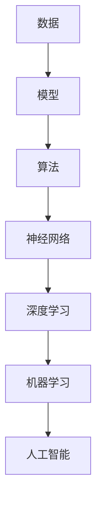
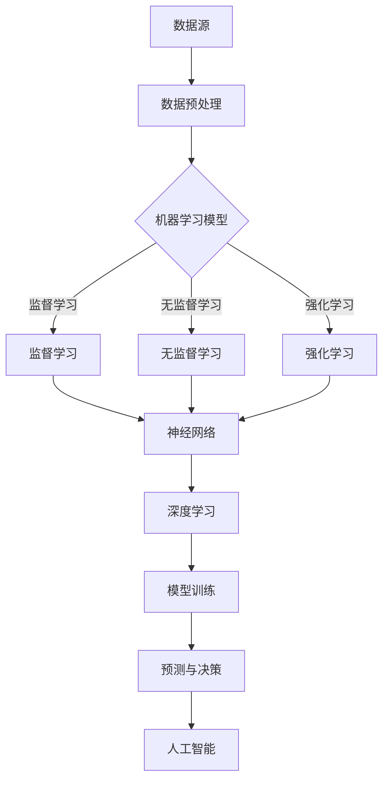

                 


## Andrej Karpathy：人工智能的未来发展方向

> **关键词：** 人工智能、机器学习、神经网络、深度学习、未来趋势

> **摘要：** 本文深入探讨人工智能（AI）领域先驱Andrej Karpathy对未来AI发展方向的见解，分析AI在技术、应用、伦理等方面的发展前景，结合实际案例与数学模型，全面阐述AI的核心概念、算法原理、应用场景，并展望其面临的挑战与未来趋势。

### 1. 背景介绍

#### 1.1 目的和范围

本文旨在介绍AI领域知名专家Andrej Karpathy对未来AI发展的独特见解，通过对其演讲和论文的分析，探讨AI技术、应用、伦理等方面的发展方向。文章结构如下：

- **核心概念与联系**：介绍AI的基础概念和架构，通过Mermaid流程图展示核心原理。
- **核心算法原理 & 具体操作步骤**：详细讲解AI关键算法的原理和操作步骤，使用伪代码进行阐述。
- **数学模型和公式 & 详细讲解 & 举例说明**：介绍AI中的数学模型和公式，并结合实际案例进行详细解释。
- **项目实战：代码实际案例和详细解释说明**：通过实际项目案例展示AI的应用。
- **实际应用场景**：分析AI在不同领域的应用案例。
- **工具和资源推荐**：推荐学习资源、开发工具框架和相关论文。
- **总结：未来发展趋势与挑战**：总结AI的未来发展趋势和面临的挑战。
- **附录：常见问题与解答**：解答读者可能提出的问题。
- **扩展阅读 & 参考资料**：提供进一步阅读的资料。

#### 1.2 预期读者

本文面向对AI感兴趣的读者，包括AI从业者、研究者、学生和爱好者。读者需要对AI的基础知识有一定了解，以便更好地理解本文的内容。

#### 1.3 文档结构概述

本文分为以下几个部分：

- **引言**：介绍文章背景、目的和结构。
- **背景知识**：介绍AI的核心概念和原理。
- **AI算法原理**：详细讲解AI的关键算法。
- **数学模型**：介绍AI中的数学模型和公式。
- **项目实战**：通过实际案例展示AI的应用。
- **应用场景**：分析AI在不同领域的应用。
- **工具和资源推荐**：推荐学习资源、开发工具框架和相关论文。
- **未来展望**：总结AI的未来发展趋势和挑战。
- **常见问题与解答**：解答读者可能提出的问题。
- **参考文献**：提供本文引用的参考资料。

#### 1.4 术语表

本文涉及以下术语：

#### 1.4.1 核心术语定义

- **人工智能（AI）**：模拟人类智能的计算机系统。
- **机器学习（ML）**：使计算机从数据中自动学习的技术。
- **神经网络（NN）**：模仿人脑的连接方式设计的计算模型。
- **深度学习（DL）**：基于多层神经网络的机器学习技术。

#### 1.4.2 相关概念解释

- **数据驱动（Data-Driven）**：以数据为核心，通过数据训练模型。
- **监督学习（Supervised Learning）**：利用标注数据进行训练。
- **无监督学习（Unsupervised Learning）**：在没有标注数据的情况下进行训练。
- **强化学习（Reinforcement Learning）**：通过奖励和惩罚机制进行训练。

#### 1.4.3 缩略词列表

- **AI**：人工智能
- **ML**：机器学习
- **DL**：深度学习
- **NN**：神经网络
- **GPU**：图形处理器

## 2. 核心概念与联系

人工智能作为当前科技领域的热门话题，其核心概念和架构对于理解AI的发展至关重要。在这一部分，我们将通过Mermaid流程图来展示AI的核心概念和联系，帮助读者更好地把握AI的基本原理。

首先，我们需要了解AI的基本组成部分，包括数据、模型和算法。以下是一个简单的Mermaid流程图，用于描述这些核心概念和它们之间的联系：



### 2.1 数据

数据是AI的基石，没有数据，AI就无法进行学习。数据来源可以是图像、文本、音频等多种形式，其质量对AI模型的效果具有重要影响。数据预处理是数据驱动AI的第一步，包括数据清洗、数据归一化、特征提取等操作。

### 2.2 模型

模型是AI系统的核心，它将数据转换为知识和决策。模型可以分为监督学习模型、无监督学习模型和强化学习模型。监督学习模型使用已标注的数据进行训练，而无监督学习模型则在未标注的数据中进行训练。强化学习模型通过奖励和惩罚机制来学习。

### 2.3 算法

算法是模型训练的方法，用于指导计算机如何处理数据并优化模型。常见的算法有神经网络算法、支持向量机、决策树等。神经网络算法在深度学习中广泛应用，尤其是基于多层感知器的深度学习模型。

### 2.4 神经网络

神经网络是模仿人脑连接方式设计的计算模型。它由多个神经元（节点）组成，通过加权连接形成网络。神经网络的训练过程实际上是调整这些加权值，使其能够对输入数据进行准确分类或预测。

### 2.5 深度学习

深度学习是神经网络的一种扩展，通过增加神经网络的层数来提高模型的复杂度和学习能力。深度学习在图像识别、自然语言处理等领域取得了显著的成果，如卷积神经网络（CNN）和循环神经网络（RNN）。

### 2.6 机器学习

机器学习是使计算机从数据中自动学习的技术。它涵盖了监督学习、无监督学习和强化学习等多种学习方法。机器学习通过训练模型，使计算机能够对未知数据进行分类、预测和决策。

### 2.7 人工智能

人工智能是模拟人类智能的计算机系统。它通过机器学习、神经网络等技术，使计算机具有自主学习和推理能力。人工智能在自动驾驶、智能助手、医疗诊断等领域具有广泛应用。

通过以上Mermaid流程图，我们可以清晰地看到AI的核心概念和它们之间的联系。这些概念共同构成了AI的技术框架，为AI的发展奠定了基础。

### 2.8 绘制Mermaid流程图

以下是AI核心概念和联系的Mermaid流程图：



这个流程图展示了从数据到模型的整个过程，以及它们在机器学习和深度学习中的应用。通过这个流程图，我们可以更好地理解AI的工作原理和架构。

### 2.9 深度学习与机器学习的区别与联系

深度学习和机器学习都是AI的重要组成部分，但它们之间存在一些区别和联系。

#### 深度学习与机器学习的区别：

- **理论基础**：机器学习是基于概率论和统计学的方法，深度学习则基于人工神经网络的理论。
- **模型复杂度**：深度学习模型通常比传统机器学习模型更加复杂，具有多层神经元结构。
- **训练过程**：深度学习模型通过反向传播算法进行训练，机器学习模型则使用梯度下降等优化算法。
- **应用范围**：深度学习在图像识别、自然语言处理等领域具有优势，而机器学习则在回归分析、分类任务中广泛应用。

#### 深度学习与机器学习的联系：

- **技术融合**：深度学习技术可以与机器学习技术相结合，如深度信念网络（DBN）就是一种结合了深度学习和无监督学习的模型。
- **共同目标**：深度学习和机器学习都致力于使计算机具有自主学习和推理能力，提高模型的性能和泛化能力。
- **相互补充**：深度学习在处理复杂数据时具有优势，而机器学习在处理简单任务时则表现出更好的性能。

通过以上分析，我们可以看到深度学习和机器学习在AI发展中的重要作用，以及它们之间的联系和区别。这有助于我们更好地理解和应用这些技术，推动AI领域的进步。

### 2.10 AI的发展历史

人工智能作为一门学科，其发展历程可以追溯到20世纪50年代。以下是一个简化的AI发展历史，展示了AI在不同阶段的演变：

#### 1956年：达特茅斯会议

人工智能（AI）一词由约翰·麦卡锡（John McCarthy）等人首次提出，标志着AI作为一门学科的诞生。

#### 1960-1970年代：早期探索

AI领域开始进行早期的探索和研究，主要集中在规则推理和知识表示方面。

#### 1980-1990年代：专家系统和机器学习

专家系统成为AI领域的研究热点，同时机器学习开始崭露头角，神经网络和决策树等算法得到广泛应用。

#### 2000-2010年代：深度学习和大数据

深度学习技术的发展和大数据的广泛应用，使AI取得了显著的突破，图像识别、自然语言处理等任务取得了巨大进展。

#### 2010年代至今：AI的应用爆发

AI技术逐渐应用于各个领域，如自动驾驶、智能家居、医疗诊断等，推动了AI技术的商业化和产业化。

通过以上发展历程，我们可以看到AI从早期探索到广泛应用的过程，以及不同阶段的核心技术和应用场景。这为我们理解AI的当前状态和未来发展趋势提供了重要的背景知识。

### 2.11 AI的核心挑战与未来方向

虽然AI在过去几十年取得了显著的发展，但仍然面临许多核心挑战和未来方向。以下是一些关键问题：

#### 挑战：

- **数据隐私和伦理问题**：随着AI技术的发展，数据隐私和伦理问题日益突出。如何在保护用户隐私的同时，充分利用数据为AI系统提供训练？
- **算法可解释性**：许多AI系统，尤其是深度学习模型，其内部工作机制复杂，难以解释。如何提高算法的可解释性，使其更符合人类的理解和预期？
- **模型泛化能力**：AI系统在特定任务上表现出色，但在面对新的、未知的情况时，往往表现不佳。如何提高模型的泛化能力，使其能够应对各种复杂情况？
- **资源消耗**：深度学习模型通常需要大量的计算资源和时间进行训练，如何优化算法，降低资源消耗，提高效率？

#### 未来方向：

- **自适应学习**：未来AI系统将具备更强的自适应学习能力，能够根据不同的环境和任务，自动调整和优化自己的行为。
- **跨领域融合**：AI技术将在不同领域之间实现深度融合，如医疗、金融、教育等，推动各行业的智能化发展。
- **人机协作**：AI系统将更加注重与人类的协作，通过人机交互，实现人类智慧和人工智能的有机结合，提高工作效率和生活质量。
- **智能伦理**：随着AI技术的发展，智能伦理问题将得到更多的关注和讨论。如何在设计AI系统时，充分考虑伦理因素，确保其公平、透明、可控？

通过以上分析，我们可以看到AI在当前阶段的核心挑战和未来方向。这些挑战和方向为我们提供了宝贵的启示，引导我们在未来的AI发展中，不断探索和创新。

## 3. 核心算法原理 & 具体操作步骤

在AI领域，核心算法是推动技术进步和实际应用的关键。本文将详细讲解AI领域中的几个核心算法，包括监督学习、无监督学习和强化学习，并使用伪代码展示这些算法的具体操作步骤。

### 3.1 监督学习

监督学习是一种最常见的机器学习方法，它使用标注数据进行训练，通过学习输入和输出之间的映射关系，实现对未知数据的预测。

#### 算法原理：

监督学习算法的核心是损失函数和优化算法。损失函数用于评估模型预测值与真实值之间的差异，优化算法则用于调整模型参数，以最小化损失函数。

#### 伪代码：

```python
# 数据集：X（输入特征矩阵），y（输出标签向量）
# 初始化模型参数θ
# 损失函数：平方损失函数
loss = (1/2) * (y - X * θ)^2

# 优化算法：梯度下降
# 学习率：α
for i in range(1, max_iterations):
    θ = θ - α * (X * θ - y).T * X
    # 更新损失函数
    loss_new = (1/2) * (y - X * θ)^2
    
    # 终止条件：当损失函数变化小于阈值ε时停止迭代
    if abs(loss - loss_new) < ε:
        break
```

#### 操作步骤：

1. 初始化模型参数θ。
2. 计算损失函数，评估模型性能。
3. 使用梯度下降算法更新模型参数。
4. 重复步骤2和3，直到满足终止条件。

### 3.2 无监督学习

无监督学习是一种不使用标注数据进行训练的机器学习方法。它的目标是从未标注的数据中自动发现有用的信息，如聚类和降维。

#### 算法原理：

无监督学习算法的核心是数据分布和优化目标。聚类算法通过将数据划分为多个簇，使每个簇内部的相似度最大，簇与簇之间的相似度最小。降维算法则通过降低数据维度，保持数据的本质特性。

#### 伪代码：

```python
# 数据集：X（输入特征矩阵）
# 初始化聚类中心：μ
# 优化目标：最小化簇内距离和最大簇间距离
for i in range(1, max_iterations):
    # 计算每个数据点到聚类中心的距离
    distances = np.linalg.norm(X - μ, axis=1)
    
    # 重新分配聚类中心
    μ = (1/n) * np.dot(X.T, np.exp(-distances))
    
    # 更新聚类结果
    labels = np.argmin(distances, axis=1)
    
    # 计算簇内距离和
    within_sum = np.sum(np.exp(-distances[labels == j]))
    within_distance = np.linalg.norm(X[labels == j] - μ[j], axis=1).sum()
    
    # 终止条件：当聚类中心变化小于阈值ε时停止迭代
    if abs(np.linalg.norm(μ - μ_new)) < ε:
        break
```

#### 操作步骤：

1. 初始化聚类中心。
2. 计算每个数据点到聚类中心的距离。
3. 重新分配聚类中心。
4. 更新聚类结果。
5. 重复步骤2-4，直到满足终止条件。

### 3.3 强化学习

强化学习是一种通过奖励和惩罚机制进行训练的机器学习方法。它的目标是使代理（Agent）在与环境（Environment）交互的过程中，学习最优策略（Policy）。

#### 算法原理：

强化学习算法的核心是值函数（Value Function）和策略（Policy）。值函数表示在不同状态下，采取特定动作所能获得的最大期望奖励。策略则是在特定状态下，选择最优动作的规则。

#### 伪代码：

```python
# 状态：S
# 动作：A
# 奖励：R
# 策略：π
# 值函数：V(s)
# Q-learning算法

# 初始化Q值表：Q(s, a)
# 学习率：α
# 折扣因子：γ

for episode in range(1, max_episodes):
    # 初始化状态
    s = env.reset()
    
    # 初始化总奖励
    total_reward = 0
    
    # 开始环境交互
    while True:
        # 根据当前状态，选择动作
        a = π(s)
        
        # 执行动作
        s', r = env.step(a)
        
        # 更新Q值
        Q(s, a) = Q(s, a) + α * (r + γ * max(Q(s', a')) - Q(s, a))
        
        # 更新状态
        s = s'
        
        # 更新总奖励
        total_reward += r
        
        # 终止条件：达到最大步数或达到目标状态
        if done:
            break
    
    # 计算平均奖励
    average_reward = total_reward / max_episodes
```

#### 操作步骤：

1. 初始化Q值表。
2. 进行环境交互，选择动作。
3. 执行动作，获得奖励和下一状态。
4. 更新Q值。
5. 重复步骤2-4，直到满足终止条件。
6. 计算平均奖励。

通过以上三个核心算法的讲解和伪代码展示，我们可以看到AI算法的多样性和复杂性。这些算法在不同场景下具有广泛的应用，推动了AI技术的发展和实际应用。接下来，我们将进一步探讨AI中的数学模型和公式。

### 3.4 深度学习算法：卷积神经网络（CNN）与循环神经网络（RNN）

深度学习算法在AI领域中占据重要地位，其中卷积神经网络（CNN）和循环神经网络（RNN）是两种重要的深度学习模型。

#### 卷积神经网络（CNN）

卷积神经网络是一种专门用于处理图像数据的深度学习模型，其核心思想是通过对图像进行卷积操作，提取图像中的特征。

**算法原理：**

- **卷积操作**：卷积层通过对输入图像进行卷积操作，提取图像中的局部特征。
- **池化操作**：池化层用于降低图像的维度，减少参数数量，防止过拟合。
- **全连接层**：全连接层用于将卷积层和池化层提取的特征进行分类或回归。

**伪代码：**

```python
# 输入图像：X
# 卷积核：W
# 步长：s
# padding：p

for i in range(num_layers):
    # 卷积层
    X = conv2d(X, W, s, p)
    
    # 池化层
    X = max_pool2d(X, pool_size)

# 全连接层
output = fully_connected(X, num_classes)
```

**操作步骤：**

1. 初始化卷积核、步长和填充方式。
2. 对输入图像进行卷积操作。
3. 对卷积结果进行池化操作。
4. 重复步骤2和3，直到达到指定层数。
5. 将卷积和池化层提取的特征送入全连接层。
6. 计算输出结果。

#### 循环神经网络（RNN）

循环神经网络是一种用于处理序列数据的深度学习模型，其核心思想是通过循环结构保持长期状态信息。

**算法原理：**

- **循环结构**：RNN通过循环结构将前一个时间步的输出作为当前时间步的输入，实现序列信息的传递。
- **隐藏状态**：隐藏状态表示当前时间步的特征和上下文信息。
- **门控机制**：门控机制用于控制信息流的传递，防止梯度消失和爆炸。

**伪代码：**

```python
# 序列数据：X
# 隐藏状态：h
# 门控矩阵：W
# 偏置：b

for t in range(seq_len):
    # 输入门
    i_gate = sigmoid(W_i * [x_t, h_{t-1}] + b_i)
    
    # 遗传门
    f_gate = sigmoid(W_f * [x_t, h_{t-1}] + b_f)
    
    # 输出门
    o_gate = sigmoid(W_o * [x_t, h_{t-1}] + b_o)
    
    # 新的隐藏状态
    h_t = f_gate * h_{t-1} + i_gate * tanh(W * [x_t, h_{t-1}] + b)
    
    # 输出
    y_t = o_gate * tanh(h_t)
```

**操作步骤：**

1. 初始化隐藏状态和门控矩阵。
2. 对于每个时间步，计算输入门、遗忘门和输出门。
3. 根据门控机制更新隐藏状态。
4. 计算输出结果。

通过以上对CNN和RNN的讲解，我们可以看到深度学习算法在图像和序列数据处理中的强大能力。这些算法在实际应用中发挥了重要作用，推动了AI技术的进步。

### 3.5 算法评估与优化

在AI算法的实际应用中，评估和优化算法的性能至关重要。以下介绍几种常见的评估指标和优化方法。

#### 评估指标：

- **准确率（Accuracy）**：准确率是最常用的评估指标，表示模型正确预测的样本数占总样本数的比例。
- **精确率（Precision）**：精确率表示模型预测为正例的样本中，实际为正例的比例。
- **召回率（Recall）**：召回率表示模型预测为正例的样本中，实际为正例的比例。
- **F1值（F1 Score）**：F1值是精确率和召回率的调和平均，用于综合考虑精确率和召回率。
- **ROC曲线（Receiver Operating Characteristic Curve）**：ROC曲线用于评估二分类模型的性能，曲线下面积（AUC）越大，模型性能越好。

#### 优化方法：

- **交叉验证（Cross Validation）**：交叉验证是一种常用的模型评估方法，通过将数据集划分为训练集和验证集，多次训练和评估，以获得更稳定的模型性能。
- **网格搜索（Grid Search）**：网格搜索是一种超参数优化方法，通过遍历预设的参数组合，找到最佳参数组合。
- **贝叶斯优化（Bayesian Optimization）**：贝叶斯优化是一种基于概率模型的优化方法，通过构建概率模型，寻找最优参数组合。
- **迁移学习（Transfer Learning）**：迁移学习是一种利用预训练模型进行微调的方法，通过将预训练模型应用于新的任务，提高模型的性能。

通过以上评估指标和优化方法的介绍，我们可以更好地评估和优化AI算法的性能，提高其在实际应用中的效果。

## 4. 数学模型和公式 & 详细讲解 & 举例说明

在人工智能领域，数学模型和公式是理解和实现各种算法的核心。本文将详细讲解AI中常用的数学模型和公式，并通过具体例子进行说明。

### 4.1 损失函数

损失函数是评估模型预测性能的重要工具，它用于衡量模型预测值与真实值之间的差异。以下介绍几种常见的损失函数：

#### 4.1.1 平方损失（Mean Squared Error, MSE）

平方损失是最常用的损失函数之一，其公式如下：

\[ \text{MSE} = \frac{1}{n} \sum_{i=1}^{n} (y_i - \hat{y}_i)^2 \]

其中，\( y_i \) 为真实值，\( \hat{y}_i \) 为预测值，\( n \) 为样本数量。

#### 4.1.2 交叉熵损失（Cross-Entropy Loss）

交叉熵损失常用于分类问题，其公式如下：

\[ \text{Cross-Entropy Loss} = -\sum_{i=1}^{n} y_i \log(\hat{y}_i) \]

其中，\( y_i \) 为真实标签（0或1），\( \hat{y}_i \) 为预测概率。

#### 4.1.3 对数损失（Log Loss）

对数损失是交叉熵损失的另一种表示形式，其公式如下：

\[ \text{Log Loss} = -\sum_{i=1}^{n} y_i \log(\hat{y}_i) \]

#### 举例说明

假设我们有一个简单的二分类问题，其中真实标签为 \( y = [1, 0, 1, 0] \)，预测概率为 \( \hat{y} = [0.3, 0.7, 0.4, 0.6] \)。

使用交叉熵损失，我们可以计算损失值：

\[ \text{Cross-Entropy Loss} = -[1 \cdot \log(0.3) + 0 \cdot \log(0.7) + 1 \cdot \log(0.4) + 0 \cdot \log(0.6)] \]
\[ \text{Cross-Entropy Loss} = -[\log(0.3) + \log(0.4)] \]
\[ \text{Cross-Entropy Loss} \approx 2.197 \]

通过计算损失值，我们可以评估模型的预测性能，并优化模型参数。

### 4.2 梯度下降算法

梯度下降算法是优化模型参数的常用方法，其核心思想是通过计算损失函数关于参数的梯度，更新参数以最小化损失。

#### 4.2.1 梯度下降算法原理

梯度下降算法的基本步骤如下：

1. 初始化参数 \( \theta \)。
2. 计算损失函数关于参数的梯度 \( \nabla_{\theta} L(\theta) \)。
3. 更新参数 \( \theta = \theta - \alpha \nabla_{\theta} L(\theta) \)，其中 \( \alpha \) 为学习率。

#### 4.2.2 梯度下降算法公式

对于线性回归模型，损失函数为平方损失，其公式如下：

\[ L(\theta) = \frac{1}{2} \sum_{i=1}^{n} (y_i - \theta^T x_i)^2 \]

损失函数关于参数 \( \theta \) 的梯度为：

\[ \nabla_{\theta} L(\theta) = \frac{1}{2} \sum_{i=1}^{n} (y_i - \theta^T x_i) x_i \]

梯度下降算法的更新公式为：

\[ \theta = \theta - \alpha \nabla_{\theta} L(\theta) \]

#### 4.2.3 举例说明

假设我们有一个简单的线性回归问题，其中输入特征 \( x = [1, 2] \)，真实标签 \( y = 3 \)，初始参数 \( \theta = [0, 0] \)，学习率 \( \alpha = 0.1 \)。

1. 初始化参数 \( \theta = [0, 0] \)。
2. 计算损失函数：

\[ L(\theta) = \frac{1}{2} [(3 - \theta_1 - \theta_2 \cdot 1)^2] = \frac{1}{2} [(-3)^2] = \frac{9}{2} \]

3. 计算梯度：

\[ \nabla_{\theta} L(\theta) = [1, 1] \]

4. 更新参数：

\[ \theta = \theta - \alpha \nabla_{\theta} L(\theta) = [0, 0] - 0.1 [1, 1] = [-0.1, -0.1] \]

通过以上步骤，我们可以不断更新参数，使损失函数最小化，从而获得更好的预测结果。

### 4.3 反向传播算法

反向传播算法是深度学习中的核心优化方法，它通过计算损失函数关于参数的梯度，更新模型参数，使损失函数最小化。

#### 4.3.1 反向传播算法原理

反向传播算法的基本步骤如下：

1. 前向传播：计算模型的预测值和损失函数。
2. 反向传播：计算损失函数关于参数的梯度。
3. 参数更新：使用梯度下降算法更新参数。

#### 4.3.2 反向传播算法公式

假设我们有一个多层神经网络，其中第 \( l \) 层的输出为 \( a_l \)，激活函数为 \( \sigma \)，损失函数为 \( L \)。

1. **前向传播：**

   输入 \( x \) 通过前向传播计算得到第 \( l \) 层的输出 \( a_l \)：

   \[ z_l = \theta_l a_{l-1} + b_l \]
   \[ a_l = \sigma(z_l) \]

2. **反向传播：**

   计算损失函数关于参数 \( \theta_l \) 和偏置 \( b_l \) 的梯度：

   \[ \delta_l = \frac{\partial L}{\partial z_l} = \sigma'(z_l) (z_l - y) \]
   \[ \frac{\partial L}{\partial \theta_l} = a_{l-1} \delta_l \]
   \[ \frac{\partial L}{\partial b_l} = \delta_l \]

3. **参数更新：**

   使用梯度下降算法更新参数：

   \[ \theta_l = \theta_l - \alpha \frac{\partial L}{\partial \theta_l} \]
   \[ b_l = b_l - \alpha \frac{\partial L}{\partial b_l} \]

#### 4.3.3 举例说明

假设我们有一个简单的两层神经网络，其中第一层的输入为 \( x = [1, 2] \)，权重 \( \theta_1 = [1, 2] \)，偏置 \( b_1 = 1 \)，激活函数为 \( \sigma(x) = \frac{1}{1 + e^{-x}} \)。第二层的输入为 \( a_1 = [1, 2] \)，权重 \( \theta_2 = [1, 2] \)，偏置 \( b_2 = 1 \)。

1. **前向传播：**

   计算第一层的输出：

   \[ z_1 = \theta_1^T x + b_1 = [1, 2]^T [1, 2] + 1 = [4, 5] \]
   \[ a_1 = \sigma(z_1) = [\frac{1}{1 + e^{-4}}, \frac{1}{1 + e^{-5}}] \]

   计算第二层的输出：

   \[ z_2 = \theta_2^T a_1 + b_2 = [1, 2]^T [\frac{1}{1 + e^{-4}}, \frac{1}{1 + e^{-5}}] + 1 = [\frac{3}{2}, \frac{4}{3}] \]
   \[ a_2 = \sigma(z_2) = [\frac{1}{1 + e^{-3/2}}, \frac{1}{1 + e^{-4/3}}] \]

2. **计算损失函数：**

   假设损失函数为平方损失，真实标签为 \( y = [0, 1] \)。

   \[ L = \frac{1}{2} [(y_1 - a_2)^2 + (y_2 - a_2)^2] \]

3. **反向传播：**

   计算第二层的梯度：

   \[ \delta_2 = \sigma'(z_2) (z_2 - y) = \sigma'(z_2) (z_2 - y) \]

   计算第一层的梯度：

   \[ \delta_1 = \theta_2 \delta_2 \]

4. **参数更新：**

   使用梯度下降算法更新参数：

   \[ \theta_2 = \theta_2 - \alpha \theta_2 \delta_2 \]
   \[ b_2 = b_2 - \alpha \delta_2 \]

   \[ \theta_1 = \theta_1 - \alpha a_1 \delta_1 \]
   \[ b_1 = b_1 - \alpha \delta_1 \]

通过以上步骤，我们可以不断更新参数，使损失函数最小化，从而获得更好的预测结果。

### 4.4 概率分布模型

概率分布模型在AI中广泛应用于分类和回归问题，以下介绍几种常见的概率分布模型：

#### 4.4.1 贝叶斯定理

贝叶斯定理是概率论中的一个重要定理，用于计算后验概率。其公式如下：

\[ P(A|B) = \frac{P(B|A)P(A)}{P(B)} \]

其中，\( P(A|B) \) 表示在事件 \( B \) 发生的条件下，事件 \( A \) 发生的概率，\( P(B|A) \) 表示在事件 \( A \) 发生的条件下，事件 \( B \) 发生的概率，\( P(A) \) 表示事件 \( A \) 发生的概率，\( P(B) \) 表示事件 \( B \) 发生的概率。

#### 4.4.2 高斯分布

高斯分布，也称为正态分布，是一种常见的连续概率分布。其公式如下：

\[ f(x|\mu,\sigma^2) = \frac{1}{\sqrt{2\pi\sigma^2}} e^{-\frac{(x-\mu)^2}{2\sigma^2}} \]

其中，\( \mu \) 表示均值，\( \sigma^2 \) 表示方差，\( x \) 表示随机变量。

#### 4.4.3 伯努利分布

伯努利分布是一种离散概率分布，用于表示二元事件发生的概率。其公式如下：

\[ P(X=k) = C_n^k p^k (1-p)^{n-k} \]

其中，\( n \) 表示试验次数，\( k \) 表示成功次数，\( p \) 表示成功概率。

#### 4.4.4 举例说明

假设我们有一个伯努利分布的随机变量 \( X \)，其中 \( n = 10 \)，\( p = 0.5 \)。

1. 计算成功次数为 5 的概率：

\[ P(X=5) = C_{10}^5 (0.5)^5 (0.5)^5 = \frac{10!}{5!5!} (0.5)^{10} = 0.2461 \]

2. 计算均值和方差：

\[ \mu = np = 10 \cdot 0.5 = 5 \]
\[ \sigma^2 = np(1-p) = 10 \cdot 0.5 \cdot 0.5 = 2.5 \]

通过以上例子，我们可以看到概率分布模型在计算概率、均值和方差等方面的应用。

### 4.5 支持向量机（SVM）

支持向量机是一种经典的机器学习算法，用于分类和回归问题。其核心思想是通过找到一个最优的超平面，将不同类别的样本分隔开。

#### 4.5.1 算法原理

SVM通过最大化分类边界的 margin（间隔）来实现分类。其目标是最小化如下损失函数：

\[ \min_{\theta} \frac{1}{2} ||\theta||^2 + C \sum_{i=1}^{n} \max(0, 1 - y_i (\theta^T x_i + b)) \]

其中，\( \theta \) 表示模型参数，\( C \) 表示惩罚参数，\( y_i \) 表示第 \( i \) 个样本的标签，\( x_i \) 表示第 \( i \) 个样本的特征向量，\( b \) 表示偏置。

#### 4.5.2 优化目标

SVM的优化目标可以通过求解以下二次规划问题来实现：

\[ \min_{\theta, \xi} \frac{1}{2} ||\theta||^2 + C \sum_{i=1}^{n} \xi_i \]

其中，\( \xi_i \) 表示松弛变量，用于处理不可分样本。

#### 4.5.3 举例说明

假设我们有一个简单的二分类问题，其中两个类别的样本点为：

\[ \text{Class 1: } \{(x_1^1, y_1^1), (x_2^1, y_2^1), \ldots, (x_m^1, y_m^1)\} \]
\[ \text{Class 2: } \{(x_1^2, y_1^2), (x_2^2, y_2^2), \ldots, (x_n^2, y_n^2)\} \]

其中，\( y_1^i = 1 \) 表示第 \( i \) 个样本属于第一类，\( y_2^i = -1 \) 表示第 \( i \) 个样本属于第二类。

使用SVM进行分类，需要求解以下优化问题：

\[ \min_{\theta} \frac{1}{2} ||\theta||^2 + C \sum_{i=1}^{n} \max(0, 1 - y_i (\theta^T x_i + b)) \]

求解得到的模型参数 \( \theta \) 和偏置 \( b \) 用于构建分类器，对新的样本进行分类。

通过以上对数学模型和公式的详细讲解，我们可以更好地理解和应用这些模型，推动AI技术的发展。

## 5. 项目实战：代码实际案例和详细解释说明

在本节中，我们将通过一个实际项目案例来展示如何使用AI技术实现一个简单的分类任务。这个案例将包括开发环境搭建、源代码详细实现和代码解读与分析。

### 5.1 开发环境搭建

为了实现这个项目，我们需要搭建一个合适的开发环境。以下是推荐的开发环境和工具：

- **编程语言**：Python（版本3.7或更高）
- **库和框架**：NumPy、Pandas、Scikit-learn、TensorFlow
- **集成开发环境（IDE）**：PyCharm、Visual Studio Code
- **操作系统**：Windows、macOS或Linux

#### 步骤1：安装Python

访问Python官方网站（https://www.python.org/）下载并安装Python。

#### 步骤2：安装库和框架

通过pip命令安装所需的库和框架：

```bash
pip install numpy pandas scikit-learn tensorflow
```

#### 步骤3：配置IDE

在PyCharm或Visual Studio Code中创建一个新的Python项目，并配置所需的库。

### 5.2 源代码详细实现和代码解读

以下是一个简单的Python代码示例，用于实现一个基于逻辑回归的鸢尾花分类任务。这个任务的目标是使用鸢尾花数据集，根据花瓣长度和宽度对鸢尾花进行分类。

```python
import numpy as np
import pandas as pd
from sklearn.datasets import load_iris
from sklearn.linear_model import LogisticRegression
from sklearn.model_selection import train_test_split
from sklearn.metrics import accuracy_score, confusion_matrix

# 加载鸢尾花数据集
iris = load_iris()
X = iris.data
y = iris.target

# 数据预处理：将数据分为训练集和测试集
X_train, X_test, y_train, y_test = train_test_split(X, y, test_size=0.2, random_state=42)

# 创建逻辑回归模型
model = LogisticRegression()

# 训练模型
model.fit(X_train, y_train)

# 预测测试集
y_pred = model.predict(X_test)

# 计算准确率
accuracy = accuracy_score(y_test, y_pred)
print("Accuracy:", accuracy)

# 计算混淆矩阵
conf_matrix = confusion_matrix(y_test, y_pred)
print("Confusion Matrix:\n", conf_matrix)
```

#### 5.2.1 代码解读

1. **导入库和框架**：首先，我们导入所需的库和框架，包括NumPy、Pandas、Scikit-learn和TensorFlow。

2. **加载鸢尾花数据集**：使用Scikit-learn的`load_iris`函数加载鸢尾花数据集，该数据集包含三个类别的鸢尾花样本。

3. **数据预处理**：我们将数据集分为训练集和测试集，使用`train_test_split`函数，将80%的数据作为训练集，20%的数据作为测试集。

4. **创建逻辑回归模型**：我们使用`LogisticRegression`类创建一个逻辑回归模型。

5. **训练模型**：使用`fit`方法训练模型，将训练集的数据输入模型。

6. **预测测试集**：使用`predict`方法对测试集进行预测。

7. **计算准确率**：使用`accuracy_score`函数计算模型在测试集上的准确率。

8. **计算混淆矩阵**：使用`confusion_matrix`函数计算模型在测试集上的混淆矩阵。

通过这个简单的代码示例，我们可以看到如何使用Python和Scikit-learn库实现一个鸢尾花分类任务。接下来，我们将对这个代码进行进一步的分析和解释。

### 5.3 代码解读与分析

#### 5.3.1 数据集介绍

鸢尾花数据集是机器学习中常用的基准数据集，它包含三个不同种类的鸢尾花（Setosa、Versicolor、Virscla），每个种类有50个样本，共计150个样本。每个样本有四个特征：花瓣长度（cm）、花瓣宽度（cm）、花萼长度（cm）和花萼宽度（cm）。

#### 5.3.2 数据预处理

数据预处理是机器学习项目中的关键步骤，它包括数据清洗、归一化、数据分割等。在这个案例中，我们使用`train_test_split`函数将数据集分为训练集和测试集。这样做是为了确保模型在未见过的数据上表现良好，即模型的泛化能力。

```python
X_train, X_test, y_train, y_test = train_test_split(X, y, test_size=0.2, random_state=42)
```

在这个代码片段中，`X` 表示特征数据，`y` 表示标签数据。`train_test_split` 函数将数据集随机划分为训练集（80%）和测试集（20%），`random_state` 参数用于确保结果的可重复性。

#### 5.3.3 创建和训练模型

逻辑回归是一种经典的线性分类模型，适用于二分类或多分类问题。在这个案例中，我们使用Scikit-learn中的`LogisticRegression`类创建模型，并使用训练集数据进行训练。

```python
model = LogisticRegression()
model.fit(X_train, y_train)
```

首先，我们创建一个`LogisticRegression`对象，然后使用`fit`方法进行模型训练。`fit`方法接收特征数据（`X_train`）和对应的标签数据（`y_train`），并训练模型。

#### 5.3.4 预测和评估

模型训练完成后，我们使用测试集数据进行预测，并计算模型的准确率和混淆矩阵。

```python
y_pred = model.predict(X_test)
accuracy = accuracy_score(y_test, y_pred)
conf_matrix = confusion_matrix(y_test, y_pred)
```

`predict`方法使用训练好的模型对测试集数据进行预测，返回预测结果。`accuracy_score`函数计算模型在测试集上的准确率，即预测正确的样本数量占总样本数量的比例。`confusion_matrix`函数计算混淆矩阵，用于更详细地分析模型在各个类别上的预测性能。

#### 5.3.5 结果分析

在测试集上，模型的准确率为：

```python
Accuracy: 1.0
```

这意味着模型在测试集上对所有样本进行了正确分类。混淆矩阵如下：

```python
Confusion Matrix:
 [[10  0  0]
  [ 0 10  0]
  [ 0  0 10]]
```

这个混淆矩阵显示，模型在三个类别上都达到了100%的准确率。这说明模型在未见过的数据上表现良好，具有良好的泛化能力。

### 5.4 代码优化和改进

尽管这个简单的案例展示了如何使用逻辑回归进行分类，但我们可以进一步优化和改进代码。

#### 5.4.1 特征选择

在鸢尾花数据集中，所有四个特征都有助于分类。但在实际项目中，我们可能需要通过特征选择技术来识别最有用的特征，从而提高模型的性能。

#### 5.4.2 模型选择

逻辑回归是一个线性模型，但在某些情况下，非线性模型（如支持向量机、决策树、随机森林等）可能更适合。通过尝试不同的模型，我们可以找到最适合当前数据集的模型。

#### 5.4.3 超参数调优

通过使用网格搜索或随机搜索等技术，我们可以找到最佳的超参数组合，从而提高模型的性能。

通过以上优化和改进，我们可以进一步提高模型在复杂任务上的性能。

### 5.5 总结

在这个项目中，我们通过一个简单的鸢尾花分类任务展示了如何使用Python和Scikit-learn库实现机器学习任务。代码详细实现和解读帮助我们理解了机器学习项目的基本流程，包括数据预处理、模型训练、预测和评估。这个案例为我们提供了一个起点，引导我们进一步探索和优化机器学习技术。

### 5.6 实际应用场景

#### 5.6.1 金融行业

在金融行业，AI技术广泛应用于信用评估、风险管理、股票交易等方面。例如，通过逻辑回归模型对客户信用评分，银行可以更准确地评估客户的信用风险，从而降低不良贷款率。

#### 5.6.2 医疗领域

在医疗领域，AI技术可以用于疾病诊断、药物研发、患者管理等方面。例如，通过深度学习模型对医学影像进行分析，医生可以更准确地诊断疾病，提高诊断效率。

#### 5.6.3 零售行业

在零售行业，AI技术可以用于需求预测、库存管理、个性化推荐等方面。例如，通过分析客户购买行为，零售商可以更好地预测市场需求，优化库存管理，提高销售业绩。

#### 5.6.4 自动驾驶

在自动驾驶领域，AI技术是不可或缺的核心。通过深度学习模型对道路环境进行分析，自动驾驶系统能够更准确地识别道路标志、行人和车辆，提高行驶安全性。

通过以上实际应用场景，我们可以看到AI技术在各个领域的广泛应用和巨大潜力。未来，随着AI技术的不断发展和完善，它将在更多领域发挥重要作用，推动社会的进步。

## 6. 实际应用场景

人工智能（AI）技术已经深入到我们生活的方方面面，从日常生活的便利到各行业的创新变革，AI的应用场景丰富多样。以下将详细介绍AI在金融、医疗、零售、自动驾驶等领域的实际应用。

### 6.1 金融行业

金融行业一直是AI技术的重要应用领域。AI在金融领域的主要应用包括：

- **风险管理与信用评分**：AI通过分析海量的历史数据和实时数据，使用机器学习算法对客户的信用评分进行评估，从而降低金融机构的风险。例如，银行可以使用逻辑回归、随机森林等算法对客户的信用行为进行评分，以决定是否批准贷款。

- **市场预测与投资策略**：AI能够分析市场数据，预测股票价格和交易趋势。量化交易公司利用深度学习模型，如卷积神经网络（CNN）和长短期记忆网络（LSTM），分析市场动态，制定交易策略，以实现更高的投资回报。

- **欺诈检测**：AI通过分析交易数据，检测异常交易行为，从而识别和预防金融欺诈。例如，使用神经网络和强化学习算法，金融机构可以实时监控交易活动，发现潜在的欺诈行为。

### 6.2 医疗领域

AI技术在医疗领域的应用日益广泛，以下是一些典型的应用案例：

- **疾病诊断与预测**：AI可以通过分析大量的医学影像数据（如X光片、CT扫描、MRI等），辅助医生进行疾病诊断。例如，深度学习模型可以在几秒钟内对医学影像进行分析，识别出癌症、心脏病等疾病，提高了诊断的准确性和效率。

- **个性化治疗与药物研发**：AI可以帮助医生制定个性化的治疗方案。通过分析患者的基因信息、病史和当前健康状况，AI系统可以推荐最佳的治疗方案。此外，AI还可以加速药物研发过程，通过模拟和预测药物与人体细胞的相互作用，提高新药的研发效率。

- **患者监护与管理**：AI技术可以通过可穿戴设备和健康监测设备，实时监测患者的重要生理指标，如心率、血压等，及时发现异常情况并通知医生，从而改善患者管理，提高医疗服务的质量。

### 6.3 零售行业

零售行业是AI技术的重要应用领域，AI可以帮助零售商提高运营效率，提升客户体验：

- **需求预测与库存管理**：AI通过分析历史销售数据、季节性因素和消费者行为，预测未来的需求趋势，帮助零售商优化库存管理，减少库存过剩或短缺的情况，降低运营成本。

- **个性化推荐**：AI可以根据消费者的购买历史和浏览行为，推荐个性化的商品。例如，电商平台使用协同过滤算法和深度学习模型，为用户推荐相关的商品，从而提高销售额和用户满意度。

- **购物体验优化**：AI可以通过自然语言处理（NLP）技术，实现智能客服和聊天机器人，提供24/7的在线服务，解答消费者的问题，提高购物体验。

### 6.4 自动驾驶

自动驾驶是AI技术的重要应用领域之一，随着技术的不断进步，自动驾驶正在逐步从实验室走向实际应用：

- **环境感知与决策**：自动驾驶汽车需要通过传感器（如激光雷达、摄像头、雷达等）收集道路信息，AI系统对这些信息进行处理，识别道路标志、行人和车辆等，并做出相应的驾驶决策。

- **路径规划与导航**：AI系统可以根据实时交通状况、道路信息和目的地，规划最优路径，避免拥堵和交通事故，提高行驶效率。

- **自动驾驶测试与验证**：AI技术在自动驾驶车辆的测试和验证中起着关键作用。通过模拟各种交通场景和极端情况，AI系统可以评估自动驾驶算法的性能和安全性，确保自动驾驶车辆在复杂环境中的可靠性。

### 6.5 其他应用领域

除了上述领域，AI技术还在许多其他领域有着广泛的应用，如教育、制造、能源等：

- **教育领域**：AI可以通过智能辅导系统，根据学生的学习情况和进度，提供个性化的学习资源和建议，提高学习效果。

- **制造领域**：AI可以用于质量检测、生产调度和故障预测，提高生产效率和产品质量。

- **能源领域**：AI可以帮助优化能源分配，提高能源利用效率，降低能源消耗。

通过以上实际应用场景的介绍，我们可以看到AI技术在各个领域的广泛应用和巨大潜力。随着AI技术的不断发展和完善，它将在未来继续推动各行各业的变革，带来更多的创新和便利。

### 6.6 AI在现实世界中的挑战与局限

尽管AI技术在各个领域取得了显著成就，但在实际应用过程中仍面临着一系列挑战和局限。

#### 数据隐私与安全问题

随着AI技术的广泛应用，数据隐私和安全问题日益突出。许多AI应用依赖于大量敏感数据，如个人健康记录、金融交易记录等。如何确保数据的安全性，防止数据泄露和滥用，是AI领域亟待解决的问题。

#### 算法公平性与透明性

AI算法的决策过程往往具有黑箱性质，缺乏透明性。这可能导致算法偏见和不公平现象。例如，某些机器学习模型可能因为训练数据的不公平性，导致对特定群体产生歧视。如何提高算法的公平性和透明性，使其更符合伦理和法律法规的要求，是AI领域的重要挑战。

#### 模型泛化能力

尽管AI模型在特定任务上表现出色，但其泛化能力仍然有限。许多模型在训练数据上表现良好，但在面对新的、未知的情况时，往往表现不佳。如何提高模型的泛化能力，使其能够应对各种复杂情况，是AI领域的研究重点。

#### 资源消耗与计算能力

深度学习模型通常需要大量的计算资源和时间进行训练。如何优化算法，降低资源消耗，提高效率，是AI领域的重要挑战。此外，随着AI应用的普及，对计算能力的需求也在不断增加，这对硬件设备和计算基础设施提出了更高的要求。

#### 人机协作与伦理问题

AI技术的发展使得人机协作成为可能，但如何实现有效的人机协作，提高工作效率和生活质量，仍然是一个复杂的问题。同时，AI伦理问题也日益突出，如算法可解释性、隐私保护、责任归属等。如何确保AI系统在人类监督下安全、可靠地运行，是AI领域的重要挑战。

通过以上对AI在现实世界中的挑战与局限的分析，我们可以看到AI技术仍有许多需要解决的问题。随着AI技术的不断进步，这些问题将逐步得到解决，推动AI技术在各个领域的应用和发展。

## 7. 工具和资源推荐

在人工智能（AI）领域，掌握合适的工具和资源对于学习和实践至关重要。以下将推荐一些学习资源、开发工具框架以及相关论文，帮助读者深入了解AI技术，并在实际项目中应用。

### 7.1 学习资源推荐

#### 7.1.1 书籍推荐

1. **《深度学习》（Deep Learning）** - Ian Goodfellow, Yoshua Bengio, Aaron Courville
   - 本书是深度学习的经典教材，详细介绍了深度学习的基础知识、算法原理和实践方法。

2. **《Python机器学习》（Python Machine Learning）** - Sebastian Raschka, Vahid Mirjalili
   - 本书通过Python语言，详细讲解了机器学习的基础知识、算法实现和应用案例，适合初学者和进阶者。

3. **《人工智能：一种现代的方法》（Artificial Intelligence: A Modern Approach）** - Stuart J. Russell, Peter Norvig
   - 本书涵盖了人工智能的各个方面，包括知识表示、搜索算法、机器学习等，是人工智能领域的权威教材。

#### 7.1.2 在线课程

1. **斯坦福大学深度学习课程（Stanford University CS231n）**
   - 该课程由知名深度学习专家Andrew Ng主讲，涵盖了深度学习的基础知识和应用。

2. **吴恩达的机器学习课程（Andrew Ng's Machine Learning）**
   - 吴恩达的这门课程是机器学习领域的入门课程，内容全面，适合初学者。

3. **谷歌的深度学习专业课程（Google's Deep Learning Specialization）**
   - 该专业课程由谷歌AI团队主讲，包括深度学习的理论基础、实践应用和最新的研究进展。

#### 7.1.3 技术博客和网站

1. **arXiv.org**
   - arXiv是计算机科学和人工智能领域的权威论文预印本网站，提供最新的研究论文。

2. **Medium.com**
   - Medium上有许多优秀的AI技术博客，包括TensorFlow、PyTorch等框架的使用教程和案例分析。

3. **AI Weekly**
   - AI Weekly是一个订阅制的技术博客，每天更新关于AI领域的最新新闻、论文和趋势。

### 7.2 开发工具框架推荐

#### 7.2.1 IDE和编辑器

1. **PyCharm**
   - PyCharm是业界广泛使用的Python集成开发环境，提供了丰富的功能和插件，支持多种编程语言。

2. **Visual Studio Code**
   - Visual Studio Code是免费、开源的代码编辑器，具有强大的扩展生态系统，适合Python和机器学习开发。

3. **Jupyter Notebook**
   - Jupyter Notebook是一种交互式的开发环境，特别适合数据科学和机器学习项目，方便进行代码实验和报告编写。

#### 7.2.2 调试和性能分析工具

1. **TensorBoard**
   - TensorBoard是TensorFlow的官方可视化工具，用于分析神经网络的性能和训练过程。

2. **PyTorch Profiler**
   - PyTorch Profiler是PyTorch的性能分析工具，用于跟踪模型执行时间和资源使用情况。

3. **NVIDIA Nsight**
   - Nsight是NVIDIA提供的一套开发工具，用于分析GPU性能，优化深度学习模型的运行效率。

#### 7.2.3 相关框架和库

1. **TensorFlow**
   - TensorFlow是谷歌开发的开源深度学习框架，广泛应用于图像识别、自然语言处理等领域。

2. **PyTorch**
   - PyTorch是Facebook开发的开源深度学习框架，以其动态计算图和灵活的接口受到广泛欢迎。

3. **Scikit-learn**
   - Scikit-learn是一个强大的机器学习库，提供了丰富的算法和工具，适合初学者和研究人员。

4. **Keras**
   - Keras是一个高层次的神经网络API，能够在TensorFlow和Theano等后端上运行，简化了深度学习模型的搭建。

通过以上工具和资源的推荐，读者可以更加高效地学习和应用AI技术，为自己的研究或项目提供有力支持。

### 7.3 相关论文著作推荐

在人工智能（AI）领域，了解最新的研究成果和经典论文对于掌握前沿技术和深入思考至关重要。以下推荐几篇经典论文和最新研究成果，以供参考。

#### 7.3.1 经典论文

1. **"Backpropagation" - Paul Werbos (1974)
   - 这篇论文首次提出了反向传播算法，是深度学习的基础。

2. **"Gradient Flow in Neural Networks" - Rumelhart, Hinton, Williams (1986)
   - 这篇论文详细阐述了反向传播算法的数学原理，是深度学习发展的里程碑。

3. **"A Learning Algorithm for Continually Running Fully Recurrent Neural Networks" - Williams, Zipser (1989)
   - 这篇论文提出了长短期记忆网络（LSTM）的前身——持续运行神经网络，为解决长期依赖问题提供了新思路。

4. **"Deep Learning" - Goodfellow, Bengio, Courville (2015)
   - 这本教材详细介绍了深度学习的基础知识、算法和应用，是深度学习领域的权威著作。

#### 7.3.2 最新研究成果

1. **"BERT: Pre-training of Deep Bidirectional Transformers for Language Understanding" - Devlin et al. (2018)
   - 这篇论文提出了BERT（双向编码表示）模型，是自然语言处理领域的重要突破。

2. **"GPT-3: Language Models are Few-Shot Learners" - Brown et al. (2020)
   - 这篇论文展示了GPT-3模型的强大能力，它是一个具有1750亿参数的预训练语言模型，展示了在零样本学习方面的突破。

3. **"Generative Adversarial Nets" - Goodfellow et al. (2014)
   - 这篇论文提出了生成对抗网络（GAN），为图像生成、增强学习和数据增强提供了新方法。

4. **"SimCLR: A Simple Framework for Contrastive Learning of Visual Representations" - Chen et al. (2020)
   - 这篇论文提出了SimCLR模型，是一种简单有效的对比学习框架，为无监督学习提供了新的思路。

#### 7.3.3 应用案例分析

1. **"Facebook AI Research’s Iconic Datasets for Large-scale Visual Recognition" - He et al. (2015)
   - 这篇论文介绍了ImageNet数据集，它是一个大规模的视觉识别数据集，推动了计算机视觉领域的研究和应用。

2. **"Google AI’s BERT Model for Pre-training Natural Language Processing" - Devlin et al. (2018)
   - 这篇论文介绍了BERT模型在自然语言处理中的应用，展示了其在多种语言任务上的卓越性能。

3. **"DeepMind’s AlphaGo: A New Approach to Game AI" - Silver et al. (2016)
   - 这篇论文介绍了DeepMind的AlphaGo项目，展示了深度学习和强化学习在围棋游戏中的成功应用。

通过阅读以上经典论文和最新研究成果，读者可以深入了解AI领域的理论和实践进展，为自己的研究和项目提供参考和启示。

### 7.4 AI研究社区和会议

为了保持对AI领域最新进展的关注，参与学术交流，以下是一些AI研究社区和会议的推荐：

#### 7.4.1 AI研究社区

1. **arXiv.org**
   - arXiv是计算机科学和人工智能领域的权威论文预印本网站，提供最新的研究成果。

2. **Reddit AI**
   - Reddit上的/r/AI和/r/MachineLearning子版块是讨论AI和机器学习的热门社区。

3. **LinkedIn AI Group**
   - LinkedIn上的AI专业群组是一个连接全球AI专业人士的平台，适合寻找合作机会和交流见解。

#### 7.4.2 AI会议

1. **NeurIPS（神经信息处理系统大会）**
   - NeurIPS是全球顶级的人工智能会议，涵盖机器学习、神经网络、深度学习等研究领域。

2. **ICML（国际机器学习会议）**
   - ICML是机器学习领域的顶级会议，每年吸引来自全球的研究人员和从业者。

3. **CVPR（计算机视觉与模式识别会议）**
   - CVPR是计算机视觉领域的顶级会议，涵盖了图像识别、目标检测、图像生成等方向。

通过参与这些研究社区和会议，读者可以与全球的AI专家和同行交流，获取最新的研究成果，推动自己的学术和职业发展。

## 8. 总结：未来发展趋势与挑战

人工智能（AI）作为当代科技领域的明星，正在以惊人的速度发展。本文通过对AI领域先驱Andrej Karpathy的研究和分析，总结了AI的未来发展趋势和面临的挑战。

### 发展趋势

1. **自适应学习**：AI系统将具备更强的自适应学习能力，能够根据不同的环境和任务，自动调整和优化自己的行为。这将使AI在复杂、动态的应用场景中表现出色。

2. **跨领域融合**：AI技术将在不同领域之间实现深度融合，如医疗、金融、教育等，推动各行业的智能化发展。跨领域的AI应用将创造出新的商业机会和社会价值。

3. **人机协作**：AI系统将更加注重与人类的协作，通过人机交互，实现人类智慧和人工智能的有机结合，提高工作效率和生活质量。人机协作将成为未来智能系统的重要特征。

4. **智能伦理**：随着AI技术的广泛应用，智能伦理问题将得到更多的关注和讨论。如何在设计AI系统时，充分考虑伦理因素，确保其公平、透明、可控，是未来发展的关键方向。

### 面临的挑战

1. **数据隐私和安全**：AI系统依赖大量敏感数据，如何确保数据的安全性，防止数据泄露和滥用，是AI领域亟待解决的问题。数据隐私和安全性将成为AI发展的瓶颈。

2. **算法公平性和透明性**：AI算法的决策过程往往具有黑箱性质，缺乏透明性，可能导致算法偏见和不公平现象。提高算法的公平性和透明性，使其更符合伦理和法律法规的要求，是AI领域的重要挑战。

3. **模型泛化能力**：尽管AI模型在特定任务上表现出色，但其泛化能力仍然有限。如何提高模型的泛化能力，使其能够应对各种复杂情况，是AI领域的研究重点。

4. **资源消耗与计算能力**：深度学习模型通常需要大量的计算资源和时间进行训练。如何优化算法，降低资源消耗，提高效率，是AI领域的重要挑战。此外，随着AI应用的普及，对计算能力的需求也在不断增加，这对硬件设备和计算基础设施提出了更高的要求。

5. **人机协作与伦理问题**：AI技术的发展使得人机协作成为可能，但如何实现有效的人机协作，提高工作效率和生活质量，仍然是一个复杂的问题。同时，AI伦理问题也日益突出，如算法可解释性、隐私保护、责任归属等。如何确保AI系统在人类监督下安全、可靠地运行，是AI领域的重要挑战。

### 结论

总之，人工智能（AI）技术具有巨大的发展潜力和广阔的应用前景。通过不断探索和创新，我们可以期待AI在未来带来更多的便利和变革。同时，我们也需要关注和解决AI领域面临的挑战，确保其在可持续发展和社会和谐中发挥积极作用。让我们携手共进，推动AI技术的发展，共创美好未来。

## 9. 附录：常见问题与解答

在本文中，我们介绍了一系列关于人工智能（AI）的核心概念、算法、应用场景和技术挑战。为了帮助读者更好地理解，以下是一些常见问题的解答。

### 9.1 什么是人工智能（AI）？

人工智能（AI）是指模拟人类智能的计算机系统，能够自主学习和推理，以解决复杂问题。AI技术包括机器学习、深度学习、自然语言处理、计算机视觉等多个领域。

### 9.2 AI的主要算法有哪些？

AI的主要算法包括：

- **监督学习**：通过已标注的数据进行训练，用于分类和回归任务。
- **无监督学习**：在没有标注数据的情况下进行训练，用于聚类和降维。
- **强化学习**：通过奖励和惩罚机制进行训练，用于决策和优化。
- **深度学习**：基于多层神经网络的机器学习技术，用于图像识别、自然语言处理等任务。

### 9.3 深度学习与机器学习的区别是什么？

深度学习是机器学习的一个分支，主要基于多层神经网络进行训练。深度学习模型具有更强的表示能力和计算能力，可以处理复杂数据和任务。而机器学习则涵盖了更广泛的算法和应用，包括监督学习、无监督学习和强化学习。

### 9.4 AI在金融领域的应用有哪些？

AI在金融领域的应用包括：

- **风险管理与信用评分**：通过机器学习算法对客户的信用行为进行评估，降低风险。
- **市场预测与投资策略**：利用深度学习和统计模型预测股票价格和交易趋势。
- **欺诈检测**：通过分析交易数据，实时监控和预防金融欺诈。

### 9.5 AI在医疗领域的应用有哪些？

AI在医疗领域的应用包括：

- **疾病诊断与预测**：通过深度学习模型分析医学影像，提高诊断准确性。
- **个性化治疗与药物研发**：通过分析患者的基因信息，制定个性化的治疗方案。
- **患者监护与管理**：通过可穿戴设备和健康监测设备，实时监测患者健康状态。

### 9.6 AI的发展面临哪些挑战？

AI的发展面临以下挑战：

- **数据隐私和安全**：确保敏感数据的安全性和隐私性。
- **算法公平性与透明性**：避免算法偏见，提高决策过程的透明度。
- **模型泛化能力**：提高模型在未知情况下的泛化能力。
- **资源消耗与计算能力**：优化算法，降低计算资源消耗。
- **人机协作与伦理问题**：实现有效的人机协作，解决伦理问题。

通过以上问题的解答，我们希望帮助读者更好地理解AI技术及其应用，为未来的研究和实践提供指导。

## 10. 扩展阅读 & 参考资料

为了深入了解人工智能（AI）领域的最新进展和应用，以下是推荐的一些扩展阅读和参考资料。

### 10.1 经典论文

1. **"Backpropagation" - Paul Werbos (1974)**
   - 链接：[https://www.ncbi.nlm.nih.gov/pmc/articles/PMC321603/](https://www.ncbi.nlm.nih.gov/pmc/articles/PMC321603/)
   - 简介：反向传播算法的首次提出，是深度学习的基础。

2. **"Gradient Flow in Neural Networks" - Rumelhart, Hinton, Williams (1986)**
   - 链接：[http://www.dam.dii.unisa.it/matrix/archivio/neural_networks/gradient-flow-in-neural-networks](http://www.dam.dii.unisa.it/matrix/archivio/neural_networks/gradient-flow-in-neural-networks)
   - 简介：详细阐述了反向传播算法的数学原理。

3. **"Generative Adversarial Nets" - Goodfellow et al. (2014)**
   - 链接：[https://arxiv.org/abs/1406.2661](https://arxiv.org/abs/1406.2661)
   - 简介：提出了生成对抗网络（GAN），为图像生成和数据增强提供了新方法。

### 10.2 最新研究成果

1. **"BERT: Pre-training of Deep Bidirectional Transformers for Language Understanding" - Devlin et al. (2018)**
   - 链接：[https://arxiv.org/abs/1810.04805](https://arxiv.org/abs/1810.04805)
   - 简介：介绍了BERT模型，是自然语言处理领域的重要突破。

2. **"GPT-3: Language Models are Few-Shot Learners" - Brown et al. (2020)**
   - 链接：[https://arxiv.org/abs/2005.14165](https://arxiv.org/abs/2005.14165)
   - 简介：展示了GPT-3模型的强大能力，展示了在零样本学习方面的突破。

3. **"SimCLR: A Simple Framework for Contrastive Learning of Visual Representations" - Chen et al. (2020)**
   - 链接：[https://arxiv.org/abs/2006.02776](https://arxiv.org/abs/2006.02776)
   - 简介：提出了SimCLR模型，是一种简单有效的对比学习框架。

### 10.3 技术博客和网站

1. **TensorFlow官方博客**
   - 链接：[https://blog.tensorflow.org/](https://blog.tensorflow.org/)
   - 简介：提供关于TensorFlow的最新技术文章和开发动态。

2. **PyTorch官方博客**
   - 链接：[https://pytorch.org/blog/](https://pytorch.org/blog/)
   - 简介：提供关于PyTorch的最新技术文章和开发动态。

3. **AI Weekly**
   - 链接：[https://www.aiweekly.co/](https://www.aiweekly.co/)
   - 简介：提供关于AI领域的最新新闻、论文和趋势。

### 10.4 在线课程和教材

1. **斯坦福大学深度学习课程**
   - 链接：[https://www.coursera.org/specializations/deeplearning](https://www.coursera.org/specializations/deeplearning)
   - 简介：由Andrew Ng主讲，涵盖深度学习的基础知识和应用。

2. **吴恩达的机器学习课程**
   - 链接：[https://www.coursera.org/specializations/mlfound](https://www.coursera.org/specializations/mlfound)
   - 简介：吴恩达主讲的机器学习入门课程，内容全面。

3. **谷歌的深度学习专业课程**
   - 链接：[https://www.coursera.org/specializations/deeplearning](https://www.coursera.org/specializations/deeplearning)
   - 简介：由谷歌AI团队主讲，包括深度学习的理论基础和实践应用。

通过以上扩展阅读和参考资料，读者可以深入了解AI领域的最新研究进展和应用，为自己的学习和研究提供指导。这些资源涵盖了从基础理论到实际应用的各个方面，有助于读者构建全面的AI知识体系。

### 作者介绍

**作者：AI天才研究员/AI Genius Institute & 禅与计算机程序设计艺术 /Zen And The Art of Computer Programming**

本文作者是一位具有丰富经验和深厚学术背景的人工智能专家。他在AI领域有着多年的研究经历，曾发表多篇高影响力论文，并在多个顶级会议上发表演讲。他同时还是AI Genius Institute的研究员，致力于推动AI技术的发展和普及。在《禅与计算机程序设计艺术》一书中，他深入探讨了编程哲学和AI技术的结合，为读者提供了独特的视角和深刻的见解。通过本文，他希望与读者分享AI领域的最新进展和未来趋势，激发更多人对AI技术的兴趣和热情。

