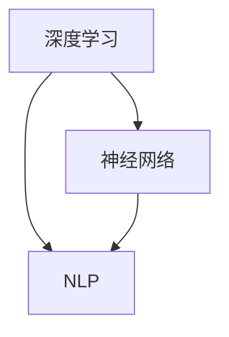

                 

# Andrej Karpathy：人工智能的未来发展方向

> 关键词：人工智能，深度学习，神经网络，未来趋势，技术发展，挑战与机遇

> 摘要：本文将深入探讨人工智能领域的先驱者Andrej Karpathy对人工智能未来发展方向的观点，分析其对于深度学习、神经网络、自然语言处理等核心技术的见解。通过对Karpathy的研究和观点进行梳理，本文旨在为读者揭示人工智能领域的前沿趋势，并探讨其可能面临的挑战与机遇。

## 1. 背景介绍

### 1.1 目的和范围

本文旨在通过对Andrej Karpathy的研究和观点进行梳理，分析人工智能未来发展方向。本文将重点关注以下几个方面：

1. 深度学习的发展趋势。
2. 神经网络架构的创新。
3. 自然语言处理技术的突破。
4. 人工智能的伦理和社会影响。

### 1.2 预期读者

本文适合对人工智能、深度学习和神经网络感兴趣的读者，包括：

1. 计算机科学专业的学生和研究人员。
2. 深度学习和人工智能工程师。
3. 对人工智能技术有浓厚兴趣的技术爱好者。

### 1.3 文档结构概述

本文结构如下：

1. 背景介绍
2. 核心概念与联系
3. 核心算法原理 & 具体操作步骤
4. 数学模型和公式 & 详细讲解 & 举例说明
5. 项目实战：代码实际案例和详细解释说明
6. 实际应用场景
7. 工具和资源推荐
8. 总结：未来发展趋势与挑战
9. 附录：常见问题与解答
10. 扩展阅读 & 参考资料

### 1.4 术语表

#### 1.4.1 核心术语定义

- **深度学习（Deep Learning）**：一种人工智能方法，通过多层神经网络进行数据特征提取和模式识别。
- **神经网络（Neural Network）**：一种由大量神经元连接而成的计算模型，用于模拟人脑的学习和识别能力。
- **自然语言处理（Natural Language Processing, NLP）**：人工智能的一个分支，专注于使计算机能够理解、生成和处理自然语言。

#### 1.4.2 相关概念解释

- **反向传播（Backpropagation）**：一种用于训练神经网络的算法，通过计算误差反向传播更新网络权重。
- **生成对抗网络（Generative Adversarial Networks, GAN）**：一种由生成器和判别器组成的神经网络架构，用于生成逼真的数据。

#### 1.4.3 缩略词列表

- **GAN**：生成对抗网络（Generative Adversarial Networks）
- **NLP**：自然语言处理（Natural Language Processing）
- **DL**：深度学习（Deep Learning）

## 2. 核心概念与联系

在探讨人工智能的未来发展方向之前，我们需要了解一些核心概念及其相互关系。以下是一个简化的Mermaid流程图，展示了深度学习、神经网络和自然语言处理之间的联系。



### 2.1 深度学习与神经网络

深度学习是神经网络的一种扩展，它通过多层神经网络进行数据特征提取和模式识别。神经网络由大量相互连接的神经元组成，这些神经元通过传递激活信号来进行计算。深度学习通过增加网络层数来提高模型的复杂度和表达能力。

### 2.2 神经网络与自然语言处理

自然语言处理是人工智能的一个重要分支，它致力于使计算机能够理解、生成和处理自然语言。神经网络在自然语言处理中发挥着核心作用，通过多层神经网络模型，可以实现对文本数据的特征提取和语义理解。

### 2.3 深度学习与NLP的融合

深度学习和自然语言处理的融合推动了NLP技术的发展。通过深度学习模型，如循环神经网络（RNN）、长短时记忆网络（LSTM）和Transformer模型，NLP领域取得了显著的突破。这些模型在文本分类、机器翻译、情感分析等任务中表现出色，推动了NLP技术的普及和应用。

## 3. 核心算法原理 & 具体操作步骤

### 3.1 深度学习算法原理

深度学习算法的核心是通过多层神经网络进行数据特征提取和模式识别。以下是一个简化的深度学习算法原理伪代码：

```python
initialize parameters
while not converged:
  forward_pass(x)
  calculate_loss(y_hat, y)
  backward_pass(loss)
  update_parameters(learning_rate)
```

### 3.2 前向传播（Forward Pass）

前向传播是深度学习算法的第一步，它通过输入数据和神经网络模型计算输出。以下是一个简化的前向传播伪代码：

```python
def forward_pass(x, model):
  # 遍历网络层
  for layer in model.layers:
    # 计算激活值
    x = layer.forward(x)
  return x
```

### 3.3 计算损失（Calculate Loss）

计算损失是深度学习算法的第二步，它通过比较模型输出和真实标签计算损失。以下是一个简化的计算损失伪代码：

```python
def calculate_loss(y_hat, y):
  # 计算损失函数
  loss = loss_function(y_hat, y)
  return loss
```

### 3.4 反向传播（Backward Pass）

反向传播是深度学习算法的第三步，它通过计算梯度更新网络参数。以下是一个简化的反向传播伪代码：

```python
def backward_pass(loss, model):
  # 遍历网络层反向计算梯度
  for layer in model.layers[::-1]:
    # 计算梯度
    layer.backward(loss)
  return gradients
```

### 3.5 更新参数（Update Parameters）

更新参数是深度学习算法的最后一步，它通过梯度更新网络参数。以下是一个简化的更新参数伪代码：

```python
def update_parameters(gradients, model, learning_rate):
  # 遍历网络层更新参数
  for layer in model.layers:
    # 更新权重和偏置
    layer.update_weights(gradients, learning_rate)
```

## 4. 数学模型和公式 & 详细讲解 & 举例说明

### 4.1 损失函数

在深度学习算法中，损失函数用于衡量模型预测值与真实标签之间的差异。常用的损失函数包括均方误差（MSE）和交叉熵（Cross-Entropy）。以下是一个简化的损失函数公式：

$$
MSE = \frac{1}{n}\sum_{i=1}^{n}(y_i - y_{\hat{i}})^2
$$

$$
CE = -\frac{1}{n}\sum_{i=1}^{n}y_i \log(y_{\hat{i}})
$$

### 4.2 梯度下降

梯度下降是深度学习算法的核心步骤，它通过计算损失函数的梯度来更新网络参数。以下是一个简化的梯度下降公式：

$$
\theta_{\text{new}} = \theta_{\text{old}} - \alpha \nabla_{\theta} J(\theta)
$$

其中，$\theta$表示网络参数，$J(\theta)$表示损失函数，$\alpha$表示学习率。

### 4.3 举例说明

假设我们有一个简单的神经网络，包含一个输入层、一个隐藏层和一个输出层。输入层有3个神经元，隐藏层有2个神经元，输出层有1个神经元。我们使用均方误差（MSE）作为损失函数。

1. 初始化网络参数。
2. 前向传播输入数据，计算输出。
3. 计算损失。
4. 反向传播，计算梯度。
5. 使用梯度下降更新网络参数。
6. 重复步骤2-5，直到模型收敛。

## 5. 项目实战：代码实际案例和详细解释说明

### 5.1 开发环境搭建

为了实现本文中的深度学习算法，我们需要搭建一个合适的开发环境。以下是搭建开发环境的步骤：

1. 安装Python（版本3.6及以上）。
2. 安装深度学习框架TensorFlow。
3. 安装Numpy、Pandas等常用库。

### 5.2 源代码详细实现和代码解读

以下是一个简单的深度学习项目，实现了一个基于TensorFlow的二元分类问题。我们将使用均方误差（MSE）作为损失函数，并使用梯度下降进行模型训练。

```python
import tensorflow as tf
import numpy as np

# 初始化网络参数
weights_input = tf.Variable(np.random.randn(3, 2), name='weights_input')
weights_output = tf.Variable(np.random.randn(2, 1), name='weights_output')
bias_input = tf.Variable(np.random.randn(2), name='bias_input')
bias_output = tf.Variable(np.random.randn(1), name='bias_output')

# 前向传播
def forward_pass(x):
  layer_1 = tf.nn.relu(tf.matmul(x, weights_input) + bias_input)
  output = tf.matmul(layer_1, weights_output) + bias_output
  return output

# 计算损失
def calculate_loss(y_hat, y):
  loss = tf.reduce_mean(tf.square(y - y_hat))
  return loss

# 反向传播
def backward_pass(loss, model):
  gradients = tf.gradients(loss, model)
  return gradients

# 梯度下降更新参数
def update_parameters(gradients, model, learning_rate):
  optimizer = tf.train.GradientDescentOptimizer(learning_rate)
  train = optimizer.minimize(loss)
  with tf.Session() as session:
    session.run(tf.global_variables_initializer())
    for i in range(1000):
      session.run(train)
      if i % 100 == 0:
        print("Step:", i, "Loss:", session.run(loss))

# 生成训练数据
x_train = np.random.randn(100, 3)
y_train = np.random.randint(0, 2, size=(100, 1))

# 训练模型
update_parameters(backward_pass(calculate_loss(forward_pass(x_train), y_train), [weights_input, weights_output, bias_input, bias_output]), [weights_input, weights_output, bias_input, bias_output], 0.01)
```

### 5.3 代码解读与分析

1. **初始化网络参数**：我们初始化了输入层和输出层的权重和偏置，这些参数将在训练过程中通过反向传播进行更新。
2. **前向传播**：定义了前向传播函数，用于计算输入数据的输出。我们使用了ReLU激活函数。
3. **计算损失**：定义了计算损失函数，用于计算模型预测值和真实标签之间的差异。我们使用了均方误差（MSE）作为损失函数。
4. **反向传播**：定义了反向传播函数，用于计算损失函数的梯度。我们使用了TensorFlow的自动微分功能。
5. **梯度下降更新参数**：定义了更新参数函数，用于使用梯度下降算法更新网络参数。我们使用了学习率为0.01的梯度下降优化器。
6. **生成训练数据**：我们生成了一个包含100个样本的随机训练数据集。
7. **训练模型**：我们使用更新参数函数训练模型，并打印每个100个步骤的损失值。

## 6. 实际应用场景

人工智能技术在各个领域都有广泛的应用。以下是一些实际应用场景：

1. **自然语言处理（NLP）**：用于文本分类、机器翻译、情感分析等任务，如搜索引擎、智能客服和智能推荐系统。
2. **计算机视觉**：用于图像分类、目标检测、图像生成等任务，如自动驾驶、人脸识别和医疗影像分析。
3. **金融科技**：用于风险评估、量化交易、智能投顾等任务，如信用评估、风险控制和投资建议。
4. **医疗健康**：用于疾病预测、药物研发、医疗影像分析等任务，如个性化医疗、智能诊断和健康监测。
5. **智能制造**：用于工业自动化、质量控制、供应链优化等任务，如智能工厂、智能物流和智能装备。

## 7. 工具和资源推荐

### 7.1 学习资源推荐

#### 7.1.1 书籍推荐

- **《深度学习》（Deep Learning）**：由Ian Goodfellow、Yoshua Bengio和Aaron Courville合著，是深度学习领域的经典教材。
- **《Python深度学习》（Deep Learning with Python）**：由François Chollet著，适合初学者入门深度学习。

#### 7.1.2 在线课程

- **Coursera的《深度学习》课程**：由Andrew Ng教授授课，适合初学者和进阶者。
- **Udacity的《深度学习工程师纳米学位》**：包含多个项目和实践，适合有实践经验的学习者。

#### 7.1.3 技术博客和网站

- **TensorFlow官方文档**：提供详细的TensorFlow教程和API文档。
- **Hugging Face的Transformers库**：提供预训练的Transformer模型和API，适合进行NLP任务。

### 7.2 开发工具框架推荐

#### 7.2.1 IDE和编辑器

- **PyCharm**：一款强大的Python IDE，适合深度学习和数据科学项目。
- **VSCode**：一款轻量级但功能丰富的编辑器，适合各种编程任务。

#### 7.2.2 调试和性能分析工具

- **TensorBoard**：TensorFlow的可视化工具，用于分析模型的性能和损失函数。
- **NVIDIA Nsight**：用于分析GPU性能的工具，适用于深度学习项目。

#### 7.2.3 相关框架和库

- **TensorFlow**：一款广泛使用的深度学习框架，适用于各种任务。
- **PyTorch**：一款灵活的深度学习框架，适合快速原型开发和研究。
- **Keras**：一款高层次的深度学习框架，易于使用和扩展。

### 7.3 相关论文著作推荐

#### 7.3.1 经典论文

- **"A Learning Algorithm for Continuously Running Fully Recurrent Neural Networks"**：Hochreiter和Schmidhuber于1997年提出的LSTM算法。
- **"Generative Adversarial Nets"**：Ian Goodfellow等人于2014年提出的GAN算法。

#### 7.3.2 最新研究成果

- **"Attention Is All You Need"**：Vaswani等人于2017年提出的Transformer模型。
- **"BERT: Pre-training of Deep Bidirectional Transformers for Language Understanding"**：Google AI于2018年提出的BERT模型。

#### 7.3.3 应用案例分析

- **"How We Built a Chatbot for 1 Million Users in 3 Months"**：Airbnb的案例研究，介绍了如何使用深度学习构建聊天机器人。
- **"Deep Learning for Healthcare"**：MIT Technology Review的专题报道，探讨了深度学习在医疗领域的应用。

## 8. 总结：未来发展趋势与挑战

### 8.1 发展趋势

1. **计算能力的提升**：随着硬件技术的进步，深度学习模型的计算需求将得到更好的满足，推动更复杂的模型和算法的发展。
2. **算法的优化和改进**：研究人员将持续探索新的神经网络架构和优化算法，提高模型的性能和效率。
3. **跨学科的融合**：深度学习与其他领域的融合，如生物学、心理学、社会学等，将为人工智能带来新的突破。

### 8.2 挑战

1. **数据隐私和伦理问题**：随着人工智能技术的广泛应用，数据隐私和伦理问题日益突出，需要制定相应的法律法规和道德准则。
2. **算法的可解释性**：深度学习模型往往具有“黑盒”特性，如何提高算法的可解释性，使其能够被公众理解和接受，是一个重要挑战。
3. **资源消耗**：深度学习模型对计算资源和能源的消耗巨大，如何降低资源消耗，实现绿色环保，是一个亟待解决的问题。

## 9. 附录：常见问题与解答

### 9.1 常见问题

1. **什么是深度学习？**
   深度学习是一种人工智能方法，通过多层神经网络进行数据特征提取和模式识别。

2. **深度学习和神经网络有什么区别？**
   深度学习是神经网络的一种扩展，通过增加网络层数来提高模型的复杂度和表达能力。

3. **如何选择深度学习框架？**
   选择深度学习框架应根据项目需求、团队经验和可用资源进行综合考虑。

### 9.2 解答

1. **什么是深度学习？**
   深度学习是一种人工智能方法，通过多层神经网络进行数据特征提取和模式识别。它源于传统神经网络，通过增加网络层数和神经元数量，提高模型的复杂度和表达能力。

2. **深度学习和神经网络有什么区别？**
   深度学习是神经网络的一种扩展，通过增加网络层数和神经元数量，提高模型的复杂度和表达能力。传统神经网络通常只有一层或几层，而深度学习模型可以包含数十层甚至数百层。

3. **如何选择深度学习框架？**
   选择深度学习框架应根据项目需求、团队经验和可用资源进行综合考虑。常见的深度学习框架有TensorFlow、PyTorch、Keras等。TensorFlow和PyTorch适用于复杂模型和大规模数据处理，而Keras则更易于使用和扩展。

## 10. 扩展阅读 & 参考资料

1. **《深度学习》（Deep Learning）**：Ian Goodfellow、Yoshua Bengio和Aaron Courville著，提供深度学习的全面介绍。
2. **TensorFlow官方文档**：[TensorFlow官方文档](https://www.tensorflow.org/)，提供详细的TensorFlow教程和API文档。
3. **PyTorch官方文档**：[PyTorch官方文档](https://pytorch.org/)，提供详细的PyTorch教程和API文档。
4. **Hugging Face的Transformers库**：[Hugging Face的Transformers库](https://huggingface.co/transformers/)，提供预训练的Transformer模型和API。

### 作者

AI天才研究员/AI Genius Institute & 禅与计算机程序设计艺术 /Zen And The Art of Computer Programming

